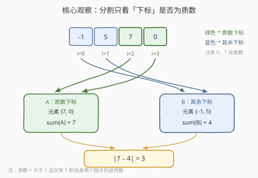
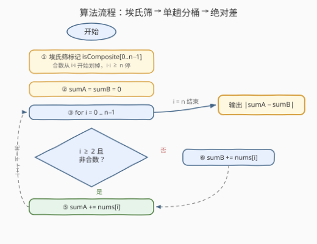

# LeetCode 根据质数下标分割数组 题解

## 1. 题目概述

- **标题 / 题号**：根据质数下标分割数组（#3618，medium）
- **链接**：https://leetcode.cn/problems/split-array-by-prime-indices/
- **难度**：中等
- **标签**：数组、数学、数论

**题意**：给你一个整数数组 `nums`。根据以下规则将 `nums` 分割成两个数组 `A` 和 `B`：

- `nums` 中位于**质数下标**的元素必须放入数组 `A`；
- 所有其他元素必须放入数组 `B`。

返回两个数组和的**绝对**差值：$|sum(A) - sum(B)|$。

**质数**是一个大于 1 的自然数，它只有两个因子：1 和它本身。注意：空数组的和为 0。

**示例 1**：

```text
输入：nums = [2,3,4]
输出：1
解释：数组中唯一的质数下标是 2，所以 nums[2] = 4 被放入数组 A。
其余元素 nums[0] = 2 和 nums[1] = 3 被放入数组 B。
sum(A) = 4，sum(B) = 2 + 3 = 5，绝对差值是 |4 − 5| = 1。
```

**示例 2**：

```text
输入：nums = [-1,5,7,0]
输出：3
解释：数组中的质数下标是 2 和 3，所以 nums[2] = 7 和 nums[3] = 0 被放入数组 A。
其余元素 nums[0] = -1 和 nums[1] = 5 被放入数组 B。
sum(A) = 7 + 0 = 7，sum(B) = -1 + 5 = 4，绝对差值是 |7 − 4| = 3。
```

**约束**：

- $1 \le nums.length \le 10^5$
- $-10^9 \le nums[i] \le 10^9$

> 💡 **审题关键**：① 分割规则只依赖**下标**，与元素值毫无关系——先看清这一点，就不会去对元素做任何判断；② 质数定义「大于 1」——下标 `0` 和 `1` 恒进 B；③ 当 `n ≤ 2` 时不存在任何质数下标，`A` 为空数组，`sum(A) = 0`；④ 溢出：$10^5$ 个 $|nums[i]| \le 10^9$ 的元素求和，量级达 $10^{14}$，**C++ 必须用 `long long`**；⑤ 返回的是绝对差，天然非负，无需再取 `max(0, ·)`。

## 2. 解题思路

### 2.1 暴力思路：逐下标试除判质数

最直接的做法：遍历每个下标 `i`，用**试除法**（拿 $2 \sim \sqrt{i}$ 的整数逐个除）判断 `i` 是否为质数，再决定 `nums[i]` 进哪个桶。单次判定 $O(\sqrt{i})$，全部下标合计 $O(n\sqrt{n})$——$n = 10^5$ 时约 $3 \times 10^7$ 次除法，勉强能过但纯属浪费。

浪费的根源在于：**要判质数的对象是连续区间 $[0, n-1]$ 里的每一个整数**，而试除法把「判一个数」当成孤立任务反复从 2 除起。连续区间内全体整数的质性判定，正是**筛法**的主场——一次性把所有合数划掉，剩下未划掉的即是质数。

> ⚠️ 还有一个更隐蔽的坑：判的是下标而非元素。若手滑写成对 `nums[i]` 判质数，示例 1 会把 `2`（质数元素）误判进 A——读题时务必圈出「**质数下标**」四个字。

### 2.2 核心观察：埃氏筛预处理下标质性 + 一次遍历分桶



**观察一：质性只需要算一次，对象是下标区间。** 用**埃拉托斯特尼筛**对 $[0, n-1]$ 做一遍预处理：`isComposite[i]` 标记 `i` 是否为合数，复杂度 $O(n \log\log n)$。之后每个下标的质性查询是 $O(1)$——把「批量判质数」从每次 $O(\sqrt{n})$ 摊薄到近乎免费。

**观察二：分桶可以坍缩成两个累加器。** 题目只关心两个和，不必真的构造数组 A、B。维护 `sumA`、`sumB` 两个累加器单趟扫完即可；更进一步，`sumB = total − sumA`，答案可写成 $|2 \cdot sumA - \text{total}|$——一个累加器也够用。

**观察三：`0`、`1` 的特判被筛法天然吸收。** 埃氏筛从 2 开始工作，永远不会标记 `0` 和 `1`，因此判定条件写成「$i \ge 2$ 且 `!isComposite[i]`」即可，无需任何前置分支。`n ≤ 2` 时循环体里 `sumA` 恒为 0，「空数组和为 0」的边界自动成立。

> 💡 一句话：本题 = 「204 计数质数的埃氏筛」+ 「一遍扫描分桶求和」。算法本身不难，考点在于**识别出质性判定的批量属性**与**下标溢出边界**两处基本功。

### 2.3 算法流程图



**逻辑执行步骤**：

| 步骤 | 操作 | 说明 |
|------|------|------|
| ① 埃氏筛 | `isComposite[0..n-1]` 全 0；`i` 从 2 起，`i·i < n` 时把 $i^2, i^2+i, i^2+2i, \dots$ 标为合数 | 每个合数只被其质因子划掉；$i^2 \ge n$ 后区间内再无可筛对象 |
| ② 初始化 | `sumA = sumB = 0` | 两个累加器对应两个桶 |
| ③ 遍历 | `for i = 0 .. n−1` | 单趟扫描，每个下标只走一次分支 |
| ④ 判定 | `i ≥ 2` 且 `!isComposite[i]`？ | 是 → 质数下标；否 → 其余下标（含 0、1） |
| ⑤⑥ 分桶 | 是则 `sumA += nums[i]`，否则 `sumB += nums[i]` | 累加器替代真实数组，省去建桶开销 |
| ⑦ 收尾 | 返回 `|sumA − sumB|` | 绝对差非负 |

> ⚠️ 步骤①的两处细节：内层从 $i^2$ 而非 $2i$ 起筛——小于 $i^2$ 的合数必有更小质因子，已被前轮筛过；外层条件是 `i·i < n` 而非 `i < n`——最小质因子超过 $\sqrt{n}$ 的合数必然 $\ge n$，不存在于下标区间内。

### 2.4 示例演算（示例 2：nums = [-1, 5, 7, 0]）

`n = 4`，埃氏筛阶段 `i = 2` 时 `2·2 = 4 ≥ 4` 直接结束，`isComposite` 全空（下标 2、3 均为质数）。分桶累加过程：

| i | nums[i] | 质数下标？ | 归属 | 累计 sumA | 累计 sumB |
|---|---------|-----------|------|-----------|-----------|
| 0 | −1 | 否（0 < 2） | B | 0 | −1 |
| 1 | 5 | 否（1 非质数） | B | 0 | 4 |
| 2 | 7 | **是**（质数） | A | 7 | 4 |
| 3 | 0 | **是**（质数） | A | 7 | 4 |

输出 $|7 - 4| = 3$，与示例一致。注意 `nums[3] = 0` 虽是 0，但**下标 3 是质数**，仍进 A——再次印证「看下标不看值」。

## 3. 参考代码

### C++

```cpp
class Solution {
public:
    long long splitArray(vector<int>& nums) {
        int n = nums.size();
        vector<char> isComposite(n, 0);
        for (int i = 2; (long long)i * i < n; ++i) {
            if (!isComposite[i]) {
                for (int j = i * i; j < n; j += i) isComposite[j] = 1;
            }
        }

        long long sumA = 0, sumB = 0;
        for (int i = 0; i < n; ++i) {
            if (i >= 2 && !isComposite[i]) sumA += nums[i];
            else                           sumB += nums[i];
        }
        return llabs(sumA - sumB);
    }
};
```

> 💡 **写法要点**：
> - 累加器与返回值都用 `long long`：总和量级 $10^5 \times 10^9 = 10^{14}$，超出 `int`（约 $2.1 \times 10^9$）；函数签名已声明 `long long`，照用即可。
> - `isComposite` 用 `vector<char>` 而非 `vector<bool>`：语义直白、无位运算歧义；内存敏感时可换 `vector<bool>` 或 `bitset` 压缩 8 倍。
> - `(long long)i * i < n`：`i` 本身小于 $\sqrt{n} \le 317$，平方不会溢出，但显式转换是好习惯，`n` 上界变大时也不翻车。
> - 判定条件 `i >= 2 && !isComposite[i]` 把 0、1 的特判融进同一个表达式，无前置分支。

### Python

```python
class Solution:
    def splitArray(self, nums: List[int]) -> int:
        n = len(nums)
        is_composite = [False] * n
        i = 2
        while i * i < n:
            if not is_composite[i]:
                for j in range(i * i, n, i):
                    is_composite[j] = True
            i += 1

        sum_a = sum_b = 0
        for i, x in enumerate(nums):
            if i >= 2 and not is_composite[i]:
                sum_a += x
            else:
                sum_b += x
        return abs(sum_a - sum_b)
```

> 💡 **写法要点**：
> - `while i * i < n` 对应埃氏筛外层的剪枝：`n ≤ 4`（下标 0..3）时筛循环一次都不执行，2、3 直接按质数处理，正确。
> - `enumerate(nums)` 同时拿下标与元素，正是本题「下标与值都要用」的天然写法。
> - Python 整数无宽度限制，`abs(sum_a - sum_b)` 无溢出之虞；追求极简可写成 `return abs(2 * sum_a - total)`。

## 4. 复杂度分析

| 维度 | 复杂度 | 说明 |
|------|--------|------|
| **时间复杂度** | $O(n \log\log n)$ | 埃氏筛 $O(n \log\log n)$ + 单趟分桶遍历 $O(n)$，前者占主导 |
| **空间复杂度** | $O(n)$ | `isComposite` 标记数组；用 `vector<bool>` / `bitset` 可压至 $O(n/64)$ |

> - 对比暴力试除的 $O(n\sqrt{n})$：$n = 10^5$ 时筛法约 $2 \times 10^5$ 次标记操作，试除约 $3 \times 10^7$ 次除法，两个数量级的差距。
> - 调和级数 $\sum_{p \le n,\ p\text{质}} n/p \approx n \ln\ln n$ 是筛法复杂度的来源：质数越稀疏，均摊每个数的标记次数越接近 1。

## 5. 扩展：筛法的两种升级与一个变体

**线性筛（欧拉筛）：严格 $O(n)$。** 埃氏筛中一个合数会被它的每个质因子各筛一次（如 12 被 2 和 3 各划一次）。线性筛保证**每个合数只被其最小质因子筛掉恰好一次**：外层遍历 `i`，内层遍历已收集的质数表，`i * p` 超界或 `p` 整除 `i` 时中断。$n = 10^5$ 时两者差异可忽略；$n \ge 10^7$ 或需要顺便得到每个数的最小质因子（用于质因数分解）时，线性筛是标配。

**bitset 优化空间。** `isComposite` 本质是一堆布尔标记，用 `bitset<N>` 或 `vector<bool>` 按位存储，空间除以字长（64），对 $10^9$ 级别的筛范围（如 204 的加强版）是能否开下数组的关键。

**前缀和变体：区间询问。** 若题目改为多次询问「任意区间 $[l, r]$ 内质数下标的元素和」，预处理前缀和 $pre[i] = pre[i-1] + (i\ \text{为质数下标} ? nums[i] : 0)$，每次询问 $O(1)$ 回答 $pre[r] - pre[l-1]$——筛法产物 + 前缀和，是「批量质性 + 区间统计」类问题的标准两件套。

## 6. 面试要点

**Q1：为什么整体用筛法，而不是对每个下标单独试除判质数？**

> 试除判单个数是 $O(\sqrt{i})$，对全部下标累计 $O(n\sqrt{n})$，$n = 10^5$ 时约 $3 \times 10^7$ 次除法；埃氏筛 $O(n \log\log n)$ 把整段区间一次筛完，之后每次查询 $O(1)$。核心判断依据是「判质数的对象是否为**连续区间内的全体整数**」——是则筛法，孤立大数则试除（或 Miller–Rabin）。

**Q2：下标 0 和 1 怎么处理？为什么它们不是质数？**

> 质数定义为**大于 1** 且仅有 1 和自身两个因子的自然数；0 有无穷多个因子，1 只有一个因子，均不符合。代码里判定条件 `i >= 2 && !isComposite[i]` 一并覆盖；埃氏筛从 2 起步，天然不会误标 0、1。由此推论 `n ≤ 2` 时 A 恒为空，`sum(A) = 0`。

**Q3：这题有溢出风险吗？**

> 有。$n \le 10^5$、$|nums[i]| \le 10^9$，单侧和最大 $10^{14}$，差值最大 $2 \times 10^{14}$，均超出 32 位 `int`。C++ 中累加器、中间量、返回值都要 `long long`（`llabs` 取绝对值）；Python 原生大整数无此问题。这是本题最容易翻车的失分点。

**Q4：埃氏筛为什么从 $i^2$ 开始标记？外层为什么 $i \cdot i < n$ 就够？**

> 小于 $i^2$ 的合数 $i \cdot k$（$k < i$）必有小于 $i$ 的质因子，已在更早的轮次被划掉，从 $i^2$ 起才可能出现「最小质因子恰为 $i$」的合数。外层方面，区间内合数 $j < n$ 的最小质因子 $p$ 满足 $p^2 \le j < n$，故 $p \cdot p < n$ 之外不存在需要处理的质数——两个条件共同保证「不漏筛、不空转」。

**Q5：本题与 204 计数质数是什么关系？**

> 204 是埃氏筛的原型题（统计 `< n` 的质数个数），本题的筛法部分与它几乎逐行相同；差异只在筛出质数集合之后的用途——204 拿去**计数**，本题拿质数当**下标选择器**驱动分桶。同一份筛法代码，配合不同后处理，就能长出 762（判二进制 1 的个数的质性）、2614（判对角线元素的质性）等一整族题。

> 💡 **一句话总结**：3618 = 埃氏筛（204 模板）+ 单趟分桶求和。带走的三个细节：判的是**下标**不是值、累加器用 `long long`、`i ≥ 2` 把 0/1 特判收进主条件。

## 同类练习题

| # | 题目 | 与本题的关联 |
|---|------|-------------|
| 204 | [计数质数](https://leetcode.cn/problems/count-primes/) | 埃氏筛原型题，本题筛法部分可直接复用 |
| 762 | [二进制表示中质数个计算置位数](https://leetcode.cn/problems/prime-number-of-set-bits-in-binary-representation/) | 判质数对象范围极小，打表优于筛法，体会规模对做法选择的影响 |
| 2614 | [对角线上的素数](https://leetcode.cn/problems/prime-in-diagonal/) | 质数判定对象从下标换成对角线元素本身，改为逐个试除更直接 |
| 2521 | [数组乘积中的不同质因数](https://leetcode.cn/problems/distinct-prime-factors-of-product-of-array/) | 从「判质数」进阶到「分解质因数」，同一套数论基本功的加深 |
