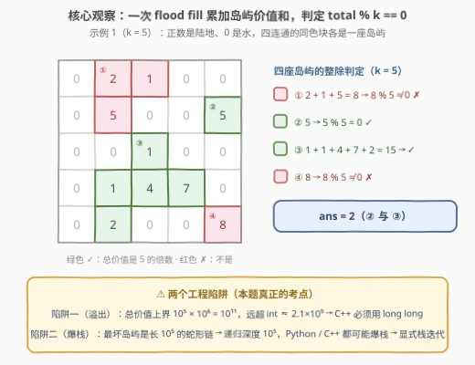
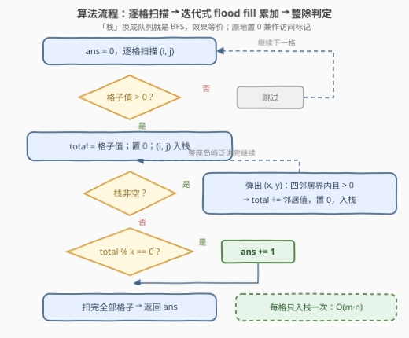

# LeetCode 总价值可以被K整除的岛屿数目 题解

## 1. 题目概述

- **标题 / 题号**：总价值可以被K整除的岛屿数目（#3619，medium）
- **链接**：https://leetcode.cn/problems/count-islands-with-total-value-divisible-by-k/
- **难度**：中等
- **标签**：深度优先搜索、广度优先搜索、并查集、数组、矩阵

**题意**：给你一个 $m \times n$ 的矩阵 `grid` 和一个正整数 $k$。**岛屿**是由**正**整数（表示陆地）组成的、格子间**四周**连通（水平或垂直）的区域；值为 $0$ 的格子是水。

一座岛屿的**总价值**是该岛屿中所有格子的值之和。返回总价值可以被 $k$ **整除**的岛屿数量。

**示例 1**：

```text
输入：grid = [[0,2,1,0,0],[0,5,0,0,5],[0,0,1,0,0],[0,1,4,7,0],[0,2,0,0,8]], k = 5
输出：2
解释：网格中包含四个岛屿。总价值为 5 和 15 的两座岛屿可以被 5 整除；
     总价值为 8 和 8 的另外两座不能。
```

**示例 2**：

```text
输入：grid = [[3,0,3,0],[0,3,0,3],[3,0,3,0]], k = 3
输出：6
解释：六个单格岛屿的总价值均为 3，都能被 3 整除。
```

**约束**：

- $m = \text{grid.length}$，$n = \text{grid[i].length}$
- $1 \le m, n \le 1000$
- $1 \le m \cdot n \le 10^5$
- $0 \le \text{grid[i][j]} \le 10^6$
- $1 \le k \le 10^6$

> 💡 **读题关键**：这是「**网格连通块 + 附带权值统计**」的骨架——flood fill 找四连通块只是外壳，真正拉开区分度的是两个工程细节：**总和会溢出 32 位整数**（C++ 必须 `long long`）与**最坏递归深度可达 $10^5$**（迭代写法防爆栈）。此外注意与 200 题的语义差异：本题**正数是陆地、0 是水**，恰好让「原地置 0」天然充当访问标记。

## 2. 解题思路

### 2.1 暴力思路：对每个陆地格子重扫整座岛屿

最直白的做法：枚举每个正数格子 $(i,j)$，从它出发 flood fill 整座岛屿求和并判定整除性，**不记忆任何中间结果**。同一座大小为 $s$ 的岛屿会被完整遍历 $s$ 次——最坏情形是单个岛屿占满整个网格（$s = m \cdot n = 10^5$），总代价 $O((mn)^2) = 10^{10}$，不可行。

浪费的根源在于：**一个格子自始至终只属于一座岛屿**。只要给访问过的格子打上标记（或原地置 0），每座岛屿就只会被完整遍历一次，整体降为 $O(mn)$——这正是 200（岛屿数量）的标准套路，本题只是把统计量从「连通块个数」换成「权值和的整除判定」。

### 2.2 核心观察：flood fill 一趟累加价值和 + 两个工程陷阱



**观察一：连通块识别与统计量解耦。** 扫描全部格子，遇到未访问的正数格子即发现一座新岛屿：以它为种子做 flood fill，把整座岛屿的值累加进 `total`，同时把走过的格子**原地置 0**（既是访问标记，又与「0 是水」的语义自洽）。栈空后一趟结束，判定 `total % k == 0` 即可计入答案。

**观察二：总和会溢出 32 位整数。** $mn \le 10^5$ 且 $grid[i][j] \le 10^6$，单座岛屿总价值上界为 $10^5 \times 10^6 = 10^{11}$，而 `int` 上界约 $2.1 \times 10^9$——差近 50 倍，用 `int` 累加必然溢出（C++ 中是未定义行为）。**C++ 必须用 `long long`**；Python 原生大整数无此虞。

**观察三：递归 DFS 有爆栈风险。** 最坏情形岛屿是一条长 $10^5$ 的蛇形链，递归深度即 $10^5$：Python 默认递归上限 1000 直接 `RecursionError`；C++ 每帧数十字节、默认栈 1~8 MB，也处于溢出边缘。用**显式栈或队列的迭代写法**把「深度」转移到堆上，彻底规避。

> 💡 一句话：**骨架是 200 题，考点在溢出与递归深度**。把统计量换成 `long long` 累加和、把递归换成显式栈，本题就完成了。

### 2.3 算法流程图



**逻辑执行步骤**：

| 步骤 | 操作 | 说明 |
|------|------|------|
| ① 扫描 | 双重循环枚举格子 $(i,j)$ | 已访问（已置 0）的格子自动被 `> 0` 判据跳过 |
| ② 发现 | 格子值 $> 0$ → 记入 `total`，置 0，入栈 | 一座新岛屿的种子 |
| ③ 泛洪 | 弹出栈顶 $(x,y)$，四方向邻居「界内且 $> 0$」→ 累加、置 0、入栈 | 置 0 发生在**入栈时**，杜绝重复入栈 |
| ④ 判定 | 栈空后检查 `total % k == 0` | 成立则 `ans += 1` |
| ⑤ 收尾 | 所有格子扫完，返回 `ans` | 每格只入栈/出栈一次 |

### 2.4 示例演算

以示例 1（$k=5$）走查，四座岛屿的判定过程：

| 岛屿 | 格子（值） | 总价值 | 判定（$\div 5$） |
|------|-----------|--------|------------------|
| ① | $(0,1)=2,\ (0,2)=1,\ (1,1)=5$ | $8$ | ✗ |
| ② | $(1,4)=5$ | $5$ | ✓ |
| ③ | $(2,2)=1,\ (3,1)=1,\ (3,2)=4,\ (3,3)=7,\ (4,1)=2$ | $15$ | ✓ |
| ④ | $(4,4)=8$ | $8$ | ✗ |

返回 **2**。示例 2 中 6 座岛屿均为单格值 3，$3 \bmod 3 = 0$ 全部计入，返回 **6**。

## 3. 参考代码

### C++

```cpp
class Solution {
public:
    int countIslands(vector<vector<int>>& grid, int k) {
        int m = grid.size(), n = grid[0].size(), ans = 0;
        const int dx[4] = {1, -1, 0, 0}, dy[4] = {0, 0, 1, -1};
        for (int i = 0; i < m; ++i)
            for (int j = 0; j < n; ++j)
                if (grid[i][j] > 0) {                     // 发现一座未统计的岛屿
                    long long total = grid[i][j];         // 陷阱一：总上界 1e11，必须 long long
                    grid[i][j] = 0;                       // 原地置 0 = 访问标记
                    vector<pair<int, int>> stk{{i, j}};
                    while (!stk.empty()) {                // 陷阱二：显式栈，无递归爆栈风险
                        auto [x, y] = stk.back(); stk.pop_back();
                        for (int d = 0; d < 4; ++d) {
                            int nx = x + dx[d], ny = y + dy[d];
                            if (0 <= nx && nx < m && 0 <= ny && ny < n && grid[nx][ny] > 0) {
                                total += grid[nx][ny];
                                grid[nx][ny] = 0;         // 入栈即标记，杜绝重复入栈
                                stk.push_back({nx, ny});
                            }
                        }
                    }
                    ans += (total % k == 0);
                }
        return ans;
    }
};
```

### Python

```python
class Solution:
    def countIslands(self, grid: List[List[int]], k: int) -> int:
        m, n = len(grid), len(grid[0])
        ans = 0
        for i in range(m):
            for j in range(n):
                if grid[i][j] > 0:                    # 发现一座未统计的岛屿
                    total = grid[i][j]                # Python 大整数，无溢出之虞
                    grid[i][j] = 0                    # 原地置 0 = 访问标记
                    stack = [(i, j)]                  # 显式栈，规避递归深度限制
                    while stack:
                        x, y = stack.pop()
                        for nx, ny in ((x + 1, y), (x - 1, y), (x, y + 1), (x, y - 1)):
                            if 0 <= nx < m and 0 <= ny < n and grid[nx][ny] > 0:
                                total += grid[nx][ny]
                                grid[nx][ny] = 0      # 入栈即标记
                                stack.append((nx, ny))
                    ans += total % k == 0
        return ans
```

> 💡 上述解法已与暴力对拍验证：除两个官方示例外，$m, n \le 8$、$grid[i][j] \le 6$、$k \le 7$ 的 3000 组随机用例（递归 DFS 参照实现 + 并查集实现三方对拍）结果完全一致；另以 $1000 \times 100$ 全 $10^6$ 网格验证了 `long long` 不溢出且迭代写法不爆栈。

## 4. 复杂度分析

| 维度 | 复杂度 | 说明 |
|------|--------|------|
| 时间 | $O(m \cdot n)$ | 每个格子至多入栈、出栈各一次；出栈时检查 4 个邻居，总邻居检查数 $\le 4mn$ |
| 空间 | $O(m \cdot n)$ | 最坏情形（蛇形岛屿）显式栈深度达 $mn$；原地置 0 免去 `visited` 数组 |

- 时间上每格常数次操作，$mn = 10^5$ 规模瞬时完成；
- 若不允许修改输入，可加一个 `visited` 矩阵（同为 $O(mn)$ 空间），或先拷贝一份 `grid`。

## 5. 扩展：并查集写法

标签里的第三种工具。每个格子是一个节点，`total` 数组维护**每个根**所在连通块的权值和；合并相邻陆地格时把权值向新根累加。两个细节：

1. **只需向右、向下两个方向 union**——每对相邻关系只会被枚举一次，向左/向上是重复劳动；
2. **统计根时要排除水格子**：水格子从不被合并、自成一根且 `total = 0`，而 $0 \bmod k = 0$ 恒真——不排除会把每个水格子都错算进答案，这是并查集写法最容易踩的坑。

```python
class Solution:
    def countIslands(self, grid: List[List[int]], k: int) -> int:
        m, n = len(grid), len(grid[0])
        fa = list(range(m * n))
        total = [grid[i][j] for i in range(m) for j in range(n)]   # 每格初始权值

        def find(a: int) -> int:
            while fa[a] != a:
                fa[a] = fa[fa[a]]                  # 路径压缩：隔代一跳
                a = fa[a]
            return a

        for i in range(m):
            for j in range(n):
                if grid[i][j] > 0:
                    for x, y in ((i + 1, j), (i, j + 1)):   # 只需向右、向下
                        if x < m and y < n and grid[x][y] > 0:
                            a, b = find(i * n + j), find(x * n + y)
                            if a != b:
                                fa[a] = b
                                total[b] += total[a]

        # 水格子也是自己的根且 total=0（0 % k == 0 为真），必须用 total > 0 排除
        return sum(1 for c in range(m * n)
                   if find(c) == c and total[c] > 0 and total[c] % k == 0)
```

```cpp
class Solution {
public:
    int countIslands(vector<vector<int>>& grid, int k) {
        int m = grid.size(), n = grid[0].size();
        vector<int> fa(m * n);
        vector<long long> total(m * n);
        for (int i = 0; i < m; ++i)
            for (int j = 0; j < n; ++j) {
                int c = i * n + j;
                fa[c] = c;
                total[c] = grid[i][j];
            }
        auto find = [&](int a) {
            while (fa[a] != a) fa[a] = fa[fa[a]], a = fa[a];
            return a;
        };
        const int dx[2] = {1, 0}, dy[2] = {0, 1};
        for (int i = 0; i < m; ++i)
            for (int j = 0; j < n; ++j)
                if (grid[i][j] > 0)
                    for (int d = 0; d < 2; ++d) {          // 只需向右、向下
                        int x = i + dx[d], y = j + dy[d];
                        if (x < m && y < n && grid[x][y] > 0) {
                            int a = find(i * n + j), b = find(x * n + y);
                            if (a != b) fa[a] = b, total[b] += total[a];
                        }
                    }
        int ans = 0;
        for (int c = 0; c < m * n; ++c)                    // 水格子 total=0 也整除，须排除
            if (find(c) == c && total[c] > 0 && total[c] % k == 0) ++ans;
        return ans;
    }
};
```

复杂度 $O(mn \cdot \alpha(mn))$、空间 $O(mn)$，渐进同阶但常数大于 flood fill。**静态网格一次性统计首选 flood fill**；并查集的价值在「动态加陆地 / 批量连通性询问」场景（如 305 号题），本题用它纯属练手。

## 6. 面试要点

**Q1：与 200（岛屿数量）相比，本题「新」在哪里？**

> 骨架完全相同——都是 flood fill 数四连通块；变化只在统计量：200 数连通块个数，本题要对每块累加权值并判定整除性。真正拉开差距的是两个工程细节：总和溢出（Q2）与递归深度（Q3）。另外语义有个小反转：200 是「1 是陆地、0 是水」，本题是「正数是陆地、0 是水」，后者恰好让置 0 兼作访问标记。

**Q2：为什么 C++ 必须用 long long？**

> 约束给 $mn \le 10^5$、$grid[i][j] \le 10^6$，单岛总价值上界 $10^5 \times 10^6 = 10^{11}$，而 `int` 上界约 $2.1 \times 10^9$，差近 50 倍，`int` 累加必然溢出且是未定义行为。`total % k` 中 `k` 为 `int` 时会隐式提升到 `long long` 参与运算，无须显式转换。

**Q3：为什么推荐迭代写法而不是递归 DFS？**

> 最坏岛屿是一条长 $10^5$ 的蛇形链，递归深度即 $10^5$：Python 默认递归上限 1000 直接 `RecursionError`；C++ 每帧几十字节、默认栈 1~8 MB，处于爆栈边缘。显式栈/队列把深度转移到堆上彻底规避。`sys.setrecursionlimit` 大改上限在 Python 中既脆弱（仍受 C 栈制约）又慢（函数调用开销），不作为首选。

**Q4：原地置 0 修改了输入，有什么替代方案？**

> 若不允许副作用，用 `visited` 布尔矩阵（额外 $O(mn)$ 空间），或拷贝一份 `grid` 再遍历。置 0 之所以可行，是因为判据是「$> 0$」：0 既是「水」又天然充当访问标记，一举两得。LeetCode 判题不检查输入是否被改动，算法题可放心用；写库代码时则应避免这种副作用。

**Q5：flood fill 与并查集如何取舍？**

> 静态网格、一次性统计：flood fill 更简单、常数更小（一遍扫描 + O(1) 标记），首选。并查集的优势在**动态加边 / 批量连通性查询**（如 305 在线加陆地数岛屿）；本题用并查集要注意两个坑——只需向右向下 union 以免每条边枚举两次；统计根时必须排除 `total = 0` 的水格子，否则 $0 \bmod k = 0$ 会把每个水格子都算成答案。

> 💡 **一句话总结**：flood fill 找四连通块、`long long` 累加权和、栈空后判 `total % k == 0`——骨架是 200 题，考点全在溢出与递归深度这两个工程细节上。

## 同类练习题

| # | 题目 | 与本题的关联 |
|---|------|-------------|
| 200 | [岛屿数量](https://leetcode.cn/problems/number-of-islands/) | flood fill 数连通块的祖师爷，本题的基础版（统计量从块数换成权和的整除判定） |
| 695 | [岛屿的最大面积](https://leetcode.cn/problems/max-area-of-island/) | 把「面积」换成「总价值」，与本题结构最接近的近亲，练同一个骨架 |
| 463 | [岛屿的周长](https://leetcode.cn/problems/island-perimeter/) | 同一 flood fill 骨架换统计量（边的贡献），体会「遍历时顺带统计」 |
| 1020 | [飞地的数量](https://leetcode.cn/problems/number-of-enclaves/) | flood fill + 附加条件判定（是否触边），巩固「先标记后统计」的两趟写法 |
| 1254 | [统计封闭岛屿的数目](https://leetcode.cn/problems/number-of-closed-islands/) | 与 1020 同族的判定变体，注意其 0/1 陆水语义与本题相反 |
