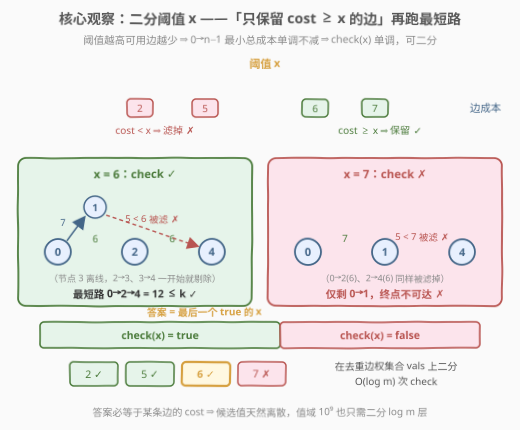
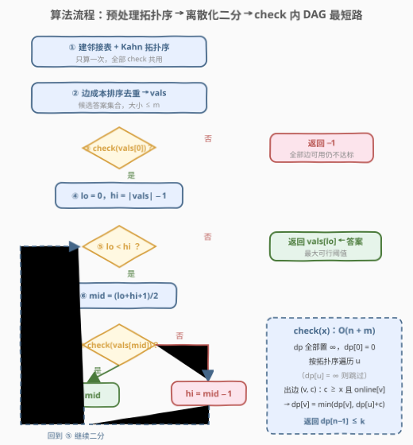
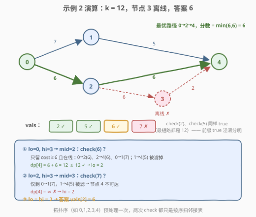

# 恢复网络路径

- **题目名称**：恢复网络路径
- **链接**：[3620. 恢复网络路径](https://leetcode.cn/problems/network-recovery-pathways/)
- **难度**：困难
- **标签**：图、二分查找、拓扑排序、动态规划、最短路

## 1. 题目概述

**题意**：给定 $n$ 个节点（编号 $0 \sim n-1$）的**有向无环图**，`edges[i] = [u_i, v_i, cost_i]` 表示一条从 $u_i$ 到 $v_i$ 的单向边，恢复成本为 $cost_i$。部分节点可能离线：`online[i] = true` 表示节点 $i$ 在线（节点 $0$ 与 $n-1$ **恒在线**）。

一条 $0 \to n-1$ 的路径是**有效路径**，当且仅当：

- 路径上所有**中间节点**都在线；
- 路径上所有边的**总恢复成本** $\le k$。

每条有效路径的**分数** = 路径上**最小边成本**。返回所有有效路径分数中的**最大值**；不存在有效路径返回 $-1$。

**示例 1**：

```text
输入：edges = [[0,1,5],[1,3,10],[0,2,3],[2,3,4]], online = [true,true,true,true], k = 10
输出：3
解释：0→1→3 总成本 15 > 10，无效；0→2→3 总成本 7 ≤ 10，有效，分数 = min(3,4) = 3。
```

**示例 2**：

```text
输入：edges = [[0,1,7],[1,4,5],[0,2,6],[2,3,6],[3,4,2],[2,4,6]],
     online = [true,true,true,false,true], k = 12
输出：6
解释：节点 3 离线，0→2→3→4 作废。0→1→4 成本 12 ≤ 12，分数 5；0→2→4 成本 12 ≤ 12，分数 6。取最大得 6。
```

**约束条件**：

- $2 \le n \le 5 \times 10^4$，$0 \le m \le \min(10^5,\ n(n-1)/2)$
- $0 \le cost_i \le 10^9$，$0 \le k \le 5 \times 10^{13}$
- `online[0]` 与 `online[n-1]` 恒为 `true`；给定的图是 **DAG**

> 💡 **审题关键**：① 目标是**最大化路径上的最小边成本**（瓶颈），总成本 $\le k$ 只是预算约束——两个维度互相牵制（高瓶颈的边往往更贵）；② 「中间节点在线」+ 端点恒在线 ⇒ 等价于「路径上**所有**节点都在线」；③ $k$ 高达 $5 \times 10^{13}$、路径总成本最坏 $10^5 \times 10^9 = 10^{14}$，必须 64 位整数；④ 图保证是 DAG ⇒ 最短路可用拓扑 DP $O(n+m)$ 一遍扫，连 Dijkstra 都不用。

---

## 2. 解题思路

### 2.1 暴力思路：枚举路径 / 单维贪心

**暴力一：枚举所有 $0 \to n-1$ 路径。** DAG 的路径数最坏是指数级（想象分层完全图），每条还要校验在线、预算、算分数——不可行。

**暴力二（常见错误方向）：最大瓶颈路 Dijkstra。** 定义 $dist[v]$ = 到 $v$ 的所有路径中「最小边成本」的最大值，转移取 $\max(\min)$ 跑 Dijkstra。**错在预算 $k$**：分数更高但总成本超支的路径、分数更低但便宜的路径，**互不支配**——谁也不能淘汰谁，贪心不变式被破坏。必须先把其中一个维度「固定」下来，这正是二分的用武之地。

### 2.2 核心观察：最大化最小值 ⇒ 二分答案 + DAG 最短路判定



**观察一（判定比优化容易）**：把「最大分数 $\ge x$ 吗？」变成一个 yes/no 判定——只保留 $cost \ge x$ 且**两端在线**的边，问 $0 \to n-1$ 的**最小总成本**是否 $\le k$。优化问题瞬间退化成「非负权图单源最短路」。

**观察二（单调性 ⇒ 可二分）**：$x$ 增大 ⇒ 边集缩小 ⇒ 最小总成本**单调不减**（删边只会让最短路变更长或无解）。因此 `check(x)` 的 `true` 构成前缀、`false` 构成后缀——标准二分结构，**答案 = 最大的 `true` 对应的 $x$**。

正确性两行论证：设最优分数为 $OPT$。若 $x \le OPT$，最优路径本身的边全满足 $cost \ge OPT \ge x$ 且总成本 $\le k$，故 `check(x) = true`；若 $x > OPT$ 时 `check(x) = true`，则存在全边 $cost \ge x > OPT$、总成本 $\le k$ 的有效路径，与 $OPT$ 的最优性矛盾。故最大的 `true` 恰为 $OPT$。

**观察三（候选值离散化）**：$OPT$ 是某条路径的最小边成本，**必然等于图中某条边的 $cost$**。只需在「去重排序的边成本集合 `vals`」上二分（至多 $m$ 个候选、$\log m \approx 17$ 次 `check`），值域 $10^9$ 完全不用怕。

**观察四（DAG 白送的最短路）**：图保证无环 ⇒ `check` 里的最短路**不用 Dijkstra**，拓扑序一遍 DP 即 $O(n+m)$。更妙的是：**全图的拓扑序对任何边子集仍是合法拓扑序**（子图的边仍是原偏序的子集）⇒ 拓扑序只需预处理一次，17 次 `check` 共用，每次只重建 `dp` 数组。

**离线节点的处理**：端点恒在线，故「所有中间节点在线」⇔「路径上节点全在线」⇒ 松弛时只要求 `online[v]`。又因 `dp[0] = 0` 且节点 $0$ 在线、所有松弛只进在线节点，归纳可得「**`dp` 有限的节点必在线**」——离线节点永远是 $\infty$，自动被跳过。

### 2.3 算法流程图



**文字版步骤**：

| 步骤 | 操作 | 说明 |
|------|------|------|
| ① 预处理 | 建全量邻接表 + Kahn 拓扑序 | **只算一次**，全部 `check` 共用 |
| ② 离散化 | 边成本排序去重 → `vals` | 候选答案集合，大小 $\le m$ |
| ③ 先验判定 | `check(vals[0])` 为 `false` → 返回 $-1$ | 最小阈值 = 保留全部边仍不达标 ⇒ 无解 |
| ④ 初始化 | `lo = 0, hi = \|vals\| − 1` | `lo` 已知可行（③ 已验证） |
| ⑤ 二分循环 | `mid = (lo + hi + 1) / 2`（**上取整**） | 找「最后一个 `true`」防死循环 |
| ⑥ 判定 | `check(vals[mid])`：`true` → `lo = mid`；`false` → `hi = mid − 1` | 单调性保证边界收敛 |
| ⑦ 返回 | `vals[lo]` | 最大可行阈值即答案 |

`check(x)` 内部（$O(n+m)$）：`dp` 全部置 $\infty$、`dp[0] = 0` → 按拓扑序遍历 $u$（`dp[u] = ∞` 则跳过）→ 对每条出边 $(v, c)$：满足 $c \ge x$ 且 `online[v]` 才松弛 `dp[v] = min(dp[v], dp[u] + c)` → 返回 `dp[n−1] ≤ k`。

### 2.4 示例演算：示例 2 的二分收敛



以示例 2（$k = 12$，节点 3 离线）走查，`vals = [2, 5, 6, 7]`：

| 判定 | 保留的边（$cost \ge x$ 且两端在线） | 最短路 | 结果 |
|------|-------------------------------------|--------|------|
| `check(2)` | 0→1(7)、1→4(5)、0→2(6)、2→4(6) | $\min(12, 12) = 12 \le 12$ | ✅ |
| `check(6)` | 0→1(7)、0→2(6)、2→4(6)（1→4 的 5 被滤） | $6 + 6 = 12 \le 12$ | ✅ |
| `check(7)` | 仅 0→1(7) | $4$ 不可达 | ❌ |

二分轨迹：`lo=0, hi=3` → `mid=2`，`check(6)` ✅ → `lo=2` → `mid=3`，`check(7)` ❌ → `hi=2` → 收敛，**答案 `vals[2] = 6`**。

> 💡 注意 `check(6)` 里最短路恰好没变（12），因为被滤掉的 1→4(5) 所在路线总分同为 12——「删边不改变最短路」与「删边让最短路变长」都合法，单调性说的是**不会变更短**。

---

## 3. 参考代码

### C++

```cpp
class Solution {
public:
    int findMaxPathScore(vector<vector<int>>& edges, vector<bool>& online, long long k) {
        int n = online.size();
        int m = edges.size();
        if (m == 0) return -1;

        // 全量邻接表 + 入度
        vector<vector<pair<int, int>>> adj(n);
        vector<int> indeg(n, 0);
        for (auto& e : edges) {
            adj[e[0]].push_back({e[1], e[2]});
            indeg[e[1]]++;
        }

        // Kahn 拓扑序：只算一次，所有 check 共用
        vector<int> order;
        order.reserve(n);
        queue<int> q;
        for (int i = 0; i < n; i++)
            if (indeg[i] == 0) q.push(i);
        while (!q.empty()) {
            int u = q.front(); q.pop();
            order.push_back(u);
            for (auto& [v, c] : adj[u])
                if (--indeg[v] == 0) q.push(v);
        }

        // 候选阈值 = 去重排序的边成本
        vector<int> vals;
        for (auto& e : edges) vals.push_back(e[2]);
        sort(vals.begin(), vals.end());
        vals.erase(unique(vals.begin(), vals.end()), vals.end());

        const long long INF = LLONG_MAX / 4;
        // check(x)：只用 cost >= x 且两端在线的边，求 0 -> n-1 的最小总成本
        auto check = [&](int x) -> bool {
            vector<long long> dp(n, INF);
            dp[0] = 0;
            for (int u : order) {
                if (dp[u] == INF) continue;
                for (auto& [v, c] : adj[u])
                    if (c >= x && online[v] && dp[u] + c < dp[v])
                        dp[v] = dp[u] + c;
            }
            return dp[n - 1] <= k;
        };

        if (!check(vals[0])) return -1;   // 全部边可用仍超预算 / 不连通
        int lo = 0, hi = (int)vals.size() - 1;
        while (lo < hi) {                 // 找最大可行下标
            int mid = lo + (hi - lo + 1) / 2;
            if (check(vals[mid])) lo = mid;
            else hi = mid - 1;
        }
        return vals[lo];
    }
};
```

> 💡 **写法要点**：
> - **拓扑序只算一次**：`check` 只删边不加边，全图拓扑序对任何边子集仍是合法拓扑序，17 次判定全部复用。
> - **`long long` 不可省**：路径总成本最坏 $10^{14}$、$k$ 到 $5 \times 10^{13}$，都远超 `int`。
> - **`INF` 取 `LLONG_MAX / 4`**：$\infty$ 节点被 `continue` 跳过，松弛只发生在有限值上，不会算出 `INF + c`；取 $1/4$ 是双保险。
> - **离线节点零特判**：`dp` 有限 ⇒ 在线（归纳自 `dp[0]=0` 与松弛条件 `online[v]`），离线节点恒为 $\infty$ 自动跳过。
> - **`m == 0` 提前返回**：`vals` 为空则二分无从谈起（$n \ge 2$ 保证任何路径至少含一条边）。

### Python

```python
from collections import deque

class Solution:
    def findMaxPathScore(self, edges: List[List[int]], online: List[bool], k: int) -> int:
        n = len(online)
        if not edges:
            return -1

        adj = [[] for _ in range(n)]
        indeg = [0] * n
        for u, v, c in edges:
            adj[u].append((v, c))
            indeg[v] += 1

        # Kahn 拓扑序：只算一次，所有 check 共用
        order = []
        q = deque(i for i in range(n) if indeg[i] == 0)
        while q:
            u = q.popleft()
            order.append(u)
            for v, _ in adj[u]:
                indeg[v] -= 1
                if indeg[v] == 0:
                    q.append(v)

        vals = sorted({c for _, _, c in edges})
        INF = float("inf")

        def check(x: int) -> bool:
            dp = [INF] * n
            dp[0] = 0
            for u in order:
                if dp[u] == INF:
                    continue
                du = dp[u]
                for v, c in adj[u]:
                    if c >= x and online[v] and du + c < dp[v]:
                        dp[v] = du + c
            return dp[n - 1] <= k

        if not check(vals[0]):
            return -1
        lo, hi = 0, len(vals) - 1
        while lo < hi:                    # 找最大可行下标
            mid = (lo + hi + 1) // 2
            if check(vals[mid]):
                lo = mid
            else:
                hi = mid - 1
        return vals[lo]
```

---

## 4. 复杂度分析

| 维度 | 复杂度 | 说明 |
|------|--------|------|
| **时间复杂度** | $O((n + m) \log m)$ | 预处理 $O(n + m)$；每次 `check` 扫全量邻接表逐边判定（滤边只是跳过）+ 重建 `dp`，共 $O(n + m)$；二分 $O(\log m)$ 次（`vals` 大小 $\le m$） |
| **空间复杂度** | $O(n + m)$ | 邻接表 $O(m)$ + 拓扑序 $O(n)$ + `dp` 数组 $O(n)$ |

> - $n = 5 \times 10^4$、$m = 10^5$、$\log m \approx 17$：总计约 $2.5 \times 10^6$ 次松弛判断，轻松通过。
> - 若 `check` 换成 Dijkstra（图带环时的退路），总复杂度变为 $O((n + m) \log n \cdot \log m)$，本题 DAG 条件下拓扑 DP 是更优选择。

---

## 5. 扩展：变体与对偶

**变体一：图带环怎么办？** 拓扑 DP 失效，`check` 换成堆优化 Dijkstra（边权非负），二分骨架原封不动，总复杂度 $O((n + m) \log n \cdot \log m)$。「猜答案 + 最短路验证」适用于一切非负权图，DAG 只是让判定子问题更便宜。

**变体二：去掉预算约束（$k = +\infty$）。** 退化为纯**最大瓶颈路**：可用 Dijkstra 变体（$dist[v] = \max$ 沿路 $\min$ 边）或无向图时按边权从大到小 Kruskal 加边判连通——正是 [1102. 得分最高的路径](https://leetcode.cn/problems/path-with-maximum-minimum-value/) 的做法。本题的 $k$ 恰是让二分成为最自然解法的原因：**约束无法进贪心，就把它外置成判定**。

**变体三：最小化最大边（对偶方向）。** [1631. 最小体力消耗路径](https://leetcode.cn/problems/path-with-minimum-effort/)、[778. 水位上升的泳池中游泳](https://leetcode.cn/problems/swim-in-rising-water/) 求「最小化路径上的最大边权/最大高度」，同样二分 + 判定，只是滤边条件反过来（只留 $cost \le x$）。模板完全同构，一体两面。

---

## 6. 面试要点

**Q1：凭什么能二分？单调性从哪来？**

> 阈值 $x$ 越大，可用边集越小；删边只会让最短路**不变或变长**，故最小总成本关于 $x$ 单调不减，`check(x)` 的 `true` 构成前缀。更严谨的正确性：$x \le OPT$ 时最优路径仍在（`true`）；$x > OPT$ 时若 `true` 则与 $OPT$ 的最优性矛盾（`false`）。

**Q2：为什么只在边成本集合上二分，而不是在 $[0, 10^9]$ 上连续二分？**

> 答案是某条有效路径的最小边成本，必等于图中某条边的 $cost$——候选值天然离散。去重排序后至多 $m$ 个候选，二分 $\log m$ 次；连续二分不仅次数更多（$\log 10^9 \approx 30$），最后还得处理「收敛值不落在边上」的别扭。

**Q3：在线约束怎么进 `check`？只判 `online[v]` 为什么就够？**

> 节点 $0$ 与 $n-1$ 恒在线，「所有中间节点在线」⇔「路径上所有节点在线」。`dp` 初值只有 `dp[0] = 0`（$0$ 在线），每条松弛都要求 `online[v]`，归纳可得「`dp` 有限 ⇒ 在线」——离线节点恒为 $\infty$，天然被跳过，无需任何特判。

**Q4：拓扑序为什么要提前算好共用，而不是每次 `check` 重建？**

> `check` 只会**删边**不会加边，而全图拓扑序对任何边子集仍是合法拓扑序（子图的边仍满足原偏序）。Kahn 一遍 $O(n+m)$ 的结果可给全部约 17 次 `check` 复用，每次判定只剩「重建 `dp` + 扫邻接表」两件事。

**Q5：溢出与边界有哪些坑？**

> ① 总成本最坏 $10^5 \times 10^9 = 10^{14}$、$k$ 到 $5 \times 10^{13}$，必须 64 位；② $m = 0$ 直接返回 $-1$（`vals` 为空）；③ $cost$ 与 $k$ 都可以为 0，答案可能是 0——别把「答案 $> 0$」当隐含假设；④ 找「最后一个 `true`」必须上取整 `mid = (lo + hi + 1) / 2`，写成下取整在 `lo = hi − 1` 时死循环。

---

## 7. 同类练习题

- [1631. 最小体力消耗路径](https://leetcode.cn/problems/path-with-minimum-effort/)：对偶版「最小化路径最大边权」，二分 + BFS 判连通，模板与本题同构
- [778. 水位上升的泳池中游泳](https://leetcode.cn/problems/swim-in-rising-water/)：二分答案 + DFS/BFS 验证，同款「猜了再验」
- [1102. 得分最高的路径](https://leetcode.cn/problems/path-with-maximum-minimum-value/)：本题去掉预算约束的纯净版「最大化路径最小值」，Dijkstra 变体 / 并查集可解
- [1928. 规定时间内到达终点的最小花费](https://leetcode.cn/problems/minimum-cost-to-reach-destination-in-time/)：预算作为约束维度的最短路，对照体会「约束滤边（本题）」与「约束进状态（1928）」两种建模
