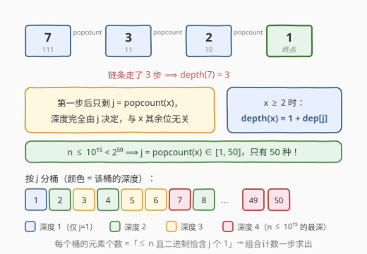
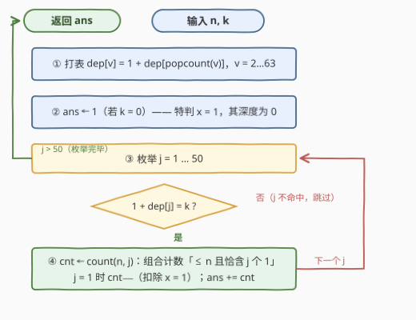

# 位计数深度为K的整数数目I

- **题目名称**：位计数深度为K的整数数目I
- **链接**：[3621. Number of Integers With Popcount-Depth Equal to K I](https://leetcode.cn/problems/number-of-integers-with-popcount-depth-equal-to-k-i/)
- **难度**：困难
- **标签**：位运算、数学、动态规划、组合数学

## 1. 题目概述

给你两个整数 `n` 和 `k`。对于任意正整数 `x`，定义序列：

- $p_0 = x$；
- $p_{i+1} = \text{popcount}(p_i)$，对所有 $i \ge 0$，其中 $\text{popcount}(y)$ 是 `y` 的二进制表示中 1 的数量。

这个序列最终会达到值 1。`x` 的 **popcount-depth**（位计数深度）定义为使得 $p_d = 1$ 的**最小**整数 $d \ge 0$。

例如 $x = 7$（二进制 `111`），序列为 $7 \to 3 \to 2 \to 1$，所以 7 的 popcount-depth 是 3。

任务是统计范围 $[1, n]$ 中 popcount-depth **恰好**等于 `k` 的整数数量，返回该数量。

**示例 1**：

```text
输入：n = 4, k = 1
输出：2
解释：在范围 [1, 4] 中，popcount-depth 恰好等于 1 的整数是：
  x = 2（"10"）：2 → 1
  x = 4（"100"）：4 → 1
因此答案是 2。
```

**示例 2**：

```text
输入：n = 7, k = 2
输出：3
解释：在范围 [1, 7] 中，popcount-depth 恰好等于 2 的整数是：
  x = 3（"11"）：3 → 2 → 1
  x = 5（"101"）：5 → 2 → 1
  x = 6（"110"）：6 → 2 → 1
因此答案是 3。
```

**约束条件**：

- $1 \le n \le 10^{15}$
- $0 \le k \le 5$

> 💡 **审题关键**：① $n$ 高达 $10^{15}$，**任何逐数枚举的做法都直接出局**，必须从「按 popcount 分桶统计」的角度想；② $k$ 的上界是 5，这本身就是强提示——popcount 迭代**坍缩极快**（一步落到 $\le 50$，两步落到 $\le 6$），实际深度最深只有 4；③ $d \ge 0$ 且 $p_0 = x$，因此 $x = 1$ 的深度是 **0** 而不是 1，`k = 0` 时别漏掉这个特判；④ 深度只关心「恰好等于 k」，不是「至少」。

---

## 2. 解题思路

### 2.1 暴力思路：逐数模拟链条

对 $[1, n]$ 中每个 `x` 反复套 `popcount` 直到变成 1，数步数，累计与 `k` 相等的个数。单次链长不超过 5（数值两步内塌到个位数），但**数太多**：$10^{15}$ 个起点，哪怕每次 $O(1)$ 也要跑千万年。

稍作改进——把链条「从 j 出发的步数」缓存成表 `dep[j]`，也只是把每个 $x$ 的计算从 5 步压到 1 步，仍然是 $O(n)$ 级别，无济于事。

> ⚠️ 暴力的根源性浪费在于：它把 $10^{15}$ 个数当成 $10^{15}$ 个互不相同的任务。而实际上，**链条的第一步就把所有数压进了 $[1, 50]$ 这 50 个值**——$10^{15}$ 个任务背后只有 50 种本质不同的「后续命运」。突破口是按 `popcount(x)` 分桶，而不是逐数处理。

### 2.2 核心观察：深度只由 popcount(x) 决定



**观察一：链条第一步后，一切与 x 的具体位形无关。** 由定义，$p_1 = \text{popcount}(x)$，后续链条完全由这个值决定。记 $j = \text{popcount}(x)$，则对 $x \ge 2$：

$$\text{depth}(x) = 1 + \text{dep}[j]$$

其中 $\text{dep}[j]$ 表示**数值 j 本身**的 popcount-depth，可用递推 $\text{dep}[1] = 0$，$\text{dep}[v] = 1 + \text{dep}[\text{popcount}(v)]$（$v \ge 2$）对 $v \le 63$ 一遍打表得到——$O(64)$，近乎免费。

**观察二：桶只有 50 个。** $n \le 10^{15} < 2^{50}$，故 $j = \text{popcount}(x) \in [1, 50]$。把 $[1, n]$ 按 `j` 分成 50 个桶，**同一桶内所有数深度相同**（$= 1 + \text{dep}[j]$）。答案随之成形：

$$\text{ans} = [k = 0] + \sum_{\substack{1 \le j \le 50 \\ 1 + \text{dep}[j] = k}} \Big( \text{count}(n, j) - [j = 1] \Big)$$

其中 $\text{count}(n, j)$ 是 $[1, n]$ 中二进制恰含 $j$ 个 1 的数的个数；$[k=0]$ 补上 $x = 1$（深度 0）；$[j=1]$ 时减 1 是因为 $x = 1$ 的 popcount 也是 1，但它已按深度 0 单独计入，须从桶里剔除。

**观察三：深度分布自带优雅结构。** 打表后按深度给桶着色（见上图）：深度 1 的只有 $j = 1$（2 的幂）；深度 2 的恰是 $j \in \{2, 4, 8, 16, 32\}$（j 本身是 2 的幂）；深度 3 要求 $\text{popcount}(j) \in \{2, 4\}$；深度 4 要求 $\text{popcount}(j) \in \{3, 5\}$。**$n \le 10^{15}$ 时最深 4 层，`k = 5` 恒为 0**——这也解释了为什么 `k` 的上界是 5。

**剩下的唯一硬骨头：如何求 $\text{count}(n, j)$？** 这是经典组合计数（数位统计的封闭形式）：把 `n` 的二进制从高位往低位扫，维护已跟 `n` 相同的前缀中 1 的个数 `ones`；每遇到 `n` 的一个 1 位（第 $i$ 位），考虑让 `x` 在这一位**放 0 而前缀仍与 n 相同**——此时低 $i$ 位完全自由，任选 $j - \text{ones}$ 个 1，贡献 $\binom{i}{j - \text{ones}}$；随后该位跟 `n` 放 1 继续。扫完后若 $\text{popcount}(n) = j$，再补上 `n` 本身。每个 $x < n$ 与 `n` 都存在唯一的「首个不同位」且该位上必是 n 为 1、x 为 0，因此该枚举**不重不漏**。

> 💡 一句话：本题 = 「popcount 一步坍缩到 $[1,50]$」的观察 + 「≤ n 且恰含 j 个 1」的经典组合计数。$10^{15}$ 规模的统计问题，最终只需几千次整数运算。

### 2.3 算法流程图



**逻辑执行步骤**：

| 步骤 | 操作 | 说明 |
|------|------|------|
| ① 打表 | $\text{dep}[v] = 1 + \text{dep}[\text{popcount}(v)]$，$v = 2 \ldots 63$ | 递推依赖更小的 $\text{popcount}(v) \le 6$，从小到大填表即可 |
| ② 特判 | `ans = (k == 0) ? 1 : 0` | $x = 1$ 的深度为 0，是深度 0 的唯一成员 |
| ③ 枚举桶 | `j` 从 1 到 50 | 覆盖 $\text{popcount}(x)$ 的全部可能取值 |
| ④ 判定+计数 | 若 $1 + \text{dep}[j] = k$：组合计数 $\text{count}(n, j)$，`j = 1` 时减 1，累加进 `ans` | 组合计数即 2.2 的「首个不同位」枚举，$O(50)$ 次组合数查表 |
| ⑤ 收尾 | 返回 `ans` | `k = 5` 时自然返回 0，无需特判 |

> ⚠️ 两处易错：① `j = 1` 的桶里混着 $x = 1$（popcount 为 1 但深度为 0），必须扣除，否则 `k = 1` 时会多算 1；② 组合数上标是**剩余低位个数** $i$ 而非总位数，且需满足 $0 \le j - \text{ones} \le i$ 才有贡献。

### 2.4 示例演算（示例 2：n = 7, k = 2）

$n = 7 = (111)_2$。查深度表：$1 + \text{dep}[j] = 2$ 的桶是 $j \in \{2, 4, 8, \ldots\}$，其中 $j \le \text{popcount 上界} 3$ 的只有 $j = 2$（$j = 4$ 桶为空，$7$ 最多 3 个 1）。对 $j = 2$ 执行组合计数，从高位（第 2 位）扫 $n = 111$：

| 位 $i$ | $n$ 的位 | 决策 | 贡献 | 说明 |
|--------|----------|------|------|------|
| $i = 2$ | 1 | 此位放 0，低 2 位自由 | $\binom{2}{2 - 0} = 1$ | 即 $x = 011 = 3$；随后 ones → 1 |
| $i = 1$ | 1 | 此位放 0，低 1 位自由 | $\binom{1}{2 - 1} = 1$ | 即 $x = 101 = 5$；随后 ones → 2 |
| $i = 0$ | 1 | 此位放 0，低 0 位自由 | $\binom{0}{2 - 2} = 1$ | 即 $x = 110 = 6$；随后 ones → 3 |
| 扫描完毕 | — | $\text{popcount}(7) = 3 \ne 2$ | $+0$ | 7 自身不在 $j = 2$ 桶 |

$\text{count}(7, 2) = 3$，且 $j \ne 1$ 无需扣 1；`k ≠ 0` 无特判。**答案 = 3**，与示例一致。注意三个数 $3, 5, 6$ 恰好与「首个不同位」一一对应——这正是计数不重不漏的直观体现。

---

## 3. 参考代码

### C++

```cpp
class Solution {
public:
    long long popcountDepth(long long n, int k) {
        // dep[v]：数值 v 本身的 popcount-depth
        int dep[64] = {};
        for (int v = 2; v < 64; ++v)
            dep[v] = 1 + dep[__builtin_popcount(v)];

        // 杨辉三角预计算 C[i][j]，i <= 50，避免乘法溢出 subtleties
        long long C[51][51] = {};
        for (int i = 0; i <= 50; ++i) {
            C[i][0] = 1;
            for (int j = 1; j <= i; ++j)
                C[i][j] = C[i - 1][j - 1] + (j < i ? C[i - 1][j] : 0);
        }

        // count(n, j)：[1, n] 中二进制恰含 j 个 1 的数的个数
        auto countAll = [&](int j) -> long long {
            long long res = 0;
            int ones = 0;
            for (int i = 49; i >= 0; --i) {
                if (n >> i & 1) {
                    if (j - ones >= 0 && j - ones <= i) res += C[i][j - ones];
                    ++ones;                      // 该位跟 n 走 1
                }
            }
            return res + (ones == j ? 1 : 0);    // n 自身
        };

        long long ans = (k == 0) ? 1 : 0;        // x = 1，深度 0
        for (int j = 1; j <= 50; ++j)
            if (1 + dep[j] == k)
                ans += countAll(j) - (j == 1);   // j = 1 的桶剔除 x = 1
        return ans;
    }
};
```

> 💡 **写法要点**：
> - `n ≤ 10^15 < 2^50`，最高有效位是第 49 位，位扫描从 `i = 49` 起即可（从 62 起扫也对，只是空转）。
> - 组合数用**杨辉三角**而非连乘公式：$\binom{50}{25} \approx 1.26 \times 10^{14}$，加法递推零溢出风险，且查询 $O(1)$。
> - `dep` 表只需覆盖 $v \le 63$：$j \le 50$ 时 $\text{popcount}(j) \le 6$，递推永远落在表内。
> - 全程 `long long`：答案上限即 $n \approx 10^{15}$，远超 `int`。

### Python

```python
from math import comb

class Solution:
    def popcountDepth(self, n: int, k: int) -> int:
        # dep[v]：数值 v 本身的 popcount-depth
        dep = [0] * 64
        for v in range(2, 64):
            dep[v] = 1 + dep[v.bit_count()]

        def count_all(j: int) -> int:
            # [1, n] 中二进制恰含 j 个 1 的数的个数
            res, ones = 0, 0
            for i in range(49, -1, -1):
                if n >> i & 1:
                    need = j - ones
                    if 0 <= need <= i:
                        res += comb(i, need)
                    ones += 1
            return res + (ones == j)          # n 自身

        ans = 1 if k == 0 else 0              # x = 1，深度 0
        for j in range(1, 51):
            if 1 + dep[j] == k:
                ans += count_all(j) - (j == 1)
        return ans
```

> 💡 **写法要点**：
> - `int.bit_count()` 需要 Python 3.10+（LeetCode 环境满足）；低版本环境换成 `bin(v).count('1')`。
> - `math.comb` 自动处理非法参数？**不会**——`comb(i, -1)` 会抛异常，所以必须先判 `0 <= need <= i` 再调用。
> - Python 大整数天然无溢出，逻辑可以完全照搬数学式；性能上全部循环加起来约 $50 \times 50$ 次迭代，绰绰有余。

---

## 4. 复杂度分析

| 维度 | 复杂度 | 说明 |
|------|--------|------|
| **时间复杂度** | $O(L^2)$，$L = \lceil \log_2 n \rceil \le 50$ | 打表 $O(64)$ + 杨辉三角 $O(50^2)$ + 枚举 50 个桶 × 每桶扫 50 位，总计约 $5 \times 10^3$ 次整数运算，常数级 |
| **空间复杂度** | $O(L^2)$ | `dep` 表 $O(64)$ 与杨辉三角 $O(51^2)$，约 20 KB；Python 版用 `math.comb` 免掉组合数表，空间 $O(L)$ |

> - 对比暴力 $O(n)$（$n = 10^{15}$）：**快了 11 个数量级**——这就是「按 popcount 分桶」观察的威力。
> - 若把杨辉三角换成 `math.comb` / 乘法公式按需计算，时间仍为 $O(L^2)$ 量级（每次组合数 $O(j)$），常数稍大但依然瞬间完成。

---

## 5. 扩展：数位 DP 视角与数据结构加强版

**数位 DP 的等价写法。** 官方提示给出的是记忆化数位 DP：$dp[pos][ones][tight]$ 表示从最高位填到第 `pos` 位、已填 `ones` 个 1、是否仍与 `n` 前缀重合（tight）的方案数。它与本文的「首个不同位」组合封闭形式**完全等价**——封闭形式只是把「首位放宽后低位自由」这一步直接写成了 $\binom{i}{j-\text{ones}}$。当约束变复杂（例如「不允许连续 1」，见 600 题）时，自由低位不再能一步组合写出，记忆化数位 DP 是更通用的武器。

**深度分布的递归本质。** $\text{depth}(x)$ 就是「迭代 popcount 多少次收敛到 1」。整个深度体系是自相似的：深度 2 的桶 $\{2,4,8,\ldots\}$ 恰是「popcount 落在深度 1 值域」的 j；深度 3 的桶是「popcount 落在深度 2 值域」的 j……由于 $2^{50}$ 以内的数两步内塌缩到 $\le 6$，链条深度被锁死在 4——这也是 `k ≤ 5` 的约束来历。

**II 期加强（3624 题）。** 本题的续作把单个 `n` 换成数组 + 在线询问：点修改 `nums[idx] = val`，区间询问 $[l, r]$ 内深度恰为 `k` 的元素个数。观察不变（每个元素的深度由其 popcount 一次查表得出），但统计载体要升级——按 5 个深度值各开一棵**树状数组**（或一棵维护 5 个计数器的线段树），修改时重算该元素的 popcount 查表得新深度并搬桶，询问时区间求和。核心洞察与本题一脉相承，数据结构只是外壳。

---

## 6. 面试要点

**Q1：为什么深度只依赖 popcount(x)，而不依赖 x 的具体二进制位形？**

> 链条定义是 $p_1 = \text{popcount}(x)$，从第二步起序列只由 $p_1$ 这个**数值**决定——$p_2 = \text{popcount}(p_1)$ 与「哪些位是 1」毫无关系。而 $n < 2^{50}$ 保证 $p_1 \in [1, 50]$，所以 $10^{15}$ 个数被第一步压缩成 50 类，每类深度查 64 以内的打表即得。

**Q2：如何统计「≤ n 且二进制恰含 j 个 1」的数的个数？讲讲正确性。**

> 从高位扫 `n` 的二进制，维护前缀已用 1 的个数 `ones`；遇到 `n` 的 1 位（第 $i$ 位）时，枚举「首个不同位」在此处：`x` 该位放 0、更高位与 n 相同，低 $i$ 位自由，贡献 $\binom{i}{j - \text{ones}}$；然后该位跟 n 放 1。任何 $x < n$ 与 $n$ 的首个不同位处必为「n 是 1、x 是 0」（否则 x > n），故每个合法 x 恰被枚举一次；最后单独验证 `n` 自身。这是数位 DP $dp[pos][ones][tight]$ 的封闭形式。

**Q3：x = 1 和 k = 0 这类边界如何处理？还有哪些坑？**

> $p_0 = x$ 且 $d \ge 0$，故 $\text{depth}(1) = 0$：`k = 0` 时答案是 1（$n \ge 1$ 恒成立）。连带的坑是 $j = 1$ 的桶（2 的幂）里混着 $x = 1$——它的 popcount 也是 1 但深度是 0，必须在 `k = 1` 时扣掉，否则多算 1。另外 `k = 5` 时答案恒 0（$n \le 10^{15}$ 最深 4 层），代码无需特判，自然成立。

**Q4：复杂度和溢出风险怎么评估？**

> 时间 $O(L^2)$，$L \le 50$，约几千次运算。数值上：组合数最大 $\binom{50}{25} \approx 1.26 \times 10^{14}$，累计答案 $\le n = 10^{15}$，均在 `long long`（上限约 $9.2 \times 10^{18}$）安全范围内；C++ 用杨辉三角加法递推从根上规避连乘溢出，Python 大整数无此虞。

**Q5：这题的「分桶 + 组合计数」套路还能迁移到哪？**

> 一整族「统计 $[1, n]$ 中满足位/数位约束的数」的问题：233（十进制数字 1 的个数）是同一套路在十进制的翻版；600（不含连续 1）是约束带后效性、封闭形式失效后改用记忆化数位 DP 的典型；3624（本题 II）则把单次统计升级为带修改的区间询问，套上树状数组/线段树的外壳。识别「约束是否只依赖 popcount / 数位多重集」是选对武器（组合式 vs 数位 DP vs 数据结构）的关键。

> 💡 **一句话总结**：3621 = popcount 一步坍缩的观察（$10^{15} \to 50$ 桶）+「≤ n 且恰含 j 个 1」的经典组合计数。带走的三个细节：$x = 1$ 的深度是 0（连带 $j=1$ 桶要剔除它）、组合数上标是剩余低位个数、$k=5$ 恒为 0 的深度上限直觉。

---

## 7. 同类练习题

- [191. 位1的个数](https://leetcode.cn/problems/number-of-1-bits/)：popcount 本体，本题链条迭代的原子操作
- [233. 数字 1 的个数](https://leetcode.cn/problems/number-of-digit-one/)：「首个不同位」组合计数的十进制原型，套路完全同构
- [600. 不含连续 1 的非负整数](https://leetcode.cn/problems/non-negative-integers-without-consecutive-ones/)：约束带后效性时封闭形式失效，改用记忆化二进制数位 DP 的对照样本
- [3624. 位计数深度为 K 的整数数目 II](https://leetcode.cn/problems/number-of-integers-with-popcount-depth-equal-to-k-ii/)：本题加强版——点修改 + 区间询问深度为 k 的个数，同一分桶观察套上树状数组
