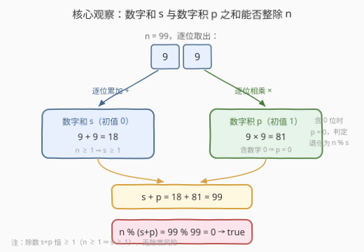
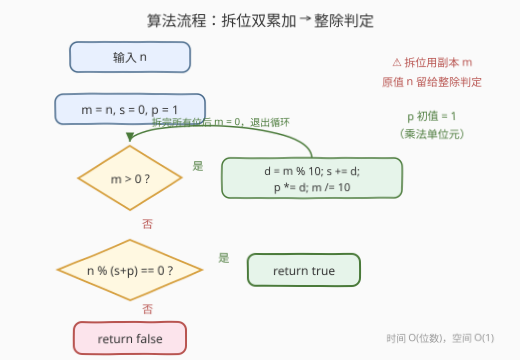

# LeetCode 判断整除性 题解

## 1. 题目概述

- **标题 / 题号**：判断整除性（#3622，easy）
- **链接**：https://leetcode.cn/problems/check-divisibility-by-digit-sum-and-product/
- **难度**：简单
- **标签**：数学

**题意**：给你一个正整数 `n`。请判断 `n` 是否可以被以下两值之**和**整除：

- `n` 的**数字和**（即其各个位数之和）；
- `n` 的**数字积**（即其各个位数之积）。

如果 `n` 能被该和整除，返回 `true`；否则返回 `false`。

**示例 1**：

```text
输入：n = 99
输出：true
解释：99 可以被其数字和 (9 + 9 = 18) 与数字积 (9 * 9 = 81) 之和 (18 + 81 = 99) 整除。
```

**示例 2**：

```text
输入：n = 23
输出：false
解释：23 无法被其数字和 (2 + 3 = 5) 与数字积 (2 * 3 = 6) 之和 (5 + 6 = 11) 整除。
```

**约束**：

- $1 \le n \le 10^6$

> 💡 **审题关键**：① 判定的除数是 $s + p$ **这个整体**，不是分别被 $s$ 或 $p$ 整除；② **数字积对 0 极其敏感**——只要 `n` 的某一位是 0，乘积直接归 0，判定退化为 `n % s`；③ **无除零风险**：$n \ge 1$ 至少有一位非零，故 $s \ge 1$、$s + p \ge 1$；④ **无溢出风险**：$n \le 10^6$ 最多 6 位（999999），$p \le 9^6 = 531441$，$s \le 54$，`int` 绰绰有余。

## 2. 解题思路

### 2.1 朴素思路：转字符串逐位统计

最直观的做法：`to_string(n)` 把 `n` 拍成字符串，遍历每个字符，减去 `'0'` 得到数字，一路累加出 $s$、连乘出 $p$，最后判断 `n % (s + p) == 0`。

这条路径完全正确，复杂度也是 $O(d)$（$d$ 为位数）；但多了一次字符串分配与一层「字符 → 数字」的转换，更重要的是它把**拆位**这个算术基本功藏进了库函数里。拆位的算术写法（`% 10` 取末位、`/ 10` 去末位）是数位类问题的通用积木——本题正是练手的好场合。

> ⚠️ 本题的真正考点不在算法而在**三个实现细节**：乘积累加器的初值、拆位副本、含 0 数字的乘积——2.2 一一拆解。

### 2.2 核心观察：算术拆位，一趟双累加器



**观察一：拆位即「取末位 + 去末位」，一趟循环同时喂两个累加器。** `d = m % 10` 取出末位，`m /= 10` 砍掉末位；每取一位，顺手 `s += d`、`p *= d`——数字和与数字积在**同一次遍历**里诞生，无需两趟。

**观察二：乘积累加器初值必须是 1，且对 0 位天然敏感。** $s$ 是加法累加，初值取加法单位元 0；$p$ 是乘法累加，初值必须取**乘法单位元 1**——手滑写成 0 会让 $p$ 恒为 0。另一个方向的事实反而要**利用**：只要某位是 0，$p$ 就归 0，此时除数退化为 $s$ 本身（如 $n = 10$：$s = 1$、$p = 0$、$10 \% 1 = 0$ → `true`），**不需要任何特判**，代码路径自动覆盖。

**观察三：拆位循环销毁的是副本，原值 `n` 必须留给整除判定。** `m /= 10` 循环结束时 `m` 已归 0，若直接拿 `m` 去做整除判定必然出错——拆位前先把 `n` 复制成 `m`，循环只动 `m`。这是拆位题最经典的翻车点。

> 💡 一句话：本题 = 「拆位模板（`%10` / `/10`）」+「加法/乘法双累加器」+「一个取模判零」。算法零难度，细节三处坑。

### 2.3 算法流程图



**逻辑执行步骤**：

| 步骤 | 操作 | 说明 |
|------|------|------|
| ① 初始化 | `m = n`，`s = 0`，`p = 1` | `m` 是拆位用的副本；初值取各自运算的单位元 |
| ② 循环条件 | `m > 0` ? | 是 → ③；否（位已拆完）→ ④ |
| ③ 拆位累加 | `d = m % 10`；`s += d`；`p *= d`；`m /= 10` | 取末位、喂两个累加器、砍末位，回到 ② |
| ④ 整除判定 | `n % (s + p) == 0` ? | 用**原值 n** 对「数字和 + 数字积」取模 |
| ⑤ 返回 | 判定为真 → `true`，否则 → `false` | 除数 $s + p \ge 1$ 恒成立，无除零 |

> ⚠️ 步骤④画的是 `n` 不是 `m`——此时 `m` 已经是 0，拿它判定必错。流程图中特意把「拆位用副本 m」标成红色提醒。

### 2.4 示例演算

**示例 1：n = 99（答案 true）**

| 轮次 | 取位 d（m%10） | 拆后 m（m/10） | 累计 s | 累计 p |
|------|---------------|----------------|--------|--------|
| 初始 | — | 99 | 0 | 1 |
| 1 | 9 | 9 | 9 | 9 |
| 2 | 9 | 0 | 18 | 81 |

`m = 0` 退出循环：$s + p = 18 + 81 = 99$，$99 \% 99 = 0$ → **true**。

**示例 2：n = 23（答案 false）**：$s = 5$，$p = 6$，$s + p = 11$，$23 \% 11 = 2 \ne 0$ → **false**。

**补充：n = 10（含 0 位，答案 true）**：$s = 1$，$p = 0$（数字 0 让乘积归零），$s + p = 1$，$10 \% 1 = 0$ → **true**。

## 3. 参考代码

### C++

```cpp
class Solution {
public:
    bool checkDivisibility(int n) {
        int s = 0, p = 1;
        for (int m = n; m > 0; m /= 10) {
            int d = m % 10;
            s += d;
            p *= d;
        }
        return n % (s + p) == 0;
    }
};
```

> 💡 **写法要点**：
> - `for (int m = n; m > 0; m /= 10)` 把「副本、循环、砍位」浓缩进一行，循环体内只剩取位与累加，主干净。
> - `p` 声明时初始化为 1 而非 0——乘法单位元，连乘的起点。
> - `n` 全程未被修改，最后的 `n % (s + p)` 用的是原值；`s + p` 最大约 $5.3 \times 10^5$，`int` 无溢出。

### Python

```python
class Solution:
    def checkDivisibility(self, n: int) -> bool:
        s, p = 0, 1
        m = n
        while m > 0:
            m, d = divmod(m, 10)
            s += d
            p *= d
        return n % (s + p) == 0
```

> 💡 **写法要点**：
> - `divmod(m, 10)` 一句话同时拿到「砍位后的 m」与「取出的末位 d」，比先 `%` 后 `//` 更紧凑。
> - 极简版：`digits = [int(c) for c in str(n)]` 后 `sum` + 累乘——正确但放弃了拆位练习，面试口头提一句即可。
> - Python 整数无宽度限制，即便题目上界放大也无溢出之虞。

## 4. 复杂度分析

| 维度 | 复杂度 | 说明 |
|------|--------|------|
| **时间复杂度** | $O(\log n)$ | 循环次数 = 位数 $d = \lfloor \log_{10} n \rfloor + 1$；$n = 10^6$ 时至多 7 轮 |
| **空间复杂度** | $O(1)$ | 只用 `m`、`s`、`p`、`d` 四个变量，逐位处理不存数位 |

> - 拆位循环每轮让 `m` 缩小 10 倍，这正是 $O(\log_{10} n)$ 的来源；与二分「每轮减半」同构，只是底换成 10。
> - 若改用字符串写法，时间同样 $O(\log n)$，但空间多出一份 $O(\log n)$ 的字符串。

## 5. 扩展：从 Harshad 数到「数位函数整除性」

**Harshad 数（Niven 数）。** 能被自身**数字和**整除的整数称为 Harshad 数（如 18：$1+8=9$，$18\%9=0$）。本题正是 Harshad 判定的变体——除数在数字和之上多加了一项数字积。有趣的衔接：当 `n` 含数字 0 时 $p = 0$，本题判定恰好退化为 Harshad 判定。

**数字根与 258。** 反复求数字和直到一位数，得到**数字根**，其数学本质是 $n \bmod 9$（约定 $n > 0$ 时根为 1–9 中的一个）。数字和、数字积、数字根是一族「数位函数」，掌握拆位模板后可随意组合。

**上界放大怎么办。** 若 $n$ 放大到 $10^{18}$：位数最多 19，$p \le 9^{18} \approx 1.5 \times 10^{17}$、$s \le 171$，C++ 换 `long long` 即可。若 $n$ 是**任意大数**（以字符串给出）：拆位直接遍历字符求 $s$、$p$；整除判定不必构造大数，按位扫一遍维护 `res = (res * 10 + digit) % (s + p)`，全程数值不超过除数的平方，$O(d)$ 完事——「大数取模」与「拆位」是同一枚硬币的两面。

## 6. 面试要点

**Q1：为什么乘积累加器 `p` 的初值是 1 而不是 0？**

> 1 是乘法的**单位元**：空积约定为 1，从 1 开始连乘才不改变结果。初值写成 0 会让 $p$ 恒为 0，除数错误地变成 $s$。同理加法累加器初值取加法单位元 0——「初值 = 单位元」是所有累加器的不变式。

**Q2：拆位循环为什么要用副本 `m`，直接拿 `n` 循环行不行？**

> 不行。`m /= 10` 的循环结束时原变量已归 0，而最后的整除判定需要**原始的 n**。拆位前 `m = n` 复制一份、循环只消耗 `m`，是拆位模板的固定姿势。反过来说，若判定的是「各位数字组成的新数」这类只依赖拆位结果的性质，才可以用原变量直接拆。

**Q3：除数 `s + p` 可能等于 0 导致除零吗？**

> 不会。$n \ge 1$ 保证至少一位数字非零，于是数字和 $s \ge 1$，从而 $s + p \ge 1$。对比一个相邻的坑：数字积 $p$ 是可能为 0 的（含 0 位），所以若题目改成判 `n % p` 就必须特判——审题时要分清「和」与「积」哪个进除数。

**Q4：字符串拆位与算术拆位如何取舍？**

> 两者时间同为 $O(d)$。算术拆位（`%10` / `/10`）零额外空间、不依赖进制字符串转换，且直接推广到「按 b 进制拆位」（把 10 换成 b）；字符串拆位胜在直观、便于按下标访问数位（如取连续子串）。需要子串/按位随机访问选字符串，只需逐位扫描选算术——本题属后者。

**Q5：含数字 0 的数（如 10、100、101）判定结果有何规律？**

> 含 0 位则 $p = 0$，判定退化为 $n \% s$：10（$s=1$）与 100（$s=1$）均 `true`；101（$s=2$，$101\%2=1$）为 `false`。代码**无需特判**——乘 0 自然归零，这条路径被通用逻辑自动覆盖，写特判反而画蛇添足。

> 💡 **一句话总结**：3622 = 拆位模板 + 双累加器 + 一次取模。带走的三个细节：`p` 初值是 1、拆位用副本 `m`、除数 $s+p$ 恒正无除零。

## 同类练习题

| # | 题目 | 与本题的关联 |
|---|------|-------------|
| 1281 | [整数的各位积和之差](https://leetcode.cn/problems/subtract-the-product-and-sum-of-digits-of-an-integer/) | 同一套「数字和 + 数字积」双累加器，只换最后的组合方式（相减） |
| 202 | [快乐数](https://leetcode.cn/problems/happy-number/) | 拆位循环计算数字**平方和**并迭代，考察拆位 + 收敛检测 |
| 258 | [各位相加](https://leetcode.cn/problems/add-digits/) | 反复求数字和至一位（数字根），本质 $n \bmod 9$ |
| 2269 | [一个数字的 K 美丽值](https://leetcode.cn/problems/find-the-k-beauty-of-a-number/) | 数位**子串**的整除判定，拆位升级为滑动窗口 |
| 507 | [完美数](https://leetcode.cn/problems/perfect-number/) | 另一类「数对自身函数的整除性」判定（除数求和取模），体会边界估算的通用性 |
