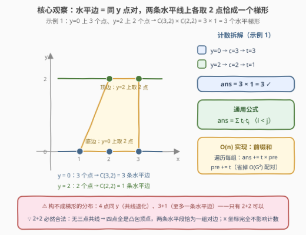
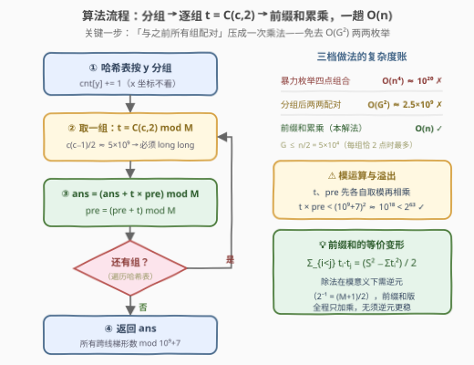

# LeetCode 统计梯形的数目I 题解

## 1. 题目概述

- **标题 / 题号**：统计梯形的数目I（#3623，medium）
- **链接**：https://leetcode.cn/problems/count-number-of-trapezoids-i/
- **难度**：中等
- **标签**：几何、数组、哈希表、数学

**题意**：给你一个二维整数数组 `points`，其中 $points[i] = [x_i, y_i]$ 表示第 $i$ 个点在笛卡尔平面上的坐标。

**水平梯形**是一种凸四边形，具有**至少一对**水平边（即平行于 $x$ 轴的边）。两条直线平行当且仅当它们的斜率相同。

返回可以从 `points` 中任意选择四个不同点组成的**水平梯形**数量。

由于答案可能非常大，请返回结果对 $10^9 + 7$ **取余数**后的值。

**示例 1**：

```text
输入：points = [[1,0],[2,0],[3,0],[2,2],[3,2]]
输出：3
解释：三种选法分别为
      ① [1,0]、[2,0] 与 [2,2]、[3,2]
      ② [2,0]、[3,0] 与 [2,2]、[3,2]
      ③ [1,0]、[3,0] 与 [2,2]、[3,2]
```

**示例 2**：

```text
输入：points = [[0,0],[1,0],[0,1],[2,1]]
输出：1
解释：只有一种方式可以组成一个水平梯形。
```

**约束**：

- $4 \le points.length \le 10^5$
- $-10^8 \le x_i, y_i \le 10^8$
- 所有点两两不同。

> 💡 **读题关键**：「至少一对水平边」意味着四点中必须存在**两组**同 $y$ 的点对——4 个点恰好按 $2+2$ 分布在两条不同的水平线上。抓住这一点，几何题立刻坍缩为「按 $y$ 分组 + 组合计数」；而 $n \le 10^5$ 的规模要求把跨组求和再压成线性。

## 2. 解题思路

### 2.1 暴力思路：枚举四点组合

最直接的做法是枚举所有 $\binom{n}{4}$ 个四点组合，逐一判定是否构成水平梯形。$n = 10^5$ 时 $\binom{n}{4} \approx 4 \times 10^{18}$，天文数字，完全不可行。

改进一版：梯形的两条水平边分别落在两条**不同的水平线**上，每条边是同 $y$ 的点对。先用哈希表按 $y$ 分组（一趟 $O(n)$），设各组点数为 $c_1, c_2, \dots, c_G$，则答案为

$$\text{ans} = \sum_{i < j} \binom{c_i}{2}\binom{c_j}{2}$$

若对「组对」直接两两枚举：能贡献的水平线至少有 2 个点，故 $G \le n/2 = 5 \times 10^4$（每组恰好 2 个点时组数最多），$O(G^2) \approx 2.5 \times 10^9$ 次乘法取模依然会超时。卡住的地方只剩最后一步：把「每个组与之前所有组配对」的乘积和压成 $O(1)$——这正是 2.2 的前缀和。

### 2.2 核心观察：水平边 ⇔ 同 y 点对，2+2 分布即合法



**观察一：水平边 = 同 $y$ 点对（必要条件）。** 平行于 $x$ 轴的边两端点 $y$ 相同；水平梯形的一对平行边互为**对边**、不共享顶点，因此 4 个点必须拆成两组同 $y$ 点对且 $y$ 值互异——即 $y$ 分布恰为 $2+2$。4 点同 $y$ 共线退化；$3+1$ 至多凑出一条水平边——都不行。

**观察二：任意 2+2 选法都恰好构成一个水平梯形（充分性）。** 设 $A, B$ 在 $y = a$、$C, D$ 在 $y = b$（$a \neq b$）。先看**无三点共线**：过同线两点的直线就是该水平线本身，第三点在另一条线上，不可能共线。再看**四点全是凸包顶点**：$\triangle BCD$ 与直线 $y = a$ 至多交于 $B$ 一点（$C, D$ 都严格在另一侧），故 $A$ 不会落进三角形，其余三点同理。于是四点的凸包恰为四边形，两条水平段正是一组**对边**——既不退化，也不重不漏。**判定与计数完全等价：$y$ 多重集分布为 $\{a, a, b, b\}$、$a \neq b$。**

**观察三：$x$ 坐标是烟雾弹。** 合法性只取决于 $y$ 的分布，$x$ 只影响梯形的形状（底长、歪正），不影响存在性。把 $x$ 整个扔掉，本题从几何题净化为纯组合计数。

**计数与前缀和加速。** 设 $c_y$ 为 $y$ 处点数、$t_y = \binom{c_y}{2}$ 为该水平线上可作出的水平边数，则

$$\text{ans} = \sum_{y_1 < y_2} t_{y_1} \cdot t_{y_2} \pmod{10^9 + 7}$$

逐项硬算是 $O(G^2)$；换成**前缀和**：按任意顺序遍历各组，维护 $\text{pre} = $ 已处理组 $t$ 之和，遇到新组执行 $\text{ans} \mathrel{+}= t_y \cdot \text{pre}$、$\text{pre} \mathrel{+}= t_y$。「与之前所有组配对」被一次乘法吸收，整体降到 $O(n)$。哈希表遍历顺序无关紧要——乘法交换律保证 $\sum_{i<j} t_i t_j$ 与求和顺序无关。

> 💡 一句话：**分组 → 组内数点对 → 跨组乘积求和**。骨架是「哈希分组 + 组合计数」（454 四数相加 II 同款），几何只是外壳，$x$ 坐标连看都不用看。

### 2.3 算法流程图



**逻辑执行步骤**：

| 步骤 | 操作 | 说明 |
|------|------|------|
| ① 分组 | 哈希表统计每个 $y$ 的点数 $c_y$ | 一趟 $O(n)$；$x$ 坐标直接丢弃 |
| ② 取组 | 遍历每个 $y$ 组，算 $t_y = \binom{c_y}{2} \bmod M$ | $c_y \le 10^5 \Rightarrow c_y(c_y-1)/2 \approx 5 \times 10^9$，必须 `long long` |
| ③ 累乘 | `ans = (ans + t·pre) % M`，`pre = (pre + t) % M` | $t \cdot \text{pre} < (10^9+7)^2 \approx 10^{18} < 2^{63}$，不溢出 |
| ④ 收尾 | 所有组处理完，返回 `ans` | $c_y < 2$ 的组 $t_y = 0$，天然跳过 |

### 2.4 示例演算

以示例 1（`points = [[1,0],[2,0],[3,0],[2,2],[3,2]]`）走查前缀和过程：

| 处理的组 | $c$ | $t = \binom{c}{2}$ | `ans` 更新（$t \times \text{pre}$） | `pre` 更新 |
|----------|-----|--------------------|-------------------------------------|------------|
| $y=0$：$(1,0),(2,0),(3,0)$ | $3$ | $3$ | $0 + 3 \times 0 = 0$ | $3$ |
| $y=2$：$(2,2),(3,2)$ | $2$ | $1$ | $0 + 1 \times 3 = 3$ | $4$ |

返回 **3** ✓。示例 2：$y=0$ 与 $y=1$ 各 2 个点，$t$ 均为 $1$，$\text{ans} = 1 \times 1 = 1$ ✓。

## 3. 参考代码

### C++

```cpp
class Solution {
public:
    int countTrapezoids(vector<vector<int>>& points) {
        const long long MOD = 1e9 + 7;
        unordered_map<int, int> cnt;
        for (auto& p : points) ++cnt[p[1]];            // ① 按 y 分组，x 不看
        long long ans = 0, pre = 0;                    // pre：已处理组的 t 之和
        for (auto& [y, c] : cnt) {
            long long t = 1LL * c * (c - 1) / 2 % MOD; // ② 该水平线上的点对数
            ans = (ans + t * pre) % MOD;               // ③ 与之前每条线各配出一个梯形
            pre = (pre + t) % MOD;
        }
        return ans;                                    // ④ 组合意义覆盖所有 y1 < y2
    }
};
```

### Python

```python
class Solution:
    def countTrapezoids(self, points: List[List[int]]) -> int:
        MOD = 10**9 + 7
        cnt = Counter(y for _, y in points)            # ① 按 y 分组，x 不看
        ans = pre = 0                                  # pre：已处理组的 t 之和
        for c in cnt.values():
            t = c * (c - 1) // 2 % MOD                 # ② 该水平线上的点对数
            ans = (ans + t * pre) % MOD                # ③ 与之前每条线各配出一个梯形
            pre = (pre + t) % MOD
        return ans
```

> 💡 上述解法已与暴力对拍验证：官方两示例、$n \le 9$、坐标域 $[-3,3] \times [-2,2]$ 的 3000 组随机用例（$\binom{n}{4}$ 全枚举判定 $y$ 分布为 $2+2$ 的参照实现）结果完全一致；另以 $n = 10^5$ 全部落在两条水平线的极端用例核对过公式精确值与取模结果。

## 4. 复杂度分析

| 维度 | 复杂度 | 说明 |
|------|--------|------|
| 时间 | $O(n)$ | 分组一趟 $O(n)$；组数 $G \le n$，每组常数次乘加 |
| 空间 | $O(n)$ | 哈希表存每个 $y$ 的计数，最坏 $n$ 个不同 $y$ |

- 时间上每个点只被哈希一次、每组只做一次组合数计算，$n = 10^5$ 规模瞬时完成；
- 若坐标已被排序或值域可压缩，哈希表可换成排序数组或值域桶，常数更小但渐进不变。

## 5. 扩展：闭合公式与模逆元

把 $\sum_{i<j} t_i t_j$ 展开，有恒等式

$$\text{ans} = \frac{\left(\sum_i t_i\right)^2 - \sum_i t_i^2}{2} \pmod{10^9+7}$$

即「任取两组（可相同）的有序乘积和」减去「同组自乘」再除以 $2$。模运算下的**除法必须换成乘逆元**：$M = 10^9+7$ 是奇素数，由费马小定理 $2^{-1} \equiv 2^{M-2} \equiv \frac{M+1}{2} = 500000004 \pmod M$。Python 也可以利用大整数先精确求和、除 $2$ 后再取模，绕开逆元。

相比之下，前缀和版本**全程只有加法和乘法**，不引入逆元、不依赖 $M$ 的素性，是模运算计数题里更稳的通用写法——这也是面试中值得主动提一句的工程细节。

## 6. 面试要点

**Q1：为什么 4 点分布是 2+2 就一定是水平梯形？**

> 必要性：一对水平平行边是对边、不共顶点，需要两个互异 $y$ 值各贡献一对点。充分性：同线两点的连线就是该水平线，第三点在另一条线上 ⇒ 无三点共线；又 $\triangle BCD$ 与直线 $y=a$ 至多交于 $B$ 一点 ⇒ 每个点都是凸包顶点，凸包为四边形且两条水平段恰为对边。矩形（两组对边都平行）也满足「至少一对水平边」，照样计入，无重复计数——每个 2+2 点集只数一次。

**Q2：x 坐标为什么完全不用看？**

> 合法性等价于 $y$ 多重集分布为 $\{a,a,b,b\}$（$a \neq b$），$x$ 只改变梯形形状不影响存在性。扔掉 $x$ 后问题坍缩为「按 $y$ 分组的组合计数」，这正是本题伪装成几何题的迷惑点。

**Q3：分组之后为什么还要前缀和？两两配对不行吗？**

> 贡献组（$\ge 2$ 个点）至多 $G = n/2 = 5\times10^4$ 个，两两配对 $O(G^2) \approx 2.5 \times 10^9$ 次乘法取模会超时。维护 $\text{pre} = $ 已处理组 $t$ 之和，新组一步 $\text{ans} \mathrel{+}= t \cdot \text{pre}$ 即完成「与之前所有组配对」，降到 $O(n)$。本质与 454（四数相加 II）中 `cnt[a+b] × cnt[-(c+d)]` 的合并同源。

**Q4：哪些位置会溢出？**

> 三处：① $c \le 10^5$ 时 $c(c-1)/2 \approx 5 \times 10^9$ 超 `int32`，C++ 要 `1LL * c * (c-1)`；② $t \cdot \text{pre}$ 须先各自取模再乘，乘积 $< (10^9+7)^2 \approx 10^{18} < 2^{63} \approx 9.2 \times 10^{18}$，`long long` 安全；③ 若用闭合公式 $(S^2 - \sum t^2)/2$，$S$ 未取模时 $S^2$ 可达 $10^{37}$，必须先 `% MOD`。Python 原生大整数无此虞。

**Q5：答案为什么与哈希表遍历顺序无关？**

> 前缀和算的是 $\sum_{i<j} t_i t_j$ 的某种加括号顺序，由乘法交换律/结合律保证与遍历顺序无关——任意顺序遍历都得到同一组「无序组对」的完整覆盖，每对恰贡献一次 $t_i t_j$。

> 💡 **一句话总结**：**水平边 ⇔ 同 $y$ 点对，2+2 分布既必要又充分；按 $y$ 分组后用前缀和把跨组乘积和压成 $O(n)$**——几何是壳，组合计数是核。

## 同类练习题

| # | 题目 | 与本题的关联 |
|---|------|-------------|
| 454 | [四数相加 II](https://leetcode.cn/problems/4sum-ii/) | 同款「分组计数 + 跨组乘积合并」骨架（$cnt[a+b] \times cnt[-(c+d)]$），本题的纯数组版近亲 |
| 1726 | [同积元组](https://leetcode.cn/problems/tuple-with-same-product/) | 哈希分组后组合计数 $\binom{pairs}{2} \times 8$，乘法原理的另一种展开 |
| 1010 | [总持续时间可被 60 整除的歌曲](https://leetcode.cn/problems/pairs-of-songs-with-total-durations-divisible-by-60/) | 按余数分组数点对，前缀累乘思路的迷你版 |
| 149 | [直线上最多的点数](https://leetcode.cn/problems/max-points-on-a-line/) | 几何 + 哈希分组（按规范化斜率），与本题互为镜像——那题数同线最多点，本题数跨线组合 |
| 2857 | [统计距离为k的点对](https://leetcode.cn/problems/count-pairs-of-points-with-distance-k/) | 二维点集 + 哈希计数，体会坐标型哈希键的设计与 $O(n^2)$ → $O(n)$ 的降维 |
