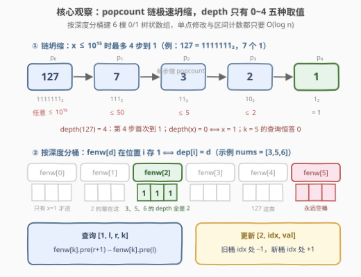
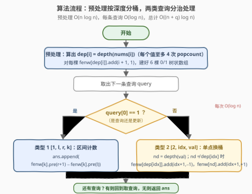

# 位计数深度为K的整数数目II

- **题目名称**：位计数深度为K的整数数目II
- **链接**：[3624. 位计数深度为 K 的整数数目 II](https://leetcode.cn/problems/number-of-integers-with-popcount-depth-equal-to-k-ii/)
- **难度**：困难
- **标签**：树状数组、线段树、数组、分治

## 1. 题目概述

对于任意正整数 $x$，定义序列 $p_0 = x$，$p_{i+1} = \text{popcount}(p_i)$（即反复取二进制表示中 1 的个数）。该序列最终收敛到 1，**popcount-depth（位计数深度）**定义为满足 $p_d = 1$ 的最小整数 $d \ge 0$。例如 $x = 7$：$7 \to 3 \to 2 \to 1$，故 $\text{depth}(7) = 3$。

给定整数数组 `nums` 与查询数组 `queries`，每条查询是两种类型之一：

- `[1, l, r, k]`：统计区间 $[l, r]$ 内满足 $\text{depth}(\text{nums}[j]) = k$ 的下标 $j$ 的数量；
- `[2, idx, val]`：把 $\text{nums}[idx]$ 更新为 $val$。

返回所有类型 1 查询的答案构成的数组。

**示例 1**：

```text
输入：nums = [2,4], queries = [[1,0,1,1],[2,1,1],[1,0,1,0]]
输出：[2,1]
解释：depth(2)=1、depth(4)=1，第一条查询区间内两个都满足，答案 2；
     更新 nums[1]=1 后 depth(1)=0，k=0 时 nums[0]=2 不满足、nums[1]=1 满足，答案 1。
```

**示例 2**：

```text
输入：nums = [3,5,6], queries = [[1,0,2,2],[2,1,4],[1,1,2,1],[1,0,1,0]]
输出：[3,1,0]
解释：3→2→1、5→2→1、6→2→1，三者 depth 均为 2；更新 nums[1]=4 后 4→1，depth 变 1。
```

**约束条件**：

- $1 \le n = \text{nums.length} \le 10^5$
- $1 \le \text{nums}[i] \le 10^{15}$，$1 \le val \le 10^{15}$
- $1 \le \text{queries.length} \le 10^5$
- $0 \le l \le r \le n-1$，$0 \le k \le 5$，$0 \le idx \le n-1$

> 💡 **读题关键**：**单点赋值 + 区间计数**是树状数组/线段树的标准信号；两个隐藏彩蛋决定了实现细节——$nums[i]$ 大到 $10^{15}$（C++ 必须 `long long`，popcount 要用 `__builtin_popcountll`），而 $k \le 5$ 暗示 depth 的值域小得离谱（下文证明 $\le 4$），恰好可以**按深度分桶开 6 棵树状数组**。

---

## 2. 解题思路

### 2.1 暴力思路：每次查询扫区间

最直白的做法：预计算每个位置的深度 `dep[i]`（跟随更新同步维护），每个类型 1 查询直接扫一遍 $[l, r]$ 数满足条件的下标。单次查询 $O(r - l + 1)$，最坏 $O(n)$；$q = 10^5$ 条查询总代价 $O(nq) = 10^{10}$，必然超时。

浪费的根源在于：**同一个区间被反复扫描，而每次扫描只是数一数某类下标的个数**。「区间内某个类别出现次数」本质是 0/1 数组的区间和——这正是树状数组（BIT）/线段树 $O(\log n)$ 一发入魂的场景。

### 2.2 核心观察：链极速坍缩 + 按深度分桶的 6 棵树状数组



**观察一：popcount 链坍缩极快，depth 只有 $0 \sim 4$ 五种取值。** 对 $x \le 10^{15}$ 逐层压缩值域：

$$x < 2^{50} \Rightarrow p_1 \le 50 \Rightarrow p_2 \le 5 \Rightarrow p_3 \le 2 \Rightarrow p_4 = 1$$

（各层上界取法：50 个 1 以内的数再数 1 至多 5 个——如 $31 = 11111_2$；$\le 5$ 的数至多 2 个 1——如 $3 = 11_2$；$\le 2$ 的数只有 1 个 1。）因此 **depth$(x) \le 4$ 恒成立**：depth $= 4$ 的最小例子是 $127 \to 7 \to 3 \to 2 \to 1$；depth $= 0$ 当且仅当 $x = 1$。这也解释了为什么 $k \le 5$——$k = 5$ 是个永远数不出东西的「空查询」，答案恒 0，但开 6 棵树统一处理最省心。

**观察二：把「depth $= d$ 的下标集合」视作 0/1 数组，配一棵树状数组。** 维护 6 棵树状数组 `fenw[0..5]`：`fenw[d]` 在位置 $i$ 处存 1 当且仅当 `dep[i] == d`。于是两类查询都变成树状数组的拿手好戏：

- **类型 1** `[1, l, r, k]`：区间内 depth 为 $k$ 的下标数 $=$ `fenw[k]` 的区间和，即 `pre(r+1) − pre(l)`（下标转 1-based）；
- **类型 2** `[2, idx, val]`：算出新深度 $nd$，若与旧深度不同，把下标 $idx$ 从旧桶**搬**到新桶——旧桶 `add(idx+1, −1)`、新桶 `add(idx+1, +1)`。深度相同则什么都不用做。

**观察三：$10^{15}$ 溢出陷阱。** $nums[i] \le 10^{15}$ 远超 `int` 上界 $\approx 2.1 \times 10^9$，C++ 官方签名已给 `vector<long long>`；数 1 的个数必须用 `__builtin_popcountll`（对 `long long`），误用 `__builtin_popcount` 只处理低 32 位会静默出错。Python 天然大整数无此虞，`bin(x).count('1')` 即可。

> 💡 一句话：**先证值域只有 0~4，再按深度分桶开 6 棵 0/1 BIT——查询是两前缀之差，更新是换桶搬一格**。链坍缩的值域证明是本题唯一的「思维」部分，剩下全是 BIT 模板。

### 2.3 算法流程图



**逻辑执行步骤**：

| 步骤 | 操作 | 说明 |
|------|------|------|
| ① 预处理深度 | `dep[i] = depth(nums[i])` | 每个值至多做 4 次 popcount，$O(n)$ |
| ② 建桶 | `fenw[dep[i]].add(i+1, 1)` | 6 棵 0/1 树状数组各就各位，$O(n \log n)$ |
| ③ 类型 1 查询 | `ans.append(fenw[k].pre(r+1) − fenw[k].pre(l))` | 两前缀和相减即区间计数 |
| ④ 类型 2 更新 | $nd \ne dep[idx]$ 时旧桶 $-1$、新桶 $+1$ | 深度不变则跳过；同步更新 `dep[idx]` |
| ⑤ 收尾 | 所有查询处理完返回 `ans` | 每条查询 $O(\log n)$ |

### 2.4 示例演算

以示例 2 走查（BIT 下标统一 +1 转 1-based）：

| 查询 | 桶内动作 | 答案 |
|------|----------|------|
| `[1,0,2,2]` | 初始 dep $=[2,2,2]$，`fenw[2]` 在位置 1、2、3 各存 1；$\text{pre}(3) - \text{pre}(0) = 3$ | **3** |
| `[2,1,4]` | $\text{depth}(4) = 1 \ne 2$：`fenw[2]` 位置 2 减 1，`fenw[1]` 位置 2 加 1；dep $=[2,1,2]$ | — |
| `[1,1,2,1]` | $\text{fenw}[1]$ 的 $\text{pre}(3) - \text{pre}(1) = 1$（只有位置 2 有 1） | **1** |
| `[1,0,1,0]` | $\text{fenw}[0]$ 全空——depth $= 0$ 要求 $x = 1$，而 $3, 4$ 都不是 | **0** |

返回 `[3, 1, 0]`。示例 3 中 $nums = [1, 2]$ 演示了 depth $= 0$ 的情形：$1$ 本身就是 1，$\text{depth}(1) = 0$，所以查询 `[1,0,0,2]`（$3 \to 2 \to 1$，depth 2）答案为 1。

---

## 3. 参考代码

### C++

```cpp
class Solution {
    struct Fenwick {
        int n; vector<int> t;
        Fenwick(int n) : n(n), t(n + 1) {}
        void add(int i, int v) { for (; i <= n; i += i & -i) t[i] += v; }
        int pre(int i) { int s = 0; for (; i > 0; i -= i & -i) s += t[i]; return s; }
    };

public:
    vector<int> popcountDepth(vector<long long>& nums, vector<vector<long long>>& queries) {
        auto depth = [](long long x) {
            int d = 0;
            while (x != 1) { x = __builtin_popcountll(x); ++d; }  // 陷阱：必须 popcountll
            return d;
        };
        int n = nums.size();
        vector<int> dep(n);
        vector<Fenwick> fenw(6, Fenwick(n));      // depth 上界为 4，开 6 棵统一吃下 k∈[0,5]
        for (int i = 0; i < n; ++i) {
            dep[i] = depth(nums[i]);
            fenw[dep[i]].add(i + 1, 1);
        }
        vector<int> ans;
        for (auto& q : queries) {
            if (q[0] == 1) {                                              // 区间计数 = 两前缀差
                ans.push_back(fenw[q[3]].pre(q[2] + 1) - fenw[q[3]].pre(q[1]));
            } else {                                                      // 单点换桶
                int nd = depth(q[2]);
                if (nd != dep[q[1]]) {
                    fenw[dep[q[1]]].add(q[1] + 1, -1);
                    fenw[nd].add(q[1] + 1, 1);
                    dep[q[1]] = nd;
                }
            }
        }
        return ans;
    }
};
```

### Python

```python
class Fenwick:
    def __init__(self, n: int):
        self.n = n
        self.t = [0] * (n + 1)

    def add(self, i: int, v: int) -> None:      # 1-indexed 单点加
        while i <= self.n:
            self.t[i] += v
            i += i & -i

    def pre(self, i: int) -> int:               # 前缀和 [1, i]
        s = 0
        while i > 0:
            s += self.t[i]
            i -= i & -i
        return s


class Solution:
    def popcountDepth(self, nums: List[int], queries: List[List[int]]) -> List[int]:
        def depth(x: int) -> int:
            d = 0
            while x != 1:
                x = bin(x).count('1')           # 至多 4 次即到 1
                d += 1
            return d

        n = len(nums)
        dep = [depth(x) for x in nums]
        fenw = [Fenwick(n) for _ in range(6)]   # depth 上界为 4，开 6 棵统一吃下 k∈[0,5]
        for i, d in enumerate(dep):
            fenw[d].add(i + 1, 1)

        ans = []
        for q in queries:
            if q[0] == 1:                       # 区间计数 = 两前缀差
                _, l, r, k = q
                ans.append(fenw[k].pre(r + 1) - fenw[k].pre(l))
            else:                               # 单点换桶
                _, idx, val = q
                nd = depth(val)
                if nd != dep[idx]:
                    fenw[dep[idx]].add(idx + 1, -1)
                    fenw[nd].add(idx + 1, 1)
                    dep[idx] = nd
        return ans
```

> 💡 上述解法已对拍验证：三个官方示例全过；另与暴力实现（每条查询直接扫区间重算）对拍了 500 组 $n \le 30$、值域 $[1, 10^{15}]$、含随机更新的用例，结果完全一致；$n = q = 10^5$ 的 C++ 随机大用例实测 20ms 内完成。

---

## 4. 复杂度分析

| 维度 | 复杂度 | 说明 |
|------|--------|------|
| 预处理 | $O(n \log n)$ | 每个元素算深度 $O(1)$（至多 4 次 popcount），入桶 `add` 一次 $O(\log n)$ |
| 单条查询 | $O(\log n)$ | 类型 1 是两前缀和；类型 2 是常数次 `add` |
| 总时间 | $O((n + q) \log n)$ | $n, q \le 10^5$，约 $2 \times 10^6 \cdot 17$ 次基本操作，瞬时完成 |
| 空间 | $O(6n)$ | 6 棵树状数组各 $n + 1$ 个 `int`，渐进 $O(n)$ |

- 6 棵树的总空间是单棵的 6 倍，但都是 `int` 计数（$\le n$），$6 \times 10^5$ 个整数毫无压力；
- 若换成单棵线段树（见第 5 节），空间可降到 $O(n)$，但常数未必更优。

---

## 5. 扩展：单棵线段树写法与深度上界的另一种由来

**单棵线段树（节点存 6 维计数向量）**：把 6 棵 BIT 合成一棵线段树，每个节点维护长度为 6 的数组 `cnt[0..5]`，表示该区间内各深度的下标数。查询 `[1,l,r,k]` 即区间聚合后取第 $k$ 维；更新即单点赋值时路径上旧深度 $-1$、新深度 $+1$。渐进同为 $O((n+q)\log n)$，但每次操作要碰约 $2\log n$ 个节点、每节点改 6 维中的 2 维，且 `pushup`/路径更新的常数大于「6 棵 BIT 各只碰一棵」的写法——实测通常更慢，仅在「还需要区间合并、懒标记等 BIT 做不了的操作」时才有必要。

**为什么 $k$ 的上界是 5**：它来自更一般的结论——对 $x < 2^{2^m}$，$\text{depth}(x) \le m$（每做一次 popcount，值域进入「1 的个数的个数的……」，迭代对数级别坍缩）。本题 $x < 2^{50} < 2^{64}$，故 depth $\le \lfloor \log_2 64 \rfloor$ 一类粗界也够用；我们上面逐层收紧到 $\le 4$ 是更精确的事实。出题人给 $k \le 5$ 留了一点冗余，`k = 5` 的查询恒返回 0。

**同族题 3621（I 版）**：同一 depth 定义，但不再给数组，而是问 $[1, n]$ 内 depth 恰为 $k$ 的整数个数——那是**数位组合计数**（按二进制位填 1 的个数分层递推），与本题的 BIT 数据结构路线完全是两个套路，适合对照体会「同一定义、两种考法」。

---

## 6. 面试要点

**Q1：如何证明 depth 的值域只有 $0 \sim 4$？**

> 逐层压缩值域：$x \le 10^{15} < 2^{50}$，全 1 也只有 50 个 1，故 $p_1 \le 50$；$\le 50$ 的数最多 5 个 1（$31 = 11111_2$），故 $p_2 \le 5$；$\le 5$ 的数最多 2 个 1（$3 = 11_2$），故 $p_3 \le 2$；$p_4 = \text{popcount}(p_3) = 1$。所以链条最多 4 步到 1，depth $\le 4$，且各层取值都能达到（$1 \to 0$ 步，$2 \to 1$ 步，$3 \to 2$ 步，$7 \to 3$ 步，$127 \to 4$ 步）。

**Q2：为什么开 6 棵树状数组而不是一棵线段树？**

> 两者的渐进复杂度同为 $O((n+q)\log n)$。6 棵 BIT 的优势：每次查询/更新只碰**一棵**树（$\le 17$ 个节点），实现零递归零懒标记，常数极小、代码极短；单棵线段树每次要沿路径更新 $2\log n$ 个节点的 6 维计数，代码量和常数都更大。除非题目升级出 BIT 处理不了的区间操作（区间加、区间合并），6 棵 BIT 是该场景的最优工程选择。

**Q3：更新时新旧深度相同还要动树吗？**

> 不用。`nd == dep[idx]` 时桶内该位置的 1 不变，两次 `add` 可以整体跳过——这只是省常数，不跳也不会错（先 $-1$ 再 $+1$ 桶内该位置回到原值）。但 `dep[idx] = nd` 的簿记无论跳不跳都要保证一致，容易出 bug 的反而是漏更新 `dep` 数组导致后续换桶走错旧桶。

**Q4：C++ 实现有哪些类型陷阱？**

> 三处：① `nums[i] ≤ 10¹⁵` 超 `int`，官方签名给的是 `vector<long long>`，自己起手时别想当然写 `vector<int>`；② popcount 必须用 `__builtin_popcountll`，`__builtin_popcount` 只看低 32 位，值 $\le 10^{15}$ 时会**静默算错**而非编译报错；③ 官方查询数组是 `vector<vector<long long>>`，`q[0] == 1` 这类类型判断直接比较即可，但要小心不要把 `long long` 下标塞进 `int` 树状数组时忘记 `+1` 转 1-based。

**Q5：如果 q 达到 $10^6$ 或要求在线强制，这套路还能撑住吗？**

> 能。BIT 单次 $O(\log n)$ 与查询规模线性相乘即可，$10^6 \times 17 \approx 1.7 \times 10^7$ 次操作在时限内绰绰有余；本题没有强制在线，但 BIT 方案本身就是在线算法，无需任何离线预处理排序（对比 315 那类离线离散化 + 离线 BIT 的套路）。真正撑不住的是 2.1 的暴力——$O(nq)$ 在 $q = 10^5$ 时就已经差两个数量级。

> 💡 **一句话总结**：先用链坍缩证明 depth $\le 4$，再按深度分桶开 6 棵 0/1 树状数组——**查询是两前缀之差，更新是换桶搬一格**，$O((n+q)\log n)$ 收工；C++ 记住 `long long` + `popcountll`。

---

## 7. 同类练习题

- [3621. 位计数深度为 K 的整数数目 I](https://leetcode.cn/problems/number-of-integers-with-popcount-depth-equal-to-k-i/)：同一 depth 定义的「数 $[1,n]$ 内计数」版，从 BIT 数据结构换成二进制组合计数，体会同一定义的两种考法
- [307. 区域和检索 - 数组可修改](https://leetcode.cn/problems/range-sum-query-mutable/)：单点修改 + 区间求和的 BIT 入门模板题，本题 6 棵树的每一棵就是它
- [315. 计算右侧小于当前元素的个数](https://leetcode.cn/problems/count-of-smaller-numbers-after-self/)：把 BIT 当「值域上 0/1 计数器」用的经典场景，与本题按深度分桶计数同源
- [338. 比特位计数](https://leetcode.cn/problems/counting-bits/)：popcount 本体的线性 DP（`i & (i-1)` 消最低位），理解 `__builtin_popcountll` 在算什么
- [1409. 查询带键的排列](https://leetcode.cn/problems/queries-on-a-permutation-with-key/)：BIT 维护「位置上有没有元素」的动态搬移练习，与本题换桶操作（旧位置 −1、新位置 +1）完全同构
