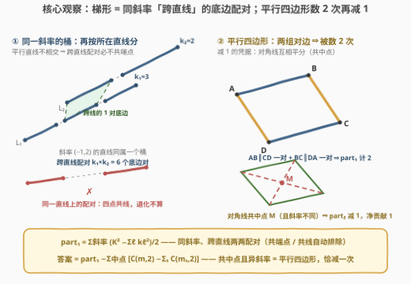
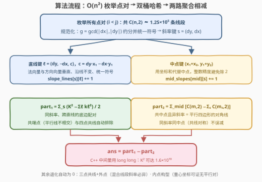

# LeetCode 统计梯形的数目II 题解

## 1. 题目概述

- **标题 / 题号**：统计梯形的数目II（#3625，hard）
- **链接**：https://leetcode.cn/problems/count-number-of-trapezoids-ii/
- **难度**：困难
- **标签**：几何、数组、哈希表、数学

**题意**：给定二维整数数组 `points`，其中 $points[i] = [x_i, y_i]$ 表示平面上第 $i$ 个点。返回从 `points` 中**任选四个不同点**能组成的**梯形**数量。

**梯形**是一种凸四边形，具有**至少一对**平行边；两条直线平行当且仅当它们的斜率相同。

**示例 1**：

```text
输入：points = [[-3,2],[3,0],[2,3],[3,2],[2,-3]]
输出：2
解释：
[-3,2], [2,3], [3,2], [2,-3] 组成一个梯形；
[2,3], [3,2], [3,0], [2,-3] 组成另一个梯形。
```

**示例 2**：

```text
输入：points = [[0,0],[1,0],[0,1],[2,1]]
输出：1
```

**约束**：$4 \le points.length \le 500$，$-1000 \le x_i, y_i \le 1000$，所有点两两不同。

> ⚠️ 「凸四边形」三个字藏着本题（II 版）的全部陷阱：**四点共线**、**三点共线 + 一点在外**、**一点落在三角形内部**这三种退化构型都不是四边形，必须严格排除。只按斜率分桶的朴素做法会在共线构型上翻车（见第 5 节）。

## 2. 解题思路

### 2.1 暴力思路

枚举所有四点组合，对每组求凸包：凸包恰有 4 个顶点才是凸四边形，再把顶点按环序排列、检查两对对边是否至少一对平行。组合数 $\binom{500}{4} \approx 2.6 \times 10^9$，必然超时。

换个视角：不枚举「四点组」，而是枚举「**平行底边对**」——一个凸四边形有至少一对平行边，等价于它的 4 个顶点能**两两配成两条平行线段**。于是问题变成：给平面上 $\binom{n}{2} \approx 1.25 \times 10^5$ 条线段，如何不重不漏地数出「能充当梯形底边」的线段对。

### 2.2 核心观察：斜率 × 直线双重分桶 + 中点去重

把每条线段用三个整数键哈希：

- **斜率键** $s = (dy, dx)$：用 $\gcd(|dx|, |dy|)$ 约分后统一符号（令 $dx > 0$，竖线时令 $dy > 0$）；
- **直线键** $\ell = (a, b, c)$：直线方程 $ax + by = c$，取法向量 $(a,b) = (dy, -dx)$（与方向向量垂直，且因 $(dx,dy)$ 已约分而互质），$c = a x_1 + b y_1$ 沿线不变，再统一 $(a,b)$ 的符号；
- **中点键** $2M = (x_1 + x_2,\ y_1 + y_2)$：用「坐标和」代替中点坐标，避免除 2 引入分数。

在此之上是三条关键性质：

**性质 1（跨直线 ⟹ 必不共端点）**：斜率相同但所在直线不同的两条线段不可能共端点——两条平行且不同的直线没有交点。所以「按直线分桶、只数跨桶配对」一步到位地处理了共端点排除。

**性质 2（同直线 ⟹ 四点共线，退化）**：同一条直线上的两条线段，无论端点是否重叠，4 个端点全部共线，构不成四边形。因此**同一直线桶内部的配对要整体排除**。这正是朴素「只看斜率」做法漏掉的地方。

**性质 3（平行四边形被数两次）**：非退化梯形恰有一对平行边，被数 1 次；平行四边形有两组对边，被数 2 次（同一组 4 个点有两种「配成平行线段对」的方式），需要减 1。平行四边形的判定用**对角线互相平分**：两条线段共中点且斜率不同（排除共线对称构型），就恰是一组平行四边形的对角线。

$$
\text{part}_1 = \sum_{\text{斜率 } s} \frac{K^2 - \sum_{\ell} k_\ell^2}{2} \qquad
\text{part}_2 = \sum_{\text{中点 } M} \left[ \binom{m}{2} - \sum_{s} \binom{m_s}{2} \right]
$$

其中 $K$ 为斜率 $s$ 的线段总数、$k_\ell$ 为其中落在直线 $\ell$ 上的条数（$\frac{K^2 - \sum k_\ell^2}{2} = \sum_{\ell_1 \ne \ell_2} k_{\ell_1} k_{\ell_2}$，即跨直线配对数）；$m$ 为中点在 $M$ 的线段总数、$m_s$ 为其中斜率为 $s$ 的条数。

$$
\boxed{\ \text{答案} = \text{part}_1 - \text{part}_2\ }
$$

其余退化构型**自动为零**，无需特判：

- **三点共线 + 一点在外**（$A,B,C$ 在直线 $L$ 上，$D$ 在外）：任何配对中必有一条「混合线段」（如 $CD$，$C \in L$ 而 $D \notin L$），过 $C$ 且平行于 $L$ 的直线只有 $L$ 本身，故混合线段斜率必异于 $L$，配不成对；
- **一点在三角形内部**（$A$ 在 $\triangle BCD$ 内部）：重心坐标 $A = \alpha B + \beta C + \gamma D$（$\alpha,\beta,\gamma>0$）给出 $A - B = \beta(C-B) + \gamma(D-B)$；若它与 $D - C = (D-B)-(C-B)$ 平行，比较系数得 $\gamma = -\beta < 0$，矛盾。内点构型中任何两条线段都不平行。



### 2.3 算法流程图



### 2.4 示例演算

以示例 2 `points = [[0,0],[1,0],[0,1],[2,1]]` 为例，记 $A(0,0), B(1,0), C(0,1), D(2,1)$，共 6 条线段：

| 线段 | 斜率 $(dy,dx)$ | 直线 | 中点和 |
|------|----------------|------|--------|
| $AB$ | $(0,1)$ | $y=0$ | $(1,0)$ |
| $CD$ | $(0,1)$ | $y=1$ | $(2,2)$ |
| $AC$ | $(1,0)$ | $x=0$ | $(0,1)$ |
| $BD$ | $(1,1)$ | — | $(3,1)$ |
| $AD$ | $(1,2)$ | — | $(2,1)$ |
| $BC$ | $(-1,1)$ | — | $(1,1)$ |

- 斜率 $(0,1)$ 的桶：$K=2$，分属直线 $y=0$ 与 $y=1$（各 $k=1$），跨直线配对 $\frac{2^2 - (1^2+1^2)}{2} = 1$，即 $AB \parallel CD$ 这对底边；其余斜率桶均无配对，$\text{part}_1 = 1$；
- 6 个中点互不相同，$\text{part}_2 = 0$；
- 答案 $= 1 - 0 = 1$ ✓。

## 3. 参考代码

### C++

```cpp
class Solution {
public:
    int countTrapezoids(vector<vector<int>>& points) {
        int n = points.size();
        map<pair<int,int>, map<array<long long,3>, int>> slopeLines;  // 斜率 -> 直线 -> 条数
        map<pair<int,int>, map<pair<int,int>, int>> midSlopes;        // 中点和 -> 斜率 -> 条数

        for (int i = 0; i < n; i++) {
            long long x1 = points[i][0], y1 = points[i][1];
            for (int j = i + 1; j < n; j++) {
                long long x2 = points[j][0], y2 = points[j][1];
                long long dx = x2 - x1, dy = y2 - y1;
                long long g = gcd(dx < 0 ? -dx : dx, dy < 0 ? -dy : dy);
                dx /= g; dy /= g;
                if (dx < 0 || (dx == 0 && dy < 0)) { dx = -dx; dy = -dy; }
                pair<int,int> slope{(int)dy, (int)dx};
                // 直线 dy*x - dx*y = c，法向量与方向向量垂直，c 沿线不变
                long long a = dy, b = -dx, c = a * x1 + b * y1;
                if (a < 0 || (a == 0 && b < 0)) { a = -a; b = -b; c = -c; }
                slopeLines[slope][{a, b, c}]++;
                midSlopes[{(int)(x1 + x2), (int)(y1 + y2)}][slope]++;
            }
        }

        long long ans = 0;
        for (auto& [s, lines] : slopeLines) {
            long long K = 0, sq = 0;
            for (auto& [l, cnt] : lines) { K += cnt; sq += 1LL * cnt * cnt; }
            ans += (K * K - sq) / 2;                    // 同斜率、跨直线的配对数
        }
        for (auto& [m, slopes] : midSlopes) {
            long long tot = 0, same = 0;
            for (auto& [s, cnt] : slopes) { tot += cnt; same += 1LL * cnt * (cnt - 1) / 2; }
            ans -= tot * (tot - 1) / 2 - same;          // 共中点且异斜率 = 平行四边形
        }
        return (int)ans;
    }
};
```

### Python

```python
from collections import defaultdict
from math import gcd

class Solution:
    def countTrapezoids(self, points: List[List[int]]) -> int:
        slope_lines = defaultdict(lambda: defaultdict(int))  # 斜率 -> 直线 -> 条数
        mid_slopes = defaultdict(lambda: defaultdict(int))   # 中点和 -> 斜率 -> 条数

        for i in range(len(points)):
            x1, y1 = points[i]
            for j in range(i + 1, len(points)):
                x2, y2 = points[j]
                dx, dy = x2 - x1, y2 - y1
                g = gcd(dx, dy)                    # math.gcd 自动取绝对值
                dx //= g; dy //= g
                if dx < 0 or (dx == 0 and dy < 0):
                    dx, dy = -dx, -dy
                slope = (dy, dx)
                a, b, c = dy, -dx, dy * x1 - dx * y1
                if a < 0 or (a == 0 and b < 0):
                    a, b, c = -a, -b, -c
                slope_lines[slope][(a, b, c)] += 1
                mid_slopes[(x1 + x2, y1 + y2)][slope] += 1

        ans = 0
        for lines in slope_lines.values():
            K = sum(lines.values())
            ans += (K * K - sum(c * c for c in lines.values())) // 2
        for slopes in mid_slopes.values():
            m = sum(slopes.values())
            ans -= m * (m - 1) // 2 - sum(c * (c - 1) // 2 for c in slopes.values())
        return ans
```

## 4. 复杂度分析

| 维度 | 复杂度 | 说明 |
|------|--------|------|
| 时间 | $O(n^2 \log C)$ | $\binom{n}{2} \approx 1.25 \times 10^5$ 条线段，每条做一次 $\gcd$（$\log C$ 因子，$C=2000$ 很小）+ $O(1)$ 哈希插入；聚合是桶总数的线性遍历 |
| 空间 | $O(n^2)$ | 两张二层哈希表共存放 $\binom{n}{2}$ 条线段的键 |
| 溢出 | 中间量必须 `long long` | 单个斜率桶内 $K \le \binom{500}{2} = 124750$，$K^2 \approx 1.56 \times 10^{10}$ 超 `int`；最终答案上界约 $9.7 \times 10^8$（两条各 250 点的平行线构造实测），返回 `int` 安全 |

## 5. 扩展：为什么「只按斜率分桶」的朴素公式是错的

一个流传较广的简化版本是：斜率桶内取 $\binom{K}{2}$ 减去共端点的对数（$\sum_p \binom{d_p}{2}$，$d_p$ 为该桶中经过点 $p$ 的线段数），再减去中点相同的线段对数（平行四边形）。

**反例**：整个输入只有共线四点 $(0,0),(1,0),(2,0),(3,0)$。水平桶内 6 条线段两两配对 $\binom{6}{2}=15$，共端点对 $4 \times \binom{3}{2} = 12$，剩 3 对「不共端点」的配对 $(01|23),(02|13),(03|12)$；其中只有 $(03|12)$ 共中点被平行四边形扣除，朴素公式得 $3 - 1 = 2$，而正确答案是 **0**（四点共线不是四边形）。

修复方式就是本文的**直线分桶**：同斜率且同直线的配对整体排除，共线四点自动归零。在 600 组含大量共线退化的随机数据对拍中，朴素公式在 193 组上出错，直线分桶版全部与暴力一致。若题目额外保证「任意四点不共线」，两个公式才等价。3623（Trapezoids I）是同题面的小规模版，同样用「斜率哈希数平行底边对」起手。

## 6. 面试要点

**Q1：为什么斜率相同、直线不同的两条线段一定不共端点？**
　　两条平行且不同的直线没有公共点；若共端点则两条直线都过该点且斜率相同，必为同一条直线，矛盾。

**Q2：四点共线的构型是怎么被排除的？共端点的又是怎么被排除的？**
　　共端点：由 Q1 自动排除；四点共线：桶内再按「所在直线」细分，只数跨直线的配对，同直线的配对（无论端点是否重叠）全部不算——这也是本题相对 3623 最容易翻车的点。

**Q3：平行四边形为什么恰好多算一次？减法为什么不重不漏？**
　　平行四边形有两组对边，底边配对时被数 2 次；它的两条对角线互相平分（共中点）且斜率不同，恰被中点桶识别一次，减 1 后净贡献 1。非平行四边形梯形只有一组对边，数 1 减 0；共线对称构型（如 $(0,0),(3,0)$ 与 $(1,0),(2,0)$）虽共中点但同斜率，不会误减。

**Q4：中点为什么用 $(x_1+x_2,\ y_1+y_2)$ 作键？**
　　整数坐标和保持整数精度，避免 $\frac{x_1+x_2}{2}$ 引入分数或浮点误差；两线段共中点 ⟺ 坐标和相等。

**Q5：坐标和规模都不大，还需要担心溢出吗？**
　　需要。返回值虽在 `int` 内（约 $10^9$ 量级），但聚合式里的 $K^2$ 可达 $1.56 \times 10^{10}$，C++ 中间量必须用 `long long`。

## 同类练习题

| # | 题目 | 与本题的关联 |
|---|------|-------------|
| 3623 | [统计梯形的数目 I](https://leetcode.cn/problems/count-number-of-trapezoids-i/) | 同题面小规模版，同样的「斜率哈希数平行底边对」起手式 |
| 149 | [直线上最多的点数](https://leetcode.cn/problems/max-points-on-a-line/) | $\gcd$ 规范化 $(dy, dx)$ 做直线哈希的经典出处 |
| 963 | [最小面积矩形 II](https://leetcode.cn/problems/minimum-area-rectangle-ii/) | 按「中心点 + 对角线长度」分桶配对找矩形，与本题中点哈希同源 |
| 939 | [最小面积矩形](https://leetcode.cn/problems/minimum-area-rectangle/) | 对角线端点配对哈希判定矩形的代表题 |
| 2280 | [表示一个折线图的最少线段数](https://leetcode.cn/problems/minimum-lines-to-represent-a-line-chart/) | 按规范化斜率对共线段去重，练习斜率键的定号细节 |
