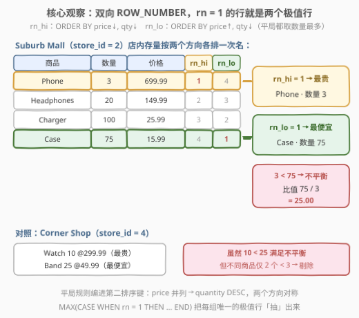
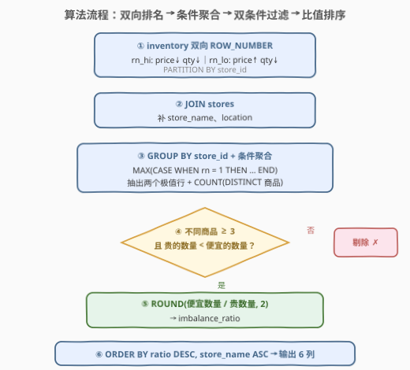

# LeetCode 查找库存不平衡的店铺 题解

## 1. 题目概述

- **标题 / 题号**：查找库存不平衡的店铺（#3626，medium）
- **链接**：https://leetcode.cn/problems/find-stores-with-inventory-imbalance/
- **难度**：中等
- **标签**：数据库、SQL、窗口函数、`ROW_NUMBER()`、条件聚合、`GROUP BY`、`ROUND()`、pandas

**表结构**：`stores` 表

| 列名 | 类型 |
|------|------|
| store_id | int |
| store_name | varchar |
| location | varchar |

- `store_id` 是这张表的唯一主键。
- 每一行包含有关商店及其位置的信息。

**表结构**：`inventory` 表

| 列名 | 类型 |
|------|------|
| inventory_id | int |
| store_id | int |
| product_name | varchar |
| quantity | int |
| price | decimal |

- `inventory_id` 是这张表的唯一主键。
- 每一行代表特定商店中某一特定产品的库存情况。

**目标**：编写一个解决方案查找**库存不平衡**的商店——即**最贵商品的库存比最便宜商品少**的商店。

- 对每个商店，识别**最贵的商品**（最高价格）及其数量；若有多个最贵的商品，选取**数量最多**的一个；
- 对每个商店，识别**最便宜的商品**（最低价格）及其数量；若有多个最便宜的商品，同样选取**数量最多**的一个；
- 若最贵商品的**数量少于**最便宜商品的数量，则该商店存在库存不平衡；
- 不平衡比 = **最便宜商品的数量 ÷ 最贵商品的数量**，**舍入到 2 位小数**；
- 结果只包含**至少有 3 个不同商品**的店铺；
- 返回 `store_id`、`store_name`、`location`、`most_exp_product`、`cheapest_product`、`imbalance_ratio`，按 `imbalance_ratio` **降序**、再按 `store_name` **升序**排列。

**示例 1**：

```text
输入：
stores 表:
+----------+----------------+-------------+
| store_id | store_name     | location    |
+----------+----------------+-------------+
| 1        | Downtown Tech  | New York    |
| 2        | Suburb Mall    | Chicago     |
| 3        | City Center    | Los Angeles |
| 4        | Corner Shop    | Miami       |
| 5        | Plaza Store    | Seattle     |
+----------+----------------+-------------+

inventory 表:
+--------------+----------+--------------+----------+--------+
| inventory_id | store_id | product_name | quantity | price  |
+--------------+----------+--------------+----------+--------+
| 1            | 1        | Laptop       | 5        | 999.99 |
| 2            | 1        | Mouse        | 50       | 19.99  |
| 3            | 1        | Keyboard     | 25       | 79.99  |
| 4            | 1        | Monitor      | 15       | 299.99 |
| 5            | 2        | Phone        | 3        | 699.99 |
| 6            | 2        | Charger      | 100      | 25.99  |
| 7            | 2        | Case         | 75       | 15.99  |
| 8            | 2        | Headphones   | 20       | 149.99 |
| 9            | 3        | Tablet       | 2        | 499.99 |
| 10           | 3        | Stylus       | 80       | 29.99  |
| 11           | 3        | Cover        | 60       | 39.99  |
| 12           | 4        | Watch        | 10       | 299.99 |
| 13           | 4        | Band         | 25       | 49.99  |
| 14           | 5        | Camera       | 8        | 599.99 |
| 15           | 5        | Lens         | 12       | 199.99 |
+--------------+----------+--------------+----------+--------+

输出：
+----------+----------------+-------------+------------------+--------------------+------------------+
| store_id | store_name     | location    | most_exp_product | cheapest_product   | imbalance_ratio  |
+----------+----------------+-------------+------------------+--------------------+------------------+
| 3        | City Center    | Los Angeles | Tablet           | Stylus             | 40.00            |
| 2        | Suburb Mall    | Chicago     | Phone            | Case               | 25.00            |
| 1        | Downtown Tech  | New York    | Laptop           | Mouse              | 10.00            |
+----------+----------------+-------------+------------------+--------------------+------------------+
```

**解释**：

- **Downtown Tech（store_id = 1）**：最贵 Laptop（$999.99）数量 5；最便宜 Mouse（$19.99）数量 50；5 < 50 → 不平衡，比值 50 / 5 = **10.00**；共 4 件商品（≥ 3）→ 入选；
- **Suburb Mall（store_id = 2）**：最贵 Phone（$699.99）数量 3；最便宜 Case（$15.99）数量 75；3 < 75 → 不平衡，比值 75 / 3 = **25.00**；共 4 件商品 → 入选；
- **City Center（store_id = 3）**：最贵 Tablet（$499.99）数量 2；最便宜 Stylus（$29.99）数量 80；2 < 80 → 不平衡，比值 80 / 2 = **40.00**；共 3 件商品 → 入选；
- **落选商店**：Corner Shop（store_id = 4）只有 2 件商品，Plaza Store（store_id = 5）也只有 2 件商品，不满足「至少 3 个不同商品」→ 剔除；
- 按不平衡比降序：40.00 → 25.00 → 10.00。

> 💡 **审题关键**：① 要的不是「最高/最低价格」这个**值**，而是**取得极值的那一整行**（商品名 + 数量）——`MAX(price)` 只能拿到值，拿不到伴随列；② 两处平局规则**对称**：最贵并列取数量最多的，最便宜并列也取数量最多的，两个方向的 `ORDER BY` 里 `quantity` 都是 `DESC`；③ 不平衡判定是**严格小于**（`hi_qty < lo_qty`），相等不算；④ 「至少 3 个不同商品」是 `COUNT(DISTINCT product_name) >= 3`，且统计的是**该店全部商品**、不受其他条件影响；⑤ 比值方向是 `便宜的数量 / 贵的数量`，别写反；⑥ 双键排序方向相反：比值降序在前、店名升序在后；⑦ 输出别忘了 `location` 列。

## 2. 解题思路

### 2.1 暴力思路：逐商店应用层扫描 / 相关子查询硬取极值行

最直觉的做法是把极值判定搬进应用层：先 `SELECT * FROM stores`，再对每个商店发两条查询——

```sql
SELECT product_name, quantity FROM inventory
WHERE store_id = ?
ORDER BY price DESC, quantity DESC LIMIT 1;   -- 最贵
```

（最便宜同理，`price ASC`。）拿到两个 `(商品名, 数量)` 后在代码里比大小、算比值、四舍五入、手工排序。商店数条查询 × 每条一次扫描，分页、过滤、舍入全在数据库外手工维护；`ROUND` 的口径、排序稳定性稍有偏差就和期望输出对不上。

SQL 内的「暴力」变体是**两次分组 + 关联回原表**：先 `GROUP BY store_id` 算出 `MAX(price)`/`MIN(price)`，再 `JOIN inventory` 回去取到极值行——但并列价格会 join 出**多行**（同价商品有好几个），还得再按数量做一层「组内最大」的筛选，嵌套两层自连接才能拿到唯一的极值行，写出来既长又易错。

> ⚠️ 瓶颈在于把「**取极值的那一行**」当成「先算极值、再找回那一行」两步。突破口是用**窗口函数的 `ROW_NUMBER()`** 给每个商店的行做「按 (price, quantity) 双键字典序」排名，让极值行**自己带编号浮上来**——`rn = 1` 的行天然就是唯一的极值行。

### 2.2 核心观察：双向 `ROW_NUMBER` 双键排名 + 条件聚合



**观察一：极值行 = 双键字典序的第一名，平局规则直接编进 `ORDER BY`。** 题目要求「最贵且并列时数量最多」，这正是把 `(price, quantity)` 当作**复合排序键**：

$$\texttt{ROW\_NUMBER() OVER (PARTITION BY store\_id ORDER BY price DESC, quantity DESC)} = 1$$

这一行就是「最贵的商品；若最贵并列，取数量最多的一个」——平局规则不用任何额外代码，它就是第二排序键。最便宜方向对称：`ORDER BY price ASC, quantity DESC`——注意 **`quantity` 仍是 `DESC`**，因为「最便宜并列时也取数量最多的」。

**观察二：两个方向各排一次，一次子查询同时产出两枚「第 1 名」。** 同一个内层查询里写两个窗口（`rn_hi` 与 `rn_lo`），每行库存同时带上两个方向的排名；随后 `GROUP BY store_id` 用**条件聚合**把 `rn = 1` 的行「抽」出来：

$$\texttt{MAX(CASE WHEN rn\_hi = 1 THEN product\_name END)} \Rightarrow \text{最贵商品名}$$

`CASE WHEN rn = 1 THEN ... ELSE NULL END` 让非第 1 名的行全部贡献 `NULL`，`MAX` 负责把唯一的非 `NULL` 值捞出来——「每组抽一行」被压成「每组取一个非空聚合值」。

**观察三：过滤条件各归其位，`COUNT(DISTINCT)` 与极值判定互不干扰。** 「至少 3 个不同商品」与「`hi_qty < lo_qty`」都作用在**商店**粒度上，恰好都是外层 `WHERE` 的条件；而「取哪一行做极值」已在窗口排名里内定。三层语义（行级排名 → 店级聚合 → 店级过滤）一层不多、一层不少。

> 💡 一句话：**「极值行」用双键 `ROW_NUMBER` 编码进窗口排序，「抽行」用 `MAX + CASE` 条件聚合，「阈值」用店级 `WHERE` 一刀切**——不需要任何自连接回表。

### 2.3 算法流程图



**逻辑执行步骤**：

| 步骤 | 操作 | 说明 |
|------|------|------|
| ① 双向排名 | `ROW_NUMBER() OVER (PARTITION BY store_id ORDER BY price DESC, quantity DESC)` 及 `price ASC` 版 | 每行库存带 `rn_hi`/`rn_lo` 两个名次 |
| ② 连接 | `JOIN stores ON store_id` | 补 `store_name`、`location` |
| ③ 条件聚合 | `GROUP BY store_id` + `MAX(CASE WHEN rn_hi = 1 THEN ... END)` 等 | 每店一行：两个极值商品名、两个数量、`COUNT(DISTINCT product_name)` |
| ④ 店级过滤 | `WHERE product_cnt >= 3 AND most_exp_qty < cheapest_qty` | 「≥ 3 个不同商品」+「严格小于」两刀 |
| ⑤ 算比值 | `ROUND(cheapest_qty / most_exp_qty, 2)` | 分子是**便宜的数量**，舍入 2 位 |
| ⑥ 排序 | `ORDER BY imbalance_ratio DESC, store_name ASC` | 双键、方向相反 |

> ⚠️ 过滤发生在**聚合之后**（外层 `WHERE` 引用的是聚合结果列），不能提前塞进内层子查询——③ 聚合还没做，`product_cnt`、`most_exp_qty` 这些量在行级根本不存在。这与「行级窗口 → 店级聚合 → 店级过滤」的语义分层一一对应。

### 2.4 示例演算

对示例数据先做双向排名（每店内部）：

| 商店 | 商品 | 数量 | 价格 | `rn_hi`（价降,量降） | `rn_lo`（价升,量降） |
|------|------|------|------|---------|---------|
| Downtown Tech | **Laptop** | 5 | 999.99 | **1** | 4 |
| Downtown Tech | Monitor | 15 | 299.99 | 2 | 3 |
| Downtown Tech | Keyboard | 25 | 79.99 | 3 | 2 |
| Downtown Tech | **Mouse** | 50 | 19.99 | 4 | **1** |
| Suburb Mall | **Phone** | 3 | 699.99 | **1** | 4 |
| Suburb Mall | Headphones | 20 | 149.99 | 2 | 3 |
| Suburb Mall | Charger | 100 | 25.99 | 3 | 2 |
| Suburb Mall | **Case** | 75 | 15.99 | 4 | **1** |
| City Center | **Tablet** | 2 | 499.99 | **1** | 3 |
| City Center | Cover | 60 | 39.99 | 2 | 2 |
| City Center | **Stylus** | 80 | 29.99 | 3 | **1** |
| Corner Shop | Watch / Band | 10 / 25 | 299.99 / 49.99 | 1 / 2 | 2 / 1 |
| Plaza Store | Camera / Lens | 8 / 12 | 599.99 / 199.99 | 1 / 2 | 2 / 1 |

条件聚合后每店一行，再过 `WHERE` 双条件：

| 商店 | 商品数 | 最贵 (数量) | 最便宜 (数量) | ≥ 3 且 hi < lo？ | 比值 |
|------|--------|------------|--------------|------------------|------|
| Downtown Tech | 4 | Laptop (5) | Mouse (50) | ✅ / ✅ | 50/5 = **10.00** |
| Suburb Mall | 4 | Phone (3) | Case (75) | ✅ / ✅ | 75/3 = **25.00** |
| City Center | 3 | Tablet (2) | Stylus (80) | ✅ / ✅ | 80/2 = **40.00** |
| Corner Shop | 2 | Watch (10) | Band (25) | ✗ 商品数 < 3 | — |
| Plaza Store | 2 | Camera (8) | Lens (12) | ✗ 商品数 < 3 | — |

收尾按比值降序：**40.00 → 25.00 → 10.00**，无平局、店名序不起作用，输出与期望一致。注意 Corner Shop 虽然满足 `10 < 25` 的不平衡条件，却先被「商品数 ≥ 3」拦下——两个 `WHERE` 条件谁先谁后无所谓，**必须都成立**。

## 3. 参考代码

### SQL（解法 A：双向窗口 + 条件聚合，推荐）

```sql
# Write your MySQL query statement below
SELECT
    store_id,
    store_name,
    location,
    most_exp_product,
    cheapest_product,
    ROUND(cheapest_qty / most_exp_qty, 2) AS imbalance_ratio
FROM (
    SELECT
        s.store_id,
        s.store_name,
        s.location,
        COUNT(DISTINCT i.product_name) AS product_cnt,
        MAX(CASE WHEN i.rn_hi = 1 THEN i.product_name END) AS most_exp_product,
        MAX(CASE WHEN i.rn_hi = 1 THEN i.quantity END) AS most_exp_qty,
        MAX(CASE WHEN i.rn_lo = 1 THEN i.product_name END) AS cheapest_product,
        MAX(CASE WHEN i.rn_lo = 1 THEN i.quantity END) AS cheapest_qty
    FROM (
        SELECT
            store_id,
            product_name,
            quantity,
            price,
            ROW_NUMBER() OVER (PARTITION BY store_id
                               ORDER BY price DESC, quantity DESC) AS rn_hi,
            ROW_NUMBER() OVER (PARTITION BY store_id
                               ORDER BY price ASC, quantity DESC) AS rn_lo
        FROM inventory
    ) i
    JOIN stores s ON s.store_id = i.store_id
    GROUP BY s.store_id, s.store_name, s.location
) t
WHERE product_cnt >= 3
  AND most_exp_qty < cheapest_qty
ORDER BY imbalance_ratio DESC, store_name ASC;
```

> 💡 **写法要点**：
> - 内层两个 `ROW_NUMBER()` 共享同一个 `PARTITION BY store_id`，MySQL 8 只需对 `(store_id, price)` 做一次分区排序即可同时产出两个名次，代价并非两倍；
> - 平局规则全部编进 `ORDER BY`：`price DESC, quantity DESC` 与 `price ASC, quantity DESC`——**两个方向的 `quantity` 都是 `DESC`**，对应题目两处对称的「并列取数量最多」；
> - `MAX(CASE WHEN rn = 1 THEN ... END)` 抽取每组唯一的极值行；即便同价同量仍并列（`ROW_NUMBER` 强制唯一），`MAX` 也只会捞到一个值，不会串行；
> - `GROUP BY` 把 `store_name`、`location` 一并列入，兼容 `ONLY_FULL_GROUP_BY`；外层 `WHERE` 引用别名（派生表列），`ROUND` 与 `ORDER BY` 都引用外层别名，MySQL 均允许。

### SQL（解法 B：相关子查询 + `ORDER BY ... LIMIT 1`）

```sql
# Write your MySQL query statement below
WITH pick AS (
    SELECT
        s.store_id,
        s.store_name,
        s.location,
        (SELECT i.product_name FROM inventory i
         WHERE i.store_id = s.store_id
         ORDER BY i.price DESC, i.quantity DESC LIMIT 1) AS most_exp_product,
        (SELECT i.quantity FROM inventory i
         WHERE i.store_id = s.store_id
         ORDER BY i.price DESC, i.quantity DESC LIMIT 1) AS most_exp_qty,
        (SELECT i.product_name FROM inventory i
         WHERE i.store_id = s.store_id
         ORDER BY i.price ASC, i.quantity DESC LIMIT 1) AS cheapest_product,
        (SELECT i.quantity FROM inventory i
         WHERE i.store_id = s.store_id
         ORDER BY i.price ASC, i.quantity DESC LIMIT 1) AS cheapest_qty,
        (SELECT COUNT(DISTINCT i.product_name) FROM inventory i
         WHERE i.store_id = s.store_id) AS product_cnt
    FROM stores s
)
SELECT
    store_id,
    store_name,
    location,
    most_exp_product,
    cheapest_product,
    ROUND(cheapest_qty / most_exp_qty, 2) AS imbalance_ratio
FROM pick
WHERE product_cnt >= 3
  AND most_exp_qty < cheapest_qty
ORDER BY imbalance_ratio DESC, store_name ASC;
```

> 💡 **写法要点**：
> - 标量子查询 `ORDER BY price DESC, quantity DESC LIMIT 1` 一步取到「字典序第一名」的伴随列，平局规则同样内嵌在排序键里，逻辑与解法 A 的 `rn = 1` 完全等价；
> - 优点是**不依赖窗口函数**，MySQL 5.x 也能跑，且从 `stores` 出发、天然不带「无库存的幽灵店」；缺点是同一排序写了四遍，每个子查询都触发一次索引/扫描，商店多时代价高于解法 A；
> - CTE `pick` 先把五个标量子查询物化成列，外层 `WHERE` 直接引用列名，避免在外层重复展开子查询条件。

### Python（pandas）

```python
import pandas as pd


def find_stores_with_inventory_imbalance(stores: pd.DataFrame, inventory: pd.DataFrame) -> pd.DataFrame:
    hi = (
        inventory.sort_values(["price", "quantity"], ascending=[False, False])
        .groupby("store_id", as_index=False)
        .first()[["store_id", "product_name", "quantity"]]
        .rename(columns={"product_name": "most_exp_product", "quantity": "most_exp_qty"})
    )
    lo = (
        inventory.sort_values(["price", "quantity"], ascending=[True, False])
        .groupby("store_id", as_index=False)
        .first()[["store_id", "product_name", "quantity"]]
        .rename(columns={"product_name": "cheapest_product", "quantity": "cheapest_qty"})
    )
    cnt = (
        inventory.groupby("store_id", as_index=False)["product_name"]
        .nunique()
        .rename(columns={"product_name": "product_cnt"})
    )

    m = stores.merge(hi, on="store_id").merge(lo, on="store_id").merge(cnt, on="store_id")
    m = m[(m["product_cnt"] >= 3) & (m["most_exp_qty"] < m["cheapest_qty"])].copy()
    m["imbalance_ratio"] = (m["cheapest_qty"] / m["most_exp_qty"]).round(2)
    m = m.sort_values(["imbalance_ratio", "store_name"], ascending=[False, True])
    return m[["store_id", "store_name", "location",
              "most_exp_product", "cheapest_product", "imbalance_ratio"]].reset_index(drop=True)
```

> 💡 **pandas 对照**：
> - `sort_values(["price", "quantity"], ascending=[False, False])` 后 `groupby.first()` 即「每组按双键字典序取第一行」，与 `ROW_NUMBER() = 1` 语义一致（也可用 `groupby.head(1)` 保留整行）；
> - `.round(2)` 对应 SQL 的 `ROUND(x, 2)`；pandas 的 `/` 对整数列也走浮点除法，**没有** MySQL 之外的整除坑；
> - `nunique()` 就是 `COUNT(DISTINCT product_name)`，与 `count()`（数行数）区分开。

## 4. 复杂度分析

| 维度 | 复杂度 | 说明 |
|------|--------|------|
| **时间复杂度** | $O(N \log N + S)$ | $N$ 行 `inventory` 做窗口分区排序 $O(N \log N)$；条件聚合一趟 $O(N)$；`JOIN` 与输出 $S$ 个商店线性 |
| **空间复杂度** | $O(N + S)$ | 内层带排名的中间结果至多 $N$ 行 + 每店一行的聚合结果 $S$ 行 |

> - 解法 B 的标量子查询对每个商店各扫一次 `inventory`，最坏 $O(S \cdot N)$；若 `inventory(store_id, price)` 上有索引，每次退化为该店子集的排序，实际接近 $O(N \log N)$。
> - 纯判题场景两者都远低于时限；生产环境优先解法 A 的窗口写法。

## 5. 扩展：`GROUP_CONCAT` 取极值行与整除陷阱

**MySQL 5.x 的另一件老兵器：`SUBSTRING_INDEX + GROUP_CONCAT` 取极值行的伴随列。** 若不想写窗口函数也不想写相关子查询，可以按想要的顺序把列「串」起来再切第一段：

```sql
SELECT
    store_id,
    SUBSTRING_INDEX(GROUP_CONCAT(product_name ORDER BY price DESC, quantity DESC), ',', 1) AS most_exp_product,
    CAST(SUBSTRING_INDEX(GROUP_CONCAT(quantity ORDER BY price DESC, quantity DESC), ',', 1) AS UNSIGNED) AS most_exp_qty
FROM inventory
GROUP BY store_id;
```

`GROUP_CONCAT(... ORDER BY ...)` 让字符串按目标字典序拼接，`SUBSTRING_INDEX(..., ',', 1)` 切出第一段——「argmax 的伴随列」被编码成「有序串的首元素」。套路古老但极通用（同样能取第 k 名）；缺点是受 `group_concat_max_len` 默认 1024 限制，商品超多时需 `SET SESSION group_concat_max_len = ...`。

**整除陷阱：比值列在不同方言里的类型行为。** 本题 `quantity` 是 `int`：

- MySQL 的 `/` **永远做除法返回 DECIMAL/浮点**（整除另有 `DIV` 运算符），`75 / 3 = 25.0000`，`ROUND(..., 2)` 直接可用；
- PostgreSQL / SQLite 里 `int / int` 是**整数除法**，`7 / 2 = 3`，必须写成 `1.0 * cheapest_qty / most_exp_qty` 或 `CAST(... AS NUMERIC)` 再 `ROUND`；
- pandas 的 Series 除法走浮点，无此坑；但 numpy 的 `int32 / int32` 与 Python 3 的 `/` 行为不同方言各有细节，跨引擎迁移 SQL 时优先显式转型。

> 💡 判题用 MySQL 不用担心；但如果面试官追问「这条 SQL 搬到 PG 会怎样」，整除坑就是标准考点。

## 6. 面试要点

**Q1：为什么不能只用 `MAX(price)` / `MIN(price)`？窗口函数解决了什么问题？**

> 聚合函数 `MAX/MIN` 只返回**极值本身**，而题目要的是**取得极值的那一整行**（商品名 + 数量）伴随列。传统解法「先 `GROUP BY` 求极值、再 `JOIN` 回原表」会因并列价格产生多行，还需二次筛选。`ROW_NUMBER()` 把排名附在**每一行**上，`rn = 1` 的行自带全部伴随列——「组内 Top-1」一步到位，这正是窗口函数「聚合语境下保留行细节」的核心价值。

**Q2：两个方向的 `ORDER BY` 为什么 `quantity` 都是 `DESC`？写反一处会怎样？**

> 题目两处平局规则对称：最贵并列取数量最多，最便宜并列也取数量最多。所以 `rn_hi` 用 `price DESC, quantity DESC`，`rn_lo` 用 `price ASC, quantity DESC`。若 `rn_lo` 的 `quantity` 顺手写成 `ASC`，「最便宜并列」时会取**数量最少**的那个，`cheapest_qty` 偏小、可能漏判不平衡或算错比值——示例数据没有并列价格，测不出来，构造数据下必挂。

**Q3：「至少 3 个不同商品」为什么用 `COUNT(DISTINCT product_name)` 而不是 `COUNT(*)`？**

> 题面说「至少有 3 个**不同**商品」，口径是商品名的去重计数。`inventory` 的主键是 `inventory_id`，同一 `(store_id, product_name)` 理论上可出现多行（如不同批次不同价），`COUNT(*)` 会把重复商品也数进去，放走本该剔除的店。示例数据没有重复，两种写法结果相同——这正是「示例测不出、构造数据必挂」的典型边界。

**Q4：`WHERE product_cnt >= 3 AND most_exp_qty < cheapest_qty` 为什么必须写在派生表外层，而不是内层？**

> 这两个条件引用的都是**商店级聚合结果**（商品数、两个极值数量），只有 `GROUP BY store_id` 之后这些列才存在；内层子查询还在行级排名阶段，既没有这些量、也轮不到过滤。SQL 的逻辑执行顺序 `窗口 → JOIN/WHERE → GROUP BY → HAVING → SELECT → ORDER BY` 决定了「过滤要发生在它引用的量诞生之后」——若想在内层就地过滤，等价的写法是给外层加 `HAVING`，语义相同。

**Q5：pandas 里 `sort_values` + `groupby.first()` 与 SQL 的 `ROW_NUMBER() = 1` 等价吗？有什么注意点？**

> 语义等价：先按 `["price", "quantity"]` 全表排序，`groupby("store_id").first()` 取每组排序后的第一行，即按双键字典序的组内 Top-1。注意两点：一是 `first()` 默认跳过 `NaN`，若极值列可能为空应改用 `groupby.head(1)`（严格取物理第一行）；二是排序键与 `ascending` 列表必须一一对应，双键两个方向相反（`[False, False]` 与 `[True, False]`）正对应本题两个对称的平局规则。

> 💡 **一句话总结**：3626 = 「`(price, quantity)` 双键字典序」的两个对称 `ROW_NUMBER` + 「`MAX + CASE` 条件聚合」抽极值行 + 「商品数 ≥ 3 且贵少贱多」的店级过滤。最值得带走的细节：**平局规则编进 `ORDER BY` 第二键**；**`COUNT(DISTINCT)` 对「不同商品」口径**；**整除陷阱跨方言要显式转型**。

## 同类练习题

| # | 题目 | 与本题的关联 |
|---|------|-------------|
| 586 | [投资最多的客户](https://leetcode.cn/problems/customer-placing-the-largest-number-of-orders/) | 单表「每组计数最大的那一行」，体会 `GROUP BY` 极值 + 取伴随列的最简形态 |
| 1077 | [项目员工 III](https://leetcode.cn/problems/project-employees-iii/) | 「每组值最大的**所有**行」，对照 `ROW_NUMBER()`（取一）与 `RANK()/DENSE_RANK()`（并列全取）的差异 |
| 1112 | [每位学生的最高成绩](https://leetcode.cn/problems/highest-grade-for-each-student/) | `GROUP BY` 求极值 + 关联回原表的老式写法，理解窗口函数省掉了哪一步 |
| 1341 | [电影评分](https://leetcode.cn/problems/movie-rating/) | 两组极值 + 平局按名字典序 tie-break + 双键排序，与本题「极值行 + 对称平局规则 + 双键排序」高度同构 |
| 1158 | [市场分析 I](https://leetcode.cn/problems/market-analysis-i/) | JOIN 维度表补信息 + 聚合，顺带练 `LEFT JOIN` 保留无订单商店的语义（本题用内连即可，想想为什么） |
