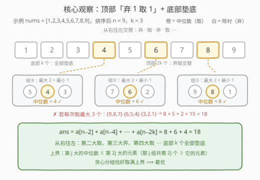
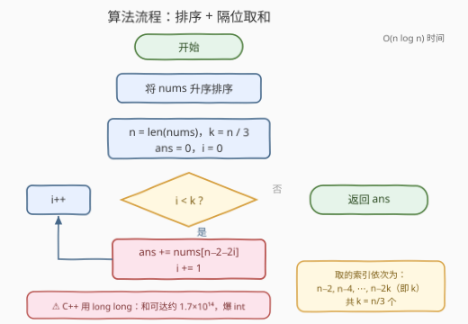

# LeetCode 中位数之和的最大值 题解

## 1. 题目概述

- **标题 / 题号**：中位数之和的最大值（#3627，medium）
- **链接**：https://leetcode.cn/problems/maximum-median-sum-of-subsequences-of-size-3/
- **难度**：中等
- **标签**：贪心、排序、数组

**题意**：给你一个整数数组 `nums`，其长度可以被 3 整除。

你需要通过多次操作将数组清空：每一步从数组中选择**任意**三个元素，计算它们的**中位数**，并将这三个元素从数组中移除。

**中位数**定义：奇数长度数组按非递减顺序排序后位于中间的元素。

返回通过所有操作得到的中位数之和的**最大值**。

**示例 1**：

```text
输入：nums = [2,1,3,2,1,3]
输出：5
解释：第一步选下标 2、4、5 的元素 {3,1,3}，中位数 3，剩 [2,1,2]；
      第二步选 {2,1,2}，中位数 2。合计 3 + 2 = 5。
```

**示例 2**：

```text
输入：nums = [1,1,10,10,10,10]
输出：20
解释：两步分别选 {10,10,1} 与 {10,10,1}，中位数都是 10，合计 20。
```

**约束**：

- $1 \le \texttt{nums.length} \le 5 \times 10^5$
- $\texttt{nums.length} \bmod 3 = 0$
- $1 \le \texttt{nums[i]} \le 10^9$

> 💡 **审题关键**：①「任意三个元素」不要求下标相邻（英文标题的 "subsequences" 有误导性），本质是把数组**划分**成 $k = n/3$ 个三元组；② 每组的中位数就是组内**第二大**；③ 求各组中位数之和的最大值；④ $n$ 达 $5 \times 10^5$、元素达 $10^9$，答案之和会**溢出 32 位整数**（C++ 注意 `long long`）。

## 2. 解题思路

### 2.1 暴力思路：枚举划分 / 状压 DP

最直接的做法是枚举把数组划分成 $k$ 个无序三元组的全部方案，逐一求和取最大。划分方案数为

$$\frac{(3k)!}{(3!)^k \cdot k!}$$

$k=5$（$n=15$）时已有 $1\,401\,400$ 种，$k=10$ 时超过 $4 \times 10^{17}$——彻底爆炸。

退一步用状压 DP：设 $f[S]$ 为剩余元素集合 $S$ 还能取得的中位数和的最大值，转移时枚举 $S$ 的一个三元子集整体移除，复杂度 $O(3^n)$，只对 $n \le 12$ 可行。本题 $n$ 高达 $5 \times 10^5$，两条路都走不通——必须挖掘「**每组中位数 = 组内第二大**」的结构性质，让贪心直接给出分组方案。

### 2.2 核心观察：每组「最大 2 个 + 最小 1 个」

先排掉一个最直觉的坑——「**每次取最大的 3 个**」。反例 $[1,1,10,10,10,10]$：取 $\{10,10,10\}$ 中位数 $10$，剩 $\{1,1,10\}$ 中位数 $1$，合计 $11$；而正确答案是 $20$。病根在于：**组内最大的元素永远当不了中位数**（它在组内排第一）。一次取三个顶部元素，等于一次性浪费了两个「本可当中位数」的值。既然每组都必须供养一个不贡献的「组内最大」，就该让**反正也当不上中位数的最小元素**去凑数，把顶部元素两两拆开用：

> **贪心策略：每次取当前最大的 2 个 + 最小的 1 个组成一组，中位数 = 当前的第二大。**

将数组升序排序为 $a[0..n-1]$（$n = 3k$），第 $j$ 组（$j = 1, \dots, k$）取 $\{a[n-2j],\ a[n-2j+1],\ a[j-1]\}$——两个当前最大 + 一个当前最小，中位数恰为 $a[n-2j]$。于是

$$\text{ans} = \sum_{j=1}^{k} a[n-2j] = a[n-2] + a[n-4] + \cdots + a[n-2k]$$

从右往左看就是「**弃 1 取 1**」：第二大取、第三大弃、第四大取……底部 $k$ 个元素全部当垫底。



**为什么最优（上界 + 构造，双管齐下）**：

- **上界**：任取一种划分，把它的 $k$ 个中位数从大到小排为 $m_1 \ge m_2 \ge \cdots \ge m_k$。固定 $j$：产生 $m_1, \ldots, m_j$ 的那 $j$ 组里，每组恰有 **2 个元素不小于其中位数**（组内第二大与最大），合计 $2j$ 个元素 $\ge m_j$。若 $m_j > a[n-2j]$（升序数组里第 $2j$ 大的元素），则全数组至多 $2j - 1$ 个元素 $\ge m_j$，矛盾。故 $m_j \le a[n-2j]$，任何方案的中位数和都 $\le \sum_{j=1}^{k} a[n-2j]$。
- **构造**：贪心分组恰好让每组中位数取到 $a[n-2j]$（组内另两个元素一个更大、一个更小），把上界**取满**，因此就是最优解。

> ⚠️ 两个高频坑：①「每次取最大 3 个」——见上文反例，全局最大值注定不贡献，取三个顶部白白多弃一个潜力中位数；② C++ 用 `int` 累加——$k \le \tfrac{5 \times 10^5}{3}$ 组、每组中位数至多 $10^9$，和约 $1.7 \times 10^{14}$，必然溢出。

### 2.3 算法流程图



**逻辑执行步骤**：

| 步骤 | 操作 | 说明 |
|------|------|------|
| ① 排序 | 将 `nums` 升序排序 | 贪心的前提：位置即名次 |
| ② 初始化 | `n = len(nums)`，`k = n / 3`，`ans = 0`，`i = 0` | 共分 $k$ 组 |
| ③ 循环判定 | `i < k ?` | 取满 $k$ 个中位数即停 |
| ④ 累加 | `ans += nums[n - 2 - 2*i]`，`i += 1` | 索引依次为 $n-2,\ n-4,\ \dots,\ n-2k$ |
| ⑤ 返回 | 返回 `ans` | 注意 64 位整数 |

### 2.4 示例演算

用信息量更大的例子 $\texttt{nums} = [1,2,3,4,5,6,7,8,9]$（$n=9,\ k=3$）走一遍：

| 组 | 构成（组内降序） | 组内最大（弃） | **中位数（取）** | 组内最小（弃） |
|----|------------------|----------------|------------------|----------------|
| ① | 9, 8, 1 | 9 | **8** | 1 |
| ② | 7, 6, 2 | 7 | **6** | 2 |
| ③ | 5, 4, 3 | 5 | **4** | 3 |

$\text{ans} = 8 + 6 + 4 = 18$，正是 $a[7] + a[5] + a[3]$（排序后从右往左隔一个取一个）。对照错误贪心「每次取最大 3 个」：$\{9,8,7\} \to 8$、$\{6,5,4\} \to 5$、$\{3,2,1\} \to 2$，合计 $15 < 18$——顶部三连取的代价一目了然。

再回验官方示例：示例 2 $[1,1,10,10,10,10]$ 排序后取 $a[4] = 10$、$a[2] = 10$，$\text{ans} = 20$ ✓；示例 1 $[2,1,3,2,1,3]$ 排序为 $[1,1,2,2,3,3]$，取 $a[4] = 3$、$a[2] = 2$，$\text{ans} = 5$ ✓。

## 3. 参考代码

### C++

```cpp
class Solution {
public:
    long long maximumMedianSum(vector<int>& nums) {
        sort(nums.begin(), nums.end());
        int n = nums.size();
        long long ans = 0;
        for (int i = 0; i < n / 3; ++i) {
            ans += nums[n - 2 - 2 * i];
        }
        return ans;
    }
};
```

> 💡 **写法要点**：
> - **必须 `long long`**：$k \le \tfrac{5\times10^5}{3}$ 个中位数、每个至多 $10^9$，和约 $1.7 \times 10^{14} > 2^{31}$（函数签名返回值也恰是 `long long`，别在局部用 `int` 累加再转）。
> - 索引 $n-2-2i$ 依次为 $n-2,\ n-4,\ \dots,\ n-2k$；因 $n = 3k$，最小索引 $n - 2k = k \ge 1$，不会越界。
> - 也可倒序写 `for (int i = n - 2; i >= n / 3; i -= 2) ans += nums[i];`（注意 $n-2k = n - 2(n/3)$，整数下与 `n/3` 相等仅当 $3 \mid n$——本题保证成立），可读性见仁见智。

### Python

```python
class Solution:
    def maximumMedianSum(self, nums: List[int]) -> int:
        nums.sort()
        n = len(nums)
        return sum(nums[n - 2 - 2 * i] for i in range(n // 3))
```

> 💡 **写法要点**：
> - Python 大整数无溢出之忧，一行收工；`n // 3` 即组数 $k$。
> - 生成器表达式比切片 `nums[n-2::-2][:n//3]` 更直白——后者还得截前 $k$ 个，边界容易绕晕。

## 4. 复杂度分析

| 维度 | 复杂度 | 说明 |
|------|--------|------|
| **时间复杂度** | $O(n \log n)$ | 排序主导；求和仅 $O(n)$ |
| **空间复杂度** | $O(\log n)$ | C++ 内省排序的栈空间（Python Timsort 需 $O(n)$ 辅助数组） |

> - $n = 5 \times 10^5$ 时排序约 $10^7$ 次比较量级，远低于时限。
> - 答案只依赖 $k$ 个**特定顺序统计量**（第 $2, 4, \dots, 2k$ 大），理论上可用线性选择算法做到期望 $O(n)$，但常数与实现复杂度不值当——排序版就是标准答案。

## 5. 扩展：组大小推广与最小化镜像

**组大小推广 $t$（奇数）**：每组取 $t$ 个元素的中位数，同样论证依然成立——第 $j$ 大的中位数 $m_j$ 需要 $j$ 组共 $\tfrac{t+1}{2} \cdot j$ 个元素 $\ge$ 它，故 $m_j \le b\!\left[\tfrac{t+1}{2} j\right]$（$b$ 为降序数组）。构造：每组取「顶部 $\tfrac{t+1}{2}$ 个 + 底部 $\tfrac{t-1}{2}$ 个」，中位数取顶部块的最末一个。$t = 3$ 即本题；$t = 5$ 时从右往左是「弃弃取」每 3 个取第 3 个。

**最小化镜像**：若改求中位数之和**最小**，把策略镜像——每组取「最小 2 个 + 最大 1 个」，中位数 = 当前第二小，$\text{ans} = a[1] + a[3] + \cdots + a[2k-1]$（排序后从左往右隔一个取一个）。

**与 561 的对偶**：561「数组拆分」求每对较小者之和最大，等于排序后取偶数位 $a[0], a[2], \dots$；本题求每组中位数之和最大，等于排序后从右往左隔位取 $a[n-2], a[n-4], \dots$。两者共享同一副骨架——**排序后按固定奇偶模式取位**，只是取位方向与组距不同。

## 6. 面试要点

**Q1：为什么「每次取最大的 3 个」是错的？**

> 组内最大的元素永远当不了中位数。反例 $[1,1,10,10,10,10]$：三连顶取法得 $\{10,10,10\} + \{1,1,10\} = 10 + 1 = 11$，而 $\{10,10,1\} \times 2 = 20$。正确姿势是每组只消耗**两个**顶部元素（一个当中位数、一个当陪衬），第三个名额留给最小的元素垫底。

**Q2：怎么严格证明「顶部 2 + 底部 1」最优？**

> 上界 + 构造：把任意方案的 $k$ 个中位数降序排为 $m_1 \ge \cdots \ge m_k$，产生 $m_1..m_j$ 的 $j$ 组共含 $2j$ 个 $\ge m_j$ 的元素，故 $m_j$ 不超过全局第 $2j$ 大的元素 $a[n-2j]$，中位数和 $\le \sum a[n-2j]$；而贪心分组恰好逐项取到该值，上界被取满。

**Q3：全局最大值为什么注定不贡献？**

> 它在任何包含它的组里都是组内第一大（并列时也不小于其他元素），而中位数是组内第二大——所以它最多当「陪衬」。推广：任何方案中恰有 $k$ 个「组内最大」不贡献，最优方案把全部陪衬名额尽可能分配给底部元素。

**Q4：C++ 里最容易翻车的点是什么？**

> 溢出：$k \le \tfrac{5\times10^5}{3} \approx 1.67\times10^5$ 组、中位数至多 $10^9$，和约 $1.67\times10^{14}$，超 `int` 上限三个数量级。累加变量与返回值都必须 `long long`。

**Q5：能不能不排序，做到 $O(n)$？**

> 答案只依赖第 $2, 4, \dots, 2k$ 大这 $k$ 个顺序统计量，理论上可用 BFPRT / quickselect 类线性选择逼近 $O(n)$，但要精确取出 $k$ 个特定名次仍需对顶部 $2k$ 个元素做部分排序，工程常数远大于一次 `sort`。面试口径：**排序版是预期答案**，能说出「本质是顺序统计量问题」即可加分。

> 💡 **一句话总结**：3627 = 排序 + 从右往左「弃 1 取 1」取 $n/3$ 个数求和。组内最大永远不贡献，所以每组用最小元素垫底、把顶部元素两两拆开——$\text{ans} = a[n-2] + a[n-4] + \cdots + a[n-2k]$。

## 同类练习题

| # | 题目 | 与本题的关联 |
|---|------|-------------|
| 561 | [数组拆分](https://leetcode.cn/problems/array-partition/) | 排序后隔位取偶数位，与本题同构的「固定奇偶模式取位」贪心（方向相反） |
| 2144 | [打折购买糖果的最小开销](https://leetcode.cn/problems/minimum-cost-of-buying-candies-with-discount/) | 降序分组周期性弃置最小值，同族「排序 + 陪衬名额给最小」的贪心 |
| 1877 | [数组中最大数对和的最小值](https://leetcode.cn/problems/minimize-maximum-pair-sum-in-array/) | 排序后首尾配对的最优性论证，同为「分组极值」型排序贪心 |
| 881 | [救生艇](https://leetcode.cn/problems/boats-to-save-people/) | 排序 + 双指针分组，练习「每船至多两人」的贪心分组骨架 |
