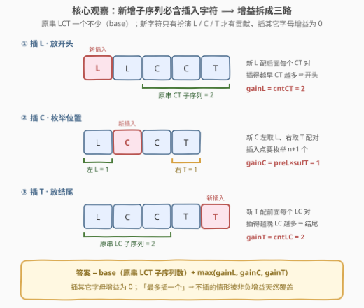
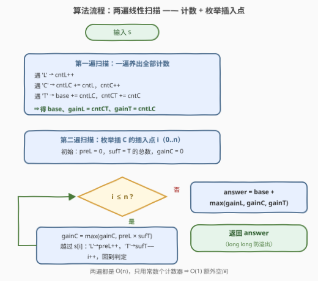

# LeetCode 插入一个字母的最大子序列数 题解

## 1. 题目概述

- **标题 / 题号**：插入一个字母的最大子序列数（#3628，medium）
- **链接**：https://leetcode.cn/problems/maximum-number-of-subsequences-after-one-inserting/
- **难度**：中等
- **标签**：贪心、字符串、动态规划、前缀和

**题意**：给定一个仅由大写英文字母组成的字符串 $s$。你可以在字符串的**任意位置**（包括开头或结尾）**最多插入一个**大写英文字母。返回插入后字符串中能形成的子序列 `"LCT"` 的**最大**数量。

**子序列**：从原字符串中删除若干字符（也可以不删）且不改变剩余字符顺序得到的非空字符串。

**示例 1**：

```text
输入：s = "LMCT"
输出：2
解释：在开头插入 "L" 得 "LLMCT"，两个 "LCT" 分别位于下标 [0,3,4] 与 [1,3,4]。
```

**示例 2**：

```text
输入：s = "LCCT"
输出：4
解释：在开头插入 "L" 得 "LLCCT"，四个 "LCT" 分别位于 [0,2,4]、[0,3,4]、[1,2,4]、[1,3,4]。
```

**示例 3**：

```text
输入：s = "L"
输出：0
解释：无论插什么字母都凑不出 "LCT"。
```

**约束**：

- $1 \le s.length \le 10^5$
- $s$ 仅由大写英文字母组成

> 💡 **审题关键**：① 是「**最多**插一个」——可以不插，且插入永远不会让子序列变少（只增不减）；② 子序列只看相对顺序、不要求连续——**插入位置决定的是「谁能与谁配对」**，这是全部解法的抓手；③ 答案上界约 $(n/3)^3 \approx 3.7 \times 10^{13}$（$n = 10^5$ 时），远超 `int` 上界 $2.1 \times 10^9$，必须用 64 位整数。

## 2. 解题思路

### 2.1 暴力思路：枚举插入位置 × 枚举字母

枚举 $n+1$ 个插入位置、每个位置 26 种字母，对每个拼出的串花 $O(n)$ 数一遍 `"LCT"` 子序列，总代价 $O(26 \cdot n^2) \approx 2.6 \times 10^{11}$——$n = 10^5$ 下不可行。

数子序列本身倒是有个经典 $O(n)$ 递推可复用：顺序扫描维护 $cntL / cntLC / cntLCT$，遇 `L` 时 $cntL{+}{+}$，遇 `C` 时 $cntLC \mathrel{+}= cntL$，遇 `T` 时 $cntLCT \mathrel{+}= cntLC$——瓶颈全在「枚举插入」这一层，得想办法把增益**算出来**而不是**试出来**。

### 2.2 核心观察：插入增益 = 前缀计数 × 后缀计数



**观察一（新增子序列必含插入字符）**：设原串中 `"LCT"` 子序列数量为 $base$——插入字符后这些一个都不会少。而**新增**的子序列必然用到插入的那个字符，它只有扮演 `L`/`C`/`T` 三种角色之一才有贡献，**插其它字母增益为 0**。于是：

$$\text{答案} = base + \max(\text{gain}_L,\ \text{gain}_C,\ \text{gain}_T)$$

**观察二（L 越早越好，T 越晚越好）**：插入的 `L` 只能与**整体位于插入点之后**的 `CT` 对配对，插得越靠前可选的 `CT` 对越多——插在下标 0 之前增益最大，恰等于原串 `CT` 子序列总数 $cntCT$。对称地，插入的 `T` 插在末尾增益最大，恰等于原串 `LC` 子序列总数 $cntLC$。两个量都不用真的插入再数，用 2.1 的计数器递推一遍扫出来。

**观察三（C 是唯一需要枚举位置的）**：插入的 `C` 与「插入点左边的 `L`」×「插入点右边的 `T`」自由配对，插在下标 $i$ 处的增益为：

$$\text{gain}_C(i) = preL[i] \times sufT[i]$$

其中 $preL[i]$ 为 $s[0..i-1]$ 中 `L` 的个数，$sufT[i]$ 为 $s[i..n-1]$ 中 `T` 的个数。$preL$ 随 $i$ 单调不减、$sufT$ 单调不增，但**乘积不单调**（先升后降，变化率取决于两侧计数的此消彼长），所以不能二分或双指针偷懒，老老实实线性枚举 $n+1$ 个插入点取最大值——反正也只要 $O(n)$。

> 💡 严格性说明（以插 `C` 为例）：新增子序列必须**恰好包含**插入字符一次；插入的 `C` 左侧任取一个 `L`、右侧任取一个 `T` 就得到一个新 `"LCT"`，反之任何新 `"LCT"` 中间的 `C` 必是插入的那个——双射成立，增益恰为「左 L 数 × 右 T 数」，不重不漏。插 `L`/`T` 的公式同理。

### 2.3 算法流程图



**文字版步骤**：

| 步骤 | 操作 | 说明 |
|------|------|------|
| ① 第一遍扫描 | 遇 `L`：$cntL{+}{+}$；遇 `C`：$cntLC \mathrel{+}= cntL$，$cntC{+}{+}$；遇 `T`：$base \mathrel{+}= cntLC$，$cntCT \mathrel{+}= cntC$ | 一趟同时养出 $base$、$\text{gain}_T = cntLC$、$\text{gain}_L = cntCT$ |
| ② 初始化 | $preL = 0$，$sufT$ = `T` 总数，$gainC = 0$ | 准备枚举插入点 $i = 0 \dots n$ |
| ③ 枚举插入点 | $gainC = \max(gainC,\ preL \times sufT)$；随后越过 $s[i]$：是 `L` 则 $preL{+}{+}$，是 `T` 则 $sufT{-}{-}$，$i{+}{+}$ | 字符 $s[i]$ 从插入点右侧「挪」到左侧 |
| ④ 汇总 | 返回 $base + \max(cntCT,\ gainC,\ cntLC)$ | 三个增益非负，「不插」的选项天然被覆盖 |

### 2.4 示例演算：s = "LCCT"

**第一遍扫描**（养计数器，其余字母无动作）：

| 读到 | 动作 | $cntL$ | $cntLC$ | $cntC$ | $cntCT$ | $base$ |
|------|------|--------|---------|--------|---------|--------|
| `L` | $cntL{+}{+}$ | 1 | 0 | 0 | 0 | 0 |
| `C` | $cntLC \mathrel{+}= cntL$；$cntC{+}{+}$ | 1 | 1 | 1 | 0 | 0 |
| `C` | $cntLC \mathrel{+}= cntL$；$cntC{+}{+}$ | 1 | 2 | 2 | 0 | 0 |
| `T` | $base \mathrel{+}= cntLC$；$cntCT \mathrel{+}= cntC$ | 1 | 2 | 2 | 2 | 2 |

得 $base = 2$，$\text{gain}_L = cntCT = 2$，$\text{gain}_T = cntLC = 2$。

**第二遍枚举插 `C` 的位置**（$sufT$ 初值 1）：

| 插入点 $i$ | $preL$ | $sufT$ | 乘积 |
|-----------|--------|--------|------|
| 0 | 0 | 1 | 0 |
| 1 | 1 | 1 | 1 |
| 2 | 1 | 1 | 1 |
| 3 | 1 | 1 | 1 |
| 4 | 1 | 0 | 0 |

$gainC = 1$。**答案 $= 2 + \max(2,\ 1,\ 2) = 4$**——对应示例 2 开头插 `L` 得到的 `LLCCT`。

> 💡 再看示例 1 的 `LMCT`：$base = 1$，三路增益全为 1，答案 $1 + 1 = 2$——打平时任选一路即可。示例 3 的 `L`：$base = 0$ 且三路增益全 0，答案 0，「最多插一个」允许白插。

## 3. 参考代码

### C++

```cpp
class Solution {
public:
    long long numOfSubsequences(string s) {
        // 第一遍扫描：养计数器
        long long base = 0;                 // 原串 "LCT" 子序列数
        long long cntL = 0, cntLC = 0;      // L 前缀数 / "LC" 子序列数（插 T 的增益）
        long long cntC = 0, cntCT = 0;      // C 前缀数 / "CT" 子序列数（插 L 的增益）
        for (char c : s) {
            if (c == 'L') {
                cntL++;
            } else if (c == 'C') {
                cntLC += cntL;
                cntC++;
            } else if (c == 'T') {
                base += cntLC;
                cntCT += cntC;
            }
        }

        // 第二遍扫描：枚举插 C 的 n+1 个位置
        long long preL = 0, sufT = count(s.begin(), s.end(), 'T');
        long long gainC = 0;
        for (int i = 0; i <= (int)s.size(); i++) {
            gainC = max(gainC, preL * sufT);
            if (i < (int)s.size()) {        // 越过 s[i]：从插入点右侧挪到左侧
                if (s[i] == 'L') preL++;
                else if (s[i] == 'T') sufT--;
            }
        }

        return base + max({cntCT, gainC, cntLC});
    }
};
```

> 💡 **写法要点**：
> - **计数器直接声明 `long long`**：$base$ 最大约 $3.7 \times 10^{13}$，`preL * sufT` 的乘积也按 64 位参与运算，杜绝中间结果溢出。
> - **先取乘积再挪字符**：循环体内先算 $preL \times sufT$（对应插入点 $i$），再让 $s[i]$ 越过插入边界——顺序反了会把 $s[i]$ 自己算错侧。
> - **`max({...})` 三取一**：插 `L`、插 `C`、插 `T` 的增益并列比较；全是 0 时退化为「不插」，天然覆盖「最多插一个」。

### Python

```python
class Solution:
    def numOfSubsequences(self, s: str) -> int:
        # 第一遍扫描：养计数器
        base = cnt_l = cnt_lc = cnt_c = cnt_ct = 0
        for c in s:
            if c == 'L':
                cnt_l += 1
            elif c == 'C':
                cnt_lc += cnt_l
                cnt_c += 1
            elif c == 'T':
                base += cnt_lc
                cnt_ct += cnt_c

        # 第二遍扫描：枚举插 C 的 n+1 个位置
        pre_l, suf_t = 0, s.count('T')
        gain_c = 0
        for i in range(len(s) + 1):
            gain_c = max(gain_c, pre_l * suf_t)
            if i < len(s):                  # 越过 s[i]：从插入点右侧挪到左侧
                if s[i] == 'L':
                    pre_l += 1
                elif s[i] == 'T':
                    suf_t -= 1

        return base + max(cnt_ct, gain_c, cnt_lc)
```

## 4. 复杂度分析

| 维度 | 复杂度 | 说明 |
|------|--------|------|
| **时间复杂度** | $O(n)$ | 两遍线性扫描：第一遍养计数器，第二遍枚举插入点，每步 $O(1)$ |
| **空间复杂度** | $O(1)$ | 只用常数个滚动计数器；提示中的 `preL/sufT` 数组不必真正存下来 |

> - $n = 10^5$ 时总共约 $2 \times 10^5$ 次基本操作，轻松通过。
> - 若按提示写出 `preL / preLC / sufT / sufCT` 四个数组，空间变 $O(n)$、时间不变——滚动变量是等价的省空间写法。

## 5. 扩展：从三位模式到两位模式

[2207. 字符串中最多数目的子序列](https://leetcode.cn/problems/maximize-number-of-subsequences-in-a-string/) 是本题的**两位版**：给定长度为 2 的 `pattern`，允许插入一个字符，最大化 `pattern` 子序列数。两位版连「枚举插入点」都不需要——插 `pattern[0]` 在开头的增益 = `pattern[1]` 的出现次数，插 `pattern[1]` 在结尾的增益 = `pattern[0]` 的出现次数，取较大者即可，$O(n)$ 一趟数完两个字符。

本题多了中间的 `C`，才引入 $preL[i] \times sufT[i]$ 的**前缀 × 后缀乘积最大化**。再往一般化走：长度为 $k$ 的模式、允许插入 $m$ 个字符，就需要「DP 计数 + 插入决策」联合建模，复杂度随 $k, m$ 增长。面试中抓住「**新增子序列必含插入字符，增益按角色拆解**」这条主线即可举一反三。

## 6. 面试要点

**Q1：为什么插入的 L 放开头、T 放结尾一定最优？**

> 插入的 `L` 只与「插入点之后的 `CT` 对」配对，`CT` 对数量关于插入点单调不增（越靠后剩得越少），故开头最优，增益 = 全串 `CT` 子序列数；`T` 完全对称，结尾最优。都不需要真的枚举位置。

**Q2：插 C 的增益为什么是 preL × sufT？会不会漏算或重算？**

> 新增子序列必须恰好包含插入字符一次。插入的 `C` 左侧任取一个 `L`、右侧任取一个 `T` 即得一个新 `"LCT"`；反之任何新 `"LCT"` 的 `C` 必是插入的那个。双射成立，增益恰为左 `L` 数 × 右 `T` 数，不重不漏。

**Q3：base、cntLC、cntCT 怎么一次扫描同时得到？**

> 维护 $cntL, cntLC, cntC, cntCT$ 四个计数器：遇 `L` 加 $cntL$；遇 `C` 时 $cntLC$ 收编左边全部 `L`、$cntC$ 自增；遇 `T` 时 $base$ 收编全部 `LC` 对、$cntCT$ 收编全部 `C`。这是「数子序列」的标准递推，`LC`/`CT`/`LCT` 三个模式共用同一趟扫描。

**Q4：有哪些溢出 / 边界坑？**

> ① $n = 10^5$ 时答案可达约 $3.7 \times 10^{13}$，`int` 必爆，C++ 计数器一律 `long long`；② 全串没有 `L`/`C`/`T` 时三路增益全 0，返回 $base = 0$，「最多插一个」允许不插，无需特判；③ 枚举插入点时 $i$ 的范围是 $0 \dots n$ **共 $n+1$ 个**（含首尾），少枚举一个就漏解。

**Q5：gainC 的枚举能不能用二分或双指针省掉？**

> 不能。$preL$ 不减、$sufT$ 不增，但乘积不单调——没有「越大越可行」的单调判定结构。不过线性枚举本身与扫描同级（$O(n)$），没有优化的必要；想省也只剩 $O(n \log n)$ 排序类的花活，得不偿失。

## 同类练习题

| # | 题目 | 与本题的关联 |
|---|------|-------------|
| 2207 | [字符串中最多数目的子序列](https://leetcode.cn/problems/maximize-number-of-subsequences-in-a-string/) | 本题的两位模式版，「插入增益」思想的入门款，连插入点都不用枚举 |
| 115 | [不同的子序列](https://leetcode.cn/problems/distinct-subsequences/) | 子序列计数的经典 DP，对照「计数器递推」与「完整 DP 表」两种视角 |
| 940 | [不同的子序列 II](https://leetcode.cn/problems/distinct-subsequences-ii/) | 去重版子序列计数，按结尾字符分类 + 容斥 |
| 2262 | [字符串的总引力](https://leetcode.cn/problems/total-appeal-of-a-string/) | 前缀计数思想在「每个字符对子串的贡献」上的应用 |
| 238 | [除自身以外数组的乘积](https://leetcode.cn/problems/product-of-array-except-self/) | 同款「前缀 × 后缀」分解训练 |
