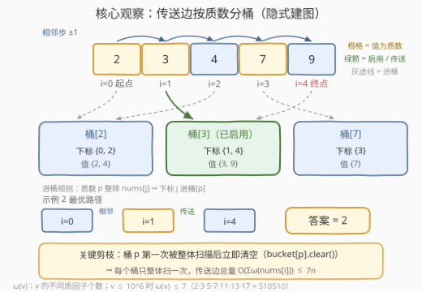
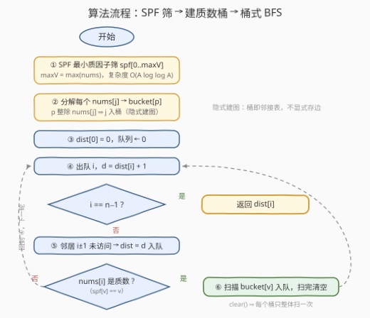

# 通过质数传送到达终点的最少跳跃次数

- **题目名称**：通过质数传送到达终点的最少跳跃次数
- **链接**：[3629. Minimum Jumps to Reach End via Prime Teleportation](https://leetcode.cn/problems/minimum-jumps-to-reach-end-via-prime-teleportation/)
- **难度**：中等
- **标签**：广度优先搜索、数组、哈希表、数学、数论

## 1. 题目概述

给你一个长度为 `n` 的整数数组 `nums`。你从下标 `0` 出发，目标是到达下标 `n - 1`。在任何下标 `i` 处，你可以执行以下操作之一：

- **移动到相邻格子**：跳到下标 `i + 1` 或 `i - 1`（若该下标在边界内）；
- **质数传送**：若 `nums[i]` 本身是一个**质数** `p`，你可以立即传送到任何满足 `nums[j] % p == 0` 且 `j != i` 的下标 `j` 处。

返回到达下标 `n - 1` 所需的**最少**跳跃次数。质数是大于 1 且仅有 1 和自身两个因子的自然数。

**示例 1**：

```text
输入：nums = [1,2,4,6]
输出：2
解释：从 i=0 走一步到 i=1；nums[1] = 2 是质数，传送到 i=3（因为 6 % 2 == 0）。
```

**示例 2**：

```text
输入：nums = [2,3,4,7,9]
输出：2
解释：从 i=0 走一步到 i=1；nums[1] = 3 是质数，传送到 i=4（因为 9 % 3 == 0）。
```

**示例 3**：

```text
输入：nums = [4,6,5,8]
输出：3
解释：没有可用的传送（唯一的质数 5 桶里只有它自己），只能走 0 → 1 → 2 → 3。
```

**约束条件**：

- $1 \le n = nums.length \le 10^5$
- $1 \le nums[i] \le 10^6$

> 💡 **审题关键**：① 传送的**起点必须是质数值**——`nums[i]` 本身等于质数 `p` 才能发传送；**目的地只需被 `p` 整除**，可以是合数（示例 1 中从 2 传到 6）。方向不可反：站在合数上不能发传送；② 相邻移动永远可用，所以终点必然可达（答案 $\le n-1$），$n = 1$ 时起点即终点，答案为 0；③ `1` 不是质数，站在 `nums[i] = 1` 上没有任何传送；④ 所有跳跃代价相同——**无权图最短路**，直接联想 BFS。

---

## 2. 解题思路

### 2.1 暴力思路：朴素 BFS + 逐个试除判质数

把每种移动看成一条边、从下标 0 做一遍 BFS——方向没错，但朴素实现有三处会翻车：

1. **逐个试除判质数**：对每个 `nums[i]` 用 $O(\sqrt{v})$ 试除判断质性，$10^5 \times \sqrt{10^6} = 10^8$ 次除法，直接超时；
2. **传送目标逐个枚举**：站在质数 `p` 上时扫描全部下标找 `nums[j] % p == 0`，单次 $O(n)$；若数组里大量位置都是同一个质数（比如全是 2），每个位置出队都要全量扫一遍，$O(n^2) = 10^{10}$；
3. **显式建边**：把所有传送边存进邻接表，边数虽「只有」$O(n\omega)$ 条，但完全没必要——传送边天然可以按质数分组共享。

三个瓶颈各有解药：批量判质数交给**筛法**；传送目标按质数**预分桶**；重复扫桶用**用完即清空**剪掉。

### 2.2 核心观察：SPF 筛 + 质数桶 + 桶用后清空的 BFS



**观察一：质数判定与质因数分解都是批量任务，交给 SPF 筛。** 值域 $10^6$、元素 $10^5$ 个——判质数的对象是海量整数而非孤立大数，正是筛法主场。预处理**最小质因子数组** `spf[v]`（埃氏筛变体：每个合数只被其最小质因子首次标记），此后 $O(1)$ 判质数（`spf[v] == v` 即 `v` 为质数），$O(\log v)$ 分解质因数（不断除以 `spf` 取净）。

**观察二：传送边按「质数」分桶，隐式建图。** 传送规则「站在质数 `p` 上可到任何 `p \mid nums[j]` 的 `j`」换个角度看：为每个质数 `p` 维护桶 `bucket[p]`，收纳**所有值被 `p` 整除的下标**。那么站在质数 `p` 上时的全部传送目的地，恰好就是 `bucket[p]` 里的其他成员——**桶就是邻接表**，一条边都不用显式存。建桶只需对每个 `nums[j]` 分解质因数、把 `j` 追加进它的每个质因子桶。

**观察三：桶第一次用完就清空，保证线性。** BFS 出队序列的距离**单调不减**。设第一次处理某个值为质数 `p` 的位置是 `i`（距离 `d`），扫描 `bucket[p]` 后所有成员都拿到了 $\le d+1$ 的距离；之后任何 `p` 值位置 `i'` 出队时距离必然 $\ge d$，从它出发的传送只能提供 $\ge d+1$ 的新距离——**不可能更优**。所以扫完 `bucket[p]` 立即 `clear()`，此后再站上 `p` 也只是空桶一瞥。每个桶整体只被扫描一次，这就是 1345 跳跃游戏 IV「同值桶用后清除」的同一个 trick。

> 💡 一句话：本题 = SPF 筛（数论预处理）+ 值域桶隐式建图（1345 模板）+ 用后清空（线性保障）。三块都是老套路，拼装起来正是中等题的标准形态。

### 2.3 算法流程图



**逻辑执行步骤**：

| 步骤 | 操作 | 说明 |
|------|------|------|
| ① SPF 筛 | 预处理 `spf[0..maxV]`，`maxV = max(nums)` | 埃氏筛变体，`spf[j]` 记最小质因子，$O(A\log\log A)$ |
| ② 建桶 | 分解每个 `nums[j]`，`j` 追加进其每个质因子的 `bucket[p]` | 传送边隐式入桶，不显式建图 |
| ③ 初始化 | `dist[0] = 0`，队列放入 `0` | `n = 1` 时起点即终点，答案 0 |
| ④ 出队 | 取出 `i`，`d = dist[i] + 1`；`i == n-1` 则返回 | BFS 按层扩展，先出队者距离小 |
| ⑤ 相邻步 | `i-1`、`i+1` 在界内且未访问 → `dist = d` 入队 | 永远可用的保底移动 |
| ⑥ 质数传送 | 若 `nums[i]` 是质数（`spf[v] == v`）：扫描 `bucket[v]`，未访问者 `dist = d` 入队，**随后清空** | 桶成员即全部传送目的地；清空保证每桶只整体扫一次 |

> ⚠️ 两处易错：① `bucket[v]` 里必含 `i` 自己（$v \mid v$），靠「已访问」检查天然跳过，无需特判 `j != i`——但**清空必须放在扫描之后**；② 判质数别忘 `v > 1`（`spf[1] == 1` 会误判 1 为质数）。漏掉清空最坏退化 $O(n^2)$，见第 5 节变体一。

### 2.4 示例演算（示例 2：nums = [2,3,4,7,9]）

`maxV = 9`，SPF 筛得 `spf = [0,1,2,3,2,5,2,7,2,3]`。建桶（每个下标按其值的质因数入桶）：

| 桶 | 成员下标（值） | 说明 |
|----|---------------|------|
| `bucket[2]` | 0（2）、2（4） | 2 整除 2、4 |
| `bucket[3]` | 1（3）、4（9） | 3 整除 3、9 |
| `bucket[7]` | 3（7） | 7 整除 7 |

BFS 过程（出队即判终点）：

| 出队 | dist | 相邻步入队 | 质数传送 |
|------|------|-----------|---------|
| `i=0`（值 2，质数） | 0 | `1`（d=1） | 扫 `bucket[2]`：`2`（d=1）；**清空桶 2** |
| `i=1`（值 3，质数） | 1 | `0`、`2` 均已访问 | 扫 `bucket[3]`：`4`（d=2）；**清空桶 3** |
| `i=2`（值 4，合数） | 1 | `3`（d=2） | 无传送 |
| `i=4` | 2 | — | — |

`i=4 = n-1` 出队，返回 `dist[4] = 2`，对应路径 0 →相邻→ 1 →传送→ 4。

---

## 3. 参考代码

### C++

```cpp
class Solution {
public:
    int minJumps(vector<int>& nums) {
        int n = nums.size();
        if (n == 1) return 0;

        int maxV = *max_element(nums.begin(), nums.end());

        // ① SPF 最小质因子筛：spf[v] == v 当且仅当 v 是质数
        vector<int> spf(maxV + 1);
        iota(spf.begin(), spf.end(), 0);
        for (int i = 2; i * i <= maxV; ++i) {
            if (spf[i] == i) {
                for (int j = i * i; j <= maxV; j += i) {
                    if (spf[j] == j) spf[j] = i;
                }
            }
        }

        // ② 建质数桶：p 整除 nums[j] ⇒ j 入 bucket[p]
        unordered_map<int, vector<int>> bucket;
        for (int j = 0; j < n; ++j) {
            int x = nums[j];
            while (x > 1) {
                int p = spf[x];
                bucket[p].push_back(j);
                while (x % p == 0) x /= p;
            }
        }

        // ③ 桶式 BFS
        vector<int> dist(n, -1);
        queue<int> q;
        dist[0] = 0;
        q.push(0);
        while (!q.empty()) {
            int i = q.front(); q.pop();
            if (i == n - 1) return dist[i];
            int d = dist[i] + 1;
            if (i > 0 && dist[i - 1] < 0) { dist[i - 1] = d; q.push(i - 1); }
            if (i + 1 < n && dist[i + 1] < 0) { dist[i + 1] = d; q.push(i + 1); }
            int v = nums[i];
            if (v > 1 && spf[v] == v) {          // nums[i] 本身是质数才能传送
                vector<int>& b = bucket[v];
                for (int j : b) {
                    if (dist[j] < 0) { dist[j] = d; q.push(j); }
                }
                b.clear();                        // 用完即清空：每个桶只整体扫一次
            }
        }
        return dist[n - 1];
    }
};
```

> 💡 **写法要点**：
> - `spf` 初始化用 `iota` 置为自身，筛内层从 $i^2$ 起、只写未标记位置——这正是埃氏筛的两个经典剪枝，顺带保证每个合数记录的是**最小**质因子。
> - 桶用 `unordered_map<int, vector<int>>` 而非 `vector<vector<int>>(1e6+1)`：后者光空壳就要 $10^6 \times 24\text{B} \approx 24\text{MB}$，前者只为实际出现的质数付出代价。
> - `bucket[v]` 先取引用再扫再清，避免同一键重复哈希查找；`clear()` 保留容量，不影响复杂度只释放逻辑尺寸。
> - 出队即判 `i == n-1` 提前返回；`dist` 初始化 `-1` 兼作访问标记。

### Python

```python
class Solution:
    def minJumps(self, nums: List[int]) -> int:
        from math import isqrt
        from collections import deque, defaultdict

        n = len(nums)
        if n == 1:
            return 0

        max_v = max(nums)

        # ① SPF 最小质因子筛
        spf = list(range(max_v + 1))
        for i in range(2, isqrt(max_v) + 1):
            if spf[i] == i:
                for j in range(i * i, max_v + 1, i):
                    if spf[j] == j:
                        spf[j] = i

        # ② 建质数桶：p 整除 nums[j] ⇒ j 入 bucket[p]
        bucket = defaultdict(list)
        for j, v in enumerate(nums):
            x = v
            while x > 1:
                p = spf[x]
                bucket[p].append(j)
                while x % p == 0:
                    x //= p

        # ③ 桶式 BFS
        dist = [-1] * n
        dist[0] = 0
        q = deque([0])
        while q:
            i = q.popleft()
            if i == n - 1:
                return dist[i]
            d = dist[i] + 1
            for j in (i - 1, i + 1):
                if 0 <= j < n and dist[j] < 0:
                    dist[j] = d
                    q.append(j)
            v = nums[i]
            if v > 1 and spf[v] == v:      # nums[i] 本身是质数才能传送
                for j in bucket[v]:
                    if dist[j] < 0:
                        dist[j] = d
                        q.append(j)
                bucket[v].clear()           # 用完即清空
        return dist[n - 1]
```

> 💡 **写法要点**：
> - `isqrt` 是精确整数平方根，避免 `int(x ** 0.5)` 的浮点边界误差；筛循环共约 $\sum_{p \le 1000} A/p \approx 2 \times 10^6$ 次内层迭代，CPython 下约半秒，可控。
> - 分解循环 `while x > 1` 里先入桶再除净：同一个质因子只入桶一次，桶内无重复下标。
> - `bucket[v].clear()` 之后 `defaultdict` 的键仍在（值为空表），后续再站上质数 `v` 只扫空表，$O(1)$ 跳过。

---

## 4. 复杂度分析

| 维度 | 复杂度 | 说明 |
|------|--------|------|
| **时间复杂度** | $O(A\log\log A + n\cdot\bar\omega)$ | SPF 筛 $O(A\log\log A)$，$A = \max(nums) \le 10^6$；建桶与 BFS 各遍历全部桶成员至多一次，合计 $O(\sum_i \omega(nums[i]))$，均摊 $\bar\omega \le 7$ |
| **空间复杂度** | $O(A + \sum\omega)$ | `spf` 数组 $O(A)$；桶成员总数 $\sum\omega \le 7n$；`dist` 与队列 $O(n)$ |

> - $\omega(v)$ 表示 $v$ 的**不同质因子个数**。$v \le 10^6$ 时 $\omega(v) \le 7$，因为最小的 7 个质数之积 $2\cdot3\cdot5\cdot7\cdot11\cdot13\cdot17 = 510510 \le 10^6$，再乘 19 就超了。
> - 实际耗时由筛主导：$A\log\log A$ 约 $3\times10^6$ 次标记，而桶相关操作总量 $\le 7 \times 10^5$——数论预处理才是本题的「大头」，BFS 反而近乎免费。
> - 对比暴力：试除判质 $10^8$、重复扫桶最坏 $10^{10}$，与本题解相差两到四个数量级。

---

## 5. 扩展：三个变体

**变体一：桶不清空会退化到什么程度？** 构造 `nums = [2,2,...,2]`（$n = 10^5$）：每个位置都是质数 2，`bucket[2]` 装着全部下标。不清空时每个出队位置都要全量扫一遍 $10^5$ 个成员，总计 $10^{10}$ 次操作；清空后第一次扫描就把所有位置的距离定为 1（0 直接传送到 $n-1$），之后每个质数位置 $O(1)$ 跳过空桶。**清空不是锦上添花，是复杂度的分水岭。**

**变体二：传送起点若是「任意质因子」呢？** 即把规则改成「站在 `i`，可对 `nums[i]` 的任何质因子 `p` 发传送」。图更稠密（合数位置也能发传送），但框架不变：出队时枚举 `nums[i]` 的全部质因子 `p`，逐一扫描并清空 `bucket[p]`，复杂度同级。本题示例 3 恰好能区分两种规则：`[4,6,5,8]` 在「任意质因子」规则下从 0 借质因子 2 一步传到 3（2 整除 4 与 8），答案会是 1 而非 3。读题时务必圈出「**nums[i] 是一个质数**」——这是题意理解的分水岭。

**变体三：如果跳跃代价不等呢？** 比如相邻步代价 1、传送代价 2——边权只剩 $\{1, 2\}$ 两档，BFS 的按层扩展失效，改用 **0-1 BFS**（双端队列：代价 0 头进、代价 1 尾进）；边权任意则上 Dijkstra。「所有边等权」是 BFS 与最短路算法族的分界线。

---

## 6. 面试要点

**Q1：为什么用 BFS 而不是 DFS 或 DP？**

> 每次跳跃代价相同，最少跳跃次数 = 无权图最短路，BFS 按层扩展保证**首次到达**某点时的距离即最短距离。DFS 不保层序，找到的第一条路径未必最短；DP 不可行是因为图有环（传送可以来回跳），状态间不存在安全的推导顺序。

**Q2：清空 `bucket[p]` 为什么不影响正确性？**

> BFS 出队距离单调不减。设第一次处理的 `p` 值位置为 `i`（距离 $d$），扫描后每个桶成员都拿到 $\le d+1$ 的距离；任何后续 `p` 值位置 `i'` 的距离 $\ge d$，从它传送只能提供 $\ge d+1$ 的新距离，不可能更优。因此清空只剪冗余、不剪最优。这与 1345 的同值桶、815 的路线桶是同一论证。

**Q3：判质数为什么用筛而不是试除？**

> 判定对象是 $10^5$ 个 $\le 10^6$ 的值、且还要批量分解质因数建桶——典型批量任务：SPF 筛一次 $O(A\log\log A)$ 预处理后，判质 $O(1)$、分解 $O(\log v)$。试除单个 $O(\sqrt v)$，累计 $10^8$。经验法则：**连续区间 / 大批量 → 筛法；孤立大数 → 试除或 Miller–Rabin**。

**Q4：传送规则的方向细节有哪些？**

> 起点值必须是质数**本身**，目的地只需被该质数整除（可以是合数）；站在合数上不能发传送。示例 3 `[4,6,5,8]` 中 5 是质数但 `bucket[5]` 只有它自己，传送无从发挥，答案退化为纯走路 3；而 6、8 虽含质因子 2、却不能作为传送起点。另外 1 不是质数，`nums[i] = 1` 无传送；`n = 1` 直接返回 0。

**Q5：与 1345 跳跃游戏 IV 是什么关系？**

> 1345 的桶按「相等值」分组（$i$ 连向所有 `nums[j] == nums[i]` 的 `j`），本题的桶按「整除质数」分组，分组键从等值泛化为数论关系；「桶用后清空」的剪枝与正确性论证完全一致。掌握该模板后，815 公交路线（按路线分组）也是同一题，只是分组键再换成集合成员。

> 💡 **一句话总结**：3629 = SPF 筛 + 值域桶隐式建图 + 用后清空的 BFS。带走的三个细节：传送起点必须是质数本身、桶清空是线性复杂度的分水岭、`spf[v] == v` 的 $O(1)$ 判质姿势。

---

## 7. 同类练习题

- [1345. 跳跃游戏 IV](https://leetcode.cn/problems/jump-game-iv/)：同值桶 BFS + 用后清除，本题最直接的模板题
- [815. 公交路线](https://leetcode.cn/problems/bus-routes/)：按「路线」分组建桶、用后清除，体会分组键的泛化
- [1306. 跳跃游戏 III](https://leetcode.cn/problems/jump-game-iii/)：只有 i±1 与 i±nums[i] 的裸 BFS，对照理解何时需要分组优化
- [204. 计数质数](https://leetcode.cn/problems/count-primes/)：埃氏筛原型题，SPF 筛的基础
- [2521. 数组乘积中的不同质因数](https://leetcode.cn/problems/distinct-prime-factors-of-product-of-array/)：SPF 分解质因数的直接应用，巩固本题建桶环节
