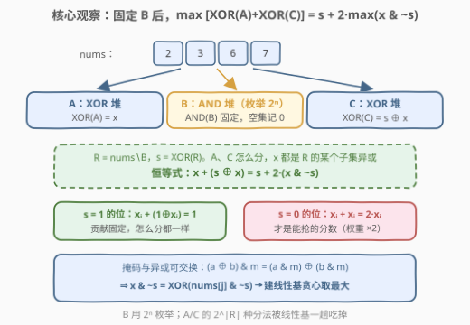
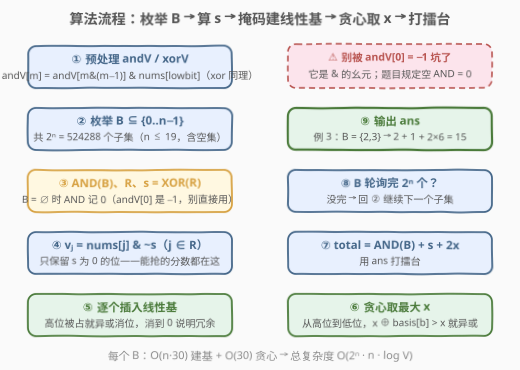

# LeetCode 划分数组得到最大异或运算和与运算之和 题解

## 1. 题目概述

- **标题 / 题号**：划分数组得到最大异或运算和与运算之和（#3630，hard）
- **链接**：https://leetcode.cn/problems/partition-array-for-maximum-xor-and-and/
- **难度**：困难
- **标签**：贪心、位运算、数组、数学、枚举

**题意**：给你一个整数数组 `nums`。将数组划分为**三**个（可以为空）子序列 `A`、`B`、`C`，使得 `nums` 中每个元素**恰好属于一个**子序列。目标是最大化：

$$\mathrm{XOR}(A) + \mathrm{AND}(B) + \mathrm{XOR}(C)$$

其中 `XOR(arr)` 表示 `arr` 中所有元素的按位异或，`AND(arr)` 表示按位与；**空集的 XOR 与 AND 均定义为 0**。返回可实现的最大值。

**示例 1**：

```text
输入：nums = [2,3]
输出：5
解释：A = [3]（XOR=3），B = [2]（AND=2），C = []（XOR=0），总和 3 + 2 + 0 = 5。
```

**示例 2**：

```text
输入：nums = [1,3,2]
输出：6
解释：A = [1]（XOR=1），B = [2]（AND=2），C = [3]（XOR=3），总和 1 + 2 + 3 = 6。
```

**示例 3**：

```text
输入：nums = [2,3,6,7]
输出：15
解释：A = [7]（XOR=7），B = [2,3]（AND=2），C = [6]（XOR=6），总和 7 + 2 + 6 = 15。
```

**约束**：

- `1 <= nums.length <= 19`
- `1 <= nums[i] <= 10^9`

> 💡 **审题关键**：① `n ≤ 19` 是明示 **`2^n` 子集枚举**（`2^19 = 524288`）的信号；② XOR 与 AND 都与元素顺序无关，「子序列」实质就是「子集」，每个元素三选一；③ `A`、`C` 都是 XOR，**地位完全对称**，真正特殊的是 `B`（AND）；④ 三个子序列都可为空，空 AND = 0 不是全 1，处理时别混入按位与的幺元。

## 2. 解题思路

### 2.1 暴力思路：三进制枚举 / 两层子集枚举

最直接的做法是给每个元素三选一（进 A、进 B 或进 C），`3^19 ≈ 1.16 × 10^9` 种方案，每种还要 $O(n)$ 求值——必然超时。

退一步：先枚举 `B` 的子集（$2^n$ 种），再枚举剩余元素划分进 A/C 的方式（最坏 $2^{n-1}$ 种），总量级 $2^{19} \times 2^{18} \approx 1.4 \times 10^{11}$，更不可行。

> ⚠️ 瓶颈在「A/C 怎么分」这层枚举：它只通过 $\mathrm{XOR}(A) + \mathrm{XOR}(C)$ 影响答案。突破口：**把 A/C 的所有分法压缩成一次线性基查询**——固定 B 后，令 $s = \mathrm{XOR}(R)$（$R$ 为 B 之外的全部元素）、$x = \mathrm{XOR}(A)$，则 $\mathrm{XOR}(C) = s \oplus x$，只需最大化 $x + (s \oplus x)$。

### 2.2 核心观察：恒等式降维 + 线性基求最大子集异或



**观察一：A、C 合并成单个变量 `x`。** 固定 `B` 后，设 $R = \texttt{nums} \setminus B$，$s = \mathrm{XOR}(R)$。A 是 R 的任意子集，记 $x = \mathrm{XOR}(A)$，则无论 C 怎么取都有 $\mathrm{XOR}(C) = s \oplus x$（C 恰是 R 中除 A 外的元素）。于是目标变成：

$$\max_{x \in \mathrm{span}(R)} \big( x + (s \oplus x) \big) + \mathrm{AND}(B)$$

其中 $\mathrm{span}(R)$ 是 R 的所有子集异或值构成的集合。

**观察二：恒等式 $x + (s \oplus x) = s + 2 \cdot (x \,\&\, \sim s)$。** 利用经典恒等式 $x + y = (x \oplus y) + 2(x \,\&\, y)$（无进位和 + 进位），代入 $y = s \oplus x$：其一，$x \oplus y = x \oplus s \oplus x = s$；其二，逐位看 $x \,\&\, (s \oplus x)$——$x_i = 1$ 时该位结果为 $\lnot s_i$，$x_i = 0$ 时为 0，故 $x \,\&\, y = x \,\&\, \sim s$。两式合立即得。

**按位直觉**：$s$ 为 1 的位上，$x_i + (1 \oplus x_i) = 1$ 恒成立，怎么分都救不动；$s$ 为 0 的位上，贡献是 $2 x_i$——**这些位才是能抢的分数，且权重翻倍**。

**观察三：掩码与异或可交换，`(a ⊕ b) & m = (a & m) ⊕ (b & m)`。** 于是对任意子集：

$$x \,\&\, \sim s \;=\; \bigoplus_{j \in A} \big( \texttt{nums}[j] \,\&\, \sim s \big)$$

即「最大化 $x \,\&\, \sim s$」等价于「求集合 $\{\texttt{nums}[j] \,\&\, \sim s : j \in R\}$ 的**最大子集异或值**」——线性基从高位到低位贪心即可，每个 `B` 只花 $O(n \cdot \log V)$。

> 💡 一句话：外层 `2^n` 枚举 B 定死 `AND(B)` 与 `s`，内层用恒等式把 A/C 的 $2^{|R|}$ 种分法坍缩成一次线性基贪心。

### 2.3 算法流程图



**逻辑执行步骤**：

| 步骤 | 操作 | 说明 |
|------|------|------|
| ① 预处理 | `andV[m] = andV[m & (m-1)] & nums[lowbit(m)]`，`xorV` 同理 | 低位转移 DP，$O(2^n)$ 一次算清所有子集的 AND / XOR |
| ② 枚举 B | `B` 从 0 遍历到 `2^n − 1` | 含空集；`R = full ^ B`，`s = xorV[R]` |
| ③ 取 AND | `B ≠ 0` 时用 `andV[B]`，`B = 0` 时记 0 | ⚠️ `andV[0] = −1` 是按位与幺元，与「空集 AND = 0」语义不同 |
| ④ 掩码 | `v_j = nums[j] & ~s`，`j ∈ R` | 只留 `s` 为 0 的位，插入前顺手过滤 |
| ⑤ 建基 | 逐个插入线性基，高位被占则异或消位 | 消到 0 说明该值已在基的张成内 |
| ⑥ 贪心 | 从高位到低位，`x ⊕ basis[b] > x` 则异或 | 标准最大子集异或贪心 |
| ⑦ 打擂台 | `total = AND(B) + s + 2x`，更新 `ans` | 全部 B 轮询完输出 `ans` |

> ⚠️ 两个易错点：一是 `andV[0]` 的幺元陷阱（见上表③）；二是插入基的值是**掩码后**的 `nums[j] & ~s`，掩码随 `s`（即随 B）变化，不能预处理基——基必须在每个 B 下重建。

### 2.4 示例演算（示例 3：nums = [2,3,6,7]）

枚举若干代表性 B（下标 0..3 对应值 2,3,6,7）：

| B | AND(B) | R | s = XOR(R) | 掩码后 {nums[j] & ~s} | 基内最大 x | 总和 = AND+s+2x |
|---|--------|-----|------------|------------------------|-----------|-----------------|
| ∅ | 0 | {2,3,6,7} | 0 | {2, 3, 6, 7} | 7（如 2⊕3⊕6 = 7） | 0+0+14 = 14 |
| {2} | 2 | {3,6,7} | 2 | {1, 4, 5} | 5（4⊕1 = 5，对应 6⊕3） | 2+2+10 = 14 |
| **{2,3}** | **2** | **{6,7}** | **1** | **{6, 6}** | **6** | **2+1+12 = 15** ✅ |
| {7} | 7 | {2,3,6} | 7 | {0, 0, 0} | 0 | 7+7+0 = 14 |
| {6,7} | 6 | {2,3} | 1 | {2, 2} | 2 | 6+1+4 = 11 |

最优取 `B = {2,3}`，总和 15，与示例一致。细看这一行：$s = 6 \oplus 7 = 1$，掩码后 $6 \,\&\, \sim 1 = 7 \,\&\, \sim 1 = 6$，两个 6 张成 $\{0, 6\}$，基内最大 $x' = 6$。它对应的真实分法是 `A = [7]、C = [6]`：真实 $x = \mathrm{XOR}(A) = 7$，$x \,\&\, \sim s = 6$，用恒等式验证 $7 + 6 = 13 = s + 2 \times 6 = 1 + 12$ ✅，总分 $2 + 13 = 15$。**基里贪心出来的是掩码后的最大值 $x' = x \,\&\, \sim s$，不必还原真实 x**——答案只依赖 $s + 2x'$。

## 3. 参考代码

### C++

```cpp
class Solution {
public:
    long long maximizeXorAndXor(vector<int>& nums) {
        int n = nums.size();
        int full = (1 << n) - 1;
        vector<int> andV(full + 1, -1), xorV(full + 1, 0);
        for (int m = 1; m <= full; ++m) {
            int j = __builtin_ctz(m);
            andV[m] = andV[m & (m - 1)] & nums[j];
            xorV[m] = xorV[m & (m - 1)] ^ nums[j];
        }
        long long ans = 0;
        for (int B = 0; B <= full; ++B) {
            int R = full ^ B;
            int s = xorV[R];
            long long basis[30] = {0};
            for (int rr = R; rr; rr &= rr - 1) {
                long long v = nums[__builtin_ctz(rr)] & ~s;
                while (v) {
                    int b = 31 - __builtin_clz((unsigned)v);
                    if (!basis[b]) { basis[b] = v; break; }
                    v ^= basis[b];
                }
            }
            long long x = 0;
            for (int b = 29; b >= 0; --b)
                if ((x ^ basis[b]) > x) x ^= basis[b];
            ans = max(ans, (B ? andV[B] : 0LL) + s + 2 * x);
        }
        return ans;
    }
};
```

> 💡 **写法要点**：
> - `andV[0] = −1`（全 1，按位与幺元）只服务于低位 DP；参与答案时 `B = 0` 必须特判为 0。
> - `v = nums[j] & ~s`：`~s` 在 `int` 下符号位为 1，但与正数 `nums[j]` 相与后自然截断，结果非负且 $< 2^{30}$（`nums[i] ≤ 10^9`）。
> - 枚举 R 的位用 `rr &= rr - 1`（消除最低位 1），配 `__builtin_ctz` 取下标，比每次右移扫描快。
> - 答案上界约 $3 \times 10^9$，超出 `int`，全程用 `long long` 累加。

### Python

```python
class Solution:
    def maximizeXorAndXor(self, nums: List[int]) -> int:
        n = len(nums)
        full = (1 << n) - 1
        andV = [-1] * (full + 1)
        xorV = [0] * (full + 1)
        for m in range(1, full + 1):
            j = (m & -m).bit_length() - 1
            andV[m] = andV[m & (m - 1)] & nums[j]
            xorV[m] = xorV[m & (m - 1)] ^ nums[j]
        ans = 0
        for B in range(full + 1):
            R = full ^ B
            s = xorV[R]
            basis = [0] * 30
            rr = R
            while rr:
                v = nums[(rr & -rr).bit_length() - 1] & ~s
                rr &= rr - 1
                while v:
                    b = v.bit_length() - 1
                    if not basis[b]:
                        basis[b] = v
                        break
                    v ^= basis[b]
            x = 0
            for b in range(29, -1, -1):
                if (x ^ basis[b]) > x:
                    x ^= basis[b]
            ans = max(ans, (andV[B] if B else 0) + s + 2 * x)
        return ans
```

> 💡 **写法要点**：
> - `(m & -m).bit_length() - 1` 即最低位 1 的下标，等价于 C++ 的 `__builtin_ctz`。
> - 插入用 `while v: b = v.bit_length() - 1 ...`：每轮要么落位、要么最高位被消（`v` 严格变矮），均摊极快。
> - `~s` 在 Python 里是无限位取反，但与非负数相与结果非负，语义正确。
> - 实测 `n = 16` 约 0.34s，`n = 19` 约 2~3s，Python 勉强能过；卡常时可跳过 `v = 0` 的插入或改用 C++。

## 4. 复杂度分析

| 维度 | 复杂度 | 说明 |
|------|--------|------|
| **时间复杂度** | $O(2^n \cdot n \cdot \log V)$ | 枚举 $2^n$ 个 B；每个 B 对 $\le n$ 个掩码值建基，插入均摊 $O(\log V)$，贪心取最大再 $O(\log V)$。$n=19, V \approx 2^{30}$ 时约 $5 \times 10^5 \times 19 \times 30 \approx 3 \times 10^8$ 次简单位运算，C++ 1s 内轻松 |
| **空间复杂度** | $O(2^n)$ | `andV` / `xorV` 两个子集 DP 数组（$2^{19}$ 个 `int`，约 4 MB）；线性基只用 $O(\log V)$ |

> - 预处理把「任意子集的 AND / XOR」变成 $O(1)$ 查表，避免每个 B 重新逐位扫描。
> - 时间瓶颈在建基的双层循环；由于 `v` 消位后指数级变矮，实际常数远小于理论上界。

## 5. 扩展：两把常用恒等式与线性基问题族

**恒等式工具箱**。本题反复用到按位运算的「无进位和 + 进位」分解：

$$x + y = (x \oplus y) + 2(x \,\&\, y)$$

同理可推 $x \,\&\, (s \oplus x) = x \,\&\, \sim s$、$x \,|\, y = (x \oplus y) + (x \,\&\, y)$ 等一族变体。看到「**异或值参与加法/比较大小**」，先尝试按位拆贡献——本题正是把 $x + (s \oplus x)$ 拆成「固定部分 $s$ + 可优化的 $2(x \,\&\, \sim s)$」才降维成功。

**线性基 vs 01-Trie**。两者都能做「最大异或」，但适用场景不同：

| 数据结构 | 擅长的问题 | 关键区别 |
|----------|-----------|----------|
| 线性基 | **任意子集**的异或最大值 / 第 k 大异或 / 能否凑出 x | 值可任意组合，支持动态插入 |
| 01-Trie | 从数组中**挑一个元素**与给定 x 异或最大（421/1707/1938） | 按位走树，本质是「选一个」而非「选子集」 |

本题要的是子集异或（A 可以装任意多个元素），01-Trie 无能为力，线性基才是正解。

**n ≤ 19 的枚举信号**。$2^n$ 可枚举、$3^n$ 不可枚举（$3^{19} \approx 1.2 \times 10^9$）、$n^2 \cdot 2^n$ 勉强可枚举——看到这类上界，先想「哪一层枚举能用位运算/DP/基压缩掉」，本题压缩的正是 A/C 那一层。

## 6. 面试要点

**Q1：为什么 A、C 可以合并成一个变量 x？空集怎么处理？**

> 固定 B 后，A、C 恰好分完 R，且 XOR 满足「整体 = 部分 ⊕ 补集」：设 $s = \mathrm{XOR}(R)$，$x = \mathrm{XOR}(A)$，则 $\mathrm{XOR}(C) = s \oplus x$ 自动确定，无需单独枚举 C。A 为空时 $x = 0$ 也在 $\mathrm{span}(R)$ 内（空子集的异或），C 为空同理，天然覆盖。

**Q2：推导 $x + (s \oplus x) = s + 2 \cdot (x \,\&\, \sim s)$。**

> 由 $x + y = (x \oplus y) + 2(x \,\&\, y)$，令 $y = s \oplus x$：$x \oplus y = s$；逐位分析 $x \,\&\, y$：$x_i = 1$ 时该位为 $\lnot s_i$，否则为 0，故 $x \,\&\, y = x \,\&\, \sim s$。代入即得。直觉：s 为 1 的位贡献恒 1（总和固定），s 为 0 的位贡献 $2x_i$（可优化、权重翻倍）。

**Q3：为什么 `(a ⊕ b) & m = (a & m) ⊕ (b & m)`？它在算法里起什么作用？**

> 按位运算逐位独立，掩码 m 只对每一位做「保留/清零」，与异或（逐位模 2 加法）可交换。作用：把「子集异或后再掩码」变成「先掩码再子集异或」，于是最大化 $x \,\&\, \sim s$ 就转化为对掩码后集合 $\{\texttt{nums}[j] \,\&\, \sim s\}$ 求最大子集异或——线性基的标准功能。

**Q4：线性基从高位到低位贪心取最大值，为什么正确？**

> 良构基中 `basis[b]` 的最高位恰为 b 且更低位置零（消位保证）。从高位往低位：若当前 x 的 b 位为 0，异或 `basis[b]` 能白得 $2^b$ 且低位的后续调整只会再增不会亏（高位增益严格大于所有低位之和）。每一步都是「能变大就变」，最终即张成空间内的最大值。

**Q5：这道题最容易被卡的两个坑是什么？**

> ① `andV[0] = −1` 是按位与的幺元（全 1），而题目规定空集 AND = 0，B 为空集时必须特判；② 线性基不能预处理复用——掩码 `~s` 随 B 变化，每个 B 都得重建基，这也是复杂度里 $2^n \cdot n \cdot \log V$ 的来源。

> 💡 **一句话总结**：3630 = `2^n` 枚举 B + 恒等式 $x + (s \oplus x) = s + 2(x \,\&\, \sim s)$ 降维 + 线性基求最大子集异或。三步环环相扣，是「位运算枚举 + 线性代数」组合拳的范本。

## 同类练习题

| # | 题目 | 与本题的关联 |
|---|------|-------------|
| 421 | [数组中两个数的最大异或值](https://leetcode.cn/problems/maximum-xor-of-two-numbers-in-an-array/) | 最大异或入门，01-Trie 或按位贪心 + 哈希两种视角 |
| 1707 | [与数组中元素的最大异或值](https://leetcode.cn/problems/maximum-xor-with-an-element-from-array/) | 「挑一个数」型最大异或，可持久化 01-Trie 练习 |
| 1938 | [查询最大基因差](https://leetcode.cn/problems/maximum-genetic-difference-query/) | Trie 上带计数的最大异或查询，体会「选一个」与「选子集」的区别 |
| 2275 | [按位与结果大于零的最长组合](https://leetcode.cn/problems/largest-combination-with-bitwise-and-greater-than-zero/) | AND 子集的按位视角，与本题 B 堆的枚举思路互为对照 |
| 1442 | [形成两个异或相等数组的三元组数目](https://leetcode.cn/problems/count-triplets-that-can-form-two-arrays-with-equal-xor/) | 利用「前缀异或 + 整体 = 部分 ⊕ 补集」的同一恒等式族 |
