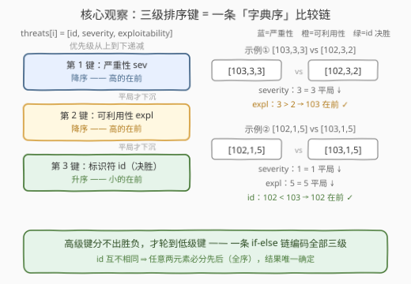
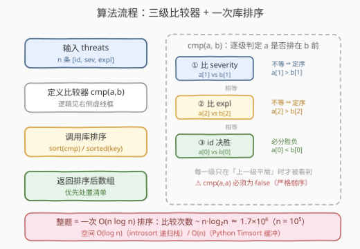

# LeetCode 按严重性和可利用性排序威胁 题解

## 1. 题目概述

- **标题 / 题号**：按严重性和可利用性排序威胁（#3631，medium）
- **链接**：https://leetcode.cn/problems/sort-threats-by-severity-and-exploitability/
- **难度**：中等
- **标签**：数组、排序、自定义比较器

> ⚠️ 本题为 LeetCode 付费题（🔒），官方接口不返回题面，以下题意依据官方示例用例、hints（"Use a custom sort comparator"）与相似题（2545）重建，可能与官方题面有出入。

**题意**：网络安全系统中，每条威胁记录是一个三元组 `threats[i] = [id_i, severity_i, exploitability_i]`：

- `id_i`：威胁的唯一标识符，**互不相同**；
- `severity_i`：**严重性**评分，越高表示该威胁越严重；
- `exploitability_i`：**可利用性**评分，越高表示越容易被攻击者利用。

请将威胁排成「优先处置清单」并返回排序后的数组，规则按优先级依次为：

1. **严重性降序**——越严重越靠前；
2. 严重性相同，**可利用性降序**——越易利用越靠前；
3. 两者都相同，**id 升序**——小 id 靠前（决胜键）。

**示例 1**：

```text
输入：threats = [[101,2,3],[102,3,2],[103,3,3]]
输出：[[103,3,3],[102,3,2],[101,2,3]]
解释：102 与 103 的严重性同为 3，均高于 101 的 2 → 101 垫底；
      严重性并列时比可利用性：103 的 3 > 102 的 2 → 103 排在 102 前。
```

**示例 2**：

```text
输入：threats = [[101,4,1],[103,1,5],[102,1,5]]
输出：[[101,4,1],[102,1,5],[103,1,5]]
解释：101 的严重性 4 最高，尽管可利用性最低仍排第一；
      102 与 103 的严重性（1）、可利用性（5）全部相同，按 id 升序 102 在前。
```

**约束条件**（按题意惯例重建）：

- `1 <= threats.length <= 10^5`
- `threats[i].length == 3`
- `1 <= id_i <= 10^9`，所有 `id` **互不相同**
- `1 <= severity_i, exploitability_i <= 10^4`

> 💡 **审题关键**：① 三个键**优先级递减**：sev 是主键，expl 只在 sev 平局时生效，id 只在前两个都平局时生效；② 方向**混合**：sev、expl 降序而 id 升序；③ id 互不相同 ⇒ 不存在「完全等价」的两个元素，输出**唯一确定**；④ 示例 2 的 102/103 三键只剩 id 可比，就是专门考决胜键的；⑤ 输入顺序是乱序（示例 2 中 103 在 102 前面），别指望「输入已经排好」。

## 2. 解题思路

### 2.1 暴力思路：手写 O(n²) 排序逐对搬移

不借助库排序，手写冒泡/选择排序：每趟从未排序区间里用三级比较规则选出「当前最优先」的威胁，交换到区间头部。比较规则本身不变，但手写排序是 $O(n^2)$——$n = 10^5$ 时约 $10^{10}$ 次比较，必然超时。

另一种似是而非的写法是**只按 severity 单键排**（`sorted(threats, key=lambda t: -t[1])`）：sev 并列的 102/103 顺序由稳定性决定（保持输入序 → 103 在前），与期望输出 `102, 103` 相反——这不是「慢」，是**错**。漏掉任何一级平局规则都会在构造数据下翻车。

> ⚠️ 这道题的考点根本不在「排序算法怎么实现」——库排序早已把 $O(n\log n)$ 做好；**全部难点浓缩在比较器的设计**：三个键、两种方向、一条平局链，能不能一次写对。hint 也直说了：*Use a custom sort comparator*。

### 2.2 核心观察：三级排序键 = 一条字典序比较链



**观察一：多级键比较就是「字典序」。** 与比较英文单词 `"apple"` 和 `"apricot"` 时逐字母下沉完全同构——第一个字母分不出胜负才看第二个。三级键的比较写成一条 if-else 链：

$$
\texttt{cmp}(a, b) =
\begin{cases}
a_1 \ne b_1 &\Rightarrow\; a \prec b \iff a_1 > b_1 \quad\text{（严重性降序）}\\
a_2 \ne b_2 &\Rightarrow\; a \prec b \iff a_2 > b_2 \quad\text{（可利用性降序）}\\
\text{否则} &\Rightarrow\; a \prec b \iff a_0 < b_0 \quad\text{（id 升序决胜）}
\end{cases}
$$

**观察二：方向混合在每一级内就地处理。** 降序键用 `>`、升序键用 `<`，互不干扰。Python 更可以把整条链压成一个**元组 key**：`(-sev, -expl, id)`——数值键取负即反转方向，元组天然按字典序比较，三个键一行编码完毕（C++ 可用 `tuple{-a[1], -a[2], a[0]}` 依样画瓢）。

**观察三：id 唯一 ⇒ 全序 ⇒ 两个红利。** 任意两个不同元素必分先后，不存在「等价元素」。于是：① 排序结果与输入顺序、排序算法无关，**确定性输出**（判题的前提）；② 无需 `stable_sort`——稳定性只在等价元素之间起作用，等价类全是单元素时它没有任何可做的事情。

> ⚠️ C++ 陷阱：`std::sort` 要求比较器满足**严格弱序**（strict weak ordering）——`cmp(a, a)` 必须返回 `false`。若把「降序」顺手写成 `a[1] >= b[1]`，等价元素会互相宣称「我该排你前面」，introsort 的分区逻辑随之失效，是**未定义行为**（可能越界崩溃/死循环）。本题 id 唯一、构造数据未必触发，但这是面试与生产的标准考点，比较器一律写严格比较。

### 2.3 算法流程图



**逻辑执行步骤**：

| 步骤 | 操作 | 说明 |
|------|------|------|
| ① 输入 | 读入 `threats` | $n$ 个三元组 `[id, sev, expl]` |
| ② 比较器 | 定义 `cmp(a, b)`：先 `a[1] > b[1]`，平局再 `a[2] > b[2]`，最后 `a[0] < b[0]` | 一条 if-else 链，见 2.2 |
| ③ 排序 | `sort(threats, cmp)` / `sorted(threats, key=...)` | 库排序 $O(n\log n)$，比较器 $O(1)$ |
| ④ 输出 | 返回排序后数组 | 原地排序或返回新数组均可 |

> ⚠️ 比较器是**纯函数**：只读 `a`、`b` 两个元素，不访问外部状态、不修改元素——库排序可能以任意顺序、任意次数调用它，任何副作用（比如在比较器里打日志计数还顺手改了数组）都会污染结果。

### 2.4 示例演算

对示例 2 的三个关键两两比较走一遍比较器：

| 比较对 | ① sev | ② expl | ③ id | 结论 |
|--------|-------|--------|------|------|
| `[101,4,1]` vs `[103,1,5]` | 4 > 1 → **101 前** | — | — | 第一键即分胜负，expl 再高也没用 |
| `[101,4,1]` vs `[102,1,5]` | 4 > 1 → **101 前** | — | — | 同上 |
| `[102,1,5]` vs `[103,1,5]` | 1 = 1 平局 | 5 = 5 平局 | 102 < 103 → **102 前** | 决胜键生效 |

三对比较传递一致（101 ≺ 102，101 ≺ 103，102 ≺ 103），最终序列 `[101,4,1] → [102,1,5] → [103,1,5]` ✓。再验证示例 1：`[102,3,2]` vs `[103,3,3]` 在 sev 平局后由 expl 判 103 在前；`[101,2,3]` 的 sev=2 最小垫底——输出 `[[103,3,3],[102,3,2],[101,2,3]]` ✓。

> 💡 示例 2 是「方向与决胜」的双考点样本：101 证明 sev 是**主**键（expl 最低也排第一），102/103 证明 id 决胜存在且为**升序**（输入序 103 在前被翻转为 102 在前）。

## 3. 参考代码

### C++

```cpp
class Solution {
public:
    vector<vector<int>> sortThreats(vector<vector<int>>& threats) {
        sort(threats.begin(), threats.end(), [](const vector<int>& a, const vector<int>& b) {
            if (a[1] != b[1]) return a[1] > b[1];   // ① 严重性降序
            if (a[2] != b[2]) return a[2] > b[2];   // ② 可利用性降序
            return a[0] < b[0];                     // ③ id 升序决胜
        });
        return threats;
    }
};
```

> 💡 **写法要点**：
> - 每一级都是「先判不等，再用严格比较定方向」，天然满足严格弱序；`a[1] != b[1]` 守门保证 `cmp(a, a)` 走到第三级返回 `a[0] < a[0] = false`；
> - 元素是 `vector<int>`，按值/常引用传参皆可；比较器整体只有三次下标访问 + 至多三次比较，常数极小；
> - 等价的元组写法（少一层 if）：
>   ```cpp
>   sort(threats.begin(), threats.end(), [](auto& a, auto& b) {
>       return tuple{-a[1], -a[2], a[0]} < tuple{-b[1], -b[2], b[0]};
>   });
>   ```
>   负号反转前两级方向，`tuple` 的字典序 `operator<` 就是三级比较链；
> - `sort` 就地排序后返回 `threats` 本身，避免一次数组拷贝（返回值语义要求返回排序结果，就地排完直接返回引用的拷贝由调用方承担）。

### Python

```python
class Solution:
    def sortThreats(self, threats: List[List[int]]) -> List[List[int]]:
        # 元组 key：(-sev, -expl, id) —— 负号反转方向，元组按字典序比较
        return sorted(threats, key=lambda t: (-t[1], -t[2], t[0]))
```

> 💡 **写法要点**：
> - `key` 比 `functools.cmp_to_key` 更快也更短：每个元素只算**一次** key（$n$ 次），而比较器版本每次比较都要现算（$O(n\log n)$ 次）；
> - 负号技巧仅适用于**数值键**；若哪一级是字符串键（如威胁名），要么 `cmp_to_key`，要么见第 5 节的三趟稳定排序；
> - `sorted` 返回新列表、不动输入；判题两者皆可，工程上改用 `threats.sort(key=...)` 就地排序省一份内存。

## 4. 复杂度分析

| 维度 | 复杂度 | 说明 |
|------|--------|------|
| **时间复杂度** | $O(n \log n)$ | 库排序主导；比较器每对 $O(1)$，key 版本额外 $n$ 次 key 构造 $O(n)$ |
| **空间复杂度** | $O(\log n)$ / $O(n)$ | C++ introsort 递归栈 $O(\log n)$；Python Timsort 合并缓冲最坏 $O(n)$（`key` 元组再占 $O(n)$） |

> - $n = 10^5$ 时比较次数约 $n \log_2 n \approx 1.7 \times 10^6$，毫秒级完成，瓶颈只在读入；
> - 借助计数排序可突破到 $O(n + k)$（sev、expl 取值范围 $k \le 10^4$）：按 `(sev, expl)` 建桶从高到低收集，桶内少数元素再按 id 排——见第 5 节讨论。

## 5. 扩展：严格弱序、负号 key 的边界与三趟稳定排序

**严格弱序违规会怎样？** 把降序写成 `a[1] >= b[1]` 后，sev 相等的两个元素 `a`、`b` 满足 `cmp(a,b) = cmp(b,a) = true`，违反反对称性。`std::sort` 的快排分区假设「`cmp` 为真的元素都在基准一侧」，等价元素互相宣称在前会把分区游标推出边界——典型症状是**偶发段错误（越界写）**，且只在特定输入/特定库实现下触发，极难复现。调试手段：libstdc++ 开 `_GLIBCXX_DEBUG`、libC++ 开 `_LIBCPP_DEBUG` 后用违反弱序的比较器跑一遍，断言立刻炸出来。顺带一提，`std::priority_queue`、`std::map` 等所有依赖序的容器同样吃这个约束。

**负号 key 的边界。** `(-sev, -expl, id)` 之所以成立，依赖两点：① 键是**可取负的数值**；② 元组的比较是**字典序**。一旦某级键是字符串（比如按威胁名排序）、或方向需求超过「升降」二值（比如第三键要按出现频率），负号技巧失效。两条退路：`functools.cmp_to_key(cmp)`（把比较器包成 key 类，通用但慢）或下面的多趟稳定排序。

**三趟稳定排序（Excel「多级排序」的实现方式）。** 从**最次要**的键到**主键**，每趟做一次稳定排序：

```python
ts = sorted(threats, key=lambda t: t[0])             # ③ id 升序（最次要，先排）
ts = sorted(ts,      key=lambda t: t[2], reverse=True)  # ② expl 降序
ts = sorted(ts,      key=lambda t: t[1], reverse=True)  # ① sev 降序（主键，最后排）
```

原理：最后一趟（主键）把所有 sev 不同的元素彻底分开；sev 相同的元素**原样保留**上一趟的相对顺序——即 expl 降序、expl 再相同保留 id 升序。稳定性像「透明胶带」把低级键的排序结果粘到高级键的平局缝隙里。代价是 $3 \times O(n\log n)$ 与两份中间数组，换来的是每键方向完全自由（`reverse` 参数替代负号，字符串键照用）——Excel 的多级排序对话框、SQL 的多列 `ORDER BY` 内部都是这个思路。

**现实原型。** 这道题是安全运营（SOC）告警分级的玩具版：severity 对应 CVSS 基础分（危害程度），exploitability 对应 EPSS（被利用概率）或 KEV 名录（已知被在野利用）；id 决胜对应「同分告警按资产编号稳定输出」以便审计可复现。工程上再加一维「资产重要性」就变成四键排序，套路不变。

## 6. 面试要点

**Q1：比较器里 `a[1] != b[1]` 这一刀为什么不能省，直接写 `a[1] > b[1]`？**

> 两个写法其实都满足严格弱序（`a[1] > b[1]` 在相等时返回 `false`），直接写也正确。真正不能写的是 `a[1] >= b[1]`——等价元素互相返回 `true` 违反反对称，`std::sort` 是未定义行为。「先判不等再定方向」的写法价值在**可读性**：每一级显式声明「平局才下沉到下一级」，三级链的语义一目了然，也顺手杜绝 `>=` 手滑。

**Q2：Python 的 `key=lambda t: (-t[1], -t[2], t[0])` 为什么成立？什么时候失灵？**

> 元组比较是字典序，恰好是「多级键」的形式定义；负号把降序键映成升序，三级混合方向压成单一升序元组。失灵场景：字符串键不能取负（`-t[1]` 报 TypeError）、需要非全序关系（如按父指针拓扑）时，退回 `functools.cmp_to_key` 或多趟稳定排序。

**Q3：如果删掉 id 决胜键，会发生什么？stable_sort 能救吗？**

> `(sev, expl)` 全等的两个元素互相「等价」，它们的相对顺序由**排序稳定性 + 输入顺序**决定：示例 2 输入中 103 在前，普通 `sort`（不稳定）结果不可预测，`stable_sort` 确定地保持 103 在前——都与期望的 `102, 103` 相反。稳定性能保证**可复现**，不能保证**符合期望**；期望本身需要 id 这一级才能定义。id 唯一还把偏序补成全序，使结果与输入顺序完全无关。

**Q4：三趟稳定排序和一趟三键排序，工程上怎么选？**

> 语义等价（都实现同一条字典序链）。一趟三键：$O(n\log n)$、一份内存，但比较器要一次写对；三趟稳定：3 倍排序开销，但每趟只有一个键、方向用 `reverse` 表达、极易单元测试。键是数值且量小（本题）用一趟 key；键含字符串/日期/多级自定义（报表排序、Excel 式需求）用三趟甚至 k 趟——正确性优先于常数。

**Q5：一定要 $O(n\log n)$ 吗？能不能更快？**

> 比较排序有 $\Omega(n\log n)$ 下界，但本题键取值范围小（$1 \le \text{sev}, \text{expl} \le 10^4$），可按组合键 `(sev, expl)` 计数分桶、从高到低输出，桶内元素再按 id 排（桶期望很小），整体 $O(n + k)$。此外若只需求「前 k 优先」可用堆做 Top-K $O(n\log k)$——「全量排序」与「取前 k」是两个需求，面试常拿来追问。

> 💡 **一句话总结**：3631 = 一条**三级字典序比较链**（sev↓ → expl↓ → id↑）+ 一次库排序。三个细节最值钱：**高级键平局才看低级键**；**严格弱序不许用 `>=`**；**id 唯一保证全序与确定输出**。

## 同类练习题

| # | 题目 | 与本题的关联 |
|---|------|-------------|
| 2545 | [根据第 K 场考试的分数排序](https://leetcode.cn/problems/sort-the-students-by-their-kth-score/) | 单键降序，自定义比较器的最简形态（本题的官方相似题） |
| 1356 | [根据数字二进制下 1 的数目排序](https://leetcode.cn/problems/sort-integers-by-the-number-of-1-bits/) | 两级键，二级数值升序，练「多级键一次写对」 |
| 937 | [重新排列日志文件](https://leetcode.cn/problems/reorder-data-in-log-files/) | 先分组再多级字典序，方向混合的进阶版 |
| 179 | [最大数](https://leetcode.cn/problems/largest-number/) | 比较器定义「谁拼在前面更大」，严格弱序的经典翻车现场 |
| 1366 | [通过投票对团队排名](https://leetcode.cn/problems/rank-teams-by-votes/) | 整行计数向量作比较键，多键排序的高阶形态 |
