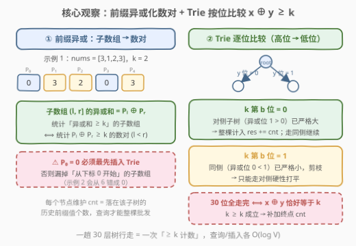
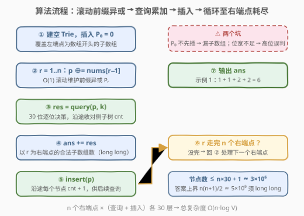

# 异或至少为K的子数组数目

- **题目名称**：异或至少为K的子数组数目
- **链接**：[3632. Subarrays with XOR at Least K](https://leetcode.cn/problems/subarrays-with-xor-at-least-k/)
- **难度**：困难
- **标签**：位运算、字典树（Trie）、数组、前缀异或

## 1. 题目概述

> ⚠️ 本题为 LeetCode 付费题，题意描述根据官方示例用例与 hints 重建，可能与官方题面有出入。

给你一个整数数组 `nums` 和一个整数 `k`，统计其中**异或和至少为 `k`**（即 $\ge k$）的**非空子数组**数目。

**示例 1**：

```text
输入：nums = [3,1,2,3], k = 2
输出：6
解释：满足条件的子数组共 6 个：
[3](3)、[3,1](2)、[3,1,2,3](3)、[1,2](3)、[2](2)、[3](3)，
异或和分别为 3,2,3,3,2,3，均 ≥ 2。
不满足的 4 个：[3,1,2](0)、[1](1)、[1,2,3](0)、[2,3](1)。
```

**示例 2**：

```text
输入：nums = [0,0,0], k = 0
输出：6
解释：所有子数组的异或和均为 0 ≥ 0，子数组总数 3×4/2 = 6。
```

**约束条件**（按 hints 与官方标签重建，量级为典型设定）：

- `1 <= nums.length <= 10^5`
- `0 <= nums[i] <= 10^9`（异或前缀的值域 $< 2^{30}$）
- `0 <= k <= 10^9`

> 💡 **审题关键**：① 官方 hints 直接点名三件套——**前缀异或数组**、**对每个右端点统计异或和 ≥ k 的子数组**、**用 Trie 高效查询计数**；② 是「**至少** $k$」而非「恰好 $k$」——这决定了哈希表做不了，必须上 01-Trie 按位比较；③ 答案最大约 $n^2/2 \approx 5 \times 10^9$，返回值要 `long long`。

---

## 2. 解题思路

### 2.1 暴力思路：枚举右端点向左扩展

固定右端点 `r`，向左逐步扩展 `l` 并增量维护异或和 `x = nums[l] ^ ... ^ nums[r]`，`x >= k` 则计数。两层循环 $O(n^2)$，$n = 10^5$ 时约 $10^{10}$ 次操作——必然超时。

> ⚠️ 瓶颈在于：对每个 `r` 都要**重新扫描全部左端点**。突破口：子数组异或和可以用**前缀异或**表示成两个前缀值的异或，从而把「子数组计数」变成「前缀数对计数」——这正是 hints 第一条。

### 2.2 核心观察：前缀异或 + 01-Trie 按位计数



**观察一：子数组异或 = 前缀异或之差。** 定义前缀异或 $P_0 = 0$，$P_j = P_{j-1} \oplus \texttt{nums}[j-1]$，则子数组 $(l, r]$（下标从 1 计）的异或和恰为：

$$P_r \oplus P_l$$

于是「统计异或和 $\ge k$ 的子数组」$\iff$「统计满足 $P_l \oplus P_r \ge k$ 的数对 $(l < r)$」。对每个 $r$，需要在已插入的 $P_0, \dots, P_{r-1}$ 中数出与 $P_r$ 异或后 $\ge k$ 的个数。

**观察二：01-Trie 把「≥ k」拆成逐位决策。** 把所有历史前缀按二进制高位到低位存入 01-Trie，**每个节点维护经过它的值的个数 `cnt`**。查询 `x` 时从根向下走，设当前是第 $b$ 位，$x_b$、$k_b$ 分别是 `x`、`k` 的该位：

| $k_b$ | 该位的合法走向 | 操作 |
|-------|---------------|------|
| **0** | 异或位取 1（走**对侧** $y_b = x_b \oplus 1$）⇒ 前缀已**严格大于** k | 对侧子树**整棵计入** `res += cnt`，转走同侧（异或位 0 = $k_b$）继续比较 |
| **0** | 异或位取 0（走**同侧** $y_b = x_b$）⇒ 与 k 打平 | 继续下一位 |
| **1** | 异或位取 1（走**对侧**）⇒ 与 k 打平 | 只能走对侧，同侧整枝**剪掉**（异或位 0 < 1 已无可能） |

**观察三：走完所有位时异或恰等于 k。** 30 位全部打平意味着 $x \oplus y = k$，而 $k \ge k$ 成立——记得把终点的 `cnt` 也加上。

> 💡 一句话：`k` 的当前位是 0，就对侧子树「批发」全收、同侧「零售」继续；`k` 的当前位是 1，就被迫走对侧硬追平——一趟 30 层的树行走，完成一次 $\ge k$ 的计数。

### 2.3 算法流程图



**逻辑执行步骤**：

| 步骤 | 操作 | 说明 |
|------|------|------|
| ① 初始化 | 建 01-Trie，插入 $P_0 = 0$ | ⚠️ 必须先插 $P_0$，否则漏掉所有「从下标 0 开始」的子数组 |
| ② 滚动前缀 | `p ^= nums[r-1]` | $O(1)$ 维护 $P_r$，无需显式前缀数组 |
| ③ 查询 | `res = query(p, k)` | 按 2.2 的逐位决策走 30 层，沿途累加对侧子树 `cnt` |
| ④ 累加 | `ans += res` | 即以 `r` 为右端点的合法子数组数 |
| ⑤ 插入 | `insert(p)` | 沿途每个节点 `cnt += 1`，供后续右端点查询 |
| ⑥ 循环 | `r` 从 1 到 n | 走完输出 `ans`（`long long`） |

> ⚠️ 两个易错点：一是 $P_0$ 不先入树，示例 2 会输出 0 而非 6；二是位宽要覆盖值域上界——$10^9 < 2^{30}$，从第 29 位走起即可，走少了会漏判高位差异。

### 2.4 示例演算（示例 1：nums = [3,1,2,3], k = 2）

前缀异或：$P = [0, 3, 2, 0, 3]$。逐个右端点演算（二进制：$k = 10_2$，取 30 位版中高 4 位示意）：

| r | $P_r$ | Trie 中已有 | 逐个验证 $P_l \oplus P_r$ | 本次新增 | 累计 ans |
|---|-------|-------------|---------------------------|----------|----------|
| 1 | 3 | {0} | 3⊕0 = 3 ✓ | 1 | 1 |
| 2 | 2 | {0, 3} | 2⊕0 = 2 ✓；2⊕3 = 1 ✗ | 1 | 2 |
| 3 | 0 | {0, 3, 2} | 0⊕0 = 0 ✗；0⊕3 = 3 ✓；0⊕2 = 2 ✓ | 2 | 4 |
| 4 | 3 | {0, 3, 2, 0} | 3⊕0 = 3 ✓；3⊕3 = 0 ✗；3⊕2 = 1 ✗；3⊕0 = 3 ✓ | 2 | **6** ✅ |

Trie 视角验证 $r = 3$（$x = 0$，$k = 10_2$）：第 1 位 $k_b = 1$，被迫走对侧（$y$ 该位为 1）→ 收窄到 $\{3, 2\}$；第 0 位 $k_b = 0$，对侧（异或位 1，即 $y$ 该位为 0 的 $\{2\}$）整棵计入，再走同侧到 $\{3\}$ 打平走完 → 再加 1。合计 2，与逐个验证一致。

---

## 3. 参考代码

### C++

```cpp
class Solution {
    static constexpr int B = 29;  // 10^9 < 2^30
    vector<array<int, 2>> ch;
    vector<int> cnt;

    void insert(int x) {
        int u = 0;
        for (int b = B; b >= 0; --b) {
            int d = (x >> b) & 1;
            if (!ch[u][d]) {
                ch[u][d] = ch.size();
                ch.push_back({0, 0});
                cnt.push_back(0);
            }
            u = ch[u][d];
            ++cnt[u];
        }
    }

    long long query(int x, int k) {
        long long res = 0;
        int u = 0;
        for (int b = B; b >= 0; --b) {
            int xb = (x >> b) & 1, kb = (k >> b) & 1;
            if (kb) {                          // 异或位必须为 1：只能走对侧
                if (!ch[u][xb ^ 1]) return res;
                u = ch[u][xb ^ 1];
            } else {                           // 异或位为 1 已严格大于：对侧整棵计入
                if (ch[u][xb ^ 1]) res += cnt[ch[u][xb ^ 1]];
                if (!ch[u][xb]) return res;    // 异或位为 0：走同侧继续打平
                u = ch[u][xb];
            }
        }
        return res + cnt[u];                   // x ⊕ y == k，同样满足 ≥ k
    }

public:
    long long countSubarrays(vector<int>& nums, int k) {
        ch.assign(1, {0, 0});
        cnt.assign(1, 0);
        long long ans = 0;
        int p = 0;
        insert(p);                             // P0 = 0 先入树
        for (int v : nums) {
            p ^= v;
            ans += query(p, k);
            insert(p);
        }
        return ans;
    }
};
```

> 💡 **写法要点**：
> - 根节点编号 0，新节点从 1 起编，`ch[u][d] == 0` 天然充当「孩子不存在」标记，无需额外判空结构。
> - `insert` 时**沿途每个节点** `cnt` 都 `+1`，这样任意子树的 `cnt` 就是「落在该子树的前缀值个数」——查询时才能整棵批发。
> - 中途无路可走立即 `return res`：高位已经决定大小，低位不必再看。
> - 节点数上界 $n \cdot 30 + 1 \approx 3 \times 10^6$，`vector` 动态扩容即可；`cnt` 单点 $\le n$ 用 `int`，`res`/`ans` 必须 `long long`。

### Python

```python
class Solution:
    def countSubarrays(self, nums: List[int], k: int) -> int:
        B = 29
        ch = [[0, 0]]
        cnt = [0]

        def insert(x: int) -> None:
            u = 0
            for b in range(B, -1, -1):
                d = (x >> b) & 1
                if not ch[u][d]:
                    ch[u][d] = len(ch)
                    ch.append([0, 0])
                    cnt.append(0)
                u = ch[u][d]
                cnt[u] += 1

        def query(x: int, k: int) -> int:
            res, u = 0, 0
            for b in range(B, -1, -1):
                xb, kb = (x >> b) & 1, (k >> b) & 1
                if kb:
                    if not ch[u][xb ^ 1]:
                        return res
                    u = ch[u][xb ^ 1]
                else:
                    if ch[u][xb ^ 1]:
                        res += cnt[ch[u][xb ^ 1]]
                    if not ch[u][xb]:
                        return res
                    u = ch[u][xb]
            return res + cnt[u]

        ans, p = 0, 0
        insert(p)                     # P0 = 0 先入树
        for v in nums:
            p ^= v
            ans += query(p, k)
            insert(p)
        return ans
```

> 💡 **写法要点**：
> - 与 C++ 完全同构；闭包直接引用外层 `ch`/`cnt`，避免传参。
> - $n = 10^5$ 时总步数约 $6 \times 10^6$ 层树行走，Python 实测可过；卡常可把 `insert`/`query` 内联进主循环减少函数调用开销。
> - 输入含 0 且 $k = 0$ 时答案为 $n(n+1)/2$，可用作对拍边界用例。

---

## 4. 复杂度分析

| 维度 | 复杂度 | 说明 |
|------|--------|------|
| **时间复杂度** | $O(n \log V)$ | 每个右端点一次 30 层查询 + 一次 30 层插入，$\log V = 30$（$V \approx 2^{30}$）；$n = 10^5$ 时约 $6 \times 10^6$ 步 |
| **空间复杂度** | $O(n \log V)$ | Trie 节点数 $\le n \cdot 30 + 1 \approx 3 \times 10^6$，每节点 2 个孩子指针 + 1 个计数 |

> - 对比暴力 $O(n^2)$： Trie 把「对每个 r 扫全部 l」变成「对每个 r 走 30 层树」，提速约 $\frac{n}{\log V} \approx 3300$ 倍。
> - 与 560（和为 K 的子数组）的前缀和 + 哈希 $O(n)$ 相比多一个 $\log V$ 因子——这是「≥ k」偏序查询必须付出的代价。

---

## 5. 扩展：为什么哈希表失效？Trie 计数问题族

**「恰好」用哈希，「至少」用 Trie。** 560 题统计和**恰好等于** k 的子数组时，前缀和 $S_l = S_r - k$ 被 k 唯一确定，一个哈希表 $O(1)$ 查走。而本题的 $\ge k$ 是**偏序关系**：满足条件的前缀集合 $\{y : x \oplus y \ge k\}$ 无法用单一键表达，哈希表无从查起——必须借助 Trie 把比较**按位分解**，让每个节点用 `cnt` 承接「子树批发」。同理：

| 问题 | 关系 | 数据结构 |
|------|------|----------|
| 560. 和为 K 的子数组 | $S_l = S_r - k$（等值） | 前缀和 + 哈希表，$O(n)$ |
| 1803. 异或值在 [low, high] 的数对 | $x \oplus y \in [\text{low}, \text{high}]$（区间） | Trie 计数两次相减：$\le \text{high}$ 减 $\le \text{low}-1$ |
| 421 / 1707. 最大异或 | 最大化 $x \oplus y$ | Trie 贪心走对侧（无计数） |
| **本题 3632** | $x \oplus y \ge k$（下界） | Trie 计数：$k_b=0$ 收对侧走同侧，$k_b=1$ 走对侧 |

**统一视角**：Trie 上「与 x 异或后落在某关系 R 内的历史值个数」都能逐位维护——等值/上下界/最值只是 R 不同。若查询带**在线区间限制**（如「只统计某窗口内的历史前缀」），升级为可持久化 Trie 或离线 + 树上删点即可（1707、1938 的玩法）。

**数对版与子数组版的互换**。任何「子数组 ⊙ 性质」（⊙ 为可逆运算）都能转成「前缀数对」：子数组 $(l, r]$ 的聚合值 $= P_r \odot P_l^{-1}$。和（+）、异或（⊕）可逆；最大/最小值不可逆，只能另走单调栈/滑窗路线——审题时先判运算可逆性，是选「前缀+字典结构」还是「滑动窗口」的第一步。

---

## 6. 面试要点

**Q1：如何把「子数组异或和 ≥ k」转化为数对计数？$P_0$ 为什么要先插入？**

> 定义 $P_0 = 0$、$P_j = P_{j-1} \oplus \texttt{nums}[j-1]$，则子数组 $(l, r]$ 的异或和 $= P_l \oplus P_r$，问题变为统计 $P_l \oplus P_r \ge k$ 的数对 $(l < r)$。$P_0$ 对应「左端点为数组开头」的全部子数组，不先插入会整体漏掉这一类——示例 2（全 0、k=0）会从 6 错成 0。

**Q2：详细描述 Trie 查询中每一位的决策逻辑。**

> 设当前位 $x_b$、$k_b$。若 $k_b = 0$：走对侧（使异或位为 1）的所有历史值已**严格大于** k，把对侧子树 `cnt` 整棵加入结果，再走同侧（异或位 0，与 k 打平）继续下一位；若 $k_b = 1$：同侧（异或位 0）已**严格小于** k，整枝剪掉，只能走对侧硬性打平。30 位全打平时 $x \oplus y = k$ 恰好满足 $\ge k$，补加终点 `cnt`。

**Q3：为什么不能用 560 题的哈希表做法？**

> 560 是**等值**查询：$S_l$ 由 $S_r - k$ 唯一确定，哈希键 O(1) 命中。本题是 $\ge k$ 的**偏序**查询：合法的 $y$ 构成一个不规则的值集合，没有单一键可查。必须把「比较」按位拆开——Trie 每个节点的子树恰好是「高 位确定、低位任意」的一段连续值域，`cnt` 使其可整段计数，这正是 Trie 优于哈希的地方。

**Q4：位宽取多少？取错会怎样？**

> 值域 $10^9 < 2^{30}$，从第 29 位走到第 0 位即可。位宽不足会把高位差异当相等，例如 $k$ 的最高有效位高于起点时会误判整棵子树；位宽冗余（如 31、32 位）只是浪费常数，不影响正确性。若 $k > 2^{30}$ 超过值域上界，查询自然中途无路返回 0，无需特判。

**Q5：本题答案为什么可能溢出 int？各变量类型怎么定？**

> 最坏 $n = 10^5$ 个全 0 元素、$k = 0$，答案是子数组总数 $\frac{n(n+1)}{2} \approx 5 \times 10^9 > 2^{31} - 1$。故 `ans`、`res` 用 `long long`；单节点 `cnt` 至多 $n$，`int` 足够。

> 💡 **一句话总结**：3632 = 前缀异或化子数组为数对 + 01-Trie 带计数的按位比较——$k_b=0$ 收对侧走同侧、$k_b=1$ 只走对侧、走完全程补等值，$O(n \log V)$ 一趟扫描收工。

---

## 7. 同类练习题

- [1803. 统计异或值在范围内的数对有多少](https://leetcode.cn/problems/count-pairs-with-xor-in-a-range/)：Trie 计数做「$\le \text{high}$ 减 $\le \text{low}-1$」，与本题同为带计数 Trie 的区间/下界查询
- [421. 数组中两个数的最大异或值](https://leetcode.cn/problems/maximum-xor-of-two-numbers-in-an-array/)：01-Trie 贪心走对侧入门，无计数版
- [1707. 与数组中元素的最大异或值](https://leetcode.cn/problems/maximum-xor-with-an-element-from-array/)：离线排序 + Trie（或可持久化 Trie），练习「在线限制」下的改造
- [560. 和为 K 的子数组](https://leetcode.cn/problems/subarray-sum-equals-k/)：前缀 + 哈希的「等值」版，对照理解为何 $\ge k$ 必须换 Trie
- [1442. 形成两个异或相等数组的三元组数目](https://leetcode.cn/problems/count-triplets-that-can-form-two-arrays-of-equal-xor/)：前缀异或「整体 = 部分 ⊕ 补集」性质的另一种计数应用
