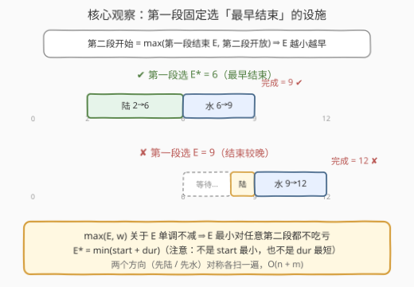
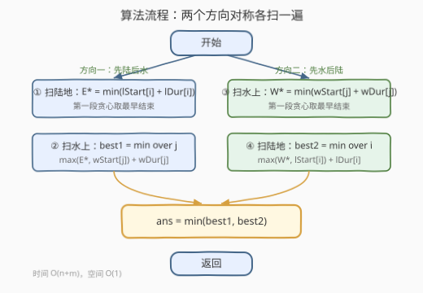

# 最早完成陆地和水上游乐设施的时间 I

- **题目名称**：最早完成陆地和水上游乐设施的时间 I
- **链接**：[3633. Earliest Finish Time for Land and Water Rides I](https://leetcode.cn/problems/earliest-finish-time-for-land-and-water-rides-i/)
- **难度**：简单
- **标签**：贪心、数组、双指针、二分查找、排序

## 1. 题目概述

游乐园有两类项目，游客必须从**每个类别中各体验恰好一个**设施，顺序不限：

- **陆地游乐设施** `i`：最早开放于 `landStartTime[i]`，玩 `landDuration[i]` 单位时间；
- **水上游乐设施** `j`：最早开放于 `waterStartTime[j]`，玩 `waterDuration[j]` 单位时间。

设施可以在其开放时间或**之后任意时间**开始；若在时间 $t$ 开始，则在 $t + \text{duration}$ 结束。完成一个后可立即开始另一个（若已开放），否则等它开放。返回完成**两个**设施的最早可能时间。

**示例 1**：

```text
输入：landStartTime = [2,8], landDuration = [4,1], waterStartTime = [6], waterDuration = [3]
输出：9
解释：先玩陆地设施 0（2 开始，6 结束），水上设施 0 恰在 6 开放，立即开始，
     6 + 3 = 9 结束。这是所有方案中最早的。
```

**示例 2**：

```text
输入：landStartTime = [5], landDuration = [3], waterStartTime = [1], waterDuration = [10]
输出：14
解释：先玩水上设施 0（1 开始，11 结束），陆地设施 0 早已开放，11 + 3 = 14 结束。
```

**约束条件**：

- $1 \le n, m \le 100$
- $1 \le \text{landStartTime}[i], \text{landDuration}[i], \text{waterStartTime}[j], \text{waterDuration}[j] \le 1000$

> 💡 **审题关键**：①「顺序不限」意味着要同时考察**先陆后水**与**先水后陆**两个方向，只算一个方向会漏解（示例 2 的最优方案就是先水后陆）；② 设施**可以推迟开始**，但推迟第一段永远不会更优——第二段的开始时间由 $\max(\text{第一段结束}, \text{第二段开放})$ 决定，第一段越早结束只会越好，所以每段都在「最早可开始时刻」开工即可，无需枚举开始时间。

---

## 2. 解题思路

### 2.1 暴力思路：枚举 (i, j) 与两种顺序

把「选哪两个设施 + 什么顺序」全部枚举一遍。固定先玩陆地 $i$、再玩水上 $j$：

$$\text{finish}(i \to j) = \max\underbrace{(L_i,~w_j^{\text{start}})}_{\text{第二段开始}} + w_j^{\text{dur}}, \qquad L_i = \text{landStart}[i] + \text{landDur}[i]$$

其中 $L_i$ 是第一段的结束时间（第一段从时间 0 起就可用，故其最早结束就是 $\text{start} + \text{duration}$）。对称地再算一遍 $j \to i$，取全局最小。

时间 $O(n \cdot m)$，$n, m \le 100$ 时至多 $2 \times 10^4$ 次基本运算，轻松通过——官方 hint 也直说 *"Use brute force"*，这是 I 题的预期解法。但续作 [3635（中等）](https://leetcode.cn/problems/earliest-finish-time-for-land-and-water-rides-ii/) 把数据量抬到 $10^5$ 级别，$O(n \cdot m)$ 会超时，先在本题把 $O(n+m)$ 的贪心想清楚。

### 2.2 核心观察：第一段固定选「最早结束」的设施



固定方向「先陆后水」，总完成时间关于第一段结束时间 $E$ 的函数是：

$$f(E) = \min_j \max(E,~w_j^{\text{start}}) + w_j^{\text{dur}}$$

**关键**：$\max(E, w_j^{\text{start}})$ 关于 $E$ **单调不减**——$E$ 变小，每个 $j$ 对应的取值都不变大。于是：

$$\forall E:\quad f(E) \ge f(E^*), \qquad E^* = \min_i \big(\text{landStart}[i] + \text{landDur}[i]\big)$$

也就是说，**无论第二段选哪个水上设施，第一段选「结束最早」的陆地设施都不吃亏**。第一段只需确定一个值 $E^*$，无需参与组合枚举。方向二（先水后陆）完全对称：第一段取 $W^* = \min_j (w_j^{\text{start}} + w_j^{\text{dur}})$。

> ⚠️ **常见贪心错误**：第一段选「开放最早」或「时长最短」的设施都是错的——决定第二段开始时刻的是**结束时间**（开放 + 时长之和）。例如陆地设施 `(start=1, dur=100)` 虽然开放最早，却把整个行程拖到 101 之后。

### 2.3 算法流程图



四个线性扫描（每个 $O(n)$ 或 $O(m)$），一个 `min` 汇合，总时间 $O(n + m)$、空间 $O(1)$。

### 2.4 示例演算

以示例 1 演算（$n = 2, m = 1$）：

```text
陆地设施结束时间：[2+4, 8+1] = [6, 9]   →  E* = 6（设施 0）
水上设施结束时间：[6+3]        = [9]    →  W* = 9（设施 0）

方向一（先陆后水，E* = 6）：
  j = 0：max(6, 6) + 3 = 9                → best1 = 9
方向二（先水后陆，W* = 9）：
  i = 0：max(9, 2) + 4 = 13
  i = 1：max(9, 8) + 1 = 10               → best2 = 10

答案 = min(9, 10) = 9 ✔
```

以示例 2 演算：

```text
E* = 5 + 3 = 8，W* = 1 + 10 = 11
方向一：max(8, 1) + 10 = 18   → best1 = 18
方向二：max(11, 5) + 3 = 14   → best2 = 14
答案 = min(18, 14) = 14 ✔
```

## 3. 参考代码

### C++

```cpp
class Solution {
public:
    int earliestFinishTime(vector<int>& landStartTime, vector<int>& landDuration,
                           vector<int>& waterStartTime, vector<int>& waterDuration) {
        // sweep(st1, du1, st2, du2)：先玩类别 1（贪心取最早结束），再玩类别 2
        auto sweep = [](vector<int>& st1, vector<int>& du1,
                        vector<int>& st2, vector<int>& du2) -> int {
            int firstEnd = INT_MAX;               // 第一段：最早结束时间
            for (int k = 0; k < (int)st1.size(); ++k)
                firstEnd = min(firstEnd, st1[k] + du1[k]);
            int best = INT_MAX;                   // 第二段：枚举选哪个
            for (int k = 0; k < (int)st2.size(); ++k)
                best = min(best, max(firstEnd, st2[k]) + du2[k]);
            return best;
        };

        int bestLandFirst = sweep(landStartTime, landDuration,
                                  waterStartTime, waterDuration);
        int bestWaterFirst = sweep(waterStartTime, waterDuration,
                                   landStartTime, landDuration);
        return min(bestLandFirst, bestWaterFirst);
    }
};
```

### Python

```python
class Solution:
    def earliestFinishTime(self, landStartTime: List[int], landDuration: List[int],
                           waterStartTime: List[int], waterDuration: List[int]) -> int:
        def sweep(st1, du1, st2, du2):
            first_end = min(s + d for s, d in zip(st1, du1))
            return min(max(first_end, s) + d for s, d in zip(st2, du2))

        return min(sweep(landStartTime, landDuration, waterStartTime, waterDuration),
                   sweep(waterStartTime, waterDuration, landStartTime, landDuration))
```

暴力写法（本題范围同样通过，供对照）：

```python
class Solution:
    def earliestFinishTime(self, landStartTime: List[int], landDuration: List[int],
                           waterStartTime: List[int], waterDuration: List[int]) -> int:
        ans = inf
        for i in range(len(landStartTime)):
            e = landStartTime[i] + landDuration[i]
            for j in range(len(waterStartTime)):
                w = waterStartTime[j] + waterDuration[j]
                ans = min(ans, max(e, waterStartTime[j]) + waterDuration[j])  # 陆 i → 水 j
                ans = min(ans, max(w, landStartTime[i]) + landDuration[i])    # 水 j → 陆 i
        return ans
```

## 4. 复杂度分析

| 维度 | 贪心解 | 暴力解 | 说明 |
|------|--------|--------|------|
| 时间复杂度 | $O(n + m)$ | $O(n \cdot m)$ | 贪心四个线性扫描；暴力枚举所有有序组合 |
| 空间复杂度 | $O(1)$ | $O(1)$ | 仅常数个临时变量 |
| 本题实际表现 | 均可 AC | 均可 AC | $n, m \le 100$；II 题（3635）需贪心 |

## 5. 扩展：续作 3635 的挑战

[3635. Earliest Finish Time for Land and Water Rides II](https://leetcode.cn/problems/earliest-finish-time-for-land-and-water-rides-ii/) 将 $n, m$ 提升到 $10^5$ 级别，$O(n \cdot m)$ 暴力失效，而本文的贪心框架**原封不动**就是正解的一半：第一段 $O(n)$（或 $O(m)$）取最早结束，瓶颈只剩第二段。

第二段要在 $\{(w_j^{\text{start}}, w_j^{\text{dur}})\}$ 中求 $\min_j \max(E^*, w_j^{\text{start}}) + w_j^{\text{dur}}$。把水上设施按 $w_j^{\text{start}}$ **排序**后，可以用**前缀最小值**预处理：对 $w_j^{\text{start}} \le E^*$ 的部分取 $\min(w_j^{\text{start}} + w_j^{\text{dur}})$（此时 $\max$ 被 $E^*$ 吃掉），其余部分后缀上 $w_j^{\text{start}}$ 递增、再对 $w_j^{\text{dur}}$ 取前缀最小……整理后配合**二分查找**与**双指针**就能 $O((n + m) \log(n + m))$ 甚至线性回答——这正是本题标签里 Greedy / Sorting / Binary Search / Two Pointers 的真正去处。

## 6. 面试要点

**Q1：为什么第一段选「结束最早」而不是「开放最早」的设施？**

> 第二段的开始时刻是 $\max(E, \text{第二段开放})$，只依赖第一段的**结束时间** $E = \text{start} + \text{dur}$。$\max$ 关于 $E$ 单调不减，所以 $E$ 越小，任何固定的第二段选择都不更差。开放早但耗时长（如 `start=1, dur=100`）的设施会把 $E$ 推大，反而劣于晚开放但短平快的设施。

**Q2：为什么不需要枚举「推迟开始第一段」的情况？**

> 推迟第一段只会让其结束时间 $E$ 变大或不变，而第二段开始时刻 $\max(E, \cdot)$ 关于 $E$ 单调不减，总完成时间不会因此变小。故每段都在「自身开放时刻」立即开始即最优。

**Q3：贪心为什么不会漏掉最优解？它交换论证的关键一步是什么？**

> 对固定方向，最优解的第一段设施 $i_0$ 结束于 $E_0 \ge E^*$。把第一段换成结束最早的设施后，第二段开始时刻 $\max(E^*, \cdot) \le \max(E_0, \cdot)$，完成时间不增。所以「第一段取 $E^*$ + 第二段枚举」覆盖了该方向的最优解；两个方向都算，即覆盖全局最优。

**Q4：本题若把「每类恰好一个」改成「每类各选多个/可空」，贪心还成立吗？**

> 不直接成立。多段行程下每一段的选择会互相耦合（前一段的结束影响后一段的等待），单点贪心不再有单调性保底，通常要转向排序 + DP 或带反悔的贪心（参考 1235 规划兼职工作一类的带权区间调度）。

**Q5：$O(n + m)$ 已经线性，还有优化空间吗？**

> 就本题而言没有意义（输入读入已是 $\Omega(n+m)$）。值得留意的反而是实现层面：两个方向的扫描逻辑完全对称，抽成一个 `sweep(st1, du1, st2, du2)` 复用，既省代码又避免复制粘贴时抄错下标。

## 7. 同类练习题

- [435. 无重叠子区间](https://leetcode.cn/problems/non-overlapping-intervals/)：同样以「结束时间」为核心量做贪心，体会为什么按结束而非开始排序/保留。
- [1353. 最多可以参加的会议数目](https://leetcode.cn/problems/maximum-number-of-events-that-can-be-attended/)：按结束时间贪心 + 最小堆选择当前可参加的会议，与本题「越早结束越留余地」一脉相承。
- [2054. 两个最好的不重叠活动](https://leetcode.cn/problems/two-best-non-overlapping-events/)：选两个先后执行的活动并最优化目标，结构与本题「两段行程」同构。
- [1235. 规划兼职工作](https://leetcode.cn/problems/maximum-profit-in-job-scheduling/)：带权区间调度的经典，从贪心过渡到排序 + DP + 二分，对应本题「扩展」中的进阶方向。
