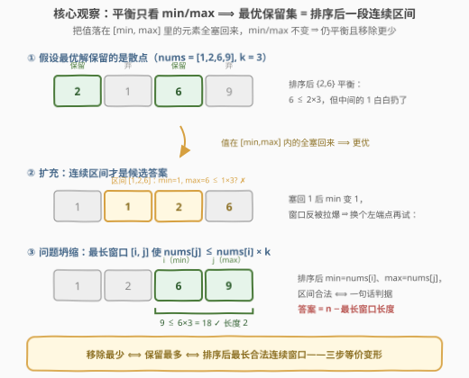
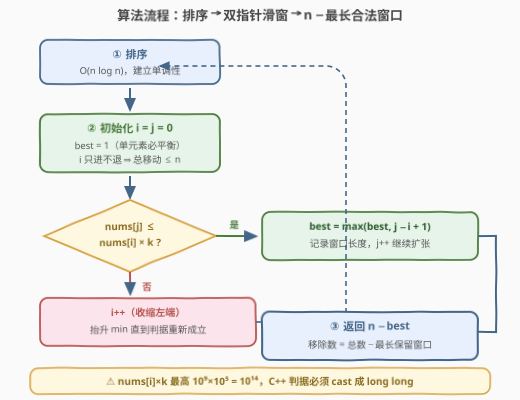

# LeetCode 使数组平衡的最少移除数目 题解

## 1. 题目概述

- **标题 / 题号**：使数组平衡的最少移除数目（#3634，medium）
- **链接**：https://leetcode.cn/problems/minimum-removals-to-balance-array/
- **难度**：中等
- **标签**：数组、排序、滑动窗口、二分查找

**题意**：给定整数数组 $nums$ 和整数 $k$。若一个数组的**最大**元素**至多**是其**最小**元素的 $k$ 倍（即 $\max \le \min \times k$），称该数组是**平衡**的。可以从 $nums$ 中移除**任意数量**的元素，但剩余数组**不能为空**。返回使剩余数组平衡所需移除元素的**最小**数量。大小为 1 的数组视为平衡。

**示例 1**：

```text
输入：nums = [2,1,5], k = 2
输出：1
解释：移除 5 得 [2,1]，max = 2 ≤ 1 × 2 = min × k，平衡。
```

**示例 2**：

```text
输入：nums = [1,6,2,9], k = 3
输出：2
解释：移除 1 和 9 得 [6,2]，6 ≤ 2 × 3。
```

**示例 3**：

```text
输入：nums = [4,6], k = 2
输出：0
解释：6 ≤ 4 × 2，本来就平衡，什么都不用移。
```

**约束**：

- $1 \le nums.length \le 10^5$
- $1 \le nums[i] \le 10^9$
- $1 \le k \le 10^5$

> 💡 **审题关键**：① 平衡与否**只由保留集合的 $\max$ 和 $\min$ 两个数决定**，中间元素随便塞都不影响判定；② 移除的是「任意元素」而非连续段——但下面会证明最优保留集合恰是排序后的一段**连续区间**；③ $nums[i] \times k$ 上界 $10^9 \times 10^5 = 10^{14}$，超出 `int` 范围，C++ 判据须用 64 位。

## 2. 解题思路

### 2.1 暴力思路：枚举保留子集 / 枚举区间

最直观的暴力是枚举 $2^n$ 个子集逐一判定——$n = 10^5$ 下天文数字，不可行。

稍加组织：既然平衡只看 $\max / \min$，**先排序**再枚举保留的连续区间 $[i, j]$，每个区间 $O(1)$ 判定 $nums[j] \le nums[i] \times k$，取最长合法区间，答案为 $n - $ 长度。这是 $O(n^2)$ 个区间，$n = 10^5$ 时约 $10^{10}$ 次判定，仍然超时——但它已经暴露了问题的全部结构：**候选解只有 $O(n^2)$ 个连续区间**，缺的只是快速找到最长的那一个。

### 2.2 核心观察：排序 + 最长合法连续窗口



**观察一（判定只看两端）**：保留集合 $S$ 平衡 $\iff \max(S) \le \min(S) \times k$，与 $S$ 中间取了哪些值无关。

**观察二（保留集合可无损扩充为连续区间）**：设 $S$ 平衡。排序后所有数值落在 $[\min(S), \max(S)]$ **之间**的元素，全部加入 $S$ 后 $\min / \max$ 不变，仍平衡，且移除数只减不增。因此**最优保留集合一定是排序后数组的连续区间 $[i..j]$**——散点解永远不优于其扩充后的区间解。

**观察三（区间判定一句话）**：排序后区间 $[i..j]$ 的 $\min = nums[i]$、$\max = nums[j]$，故

$$\text{区间合法} \iff nums[j] \le nums[i] \times k$$

于是问题三步等价变形：**移除最少 $\iff$ 保留最多 $\iff$ 找排序后最长合法连续窗口**，答案 $= n - \text{最长窗口长度}$。合法性关于 $j$ 单调不增（$j$ 越大 $nums[j]$ 越大）、关于 $i$ 单调不减（$i$ 越大 $nums[i] \times k$ 越大），这正是滑动窗口/二分的用武之地。

### 2.3 算法流程图：双指针滑动窗口



**文字版步骤**：

| 步骤 | 操作 | 说明 |
|------|------|------|
| ① 排序 | `sort(nums)` | 建立单调性，$O(n \log n)$ |
| ② 初始化 | $i = 0$，$best = 1$ | 单元素窗口必平衡；$i$ 只进不退 |
| ③ 扩张 $j$ | 对每个 $j$ 从左到右：若 $nums[j] > nums[i] \times k$ 则循环 $i{+}{+}$ | 收缩左端抬升 $\min$ 直到判据重新成立 |
| ④ 记录 | $best = \max(best,\ j - i + 1)$ | 当前窗口 $[i, j]$ 合法 |
| ⑤ 汇总 | 返回 $n - best$ | 移除数 = 总数 − 最长保留窗口 |

**为什么 $i$ 不会回退**：$j$ 右移只会让 $nums[j]$ 变大（判据更难满足），旧窗口左端 $i$ 之后的任何更小起点 $i' < i$ 在新的 $j$ 下必然仍非法；而 $i$ 前进过的位置永久作废。两个指针各走至多 $n$ 步，滑窗部分 $O(n)$。

**二分写法同样成立**：固定 $i$，最右合法 $j = \text{upper\_bound}(nums,\ nums[i] \times k) - 1$，长度 $j - i + 1$；对每个 $i$ 二分一次，总复杂度 $O(n \log n)$，与排序同级。

### 2.4 示例演算：nums = [1,6,2,9], k = 3

排序后 $nums = [1, 2, 6, 9]$，滑窗过程：

| $j$ | $nums[j]$ | $nums[i]$ | 判定 $nums[j] \le nums[i] \times 3$ | 动作 | 窗口 | $best$ |
|-----|-----------|-----------|-----------------------------------|------|------|--------|
| 0 | 1 | 1 | $1 \le 3$ ✓ | 记录 | $[1]$ | 1 |
| 1 | 2 | 1 | $2 \le 3$ ✓ | 记录 | $[1,2]$ | 2 |
| 2 | 6 | 1 | $6 > 3$ ✗ | $i$ 移到 1：$6 \le 2 \times 3 = 6$ ✓ | $[2,6]$ | 2 |
| 3 | 9 | 2 | $9 > 6$ ✗ | $i$ 移到 2：$9 \le 6 \times 3 = 18$ ✓ | $[6,9]$ | 2 |

最长窗口长度 $best = 2$，**答案 $= 4 - 2 = 2$**（保留 $\{6, 9\}$ 或 $\{2, 6\}$，移除 2 个）——与示例 2 一致（示例解释保留的是 $\{2, 6\}$，同为合法最优）。

> 💡 示例 1 排序后 $[1,2,5]$：$j = 2$ 时 $5 > 1 \times 2$，$i$ 移到 1 仍 $5 > 2 \times 2$，$i$ 移到 2 得单元素窗口，$best$ 停在 2，答案 $3 - 2 = 1$。示例 3 全程判据成立，$best = n$，答案 0。

## 3. 参考代码

### C++

```cpp
class Solution {
public:
    int minRemoval(vector<int>& nums, int k) {
        sort(nums.begin(), nums.end());
        int n = nums.size();
        int i = 0, best = 1;                    // 单元素窗口必平衡
        for (int j = 0; j < n; j++) {
            while ((long long)nums[j] > (long long)nums[i] * k) {
                i++;                            // 收缩左端，抬升 min
            }
            best = max(best, j - i + 1);
        }
        return n - best;
    }
};
```

> 💡 **写法要点**：
> - **判据必须 `long long`**：$nums[i] \times k$ 上界 $10^{14}$，`int` 乘法静默溢出可能错判合法为非法；返回值 $n - best \le 10^5$，用 `int` 即可。
> - **`best` 初值 1**：$n = 1$ 时循环只走一趟且窗口非空，初值保证正确；同时兜住「所有配对都非法」的极端情形。
> - **`while` 不会越界**：$i = j$ 时 $nums[j] > nums[j] \times k$ 恒假（$k \ge 1$），循环自然停在 $i \le j$。

### Python

```python
class Solution:
    def minRemoval(self, nums: List[int], k: int) -> int:
        nums.sort()
        i, best = 0, 1
        for j, x in enumerate(nums):
            while x > nums[i] * k:
                i += 1
            best = max(best, j - i + 1)
        return len(nums) - best
```

> Python 整数无溢出问题；`for j, x in enumerate(nums)` 免去重复下标访问。

## 4. 复杂度分析

| 维度 | 复杂度 | 说明 |
|------|--------|------|
| **时间复杂度** | $O(n \log n)$ | 排序主导；滑窗部分 $i, j$ 各至多前进 $n$ 步，$O(n)$ |
| **空间复杂度** | $O(1)$ | 排序原地、只用常数指针（不计语言排序栈，Python 的 Timsort 为 $O(n)$ 辅助） |

> - $n = 10^5$ 时排序约 $1.7 \times 10^6$ 次比较，轻松通过。
> - 二分写法总复杂度同为 $O(n \log n)$，但常数更大；滑窗版更优也更短。

## 5. 扩展：同族「最长保留窗口」的变体

本题的等价变形「移除最少 $\iff$ 保留最多 $\iff$ 最长合法窗口」是一大类题目的通用套路，值得横向对比：

- **[2009. 使数组连续的最少操作数](https://leetcode.cn/problems/minimum-number-of-operations-to-make-array-continuous/)**：排序去重后滑窗找「值域跨度 $< n$」的最长窗口，答案同样是 $n - $ 窗口长度——结构几乎复刻本题。
- **[1838. 最高频元素的频数](https://leetcode.cn/problems/frequency-of-the-most-frequent-element/)**：排序后窗口判定「前缀和能否把整段抬平到 $nums[j]$」，同族但判定需前缀和 $O(1)$ 计算。
- 若把「移除任意元素」改成「至多移除 $m$ 个」并问能否平衡，判定窗口长度 $\ge n - m$ 是否可达，仍是同一套滑窗。
- 反过来若问「**有多少个**子数组平衡」，滑窗对每个右端点累加窗口长度即可（$j$ 固定时合法左端点是一段前缀）。

抓住主线：**排序建立单调性 → 合法窗口关于端点单调 → 双指针线性扫描**。

## 6. 面试要点

**Q1：为什么最优保留集合一定是排序后的连续区间？**

> 设某保留集合 $S$ 平衡。把排序后数值落在 $[\min(S), \max(S)]$ 内的元素全部加入，$\min / \max$ 均不变，仍平衡且移除数不增——散点解被区间解支配。而数值落在区间外的元素加入必然改变 $\min$ 或 $\max$，不可无损扩充。故只需在 $O(n^2)$ 个连续区间里找最长合法者。

**Q2：滑动窗口的单调性依据是什么？为什么 i 不回退？**

> 排序后固定 $i$，$j$ 越大 $nums[j]$ 越大，合法性单调不增；固定 $j$，$i$ 越大 $nums[i] \times k$ 越大，合法性单调不减。$j$ 右移只会让判据更难满足，曾因非法而被越过的左端点在更大的 $j$ 下依然非法，故 $i$ 单向前进，两指针各走 $n$ 步，总计 $O(n)$。

**Q3：有哪些溢出 / 边界坑？**

> ① C++ 判据 $nums[i] \times k$ 上界 $10^9 \times 10^5 = 10^{14}$，超 `int` 约 $4.6 \times 10^4$ 倍，必须 `(long long)` 强转（转一边即可，另一边自动提升）；② $n = 1$ 时答案必为 0，`best` 初值 1 天然覆盖；③ 全部元素互不成对时最长窗口退化为单元素，答案 $n - 1$，无需特判。

**Q4：这题和经典滑窗（如 424 替换后的最长重复字符）有何异同？**

> 同：都是「合法性随窗口扩张单调变坏 → 右端点驱动、左端点 amortized 收缩」求最长窗口。异：424 的判据靠**频次表**维护窗口内状态，本题判据只涉及**两端点的值** $nums[j] \le nums[i] \times k$，连维护状态的哈希/计数器都不需要，是滑窗中最轻的形态。

**Q5：除了滑窗还能怎么写？复杂度差在哪？**

> 固定 $i$ 二分找最大的 $j$ 使 $nums[j] \le nums[i] \times k$（`upper_bound`），每个 $i$ 一次 $O(\log n)$ 查询，总 $O(n \log n)$——与排序同级但多乘一个 $\log$。滑窗版整体 $O(n \log n)$ 里排序是唯一瓶颈，主过程线性。另可预处理后对每个 $i$ 直接查「$\le nums[i] \times k$ 的最右下标」，写法更直白但同理。

## 同类练习题

| # | 题目 | 与本题的关联 |
|---|------|-------------|
| 2009 | [使数组连续的最少操作数](https://leetcode.cn/problems/minimum-number-of-operations-to-make-array-continuous/) | 同款「排序 + 滑窗找最长保留段，答案 = n − 最长段」，结构最接近本题 |
| 2831 | [找出最长等值子数组](https://leetcode.cn/problems/find-the-longest-equal-subarray/) | 删除至多 k 个元素求最长等值子数组，同族「保留最多」思想 |
| 1838 | [最高频元素的频数](https://leetcode.cn/problems/frequency-of-the-most-frequent-element/) | 排序后窗口判定需前缀和配合，滑窗判定的进阶版 |
| 1552 | [两球之间的磁力](https://leetcode.cn/problems/magnetic-force-between-two-balls/) | 排序建立单调性 + 二分答案，对照「单调性二分」与「单调性滑窗」两种利用方式 |
| 424 | [替换后的最长重复字符](https://leetcode.cn/problems/longest-repeating-character-replacement/) | 最长可行窗口的经典款，对照频次维护型判据与本题端点值判据的差异 |
