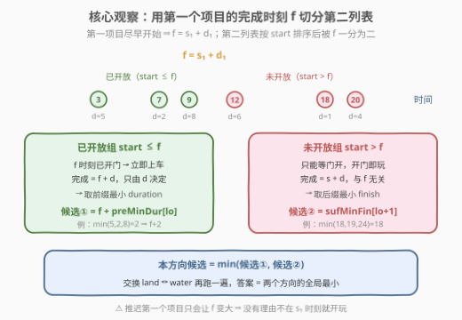
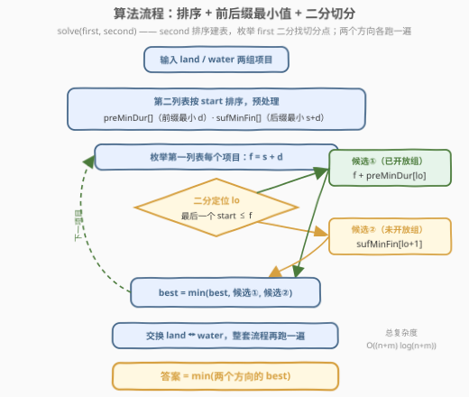

# LeetCode 最早完成陆地和水上游乐设施的时间II 题解

## 1. 题目概述

- **标题 / 题号**：最早完成陆地和水上游乐设施的时间II（#3635，medium）
- **链接**：https://leetcode.cn/problems/earliest-finish-time-for-land-and-water-rides-ii/
- **难度**：中等
- **标签**：贪心、数组、排序、二分查找、双指针

**题意**：游乐园里有两类项目：**陆地游乐设施**（开放时间 `landStartTime[i]`、时长 `landDuration[i]`）与**水上游乐设施**（开放时间 `waterStartTime[j]`、时长 `waterDuration[j]`）。游客必须从**每个类别中恰好体验一个**设施，**顺序不限**：

- 设施可以在其开放时间开始，或之后任意时间开始；
- 若在时间 $t$ 开始，则在 $t + \text{duration}$ 结束；
- 完成一个设施后可立即乘坐另一个（若已开放），或等它开放。

返回游客**完成这两个设施的最早可能时间**。

**示例 1**：

```text
输入：landStartTime = [2,8], landDuration = [4,1], waterStartTime = [6], waterDuration = [3]
输出：9
解释：先玩陆地 0（2 开始，6 结束），水上 0 恰在 6 开放，立即开始，6+3=9 结束。
```

**示例 2**：

```text
输入：landStartTime = [5], landDuration = [3], waterStartTime = [1], waterDuration = [10]
输出：14
解释：先玩水上 0（1 开始，11 结束），陆地 0 已开放，11+3=14 结束。
反向（先陆地）为 5+3=8 结束再玩水上 10 分钟 = 18，更差。
```

**约束**：

- `1 <= n, m <= 5 * 10^4`
- `1 <= landStartTime[i], landDuration[i], waterStartTime[j], waterDuration[j] <= 10^5`

> 💡 **审题关键**：① 顺序不限且两类时长不对称 ⇒ **两个方向都要试**（示例 2 中先玩水上更优）；② 固定一对设施与顺序后，第一个设施**没有理由推迟开始**——晚开始只会让后程整体后移；③ $n \times m \le 2.5 \times 10^9$，暴力配对必超时，需要把「内层枚举第二个设施」压缩成 $O(\log m)$ 查表。

## 2. 解题思路

### 2.1 暴力思路：枚举配对与顺序

固定一对 $(i, j)$ 与顺序（先 $i$ 后 $j$）。由审题关键②，第一个设施在 $s_i$ 时刻就开始，完成时刻 $f = s_i + d_i$；第二个设施最早能开始的时间是 $\max(f, s_j)$，于是：

$$\text{finish}(i \to j) = \max(s_i + d_i,\; s_j) + d_j$$

答案即 $\min_{i,j}\big\{\text{finish}(i \to j),\ \text{finish}(j \to i)\big\}$，时间 $O(nm) \approx 2.5 \times 10^9$——**超时**。（I 代 3633 的 $n, m \le 100$，这个暴力就能过。）

> ⚠️ 瓶颈在「对每个 $i$ 都要重扫一遍另一类列表」。突破口：固定 $f$ 后，另一类里的设施按「$f$ 时刻是否已开放」分成性质不同的两组，各自的最优都能**预处理成前后缀最小值**，二分定位分组即可 $O(1)$ 取到。

### 2.2 核心观察：f 切分 + 前缀最小 duration / 后缀最小 finish



考虑「先玩 X 类再玩 Y 类」这个方向。枚举 X 中设施 $x$，令 $f = s_x + d_x$。把 Y 类**按 start 排序**后用 $f$ 二分切分成两组：

**已开放组（$s_y \le f$）**：$f$ 时刻已开门，立即开始最优，完成 $= f + d_y$——**只由 $d_y$ 决定**。取组内最小 duration（按 start 排序后的**前缀最小值** $\text{preMinDur}$）：

$$\text{候选①} = f + \text{preMinDur}[\text{lo}]$$

**未开放组（$s_y > f$）**：必须等门开，且开门即开始最优（晚开始只会更晚完成），完成 $= s_y + d_y$——**与 $f$ 无关**。取组内最小 finish（**后缀最小值** $\text{sufMinFin}$）：

$$\text{候选②} = \text{sufMinFin}[\text{lo}+1]$$

两组按 $s_y$ 与 $f$ 的大小关系**不重不漏**地覆盖整个 Y 类，故该方向对 $x$ 的最优为 $\min(\text{候选①}, \text{候选②})$；再对 $x$ 取最小。最后**交换两类角色**（先玩 Y 再玩 X）重复一遍，答案取两个方向的全局最小。

> 💡 一句话：**「早开组拼 duration，晚开组拼自身 finish」**——把内层 $O(m)$ 枚举坍缩成一次二分 + 两次 $O(1)$ 查表。

### 2.3 算法流程图



**逻辑执行步骤**：

| 步骤 | 操作 | 说明 |
|------|------|------|
| ① 建表 | 两类各组成 $(s, d)$ 对，第二类按 $s$ 排序 | 排序是二分切分的前提 |
| ② 预处理 | $\text{preMinDur}[t] = \min(d_0..d_t)$；$\text{sufMinFin}[t] = \min_{u \ge t}(s_u + d_u)$ | 前缀最小 duration、后缀最小 finish |
| ③ 枚举 | 对第一类每个 $x$：$f = s_x + d_x$ | 第一个项目总是尽早开始 |
| ④ 二分 | lo = 最后一个 $s_y \le f$ 的下标 | `partition_point` / `bisect_right` |
| ⑤ 取候选 | lo ≥ 0 ⇒ $f + \text{preMinDur}[\text{lo}]$；lo+1 < m ⇒ $\text{sufMinFin}[\text{lo}+1]$ | 空组跳过 |
| ⑥ 打擂台 | 更新本方向 best | |
| ⑦ 换向 | 交换两类角色，①–⑥ 再跑一遍 | 顺序不限 ⇒ 两方向都要试 |
| ⑧ 输出 | $\min(\text{best}_1, \text{best}_2)$ | |

### 2.4 示例演算（示例 1）

`land = [(2,4), (8,1)]`，`water = [(6,3)]`。

**方向一：先陆地后水上**（第二列表 water：`preMinDur = [3]`，`sufMinFin = [9]`）：

| 第一项目 | f = s+d | lo | 候选① f + preMinDur[lo] | 候选② sufMinFin[lo+1] | 行最优 |
|---|---|---|---|---|---|
| (2,4) | 6 | 0 | 6+3 = **9** | 组空 | 9 |
| (8,1) | 9 | 0 | 9+3 = 12 | 组空 | 12 |

方向一 best = 9。

**方向二：先水上后陆地**（第二列表 land 排序后 `[(2,4),(8,1)]`：`preMinDur = [4,1]`，`sufMinFin = [6,9]`）：

| 第一项目 | f = s+d | lo | 候选① | 候选② | 行最优 |
|---|---|---|---|---|---|
| (6,3) | 9 | 1 | 9+1 = 10 | 组空 | 10 |

方向二 best = 10。

答案 $= \min(9, 10) = 9$ ✅（对应「陆地 0 → 水上 0」）。

## 3. 参考代码

### C++

```cpp
class Solution {
public:
    int earliestFinishTime(vector<int>& landStartTime, vector<int>& landDuration,
                           vector<int>& waterStartTime, vector<int>& waterDuration) {
        int n = landStartTime.size(), m = waterStartTime.size();
        vector<pair<int, int>> land(n), water(m);
        for (int i = 0; i < n; ++i) land[i] = {landStartTime[i], landDuration[i]};
        for (int j = 0; j < m; ++j) water[j] = {waterStartTime[j], waterDuration[j]};

        // 先玩 first，再玩 second；返回该方向的最优完成时刻
        auto solve = [](vector<pair<int, int>>& first, vector<pair<int, int>>& second) -> int {
            sort(second.begin(), second.end());            // 按 start 排序
            int k = second.size();
            vector<int> preMinDur(k), sufMinFin(k + 1, INT_MAX);
            for (int t = 0; t < k; ++t)
                preMinDur[t] = min(t ? preMinDur[t - 1] : INT_MAX, second[t].second);
            for (int t = k - 1; t >= 0; --t)
                sufMinFin[t] = min(sufMinFin[t + 1], second[t].first + second[t].second);

            int best = INT_MAX;
            for (auto& [s, d] : first) {
                int f = s + d;
                // lo = 最后一个 start <= f 的下标
                int lo = int(partition_point(second.begin(), second.end(),
                            [&](const pair<int, int>& p) { return p.first <= f; })
                         - second.begin()) - 1;
                if (lo >= 0) best = min(best, f + preMinDur[lo]);
                if (lo + 1 < k) best = min(best, sufMinFin[lo + 1]);
            }
            return best;
        };

        return min(solve(land, water), solve(water, land));
    }
};
```

> 💡 **写法要点**：
> - `solve(land, water)` 会原地排序 `water`，随后 `solve(water, land)` 把它当 first 用——first 的顺序无所谓，不影响正确性。
> - `partition_point` 要求区间按谓词「先 true 后 false」划分，按 start 排序后天然满足；等价写法是 `upper_bound(second.begin(), second.end(), make_pair(f, INT_MAX))`。
> - 值域 $\le 2 \times 10^5$，`int` 足够，无溢出风险。
> - 空组判断：`lo < 0` 说明没有任何设施在 $f$ 前开放；`lo + 1 == k` 说明全部已开放。

### Python

```python
from bisect import bisect_right

class Solution:
    def earliestFinishTime(self, landStartTime: List[int], landDuration: List[int],
                           waterStartTime: List[int], waterDuration: List[int]) -> int:
        land = sorted(zip(landStartTime, landDuration))
        water = sorted(zip(waterStartTime, waterDuration))

        def solve(first, second):
            k = len(second)
            starts = [s for s, _ in second]
            pre_min_dur = [d for _, d in second]
            for t in range(1, k):
                pre_min_dur[t] = min(pre_min_dur[t - 1], pre_min_dur[t])
            suf_min_fin = [s + d for s, d in second]
            for t in range(k - 2, -1, -1):
                suf_min_fin[t] = min(suf_min_fin[t + 1], suf_min_fin[t])

            best = float('inf')
            for s, d in first:
                f = s + d
                lo = bisect_right(starts, f) - 1   # 最后一个 start <= f
                if lo >= 0:
                    best = min(best, f + pre_min_dur[lo])
                if lo + 1 < k:
                    best = min(best, suf_min_fin[lo + 1])
            return best

        return min(solve(land, water), solve(water, land))
```

> 💡 **写法要点**：
> - `zip` + `sorted` 一步得到按 start 排序的 $(s, d)$ 列表；两个方向共用各自的排序结果，只额外建查询数组。
> - `bisect_right(starts, f) - 1` 即「最后一个 $s_y \le f$」的下标 lo。
> - 前缀最小 / 后缀最小各自一趟线性扫描就地生成，无需额外库。

## 4. 复杂度分析

| 维度 | 复杂度 | 说明 |
|------|--------|------|
| **时间复杂度** | $O((n+m)\log(n+m))$ | 排序 $O((n+m)\log(n+m))$；两个方向各枚举一遍第一列表，每次一个二分 $O(\log)$ + $O(1)$ 查表 |
| **空间复杂度** | $O(n+m)$ | 排序副本与 `preMinDur` / `sufMinFin` 两个辅助数组 |

> - 相比暴力 $O(nm) \approx 2.5 \times 10^9$，降到约 $10^6$ 量级，$n, m = 5 \times 10^4$ 轻松通过。
> - 若把第一列表按 $f$ 排序改用双指针（见第 5 节），二分也可省去。

## 5. 扩展：双指针消二分 + 问题族定位

**双指针版本**。把第一列表按 $f = s + d$ 排序后，随着 $f$ 单调不减，第二列表（按 start 排序）的切分点 lo 也**单调右移**——一次归并式推进即可，排序后整体 $O(n + m)$，省掉每个元素一次的二分。数据规模再涨一个量级时的首选。

**与 I 代的关系**。3633（I 代）$n, m \le 100$、值域 $\le 1000$，$O(nm)$ 暴力即可；3635（II 代）把规模抬到 $5 \times 10^4$，逼出「排序 + 前后缀最小值 + 二分」的结构。这是加量版题目的典型演进路径：**先想清楚暴力里哪一层枚举可以被排序切分压缩**。

**套路定位**。本题属于「**配对取 min-max，按一端排序后用前缀/后缀预处理另一端**」问题族：2054（选两个不重叠活动）用「按结束时间排序 + 前缀最大价值」，1235（兼职规划）用「二分找上一个不冲突工作」——识别信号是「枚举 $i$，内层对 $j$ 只关心某个关于 $j$ 的可前缀/后缀化的量」。

## 6. 面试要点

**Q1：为什么第一个设施一定在开放时刻就开始？推迟会不会反而更优？**

> 固定一对 $(i,j)$ 与顺序后，总完成时间 $\max(s_i + d_i, s_j) + d_j$ 关于第一个设施的实际开始时刻**单调不减**：$f < s_j$ 时推迟不改变结果（都在等 $s_j$），$f \ge s_j$ 时推迟直接变差。故推迟无收益，$s_i$ 时刻开始即可。

**Q2：固定 $f$ 后，为什么第二列表能切成两组分别取最小？两组公式为何长得不一样？**

> $s_y \le f$ 的设施 $f$ 时刻已开门，立即开始，完成 $f + d_y$——$f$ 对全组相同，只比 $d_y$；$s_y > f$ 的设施最早 $s_y$ 开始（开门即玩最优），完成 $s_y + d_y$——与 $f$ 无关，直接比自身 finish。两组按大小关系不重不漏划分，组内各自取最小即组内最优。

**Q3：为什么两个方向都必须跑？只跑一个方向会怎样？**

> 两类设施的持续时间不对称，顺序影响结果：示例 2 中「先水上（10 分钟）后陆地（3 分钟）」得 14，「先陆地后水上」得 18。顺序不限意味着两种都合法，必须都考虑。

**Q4：preMinDur 与 sufMinFin 分别在维护什么？为什么一个对 duration、一个对 s+d？**

> 两者都是把「组内取最小」压到 $O(1)$ 的查询结构：已开放组的完成值 $f + d_y$ 中 $f$ 全组相同，故比 $d_y$——组是排序数组的前缀，用前缀最小；未开放组的完成值 $s_y + d_y$ 与 $f$ 无关——组是后缀，用后缀最小。方向不同纯粹是因为切分点两侧相对排序数组的位置不同。

**Q5：从暴力到正解的关键一步是什么？**

> 意识到内层 $O(m)$ 枚举里，第二设施只有两种身份——「已开放，比 duration」或「未开放，比自身 finish」——且两个指标都能随 start 排序做前缀/后缀最小预处理，于是二分定位身份、$O(1)$ 取最优，复杂度从 $O(nm)$ 降到 $O((n+m)\log(n+m))$。

> 💡 **一句话总结**：3635 = 尽早开始（$f = s_1 + d_1$）+ 按 start 排序以 $f$ 二分切分 +「早开组前缀最小 duration / 晚开组后缀最小 finish」+ 两个方向各跑一遍。

## 同类练习题

| # | 题目 | 与本题的关联 |
|---|------|-------------|
| 3633 | [最早完成陆地和水上游乐设施的时间 I](https://leetcode.cn/problems/earliest-finish-time-for-land-and-water-rides-i/) | 本题的小规模版（$n, m \le 100$），可先写 $O(nm)$ 暴力再对照优化 |
| 2054 | [两个最好的不重叠活动](https://leetcode.cn/problems/two-best-non-overlapping-events/) | 同款「排序 + 二分定位 + 前缀/后缀预处理」的选两个事件套路 |
| 1235 | [规划兼职工作](https://leetcode.cn/problems/maximum-profit-in-job-scheduling/) | 按时间排序后二分找不冲突的前序工作，配对思想的 DP 版 |
| 435 | [无重叠区间](https://leetcode.cn/problems/non-overlapping-intervals/) | 区间贪心入门，体会「按哪一端排序」的决策 |
| 2008 | [出租车的最大盈利](https://leetcode.cn/problems/maximum-earnings-from-taxi/) | 排序 + 二分/DP 的区间衔接配对，与本题结构同族 |
