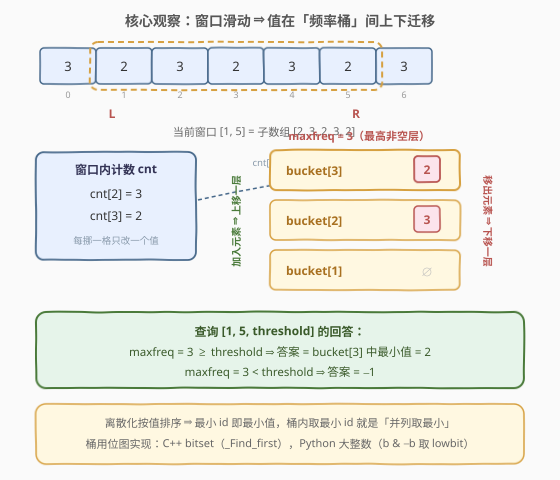
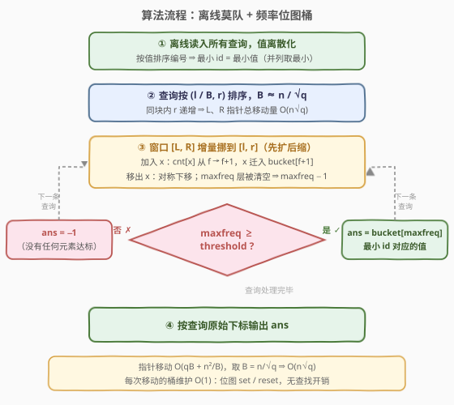

# 查询超过阈值频率最高元素

- **题目名称**：查询超过阈值频率最高元素
- **链接**：[3636. 查询超过阈值频率最高元素](https://leetcode.cn/problems/threshold-majority-queries/)
- **难度**：困难
- **标签**：数组、哈希表、计数、排序、莫队算法（平方分解）

## 1. 题目概述

**题意**：给定长度为 $n$ 的整数数组 $nums$ 和查询数组 $queries$，其中 $queries[i] = [l_i, r_i, threshold_i]$。对每条查询，在子数组 $nums[l_i..r_i]$ 中找出所有**出现至少 $threshold_i$ 次**的元素，返回其中**频率最高**的那个（频率并列时取**数值最小**）；若不存在这样的元素则返回 $-1$。

**示例 1**：

```text
输入：nums = [1,1,2,2,1,1], queries = [[0,5,4],[0,3,3],[2,3,2]]
输出：[1,-1,2]
解释：[0,5] 中 1 出现 4 次 ≥ 4，答案 1；[0,3] 中最高频仅 2 次 < 3，答案 -1；
      [2,3] 中 2 出现 2 次 ≥ 2，答案 2。
```

**示例 2**：

```text
输入：nums = [3,2,3,2,3,2,3], queries = [[0,6,4],[1,5,2],[2,4,1],[3,3,1]]
输出：[3,2,3,2]
解释：[1,5] 中 2 出现 3 次、3 出现 2 次，都 ≥ 2，取频率最高的 2；
      [2,4] 中 3 出现 2 次 ≥ 1（2 只出现 1 次），答案 3。
```

**约束条件**：

- $1 \le n \le 10^4$
- $1 \le nums[i] \le 10^9$
- $1 \le queries.length \le 5 \times 10^4$
- $0 \le l_i \le r_i < n$，$1 \le threshold_i \le r_i - l_i + 1$

> 💡 **审题关键**：① $threshold$ 只是**门槛**，不参与「选谁」——设区间最大频率为 $maxfreq$，若 $maxfreq \ge threshold$，答案就是**区间众数**（并列取最小），否则 $-1$（下文证明）；② $n \le 10^4$、$q \le 5\times10^4$，允许 $O(n\sqrt{q}) \approx 5\times10^6$ 量级的**离线**做法；③「并列取最小」要求桶结构能 $O(1)$ 取出最小值——离散化时**按值排序**，让 id 顺序等于值顺序即可。

---

## 2. 解题思路

### 2.1 暴力思路：逐查询重建频率表

对每条查询独立扫描 $[l_i, r_i]$，用哈希表统计每个值的出现次数，再遍历哈希表取「频率达标者中频率最高、并列最小」的值。单次 $O(n)$，总计 $O(nq) = 10^4 \times 5\times10^4 = 5\times10^8$，必然超时。

> 💡 暴力的问题在于**大量重复劳动**：相邻两条查询的窗口往往高度重叠，却每次都从头统计。把查询按窗口位置排序，让窗口**增量移动**、只增删差量元素——这正是**莫队算法**（离线平方分解）的用武之地。

### 2.2 核心观察：阈值只把门，众数定答案 + 莫队维护频率桶



**观察一（threshold 退化为一次比较）**：设 $F = \max_v \text{freq}_{[l,r]}(v)$ 为区间**最大频率**，$M$ 为频率并列最大中最小的值（即「区间众数，并列取小」）。则

$$
ans_i = \begin{cases} M, & F \ge t_i \\ -1, & F < t_i \end{cases}
$$

**证明**：若 $F \ge t_i$，众数自身达标，而达标集合 $\{v : \text{freq}(v) \ge t_i\}$ 中的最大频率不可能超过全局最大频率 $F$，又必然能达到 $F$（众数在集合内）——所以「达标者中频率最高」$=$「频率为 $F$」，答案即频率为 $F$ 的值中最小者，就是 $M$。若 $F < t_i$，所有值频率 $\le F < t_i$，无人达标，返回 $-1$。用示例 2 的查询 $[1,5,2]$ 验证：$F = 3$（值 2），$M = 2$，$3 \ge 2$，答案 $2$ ✓；查询 $[0,3,3]$（示例 1）：$F = 2 < 3$，答案 $-1$ ✓。

于是问题归结为经典的**区间众数查询**（并列取最小），外加一次门槛比较。

**观察二（众数不可合并，只能离线增量维护）**：众数不满足可合并性——左右两半各自的众数都无法代表整体（反例：左半 $[a,a,a,v,v]$、右半 $[b,b,b,b,v,v,v]$，两半众数分别是 $a$、$b$，整体众数却是跨越两半的 $v$）。线段树类的可合并结构失效。经典出路是**莫队**：查询按键 $\left(l \div B,\ r\right)$ 排序（$B$ 为块长），窗口 $[L, R]$ 在相邻查询间**增量滑动**，元素一进一出各自 $O(1)$ 更新计数。

**观察三（频率桶：$O(1)$ 维护「每层频率的值集合」）**：设 $cnt[x]$ 为值 $x$（离散化后的 id）在当前窗口的出现次数，$bucket[f]$ 为**频率恰为 $f$ 的值集合**。窗口每加入/移出一个 $x$，$cnt[x]$ 变化 $\pm 1$，$x$ 恰好在相邻两层桶之间**迁移一格**：

- **加入 $x$**（$cnt[x]$ 从 $f \to f+1$）：$x$ 从 $bucket[f]$ 迁入 $bucket[f+1]$；$maxfreq \gets \max(maxfreq,\ f+1)$；
- **移出 $x$**（$cnt[x]$ 从 $f \to f-1$）：$x$ 从 $bucket[f]$ 迁回 $bucket[f-1]$；若 $f = maxfreq$ 且 $bucket[maxfreq]$ 被清空，则 $maxfreq \gets maxfreq - 1$——**单步递减即够**，因为 $x$ 自己恰好落到了 $maxfreq - 1$ 层，该层必非空（$f = 1$ 时窗口已空，$maxfreq = 0$）。

回答查询时：$maxfreq \ge t$ 则答案为 $bucket[maxfreq]$ 中的**最小 id**（离散化按值排序，最小 id 即最小值），否则 $-1$。

桶的实现取**位图**：$bucket[f]$ 是一个 $m$ 位（$m$ 为不同值个数，$m \le n \le 10^4$）的位向量，置位/清位 $O(1)$，取最小 id 用 `bitset::_Find_first()`（C++）或大整数 lowbit $b\ \&\ (-b)$（Python），全程无查找树、无哈希冲突。

### 2.3 算法流程图



**文字版步骤**：

| 步骤 | 操作 | 说明 |
|------|------|------|
| ① 离散化 | 值排序去重，映射为 id | id 顺序 = 值顺序，「并列取最小」= 桶内取最小 id |
| ② 排序查询 | 按 $(l \div B,\ r)$ 排序，$B \approx n/\sqrt{q}$ | 同块内 $r$ 单调，指针总移动量 $O(qB + n^2/B) = O(n\sqrt{q})$ |
| ③ 滑动窗口 | 四个 `while` 把 $[L,R]$ 挪到 $[l,r]$，先扩后缩 | 每次加入/移出：$cnt$ 与桶层迁移 $O(1)$，同步维护 $maxfreq$ |
| ④ 回答 | $maxfreq \ge t$ ? | 是：答案 $=$ $bucket[maxfreq]$ 最小 id 对应值；否：$-1$ |
| ⑤ 输出 | 按查询**原始下标**写回 `ans` | 排序打乱了处理顺序，需记录原下标 |

> ⚠️ **四个 `while` 的顺序**：必须**先扩后缩**（先 `R < r`、`L > l` 的扩张，再 `R > r`、`L < l` 的收缩）。这样保证被删除的位置一定位于扩张后的窗口内部，计数永远不为负；乱序执行可能删掉窗口外的元素，计数出错。

### 2.4 示例演算：nums = [3,2,3,2,3,2,3]（示例 2）

取 $B = 2$，排序键 $(l \div 2,\ r)$，处理顺序为 $[0,6,4] \to [1,5,2] \to [2,4,1] \to [3,3,1]$。初始窗口为空（$L=0,\ R=-1$）：

| 处理查询 | 窗口动作 | $cnt$ 状态 | 非空桶 | $maxfreq$ | 门槛比较 | 答案 |
|----------|----------|-----------|--------|-----------|----------|------|
| $[0,6,4]$ | $R: -1 \to 6$，依次加入 3,2,3,2,3,2,3 | $3 \to 4$，$2 \to 3$ | $b[4]=\{3\},\ b[3]=\{2\}$ | 4 | $4 \ge 4$ ✓ | $b[4]$ 最小值 $= 3$ |
| $[1,5,2]$ | $L: 0 \to 1$，移出 $nums[0]=3$ | $3 \to 3$，$2 \to 3$ | $b[3]=\{3,2\}$ | 3（$b[4]$ 空，减 1） | $3 \ge 2$ ✓ | $b[3]$ 最小值 $= 2$ |
| $[2,4,1]$ | $L: 1 \to 2$ 移出 2；$R: 5 \to 4$ 移出 2 | $3 \to 3$，$2 \to 1$ | $b[3]=\{3\},\ b[1]=\{2\}$ | 3 | $3 \ge 1$ ✓ | $b[3]$ 最小值 $= 3$ |
| $[3,3,1]$ | $L: 2 \to 3$ 移出 3；$R: 4 \to 3$ 移出 3 | $3 \to 1$，$2 \to 1$ | $b[1]=\{3,2\}$ | 1（逐层下降） | $1 \ge 1$ ✓ | $b[1]$ 最小值 $= 2$ |

最终按原始顺序输出 $[3,2,3,2]$，与预期一致。注意第 4 行 $maxfreq$ 从 3 降到 1 的过程：移出 3 使 $b[3]$ 清空 $\to maxfreq = 2$（此时 $b[2] = \{3\}$ 非空），再移出一个 3 使 $b[2]$ 清空 $\to maxfreq = 1$——每一步都只需减 1。

---

## 3. 参考代码

### C++

```cpp
class Solution {
public:
    vector<int> subarrayMajority(vector<int>& nums, vector<vector<int>>& queries) {
        int n = nums.size(), q = queries.size();
        // 离散化：按值排序，id 顺序即值顺序（并列取最小 → 桶内取最小 id）
        vector<int> vals(nums);
        sort(vals.begin(), vals.end());
        vals.erase(unique(vals.begin(), vals.end()), vals.end());
        int m = vals.size();
        unordered_map<int, int> id;
        for (int i = 0; i < m; i++) id[vals[i]] = i;
        vector<int> a(n);
        for (int i = 0; i < n; i++) a[i] = id[nums[i]];

        // 莫队：查询按 (l/B, r) 排序
        int B = max(1, (int)(n / sqrt((double)q)));
        vector<int> order(q);
        iota(order.begin(), order.end(), 0);
        sort(order.begin(), order.end(), [&](int x, int y) {
            int bx = queries[x][0] / B, by = queries[y][0] / B;
            return bx != by ? bx < by : queries[x][1] < queries[y][1];
        });

        vector<int> cnt(m, 0);
        vector<bitset<10000>> bucket(n + 2);   // bucket[f]：频率恰为 f 的值集合（位图，m ≤ n ≤ 1e4）
        int maxfreq = 0;
        vector<int> ans(q, -1);
        int L = 0, R = -1;                     // 当前窗口 [L, R]，初始为空

        auto add = [&](int i) {
            int x = a[i], f = cnt[x]++;
            bucket[f + 1][x] = 1;
            if (f) bucket[f][x] = 0;
            maxfreq = max(maxfreq, f + 1);
        };
        auto del = [&](int i) {
            int x = a[i], f = cnt[x]--;
            bucket[f][x] = 0;
            if (f > 1) bucket[f - 1][x] = 1;
            if (f == maxfreq && bucket[f].none()) maxfreq = f - 1;
        };

        for (int qi : order) {
            int l = queries[qi][0], r = queries[qi][1], t = queries[qi][2];
            while (R < r) add(++R);            // 先扩后缩，计数不为负
            while (L > l) add(--L);
            while (R > r) del(R--);
            while (L < l) del(L++);
            if (maxfreq >= t)
                ans[qi] = vals[bucket[maxfreq]._Find_first()];
        }
        return ans;
    }
};
```

> 💡 **写法要点**：
> - **`bitset<10000>` 桶**：$m \le n \le 10^4$，固定上限即可；$n+2$ 层 × 1250 字节 ≈ 12.5 MB，可接受。置位/清位 $O(1)$，`_Find_first()` 取最小 id 只在**回答查询时**调用（$q$ 次），不在指针移动的热路径上。
> - **若嫌位图占内存**，可换 `vector<set<int>>`：语义相同（每层一个有序集合，取 `*begin()`），代价是每次迁移 $O(\log n)$，总时间多一个 $\log$ 因子。
> - **`maxfreq` 递减无需循环**：移出操作使 $bucket[maxfreq]$ 清空时，被移出的值自身落到了 $maxfreq-1$ 层，故减 1 后该层必非空。

### Python

```python
class Solution:
    def subarrayMajority(self, nums: List[int], queries: List[List[int]]) -> List[int]:
        n, q = len(nums), len(queries)
        vals = sorted(set(nums))                     # id 顺序即值顺序
        rank = {v: i for i, v in enumerate(vals)}
        a = [rank[v] for v in nums]
        m = len(vals)
        pow2 = [1 << i for i in range(m)]            # 每个值的位掩码

        B = max(1, int(n / q ** 0.5))
        order = sorted(range(q), key=lambda i: (queries[i][0] // B, queries[i][1]))

        cnt = [0] * m
        bucket = [0] * (n + 2)                       # bucket[f]：频率 f 的值集合（大整数位掩码）
        maxfreq = 0
        ans = [-1] * q
        L, R = 0, -1
        for qi in order:
            l, r, t = queries[qi]
            while R < r:                             # 四个 while：先扩后缩
                R += 1
                x = a[R]; f = cnt[x]; cnt[x] = f + 1
                bucket[f + 1] ^= pow2[x]
                if f: bucket[f] ^= pow2[x]
                if f + 1 > maxfreq: maxfreq = f + 1
            while L > l:
                L -= 1
                x = a[L]; f = cnt[x]; cnt[x] = f + 1
                bucket[f + 1] ^= pow2[x]
                if f: bucket[f] ^= pow2[x]
                if f + 1 > maxfreq: maxfreq = f + 1
            while R > r:
                x = a[R]; f = cnt[x]; cnt[x] = f - 1
                bucket[f] ^= pow2[x]
                if f > 1: bucket[f - 1] ^= pow2[x]
                if f == maxfreq and bucket[f] == 0: maxfreq = f - 1
                R -= 1
            while L < l:
                x = a[L]; f = cnt[x]; cnt[x] = f - 1
                bucket[f] ^= pow2[x]
                if f > 1: bucket[f - 1] ^= pow2[x]
                if f == maxfreq and bucket[f] == 0: maxfreq = f - 1
                L += 1
            if maxfreq >= t:                         # lowbit 取最小 id（= 最小值）
                ans[qi] = vals[(bucket[maxfreq] & -bucket[maxfreq]).bit_length() - 1]
        return ans
```

> 💡 **写法要点**：
> - 桶用**大整数**当位图：`bucket[f] ^= pow2[x]` 一条语句完成「从旧层删除 + 进新层插入」（异或对已置位是清除、对未置位是置位）；取最小 id 用 lowbit：`b & -b` 是最低位的 1，`.bit_length() - 1` 即下标。
> - 增删逻辑**内联**在四个 `while` 里而不是封装成函数——CPython 的函数调用开销在 $4\times10^6$ 次移动的量级下不可忽视。
> - `bucket[f] == 0` 对大整数是 $O(1)$ 判空（只看长度标记），不扫描位数。

---

## 4. 复杂度分析

| 维度 | 复杂度 | 说明 |
|------|--------|------|
| **时间复杂度** | $O(n\sqrt{q} + q\log q)$ | 指针移动：同左块内 $R$ 单调，每块至多 $n$ 步，共 $\le \frac{n}{B} \cdot n$；$L$ 每查询至多 $B$ 步，共 $\le qB$。取 $B = n/\sqrt{q}$ 得 $O(n\sqrt{q})$；另加查询排序 $O(q\log q)$。每次移动的桶操作 $O(1)$ |
| **空间复杂度** | $O(n \cdot \lceil m/64 \rceil)$ | 位图桶 $n+2$ 层、每层 $m$ 位（$m \le n \le 10^4$），约 12.5 MB；另有 $cnt$ 数组 $O(m)$、排序下标 $O(q)$ |

> - 代入 $n = 10^4$、$q = 5\times10^4$：$n\sqrt{q} \approx 2.2\times10^6$，两种指针移动合计约 $4.5\times10^6$ 次 $O(1)$ 操作——C++ 实测约 25 ms，Python 约 1.3 s，均从容通过。
> - 若取朴素的 $B = \sqrt{n} = 100$，移动量约 $6\times10^6$，同一量级；$B = n/\sqrt{q}$ 是理论最优。

---

## 5. 扩展：分块预处理区间众数（在线替代解法）与随机化的失效

**分块预处理**（支持在线）：把数组切成 $\sqrt{n}$ 块，用 $O(n^2/B)$ 时间预处理「任意整块区间 $[b_1..b_2]$ 的众数 $(频率, 值)$」——固定 $b_1$ 向右逐块扩张即可增量统计。查询 $[l, r]$ 时，设核心为完全覆盖的整块区间、两侧散段共 $\le 2B$ 个元素，则**区间众数要么是核心整块区间的众数，要么出现在散段中**（若真众数完全落在核心内，其频率不超过核心众数，核心众数在整段中恰好追平，并列最小值由值序吸收）。对每个候选值，用「值 → 有序出现位置表」二分出 $[l,r]$ 内的**精确频率**再取最优，单查询 $O(B\log n)$。对比莫队：分块版可在线，但要多一个 $\log$ 且代码更繁琐；本题允许离线，莫队更直接。

**随机化为什么不行**：区间多数问题（如 1157）可以随机取区间内位置做候选——当门槛超过半长时，多数元素被采样命中的概率 $\ge 1/2$，几十次采样即高置信。但本题 $threshold$ 可低至 1：极端情形所有元素互异，$maxfreq = 1$，**全部元素并列**，答案是**区间最小值**——随机采样无法保证命中最小值。低门槛 + 并列取最小的组合，注定需要精确的众数结构。

---

## 6. 面试要点

**Q1：为什么 threshold 不影响「选谁」，只决定返回不返回 $-1$？**

> 设区间最大频率 $F$。若 $F \ge t$：众数自身达标，且达标集合内的最大频率不可能超过 $F$（全局最大），又必然达到 $F$，故「达标者中频率最高」就是「频率为 $F$」，答案为频率 $F$ 的最小值。若 $F < t$：所有值频率 $\le F < t$，无人达标返回 $-1$。两种情形 threshold 都只出现在与 $F$ 的一次比较中。

**Q2：莫队按 $(l/B, r)$ 排序，均摊 $O(n\sqrt{q})$ 怎么来的？**

> 同一左块内 $r$ 单调不减，$R$ 每块至多扫一趟全长，共 $\le (n/B)\cdot n$ 步；跨块时 $R$ 最多重扫一遍，已计入。$L$ 在块内每条查询至多移动 $B$ 步，共 $\le qB$。总数 $qB + n^2/B$，对 $B$ 求导取 $B = n/\sqrt{q}$，得 $O(n\sqrt{q})$。

**Q3：移出元素时，maxfreq 为什么减 1 一步就够，不用循环减？**

> 只有当被移出的值 $x$ 恰在 $maxfreq$ 层且该层被清空时才需要下调。此时 $cnt[x]$ 恰好变成 $maxfreq - 1$，即 $x$ 自己落到了 $maxfreq-1$ 层，这一层必然非空，所以新 $maxfreq$ 就是 $maxfreq - 1$，无需检查更低层。（$maxfreq = 1$ 时窗口已空，直接置 0。）

**Q4：「频率并列取最小值」如何 $O(1)$ 实现？**

> 离散化时把值**排序后**再编号，id 的大小关系与原值一致；桶内取最小 id（C++ `bitset::_Find_first()`，Python `b & -b` 取 lowbit）就等价于取最小原值。若离散化不排序（如按出现顺序编号），就得在每层桶里维护有序结构，复杂度退化。

**Q5：四个 while 的顺序能换吗？位图桶相比 `set` 桶好在哪？**

> 顺序须**先扩后缩**：先把窗口扩张到覆盖旧窗口与新查询的并集，再收缩到位，保证每次删除的位置都在窗口内、计数不为负；若先缩后扩，可能删到窗口外的元素使计数为负。位图桶的好处：迁移是两次 $O(1)$ 位操作（`set` 是两次 $O(\log n)$），且取最小 id 是纯位运算，热路径上没有任何指针追逐与内存分配，缓存友好。

---

## 7. 同类练习题

- [1157. 子数组中占多数的元素](https://leetcode.cn/problems/online-majority-element-in-subarray/)：在线「区间多数」查询，随机化采样 + 前缀出现次数表，与本题对照可见「高门槛可随机、低门槛须精确」的分界
- [2080. 区间内查询数字的频率](https://leetcode.cn/problems/range-frequency-queries/)：值 → 有序出现位置 + 二分求区间频率，是「分块预处理众数」扩展篇的基础构件
- [347. 前 K 个高频元素](https://leetcode.cn/problems/top-k-frequent-elements/)：「按频率分桶」思想的入门题，体会本题频率桶的原型
- [1697. 检查边长度限制的路径是否存在](https://leetcode.cn/problems/checking-existence-of-edge-length-limited-paths/)：另一道「离线重排查询换取均摊」的经典（排序查询 + 并查集），与莫队的动机同源
- [229. 多数元素 II](https://leetcode.cn/problems/majority-element-ii/)：多数元素判定与频率门槛的进阶练习，巩固观察一中「门槛 → 候选结构」的直觉
