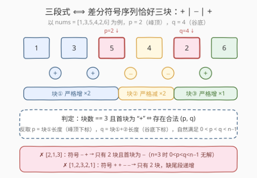
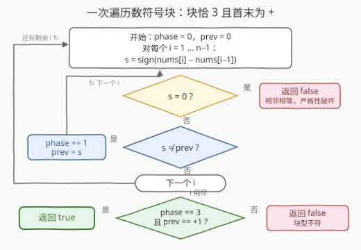

# LeetCode 三段式数组I 题解

## 1. 题目概述

- **标题 / 题号**：三段式数组I（#3637，easy）
- **链接**：https://leetcode.cn/problems/trionic-array-i/
- **难度**：简单
- **标签**：数组

**题意**：给定一个长度为 `n` 的整数数组 `nums`。如果存在索引 `0 < p < q < n − 1`，使得数组满足以下条件，则称其为**三段式数组（trionic）**：

1. `nums[0...p]` **严格**递增；
2. `nums[p...q]` **严格**递减；
3. `nums[q...n−1]` **严格**递增。

如果 `nums` 是三段式数组，返回 `true`；否则返回 `false`。

**示例 1**：

```text
输入：nums = [1,3,5,4,2,6]
输出：true
解释：选择 p = 2, q = 4：
     nums[0...2] = [1,3,5] 严格递增（1 < 3 < 5）；
     nums[2...4] = [5,4,2] 严格递减（5 > 4 > 2）；
     nums[4...5] = [2,6]   严格递增（2 < 6）。
```

**示例 2**：

```text
输入：nums = [2,1,3]
输出：false
解释：无法选出使数组满足三段式要求的 p 和 q。
```

**约束**：

- `3 <= n <= 100`
- `-1000 <= nums[i] <= 1000`

> 💡 **审题关键**：① 三段**共享端点**——段② 从 `p` 出发、段③ 从 `q` 出发，首尾相接把 `[0, n−1]` **完整覆盖**，每个相邻对恰好归属某一段；② 「严格」意味着相邻元素**不能相等**；③ `0 < p < q < n−1` 强制三段各含**至少 2 个元素**，故 `n ≥ 4`——`n = 3`（示例 2）在约束层面就无解，与数值大小无关。

## 2. 解题思路

### 2.1 暴力思路：枚举 (p, q) 双重循环逐段验证

题目提示就是 brute force：枚举所有满足 `0 < p < q < n−1` 的下标对，对每对 `(p, q)` 分别线性检查三段是否严格单调：

```python
def isTrionic(nums):
    n = len(nums)
    up   = lambda l, r: all(nums[i] < nums[i + 1] for i in range(l, r))
    down = lambda l, r: all(nums[i] > nums[i + 1] for i in range(l, r))
    return any(up(0, p) and down(p, q) and up(q, n - 1)
               for p in range(1, n - 1) for q in range(p + 1, n - 1))
```

- **正确性**：直接翻译定义，`n ≤ 100` 时最坏 $O(n^3) = 10^6$ 也能过。
- **浪费**：同一个前缀「是否严格递增」被不同 `p` 反复扫描；更本质的问题是——**峰 `p` 和谷 `q` 的位置根本不需要枚举**，它们由数组形状唯一确定（见下）。

> ⚠️ 瓶颈在于把「存在 (p, q)」当成二维搜索问题。突破口：三段共享端点 ⇒ 相邻步长恰好被切成三块 ⇒ **数块的个数与走向**即可判定。

### 2.2 核心观察：差分符号序列恰为「+ − +」三块



**观察一：三段共享端点，步长划分无缝且不重叠。** 对每个步长 `i`（比较 `nums[i]` 与 `nums[i+1]`）：

$$
\text{步 } i \in \begin{cases}\text{段①（须 }+\text{），} & i < p \\ \text{段②（须 }-\text{），} & p \le i < q \\ \text{段③（须 }+\text{），} & i \ge q\end{cases}
$$

即**每个相邻对的符号都被三段之一管辖**：相邻相等（符号为 0）无论划给哪段都违反严格性，直接 `false`；同时符号序列必然被切成「先 +、再 −、后 +」的三段连续块。

**观察二：符号块与 (p, q) 双向确定。** 把符号序列压缩成块后，三段式 ⟺ 块序列恰为

$$
\underbrace{+\cdots+}_{a\ \ge 1}\ \underbrace{-\cdots-}_{b\ \ge 1}\ \underbrace{+\cdots+}_{c\ \ge 1}
$$

- **正向**：合法 `(p, q)` 的符号块必然如上（`a = p`、`b = q − p`、`c = n − 1 − q`，三者 ≥ 1 恰好就是 `0 < p < q < n−1`）；
- **反向**：给定块长 `(a, b, c)`，反取 **`p = a`（峰顶下标）、`q = a + b`（谷底下标）**，约束自动满足。

于是「枚举 (p, q) 的二维存在性问题」坍缩为「一趟扫描数符号块」：维护块数 `phase` 与当前块符号 `prev`，终判 `phase == 3` 且末块为 `+`（三块交替时等价于首块为 `+`，一并挡住 `−+−` 型）。

**观察三：n ≥ 4 是必要条件。** 三块各至少含 1 个步长 ⇒ 至少 3 步 ⇒ `n ≥ 4`。`n = 3` 时块数最多为 2，判定天然返回 `false`，无需特判（示例 2）。

> 💡 一句话：**严格单调性把每个步长钉死成 ±1 的符号，三段式就是符号块的形状 `+−+`**——数块即可，峰谷位置免费送。

### 2.3 算法流程图



**逻辑执行步骤**：

| 步骤 | 操作 | 说明 |
|------|------|------|
| ① 初始化 | `phase = 0, prev = 0` | 已进入的符号块数 / 当前块符号 |
| ② 求符号 | `s = sign(nums[i] − nums[i−1])` | 遍历 `i = 1 … n−1` |
| ③ 严格性检查 | `s == 0` ? | 相邻相等立即返回 `false`（观察一） |
| ④ 数块 | `s != prev` 则 `phase += 1; prev = s` | 符号改变即进入新块 |
| ⑤ 终判 | `phase == 3 且 prev == +1` ? | 恰三块且首末为 `+`（观察二） |

> ⚠️ 步骤⑤的两个条件缺一不可：`phase == 3` 挡住块数错误（纯增 1 块、山脉 2 块、震荡 5 块等），`prev == +1` 挡住块数对但走向反的 `−+−` 型（如 `[3,1,2,1]`）。

### 2.4 示例演算

对 `nums = [1,3,5,4,2,6]` 逐步行走：

| i | 相邻对 | 符号 s | prev（变化前→后） | phase | 说明 |
|---|--------|--------|------------------|-------|------|
| 1 | 1→3 | +1 | 0 → +1 | 1 | 进入块①（增） |
| 2 | 3→5 | +1 | +1（不变） | 1 | 块①延续 |
| 3 | 5→4 | −1 | +1 → −1 | 2 | 块①结束，峰顶 p = 2 |
| 4 | 4→2 | −1 | −1（不变） | 2 | 块②延续 |
| 5 | 2→6 | +1 | −1 → +1 | 3 | 块②结束，谷底 q = 4 |

终态 `phase == 3` 且 `prev == +1` → 返回 `true`。✅

两个反例：
- `[2,1,3]`：符号 `− +` → 2 块且首块 − → `false`（`n = 3` 本就无解）；
- `[1,3,2,4,3,5]`：符号 `+ − + − +` → 5 块（两次振荡）→ `false`——三段式只允许**一峰一谷**。

## 3. 参考代码

### C++

```cpp
class Solution {
public:
    bool isTrionic(vector<int>& nums) {
        int phase = 0, prev = 0;                  // 符号块数 / 当前块符号
        for (int i = 1; i < (int)nums.size(); ++i) {
            int s = (nums[i] > nums[i - 1]) - (nums[i] < nums[i - 1]);
            if (s == 0) return false;             // 相邻相等：严格性破坏
            if (s != prev) {
                ++phase;                          // 符号改变，进入新块
                prev = s;
            }
        }
        return phase == 3 && prev == 1;           // 恰好 + − + 三块
    }
};
```

> 💡 **写法要点**：
> - `(a > b) - (a < b)` 是 C++ 惯用的 **signum 三态写法**，一个表达式同时覆盖 `+1/0/−1`，免掉两次比较分支。
> - 无需特判 `n == 3`：它最多产生 2 个步长、2 个符号块，`phase == 3` 天然不成立。
> - `(int)nums.size()` 防止有符号/无符号比较告警；本题循环变量用 `int` 更省心。

### Python

```python
class Solution:
    def isTrionic(self, nums: List[int]) -> bool:
        phase, prev = 0, 0
        for a, b in zip(nums, nums[1:]):
            if a == b:
                return False              # 相邻相等，严格性破坏
            s = 1 if b > a else -1
            if s != prev:
                phase += 1                # 符号改变，进入新块
                prev = s
        return phase == 3 and prev == 1   # 恰好 + − + 三块
```

> 💡 **写法要点**：
> - `zip(nums, nums[1:])` 直接拿到所有相邻对，比下标访问更 Pythonic（`nums[1:]` 切片 $O(n)$ 空间，`n ≤ 100` 无所谓；介意可 `itertools.pairwise`，Python 3.10+）。
> - 先判 `a == b` 再判大小，把「符号为 0」的出口放在最前，短路掉后续分支。
> - 返回值 `phase == 3 and prev == 1` 天然是 `bool`，无需再套 `bool(...)`。

## 4. 复杂度分析

| 维度 | 复杂度 | 说明 |
|------|--------|------|
| **时间复杂度** | $O(n)$ | 一趟扫描，每个步长 $O(1)$ 处理（求符号 + 数块） |
| **空间复杂度** | $O(1)$ | 仅 `phase` / `prev` 两个整型变量 |

> - 暴力 $O(n^3)$ 在 $n \le 100$ 下也能过（最坏 $10^6$），但 $O(n)$ 版本代码更短、且不依赖数据规模——**枚举 (p, q) 本身就是冗余**，峰谷位置由符号块唯一确定。
> - 本题是「**判定形状**」类问题的典型：一旦把序列压成差分符号流，判定就与数值大小、值域完全无关。

## 5. 扩展：从「单调」到「k 段交替」——符号块判定模板

把差分符号序列压缩成块后，「单调形状判定」一族全部退化为**块序列与目标模式的比对**：

| 判定目标 | 块模式 | 代表题 |
|----------|--------|--------|
| 单调数列 | 块数 ≤ 1 | 896 单调数列 |
| 有效山脉 | 恰 2 块：`+ −` | 941 有效的山脉数组 |
| 三段式数组 | 恰 3 块：`+ − +` | 本题 3637 |
| 湍流子数组 | 块内继续细分（逐符号交替）求最长 | 978 最长湍流子数组 |

统一模板：`块数 = 转折点数 + 1`，转折方向由首块符号与交替性唯一决定，**找峰/谷的下标 = 对应块的右端点**。

**一个值得深思的变体**：若把三处「严格」放宽为「非严格」（非降 / 非升 / 非降），一趟数块**不再充分**——全等平台可被相邻段吸收。例如 `[3,3,1,3]`：非零符号块为 `− +`（2 块），但取 `p=1, q=2`（`[3,3]` 非降、`[3,1]` 非升、`[1,3]` 非降）是真三段式。前导/尾随的全等前缀让峰谷位置不再唯一，需要允许 `s = 0` 步归入相邻块的更细致判定。「严格」条件正是让符号非零、块结构唯一的根源——审题时见到它就应条件反射地想到差分符号。

## 6. 面试要点

**Q1：从 O(n³) 暴力优化到 O(n) 的关键引理是什么？**

> 三段 `[0,p]`、`[p,q]`、`[q,n−1]` **共享端点**且首尾相接，无缝覆盖全数组 ⇒ 每个步长的符号恰好归属某一段 ⇒ 符号序列被 `p`、`q` 唯一切成 `+^a −^b +^c` 三块；反之取 `p = a`、`q = a + b` 即满足 `0 < p < q < n−1`。判定与构造互为充要，二维枚举坍缩为一趟数块。

**Q2：为什么相邻相等必须立即返回 false？**

> 每个相邻对 `(nums[i], nums[i+1])` 必属三段之一（`i < p` 归段①、`p ≤ i < q` 归段②、`i ≥ q` 归段③），而三段都要求**严格**单调——相等元素放进任何一段都违反该段的严格性，不存在「躲进缝里」的情况。

**Q3：n = 3 为何必为 false？n 最小多大才可能为 true？**

> `0 < p < q < n−1` 要求 `p ≥ 1`、`q ≥ p + 1 ≥ 2`、`q ≤ n − 2`，联立得 `n ≥ 4`。符号视角更直观：三块各至少 1 步 ⇒ 至少 3 步 ⇒ `n ≥ 4`。`n = 4` 时唯一候选 `p = 1, q = 2`，即「升、降、升」各一步，如 `[1,3,2,4]`。

**Q4：终判 `phase == 3 && prev == 1` 的两个条件各自挡掉什么反例？**

> `phase == 3` 挡块数错误：纯增 `[1,2,3]`（1 块）、山脉 `[1,3,2]`（2 块）、双峰震荡 `[1,3,2,4,3,5]`（5 块）。`prev == 1`（末块为 +，三块交替下等价于首块为 +）挡走向反的 `− + −` 型，如 `[3,1,2,1]`：块数 3 但开头是降，找不到合法 `p`。

**Q5：本题与 941 有效的山脉数组是什么关系？**

> 同一套「差分符号 → 压块 → 比对模式」模板：山脉 = 恰 2 块且模式 `+ −`（峰两侧都有元素）；三段式 = 恰 3 块且模式 `+ − +`。都是把「找转折点」转化为「数块、看走向」，块数 = 转折点数 + 1。

> 💡 **一句话总结**：3637 是「**符号流形状判定**」的入门题——严格单调 ⇒ 差分符号非 ±1 即 0，0 立毙；三段共享端点 ⇒ 符号块恰为 `+ − +` 且峰 `p`、谷 `q` 免费反推。一趟扫描、两个变量，`O(n)/O(1)` 收工。

## 同类练习题

| # | 题目 | 与本题的关联 |
|---|------|-------------|
| 941 | [有效的山脉数组](https://leetcode.cn/problems/valid-mountain-array/) | 两块版（`+ −`），本题模板砍掉尾段，先增后减即山脉 |
| 896 | [单调数列](https://leetcode.cn/problems/monotonic-array/) | 一块版，判整条符号是否同号（或含 0 即非严格），符号判定的最简形态 |
| 978 | [最长湍流子数组](https://leetcode.cn/problems/longest-turbulent-subarray/) | 符号需**逐交替**的最长子数组，块思想的滑窗进阶 |
| 2100 | [适合打劫银行的日子](https://leetcode.cn/problems/find-good-days-to-rob-the-bank/) | 前缀非增天数 + 后缀非减天数两张表定位「谷」，本题谷底 `q` 的预处理版表亲 |
| 852 | [山脉数组的峰顶索引](https://leetcode.cn/problems/peak-index-in-a-mountain-array/) | 在 `+ −` 结构上二分定位峰，本题峰顶 `p` 的查找强化版 |
