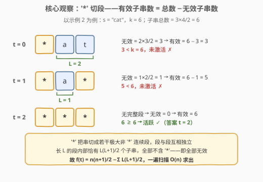
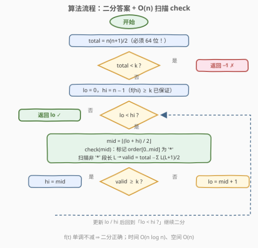

# LeetCode 变为活跃状态的最小时间 题解

## 1. 题目概述

- **标题 / 题号**：变为活跃状态的最小时间（#3639，medium）
- **链接**：https://leetcode.cn/problems/minimum-time-to-activate-string/
- **难度**：中等
- **标签**：数组、二分查找、计数

**题意**：给定长度为 $n$ 的字符串 $s$ 和整数数组 $order$（$[0, n-1]$ 内数字的一个**排列**）。从时刻 $t = 0$ 开始，每个时间点把 $s[order[t]]$ 替换为 `'*'`。

- 一个子串只要**含有至少一个** `'*'`，就称为**有效**子串；
- 当整个字符串的**有效子串总数** $\ge k$ 时，称该字符串为**活跃**的。

返回字符串**第一次**变为活跃状态的时刻 $t$；若永远无法活跃，返回 $-1$。

**示例 1**：

```text
输入：s = "abc", order = [1,0,2], k = 2
输出：0
解释：t=0 时 order[0]=1，s 变为 "a*c"。
      有效子串："*"、"a*"、"*c"、"a*c"，共 4 个 ≥ 2，立刻活跃。
```

**示例 2**：

```text
输入：s = "cat", order = [0,2,1], k = 6
输出：2
解释：t=0 → "*at"（有效 3 个）；t=1 → "*a*"（有效 5 个）；
      t=2 → "***"（全部 6 个子串都有效）→ 首次达到 6。
```

**示例 3**：

```text
输入：s = "xy", order = [0,1], k = 4
输出：-1
解释：全部替换后也只有 n(n+1)/2 = 3 个子串，永远到不了 4。
```

**约束**：

- $1 \le n = s.length \le 10^5$
- $order.length = n$，$order$ 是 $[0, n-1]$ 的排列
- $s$ 由小写英文字母组成
- $1 \le k \le 10^9$

> 💡 **审题关键**：① 时刻 $t$ 表示**已经完成了前 $t+1$ 次替换**（$order[0..t]$ 都已变成 `'*'`），所以 $t = 0$ 就可能已经活跃（示例 1）；② 子串按**位置**计数、不去重——长度 $n$ 的串共有 $\frac{n(n+1)}{2}$ 个子串；③ $k$ 可达 $10^9$，而 $\frac{n(n+1)}{2}$ 可达约 $5\times10^9$，**C++ 必须用 64 位整数**；④ $s$ 的字母内容毫无用处，本题只关心「哪些位置在何时变成 `'*'`」。

## 2. 解题思路

### 2.1 暴力思路：逐时刻枚举全部子串

最直接的做法：枚举 $t$ 从 $0$ 到 $n-1$，每个 $t$ 构造出替换后的串，再枚举全部 $O(n^2)$ 个子串、判断是否含 `'*'`（借助「`'*` 个数前缀和」可把单个子串的判定降到 $O(1)$）。总复杂度 $O(n^3)$，$n = 10^5$ 时约 $10^{15}$ 次操作，完全不可行。

> ⚠️ 更深层的问题是：逐个 $t$ **从零重算**的框架完全无视了题目的关键结构——时刻每推进一步**只是多一个 `'*'`**，有效子串数只会增加、不会减少。这个**单调性**才是突破口。

### 2.2 核心观察：单调性 ⇒ 二分答案；总数减无效 ⇒ O(n) 计数



**观察一（单调性——可以二分答案）**：设 $f(t)$ 为时刻 $t$ 的有效子串总数。从 $t$ 到 $t+1$ 只是**多替换一个字符为 `'*'`**：原先有效的子串依然有效（含星只增不减），原先无效的子串可能翻转为有效。因此 $f(t)$ 关于 $t$ **单调不减**，「最小的满足 $f(t) \ge k$ 的 $t$」是标准的**二分答案**模型。

**观察二（正难则反——总数减无效）**：直接数「含至少一个 `'*'`」的子串，需要按每个 `'*'` 的位置做容斥，边界繁琐。反过来数**无效**子串则异常干净：

> 一个子串无效 $\iff$ 它**完全落在某段「极大非 `'*'` 连续区间」内部**。

设某段长度为 $L$，其内部的子串（按位置）恰有 $\frac{L(L+1)}{2}$ 个，于是：

$$f(t) = \underbrace{\frac{n(n+1)}{2}}_{\text{全部子串}} \;-\; \sum_{\text{各极大非 '*' 段}} \frac{L_i(L_i+1)}{2}$$

一次线性扫描即可求出：把 $order[0..t]$ 标记为 `'*'`，扫一遍统计每段连续非 `'*'` 位置的长度。

**两个工程细节**：

- **提前判 $-1$**：$t = n-1$ 时全串皆 `'*'`，$f$ 达到最大值 $\frac{n(n+1)}{2}$；若它仍 $< k$ 则无解，直接返回 $-1$。这一步同时保证了二分区间内**答案必然存在**（$f(n-1) \ge k$ 恒成立），循环无需额外保护。
- **溢出**：$n = 10^5$ 时 $\frac{n(n+1)}{2} \approx 5\times10^9$，单个长段的 $\frac{L(L+1)}{2}$ 同量级，都超出 32 位有符号整数上界——C++ 里乘法必须先乘 `1LL` 提升到 `long long`。$k \le 10^9$ 本身不溢出，但比较两边要统一成 64 位。

### 2.3 算法流程图



**文字版步骤**：

| 步骤 | 操作 | 说明 |
|------|------|------|
| ① 预判 | $total \leftarrow \frac{n(n+1)}{2}$，若 $total < k$ 返回 $-1$ | 全 `'*'` 也凑不够 $k$ 个 |
| ② 初始化 | $lo = 0$，$hi = n-1$ | 不变式：$f(hi) \ge k$ |
| ③ 取中 | $mid = \lfloor (lo+hi)/2 \rfloor$ | —— |
| ④ check | 标记 $order[0..mid]$ 为 `'*'`，扫描各段长 $L$，$valid = total - \sum \frac{L(L+1)}{2}$ | $O(n)$ |
| ⑤ 收缩 | $valid \ge k$ 则 $hi = mid$，否则 $lo = mid + 1$ | 找**最小**可行 $t$ |
| ⑥ 终止 | $lo = hi$ 时返回 $lo$ | 即首个活跃时刻 |

### 2.4 示例演算：示例 2 的三个时刻

以 $s = $ `"cat"`、$order = [0,2,1]$、$k=6$ 走查（总数 $= \frac{3\times4}{2} = 6$）：

| $t$ | 替换 $order[t]$ | 串状态 | 非 `'*'` 段 | 无效数 | $f(t)$ | $\ge k=6$？ |
|-----|----------------|--------|------------|--------|--------|-------------|
| 0 | $order[0]=0$ | `*at` | `at`（$L=2$） | $\frac{2\times3}{2}=3$ | $6-3=3$ | ✗ |
| 1 | $order[1]=2$ | `*a*` | `a`（$L=1$） | $\frac{1\times2}{2}=1$ | $6-1=5$ | ✗ |
| 2 | $order[2]=1$ | `***` | 无 | $0$ | $6$ | ✓ |

$f$ 依次为 $3 \to 5 \to 6$，单调不减；首个 $\ge 6$ 的时刻是 $t=2$，即答案。

## 3. 参考代码

### C++

```cpp
class Solution {
public:
    int minTime(string s, vector<int>& order, int k) {
        int n = s.size();
        long long total = 1LL * n * (n + 1) / 2;
        if (total < k) return -1;

        vector<char> starred(n);
        auto check = [&](int t) -> bool {
            fill(starred.begin(), starred.end(), 0);
            for (int i = 0; i <= t; ++i) starred[order[i]] = 1;
            long long invalid = 0, run = 0;
            for (int i = 0; i <= n; ++i) {
                if (i < n && !starred[i]) {
                    ++run;
                } else {  // i==n 充当哨兵，顺手把最后一段结算掉
                    invalid += run * (run + 1) / 2;
                    run = 0;
                }
            }
            return total - invalid >= k;
        };

        int lo = 0, hi = n - 1;
        while (lo < hi) {
            int mid = lo + (hi - lo) / 2;
            if (check(mid)) hi = mid;
            else lo = mid + 1;
        }
        return lo;
    }
};
```

> 💡 **写法要点**：
> - `check(n-1)` 必为真（第①步已保证 $total \ge k$），二分循环天然安全；
> - 循环写成 `i <= n` 用哨兵结算尾段，免得循环外再补一行；
> - `starred` 数组在二分各轮间**复用**（每轮 `fill` 清零），避免反复分配；`run` 是 `long long`，因为单个长段的 $\frac{L(L+1)}{2}$ 可达 $5\times10^9$。

### Python

```python
class Solution:
    def minTime(self, s: str, order: List[int], k: int) -> int:
        n = len(s)
        total = n * (n + 1) // 2
        if total < k:
            return -1

        def check(t: int) -> bool:
            starred = [False] * n
            for i in range(t + 1):
                starred[order[i]] = True
            invalid = run = 0
            for c in starred:
                if not c:
                    run += 1
                else:
                    invalid += run * (run + 1) // 2
                    run = 0
            invalid += run * (run + 1) // 2   # 收尾最后一段
            return total - invalid >= k

        lo, hi = 0, n - 1
        while lo < hi:
            mid = (lo + hi) // 2
            if check(mid):
                hi = mid
            else:
                lo = mid + 1
        return lo
```

## 4. 复杂度分析

| 维度 | 复杂度 | 说明 |
|------|--------|------|
| **时间复杂度** | $O(n \log n)$ | 二分共 $O(\log n)$ 轮，每轮 `check` 线性标记 + 扫描 $O(n)$ |
| **空间复杂度** | $O(n)$ | `starred` 标记数组（跨轮复用，不随轮次增长） |

> - $n = 10^5$ 时约 $10^5 \times 17 \approx 1.7 \times 10^6$ 次基本操作，实测远低于时限；
> - 若追求理论最优可做到 $O(n)$（见第 5 节），但二分版思路最直、最好写，是面试首选。

## 5. 扩展：O(n) 逆序合并做法

把时间倒过来看：从 $t = n-1$（全 `'*'`，$f = total$）出发**往回退**，每回退一步就把位置 $order[t]$ 变回普通字符，它会与**左右相邻的非 `'*'` 段合并**成更长的段。用「段的两端各记录当前段长」的技巧，每次合并可在 $O(1)$ 内更新无效数：

$$\Delta = \frac{c(c+1)}{2} - \frac{l(l+1)}{2} - \frac{r(r+1)}{2}, \qquad c = l + r + 1$$

其中 $l, r$ 是左右邻段长度。由于 $f$ 关于 $t$ 单调不减，**回退过程中 $f$ 首次跌破 $k$ 的前一时刻就是答案**：

```python
class Solution:
    def minTime(self, s: str, order: List[int], k: int) -> int:
        n = len(s)
        total = n * (n + 1) // 2
        if total < k:
            return -1

        length = [0] * n              # 段端点处记录当前段长
        invalid = 0
        for t in range(n - 1, 0, -1):
            p = order[t]              # 回退：t-1 时刻 p 变回普通字符
            l = length[p - 1] if p > 0 else 0
            r = length[p + 1] if p < n - 1 else 0
            c = l + r + 1
            invalid += c * (c + 1) // 2 - l * (l + 1) // 2 - r * (r + 1) // 2
            length[p - l] = c         # 新段两端各记一次长度
            length[p + r] = c
            if total - invalid < k:   # f(t-1) < k ⇒ t 即最小活跃时刻
                return t
        return 0                      # 一路回退到 t=0 仍未跌破 ⇒ 答案 0
```

正确性要点：`order` 是排列，每个位置恰好回退一次；尚未回退的位置必是 `'*'`、从未进过任何段，其 `length` 恒为 0，因此取邻段长度时不会被脏数据干扰。这套「**逆时间流 + 段合并**」的套路与 [2334. 元素大于阈值的子数组](https://leetcode.cn/problems/subarray-with-elements-greater-than-varying-threshold/) 同源，值得单独掌握。

## 6. 面试要点

**Q1：为什么这题可以二分答案？**

> $f(t)$（时刻 $t$ 的有效子串数）随 $t$ 单调不减：时间每推进一步只是多一个 `'*'`，有效集合只扩不缩。「最小的 $t$ 使 $f(t) \ge k$」天然是二分模型。反之，若替换规则会**把 `'*'` 变回字母**（非单调），二分立即失效，只能另寻结构。

**Q2：有效子串数怎么 O(n) 统计？**

> 容斥：总数 $\frac{n(n+1)}{2}$ 减去无效数。无效子串 = 完全落在某个极大非 `'*'` 段内的子串，长 $L$ 的段贡献 $\frac{L(L+1)}{2}$ 个，一遍扫描统计所有段长即可。直接数「含星」要按星的位置做容斥去重，反向数「无星」边界干净得多——「正难则反」的经典体现。

**Q3：本题最容易翻车的坑是什么？**

> 溢出。$n = 10^5$ 时总数约 $5\times10^9$，超 32 位有符号上界；C++ 里 `n * (n + 1) / 2` 忘写 `1LL *` 会得到错误结果，且往往「小样例全对、大样例玄学」，极难肉眼排查。其次是时刻语义：$t$ 时刻已完成 $t+1$ 次替换，别把 $t=0$ 漏掉。

**Q4：什么时候返回 −1？如何提前判断？**

> $f$ 的上界在 $t = n-1$（全 `'*'`）取到，值为 $\frac{n(n+1)}{2}$；若它 $< k$ 则无解。先判这条还能顺带保证二分区间内答案必然存在（$f(hi) \ge k$ 恒真），循环不用任何越界保护。

**Q5：除了二分还有别的做法吗？复杂度能到多少？**

> 能到 $O(n)$：从全 `'*'` 状态逆着时间回退，每次回退把一个位置并回左右邻段，段端点记录段长即可 $O(1)$ 维护 $\sum \frac{L(L+1)}{2}$ 的增量；$f$ 首次跌破 $k$ 时，回退前的时刻即答案（见第 5 节）。这本质是把「二分的 $\log n$ 轮重复扫描」换成了「一次反向扫描的增量维护」。

## 同类练习题

| # | 题目 | 与本题的关联 |
|---|------|-------------|
| 875 | [爱吃香蕉的珂珂](https://leetcode.cn/problems/koko-eating-bananas/) | 二分答案 + O(n) check 的入门模板，与本题同框架 |
| 1011 | [在D天内送达包裹的能力](https://leetcode.cn/problems/capacity-to-ship-packages-within-d-days/) | 二分运载能力、贪心验证，check 设计的经典练习（本仓库已有题解） |
| 410 | [分割数组的最大值](https://leetcode.cn/problems/split-array-largest-sum/) | 二分「最大段和」+ 贪心划分，二分答案的困难版代表 |
| 1802 | [有界数组中指定下标处的最大值](https://leetcode.cn/problems/maximum-value-at-a-given-index-in-a-bounded-array/) | 二分一个值、数学公式 O(1)/O(log) 验证，与本题「二分 + 计数」互补 |
| 2064 | [分配给商店的最多商品的最小值](https://leetcode.cn/problems/minimized-maximum-of-products-distributed-to-any-store/) | 最小化最大值二分，check 为贪心分配，再练一遍单调性论证 |
