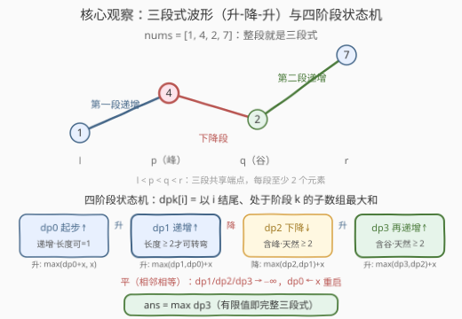
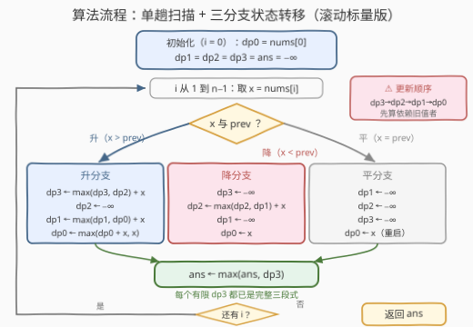

# LeetCode 三段式数组II 题解

## 1. 题目概述

- **标题 / 题号**：三段式数组II（#3640，hard）
- **链接**：https://leetcode.cn/problems/trionic-array-ii/
- **难度**：困难
- **标签**：数组、动态规划

**题意**：给你一个长度为 `n` 的整数数组 `nums`。

**三段式子数组**是一个连续子数组 `nums[l...r]`（满足 $0 \le l < r < n$），并且存在下标 $l < p < q < r$，使得：

- `nums[l...p]` **严格递增**；
- `nums[p...q]` **严格递减**；
- `nums[q...r]` **严格递增**。

请你从 `nums` 的所有三段式子数组中找出**和最大**的那个，返回其最大和。

**示例 1**：

```text
输入：nums = [0,-2,-1,-3,0,2,-1]
输出：-4
解释：选择 l = 1, p = 2, q = 3, r = 5：
  nums[1...2] = [-2,-1] 严格递增（-2 < -1）；
  nums[2...3] = [-1,-3] 严格递减（-1 > -3）；
  nums[3...5] = [-3,0,2] 严格递增（-3 < 0 < 2）。
  和 = -2 - 1 - 3 + 0 + 2 = -4。
```

**示例 2**：

```text
输入：nums = [1,4,2,7]
输出：14
解释：选择 l = 0, p = 1, q = 2, r = 3，整段即三段式：1 < 4 > 2 < 7，和 = 14。
```

**约束**：

- $4 \le n = \text{nums.length} \le 10^5$
- $-10^9 \le \text{nums}[i] \le 10^9$
- 保证至少存在一个三段式子数组。

> 💡 **审题关键**：① 子数组**连续**，且三段**共享端点**——`p` 既是第一段递增的终点也是下降段的起点，`q` 同理，每个元素只计入和一次；② $l < p < q < r$ 意味着**每段至少含 2 个元素**，整个子数组长度至少为 4；③ 「严格」单调——相邻**相等**的元素会同时切断递增与递减；④ 数组可全为负（示例 1 的答案就是 $-4$），**答案不能初始化为 0**，必须用 $-\infty$；⑤ $n \le 10^5$、$|\text{nums}[i]| \le 10^9$，和的量级达 $10^{14}$，C++ 必须用 `long long`。

## 2. 解题思路

### 2.1 暴力思路：四重循环枚举端点

最直接的做法：枚举 $l, p, q, r$ 四个下标（$l < p < q < r$），逐段检查严格单调，再借助前缀和 $O(1)$ 求和，总复杂度 $O(n^4)$。$n = 10^5$ 下连 $O(n^2)$ 都不可接受，这条路只配当对拍器。

瓶颈在于把「一个子数组的合法性」当成整体反复检查。事实上从左往右扫描时，一个子数组能否延续、能否转弯，只取决于**相邻两个元素的大小关系**（升 / 降 / 平）——这正是把问题改写成**线性状态机 DP** 的钥匙。

### 2.2 核心观察：四阶段状态机，Kadane 的「形状版」



**观察一：「以 i 结尾 + 所处阶段」= 完整状态。** 扫描到下标 $i$ 时，任何以 `nums[i]` 结尾的子数组，其「形态进度」只有四种可能。定义 $dp_k[i]$ 为以 $i$ 结尾、处于阶段 $k$ 的子数组的**最大和**：

- $dp_0$（**起步**）：第一段递增中，长度可能只有 1；
- $dp_1$（**成熟递增**）：第一段递增长度 $\ge 2$，**获得转弯资格**；
- $dp_2$（**下降**）：处于严格下降段；
- $dp_3$（**第二递增**）：处于第二段严格递增——**已是完整三段式**。

**观察二：为什么递增要拆两个状态，下降却不用？** 关键在 $l < p < q < r$ 这道闸门：第一段递增**至少 2 个元素**才有资格转下降，所以必须区分「单元素起步」（$dp_0$）与「长度 $\ge 2$」（$dp_1$），转下降只允许从 $dp_1$ 发起。而共享端点救了后两段：下降段一出生就自带「峰 + 首个下降元素」2 个元素（$p < q$ 自动满足）；第二递增段一出生就自带「谷 + 首个上升元素」2 个元素（$q < r$ 自动满足）——它们天生合法，无需再细分。

**观察三：转移只看相邻关系。** 设 $x = \text{nums}[i]$，与 $\text{nums}[i-1]$ 比较（$-\infty$ 表示该阶段不可达）：

| 相邻关系 | $dp_0[i]$ | $dp_1[i]$ | $dp_2[i]$ | $dp_3[i]$ |
|---|---|---|---|---|
| $x > \text{prev}$（升） | $\max(dp_0[i\!-\!1]+x,\ x)$ | $\max(dp_1,\,dp_0)[i\!-\!1]+x$ | $-\infty$ | $\max(dp_3,\,dp_2)[i\!-\!1]+x$ |
| $x < \text{prev}$（降） | $x$ | $-\infty$ | $\max(dp_2,\,dp_1)[i\!-\!1]+x$ | $-\infty$ |
| $x = \text{prev}$（平） | $x$ | $-\infty$ | $-\infty$ | $-\infty$ |

初值：$dp_0[0] = \text{nums}[0]$，其余为 $-\infty$。注意「升」行里 $dp_2$ 归 $-\infty$、「降」行里 $dp_3$ 归 $-\infty$——上升步不可能延续下降段，反之亦然。

**观察四：Kadane 精神——只有起步态能甩包袱。** $dp_0[i] = \max(dp_0[i-1] + x,\ x)$ 正是经典 Kadane：负前缀不如另起炉灶。而 $dp_1/dp_2/dp_3$ 必须背着完整历史，不能重新起步，但按归纳法它们天生就是各自阶段的「最大和」，直接转移即可。最终答案 $= \max_i dp_3[i]$——**每个有限的 $dp_3$ 都对应一个完整合法的三段式**，取全局最大即可。

> 💡 一句话：本题 = 「Kadane 最大子数组和」+「三段形状闸门」。把 53 题的单状态扩成四状态，把「无约束延续」改成「按升降关系在状态间迁移」。

### 2.3 算法流程图



**逻辑执行步骤**：

| 步骤 | 操作 | 说明 |
|------|------|------|
| ① 初始化 | `dp0 = nums[0]`，`dp1 = dp2 = dp3 = -∞`，`ans = -∞` | 只有起步态在 $i=0$ 可达 |
| ② 取相邻关系 | `x = nums[i]` 与 `nums[i-1]` 比较 | 升 / 降 / 平三分支 |
| ③ 升分支 | 依次执行 `dp3 ← max(dp3,dp2)+x`、`dp2 ← -∞`、`dp1 ← max(dp1,dp0)+x`、`dp0 ← max(dp0+x, x)` | **顺序固定 dp3 → dp2 → dp1 → dp0**，保证读到的都是 $i\!-\!1$ 处的旧值 |
| ④ 降分支 | 依次执行 `dp3 ← -∞`、`dp2 ← max(dp2,dp1)+x`、`dp1 ← -∞`、`dp0 ← x` | 下降段只能由成熟递增（dp1）转入或自身延续 |
| ⑤ 平分支 | `dp1 = dp2 = dp3 ← -∞`，`dp0 ← x` | 相等切断一切严格单调，起步态重启 |
| ⑥ 记录答案 | `ans = max(ans, dp3)` | 每个有限 dp3 都已是完整三段式 |
| ⑦ 循环与返回 | `i` 从 1 扫到 $n-1$，返回 `ans` | 单趟 $O(n)$，题目保证有解故无需特判 |

> ⚠️ 用滚动标量替代数组时，**更新顺序就是正确性**：`dp3` 要用旧 `dp2`，必须先算；`dp1` 要用旧 `dp0`，必须赶在 `dp0` 刷新之前。所有分支统一「dp3 → dp2 → dp1 → dp0」即可高枕无忧。

### 2.4 示例演算

**示例 1：nums = [0, −2, −1, −3, 0, 2, −1]（答案 −4）**

| $i$ | nums[i] | 相邻 | $dp_0$ | $dp_1$ | $dp_2$ | $dp_3$ | ans |
|---|---|---|---|---|---|---|---|
| 0 | 0 | — | 0 | −∞ | −∞ | −∞ | −∞ |
| 1 | −2 | 降 | −2 | −∞ | −∞ | −∞ | −∞ |
| 2 | −1 | 升 | −1 | −3 | −∞ | −∞ | −∞ |
| 3 | −3 | 降 | −3 | −∞ | −6 | −∞ | −∞ |
| 4 | 0 | 升 | **0** | −3 | −∞ | −6 | −6 |
| 5 | 2 | 升 | 2 | 2 | −∞ | **−4** | **−4** |
| 6 | −1 | 降 | −1 | −∞ | 1 | −∞ | −4 |

逐格看关键转移：$i=2$ 时 $dp_1 = dp_0[1] + (-1) = -3$（子数组 $[-2,-1]$ 晋升为成熟递增）；$i=3$ 转降得 $dp_2 = -6$（$[-2,-1,-3]$）；$i=4$、$i=5$ 连续两个升步把 $dp_3$ 推到 $-4$，对应子数组 $[-2,-1,-3,0,2]$，正是官方解释中的 $l=1, p=2, q=3, r=5$。注意 $i=4$ 的 $dp_0 = \max(-3+0,\ 0) = 0$——Kadane 甩掉负前缀重启，为 $dp_1[5] = 0 + 2 = 2$ 铺路（虽然最终未被答案采用，但机制在此生效）。

**示例 2：nums = [1, 4, 2, 7]（答案 14）**

| $i$ | nums[i] | 相邻 | $dp_0$ | $dp_1$ | $dp_2$ | $dp_3$ |
|---|---|---|---|---|---|---|
| 0 | 1 | — | 1 | −∞ | −∞ | −∞ |
| 1 | 4 | 升 | 5 | 5 | −∞ | −∞ |
| 2 | 2 | 降 | 2 | −∞ | 7 | −∞ |
| 3 | 7 | 升 | 9 | 9 | −∞ | **14** |

四步走完四个状态：$dp_3[3] = dp_2[2] + 7 = 14$，整段数组即最优。

## 3. 参考代码

### C++

```cpp
class Solution {
public:
    long long maxSumTrionic(vector<int>& nums) {
        const long long NEG = LLONG_MIN / 4;
        long long dp0 = nums[0], dp1 = NEG, dp2 = NEG, dp3 = NEG;
        long long ans = NEG;
        for (int i = 1; i < (int)nums.size(); ++i) {
            long long x = nums[i];
            if (x > nums[i - 1]) {
                dp3 = max(dp3, dp2) + x;
                dp2 = NEG;
                dp1 = max(dp1, dp0) + x;
                dp0 = max(dp0 + x, x);
            } else if (x < nums[i - 1]) {
                dp3 = NEG;
                dp2 = max(dp2, dp1) + x;
                dp1 = NEG;
                dp0 = x;
            } else {
                dp1 = dp2 = dp3 = NEG;
                dp0 = x;
            }
            ans = max(ans, dp3);
        }
        return ans;
    }
};
```

> 💡 **写法要点**：
> - 四个滚动标量替代 $4 \times n$ 数组，空间 $O(1)$；更新顺序统一 **dp3 → dp2 → dp1 → dp0**——谁依赖别人的旧值谁先算。
> - 哨兵 `NEG = LLONG_MIN / 4`：不可达态即使被反复加上 $x$ 也只在 $-2.4 \times 10^{18}$ 附近漂移，既不溢出，又永远低于任何真实和（真实和 $\ge -10^{14}$），不会污染 `ans`。
> - 返回类型是 `long long`——和的最大量级 $10^5 \times 10^9 = 10^{14}$，`int` 必溢出。

### Python

```python
class Solution:
    def maxSumTrionic(self, nums: List[int]) -> int:
        NEG = float('-inf')
        dp0, dp1, dp2, dp3 = nums[0], NEG, NEG, NEG
        ans = NEG
        for i in range(1, len(nums)):
            x = nums[i]
            if x > nums[i - 1]:
                dp3 = max(dp3, dp2) + x
                dp2 = NEG
                dp1 = max(dp1, dp0) + x
                dp0 = max(dp0 + x, x)
            elif x < nums[i - 1]:
                dp3 = NEG
                dp2 = max(dp2, dp1) + x
                dp1 = NEG
                dp0 = x
            else:
                dp1 = dp2 = dp3 = NEG
                dp0 = x
            ans = max(ans, dp3)
        return ans
```

> 💡 **写法要点**：
> - `-inf` 参与加法与 `max` 天然安全（`-inf + x = -inf`），不必像 C++ 那样操心哨兵漂移。
> - 题目保证存在三段式子数组，`ans` 必然被某个有限 `dp3` 刷新，无需无解特判。
> - 若要输出方案（$l,p,q,r$）：给每个状态加一个前驱下标，结束时从最大的 `dp3` 回溯即可——状态机 DP 的标准加件。

## 4. 复杂度分析

| 维度 | 复杂度 | 说明 |
|------|--------|------|
| **时间复杂度** | $O(n)$ | 每个下标只做一次相邻比较 + 常数次转移 |
| **空间复杂度** | $O(1)$ | 四个滚动标量；若开数组则为 $O(n)$，可滚动优化掉 |

> - 对比暴力 $O(n^4)$：状态机把「子数组合法性」压缩进 $O(1)$ 个阶段，是所有「形状约束子数组」问题的通用降维手段。
> - 与 53 题 Kadane 同构：单状态（无形状约束）$\to$ 四状态（三段形状），扫描框架一模一样。

## 5. 扩展：三段式家族与「形状约束 DP」

**判定版：3637 三段式数组 I（Easy）。** I 代问「**整条**数组是否三段式」（返回布尔），$n \le 100$。只需定位唯一的峰与谷：从左找第一个 `nums[i] >= nums[i+1]` 的位置作为峰 $p$（须 $p > 0$），再找其后第一个 `nums[i] <= nums[i+1]` 的位置作为谷 $q$（须 $p < q < n-1$），最后验证尾段严格递增。II 代把「整条」放宽为「任取连续子数组」、把「判定」升级为「最优化」——难度跳到 Hard 的本质，正是从「一次线性验证」变成「$10^5$ 规模上的最优化」。

**变体一：最长三段式子数组（长度版）。** 把转移里的 `+ x` 全部换成 `+ 1`、$dp_0$ 重启值换成 $1$，答案仍是 $\max dp_3$——「和」与「长度」共享同一台状态机，只差一个计量函数。

**变体二：段数无上限——978 最长湍流子数组。** 升降交替不设段数上限时，只需「以上升结尾 / 以下降结尾」两个状态互相转移，`dp` 记长度。本题可视为「恰三段、首尾皆升」的**有界**湍流。

**变体三：段数减一——845 数组中的最长山脉。** 先增后减两段式，即本题砍掉最后的递增段，且目标换成最长长度。「段数 × 计量目标」两个维度一组合，这一族题就全齐了。

**负数陷阱的一般化。** 凡「最大和 + 可能全负」的组合（53 最大子数组和、918 环形子数组的最大和、本题），答案初值必须取 $-\infty$ 而非 0——这是 Kadane 家族最高频的 WA 点，本题示例 1 特意用近乎全负的数组踩这个坑。

## 6. 面试要点

**Q1：为什么递增段要拆成 dp0 / dp1 两个状态，下降段和第二递增段却各用一个？**

> 因为三段共享端点。第一段递增从单元素起步，必须长到 2 才满足 $l < p$、获得转弯资格，所以要「起步态 / 成熟态」分开管理；而下降段一出生就自带「峰 + 首个下降元素」两个元素（$p < q$ 自动成立），第二递增段一出生就自带「谷 + 首个上升元素」两个元素（$q < r$ 自动成立）——后两段天生合法，无需细分。状态数 = 1（起步）+ 3（三段）= 4。

**Q2：相邻相等（`nums[i] == nums[i-1]`）时为什么把 dp1/dp2/dp3 全部清成 −∞？**

> 「严格」递增与严格递减都容不下相等：任何进行中的段在相等步处断裂、无法延续。清空后只有 `dp0 = nums[i]` 重新起步。漏掉这个分支是常见 bug——相等元素既不算升也不算降，三条转移都不能走。

**Q3：为什么答案不能初始化为 0？**

> 数组可以近乎全负（示例 1），此时最优三段式的和是负数（−4）。初值取 0 会错误地「免费」甩掉所有负子数组、返回 0。应初始化为 $-\infty$；又因题目保证存在三段式子数组，无需无解特判。同理，Kadane 转移 `dp0 = max(dp0 + x, x)` 里「重启」取的是 `x` 而不是 0。

**Q4：滚动变量实现时，更新顺序为什么必须是 dp3 → dp2 → dp1 → dp0？**

> `dp3` 依赖旧 `dp2`，`dp1` 依赖旧 `dp0`——被依赖者必须先刷新。若先更新 `dp0` 再算 `dp1`，`dp1` 会误用本行新值，等于凭空跳过一个元素。开二维数组天然按行隔离，滚动优化后「顺序即正确性」；统一按编号从大到小更新可彻底避开这个坑。

**Q5：这个状态机和 53 题 Kadane、978 湍流是什么关系？**

> 同属「形状约束下的最大子数组」家族：53 无形状（1 状态），978 升降交替无界（2 状态），本题恰三段（4 状态）。统一框架：以 $i$ 结尾、处于阶段 $k$ 的最优值，按相邻元素关系在阶段间迁移。掌握这台「状态机生成器」，任何「先…后…再…」的形状约束都能现场拼出 DP。

> 💡 **一句话总结**：3640 = Kadane + 四阶段状态机。带走的三个细节：起步态与成熟态之间的闸门（$l < p$）、相等元素清空一切、答案初值取 $-\infty$。

## 同类练习题

| # | 题目 | 与本题的关联 |
|---|------|-------------|
| 3637 | [三段式数组 I](https://leetcode.cn/problems/trionic-array-i/) | 本题的判定版（整条数组是否三段式），体会「线性验证」与「最优化 DP」的难度差 |
| 53 | [最大子数组和](https://leetcode.cn/problems/maximum-subarray/) | 单状态 Kadane，`dp0 = max(dp0 + x, x)` 的源头 |
| 978 | [最长湍流子数组](https://leetcode.cn/problems/longest-turbulent-subarray/) | 升降交替且段数无上限的状态机 DP，把「和」换成「长度」 |
| 845 | [数组中的最长山脉](https://leetcode.cn/problems/longest-mountain-in-array/) | 两段式（先增后减）最长子数组，相当于本题砍掉最后一段递增 |
| 376 | [摆动序列](https://leetcode.cn/problems/wiggle-subsequence/) | 摆动形状下的最长**子序列**（可跳过元素），对比「子序列贪心」与「子数组 DP」的分野 |
