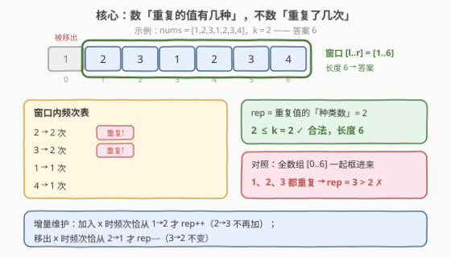
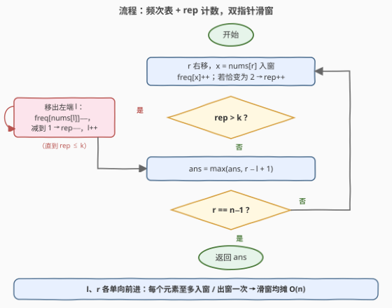

# 最长半重复子数组

- **题目名称**：最长半重复子数组
- **链接**：[3641. 最长半重复子数组](https://leetcode.cn/problems/longest-semi-repeating-subarray/)
- **难度**：中等
- **标签**：数组、哈希表、滑动窗口

## 1. 题目概述

> ⚠️ 本题为 LeetCode 付费题（Plus 会员专享），题意描述根据官方示例用例与 hints 重建，可能与官方题面有出入。

**题意**：给定一个整数数组 $nums$ 和一个整数 $k$。如果某个子数组中「**出现次数超过 1 的不同元素**」至多有 $k$ 个，就称它是**半重复**（semi-repeating）子数组。返回**最长**半重复子数组的长度。

**示例 1**：

```text
输入：nums = [1,2,3,1,2,3,4], k = 2
输出：6
解释：子数组 [2,3,1,2,3,4] 中出现 ≥ 2 次的元素只有 2 和 3，共 2 个 ≤ k；
     而整个数组中 1、2、3 都出现了两次，重复元素有 3 个 > k，不合法。
```

**示例 2**：

```text
输入：nums = [1,1,1,1,1], k = 4
输出：5
解释：整个数组只有值 1 这一个元素重复出现，1 ≤ 4，整段合法。
```

**示例 3**：

```text
输入：nums = [1,1,1,1,1], k = 0
输出：1
解释：任何长度 ≥ 2 的子数组里值 1 都出现 ≥ 2 次，rep = 1 > 0；
     单元素子数组没有重复元素，答案为 1。
```

**约束条件**（官方约束未公开，按同类题推测）：

- $1 \le nums.length \le 10^5$
- $1 \le nums[i] \le 10^9$
- $0 \le k \le nums.length$

> 💡 **审题关键**：① $k$ 限制的是「**重复的值有几种**」——值 $1$ 出现 $5$ 次也只占 $1$ 种，不是「重复的总次数」，两种读法答案不同（见面试要点 Q4）；② 子数组必须**连续**；③ $k = 0$ 时问题退化为「最长全互异子数组」，即第 3 题「无重复字符的最长子串」的数组版。

---

## 2. 解题思路

### 2.1 暴力思路：枚举所有子数组

枚举全部 $O(n^2)$ 个子数组 $[i, j]$，对每个子数组用哈希表统计频次、数出有多少个值出现 $\ge 2$ 次，再判断是否 $\le k$——单次判定 $O(n)$，总计 $O(n^3)$。即使固定左端、右端逐步扩张时增量维护频次（每个新元素 $O(1)$ 更新），也仍有 $O(n^2)$ 个候选窗口，$n = 10^5$ 时约 $10^{10}$ 次基本操作，依然超时。但暴力已经暴露了问题的关键结构：**合法性只取决于窗口内「频次 $\ge 2$ 的值的个数」这一个标量**。

### 2.2 核心观察：rep 的单调性 → 滑动窗口



记 $\text{rep}(i, j)$ 为子数组 $[i, j]$ 内出现次数 $\ge 2$ 的**不同值个数**，合法性即 $\text{rep} \le k$。三条观察：

**观察一（扩张只会让 rep 变坏）**：固定左端 $i$、右端 $j$ 右移时，窗口内每个值的频次只增不减。某值频次从 1 跨到 2 的瞬间被计入 rep，此后频次继续涨（$2 \to 3 \to \cdots$）rep 不再变化；已计入的值永远不会因扩张退出。因此 $\text{rep}(i, j)$ **关于 $j$ 单调不减**。

**观察二（合法左端是后缀且单调）**：对称地，$\text{rep}(i, j)$ 关于 $i$ 单调递减（窗口越小频次越低）。于是对每个右端 $r$，合法左端构成一段**后缀** $[l_{\min}(r),\, r]$；且 $r$ 增大时判据只会更难满足，$l_{\min}(r)$ 单调不减——**双指针**条件齐备。

**观察三（rep 可 $O(1)$ 增量维护）**：频次跨越临界值 2 的瞬间只有两处：

$$\text{加入 } x \text{ 时若 } freq[x] \text{ 从 } 1 \to 2\text{，则 } rep{+}{+}；\qquad \text{移出 } x \text{ 时若 } freq[x] \text{ 从 } 2 \to 1\text{，则 } rep{-}{-}$$

频次从 $2 \to 3$、$3 \to 2$ 都不影响 rep（该值早已计入 / 尚未计入）。配一张频次哈希表，rep 的维护是 $O(1)$ 的。

三合一：**右端驱动扩张、rep 超标时收缩左端、每步记录窗口长度**，就是标准的「求最长合法窗口」滑动窗口。

### 2.3 算法流程图



**文字版步骤**：

| 步骤 | 操作 | 说明 |
|------|------|------|
| ① 初始化 | $l = 0$，$rep = 0$，$ans = 0$，空频次表 | 窗口 $[l, r]$ 初始为空 |
| ② 扩张 | $r$ 从左到右：$freq[nums[r]]{+}{+}$，若恰好变为 2 则 $rep{+}{+}$ | 新值入窗，只有「首次重复」影响 rep |
| ③ 收缩 | 当 $rep > k$：$freq[nums[l]]{-}{-}$，若减到 1 则 $rep{-}{-}$，$l{+}{+}$ | 循环吐出左端直到重新合法 |
| ④ 记录 | $ans = \max(ans,\ r - l + 1)$ | 此时窗口必然合法 |
| ⑤ 汇总 | 返回 $ans$ | $n \ge 1$ 时 $ans \ge 1$ |

**为什么均摊 $O(n)$**：$r$ 每轮前进 1 步共 $n$ 步；$l$ 只在收缩循环里前进且从不回退，全程至多 $n$ 步。每个元素至多入窗、出窗各一次。

### 2.4 示例演算：nums = [1,2,3,1,2,3,4], k = 2

| $r$ | $nums[r]$ | 入窗变化 | 收缩动作 | 窗口 | $rep$ | $ans$ |
|-----|-----------|----------|----------|------|-------|-------|
| 0 | 1 | $1{:}0{\to}1$ | — | $[1]$ | 0 | 1 |
| 1 | 2 | $2{:}0{\to}1$ | — | $[1,2]$ | 0 | 2 |
| 2 | 3 | $3{:}0{\to}1$ | — | $[1,2,3]$ | 0 | 3 |
| 3 | 1 | $1{:}1{\to}2$，rep=1 | — | $[1,2,3,1]$ | 1 | 4 |
| 4 | 2 | $2{:}1{\to}2$，rep=2 | — | $[1,2,3,1,2]$ | 2 | 5 |
| 5 | 3 | $3{:}1{\to}2$，rep=3 越界 | 移出左端 1：$1{:}2{\to}1$，rep=2 | $[2,3,1,2,3]$ | 2 | 5 |
| 6 | 4 | $4{:}0{\to}1$ | — | $[2,3,1,2,3,4]$ | 2 | **6** |

**答案 6**：$r = 5$ 时第三个重复值 3 入窗使 rep 越界，左端吐出一个 1 后恰好回到 rep = 2；$r = 6$ 补进的 4 不重复，窗口撑到长度 6。

> 💡 示例 2（$k=4$）：唯一的值 1 无论频次涨到多少，rep 始终为 $1 \le 4$，窗口一路扩张到 $n$，答案 5。示例 3（$k=0$）：任何 $r \ge 1$ 都触发收缩，且要收缩到 $l = r$（单元素 rep = 0）才停，答案 1。

---

## 3. 参考代码

### C++

```cpp
class Solution {
public:
    int longestSemiRepeatingSubarray(vector<int>& nums, int k) {
        int n = nums.size();
        unordered_map<int, int> freq;   // 窗口内每个值的出现次数
        int rep = 0, ans = 0;           // rep: 出现 >= 2 次的不同值个数
        for (int l = 0, r = 0; r < n; r++) {
            if (++freq[nums[r]] == 2) rep++;          // 频次恰跨过 2
            while (rep > k) {                          // 越界则收缩左端
                if (--freq[nums[l++]] == 1) rep--;    // 频次恰跌回 1
            }
            ans = max(ans, r - l + 1);
        }
        return ans;
    }
};
```

> 💡 **写法要点**：
> - **`++freq[x] == 2` / `--freq[x] == 1`** 是整段代码的灵魂：只在频次恰好跨越 2 的瞬间增减 rep，其余情况 $O(1)$ 空过。
> - **`nums[l++]`** 把「取左端值、吐出、前移」合并成一句；注意先减频次再与 1 比较。
> - **`while` 不会越界**：收缩到 $l = r$（窗口只剩单个元素）时 $rep = 0 \le k$（$k \ge 0$），循环必然停住。

### Python

```python
class Solution:
    def longestSemiRepeatingSubarray(self, nums: List[int], k: int) -> int:
        freq = defaultdict(int)
        rep = 0
        ans = l = 0
        for r, x in enumerate(nums):
            freq[x] += 1
            if freq[x] == 2:            # 首次重复，计入一个种类
                rep += 1
            while rep > k:              # 种类数超限，吐出左端
                y = nums[l]
                freq[y] -= 1
                if freq[y] == 1:        # 该值恰好不再重复
                    rep -= 1
                l += 1
            ans = max(ans, r - l + 1)
        return ans
```

> Python 用 `defaultdict(int)` 免去判存在；`enumerate` 直接拿值，避免 `nums[r]` 重复下标。

---

## 4. 复杂度分析

| 维度 | 复杂度 | 说明 |
|------|--------|------|
| **时间复杂度** | $O(n)$ | $r$ 前进 $n$ 步；$l$ 单向前进至多 $n$ 步（均摊）。每个元素入窗、出窗各至多一次 |
| **空间复杂度** | $O(n)$ | 频次哈希表至多存 $n$ 个不同值；其余只用常数个指针 / 计数器 |

> - `unordered_map` 单次操作均摊 $O(1)$ 但常数偏大；值域可控时可换普通数组提速（见面试要点 Q5）。
> - 与暴力的 $O(n^3)$ / $O(n^2)$ 相比，单调性把「对每个右端重新找左端」的重复劳动全部摊销掉了。

---

## 5. 扩展：换个计数口径，骨架不变

本题家族的滑窗判据都是「窗口内某个统计量 $\le k$」，差别只在统计量的**口径**：

- **[340. 至多包含 K 个不同字符的最长子串](https://leetcode.cn/problems/longest-substring-with-most-k-distinct-characters/)**：统计量 = 窗口内**不同值的个数**（加入新值时 $+1$，某值频次减到 0 时 $-1$）。
- **本题**：统计量 = 窗口内**频次 $\ge 2$ 的不同值个数**（频次跨越 2 时 $\pm 1$）。
- **若题意改成「重复出现的总次数 $\sum_v (freq_v - 1) \le k$」**：统计量改为「加入已存在的值时 $+1$，移出后频次仍 $\ge 1$ 时 $-1$」，滑窗骨架一字不改——先认清口径再动笔，是这类题的第一步。
- **若改问「有多少个合法子数组」**：对每个 $r$ 累加合法左端个数 $r - l_{\min}(r) + 1$，仍是同一套双指针，只是把「取 max」换成「求和」。

---

## 6. 面试要点

**Q1：为什么可以滑动窗口？单调性具体指什么？**

> 固定左端 $i$、右移 $j$，窗口内频次只增不减：值频次跨过 2 时 rep $+1$，此后只涨不跌，已计入的种类永远不会退出——所以 $\text{rep}(i,j)$ 关于 $j$ 单调不减；对称地关于 $i$ 单调递减。于是「合法 $\iff rep \le k$」随窗口扩张单调变坏：对每个 $r$ 存在最小合法左端 $l_{\min}(r)$，且 $l_{\min}$ 单调不减。两个指针都单向前进，均摊 $O(n)$。

**Q2：rep 增量维护的关键时机是什么？为什么 2→3 不用管？**

> rep 数的是「频次 $\ge 2$ 的**值**」这个集合的大小。某值频次从 $1 \to 2$ 时它**入集**（rep++），从 $2 \to 1$ 时**出集**（rep−−）；频次 $2 \to 3$、$3 \to 2$ 时它始终在集内，集合大小不变。所以只需在两个「跨越临界」的瞬间更新，其余操作 $O(1)$ 空过——这保证了滑窗整体线性。

**Q3：k = 0 时本题退化成什么？**

> 「频次 $\ge 2$ 的值个数 $\le 0$」$\iff$ 窗口内所有值互不相同 $\iff$ 最长全互异子数组，即第 3 题「无重复字符的最长子串」的数组版。第 3 题的标准解法（遇到重复就收缩左端直到重复消除）就是本题 $k=0$、rep 退化为布尔判断的特例——把经典题推广出参数 $k$，也是面试官常用的追问方向。

**Q4：「重复值种类数 ≤ k」和「重复总次数 ≤ k」答案一样吗？**

> 不一样。$[1,1,1,1]$ 中值 1 频次 4：种类口径贡献 1，次数口径贡献 3。取 $k=1$：前者整段 $[1,1,1,1]$ 合法（长度 4），后者最长只能取长度 2。本题按**种类数**口径理解（与官方 hints「count of elements with freq &gt; 1」一致）。两种口径的滑窗代码只差两处判断条件，读题时必须先确认口径。

**Q5：unordered_map 之外还有什么提速手段？**

> 若值域有界（如 $nums[i] \le 10^5$）直接开 `int cnt[]` 数组，省掉哈希常数，实测快数倍；值域大但可离散化时先排序 + `unique` + 二分映射再开数组，预处理 $O(n \log n)$ 换取窗口操作纯 $O(1)$。本题不需要有序性，`unordered_map` 足矣，不必上 `map`（红黑树每次 $O(\log n)$ 反而更慢）。

---

## 7. 同类练习题

- [3. 无重复字符的最长子串](https://leetcode.cn/problems/longest-substring-without-repeating-characters/)：本题 $k = 0$ 的特例，滑窗 + 哈希的入门经典
- [2730. 找到最长半重复子字符串](https://leetcode.cn/problems/find-the-longest-semi-repetitive-substring/)：名字最像的亲戚题，「半重复」定义为至多一对相邻相等字符，无需频次表
- [904. 水果成篮](https://leetcode.cn/problems/fruit-into-baskets/)：频次表 + 「窗口内不同值数 ≤ 2」求最长子数组，另一种计数口径
- [424. 替换后的最长重复字符](https://leetcode.cn/problems/longest-repeating-character-replacement/)：频次表维护窗口状态求最长窗口的进阶款
- [340. 至多包含 K 个不同字符的最长子串](https://leetcode.cn/problems/longest-substring-with-most-k-distinct-characters/)：付费题，「不同值数 ≤ k」与本题「重复值数 ≤ k」互为镜像，建议对照着写
