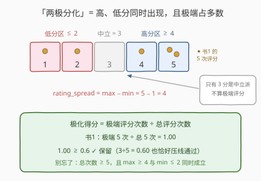
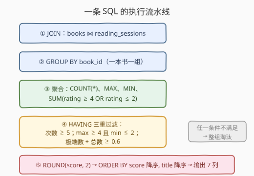

# 查找有两极分化观点的书籍

- **题目名称**：查找有两极分化观点的书籍
- **链接**：[3642. 查找有两极分化观点的书籍](https://leetcode.cn/problems/find-books-with-polarized-opinions/)
- **难度**：中等
- **标签**：数据库、SQL、`GROUP BY`、聚合函数、`HAVING`、条件聚合、`ROUND`、pandas

## 1. 题目概述

给定 `books`（书籍信息）与 `reading_sessions`（阅读事件，含 1–5 分评分）两张表，找出**观点两极分化**的书籍并输出其极化统计。

**表结构**：

```text
表：books
+-------------+---------+
| Column Name | Type    |
+-------------+---------+
| book_id     | int     |  ← 主键
| title       | varchar |
| author      | varchar |
| genre       | varchar |
| pages       | int     |
+-------------+---------+

表：reading_sessions
+----------------+---------+
| Column Name    | Type    |
+----------------+---------+
| session_id     | int     |  ← 主键
| book_id        | int     |
| reader_name    | varchar |
| pages_read     | int     |
| session_rating | int     |  ← 1 到 5
+----------------+---------+
```

**判定规则**（一本书同时满足以下全部条件才算「两极分化」）：

1. **高低分并存**：至少一个评分 $\geq 4$ **且** 至少一个评分 $\leq 2$；
2. **样本量足够**：阅读事件数 $\geq 5$；
3. **极端占比够高**：极化得分 = 极端评分（$\le 2$ 或 $\ge 4$）次数 $\div$ 总评分次数 $\geq 0.6$。

**输出**：书籍 5 列 + `rating_spread`（= 最高分 − 最低分）+ `polarization_score`（四舍五入到 2 位小数），按**极化得分降序**、再按**标题降序**排序。

**示例 1**：

```text
输入：
books 表:
+---------+------------------------+---------------+-----------+-------+
| book_id | title                  | author        | genre     | pages |
+---------+------------------------+---------------+-----------+-------+
| 1       | The Great Gatsby       | F. Scott      | Fiction   | 180   |
| 2       | To Kill a Mockingbird  | Harper Lee    | Fiction   | 281   |
| 3       | 1984                   | George Orwell | Dystopian | 328   |
| 4       | Pride and Prejudice    | Jane Austen   | Romance   | 432   |
| 5       | The Catcher in the Rye | J.D. Salinger | Fiction   | 277   |
+---------+------------------------+---------------+-----------+-------+

reading_sessions 表（评分摘要）:
book 1 → 5,1,4,2,5   book 2 → 4,4,5,4,4
book 3 → 2,1,2,1,4,5 book 4 → 3,3       book 5 → 1,2

输出：
+---------+------------------+---------------+-----------+-------+---------------+--------------------+
| book_id | title            | author        | genre     | pages | rating_spread | polarization_score |
+---------+------------------+---------------+-----------+-------+---------------+--------------------+
| 1       | The Great Gatsby | F. Scott      | Fiction   | 180   | 4             | 1.00               |
| 3       | 1984             | George Orwell | Dystopian | 328   | 4             | 1.00               |
+---------+------------------+---------------+-----------+-------+---------------+--------------------+
解释：
- 书 1：5 次事件（≥5），max=5 ≥ 4 且 min=1 ≤ 2，极端 5/5 = 1.00 ≥ 0.6 ✓
- 书 3：6 次事件，max=5 且 min=1，极端 6/6 = 1.00 ✓
- 书 2：全是 4~5 分，没有 ≤2 的低分（高低分不并存）✗
- 书 4、书 5：只有 2 次事件（< 5）✗
- 得分同为 1.00，按 title 降序："The Great Gatsby" > "1984"，故书 1 在前。
```

> 💡 **审题关键**：① 极端评分 = $\le 2$ **或** $\ge 4$，恰好只有 `3` 分不算极端；② 极化得分是**比值**，分子分母都以「阅读事件」计数，不涉及读者去重；③ 过滤条件写 `HAVING`（对聚合结果过滤），不能写 `WHERE`；④ 过滤用**未舍入**的原始比值，`ROUND` 只作用于最终展示。

---

## 2. 解题思路

### 2.1 暴力思路：应用层逐书扫描

把两张表全读出来，在应用层对每本书开一个桶：

```text
for session in reading_sessions:
    bucket[session.book_id].append(session.session_rating)
for book, ratings in bucket.items():
    if len(ratings) >= 5 and max(ratings) >= 4 and min(ratings) <= 2 \
       and (extreme_cnt / len(ratings)) >= 0.6:
        emit(book, spread=max-min, score=round(ratio, 2))
```

逻辑正确，但把**过滤、聚合、排序**全搬到应用层——SQL 的 `GROUP BY + HAVING` 正是为「按组统计再筛组」而生，一条查询即可全部下推到引擎完成。

### 2.2 核心观察：一次分组聚合即可拿到全部判据



五个判定量全部是**每本书一组**的聚合值，一个 `GROUP BY` 就能同时产出：

| 题意要求 | SQL 聚合表达 | 说明 |
|----------|--------------|------|
| 至少一个评分 $\geq 4$ | `MAX(rating) >= 4` | 组内最大值达标 ⇔ 至少一个高分 |
| 至少一个评分 $\leq 2$ | `MIN(rating) <= 2` | 组内最小值达标 ⇔ 至少一个低分 |
| 事件数 $\geq 5$ | `COUNT(*) >= 5` | 组大小 |
| `rating_spread` | `MAX(rating) - MIN(rating)` | 组内极差 |
| 极化得分 $\geq 0.6$ | `SUM(极端) / COUNT(*) >= 0.6` | 条件聚合算分子 |

两个关键技巧：

- **`MAX`/`MIN` 巧判「至少存在一个」**：「组内存在满足条件的行」⇔「按该条件变换后的组内极值达标」。`MAX(rating) >= 4` 等价于「存在 rating ≥ 4」，避免了子查询或自连接。
- **布尔条件直接求和**：MySQL 中比较/逻辑表达式返回 `1`/`0`，所以 `SUM(rating >= 4 OR rating <= 2)` 就是极端评分次数——条件聚合的最简写法（跨库稳妥版写 `SUM(CASE WHEN ... THEN 1 ELSE 0 END)`）。

> ⚠️ **过滤用原始值，展示才 `ROUND`**：`HAVING` 里用未舍入的比值 `SUM(...) / COUNT(*) >= 0.6` 判断，`ROUND(..., 2)` 只放在 `SELECT` 里格式化输出。若先用 `ROUND` 再比较，会把 $0.596 \to 0.60$ 这类**原始不达标、舍入后达标**的边界书错误放进结果。

> ⚠️ **`WHERE` 与 `HAVING` 别混用**：`COUNT`/`MAX`/`MIN`/`SUM` 都是组级统计，对**组**的过滤必须写 `HAVING`；`WHERE` 在分组前逐行生效，写不了聚合条件。另外 MySQL 中 `GROUP BY book_id` 已足矣（`book_id` 是 `books` 主键，其余列函数依赖于此，MySQL 5.7+ 默认 `ONLY_FULL_GROUP_BY` 下合法），再补全列只是兼容其他数据库的习惯写法。

### 2.3 算法流程



**逻辑执行步骤**：

| 步骤 | 子句 | 作用 |
|------|------|------|
| ① | `FROM books JOIN reading_sessions` | 以 `book_id` 关联，把书的信息挂到每次评分上 |
| ② | `GROUP BY book_id` | 一本书一组 |
| ③ | 聚合统计 | 每组算出 `COUNT(*)`、`MAX`、`MIN`、`SUM(极端)` |
| ④ | `HAVING` | 三重过滤：次数 ≥ 5、高低分并存、比值 ≥ 0.6 |
| ⑤ | `SELECT` + `ORDER BY` | 算 `spread`、`ROUND` 得分，按得分降序、标题降序输出 |

### 2.4 示例演算

对示例 1 的 5 本书逐组聚合（`extreme` = $\le 2$ 或 $\ge 4$ 的次数）：

| book | 评分 | 次数 | max | min | extreme | spread | 原始得分 | 判定 |
|------|------|------|-----|-----|---------|--------|----------|------|
| 1 | 5,1,4,2,5 | 5 | 5 | 1 | 5 | 4 | 5/5 = 1.00 | ✓ 保留 |
| 2 | 4,4,5,4,4 | 5 | 5 | 4 | 5 | 1 | 5/5 = 1.00 | ✗ min=4 > 2，无低分 |
| 3 | 2,1,2,1,4,5 | 6 | 5 | 1 | 6 | 4 | 6/6 = 1.00 | ✓ 保留 |
| 4 | 3,3 | 2 | 3 | 3 | 0 | 0 | — | ✗ 次数 < 5 |
| 5 | 1,2 | 2 | 2 | 1 | 2 | 1 | — | ✗ 次数 < 5 |

- 书 2 最能说明「高低分并存」这关：极端得分高达 1.00、事件数也够，但**清一色好评没有差评**，照样淘汰——两极分化必须"两头都有人"。
- 书 4 的评分全是 3：连一次极端评分都没有，若样本量够也会被比值 $\geq 0.6$ 与 `min ≤ 2` 双重拦下。
- 排序：书 1、书 3 得分并列 1.00，按 `title` **降序** `"The Great Gatsby" > "1984"`，故书 1 在前。

---

## 3. 参考代码

### SQL（MySQL）

```sql
SELECT b.book_id,
       b.title,
       b.author,
       b.genre,
       b.pages,
       MAX(r.session_rating) - MIN(r.session_rating) AS rating_spread,
       ROUND(SUM(r.session_rating >= 4 OR r.session_rating <= 2) / COUNT(*), 2) AS polarization_score
FROM books AS b
JOIN reading_sessions AS r
  ON r.book_id = b.book_id
GROUP BY b.book_id, b.title, b.author, b.genre, b.pages
HAVING COUNT(*) >= 5
   AND MAX(r.session_rating) >= 4
   AND MIN(r.session_rating) <= 2
   AND SUM(r.session_rating >= 4 OR r.session_rating <= 2) / COUNT(*) >= 0.6
ORDER BY polarization_score DESC,
         b.title DESC;
```

> 💡 **写法要点**：
> - **`MAX/MIN` 当「存在量词」**：`MAX(rating) >= 4` ⇔ 至少一个高分；`MIN(rating) <= 2` ⇔ 至少一个低分，免子查询。
> - **布尔求和**：MySQL 里 `SUM(cond)` 把真/假当 1/0 累加，即条件计数；跨库（PostgreSQL/SQLite 等）更稳妥的写法是 `SUM(CASE WHEN r.session_rating >= 4 OR r.session_rating <= 2 THEN 1 ELSE 0 END)`。
> - **除法语义**：MySQL 的 `/` 恒为小数除（整除是 `DIV`），`SUM(...) / COUNT(*)` 天然得小数比值；SQLite 等语言需乘 `1.0` 强制转浮点再除。
> - **`HAVING` 用原始比值过滤，`ROUND` 只管展示**，避免 $0.596 \to 0.60$ 的边界误收（见 2.2 的 ⚠️）。
> - **排序**：`ORDER BY polarization_score DESC, title DESC`——两键都要 `DESC`，别顺手把第二键写成升序。

### Python（pandas）

```python
import pandas as pd

def find_polarized_books(books: pd.DataFrame, reading_sessions: pd.DataFrame) -> pd.DataFrame:
    g = reading_sessions.groupby('book_id')['session_rating']
    stats = pd.DataFrame({
        'total': g.size(),
        'max_rating': g.max(),
        'min_rating': g.min(),
        'extreme_cnt': g.apply(lambda s: ((s >= 4) | (s <= 2)).sum()),
    }).reset_index()
    stats['rating_spread'] = stats['max_rating'] - stats['min_rating']
    stats['polarization_score'] = (stats['extreme_cnt'] / stats['total']).round(2)

    res = stats[
        (stats['total'] >= 5)
        & (stats['max_rating'] >= 4)
        & (stats['min_rating'] <= 2)
        & (stats['extreme_cnt'] / stats['total'] >= 0.6)
    ]
    res = books.merge(res, on='book_id')
    res = res.sort_values(['polarization_score', 'title'], ascending=[False, False])
    return res[['book_id', 'title', 'author', 'genre', 'pages',
                'rating_spread', 'polarization_score']]
```

> 💡 **pandas 对照**：
> - `groupby('book_id')` 一次产出 `size/max/min` 与条件计数（`.apply` 内布尔掩码求和），对应 SQL 的 `GROUP BY + 聚合`。
> - **过滤掩码用未舍入比值**（`extreme_cnt / total`），`.round(2)` 只加在展示列上——与 SQL 侧同一原则。
> - `ascending=[False, False]` 对应 `ORDER BY score DESC, title DESC` 两键降序。

---

## 4. 复杂度分析

| 维度 | 复杂度 | 说明 |
|------|--------|------|
| **时间** | $O(m + n\log n)$ | JOIN 与分组聚合 $O(m)$（$m$ = 阅读事件数）；排序 $O(n \log n)$（$n$ = 留存书籍数） |
| **空间** | $O(m + n)$ | JOIN 中间结果 + 每书一组的聚合状态与输出行 |
| **对比暴力法** | 应用层扫描同为 $O(m)$，但单条 SQL 消除往返 | 引擎内一次扫描完成聚合，过滤后仅返回少量结果行 |

> - $m$ = `reading_sessions` 行数（每行恰属一组，聚合是线性桶累计）；$n$ = 通过过滤的书籍数（通常远小于书籍总数）。
> - 若 `reading_sessions.book_id` 上有索引，JOIN 可走索引，仍是线性级别；本题数据规模下无瓶颈。

---

## 5. 扩展：「组内存在满足条件的行」的三种等价写法

本题「至少一个 $\geq 4$ 且至少一个 $\le 2$」是**存在性判定**，以下三种写法等价，按可移植性与可读性取舍：

| 写法 | 示例 | 特点 |
|------|------|------|
| **极值判定** | `MAX(rating) >= 4 AND MIN(rating) <= 2` | 最简洁；把「存在」转成「极值达标」，各库通用 |
| **条件计数** | `SUM(rating >= 4) > 0 AND SUM(rating <= 2) > 0` | MySQL 布尔求和直观；跨库换 `SUM(CASE WHEN ... THEN 1 ELSE 0 END)` |
| **条件行数** | `COUNT(CASE WHEN rating >= 4 THEN 1 END) >= 1` | 标准写法；`COUNT` 忽略 `NULL`，不写 `ELSE` 即只数命中行 |

> 💡 反例提醒：用 `WHERE session_rating >= 4 OR session_rating <= 2` 先过滤再分组是**错的**——那会把组内非极端行（3 分）整行删掉，导致 `COUNT(*)` 少数、比值失真。极端与否只影响**分子**，不能动**分母**所在行。

---

## 6. 面试要点

1. **为什么过滤条件写 `HAVING` 而不是 `WHERE`？**

   > `WHERE` 在 `GROUP BY` 之前逐行生效，此时组还没形成，写不了 `COUNT(*)/MAX/MIN` 这类聚合；`HAVING` 作用于**分组之后**的每组结果。规则口诀：条件涉及聚合函数 → `HAVING`；条件只涉及单行原始列 → `WHERE`（如本题 `JOIN ... ON r.book_id = b.book_id`）。

2. **「至少一个高分且至少一个低分」怎么用一个 `GROUP BY` 判定？**

   > 存在性转极值：`MAX(rating) >= 4` ⇔ 组内存在 ≥4 的评分，`MIN(rating) <= 2` ⇔ 存在 ≤2 的评分。等价写法还有 `SUM(cond) > 0` / `COUNT(CASE WHEN cond THEN 1 END) >= 1`（见第 5 节）。千万别在分组前用 `WHERE rating >= 4 OR rating <= 2` 预过滤——会删掉 3 分行，弄丢分母。

3. **极化得分的 `ROUND` 应该放在过滤里还是展示里？**

   > 展示里。`HAVING` 用原始比值 `SUM(...) / COUNT(*) >= 0.6` 判定，`SELECT` 里才 `ROUND(..., 2)`。若先用 `ROUND` 再比较，$0.596$ 会被舍成 $0.60$ 而误入结果，$0.604$ 类边界同理引发歧义。这是所有「比值型过滤 + 保留两位小数」题的通用陷阱。

4. **`SUM(rating >= 4 OR rating <= 2)` 为什么能当计数用？MySQL 外呢？**

   > MySQL 中比较/逻辑表达式的返回值就是 `1`/`0`，`SUM` 累加即条件计数。但这是 MySQL（及部分库）的便利特性；**标准 SQL** 更稳妥的写法是 `SUM(CASE WHEN rating >= 4 OR rating <= 2 THEN 1 ELSE 0 END)`，PostgreSQL/Oracle/SQLite 通用无歧义。

5. **双键排序 `ORDER BY polarization_score DESC, title DESC` 容易错在哪？**

   > 两个键都是**降序**，第二键 `title` 常被顺手写成升序。示例里书 1 与书 3 得分并列 1.00，靠 `title` 降序（`"The Great Gatsby" > "1984"`）才决定先后。另外 `ORDER BY` 可引用 `SELECT` 别名 `polarization_score`（MySQL 支持），不必重写整个 `ROUND` 表达式。

> 💡 **一句话总结**：3642 是**分组聚合 + 多条件 `HAVING` 过滤**的综合练习——`MAX/MIN` 当存在量词、`SUM(布尔)` 做条件计数、原始比值过滤、`ROUND` 只管展示、双键降序收尾。最大陷阱：分组前预过滤极端评分弄丢分母、用舍入值做判定、第二排序键忘了 `DESC`。

---

## 7. 同类练习题

- [1050. 合作过至少三次的演员和导演](https://leetcode.cn/problems/actors-and-directors-who-cooperated-at-least-three-times/)（[题解](../1001-1100/1050_合作过至少三次的演员和导演.md)）：`GROUP BY + HAVING COUNT(*) >= 3`，与本题「事件数 ≥ 5」同款组级计数过滤
- [550. 游戏玩法分析IV](https://leetcode.cn/problems/game-play-analysis-iv/)（[题解](../0501-0600/550_游戏玩法分析IV.md)）：条件比值（首次登录次日回流率）过滤，与极化得分「分子分母同表计数」同套路
- [1211. 查询结果的质量和占比](https://leetcode.cn/problems/queries-quality-and-percentage/)（[题解](../1201-1300/1211_查询结果的质量和占比.md)）：`ROUND + AVG + SUM(cond)/COUNT(*)`，与 `polarization_score` 的计算与保留两位小数同款
- [586. 订单最多的客户](https://leetcode.cn/problems/customer-placing-the-largest-number-of-orders/)（[题解](../0501-0600/586_订单最多的客户.md)）：分组计数后按聚合值排序取最值，与本题 `ORDER BY polarization_score DESC` 的排序环节互为对照
