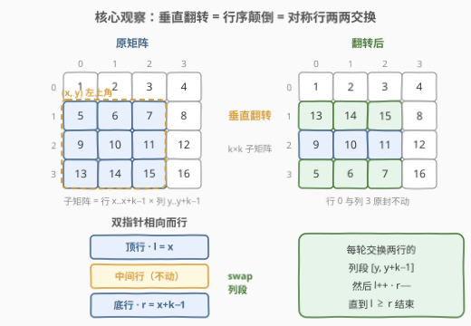
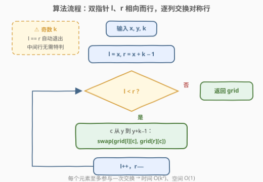

# 垂直翻转子矩阵

- **题目名称**：垂直翻转子矩阵
- **链接**：[3643. 垂直翻转子矩阵](https://leetcode.cn/problems/flip-square-submatrix-vertically/)
- **难度**：简单
- **标签**：数组、双指针、矩阵

## 1. 题目概述

给你一个 `m x n` 的整数矩阵 `grid`，以及三个整数 `x`、`y` 和 `k`。

整数 `x` 和 `y` 表示一个**正方形子矩阵**的左上角下标，整数 `k` 表示该正方形子矩阵的边长。

你的任务是**垂直翻转子矩阵的行顺序**（上下颠倒）。返回更新后的矩阵。

**示例 1**：

```text
输入：grid = [[1,2,3,4],[5,6,7,8],[9,10,11,12],[13,14,15,16]], x = 1, y = 0, k = 3
输出：[[1,2,3,4],[13,14,15,8],[9,10,11,12],[5,6,7,16]]
解释：子矩阵为行 1..3、列 0..2 的 3×3 区域。垂直翻转后，
     第 1 行与第 3 行（的子矩阵部分）互换，中间行与子矩阵外的元素不变。
```

**示例 2**：

```text
输入：grid = [[3,4,2,3],[2,3,4,2]], x = 0, y = 2, k = 2
输出：[[3,4,4,2],[2,3,2,3]]
解释：子矩阵为行 0..1、列 2..3 的 2×2 区域。垂直翻转即两行的列段互换，
     列 0..1 原封不动。
```

**约束条件**：

- `m == grid.length`，`n == grid[i].length`
- $1 \le m, n \le 50$
- $1 \le \text{grid}[i][j] \le 100$
- $0 \le x < m$，$0 \le y < n$
- $1 \le k \le \min(m - x,\ n - y)$

> 💡 **审题关键**：① 「垂直翻转」是**行序上下颠倒**（第 $t$ 行 ↔ 第 $k-1-t$ 行，沿水平中轴镜像），不是左右镜像（水平翻转），更不是旋转；② 动的只有**子矩阵内部** $k^2$ 个元素——行 $\lt x$、行 $\ge x+k$、以及每行列区间 $[y, y+k)$ 之外的元素一律不碰（示例 2 的列 0..1 就原样保留）；③ 约束 $k \le \min(m-x,\ n-y)$ 保证子矩阵完整落在矩阵内，**无需任何越界防御**；④ 「返回更新后的矩阵」——原地修改 `grid` 后直接返回即可。

---

## 2. 解题思路

### 2.1 暴力思路：另开矩阵按映射搬运

最朴素的做法：新建一个同样大小的矩阵 `ans`，对子矩阵内的每个位置 $(i, j)$，把它搬到 $\big(x + (x + k - 1) - i,\ j\big)$——即行号关于子矩阵的**水平中轴**做镜像映射 $i' = 2x + k - 1 - i$，列号不变；子矩阵外的位置原样复制。

正确性没问题，但要付出 $O(mn)$ 的额外空间，且「复制整个矩阵」与「只动子矩阵」的题意背道而驰。稍加改进可以只暂存 $k$ 行的列段再倒序写回，空间降到 $O(k)$——但其实**连这点辅助空间都不需要**。

### 2.2 核心观察：翻转 = 对称行两两交换



**观察一：「行序颠倒」可以拆成一串对换。** 垂直翻转后，子矩阵第 $t$ 行（自上而下）的内容来自原来的第 $k-1-t$ 行。这是一个**对合置换**（翻转两次还原），而任何对合置换都能分解为「不动点 + 两两对换」：让指针 $l$ 从子矩阵顶行 $x$ 出发、$r$ 从底行 $x+k-1$ 出发，交换这两行，然后 $l{+}{+},\ r{-}{-}$ 相向而行——每对对称行恰好交换一次，$l \ge r$ 时结束。

**观察二：交换的对象是「行内的列段」，不是整行。** 子矩阵未必占满整行（示例 2 中 $y = 2$，列 0..1 在子矩阵之外），所以每次对换是：

$$\text{swap}\big(\text{grid}[l][c],\ \text{grid}[r][c]\big), \quad c = y,\ y+1,\ \ldots,\ y+k-1$$

**观察三：奇数 $k$ 的中间行是天然不动点。** 当 $l = r$ 时两指针指向同一行，`while (l < r)` 的循环条件直接为假、退出循环，中间行无需任何特判——「不动点」被循环条件免费处理了。

**观察四：原地、一遍、每个元素至多动一次。** 整个过程只做值交换，空间 $O(1)$；$k^2$ 个元素中除可能的中间行外每个都恰好参与一次交换，时间 $O(k^2)$ 已是信息论下界（每个非不动点元素都必须被写一次）。

> 💡 一句话：垂直翻转 = 「关于水平中轴的镜像」，镜像置换 = 对称行两两 swap——双指针 $l/r$ 相向而行就是它的机械实现。

### 2.3 算法流程图



**逻辑执行步骤**：

| 步骤 | 操作 | 说明 |
|------|------|------|
| ① 初始化 | `l = x`，`r = x + k − 1` | 双指针分别指向子矩阵顶行与底行 |
| ② 循环判断 | `l < r` ？ | 相等（奇数 k 的中间行）或交叉则结束 |
| ③ 列段对换 | `for c in [y, y+k−1]: swap(grid[l][c], grid[r][c])` | 交换的是两行的同一列段，**不是整行** |
| ④ 指针推进 | `l++`，`r−−` | 相向而行，向水平中轴靠拢 |
| ⑤ 返回 | 原地修改完毕，返回 `grid` | 无需额外矩阵 |

> ⚠️ 最常见的 WA 是把「列段交换」写成「整行交换」——当 $y > 0$ 或 $y + k < n$ 时会把子矩阵外的元素也卷进交换。示例 2（$y = 2$，$n = 4$）就是专治这个 bug 的用例。

### 2.4 示例演算

**示例 1：grid 为 4×4，x = 1, y = 0, k = 3**（子矩阵占行 1..3、列 0..2）

| 轮次 | l | r | 动作 | 子矩阵状态（行 1..3 × 列 0..2） |
|------|---|---|------|--------------------------------|
| 初始 | — | — | — | [5,6,7] / [9,10,11] / [13,14,15] |
| 第 1 轮 | 1 | 3 | 交换行 1 与行 3 的列段 | [13,14,15] / [9,10,11] / [5,6,7] |
| — | 2 | 2 | `l < r` 不成立，结束 | 中间行 2 从未被动过 |

矩阵变为 `[[1,2,3,4],[13,14,15,8],[9,10,11,12],[5,6,7,16]]`，与期望输出一致——行 0 和列 3 全程旁观。

**示例 2：grid 为 2×4，x = 0, y = 2, k = 2**（子矩阵占行 0..1、列 2..3）

| 轮次 | l | r | 动作 | 矩阵状态 |
|------|---|---|------|----------|
| 初始 | — | — | — | [[3,4,(2,3)],[2,3,(4,2)]]，括号内为子矩阵 |
| 第 1 轮 | 0 | 1 | 交换行 0 与行 1 的列 2..3 | [[3,4,(4,2)],[2,3,(2,3)]] |
| — | 1 | 0 | `l < r` 不成立，结束 | 列 0..1 自始至终未动 |

---

## 3. 参考代码

### C++

```cpp
class Solution {
public:
    vector<vector<int>> reverseSubmatrix(vector<vector<int>>& grid, int x, int y, int k) {
        int l = x, r = x + k - 1;
        while (l < r) {
            for (int c = y; c < y + k; ++c) {
                swap(grid[l][c], grid[r][c]);
            }
            ++l;
            --r;
        }
        return grid;
    }
};
```

> 💡 **写法要点**：
> - `while (l < r)` 自动处理奇数 k 的中间行——`l == r` 时不进循环，无需特判。
> - 交换严格限制在列段 `[y, y + k)` 内，子矩阵外的元素零接触。
> - 原地修改，直接返回 `grid`，不新建矩阵。

### Python

```python
class Solution:
    def reverseSubmatrix(self, grid: List[List[int]], x: int, y: int, k: int) -> List[List[int]]:
        l, r = x, x + k - 1
        while l < r:
            for c in range(y, y + k):
                grid[l][c], grid[r][c] = grid[r][c], grid[l][c]
            l += 1
            r -= 1
        return grid
```

> 💡 **写法要点**：
> - 逐列交换与 C++ 版一一对应；更 Pythonic 的整段切片写法见第 5 节扩展。
> - `l, r = x, x + k - 1` 元组解包初始化，`l += 1, r -= 1` 同步推进。

---

## 4. 复杂度分析

| 维度 | 复杂度 | 说明 |
|------|--------|------|
| **时间复杂度** | $O(k^2)$ | 指针对共 $\lfloor k/2 \rfloor$ 对，每对交换 $k$ 个列位置；子矩阵内每个元素至多参与一次交换 |
| **空间复杂度** | $O(1)$ | 原地交换，只用 $l, r, c$ 三个下标变量（不计返回值本身） |

> - 对比「另开矩阵搬运」的 $O(mn)$ 时间与空间：原地对换把两者同时压缩——子矩阵外的元素根本不扫描。
> - $O(k^2)$ 是这类「显式重排」问题的下界：除不动点外每个元素都必须至少被写一次。

---

## 5. 扩展：水平翻转、旋转与 Pythonic 写法

**变体一：水平翻转子矩阵（左右镜像）。** 行不变、列序颠倒：令 `lc = y, rc = y + k − 1` 双指针在列维度相向而行，每次对行段 $[x, x+k)$ 内的每个行下标 $i$ 交换 `grid[i][lc]` 与 `grid[i][rc]`，随后 `lc++, rc−−`。同一个「对合置换 = 对称元素两两 swap」模板，换个轴而已。

**变体二：Python 切片一行流。** 逐列交换在 Python 里可以整段完成：

```python
class Solution:
    def reverseSubmatrix(self, grid: List[List[int]], x: int, y: int, k: int) -> List[List[int]]:
        l, r = x, x + k - 1
        while l < r:
            grid[l][y:y+k], grid[r][y:y+k] = grid[r][y:y+k], grid[l][y:y+k]
            l += 1
            r -= 1
        return grid
```

`a, b = b, a` 的多元赋值先求值右边再绑定，两段切片互不干扰。也可以对行维度做 `grid[x:x+k][::-1]` 式的思路，但那要处理「行内只有一段属于子矩阵」的拼接，反而不如双指针直观。

**变体三：翻转家族的「组合技」。** 48 题 90° 旋转 = 转置 + 水平翻转；832 题翻转图像 = 每行水平翻转 + 按位取反。垂直/水平翻转是矩阵变换的「原子操作」，旋转、双镜像都是它们的复合——掌握本题的双指针对换模板，这一族题就都有了机械解法。

---

## 6. 面试要点

**Q1：「垂直翻转」具体翻转什么？和水平翻转、180° 翻转怎么区分？**

> 垂直翻转 = 行序上下颠倒（沿**水平中轴**镜像）：第 $t$ 行与第 $k-1-t$ 行互换，行内元素顺序不变。水平翻转 = 沿竖直中轴镜像、左右颠倒；180° = 两者复合。面试时先口述「行序颠倒」再动手，避免把示例 2 这类只有两行的用例做成列交换。

**Q2：为什么交换的是列段 [y, y+k) 而不是整行？**

> 子矩阵由 `(x, y, k)` 三元组共同框定：行方向约束 $[x, x+k)$，列方向约束 $[y, y+k)$。当 $y > 0$ 或 $y + k < n$ 时子矩阵只占行的一段（示例 2 即是），整行 swap 会把区间外的元素错误卷入。「段意识」是所有子矩阵操作题的第一道坎。

**Q3：k 为奇数时中间行为什么不用特判？**

> 中间行 $x + \lfloor k/2 \rfloor$ 在镜像映射下映到自身，是不动点。双指针写法中该行对应 $l = r$ 的时刻，`while (l < r)` 条件恰好为假、循环退出——不动点被循环条件「免费」处理，这正是双指针比手工枚举 $\lfloor k/2 \rfloor$ 轮更稳的地方。

**Q4：循环条件用 l < r 还是 l <= r？有区别吗？**

> 行为等价：`l == r` 时循环体即便执行也只是「自己和自己交换」（无副作用），所以 `<=` 不会出错，只是白跑一轮 $k$ 次自交换。习惯上用 `<` 明确表达「只剩不动点时收工」。真正不能错的是方向——$l$ 只增、$r$ 只减，写反会死循环。

**Q5：这道简单题能考出什么区分度？**

> 表面是模拟题，实际考点全在**不变量思维**：子矩阵外元素零接触（可作断言自检）、每个元素至多动一次（复杂度下界）、奇数 k 的中间行不动（边界）。面试中主动说出「我会用子矩阵外的元素是否不变来做局部测试」这类验证思路，比 AC 本身更加分。

> 💡 **一句话总结**：垂直翻转 = 对称行两两 swap，双指针相向而行即可原地 $O(k^2)$ 完成。带走的三个细节：交换的是列段不是整行、`l < r` 免费处理中间行、子矩阵外元素零接触。

---

## 7. 同类练习题

- [48. 旋转图像](https://leetcode.cn/problems/rotate-image/)：原地 90° 旋转 = 转置 + 水平翻转，同为「原地矩阵变换」模板题
- [832. 翻转图像](https://leetcode.cn/problems/flipping-an-image/)：每行水平翻转 + 按位取反，对比「水平翻转」与本题「垂直翻转」
- [867. 转置矩阵](https://leetcode.cn/problems/transpose-matrix/)：行变列的基本变换，非方阵时必须开新矩阵——体会「原地」的前提
- [73. 矩阵置零](https://leetcode.cn/problems/set-matrix-zeroes/)：原地标记 + 首行首列做哨兵，练习矩阵下标的精细操控
- [304. 二维区域和检索 - 矩阵不可变](https://leetcode.cn/problems/range-sum-query-2d-immutable/)：同样以下标区间刻画子矩阵，考察前缀和而非变换
