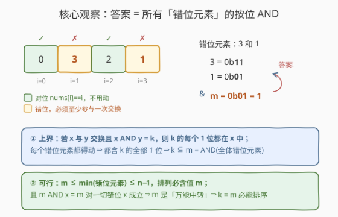
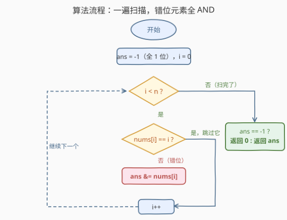

# LeetCode 排序排列 题解

## 1. 题目概述

- **标题 / 题号**：排序排列（#3644，medium）
- **链接**：https://leetcode.cn/problems/maximum-k-to-sort-a-permutation/
- **难度**：中等
- **标签**：位运算、数组

**题意**：给定长度为 $n$ 的数组 $nums$，它是 $[0..n-1]$ 内所有数字的一个**排列**。你可以交换下标 $i$ 和 $j$ 处的元素，前提是两处**元素值**满足 $nums[i] \,\&\, nums[j] = k$（按位与恰好等于 $k$），$k$ 是一个**事先选定的非负整数**，所有交换共用同一个 $k$。返回能让数组排成非递减顺序的**最大** $k$；若数组已有序，返回 $0$。

**示例 1**：

```text
输入：nums = [0,3,2,1]
输出：1
解释：k = 1 时，nums[1] = 3 和 nums[3] = 1 满足 3 & 1 == 1，交换后得到 [0,1,2,3]。
```

**示例 2**：

```text
输入：nums = [0,1,3,2]
输出：2
解释：k = 2 时，nums[2] = 3 和 nums[3] = 2 满足 3 & 2 == 2，交换后得到 [0,1,2,3]。
```

**示例 3**：

```text
输入：nums = [3,2,1,0]
输出：0
解释：错位元素为 3、2、1、0，其 AND 为 0，只有 k = 0 才能完成排序。
```

**约束**：

- $1 \le n = nums.length \le 10^5$
- $0 \le nums[i] \le n - 1$
- $nums$ 是 $0$ 到 $n-1$ 的一个排列

> 💡 **审题关键**：①「排列排成非递减」就是让每个 $nums[i] = i$，目标形态唯一；② 交换条件只看两个**位置的元素值**，与下标无关；③ $k$ 是全局唯一的，先定 $k$ 再做任意多次交换——问的是「最大可行 $k$」，是**判定问题 + 求极值**，而不是构造交换序列；④ $n \le 10^5 < 2^{17}$，所有值至多 17 个二进制位。

## 2. 解题思路

### 2.1 暴力思路：枚举 k 逐个判定

最直接的想法：从小到大枚举 $k \in [0, n)$，对每个 $k$ 判定「能否排好」。判定本身并不简单：合法交换在**值**的层面连边（$x$ 与 $y$ 有边当且仅当 $x \,\&\, y = k$），错位元素能否全部归位取决于这张交换图的连通结构，模拟或图判定的单次代价至少 $O(n)$，总复杂度 $O(n^2) \approx 10^{10}$，必然超时。这条路走不通的根源是**方向反了**——不该问「哪个 $k$ 行」，而该问「$k$ 必须满足什么条件」。

### 2.2 核心观察：答案 = 错位元素的按位与



设错位元素集合 $S = \{\, nums[i] : nums[i] \ne i \,\}$，记

$$m = \bigwedge_{x \in S} x \quad (\text{全体错位元素的按位与})$$

**观察一（每个错位元素都必须动）**：$nums[i] \ne i$ 的元素不可能凭空回家，它至少要参与一次交换。

**观察二（上界 $k \subseteq m$）**：若值 $x$ 参与了某次交换（与 $y$ 交换且 $x \,\&\, y = k$），则 $k$ 的每一个二进制位都是 $x$ 与 $y$ 的**公共位**，自然都在 $x$ 中。于是**每个错位元素都包含 $k$ 的全部 1 位**，即 $k$ 的位集是 $S$ 中所有元素位集的子集，$k \,\&\, m = k$，数值上 $k \le m$。

**观察三（$k = m$ 恰好可行——万能中转站）**：由 AND 的性质，$m \le \min(S) \le n-1$；而 $nums$ 是排列、含 $0..n-1$ 的每个值，所以**值 $m$ 一定在数组里**。任何错位元素 $x$ 的位集都包含 $m$ 的位集（它们 AND 出了 $m$），于是

$$m \,\&\, x = m \quad (\forall x \in S)$$

即 $m$ 可以和**任何**错位元素直接交换。借助 $m$ 做三次中转，可以实现任意两个错位元素 $a, b$ 的互换（$m$ 最终回到原位）：

```text
初始位置：  P1=a   P2=b   P3=m
swap(P1,P3)：m&a=m ✓  →  m   b   a
swap(P1,P2)：m&b=m ✓  →  b   m   a
swap(P2,P3)：m&a=m ✓  →  b   a   m
```

三步全部是与 $m$ 交换，条件恒成立。任意两个错位元素都能互换 $\Rightarrow$ 错位元素可以被重排成任何顺序 $\Rightarrow$ 一定可以全部归位、完成排序。

**结论**：$ans = m = \text{AND}(S)$；若 $S$ 为空（数组已有序），返回 $0$。

> 💡 **特例 $m = 0$**：上面的论证依然成立（$0$ 与任何数 AND 都是 $0$，$0$ 就是万能中转）。示例 3 中 $0$ 虽在对位仍可被借去中转，用完送回即可。
>
> ⚠️ 注意交换条件是「**恰好等于** $k$」而非「包含 $k$」——两个错位元素 $a \,\&\, b$ 可能严格大于 $m$ 而无法直接交换，这正是必须借助中转站 $m$ 的原因，也是本题最容易被忽略的一步。

### 2.3 算法流程图：一遍扫描



| 步骤 | 操作 | 说明 |
|------|------|------|
| ① 初始化 | `ans = -1` | $-1$ 的补码全 1，是 AND 的恒等元：$-1 \,\&\, x = x$ |
| ② 扫描 | 对每个 $i$：若 $nums[i] \ne i$ 则 `ans &= nums[i]` | 只累乘错位元素 |
| ③ 汇总 | `ans == -1`（无错位）返回 $0$，否则返回 `ans` | $-1$ 兼作「已有序」标记 |

一次遍历、一个累加变量，没有任何排序或建图。**能不能排序**这个看似复杂的判定问题，被两条证明（上界 + 构造）压缩成了 $O(n)$ 的计数式扫描。

### 2.4 示例演算

| 输入 | 错位元素 $S$ | 逐个 AND | 答案 |
|------|--------------|----------|------|
| `[0,3,2,1]` | $\{3, 1\}$ | $-1 \,\&\, 3 = 3$，$3 \,\&\, 1 = 1$ | $1$ |
| `[0,1,3,2]` | $\{3, 2\}$ | $3 \,\&\, 2 = 2$ | $2$ |
| `[3,2,1,0]` | $\{3,2,1,0\}$ | $3\,\&\,2=2$，$2\,\&\,1=0$，后续恒 $0$ | $0$ |
| `[0,1,2,3]` | $\varnothing$ | `ans` 保持 $-1$ | $0$ |

## 3. 参考代码

### C++

```cpp
class Solution {
public:
    int sortPermutation(vector<int>& nums) {
        int ans = -1;                       // 全 1 位，AND 恒等元
        for (int i = 0; i < (int)nums.size(); i++) {
            if (nums[i] != i) ans &= nums[i];
        }
        return ans < 0 ? 0 : ans;           // -1 表示已有序
    }
};
```

> 💡 **写法要点**：`ans` 初值用 $-1$ 一举两得——既是 AND 的单位元，又是「数组已有序」的哨兵；返回前 `ans < 0` 判断即可，无需额外标志位。

### Python

```python
class Solution:
    def sortPermutation(self, nums: List[int]) -> int:
        ans = -1
        for i, x in enumerate(nums):
            if x != i:
                ans &= x
        return max(ans, 0)
```

## 4. 复杂度分析

| 维度 | 复杂度 | 说明 |
|------|--------|------|
| **时间复杂度** | $O(n)$ | 单趟扫描，每个元素一次比较、至多一次 AND |
| **空间复杂度** | $O(1)$ | 只用一个整型累加变量 |

> $n = 10^5$ 时约 $10^5$ 次位运算，远低于任何限制；本题的难度全在证明，不在实现。

## 5. 扩展：可行 k 的完整刻画

把 2.2 的两条证明拼起来，可以得到比「求最大值」更强的结论：

$$k \text{ 可行} \iff k \,\&\, m = k \quad (\text{即 } k \text{ 的位集是 } m \text{ 的位集的子集})$$

**必要性（上界）**：错位元素都必须参与交换，故 $k$ 的位集被每个错位元素包含，$k \subseteq m$。**充分性（构造）**：对任何满足 $k \subseteq m$ 的 $k$，有 $k \le m \le n-1$，值 $k$ 必在数组中，且 $k \,\&\, x = k$ 对一切错位元素 $x$ 成立（$k$ 的位都在 $x$ 中），用 $k$ 自己当中转站即可完成排序。因此：

- **可行 $k$ 恰好是 $m$ 的全部子位集**（二进制意义下的子集），共 $2^{\mathrm{popcount}(m)}$ 个；
- 最大可行 $k$ 就是 $m$ 本身，即本题答案。

若面试中题目变形为「给定 $k$，问能否排序」，判定条件同样是 $k \subseteq m$，一次 AND 比较即可——这说明本题的证明是双向充要的，而不只是单侧的界。

## 6. 面试要点

**Q1：为什么答案是错位元素的按位与？一句话说清两条证明。**

> 上界：错位元素必须参与交换，而 $x \,\&\, y = k$ 要求 $k$ 的每个 1 位都在 $x$ 中，故 $k$ 被所有错位元素的公共位集（即 $m$）包含。构造：$m \le n-1$ 故值 $m$ 必在排列中，且 $m$ 与任何错位元素 AND 都等于 $m$，用 $m$ 做三次中转交换可实现任意两个错位元素互换，从而排序必成。两边夹住，答案就是 $m$。

**Q2：值 $m$ 一定在数组中，这一步为什么关键？如果 $m$ 不在会怎样？**

> 排列包含 $0..n-1$ 的每个值，而 $m = \text{AND}(S) \le \min(S) \le n-1$，所以 $m$ 必在数组里（无论它自身对位与否）。这是构造「万能中转站」的前提——没有这个值，$k = m$ 未必可行，题目就不再有如此干净的答案。

**Q3：交换条件是「恰好等于 $k$」，不是「包含 $k$」，构造为什么不受影响？**

> 构造中的每一次交换都发生在中转站与某个错位元素之间：$m \,\&\, x = m$ 是**恒等**而非包含，天然满足「恰好等于」。两个错位元素之间从不直接交换（它们的 AND 可能严格大于 $m$），三次中转恰好绕开了这一点。

**Q4：边界情况有哪些？**

> ① 数组已有序：$S$ 为空，`ans` 保持 $-1$，返回 0（题目显式要求）；② $m = 0$：论证不变，0 与任何数 AND 为 0，0 本身就是中转站（示例 3）；③ $n = 1$：必然有序，返回 0，无需特判。

**Q5：为什么不能反过来「枚举 k 再判定可行性」？**

> 单次判定需要在值层面建交换图并分析错位元素的归位连通性，至少 $O(n)$，总复杂度 $O(n^2)$ 超时；更重要的是判定逻辑本身很难写对。本题的启发是：求「最大可行参数」时，先推导参数必须满足的**必要条件**（上界），再验证取到边界值时**充分可行**（构造），往往能把搜索问题变成一遍扫描。

## 同类练习题

| # | 题目 | 与本题的关联 |
|---|------|-------------|
| 201 | [数字范围按位与](https://leetcode.cn/problems/bitwise-and-of-numbers-range/) | 区间连乘 AND 的公共位提取，与本题「AND 只会不断收窄位集」一脉相承 |
| 2419 | [按位与最大的最长子数组](https://leetcode.cn/problems/longest-subarray-with-maximum-bitwise-and/) | 利用 AND 单调不增的性质避免枚举子数组 |
| 898 | [子数组按位或](https://leetcode.cn/problems/bitwise-ors-of-subarrays/) | 位集累积只有 $O(\log U)$ 种取值，位运算扫描类经典 |
| 41 | [缺失的第一个正数](https://leetcode.cn/problems/first-missing-positive/) | 值与下标的置换环原地归位，对照本题「每个元素回到 $i$」的目标形态 |
| 287 | [寻找重复数](https://leetcode.cn/problems/find-the-duplicate-number/) | 把值当下标成环分析置换结构，训练「值↔位置」双视角 |
