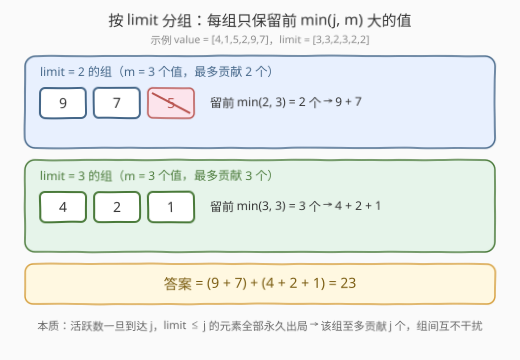
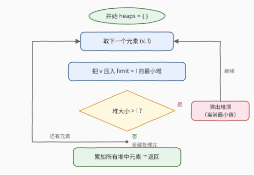

# 最优激活顺序得到的最大总和

- **题目名称**：最优激活顺序得到的最大总和
- **链接**：[3645. 最优激活顺序得到的最大总和](https://leetcode.cn/problems/maximum-total-from-optimal-activation-order/)
- **难度**：中等
- **标签**：贪心、数组、堆（优先队列）、排序

## 1. 题目概述

**题意**：给定两个长度为 $n$ 的整数数组 $value$ 和 $limit$。初始时所有元素都是**非活跃**的，你可以按任意顺序激活它们：

- 要激活一个非活跃元素 $i$，**当前**活跃元素的数量必须**严格小于** $limit[i]$；
- 激活元素 $i$ 时，$value[i]$ 被累加进**总和**（只增不减，之后被清除也不退账）；
- 每次激活后，若当前活跃元素数量变为 $x$，则**所有**满足 $limit[j] \le x$ 的元素 $j$ 都会**永久**变为非活跃状态——即使它们正处于活跃状态。

返回通过最优激活顺序能获得的最大总和。

**示例 1**：

```text
输入：value = [3,5,8], limit = [2,1,3]
输出：16
解释：先激活 i=1（活跃数 0→1，limit≤1 的元素即自身被清除，5 已入账），
     再激活 i=0（活跃数 0→1），最后激活 i=2（活跃数 1→2，limit≤2 的 i=0 被清除）。
     总和 = 5 + 3 + 8 = 16。
```

**示例 2**：

```text
输入：value = [4,2,6], limit = [1,1,1]
输出：6
解释：任何激活都会让活跃数达到 1，从而把 limit=1 的三个元素全部永久清除，
     因此只能激活一个元素，选值最大的 6。
```

**示例 3**：

```text
输入：value = [4,1,5,2], limit = [3,3,2,3]
输出：12
解释：依次激活 i=2 → i=0 → i=1 → i=3，四个值全部入账（详见 2.4 演算）。
```

**约束条件**：

- $1 \le n = value.length = limit.length \le 10^5$
- $1 \le value[i] \le 10^5$
- $1 \le limit[i] \le n$

> 💡 **审题关键**：① 总和累加的是「**曾经激活过**」的元素值——激活后哪怕立刻被清除，值也已经入账；② 清除规则是「活跃数到达 $x$ 时，所有 $limit \le x$ 的元素出局」，**与它当前是否活跃无关**，未激活过的同样永久作废；③ 激活条件是严格小于 $limit[i]$，而每次激活恰好让活跃数 $+1$，所以「$limit = j$ 的元素被清除」与「活跃数首次到达 $j$」是同一时刻。

---

## 2. 解题思路

### 2.1 暴力思路：枚举激活顺序

把过程建模成状态机：状态 =（尚未激活且未死的元素集合，当前活跃元素集合）。DFS 枚举每一步激活哪个合法元素，模拟「活跃数 $+1$ → 清除 $limit \le$ 活跃数的所有元素」并取总和价值最大的路径。状态空间是指数级（本质是两个集合的组合），$n = 10^5$ 完全不可行。

但暴力模拟暴露了两个关键结构：

- **值是「银行存款」**：激活即入账，之后的清除只影响活跃数，不动已入账的总和——所以问题等价于「**最多能让哪些元素各激活一次**」；
- **活跃数只能 $+1$ 或跳变下降**：每次激活恰好 $+1$，清除只会让它下降。因此活跃数从 $c$ 涨到 $j$ 的过程中**必然逐个经过每个整数**，不会跳过任何一层——这是后文「逐层清场」的根源。

### 2.2 核心观察：按 limit 分组，每组留前 min(j, m) 大



把所有 $limit[i] = j$ 的元素称为「**$j$ 组**」。三个观察合起来直接给出答案公式。

**观察一（不变式）**：任意一次「激活 + 清场」结束后，**所有活跃元素的 $limit$ 都严格大于当前活跃数**。因为活跃数到达 $x$ 的瞬间，$limit \le x$ 的全被清掉。

**观察二（每组的上界）**：$j$ 组全员在「活跃数首次到达 $j$」的瞬间被一锅端（无论激活与否），因此 $j$ 组的所有激活都发生在那之前；而在此之前活跃数始终 $< j$，已激活的 $j$ 组成员**一个都不会被清掉**（清除它们需要活跃数 $\ge j$）。于是：

$$\text{number of activations in group } j = \text{number of its active elements when the count reaches } j \le j$$

再加上平凡上界「组内至多 $m_j$ 个」，得 $j$ 组至多贡献 $\min(j,\, m_j)$ 个元素——自然选**值最大**的那批。

**观察三（上界可达且组间独立）**：按 $limit$ **从小到大**逐组激活。设处理 $j$ 组前活跃数为 $c$（由观察一，$c <$ 之前所有组的 $limit < j$）。处理时每激活一个组员活跃数 $+1$；由于活跃数逐个整数上涨，会依次路过之前组的「遗留活跃元素」的 $limit$ 并把它们清掉，**腾回名额**。归纳可得：**活跃数恰好在 $j$ 组的第 $j$ 次激活时才碰到 $j$**（那时之前遗留的元素已全部清空，活跃数 = 已激活的 $j$ 组员数）。因此恰好完成 $\min(j, m_j)$ 次激活，且更大 $limit$ 的组完全不受影响。

> 💡 三合一：**答案 = 对每个不同的 $j$，取 $j$ 组中最大的 $\min(j, m_j)$ 个值求和**。组与组彻底解耦——不需要搜索，也不需要 DP。

### 2.3 算法流程图



一次遍历实现「每组留前 $\min(j, m_j)$ 大」：为每个 $limit$ 值 $j$ 维护一个**容量为 $j$ 的最小堆**，$value[i]$ 入堆后若堆大小超过 $j$ 就弹出堆顶最小值。结束时每个堆里恰好是该组前 $\min(j, m_j)$ 大的值，全部求和即可。

| 步骤 | 操作 | 说明 |
|------|------|------|
| ① 分组 | 遍历 $(value[i], limit[i])$，压入对应最小堆 | 以 $limit$ 值为键 |
| ② 限容 | 入堆后若堆大小 $> j$，弹出堆顶最小值 | 堆中始终只保留该组最大的 $\le j$ 个值 |
| ③ 求和 | 遍历所有堆，累加堆中全部元素 | 每堆即该组前 $\min(j, m_j)$ 大 |

### 2.4 示例演算：value = [4,1,5,2], limit = [3,3,2,3]

先套公式分组：$j=2$ 组 $\{5\}$ → 留 $\min(2,1)=1$ 个，贡献 $5$；$j=3$ 组 $\{4,1,2\}$ → 留 $\min(3,3)=3$ 个，贡献 $7$。答案 $5+7=12$。再用实际激活顺序验证可达性（按 $limit$ 从小到大、组内依次激活）：

| 步骤 | 激活 $i$ | $value[i]$ | 激活前活跃数 | 激活后活跃数 | 被清除的元素 | 总和 |
|------|---------|-----------|------------|------------|-------------|------|
| 1 | 2（$limit{=}2$） | 5 | 0 | 1 | — | 5 |
| 2 | 0（$limit{=}3$） | 4 | 1 | 2 | $j{=}2$（$limit\ 2 \le 2$，含活跃中的 $i{=}2$） | 9 |
| 3 | 1（$limit{=}3$） | 1 | 1 | 2 | — | 10 |
| 4 | 3（$limit{=}3$） | 2 | 2 | 3 | $j{=}0,1,3$（$limit\ 3 \le 3$） | **12** |

注意第 2 步：活跃数从 1 涨到 2 时，**已经激活且仍在活跃**的 $i=2$（$limit=2$）被清除，但它的 5 早已入账；同时未激活的 $j$ 组元素全部作废——这正是「$j$ 组至多 $\min(j,m_j)$ 个」的微观体现。第 4 步活跃数到达 3，$limit \le 3$ 的全部出局，过程自然终止。

---

## 3. 参考代码

### C++

```cpp
class Solution {
public:
    long long maxTotal(vector<int>& value, vector<int>& limit) {
        // 每个 limit 值 j 维护一个容量为 j 的最小堆
        unordered_map<int, priority_queue<int, vector<int>, greater<int>>> heaps;
        for (int i = 0; i < (int)value.size(); i++) {
            auto& h = heaps[limit[i]];
            h.push(value[i]);
            if ((int)h.size() > limit[i]) h.pop();   // 只保留该组最大的 limit[i] 个
        }
        long long total = 0;
        for (auto& [j, h] : heaps)
            while (!h.empty()) { total += h.top(); h.pop(); }
        return total;
    }
};
```

> 💡 **写法要点**：
> - **`greater<int>`** 把 `priority_queue` 变成**小根堆**，堆顶是候选中的最小值——超容时弹它，留下的才是「前 $j$ 大」。
> - **返回值 `long long`**：$n \times \max(value) = 10^5 \times 10^5 = 10^{10}$ 溢出 `int`。
> - 汇总阶段直接边弹边加，避免再拷贝堆。

### Python

```python
from heapq import heappush, heappop

class Solution:
    def maxTotal(self, value: List[int], limit: List[int]) -> int:
        heaps = {}                          # limit 值 -> 容量受限的最小堆
        for v, l in zip(value, limit):
            h = heaps.setdefault(l, [])
            heappush(h, v)
            if len(h) > l:                  # 只保留该组最大的 l 个
                heappop(h)
        return sum(sum(h) for h in heaps.values())
```

> Python 用 `setdefault` 惰性建堆；整数天然大数，无溢出问题。

---

## 4. 复杂度分析

| 维度 | 复杂度 | 说明 |
|------|--------|------|
| **时间复杂度** | $O(n \log n)$ | 每个元素入堆一次、至多被弹出一次，堆大小 $\le n$，单次堆操作 $O(\log n)$ |
| **空间复杂度** | $O(n)$ | 所有堆合计至多存 $n$ 个元素（每个堆容量 $\le$ 其 $limit \le n$） |

> - 若不用堆，也可把每组收集成列表后排序取前 $\min(j, m_j)$ 个，同为 $O(n \log n)$；堆的优势是「边流式输入边限容」，天然适合一次遍历。
> - 与暴力的指数级状态空间相比，分组解耦把「全局顺序决策」压缩成了「组内选前 $j$ 大」这一局部问题。

---

## 5. 扩展：顺序真的不重要吗？

容易怀疑「组间是否会互相挤占名额」。直接看最纠缠的情形：小组处理完留有遗留活跃元素时处理大组。设遗留活跃数 $c$、处理 $j$ 组（$j > $ 之前所有限制）：

- 每激活一个 $j$ 组员，活跃数 $+1$；途中路过遗留元素的 $limit$ 值时它们被清掉，活跃数**下降**——每清一个就**返还一个名额**；
- 活跃数从 $c$ 涨到 $j$ 必须逐整数经过，所以到不了 $j$ 时遗留元素已全部清空（观察三），此时活跃数 = 已激活的 $j$ 组员数。**结论：无论遗留多少，$j$ 组总能精确激活 $\min(j, m_j)$ 个。**

反过来，「先大后小」的顺序则可能吃亏：大组激活后活跃数居高不下，小组全员被无辜清除。这说明**顺序对可行性有影响，但对最优值没有影响**——最优值只由分组公式决定，构造时选「从小到大」即可。

---

## 6. 面试要点

**Q1：为什么每个 limit = j 的组至多贡献 j 个元素？**

> $j$ 组全员在活跃数**首次到达 $j$** 时被永久清除（无论激活与否），因此其所有激活都发生在该时刻之前；而此前活跃数始终 $< j$，已激活的组员不会被清（清除需要活跃数 $\ge j$）。故「激活总数 = 活跃数到达 $j$ 瞬间仍活跃的组员数 ≤ 当时的活跃数 = $j$」。

**Q2：组间真的独立吗？如何构造达到上界的顺序？**

> 按 $limit$ 从小到大逐组激活。关键是活跃数逐整数上涨：处理 $j$ 组途中会路过先前遗留元素的 $limit$ 并清掉它们，名额自动返还。归纳可证活跃数恰在第 $j$ 次激活 $j$ 组员时才碰到 $j$，所以每组都精确完成 $\min(j, m_j)$ 次激活，更大的组完全不受影响。

**Q3：为什么用最小堆而不是排序？**

> 两者复杂度同为 $O(n \log n)$。最小堆实现「容量为 $j$ 的前 $j$ 大」只需流式一次遍历：入堆、超容弹顶，无需缓存整组再排序；当组很大（$m \gg j$）时堆的实际高度是 $O(\log j)$（容量被限制在 $j$），比对整组排序的 $O(m \log m)$ 更轻。

**Q4：什么时候必须换 long long？**

> 答案上界为 $n \cdot \max(value[i]) = 10^5 \times 10^5 = 10^{10}$，超过 `int32` 上限约 $2.1 \times 10^9$。C++ 必须用 `long long` 累加；Python 整数任意精度无此问题。签到前先估上界是防 WA 的基本功。

**Q5：若把激活条件「严格小于」放宽为「小于等于」，结论怎么变？**

> 答案不变。看似放宽了门槛，但「活跃数 $= j$ 且 $j$ 组还有活口」的状态根本不存在——活跃数一到 $j$，$limit \le j$ 的元素就立即被清除。所以对还活着的 $j$ 组元素而言，等价激活条件仍是「活跃数 $\le j-1$」，每组的上界 $\min(j, m_j)$ 原封不动。真正会改变答案的是动**清除线**（例如改成 $limit[j] < x$ 才清除），那才需要重推观察一/二的不变式——面试遇到变体，先分清「激活门槛」和「清除线」各自在哪，再动笔。

---

## 7. 同类练习题

- [1642. 可以到达的最远建筑](https://leetcode.cn/problems/furthest-building-you-can-reach/)：「容量受限的最小堆」经典款——梯子免费、砖头有价，贪心交换堆中最小落差
- [630. 课程表 III](https://leetcode.cn/problems/course-schedule-iii/)：贪心 + 大根堆，总时长超限时踢出已选最长课程，同属「维护前 k 优集合」
- [1383. 最大的团队表现值](https://leetcode.cn/problems/maximum-performance-of-a-team/)：按一维排序枚举、堆维护另一维最优集合的复合贪心
- [857. 雇佣 K 名工人的最低成本](https://leetcode.cn/problems/minimum-cost-to-hire-k-workers/)：排序 + 容量受限堆维护候选集合的进阶应用
- [1005. K 次取反后最大化的数组和](https://leetcode.cn/problems/maximize-sum-of-array-after-k-negations/)：在次数约束下挑选贡献最大化元素的另一类贪心
