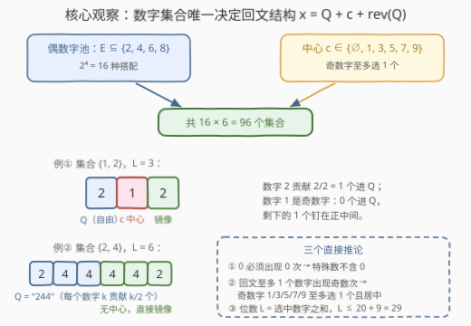
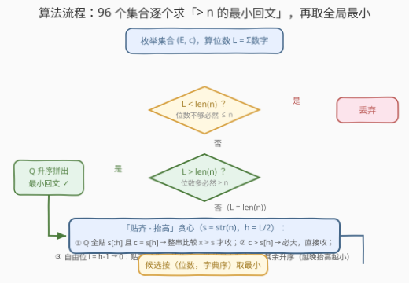

# LeetCode 下一个特殊回文数 题解

## 1. 题目概述

- **标题 / 题号**：下一个特殊回文数（#3646，hard）
- **链接**：https://leetcode.cn/problems/next-special-palindrome-number/
- **难度**：困难
- **标签**：位运算、回溯、贪心、数学

**题意**：给你一个整数 `n`。

如果一个数满足以下条件，那么它被称为**特殊数**：

- 它是一个**回文数**；
- 数字中每个数字 $k$ 出现**恰好 $k$ 次**。

返回**严格大于 $n$ 的最小特殊数**。

如果一个整数正向读和反向读都相同，则它是回文数。例如 $121$ 是回文数，而 $123$ 不是。

**示例 1**：

```text
输入：n = 2
输出：22
解释：22 是大于 2 的最小特殊数，因为它是一个回文数，并且数字 2 恰好出现了 2 次。
```

**示例 2**：

```text
输入：n = 33
输出：212
解释：212 是大于 33 的最小特殊数，因为它是一个回文数，并且数字 1 和 2 恰好分别出现了 1 次和 2 次。
```

**约束**：

- $0 \le n \le 10^{15}$

> 💡 **审题关键**：① 「每个数字 $k$ 出现恰好 $k$ 次」对 $k=0$ 同样生效——$0$ 必须出现 $0$ 次，即**特殊数不含 0**；② 位数不是自由的：总位数 $L$ = 选中数字的**出现次数之和** = 选中数字本身的**数值之和**；③ $n$ 上界 $10^{15}$ 是 16 位数，而数字出现次数受「恰好 $k$ 次」硬约束，候选形态其实极少——这道 Hard 的本质是**构造**，不是搜索。

## 2. 解题思路

### 2.1 暴力思路：逐个扫描或全量生成？

**暴力一：从 $n+1$ 起逐个检查。** 每个数 $O(L)$ 判回文 + 计数。问题在于相邻特殊数之间的间隔可以巨大：例如 $n = 2147483647$ 的答案是 $2888888882$，中间隔着约 $7.4 \times 10^8$ 个非特殊数；$n$ 越大间隔越恐怖，直接超时。

**暴力二：预生成所有特殊数再二分（官方提示 1 的方向）。** 数字集合确定了，集合内不同的回文由「前半部分的不同排列」决定。而排列数会爆炸：仅 $\{2,4,6,8,9\}$ 一个集合的前半就有 $\frac{14!}{1!\,2!\,3!\,4!} \approx 3 \times 10^8$ 种排列，全量生成同样不可行。

两条暴力路的共同盲区：**我们只需要「每个数字集合里严格大于 $n$ 的那一个最小回文」，根本不需要把所有回文生出来。** 把「生成 + 过滤」倒过来变成「直接构造」，就是本题的钥匙。

### 2.2 核心观察：96 个数字集合，每个只需构造一个「最小贴齐回文」



**观察一：数字 0 不能出现。** $0$ 出现 $0$ 次才满足「恰好 $k$ 次」，所以特殊数由 $1 \sim 9$ 中的数字组成，天然无前导零问题。

**观察二：奇偶闸门——奇数字至多选 1 个，且它必居正中。** 回文中**至多一个**数字出现奇数次。奇数字 $k \in \{1,3,5,7,9\}$ 恰出现 $k$ 次（奇数次），若选两个奇数字就有两个奇数次计数，凑不出回文。于是数字集合的形态被锁死：

$$\text{集合} = \underbrace{E \subseteq \{2,4,6,8\}}_{\text{偶数字，随意搭配}} \times \underbrace{c \in \{\text{无},\,1,3,5,7,9\}}_{\text{至多一个奇数字做中心}}$$

共 $2^4 \times 6 = 96$ 个候选集合（这正是官方提示 2 的 bitmask 枚举）。

**观察三：集合唯一决定回文结构 $x = Q + c + \mathrm{rev}(Q)$。** 每个数字 $k$ 贡献 $\lfloor k/2 \rfloor$ 个进自由半边 $Q$；被选中的奇数字 $c$ 多出的那 1 个**钉死在正中心**，镜像自动补齐另一半。位数 $L = 2|Q| + [c \ne \emptyset] \le 20 + 9 = 29$。关键的单调性：**同位数下，$Q$ 的字典序与回文 $x$ 的数值序完全一致**（$x$ 的前半就是 $Q$，首位不同处即决出大小）。因此「该集合内 $> n$ 的最小回文」=「$> $ 目标串的最小 $Q$」再展开——把一个排列爆炸问题压缩成一次构造。

**观察四：位数三分支 + 「贴齐-抬高」贪心。** 记 $s = \mathrm{str}(n)$：

- $L < |s|$：位数不够，$x < 10^{|s|-1} \le n$，整集淘汰；
- $L > |s|$：位数多必大于 $n$，$Q$ **升序**拼出的最小回文即该集合候选；
- $L = |s|$：设 $h = \lfloor L/2 \rfloor$（$Q$ 的长度），按「与 $s$ 贴齐的前缀长度**从长到短**」尝试三种超过方式：
  1. **完全贴齐**：$Q \equiv s[:h]$（多重集相等），且奇长度时 $c = s[h]$——整串 $x$ 与 $s$ 比较，严格大才收（镜像部分可能反而小，见面试要点 Q4）；
  2. **中心超**：$Q \equiv s[:h]$ 且 $c > s[h]$——前 $h+1$ 位贴齐、第 $h$ 位已超，必然 $x > n$，直接收；
  3. **自由位抬高**：取最大的可行 $i$（$i$ 从 $h-1$ 往 $0$ 扫），$Q$ 的前缀贴齐 $s[:i]$，第 $i$ 位放「**大于 $s[i]$ 的最小剩余数字**」，其余数字**升序**垫后。**越晚抬高（$i$ 越大），与 $s$ 贴得越紧，候选越小**。

> 💡 一句话：96 个集合逐个「直接构造出唯一需要的那个回文」，再取全局最小——**生成式搜索变构造式求解**，$3 \times 10^8$ 的排列空间被压成 $O(1)$。

### 2.3 算法流程图



**逻辑执行步骤**：

| 步骤 | 操作 | 说明 |
|------|------|------|
| ① 枚举集合 | `emask ∈ [0,16)` 选偶数字，`c ∈ {∅,1,3,5,7,9}` 选中心 | 共 96 组，位掩码即官方提示 2 |
| ② 算位数 | $L = \sum \text{选中数字}$，同时算出 $Q$ 的多重集（每个 $k$ 贡献 $\lfloor k/2 \rfloor$ 个） | $L \le 29$ |
| ③ 三分支 | $L < \|s\|$ 丢弃；$L > \|s\|$ 升序拼最小回文直接候选 | 位数即大小 |
| ④ 贴齐-抬高 | $L = \|s\|$ 时按 2.2 观察四的优先级 ①→②→③ 构造 | 每集合至多产出 1 个候选 |
| ⑤ 全局取最小 | 所有候选按（位数，字典序）比较 | 候选全部 $> n$ 且位数 $\ge \|s\|$，此序即数值序 |
| ⑥ 返回 | 转 `long long` 输出 | $L \le 29$，Python 天然大整数，C++ 需 `stoll` |

> ⚠️ **必是有解**：$E = \{2,4,6,8\}$、$c = 9$ 时 $L = 29$，其最小回文 $24466688889999999998888666442 \approx 2.4 \times 10^{28}$ 已经远超 $10^{15}$——任何 $n \le 10^{15}$ 都会被位数更大的集合接住，无需无解特判。

### 2.4 示例演算

**示例 2：n = 33（答案 212）**，$s =$ `"33"`，$|s| = 2$：

| 集合 | $L$ | 分支 | 该集合候选 |
|------|-----|------|-----------|
| $\{2\}$ | 2 | $L = \|s\|$：$Q=$`"2"`，贴齐 `s[:1]`=`"3"` 失败（无 3）；$i=0$ 抬高需剩余 $> 3$ 的数字，无 | 无 |
| $\{1,2\}$（$c{=}1, E{=}\{2\}$） | 3 | $L > \|s\|$：$Q$ 升序 = `"2"` → $x = 212$ | **212** |
| $\{3\}$（$c{=}3$） | 3 | $L > \|s\|$：$x = 333$ | 333 |
| $\{4\}$ | 4 | $L > \|s\|$：$x = 4444$ | 4444 |
| 其余 | $\ge 5$ | $L > \|s\|$：如 $23332$、$244442$… | 均 $\ge 23332$ |

全局最小 = **212** ✓。注意 33 本身不是特殊数（3 只出现 2 次），而 212、333 都合法，但 212 更小。

**验算 $n = 10^{15}$（答案 2666888888886662）**：$|s| = 16$，$L = 16$ 的集合只有 $E = \{2,6,8\}$（$2+6+8=16$）。$Q = \{2{\times}1, 6{\times}3, 8{\times}4\}$，$s$ 首位是 1 而 $Q$ 无 1，$i=0$ 抬高放最小的 $2$，其余升序：$Q =$ `"26668888"`，展开 $x = 2666888888886662 > 10^{15}$ ✓；更低位数的集合全部淘汰，故这就是答案。

## 3. 参考代码

### C++

```cpp
class Solution {
public:
    long long specialPalindrome(long long n) {
        string s = to_string(n);
        int ln = s.size();
        string best;                       // 全局最优候选（位数小者优先，同位数字典序小者优先）
        auto consider = [&](const string& x) {
            if (best.empty() || x.size() < best.size() ||
                (x.size() == best.size() && x < best)) best = x;
        };
        int evens[4] = {2, 4, 6, 8};
        int cs[6] = {0, 1, 3, 5, 7, 9};    // 0 表示无中心（偶数长度）
        for (int emask = 0; emask < 16; ++emask) {
            for (int c : cs) {
                int cnt[10] = {0};         // 自由半边 Q 的数字计数
                for (int i = 0; i < 4; ++i)
                    if (emask >> i & 1) cnt[evens[i]] = evens[i] / 2;
                if (c) cnt[c] += (c - 1) / 2;
                int L = 0;
                for (int d = 1; d <= 9; ++d) L += 2 * cnt[d];
                L += (c ? 1 : 0);
                if (L == 0 || L < ln) continue;

                auto make = [&](const string& Q) {      // Q + 中心 + 镜像
                    string x = Q;
                    if (c) x += char('0' + c);
                    return x + string(Q.rbegin(), Q.rend());
                };
                if (L > ln) {                           // 位数多必大于 n：升序拼最小回文
                    string Q;
                    for (int d = 1; d <= 9; ++d) Q += string(cnt[d], char('0' + d));
                    consider(make(Q));
                    continue;
                }
                int h = L / 2;                          // L == ln：进入贴齐-抬高贪心
                int tc[10] = {0};                       // 完全贴齐检查：s[:h] 的计数
                for (int i = 0; i < h; ++i) tc[s[i] - '0']++;
                if (equal(tc, tc + 10, cnt)) {          // ①/② Q 全贴 s[:h]
                    if (L % 2 == 0) {
                        string x = make(s.substr(0, h));
                        if (x > s) consider(x);         // ① 整串比较，镜像定胜负
                    } else if (c == s[h] - '0') {
                        string x = make(s.substr(0, h));
                        if (x > s) consider(x);         // ① 中心贴齐，镜像定胜负
                    } else if (c > s[h] - '0') {
                        consider(make(s.substr(0, h))); // ② 中心超，必大于 n
                    }
                }
                for (int i = h - 1; i >= 0; --i) {      // ③ 自由位抬高，i 大者优先
                    int cc[10];
                    copy(cnt, cnt + 10, cc);
                    bool ok = true;
                    for (int j = 0; j < i; ++j)
                        if (--cc[s[j] - '0'] < 0) { ok = false; break; }
                    if (!ok) continue;                  // s[:i] 贴不齐，换更小的 i
                    for (int d = s[i] - '0' + 1; d <= 9; ++d) {
                        if (cc[d] > 0) {                // 放大于 s[i] 的最小剩余数字
                            --cc[d];
                            string Q = s.substr(0, i) + char('0' + d);
                            for (int dd = 1; dd <= 9; ++dd)
                                Q += string(cc[dd], char('0' + dd));  // 其余升序
                            consider(make(Q));
                            break;
                        }
                    }
                }
            }
        }
        return stoll(best);
    }
};
```

> 💡 **写法要点**：
> - `consider` 按（位数，字典序）比较——所有候选都 $> n$ 且无前导零，此序严格等于数值序，`stoll` 直接得答案。
> - ③ 中「找到第一个可行的 $i$ 后逐数字 `break`」依赖两个单调性：$i$ 越大候选越小（取第一个即最小）；位置 $i$ 放「大于 $s[i]$ 的最小剩余」+ 其余升序即该前缀下的最小展开。
> - 返回 `long long`：答案上界是 $n = 10^{15}$ 时的 $2666888888886662 \approx 2.7 \times 10^{15}$，`long long`（上限约 $9.2 \times 10^{18}$）绰绰有余。

### Python

```python
class Solution:
    def specialPalindrome(self, n: int) -> int:
        s = str(n)
        ln = len(s)
        best = None

        def consider(x):                     # 全局取（位数, 字典序）最小
            nonlocal best
            if best is None or (len(x), x) < (len(best), best):
                best = x

        for emask in range(16):              # E ⊆ {2,4,6,8}
            for c in (None, 1, 3, 5, 7, 9):  # 中心：None = 偶数长度
                cnt = [0] * 10               # 自由半边 Q 的计数
                for i, d in enumerate((2, 4, 6, 8)):
                    if emask >> i & 1:
                        cnt[d] = d // 2
                if c is not None:
                    cnt[c] += (c - 1) // 2
                L = 2 * sum(cnt) + (c is not None)
                if L == 0 or L < ln:
                    continue

                def make(Q):                 # Q + 中心 + 镜像
                    return Q + (str(c) if c is not None else '') + Q[::-1]

                if L > ln:                   # 位数多必大于 n
                    Q = ''.join(str(d) * cnt[d] for d in range(1, 10))
                    consider(make(Q))
                    continue

                h = L // 2                   # L == ln：贴齐-抬高贪心
                tc = [0] * 10                # ①/② 完全贴齐检查
                for ch in s[:h]:
                    tc[int(ch)] += 1
                if tc == cnt:
                    if L % 2 == 0:
                        x = make(s[:h])
                        if x > s:
                            consider(x)      # ① 整串比较
                    elif c == int(s[h]):
                        x = make(s[:h])
                        if x > s:
                            consider(x)      # ① 中心贴齐
                    elif c > int(s[h]):
                        consider(make(s[:h]))  # ② 中心超，必大
                for i in range(h - 1, -1, -1):   # ③ 自由位抬高，i 大者优先
                    cc = cnt[:]
                    ok = True
                    for ch in s[:i]:
                        cc[int(ch)] -= 1
                        if cc[int(ch)] < 0:
                            ok = False
                            break
                    if not ok:
                        continue
                    for d in range(int(s[i]) + 1, 10):
                        if cc[d] > 0:        # 放大于 s[i] 的最小剩余
                            cc[d] -= 1
                            rest = ''.join(str(dd) * cc[dd] for dd in range(1, 10))
                            consider(make(s[:i] + str(d) + rest))
                            break
        return int(best)
```

> 💡 **写法要点**：
> - Python 大整数天然安全；`make` 用 `Q[::-1]` 一行完成镜像。
> - ③ 的「贴齐前缀再抬高」本质是多重集版 `next_permutation`：把 31 题的「找 pivot、换比它大的最小数、后缀升序」搬到「前缀贴着 $s$ 走」的语境下。
> - 想输出全部按升序排列的特殊数？把 96 个集合按 $L$ 分层、层内对 $Q$ 做 `itertools.permutations` 字典序枚举即可——本题只取每层「贴着 $n$」的那一个，是这套枚举的极简版。

## 4. 复杂度分析

| 维度 | 复杂度 | 说明 |
|------|--------|------|
| **时间复杂度** | $O(\Sigma \cdot D)$ | $\Sigma = 96$ 个集合，每个做 $O(D) = O(9)$ 的计数与 $O(L)$、$L \le 29$ 的构造，总量约数千次基本操作，**与 $n$ 的大小完全无关** |
| **空间复杂度** | $O(L)$ | 计数数组与构造串，$L \le 29$ |

> - 对比暴力一（逐个扫描）：单次间隔可达 $10^8$ 量级，天壤之别；
> - 对比暴力二（全量生成 + 二分）：仅 $\{2,4,6,8,9\}$ 一个集合就有约 $3 \times 10^8$ 个排列，构造法把每个集合的贡献压缩为**常数个候选**。

## 5. 扩展：官方提示路线与本题的构造式路线

**官方提示路线（生成 + 二分）。** 提示 1–4 给出的方案是：位掩码枚举数字选择（提示 2）、生成前半的全排列再镜像（提示 3）、把所有特殊数排序后对每个询问二分（提示 1、4）。这条路线在「多次询问」场景下有价值——一次预处理，每次询问 $O(\log K)$。但单次询问下，全排列生成在 $\{2,4,6,8,9\}$ 处就会爆炸，实践中必须给排列加上「按字典序、超过目标串前缀即剪枝」的回溯（提示 3 的「backtracking」标签即指此）。本文的「贴齐-抬高」贪心正是这个剪枝的**解析解**：不搜索，直接算出唯一的那个前缀。

**变体一：求 $\le n$ 的最大特殊数。** 镜像对称：$L > |s|$ 的集合全淘汰，$L < |s|$ 取最大排列（$Q$ 降序），$L = |s|$ 时把「抬高」改成「压低」——第 $i$ 位放「小于 $s[i]$ 的最大剩余数字」，其余降序；完全贴齐时整串比较 $x < s$ 才收。

**变体二：第 $k$ 小的特殊数。** 96 个集合按 $L$ 分层后，层内 $Q$ 的多重集排列按字典序可解析计数（多重组合数逐位求和），「逐层扣减 + 逐位定位」即可 $O(L)$ 定位第 $k$ 个——本题的贪心是 $k$ 恰为「大于 $n$ 的第一个」时的特例。

**为什么奇偶闸门只约束奇数字。** 偶数字 $k$ 出现 $k$ 次（偶数次），两两配对分居镜像两侧，天然兼容任何回文长度；奇数字 $k$ 次 = $\frac{k-1}{2}$ 对 + 落单 1 个，落单者必须居中，而中心只有 1 个坑位——「至多一个奇数字」由此而来。这个论证对一切「多重集能否排成回文」问题通用。

## 6. 面试要点

**Q1：为什么特殊数一定不含数字 0？**

> 「每个数字 $k$ 出现恰好 $k$ 次」对 $k = 0$ 同样生效：$0$ 必须出现恰好 $0$ 次，即不出现。一旦含 0 就出现至少 1 次，立刻非法。副产品：特殊数无前导零问题，位数即数值大小，「位数 + 字典序」可直接当数值序用。

**Q2：候选数字集合为什么只有 96 个？怎么算的？**

> 回文中至多一个数字出现奇数次。偶数字 $\{2,4,6,8\}$ 各出现偶数次，任意搭配都合法，共 $2^4 = 16$ 种；奇数字 $\{1,3,5,7,9\}$ 各出现奇数次，至多选 1 个（选中的那个必居中心），外加「不选奇数字」，共 6 种。$16 \times 6 = 96$。这同时封顶了位数：$L \le 2+4+6+8+9 = 29$。

**Q3：$L = |s|$ 时，为什么不能只比较「$Q$ 与 $s$ 的前半」来判断 $x > n$？**

> 因为镜像部分也参与数值比较。反例：$x = 12921$（$Q=$`"129"`）与 $n = 12900$——前半完全相同，但 $x$ 的第 4 位是镜像来的 2 > 0，$x > n$；换成 $n = 12999$，同样的前半，$x < n$。所以「完全贴齐」分支必须把整串 $x$ 与 $s$ 比个明白，这正是代码里 `if (x > s)` 的意义；而「中心超」「自由位抬高」因为前缀已严格分出大小，才可以免比。

**Q4：「越晚抬高越小」是什么意思？为什么成立？**

> 设在位置 $i$ 抬高（前缀贴齐 $s[:i]$、第 $i$ 位放大于 $s[i]$ 的数字）得到候选 $R_i$。对 $i_1 < i_2$：$R_{i_2}$ 的前 $i_1$ 位等于 $s$ 的前 $i_1$ 位，而 $R_{i_1}$ 在第 $i_1$ 位就大于 $s[i_1]$，故 $R_{i_1} > R_{i_2}$。所以扫描 $i$ 时从大到小、取第一个可行者即最小候选。这与 `next_permutation` 找最靠右 pivot 是同一直觉：贴着目标走得越久，超过它时超得越少。

**Q5：怎么保证一定有解、不需要无解特判？**

> $E = \{2,4,6,8\}$、$c = 9$ 的集合位数 $L = 29$，其最小回文（首位最小非零数字 2）也远超 $10^{15}$。任何 $n \le 10^{15}$ 都会被「位数恰好或更多」的某个集合接住，`best` 必非空。另外注意 C++ 中 `L` 用 `int` 累加即可（$\le 29$），但返回值必须 `long long`——答案可达 $10^{16}$ 量级，`int` 会溢出。

> 💡 **一句话总结**：3646 = 96 个数字集合 × 每个集合一次「贴齐-抬高」构造。带走的三个细节：0 出现 0 次、奇数字至多一个且居中、同位数下整串比较（镜像参与）。

## 同类练习题

| # | 题目 | 与本题的关联 |
|---|------|-------------|
| 31 | [下一个排列](https://leetcode.cn/problems/next-permutation/) | 「贴齐-抬高」贪心的原型（找 pivot、换最小更大数、后缀升序），本题是其多重集版 |
| 556 | [下一个更大元素 III](https://leetcode.cn/problems/next-greater-element-iii/) | 用 `next_permutation` 思想在数字串上求「大于 n 的最小重排」，对比本题「半边自由 + 镜像锁定」的结构 |
| 866 | [回文素数](https://leetcode.cn/problems/prime-palindrome/) | 按位数枚举「半边 + 镜像」生成回文再判素数，回文生成技巧同源 |
| 906 | [超级回文数](https://leetcode.cn/problems/super-palindromes/) | 只枚举回文的前半再平方，同样是「用结构砍搜索空间」 |
| 2081 | [k 镜像数的和](https://leetcode.cn/problems/sum-of-k-mirror-numbers/) | 按位数从小到大枚举 k 进制回文，体会「回文由前半唯一决定」的通用性 |
