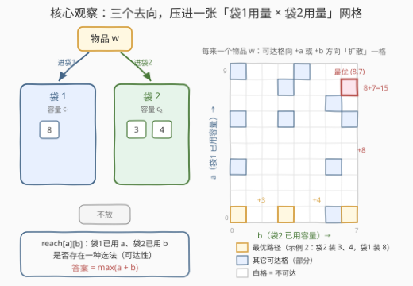
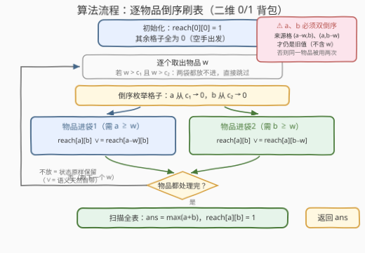

# LeetCode 两个袋子中的最大重量 题解

## 1. 题目概述

- **标题 / 题号**：两个袋子中的最大重量（#3647，medium）
- **链接**：https://leetcode.cn/problems/maximum-weight-in-two-bags/
- **难度**：中等
- **标签**：数组、动态规划

> ⚠️ 本题为 LeetCode 付费题，题意描述根据官方示例用例与 hints 重建，可能与官方题面有出入。官方 hint 提示「用动态规划，设 dp[i][j] 为两个袋子当前重量（已用容量）分别为 i、j 时能装的最大总重量」，据此重建如下。

**题意**：给你一个正整数数组 `weights` 表示 $n$ 件物品的重量，以及两个袋子的容量 `capacity1`、`capacity2`。把物品逐一分配：

- 每件物品可以**放进袋 1**、**放进袋 2**，或**不放进任何袋子**；
- 每件物品至多放进一个袋子（不可拆分、不可重复使用）；
- 任意时刻，袋内物品的总重量不能超过该袋容量。

返回两个袋子中物品**总重量之和的最大值**。若所有物品都放不进任何袋子，返回 `0`。

**示例 1**：

```text
输入：weights = [1,4,3,2], capacity1 = 5, capacity2 = 4
输出：9
解释：袋 1 放 {3,2}（= 5），袋 2 放 {4}（= 4），总重 9，恰好打满两个袋子的容量和。
```

**示例 2**：

```text
输入：weights = [3,6,4,8], capacity1 = 9, capacity2 = 7
输出：15
解释：袋 1 放 {8}（= 8 ≤ 9），袋 2 放 {3,4}（= 7 ≤ 7），总重 15。
```

**示例 3**：

```text
输入：weights = [5,7], capacity1 = 2, capacity2 = 3
输出：0
解释：两件物品都比两个袋子的容量大，一件也放不进，返回 0。
```

**约束条件**（付费题，官方约束未公开，按 DP 解法可行性推断）：

- $1 \le n = \text{weights.length}$，$1 \le \text{weights}[i]$；
- $0 \le \text{capacity1}, \text{capacity2}$；
- $n \cdot c_1 \cdot c_2$ 的量级在 $10^6$ 以内（本解法 $O(n \cdot c_1 \cdot c_2)$ 可过）。

> 💡 **审题关键**：① 每件物品**三个去向**——袋 1 / 袋 2 / 丢弃，这是与普通 0/1 背包（放 / 不放）的本质区别；② 物品在两个袋子间**互斥**，先给袋 1 挑走的物品袋 2 不能再用——两个袋子的决策相互耦合，不能各自独立求解；③ 物品的「重量」就是它的「占用」，没有独立的价值维度，这使得状态可以做成纯布尔可达表；④ 一件都放不下时答案是 `0` 而非 `-1`（空手也是合法方案）。

## 2. 解题思路

### 2.1 暴力思路：三进制枚举每件物品的去向

每件物品有 3 种选择（袋 1 / 袋 2 / 丢弃），直接枚举全部 $3^n$ 种组合，逐一检查两袋容量约束并取最大总重。$n$ 超过 20 就天文数字，显然不可行。

瓶颈在于：**不同的物品集合如果落在两个袋子上的「用量分布」相同，对后续决策的影响就完全相同**——后续物品能不能放，只取决于两袋还剩多少容量，与具体是哪些物品占着无关。这正是把暴力压成 DP 的钥匙。

### 2.2 核心观察：一张「袋1用量 × 袋2用量」的二维可达表



**观察一：联合状态 (a, b) 是完备刻画。** 决策过程中唯一需要记住的信息是「袋 1 已用 $a$、袋 2 已用 $b$」。定义：

$$\text{reach}[a][b] = \text{true} \iff \exists\ \text{一种已处理物品的选法，使袋1恰好重 } a\text{、袋2恰好重 } b$$

初始 $\text{reach}[0][0] = \text{true}$（一件不放）。每来一件重量为 $w$ 的物品，就是让整张表「扩散」一次：

- **进袋 1**（需 $a \ge w$）：$\text{reach}[a][b] \mathrel{\vee}= \text{reach}[a-w][b]$；
- **进袋 2**（需 $b \ge w$）：$\text{reach}[a][b] \mathrel{\vee}= \text{reach}[a][b-w]$；
- **不放**：状态原样保留（`∨=` 语义天然自带这个选项）。

最终答案 $= \max\{a + b : \text{reach}[a][b] = \text{true}\}$——包含 $(0,0)$，所以最小自然为 0，示例 3 无需特判。

**观察二：官方 hint 的 dp[i][j] 就是这张表的等价变形。** hint 说「dp[i][j] 为两袋当前重量为 i、j 时的最大总重量」——由于物品的重量即占用，若 $(i, j)$ 可达，两袋总重**恰为** $i + j$；不可达则记 $-\infty$。所以「布尔可达表 + 最后取 $\max(a+b)$」与官方 dp 完全等价，还省掉了每个格子上反复取 max 的转移开销。

**观察三：为什么必须二维联合？** 若先对袋 1 跑一遍一维 0/1 背包求出「袋 1 最多装多少」，再对剩余物品跑袋 2，会**丢解**：给袋 1 多留一件小物品、腾出的空间可能让袋 2 多装一件大物品（示例 2 中袋 1 只装 8、把 3 和 4 都让给袋 2 才是最优）。两袋决策互斥耦合，只能用联合状态 $(a, b)$ 一张表同步转移。

### 2.3 算法流程图



**逻辑执行步骤**：

| 步骤 | 操作 | 说明 |
|------|------|------|
| ① 初始化 | `reach[0][0] = 1`，其余全 0 | 空手出发 |
| ② 取物品 | 逐个取出 `w`；若 `w > c1` 且 `w > c2` 直接跳过 | 两袋都放不进的物品是死代码 |
| ③ 倒序枚举 | `a` 从 `c1` 递减到 0，`b` 从 `c2` 递减到 0 | **双倒序**是 0/1 背包防复用的灵魂 |
| ④ 转移 | `a ≥ w`：`reach[a][b] ∨= reach[a−w][b]`；`b ≥ w`：`reach[a][b] ∨= reach[a][b−w]` | 两个转移**必须在同一趟循环里**完成 |
| ⑤ 循环 | 处理完 `w` 的所有格子后取下一件物品 | 每件物品只刷一遍表 |
| ⑥ 收答案 | 扫描全表，`ans = max(a + b)`（`reach[a][b] = 1`） | 含 (0,0)，最小为 0 |

> ⚠️ **两个高频坑**：
> **坑 1——倒序不彻底**：处理格子 $(a,b)$ 时读的来源是 $(a-w,\,b)$ 和 $(a,\,b-w)$。`a`、`b` 双倒序保证这两个来源在当前物品的这一遍刷表中**尚未被写入**，读到的都是「不含当前物品」的旧状态；若 `b` 正序枚举，`reach[a][b-w]` 可能刚被本次更新过，同一件物品就被同时放进了两个袋子。
> **坑 2——两趟分离**：先跑完「全部进袋 1」的循环、再跑「全部进袋 2」的循环也是错的——第二趟会读到第一趟刚写的新值，同样导致一件物品用两次。两个转移必须合并进同一趟 $(a, b)$ 循环。

### 2.4 示例演算

**示例 2：weights = [3,6,4,8]，c1 = 9，c2 = 7（答案 15）**。表中 $(a, b)$ = (袋1用量, 袋2用量)，只列关键新增状态：

| 处理物品 | 新增可达状态（关键的） | 当前 max(a+b) |
|---|---|---|
| （初始） | (0,0) | 0 |
| 3 | (3,0)、(0,3) | 3 |
| 6 | (6,0)、(9,0)、(6,3)、(0,6)、(3,6) | 9 |
| 4 | (7,6)、(6,7)、(9,4)、(4,6)、(0,7) 等 | 13 |
| 8 | (8,0)、(8,3)、(8,4)、(8,6)、**(8,7)** | **15** |

**最优路径的诞生**：$(0,0) \xrightarrow{3\text{ 进袋2}} (0,3) \xrightarrow{4\text{ 进袋2}} (0,7) \xrightarrow{8\text{ 进袋1}} (8,7)$——即袋 2 装 $\{3,4\} = 7$、袋 1 装 $\{8\} = 8$，总重 15。注意最后一步：8 超过袋 2 容量放不进，但袋 1 此前一直空着（$a = 0$），恰好接住它——这正是「两袋联合决策」价值的体现：**前面的物品适当谦让，才能给后面的大家伙腾位置**。

**示例 1 的巧合**：$[1,4,3,2]$、容量 $5+4$，总重上界 $\min(\sum w,\ c_1 + c_2) = \min(10, 9) = 9$，而袋 1 装 $\{3,2\}$、袋 2 装 $\{4\}$ 恰好打满——**答案取到理论上界**，可用于对拍自检（见第 5 节剪枝）。

## 3. 参考代码

> ⚠️ 官方函数签名为付费内容未获取，以下按重建题意取 `maxWeight(weights, capacity1, capacity2)`，提交时以实际签名为准。

### C++

```cpp
class Solution {
public:
    int maxWeight(vector<int>& weights, int capacity1, int capacity2) {
        int c1 = capacity1, c2 = capacity2;
        // reach[a][b]：袋1恰好用 a、袋2恰好用 b 是否可达
        vector<vector<char>> reach(c1 + 1, vector<char>(c2 + 1, 0));
        reach[0][0] = 1;
        for (int w : weights) {
            if (w > c1 && w > c2) continue;      // 两袋都放不进，直接跳过
            for (int a = c1; a >= 0; --a) {      // 双倒序：来源格还是旧值
                for (int b = c2; b >= 0; --b) {
                    if (a >= w && reach[a - w][b]) reach[a][b] = 1;  // 进袋1
                    if (b >= w && reach[a][b - w]) reach[a][b] = 1;  // 进袋2
                }
            }
        }
        int ans = 0;
        for (int a = 0; a <= c1; ++a)
            for (int b = 0; b <= c2; ++b)
                if (reach[a][b]) ans = max(ans, a + b);
        return ans;
    }
};
```

> 💡 **写法要点**：
> - 两个转移写在**同一趟** $(a,b)$ 循环里，配合双倒序，保证读到的来源都是「不含当前物品」的旧值——一件物品至多用一次。
> - `reach` 用 `char`/`bool` 而非 `int`，$(c_1{+}1) \times (c_2{+}1)$ 的表在容量上百时也只有几十 KB，缓存友好。
> - 答案扫描放在最后：$a + b$ 只依赖格子坐标，不必在转移时维护。

### Python

```python
class Solution:
    def maxWeight(self, weights: List[int], capacity1: int, capacity2: int) -> int:
        c1, c2 = capacity1, capacity2
        reach = [[False] * (c2 + 1) for _ in range(c1 + 1)]
        reach[0][0] = True
        for w in weights:
            if w > c1 and w > c2:
                continue
            for a in range(c1, -1, -1):          # 双倒序：来源格还是旧值
                for b in range(c2, -1, -1):
                    if a >= w and reach[a - w][b]:
                        reach[a][b] = True       # 进袋1
                    if b >= w and reach[a][b - w]:
                        reach[a][b] = True       # 进袋2
        return max(a + b for a in range(c1 + 1) for b in range(c2 + 1)
                   if reach[a][b])
```

> 💡 **写法要点**：
> - `reach[0][0]` 恒为 `True`，所以最后的 `max` 至少取到 0，示例 3（一件都放不下）无需特判。
> - 若追求常数优化，可用一维字节串 + 位运算整行扩散，但 $n \cdot c_1 \cdot c_2 \le 10^6$ 量级下三重纯 Python 循环已可接受，无需过早优化。

## 4. 复杂度分析

| 维度 | 复杂度 | 说明 |
|------|--------|------|
| **时间复杂度** | $O(n \cdot c_1 \cdot c_2)$ | 每件物品把 $(c_1{+}1) \times (c_2{+}1)$ 的表整个刷一遍，每次转移 $O(1)$ |
| **空间复杂度** | $O(c_1 \cdot c_2)$ | 二维可达表；物品维度天然滚动，无需额外开 $n$ 层 |

> - 对比暴力 $O(3^n)$：把「物品集合」压缩成「用量分布 $(a,b)$」，状态数从指数级降到 $c_1 \cdot c_2$。
> - 与经典 0/1 背包同构：单背包（放/不放）是一维倒序刷表；本题多一个袋子，就多一个维度、多一个转移来源——「维度数 = 背包个数」。

## 5. 扩展：双背包家族与工程化改进

**上界剪枝与提前终止。** 答案有天然上界 $\min\!\big(\sum w,\ c_1 + c_2\big)$：维护当前已知的 $\max(a+b)$，一旦打平上界即可整体退出（示例 1 恰好取到上界 9）。配合「$w > \max(c_1, c_2)$ 的物品直接跳过」，实测能省掉不少无效刷表。

**方案还原。** 若要输出每件物品的去向，给每个格子记录前驱 $(a', b') \to (a, b)$（即 $(a-w, b)$ 或 $(a, b-w)$），从答案格 $(a^\*, b^\*)$ 回溯到 $(0,0)$，沿途的差值就是每件物品进了哪个袋子——与 0/1 背包还原方案完全同构。

**价值 ≠ 重量的推广。** 若物品另有价值 $v_i$，可达表就升级为真正的最值表：$dp[a][b] = \max(dp[a][b],\ dp[a-w][b] + v,\ dp[a][b-w] + v)$——这正是官方 hint 中「dp[i][j] 为最大总重量」表述的用武之地：当重量与占用分离时，$dp[i][j] \ne i + j$，必须老老实实取 max。

**袋子的个数推广。** $k$ 个袋子时状态变成 $k$ 维，$O(n \cdot \prod c_i)$ 迅速爆炸，一般改用回溯 + 剪枝（如 2305 公平分发饼干）或按「把物品分成若干组」的思路状压。特殊地，956 最高的广告牌中每根柱子同样是三去向（左柱 / 右柱 / 丢弃），但因为目标要求**两柱最终等高**，状态可压缩成一维「高度差」——对比本题两袋容量不对称、目标是对各自容量的最优化，无法压维，这个对比能加深对「什么时候能降维」的理解。

## 6. 面试要点

**Q1：为什么不能对两个袋子分别独立做两次一维 0/1 背包？**

> 因为物品在两袋之间互斥：先给袋 1 做最优选择的物品集合，会直接剥夺袋 2 的选择权。示例 2 中，若袋 1 贪心地装 $\{3,6\}=9$，袋 2 只能装 $\{4\}$，总重 13；而最优解是袋 1 只装 $\{8\}$、袋 2 装 $\{3,4\}$，总重 15。两袋的决策必须放在联合状态 $(a, b)$ 里同步转移。

**Q2：为什么 a、b 必须双倒序枚举？把「进袋1」「进袋2」拆成两趟循环行不行？**

> 都不行，核心都是「来源必须是旧值」。双倒序保证处理 $(a,b)$ 时，$(a-w, b)$ 与 $(a, b-w)$ 都还没被当前物品的刷表写过。拆成两趟更隐蔽：第二趟会读到第一趟刚写入的新值，等于让同一件物品先占袋 1 又占袋 2，被用了两次。正确做法是两个转移合并进同一趟循环——这与一维 0/1 背包必须倒序是同一个原理在二维的推广。

**Q3：官方 hint 的 dp[i][j]（最大总重量）和布尔可达表是什么关系？**

> 本题物品的重量就是它的占用，若 $(i,j)$ 可达则两袋总重恰为 $i + j$，不可达记 $-\infty$——所以「布尔表 + 末尾 $\max(a+b)$」与官方 dp 完全等价，且转移只需按位或，比反复取 max 更快。只有当「价值 ≠ 重量」时（见第 5 节推广），才必须回到真正的最值 dp。

**Q4：本题与 416 分割等和子集、经典 0/1 背包是什么关系？**

> 416 是「一个袋子能否恰好装满 $\text{sum}/2$」的一维可达性 DP，正是本题砍掉一袋、把目标钉死在 $\text{sum}/2$ 的特例。一般 0/1 背包是「一袋 + 价值最大化」的一维最值 DP。本题 = 两个袋子 + 总重最大化，维度随袋子数增长，套路完全平移：多一个约束维度，就多一层倒序循环。

**Q5：有哪些实用的剪枝和自检手段？**

> ① 跳过 $w > \max(c_1, c_2)$ 的物品；② 上界 $\min(\sum w, c_1 + c_2)$ 提前终止；③ 对拍自检：小规模用 $3^n$ 暴力枚举三去向验证 DP（本文示例答案 9 / 15 / 0 即由此交叉验证）；④ 输出方案回溯时注意同一格可能有多条前驱路径，任取一条即可，不影响最优值。

> 💡 **一句话总结**：3647 = 二维 0/1 背包可达性 DP。带走的三个细节：每件物品三去向、双倒序防复用、两转移必须同趟循环。

## 同类练习题

| # | 题目 | 与本题的关联 |
|---|------|-------------|
| 416 | [分割等和子集](https://leetcode.cn/problems/partition-equal-subset-sum/) | 单背包「恰好装满」的可达性 DP，本题的一维特例 |
| 956 | [最高的广告牌](https://leetcode.cn/problems/tallest-billboard/) | 每根柱子同样三去向（左柱/右柱/弃），因目标「两柱等高」可把状态压成一维高度差，对比本题为何不能压维 |
| 1049 | [最后一块石头的重量 II](https://leetcode.cn/problems/last-stone-weight-ii/) | 把石头分成两堆最小化差，单背包可达表取最接近 sum/2 的格子 |
| 2915 | [和等于目标的最长子序列](https://leetcode.cn/problems/length-of-the-longest-subsequence-that-sums-to-target/) | 子集和可达表的「计量版」——格子存最长长度而非布尔值 |
| 2305 | [公平分发饼干](https://leetcode.cn/problems/fair-distribution-of-cookies/) | $k$ 个「袋子」的分配问题，维度爆炸后改走回溯 + 剪枝，体会 DP 与回溯的分界线 |
