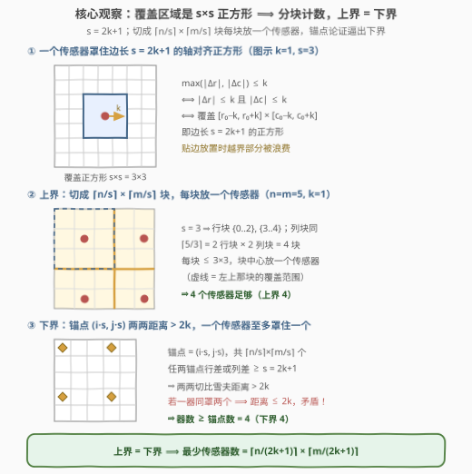
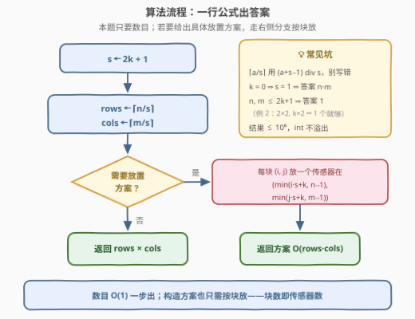

# 覆盖网格的最少传感器数目

- **题目名称**：覆盖网格的最少传感器数目
- **链接**：[3648. 覆盖网格的最少传感器数目](https://leetcode.cn/problems/minimum-sensors-to-cover-grid/)
- **难度**：中等
- **标签**：数学

## 1. 题目概述

**题意**：给定一个 $n \times m$ 的网格和一个整数 $k$。放置在单元格 $(r, c)$ 的传感器可以覆盖所有与 $(r, c)$ 的**切比雪夫距离**不超过 $k$ 的单元格；两个单元格 $(r_1, c_1)$ 和 $(r_2, c_2)$ 之间的切比雪夫距离为 $\max(|r_1 - r_2|, |c_1 - c_2|)$。返回覆盖**整个网格**所需传感器的**最少**数量。

**示例 1**：

```text
输入：n = 5, m = 5, k = 1
输出：4
解释：在 (0, 3)、(1, 0)、(3, 3)、(4, 1) 放置传感器即可覆盖整个网格。
```

**示例 2**：

```text
输入：n = 2, m = 2, k = 2
输出：1
解释：k = 2 时单个传感器无论放哪都能覆盖整个 2×2 网格。
```

**约束条件**：

- $1 \le n \le 10^3$
- $1 \le m \le 10^3$
- $0 \le k \le 10^3$

> 💡 **审题关键**：① $\max(|\Delta r|, |\Delta c|) \le k$ 等价于「行差、列差**都** $\le k$」，所以覆盖区域是一个**轴对齐正方形**（边长 $2k+1$，贴边放置时被网格边界裁剪）；② $k$ 可以为 **0**，此时传感器只覆盖自己所在的格子，答案退化为 $n \times m$；③ 问的是「数目」而非「放置方案」，且输入只有三个整数——强烈暗示答案是**闭式公式**。

---

## 2. 解题思路

### 2.1 暴力思路：最小集合覆盖

最朴素的建模：每个格子 $(r, c)$ 对应一个「可覆盖集合」（以它为中心的 $s \times s$ 正方形与网格的交集），目标是挑选最少的集合覆盖全部 $n \times m$ 个格子。这是一般的**最小集合覆盖**问题——NP 难，而且候选集合多达 $10^6$ 个，组合爆炸，完全不可行。

但这步建模并非无用：它提醒我们，一般位置的集合覆盖没有好结构，本题必须吃透「**所有覆盖区域都是同尺寸的轴对齐正方形**」这一规则性——正是它让行与列**解耦**，最终塌缩成一个乘法公式。

### 2.2 核心观察：正方形覆盖 + 分块上界 + 锚点下界



记 $s = 2k + 1$，即单个传感器覆盖的正方形边长。

**观察一（覆盖形状）**：$\max(|\Delta r|, |\Delta c|) \le k \iff |\Delta r| \le k$ 且 $|\Delta c| \le k$，故位于 $(r_0, c_0)$ 的传感器恰好覆盖矩形 $[r_0 - k, r_0 + k] \times [c_0 - k, c_0 + k]$——一个边长 $s = 2k+1$ 的轴对齐正方形（越界部分被网格裁掉，纯属浪费）。

**观察二（上界——分块构造）**：把行切成 $\lceil n/s \rceil$ 个行块（第 $i$ 块含行 $i \cdot s \sim \min((i+1) \cdot s - 1,\ n-1)$），列同理切成 $\lceil m/s \rceil$ 个列块，得到 $\lceil n/s \rceil \times \lceil m/s \rceil$ 个尺寸不超过 $s \times s$ 的块。**每块放一个传感器**：位置取 $(\min(i \cdot s + k,\ n-1),\ \min(j \cdot s + k,\ m-1))$——满块时恰是块中心，覆盖范围与块重合；最后一个不满的块被截断贴边放置，稍作不等式验证可知覆盖范围仍**包含整块**（截断只会把浪费的越界部分推回网格内）。于是 $\lceil n/s \rceil \times \lceil m/s \rceil$ 个传感器**足够**。

**观察三（下界——锚点论证）**：取**锚点**集合 $A = \{(i \cdot s,\ j \cdot s) : 0 \le i < \lceil n/s \rceil,\ 0 \le j < \lceil m/s \rceil\}$（由 $i \cdot s < n$、$j \cdot s < m$ 保证锚点都在网格内）。任取两个不同锚点，行差或列差至少为 $s = 2k+1$，故二者的切比雪夫距离 $\ge s > 2k$。若同一个传感器同时覆盖它们，由切比雪夫距离的三角不等式，两锚点距离 $\le k + k = 2k$，矛盾。所以**每个传感器至多覆盖一个锚点**，传感器数 $\ge |A| = \lceil n/s \rceil \times \lceil m/s \rceil$。

上界与下界重合，最优解就是闭式公式：

$$\text{answer} = \left\lceil \frac{n}{2k+1} \right\rceil \times \left\lceil \frac{m}{2k+1} \right\rceil$$

> 💡 示例 1 官方给的放置位置 $(0,3), (1,0), (3,3), (4,1)$ 并不是块中心——最优**数目**是唯一的，**位置**却很自由（只要每块的覆盖不重不漏地错开即可）；本题只问数目，公式一步到位。

### 2.3 算法流程图



**文字版步骤**：

| 步骤 | 操作 | 说明 |
|------|------|------|
| ① 算边长 | $s \leftarrow 2k + 1$ | 单个传感器覆盖的正方形边长 |
| ② 行块数 | $\text{rows} \leftarrow \lceil n/s \rceil$ | 整数写法 $(n + s - 1) \,\mathrm{div}\, s$ |
| ③ 列块数 | $\text{cols} \leftarrow \lceil m/s \rceil$ | 同上 |
| ④ 返回 | $\text{rows} \times \text{cols}$ | 上界 = 下界，即最优解 |

若还要求给出具体放置方案：对每个块 $(i, j)$ 在 $(\min(i \cdot s + k,\ n-1),\ \min(j \cdot s + k,\ m-1))$ 处放一个传感器即可，构造耗时 $O(\text{rows} \times \text{cols})$。

### 2.4 示例演算

| $n$ | $m$ | $k$ | $s = 2k+1$ | $\lceil n/s \rceil$ | $\lceil m/s \rceil$ | 答案 | 验证 |
|-----|-----|-----|-----------|--------------------|--------------------|------|------|
| 5 | 5 | 1 | 3 | 2 | 2 | **4** | 示例 1 ✓ |
| 2 | 2 | 2 | 5 | 1 | 1 | **1** | 示例 2 ✓ |
| 4 | 7 | 1 | 3 | 2 | 3 | **6** | 行块 {0..2},{3}；列块 {0..2},{3..5},{6} |
| 1000 | 1000 | 0 | 1 | 1000 | 1000 | **10⁶** | $k=0$ 退化为每格一个 |
| 1 | 1 | 0 | 1 | 1 | 1 | **1** | 最小输入 |

> 💡 注意 $k = 0$ 与「$k$ 巨大」两端都无需特判：$s=1$ 时公式自然给出 $n \cdot m$；$n, m \le 2k+1$ 时公式自然给出 $1$。

---

## 3. 参考代码

### C++

```cpp
class Solution {
public:
    int minSensors(int n, int m, int k) {
        int s = 2 * k + 1;
        return (n + s - 1) / s * ((m + s - 1) / s);
    }
};
```

> 💡 **写法要点**：
> - 上取整用 $(a + s - 1) / s$，两处先各自取整再相乘，**不要**先乘后除。
> - $a + s - 1 \le 10^3 + 2 \times 10^3$，乘积 $\le 10^6$，`int` 毫无溢出风险。
> - $k = 0$ 时 $s = 1$，公式自动退化为 $n \times m$，不需要任何特判。

### Python

```python
class Solution:
    def minSensors(self, n: int, m: int, k: int) -> int:
        s = 2 * k + 1
        return (n + s - 1) // s * ((m + s - 1) // s)
```

> Python 整数任意精度，直接套公式即可；也可写 `-(-n // s)` 风格的上取整，等价。

---

## 4. 复杂度分析

| 维度 | 复杂度 | 说明 |
|------|--------|------|
| **时间复杂度** | $O(1)$ | 一次加法、两次除法、一次乘法 |
| **空间复杂度** | $O(1)$ | 只用常数个变量 |

> - 即使把「构造放置方案」也算上，也只需 $O(\lceil n/s \rceil \times \lceil m/s \rceil)$ 输出每个位置，不超过 $n \times m$。
> - 这题的难点完全在**证明**而非**实现**——想到锚点下界后，代码是全场最短的那种。

---

## 5. 扩展：同族「规则覆盖」问题

- **一维版本**：长为 $n$ 的线段，每个位置覆盖半径 $k$ 的区间，最少多少个点覆盖全段？答案是 $\lceil n/(2k+1) \rceil$——正是本题去掉一维后的退化情形，可用同一套「分块上界 + 锚点下界」论证。
- **曼哈顿距离版本**：若覆盖条件改成曼哈顿距离 $\le k$，覆盖区域变成**菱形**。经典技巧是坐标旋转 45°：令 $(r, c) \mapsto (r + c,\ r - c)$，曼哈顿距离与切比雪夫距离互换，菱形变成轴对齐正方形，又能套同款分块思路。
- **为什么一般集合覆盖 NP 难，这题却有公式**：关键是所有覆盖区域是**同一尺寸的轴对齐正方形**——行列解耦，行、列各自独立计数后相乘。若换成任意形状/任意大小的覆盖块（如 [1240. 铺瓷砖](https://leetcode.cn/problems/tiling-a-rectangle-with-the-fewest-squares/) 的可变尺寸正方形），公式消失，只能搜索。
- **要输出方案怎么办**：按 2.2 观察二的构造，块中心越界则贴边截断，逐块输出即可。

---

## 6. 面试要点

**Q1：为什么切比雪夫距离 $\le k$ 的覆盖区域是正方形？**

> $\max(|\Delta r|, |\Delta c|) \le k$ 等价于 $|\Delta r| \le k$ **且** $|\Delta c| \le k$，两个约束各自限定一个坐标方向的范围，联立即 $[r_0-k, r_0+k] \times [c_0-k, c_0+k]$——边长 $2k+1$ 的轴对齐正方形。切比雪夫距离度量的是「国王走法」（国际象棋王一步移动），王的可达区域正是方形。

**Q2：下界是怎么证明的？为什么不能靠巧妙摆放少于 $\lceil n/s \rceil \times \lceil m/s \rceil$ 个？**

> 取锚点 $(i \cdot s, j \cdot s)$，共 $\lceil n/s \rceil \times \lceil m/s \rceil$ 个。任意两个锚点的切比雪夫距离 $\ge s = 2k+1 > 2k$；若一个传感器同时覆盖两个锚点，由三角不等式两锚点距离 $\le 2k$，矛盾。故每器至多罩一个锚点，数目被锚点数卡死——这个下界与摆放方式无关，是「信息论式」的硬下界。

**Q3：最后一个不满的块（比如 $n=4, k=1$ 时行块 $\{3\}$ 只有 1 行）怎么放传感器？为什么截断后仍正确？**

> 块中心 $i \cdot s + k$ 可能越出网格，贴边截断为 $\min(i \cdot s + k,\ n-1)$。验证：截断发生时 $n - 1 < i \cdot s + k$，则 $(n-1) - k < i \cdot s$，覆盖区间 $[(n-1)-k,\ (n-1)+k]$ 仍完整包含块行范围 $[i \cdot s,\ n-1]$；未截断时中心覆盖 $[i \cdot s,\ i \cdot s + 2k]$ 恰好等于满块范围。列方向同理。

**Q4：有哪些边界情况？**

> ① $k = 0$：$s = 1$，公式给出 $n \times m$，无需特判；② $k \ge \max(n, m)$（甚至只要 $n, m \le 2k+1$）：公式给出 $1$，如示例 2；③ $n$ 或 $m$ 恰为 $s$ 的整数倍：最后一个块是满块，不触发截断分支；④ 数值范围：答案上界 $10^6$，C++ 用 `int` 安全。

**Q5：这题和曼哈顿距离类题目怎么联系起来？**

> 曼哈顿球是菱形、切比雪夫球是正方形，通过 $(r, c) \mapsto (r+c, r-c)$ 的 45° 旋转（配 $\sqrt{2}$ 缩放）二者互换：$|r_1-r_2| + |c_1-c_2| = \max(|u_1-u_2|, |v_1-v_2|)$（$u = r+c,\ v = r-c$）。遇到「菱形覆盖/菱形最近点」类问题，先旋转化切比雪夫往往一步出解——和 [1266. 访问所有点的最小时间](https://leetcode.cn/problems/minimum-time-visiting-all-points/) 是同一件武器。

---

## 7. 同类练习题

- [1266. 访问所有点的最小时间](https://leetcode.cn/problems/minimum-time-visiting-all-points/)：切比雪夫距离的直接应用，理解「国王走法」的第一站
- [1326. 灌溉花园的最少水龙头数目](https://leetcode.cn/problems/minimum-number-of-taps-to-open-to-water-a-garden/)：本题的一维亲戚——区间覆盖用贪心而非公式，对比规则性强弱的解法差异
- [1024. 视频拼接](https://leetcode.cn/problems/video-stitching/)：一维最少区间覆盖的另一经典款，贪心跳格子
- [1240. 铺瓷砖](https://leetcode.cn/problems/tiling-a-rectangle-with-the-fewest-squares/)：同样是正方形覆盖矩形，但尺寸可变导致无闭式公式，需搜索——反面印证本题「固定尺寸 ⟹ 行列解耦 ⟹ 乘法公式」的结构价值
