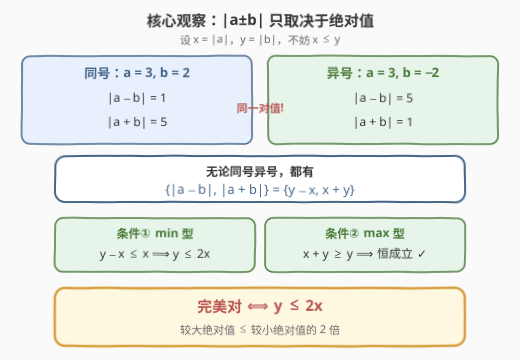
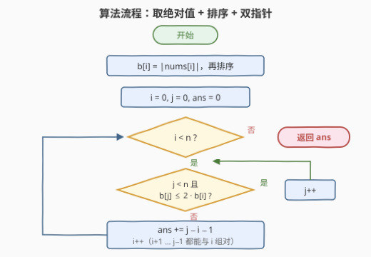

# LeetCode 完美对的数目 题解

## 1. 题目概述

- **标题 / 题号**：完美对的数目（#3649，medium）
- **链接**：https://leetcode.cn/problems/number-of-perfect-pairs/
- **难度**：中等
- **标签**：数学、排序、双指针

**题意**：给定整数数组 $nums$。若一对下标 $(i, j)$（$i < j$）满足以下两个条件，则称其为**完美**的。令 $a = nums[i]$，$b = nums[j]$：

$$\min(|a - b|,\ |a + b|) \le \min(|a|,\ |b|)$$
$$\max(|a - b|,\ |a + b|) \ge \max(|a|,\ |b|)$$

返回不同完美对的数量。

**示例 1**：

```text
输入：nums = [0,1,2,3]
输出：2
解释：完美对为 (1,2) 与 (2,3)：min(|a−b|,|a+b|) = 1 ≤ min(|a|,|b|)，且 max(|a−b|,|a+b|) ≥ max(|a|,|b|)。
```

**示例 2**：

```text
输入：nums = [-3,2,-1,4]
输出：4
解释：(-3,2)、(-3,4)、(2,-1)、(2,4) 四对均满足条件。
```

**示例 3**：

```text
输入：nums = [1,10,100,1000]
输出：0
解释：任何两数的绝对值都相差超过 2 倍，没有完美对。
```

**约束**：

- $2 \le nums.length \le 10^5$
- $-10^9 \le nums[i] \le 10^9$

> 💡 **审题关键**：① 判定式中出现的量全部是 $|a \pm b|$、$|a|$、$|b|$ 这种**绝对值形态**——符号大概率是烟雾弹，先做代数化简再动手；② $n = 10^5$ 时对数最多 $\binom{10^5}{2} \approx 5 \times 10^9$，**超出 `int`**，返回值必须 64 位（官方签名就是 `long long`）；③ $2 \times |nums[i]|$ 上界 $2 \times 10^9$，与 `int` 上限 $2.147 \times 10^9$ 仅一线之隔，C++ 比较判据时用 64 位最稳。

## 2. 解题思路

### 2.1 暴力思路

枚举全部 $\binom{n}{2} \approx 5 \times 10^9$ 对下标，每对 $O(1)$ 计算四个 $\min/\max$ 判定——数量级直接超时。而且判定式看着唬人，**先化简再谈算法**才是本题正路。

### 2.2 核心观察：符号无关性，完美对一句话判定



设 $x = |a|$，$y = |b|$，不妨 $x \le y$。关键**引理**：

$$\{|a - b|,\ |a + b|\} = \{y - x,\ x + y\}$$

即 $|a-b|$ 与 $|a+b|$ 恰好就是 $y-x$ 与 $x+y$ 这两个数，**与 $a, b$ 的符号无关**。分两种情况验证：

- **同号**：$|a - b| = |x - y| = y - x$，$|a + b| = x + y$；
- **异号**：$|a - b| = x + y$，$|a + b| = |x - y| = y - x$。

例如 $a = 3, b = 2$ 得 $\{1, 5\}$，$a = 3, b = -2$ 同样得 $\{1, 5\}$——只是两个值互换了位置。于是

$$\min(|a-b|, |a+b|) = y - x, \qquad \max(|a-b|, |a+b|) = x + y$$

代回两个判定条件：

- **条件 ①**：$y - x \le x \iff y \le 2x$；
- **条件 ②**：$x + y \ge y \iff x \ge 0$，**恒成立**。

> ⚠️ **结论**：完美对 $\iff \max(|a|, |b|) \le 2 \cdot \min(|a|, |b|)$——**两个绝对值中较大者不超过较小者的 2 倍**。原题的 $\min/\max$ 嵌套绝对值全部坍缩成一个乘法不等式。

### 2.3 算法流程图：排序 + 双指针计数



将数组取绝对值后**排序**，得到非负单调数组 $b$。对每对 $i < j$ 有 $b[i] \le b[j]$，故「$i, j$ 是完美对」$\iff b[j] \le 2 \cdot b[i]$。固定较小端 $i$，满足条件的 $j$ 是一段**前缀**；而阈值 $2 \cdot b[i]$ 随 $i$ 增大**单调不减**，右边界 $j$ 只进不退——标准**双指针**。

**文字版步骤**：

| 步骤 | 操作 | 说明 |
|------|------|------|
| ① 取绝对值 | $b[i] = |nums[i]|$ | 判定只看绝对值，符号已被引理消化 |
| ② 排序 | `sort(b)` | 建立单调性，$O(n \log n)$ |
| ③ 双指针 | 对每个 $i$：`while j < n 且 b[j] ≤ 2·b[i]` 则 `j++` | $j$ 单调不退，均摊 $O(n)$ |
| ④ 累加 | `ans += j - i - 1` | 下标 $i{+}1 \ldots j{-}1$ 均能与 $i$ 组成完美对 |
| ⑤ 返回 | `return ans` | 64 位整数 |

**为什么 $j$ 不会回退**：排序后 $2 \cdot b[i]$ 随 $i$ 单调不减，第 $i'$ 轮被排除的 $b[j] > 2 \cdot b[i']$（$i' < i$）在后续轮次更不可能满足判据；两个指针各至多前进 $n$ 步。

**为什么不会算出负数**：由于 $b[i] \le 2 \cdot b[i]$ 恒成立（$b[i] \ge 0$），$j$ 至少会推进到 $i + 1$，故 $j - i - 1 \ge 0$。

### 2.4 示例演算：nums = [-3, 2, -1, 4]

取绝对值并排序：$b = [1, 2, 3, 4]$。

| $i$ | $b[i]$ | 阈值 $2b[i]$ | $j$ 推进到 | 本轮对数 $j - i - 1$ | 新增对（绝对值） |
|-----|--------|--------------|-----------|----------------------|------------------|
| 0 | 1 | 2 | 2（$b[2] = 3 > 2$ 停） | 1 | (1, 2) |
| 1 | 2 | 4 | 4（$b[3] = 4 \le 4$，$j$ 到头） | 2 | (2, 3), (2, 4) |
| 2 | 3 | 6 | 4（已到头） | 1 | (3, 4) |
| 3 | 4 | 8 | 4 | 0 | — |

合计 $1 + 2 + 1 + 0 = 4$，与示例 2 一致。注意 (2, 3) 这一对绝对值对应原数组的 $(2, -1)$——符号早已不影响判定。

> 💡 示例 1 中 $b = [0, 1, 2, 3]$：$i = 0$ 时阈值 $2 \times 0 = 0$，$j$ 停在 1，本轮 $0$ 对；$i = 1$ 时阈值 2，$j$ 推到 3，得 1 对；$i = 2$ 时阈值 4，$j$ 到头再得 1 对，共 2。含 0 无需任何特判。

## 3. 参考代码

### C++

```cpp
class Solution {
public:
    long long perfectPairs(vector<int>& nums) {
        int n = nums.size();
        vector<long long> b;
        b.reserve(n);
        for (int x : nums) b.push_back(abs(x));
        sort(b.begin(), b.end());

        long long ans = 0;
        int j = 0;
        for (int i = 0; i < n; i++) {
            while (j < n && b[j] <= 2 * b[i]) j++;
            ans += j - i - 1;
        }
        return ans;
    }
};
```

> 💡 **写法要点**：
> - **绝对值数组用 `long long`**：一来兜住 $2 \times b[i] \le 2 \times 10^9$ 的判据乘法（贴 `int` 上限），二来与 64 位返回值配套；
> - **`ans` 必须 `long long`**：对数上限约 $5 \times 10^9$，`int` 必炸；
> - **`while` 中 `j` 不回退**，双指针部分均摊 $O(n)$，复杂度瓶颈只剩排序。

### Python

```python
class Solution:
    def perfectPairs(self, nums: List[int]) -> int:
        b = sorted(abs(x) for x in nums)
        n = len(b)
        ans = 0
        j = 0
        for i, x in enumerate(b):
            while j < n and b[j] <= 2 * x:
                j += 1
            ans += j - i - 1
        return ans
```

> Python 整数无溢出问题，直接模拟即可；`for i, x in enumerate(b)` 免去重复下标访问。

## 4. 复杂度分析

| 维度 | 复杂度 | 说明 |
|------|--------|------|
| **时间复杂度** | $O(n \log n)$ | 排序主导；双指针 $i, j$ 各至多前进 $n$ 步，主过程 $O(n)$ |
| **空间复杂度** | $O(n)$ | 绝对值数组（C++ 若原地 `abs` 再排序可降为 $O(1)$，此处为类型安全与可读性另开） |

> - $n = 10^5$ 时排序约 $1.7 \times 10^6$ 次比较，轻松通过。
> - 二分写法总复杂度同为 $O(n \log n)$，但双指针版主过程线性且代码更短。

## 5. 扩展：二分写法与「k 倍关系」计数家族

**二分写法**：固定 $i$，用 `upper_bound(b.begin(), b.end(), 2 * b[i])` 直接定位右边界 $j$，`ans += j - 1 - (i + 1) + 1`。每个 $i$ 一次 $O(\log n)$ 查询，总 $O(n \log n)$——不用操心指针推进方向，更难写错，比赛中随手可用。

**k 倍家族**：把结论中的 $2$ 换成任意 $k \ge 1$ 依然成立——完美对 $\iff \max(|a|, |b|) \le k \cdot \min(|a|, |b|)$，排序 + 双指针的结构原封不动。[2576. 求出最多标记下标](https://leetcode.cn/problems/find-the-maximum-number-of-marked-indices/) 就是同款「$2 \cdot nums[j] \le nums[i]$」配对关系，只是求**最大匹配数**而非计数，用二分或贪心首尾配对解决。

**变体延伸**：若判据改为「严格小于 2 倍」（$<$ 与 $\le$ 之差），双指针判据同步改严格不等号即可；若改为「子数组内统计对数」，则需结合计数排序/桶按值域滑窗，是另一档难度的题。

## 6. 面试要点

**Q1：怎么想到「先取绝对值化简」而不是直接设计算法？**

> 判定式中出现的所有量——$|a-b|$、$|a+b|$、$|a|$、$|b|$——都是绝对值形态，符号只在 $a \pm b$ 内部短暂存在。设 $x = |a|, y = |b|$ 后按同号/异号分情况验证，发现 $\{|a-b|, |a+b|\} = \{y-x, x+y\}$ 与符号无关，$\min/\max$ 嵌套随即坍缩为 $y \le 2x$。**先把问题化简到最简形态，再选数据结构**，是这类「唬人式题面」的通用破法。

**Q2：双指针的单调性依据是什么？**

> 排序后固定 $i$，判据 $b[j] \le 2 \cdot b[i]$ 关于 $j$ 单调不增（$j$ 越大 $b[j]$ 越大）；固定 $j$，判据关于 $i$ 单调不减（$i$ 越大阈值 $2 \cdot b[i]$ 越高）。因此上一轮越过的 $j$ 无需回头，$i, j$ 各走至多 $n$ 步，主过程 $O(n)$。

**Q3：有哪些数值/边界坑？**

> ① 答案上限 $\binom{10^5}{2} \approx 5 \times 10^9$，超 `int` 约 2.3 倍，返回值必须 `long long`；② C++ 判据 $2 \times b[i]$ 上界 $2 \times 10^9$，距 `INT_MAX` 仅 $1.5\%$，用 `long long` 存绝对值数组一劳永逸；③ 全 0 数组：$0 \le 2 \times 0$ 成立，0 与 0 互为完美对，双指针逻辑天然覆盖，无需特判。

**Q4：这题与经典「计数对」题（如 2824）的异同？**

> 同：都是「排序建立单调性 → 判据关于一端单调 → 双指针/二分统计对数」，且都要注意计数型答案爆 `int`。异：2824 的判据是 $b[i] + b[j] < target$（**和**型，双指针两头收缩），本题是 $b[j] \le 2 \cdot b[i]$（**比值**型，右边界单向推进），统计公式一个是首尾配对、一个是前缀长度。

**Q5：双指针和二分怎么取舍？**

> 双指针主过程 $O(n)$、常数小，但要求正确维护指针推进顺序；二分 $O(n \log n)$ 逻辑直白、无状态，`upper_bound` 一行定位。$n = 10^5$ 下两者都轻松通过，面试中先写出正确版本再优化即可。

## 同类练习题

| # | 题目 | 与本题的关联 |
|---|------|-------------|
| 2824 | [统计和小于目标的下标对数目](https://leetcode.cn/problems/count-pairs-whose-sum-is-less-than-target/) | 排序 + 双指针计数对的入门款，与本题主过程结构完全同构 |
| 2563 | [统计公平数对的数目](https://leetcode.cn/problems/count-the-number-of-fair-pairs/) | 排序后统计和落在 $[lower, upper]$ 的对数，双阈值双指针的进阶版 |
| 2576 | [求出最多标记下标](https://leetcode.cn/problems/find-the-maximum-number-of-marked-indices/) | 同款「2 倍关系」配对，求最大匹配数而非计数，二分/贪心解法 |
| 2006 | [差的绝对值为 K 的数对数目](https://leetcode.cn/problems/count-number-of-pairs-with-absolute-difference-k/) | 绝对值条件计数的基础版（哈希计数路线），对照非排序解法 |
| 1877 | [数组中最大数对和的最小值](https://leetcode.cn/problems/minimize-maximum-pair-sum-in-array/) | 排序 + 首尾配对思想，换一个角度利用排序单调性 |
