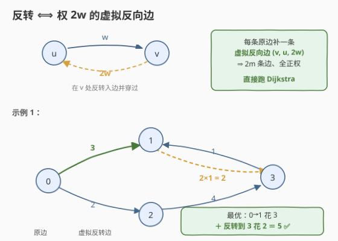
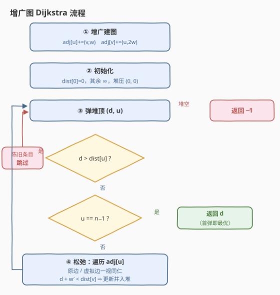

# 边反转的最小路径总成本

- **题目名称**：边反转的最小路径总成本
- **链接**：[3650. 边反转的最小路径总成本](https://leetcode.cn/problems/minimum-cost-path-with-edge-reversals/)
- **难度**：中等
- **标签**：图、最短路、Dijkstra、堆（优先队列）、建图技巧

## 1. 题目概述

**题意**：给定 $n$ 个节点（编号 $0 \sim n-1$）的**有向带权图**，`edges[i] = [u_i, v_i, w_i]` 表示一条 $u_i \to v_i$、成本为 $w_i$ 的有向边。

每个节点都有一个**最多可使用一次**的开关：当你**到达**节点 $u$ 且尚未用过它的开关时，可以对 $u$ 的一条**入边** $v \to u$ 激活开关，将该边**反转为** $u \to v$ 并**立即**穿过它。反转仅对那一次移动有效，穿越反转边的成本为 $2 w_i$。

返回从节点 $0$ 走到节点 $n-1$ 的**最小总成本**；无法到达返回 $-1$。

**示例 1**：

```text
输入：n = 4, edges = [[0,1,3],[3,1,1],[2,3,4],[0,2,2]]
输出：5
解释：先走 0 → 1（成本 3）；在节点 1 把入边 3 → 1 反转为 1 → 3 并立即穿过，成本 2×1 = 2；
      总成本 3 + 2 = 5。
```

**示例 2**：

```text
输入：n = 4, edges = [[0,2,1],[2,1,1],[1,3,1],[2,3,3]]
输出：3
解释：一次反转都不需要：0 → 2 → 1 → 3，成本 1 + 1 + 1 = 3。
```

**约束条件**：

- $2 \le n \le 5 \times 10^4$
- $1 \le \text{edges.length} \le 10^5$
- $0 \le u_i, v_i \le n-1$，$1 \le w_i \le 1000$

> 💡 **审题关键**：① 开关是**每个节点各一个**（不是全局共享），且只能作用在该节点自己的**入边**上；② 「立即穿过」意味着反转必须紧跟在「到达 $u$」之后，不能囤到以后再用；③ 反转只影响**那一次移动**，原图不会被永久改写；④ 穿越反转边的成本是 $2w_i$——**用边成本翻倍**，不是额外罚金。

---

## 2. 解题思路

### 2.1 暴力思路：把「哪些开关已用」编进状态

最直觉的做法是把状态设为 $(当前节点, 每个节点开关的使用情况)$——开关使用情况是一个 $n$ 位 01 串，状态数 $n \cdot 2^n$，$n = 5 \times 10^4$ 下直接爆炸。

退一步用 DFS/BFS 枚举所有 $0 \to n-1$ 的走法：每到一个节点，要么沿某条出边正常走，要么从入边中挑一条反转穿过——路径与反转决策的组合是指数级，同样不可行。

> ⚠️ 还有一个更隐蔽的坑：把约束弱化成「**全程至多反转一次**」，用 $(node, used)$ 两层状态跑 Dijkstra——这是**错误建模**。开关按节点计，最优解完全可能在**多个不同节点**各反转一次（见 2.2 末尾的反例）。本题的正解不是「少反转」，而是让「每节点至多一次」的约束**自动满足**。

### 2.2 核心观察：反转 ⟺ 权为 2w 的虚拟反向边，「每节点一次」自动满足



**观察一（反转的等价改写）**：「到达 $u$ 后反转入边 $v \to u$ 并立即穿过」⟺ 「从 $u$ 出发走一条**虚拟边** $u \to v$，边权 $2w$」。开关的「一次性」与「立即穿过」在路径模型里天然成立——虚拟边就是路径中紧跟着「到达 $u$」的那条出边，而路径至多经过 $u$ 一次。

**观察二（建图）**：对每条原边 $(u, v, w)$，**额外**加入反向边 $(v, u, 2w)$——注意挂在 **$v$ 的邻接表**上（原边 $u \to v$ 是 $v$ 的入边，到了 $v$ 才能反转它）。得到一个 $2m$ 条边、**边权全正**的**增广图**，于是：

$$\text{原问题} \iff \text{增广图上 } 0 \to n-1 \text{ 的最短路}$$

**观察三（约束自动满足）**：增广图边权全正（$w \ge 1$、$2w \ge 2$），最短路可取**简单路径**——若路径重复经过某节点，其中必含一个代价为正的环，删掉环代价更小。而简单路径**每个节点至多出现一次**，于是沿途每个节点的开关**至多被激活一次**，「每节点一次」的约束根本不需要编进状态。

两个方向夹逼，说明建模**严格等价**：

| 方向 | 论证 |
|------|------|
| 增广图最短路 ⟹ 合法方案 | 最短路取简单路径 ⟹ 每节点至多路过一次 ⟹ 开关至多用一次；把虚拟边逐条翻译回「到达即反转」的操作序列即可 |
| 合法方案 ⟹ 增广图路径 | 任何遵守规则的走法，把每次反转替换成对应的虚拟边，就得到增广图上一条**等代价**的 $0 \to n-1$ 路径 |

> ⚠️ **反例说明「全局只反转一次」是错解**：取 $n=4$，`edges = [[0,1,1],[2,1,1],[3,2,1],[0,3,100]]`。最优走法是 $0 \to 1$（成本 1），在 1 反转入边 $2 \to 1$ 穿到 2（成本 2），**再**在 2 反转入边 $3 \to 2$ 穿到 3（成本 2），总计 5；而「全程至多一次反转」的建模只能走昂贵的直达边 $0 \to 3$，得 100。本题开关按节点各算一个，简单路径论证免费放行**任意多个不同节点**上的反转。

### 2.3 算法流程图



**文字版步骤**：

| 步骤 | 操作 | 说明 |
|------|------|------|
| ① 增广建图 | `adj[u] += (v, w)` 且 `adj[v] += (u, 2*w)` | 原边 + 虚拟反向边，共 $2m$ 条 |
| ② 初始化 | `dist[0] = 0`，其余 $\infty$，堆压 `(0, 0)` | 小根堆按代价升序弹 |
| ③ 弹堆顶 | 取 `(d, u)` | `d > dist[u]` 为陈旧条目，跳过 |
| ④ 终点判定 | `u == n-1` 直接返回 `d` | 正权图首次弹出即最优 |
| ⑤ 遍历邻边 | 对 `adj[u]` 中每条 `(v, w')` | 原边与虚拟边**一视同仁** |
| ⑥ 松弛 | `d + w' < dist[v]` 才更新并入堆 | —— |
| ⑦ 堆空 | 返回 `-1` | 起点够不到终点 |

### 2.4 示例演算：示例 1

增广后共 8 条边：$0 \to 1\,(3)$、$1 \to 0\,(6)$、$3 \to 1\,(1)$、$1 \to 3\,(2)$、$2 \to 3\,(4)$、$3 \to 2\,(8)$、$0 \to 2\,(2)$、$2 \to 0\,(4)$。

| 弹出 | 松弛动作 | dist 快照（节点 0/1/2/3） |
|------|----------|--------------------------|
| `(0, 0)` | $0 \to 1$ 得 3；$0 \to 2$ 得 2 | `[0, 3, 2, ∞)` |
| `(2, 2)` | $2 \to 3$ 得 $2+4=6$；$2 \to 0$ 得 $6 > 0$ 不更新 | `[0, 3, 2, 6)` |
| `(3, 1)` | **虚拟边** $1 \to 3$ 得 $3+2=5 < 6$，反超！；$1 \to 0$ 得 $9 > 0$ 不更新 | `[0, 3, 2, 5)` |
| `(5, 3)` | $u = n-1$，**返回 5** | 堆里残留的 `(6, 3)` 成陈旧条目 |

> 💡 `dist[3]` 先被「正常边」路线写成 6，随后被「反转边」路线反超成 5——这正是虚拟边必须与原边**一视同仁地参与松弛**的直观体现。

---

## 3. 参考代码

### C++

```cpp
class Solution {
public:
    int minCost(int n, vector<vector<int>>& edges) {
        vector<vector<pair<int, int>>> adj(n);
        for (auto& e : edges) {
            int u = e[0], v = e[1], w = e[2];
            adj[u].push_back({v, w});      // 原边 u -> v
            adj[v].push_back({u, 2 * w});  // 虚拟反向边 v -> u（在 v 处反转入边）
        }

        const int INF = INT_MAX;
        vector<int> dist(n, INF);
        dist[0] = 0;
        priority_queue<pair<int, int>, vector<pair<int, int>>, greater<>> pq;
        pq.emplace(0, 0);

        while (!pq.empty()) {
            auto [d, u] = pq.top();
            pq.pop();
            if (d > dist[u]) continue;   // 陈旧条目
            if (u == n - 1) return d;    // 首次弹出即最优
            for (auto [v, w] : adj[u]) {
                if (d + w < dist[v]) {
                    dist[v] = d + w;
                    pq.emplace(d + w, v);
                }
            }
        }
        return -1;
    }
};
```

> 💡 **写法要点**：
> - `int` 足够：全正权 ⇒ `dist` 值都对应简单路径，至多 $n-1 \le 5\times10^4$ 条边、单边 $\le 2 \times 1000$，总代价 $\le 10^8 < INT\_MAX$。
> - 反向边挂在 **`v`** 的邻接表（`adj[v] += (u, 2w)`），方向别写反；自环、重边天然无害（$w > 0$ 时自环永远松弛失败）。
> - $n \ge 2$ 保证起点 ≠ 终点，无需特判 `n == 1`。

### Python

```python
from heapq import heappush, heappop

class Solution:
    def minCost(self, n: int, edges: List[List[int]]) -> int:
        adj = [[] for _ in range(n)]
        for u, v, w in edges:
            adj[u].append((v, w))      # 原边
            adj[v].append((u, 2 * w))  # 虚拟反向边

        INF = float("inf")
        dist = [INF] * n
        dist[0] = 0
        pq = [(0, 0)]  # (代价, 节点)

        while pq:
            d, u = heappop(pq)
            if d > dist[u]:
                continue
            if u == n - 1:
                return d
            for v, w in adj[u]:
                nd = d + w
                if nd < dist[v]:
                    dist[v] = nd
                    heappush(pq, (nd, v))
        return -1
```

---

## 4. 复杂度分析

| 维度 | 复杂度 | 说明 |
|------|--------|------|
| **时间复杂度** | $O((n + m) \log n)$ | 增广图 $n$ 点 $2m$ 边的堆优化 Dijkstra：每条边至多一次成功松弛入堆，每次堆操作 $O(\log)$ |
| **空间复杂度** | $O(n + m)$ | 邻接表 $O(2m)$ + `dist` 数组 $O(n)$ + 堆 $O(m)$ |

> - 建图增量只有 $m$ 条虚拟边，整个「开关机制」的代价仅仅是常数因子 2——这就是把复杂约束**折进边权**的红利。
> - 懒删除写法下堆中可能残留陈旧条目，堆大小上界 $O(m)$，弹出时被 `d > dist[u]` 一行拦截，不影响渐近界。

---

## 5. 扩展：约束该不该进状态？

本题最值得复盘的一点：**「每节点开关一次」最终没有出现在状态里**，因为它被「正权 ⟹ 简单最短路」隐含满足了。对照几个变体：

**变体一：开关全局只能用一次。** 约束不再被路径结构隐含，必须显式分层：状态 $(node, used)$，两层图各自内部跑原边，$used=0$ 层经虚拟边跳到 $used=1$ 层——即 [787. K 站中转内最便宜的航班](https://leetcode.cn/problems/cheapest-flights-within-k-stops/) 的分层套路。

**变体二：每个节点的开关能用 $k$ 次（$k \ge 2$）。** 同样分层：状态 $(node, j)$ 表示在 $node$ 已用 $j$ 次开关，虚拟边让 $j$ 加一，共 $n \times k$ 个节点跑 Dijkstra。判断标准就一条：**约束是否被「最短路可取简单路径」这类结构性质自动兜住**——兜得住就折进边权，兜不住就进状态分层。

**变体三：边权允许 0 或负。** 非负权时「删环不增代价」依然成立，简单最短路仍存在，结论不变；出现**负权**则两件事同时崩塌——Dijkstra 贪心失效，且最优解可能真的想绕负环重复访问节点，「每节点一次」无法自动满足，需要换 Bellman-Ford 族并重新审视约束。

---

## 6. 面试要点

**Q1：为什么「每个节点开关至多用一次」不用编进 Dijkstra 的状态？**

> 双向夹逼：① 增广图边权全正 ⇒ 最短路可取简单路径 ⇒ 每个节点至多路过一次 ⇒ 开关至多激活一次，增广图的最优解天然合法；② 任何合法操作序列把反转替换成虚拟边后就是增广图等代价路径。两侧最优值相等，约束被「正权 + 简单路径」的结构性质免费兜住。

**Q2：虚拟反向边到底怎么加？方向容易搞反在哪？**

> 原边 $(u, v, w)$ 是 $v$ 的**入边**，开关在 $v$ 上，所以反转产生的是从 $v$ 出发的边：`adj[v].push_back({u, 2*w})`。若错加成 `adj[u].push_back({v, 2*w})`，等于允许在 $u$ 反转自己的**出边**，与题意不符。

**Q3：最优解会不会在多个节点各反转一次？「全局只反转一次」的建模行不行？**

> 会，且该建模是错的。反例 `edges = [[0,1,1],[2,1,1],[3,2,1],[0,3,100]]`：真解 5（在 1 和 2 **各**反转一次），全局一次的建模只得 100。开关按节点计，恰好被简单路径论证自动放行。

**Q4：反转边的代价为什么是 `2*w`？会不会改变原图？**

> 题面规定穿越反转边的成本为 $2 w_i$；且反转「仅对那一次移动有效」——原图不变，所以虚拟边是**额外加入**的边，原边照常保留，两类边在 Dijkstra 里一视同仁参与松弛。

**Q5：与 743 网络延迟时间相比，本题多了什么？**

> 743 是静态正权单源最短路模板；本题的全部增量是**一次建图变换**——为每条边补一条 $2w$ 的虚拟反向边，把「开关机制」折进边权，然后原封不动跑 Dijkstra。审题时先找「约束是否可被结构性质隐含满足」，能则改图，不能则分层，这是最短路建模的通用决策路径。

---

## 7. 同类练习题

- [743. 网络延迟时间](https://leetcode.cn/problems/network-delay-time/)：堆优化 Dijkstra 静态模板，本题的基础形态
- [3604. 有向图中到达终点的最少时间](https://leetcode.cn/problems/minimum-time-to-reach-destination-in-directed-graph/)：同为「改造转移规则后跑 Dijkstra」的时间窗版，把等待折叠进 `max`
- [787. K 站中转内最便宜的航班](https://leetcode.cn/problems/cheapest-flights-within-k-stops/)：约束进状态的分层最短路，对照本题「约束自动满足无须进状态」
- [2203. 包含要求路径的最小带权子图](https://leetcode.cn/problems/minimum-weighted-subgraph-with-the-required-paths/)：多次 Dijkstra 结果组合求解的进阶应用
- [1928. 规定时间内到达终点的最小花费](https://leetcode.cn/problems/minimum-cost-to-reach-destination-in-time/)：把时间维编进状态防超时的 Dijkstra 变体
