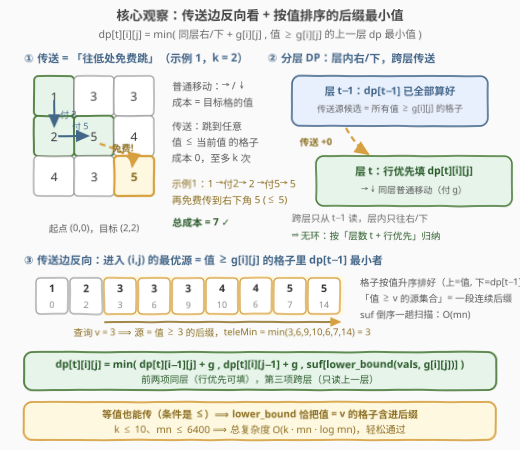
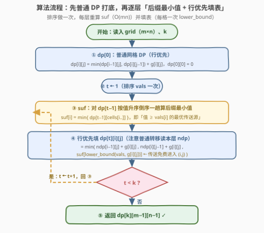

# LeetCode 带传送的最小路径成本 题解

## 1. 题目概述

- **标题 / 题号**：带传送的最小路径成本（#3651，hard）
- **链接**：https://leetcode.cn/problems/minimum-cost-path-with-teleportations/
- **难度**：困难
- **标签**：数组、动态规划、矩阵

**题意**：给定 $m \times n$ 的二维整数数组 `grid` 和整数 $k$。从左上角 $(0, 0)$ 出发（初始成本为 0），目标是到达右下角 $(m-1, n-1)$。两种移动方式：

- **普通移动**：从 $(i, j)$ 向右或向下移动一步，即到 $(i, j+1)$ 或 $(i+1, j)$，成本为**目标格**的值；
- **传送**：从任意 $(i, j)$ 一次性跳到任意满足 $\text{grid}[x][y] \le \text{grid}[i][j]$ 的格子 $(x, y)$，成本为 **0**，全程至多使用 $k$ 次。

返回到达右下角的最小总成本。

**示例 1**：

```text
输入：grid = [[1,3,3],[2,5,4],[4,3,5]], k = 2
输出：7
解释：(0,0) 向下到 (1,0) 付 2，向右到 (1,1) 付 5，再从值 5 的格子免费传送到右下角 (2,2)（其值 5 ≤ 5），总成本 7。
```

**示例 2**：

```text
输入：grid = [[1,2],[2,3],[3,4]], k = 1
输出：9
解释：找不到有利的传送，退化为普通路径 2 + 3 + 4 = 9。
```

**约束**：

- $2 \le m, n \le 80$
- $0 \le \text{grid}[i][j] \le 10^4$
- $0 \le k \le 10$

> 💡 **审题关键**：① 起点成本为 0，普通移动付的是**目标格**的值（不是当前格）；② 传送方向受限——落点必须**值不超过当前格**，即「往低处（或等值处）免费跳」，因此传送的价值在于「花小钱走上高处，再免费跳过一大段」；③ $mn \le 6400$、$k \le 10$，「位置 × 已传送次数」的状态只有约 $7 \times 10^4$ 个——**分层 DP** 的信号非常明显。

## 2. 解题思路

### 2.1 暴力思路：状态图最短路

把「位置 + 已用传送次数」建成图：点 $(i, j, t)$；普通边 $(i,j,t) \to (i,j+1,t)$、$(i,j,t) \to (i+1,j,t)$，权为 $\text{grid}$；传送边 $(i,j,t) \to (x,y,t+1)$（须 $\text{grid}[x][y] \le \text{grid}[i][j]$），权 0。跑 Dijkstra 求最短路。

点数 $O(mnk) \approx 7 \times 10^4$ 看似无害，但**每个点的传送边多达 $mn$ 条**，总边数 $\approx 6400 \times 10 \times 6400 \approx 4 \times 10^8$——建图与松弛双双爆炸；直接枚举所有「走 + 传」交错序列更是指数级。

这步建模的价值在于点明瓶颈：**传送边太多**。下面的优化全部围绕「如何不显式枚举传送边」展开。

### 2.2 核心观察：分层 DP + 传送边反向 + 值域后缀最小值



**观察一（传送只能「降值」）**：传送落点必须满足 $\text{grid}[x][y] \le \text{grid}[i][j]$——传送是一次**免费的下降**。它让「先走上高处、再免费跳到远处的低格」成为可能；而普通移动永远是一格一格付费。极端例子：`grid` 全为同一值且 $k \ge 1$ 时，从 $(0,0)$ 直接免费传到右下角，答案为 0。

**观察二（分层 DP）**：令

$$dp[t][i][j] = \text{至多使用 } t \text{ 次传送、到达 } (i,j) \text{ 的最小成本}$$

转移有三项——前两项**同层**（行优先一趟可填），第三项**跨层**（只读上一层）：

$$dp[t][i][j] = \min\begin{cases} dp[t][i-1][j] + \text{grid}[i][j] & \text{（从上方普通走）}\\[2pt] dp[t][i][j-1] + \text{grid}[i][j] & \text{（从左方普通走）}\\[2pt] \displaystyle\min_{\text{grid}[x][y] \,\ge\, \text{grid}[i][j]} dp[t-1][x][y] & \text{（传送进入 } (i,j)\text{）}\end{cases}$$

答案即 $dp[k][m-1][n-1]$（预算不设上限用不完也无妨，$dp[t] \le dp[t-1]$）。

> ⚠️ 注意传送项的**方向反转**：从 $(x,y)$ 传到 $(i,j)$ 的条件 $\text{grid}[i][j] \le \text{grid}[x][y]$，站在**目的地**视角，候选源恰好是「**值 $\ge \text{grid}[i][j]$ 的全部格子**」。若从源视角正向推，每个格子要向至多 $mn$ 个目的地连边，每层 $O((mn)^2)$；反过来看，它只是一个**按值阈值查询的最小值**！

**观察三（后缀最小值 O(1) 查询）**：把全部 $mn$ 个格子按值**升序**排成数组 $\text{vals}$（排序一次，每层复用），对上一层 $dp[t-1]$ 倒序一趟算出后缀最小值数组

$$\text{suf}[i] = \min_{i' \ge i} dp[t-1][\text{cells}[i']]$$

则第三项 $= \text{suf}[\mathrm{lower\_bound}(\text{vals},\ \text{grid}[i][j])]$。等值格子也能作为源（条件是 $\le$），`lower_bound` 取「第一个 $\ge v$ 的位置」，其后缀恰好把等值格也包含在内。即使把 $(i,j)$ 自己也算进源集合也无妨——$dp[t] \le dp[t-1]$，不会更差。

**正确性（无环）**：跨层传送只读第 $t-1$ 层（计算层 $t$ 前已完整算出）；层内普通移动只从上方/左方取值，行优先遍历天然是其拓扑序。对「层数 $t$ + 层内行优先位置」做双重归纳可知：任意「普通 + 传送」的交错序列（包括连续多次传送，对应连续跨层）都被覆盖。

> 💡 **一句话总结**：传送边太多删不掉，但**反向看**之后，「进入某格的最优传送」坍缩成「值 ≥ 某阈值的格子中上一层的最小 dp」——排序 + 后缀 min 一趟解决。

### 2.3 算法流程图



**文字版步骤**：

| 步骤 | 操作 | 说明 |
|------|------|------|
| ① 打底 | 行优先算 $dp[0]$ | 纯普通移动的网格 DP，$dp[0][0][0] = 0$ |
| ② 排序 | 格子按值升序得 `vals` | 只做一次，$O(mn\log mn)$，每层复用 |
| ③ 后缀 min | 对 $dp[t-1]$ 倒序一趟算 `suf` | $\text{suf}[i] = \min_{i' \ge i} dp[t-1][\text{cells}[i']]$，$O(mn)$ |
| ④ 填层 | 行优先填 $dp[t][i][j] = \min(\text{上}+g,\ \text{左}+g,\ \text{suf}[\mathrm{lb}(\text{vals}, g_{ij})])$ | 传送项一次 `lower_bound`，$O(\log mn)$ |
| ⑤ 循环 | $t$ 从 $1$ 到 $k$ 重复 ③④ | 共 $k$ 层 |
| ⑥ 返回 | $dp[k][m-1][n-1]$ | |

### 2.4 示例演算

以示例 1（$k = 2$）为例。先算 $dp[0]$（纯普通移动）：

```text
0   3   6
2   7   10
6   9   14
```

$t = 1$：对 $dp[0]$ 按值升序倒序算后缀最小值，再逐格取三候选的最小：

```text
0   3   3        (2,1) 的 3 来自传送：值 ≥ 3 的源里 dp[0] 最小为 3（格 (0,1)）
2   7   6        (2,2) 的 7 = 传送自 (1,1)：其值 5 ≥ 5，dp[0] = 7
6   3   7
```

$t = 2$：同法再推一层，$dp[2]$ 与 $dp[1]$ 完全相同（已收敛）：

```text
0   3   3
2   7   6
6   3   7
```

答案 $dp[2][2][2] = 7$ ✓。示例 2（$k = 1$）：所有「值 ≥ 落点值」的传送源都不比普通路径便宜——逐格验证 $dp[1] = dp[0]$，传送一次也白给，答案仍为 $9$ ✓。

## 3. 参考代码

### C++

```cpp
class Solution {
public:
    int minCost(vector<vector<int>>& grid, int k) {
        int m = grid.size(), n = grid[0].size();
        const int INF = 1e9;

        // 格子按值升序排好，vals 供每层 lower_bound 复用
        vector<array<int, 3>> cells(m * n);          // (值, i, j)
        for (int i = 0; i < m; ++i)
            for (int j = 0; j < n; ++j)
                cells[i * n + j] = {grid[i][j], i, j};
        sort(cells.begin(), cells.end());
        vector<int> vals(m * n);
        for (int i = 0; i < m * n; ++i) vals[i] = cells[i][0];

        // dp[0]：普通网格 DP 打底
        vector<vector<int>> dp(m, vector<int>(n, INF));
        dp[0][0] = 0;
        for (int i = 0; i < m; ++i)
            for (int j = 0; j < n; ++j) {
                if (!i && !j) continue;
                int best = INF;
                if (i) best = min(best, dp[i - 1][j]);
                if (j) best = min(best, dp[i][j - 1]);
                dp[i][j] = best + grid[i][j];
            }

        for (int t = 1; t <= k; ++t) {
            // suf[i] = dp[t-1] 在「值 >= vals[i] 的后缀」上的最小值
            vector<int> suf(m * n + 1, INF);
            for (int i = m * n - 1; i >= 0; --i)
                suf[i] = min(suf[i + 1], dp[cells[i][1]][cells[i][2]]);

            vector<vector<int>> ndp(m, vector<int>(n, INF));
            ndp[0][0] = 0;
            for (int i = 0; i < m; ++i)
                for (int j = 0; j < n; ++j) {
                    if (!i && !j) continue;
                    int best = suf[lower_bound(vals.begin(), vals.end(),
                                               grid[i][j]) - vals.begin()];
                    if (i) best = min(best, ndp[i - 1][j] + grid[i][j]);
                    if (j) best = min(best, ndp[i][j - 1] + grid[i][j]);
                    ndp[i][j] = best;
                }
            dp = move(ndp);
        }
        return dp[m - 1][n - 1];
    }
};
```

> 💡 **写法要点**：
> - 排序与 `vals` 只算一次、每层复用；每层只需重算 `suf`（倒序一趟 $O(mn)$）。
> - 传送候选先取 `suf[...]`，再与普通转移取 min——注意普通转移必须读**本层**的 `ndp`（同层右/下），读成上一层的 `dp` 会漏掉「先传送、再普通走」的路径。
> - 成本上界 $\le (m + n) \times 10^4 \approx 1.6 \times 10^6$，`int` 足够；`INF` 取 $10^9$，做加法也不会溢出。

### Python

```python
from bisect import bisect_left

class Solution:
    def minCost(self, grid: List[List[int]], k: int) -> int:
        m, n = len(grid), len(grid[0])
        cells = sorted((grid[i][j], i, j) for i in range(m) for j in range(n))
        vals = [c[0] for c in cells]
        INF = float('inf')

        # dp[0]：普通网格 DP 打底
        dp = [[INF] * n for _ in range(m)]
        dp[0][0] = 0
        for i in range(m):
            for j in range(n):
                if i or j:
                    best = INF
                    if i:
                        best = min(best, dp[i - 1][j])
                    if j:
                        best = min(best, dp[i][j - 1])
                    dp[i][j] = best + grid[i][j]

        for _ in range(k):
            # suf[i] = dp（上一层）在「值 >= vals[i] 的后缀」上的最小值
            suf = [INF] * (len(cells) + 1)
            for idx in range(len(cells) - 1, -1, -1):
                _, x, y = cells[idx]
                suf[idx] = min(suf[idx + 1], dp[x][y])
            ndp = [[INF] * n for _ in range(m)]
            ndp[0][0] = 0
            for i in range(m):
                for j in range(n):
                    if i or j:
                        best = suf[bisect_left(vals, grid[i][j])]
                        if i:
                            best = min(best, ndp[i - 1][j] + grid[i][j])
                        if j:
                            best = min(best, ndp[i][j - 1] + grid[i][j])
                        ndp[i][j] = best
            dp = ndp
        return dp[m - 1][n - 1]
```

> 两份代码已对示例与随机小规模数据（对拍 Dijkstra 状态图最短路）验证一致。

## 4. 复杂度分析

| 维度 | 复杂度 | 说明 |
|------|--------|------|
| **时间复杂度** | $O\big((k+1) \cdot mn \cdot \log mn\big)$ | 排序一次 $O(mn\log mn)$；每层「倒序后缀 min $O(mn)$ + 每格一次 `lower_bound` $O(\log mn)$」。$mn \le 6400$、$k \le 10$，约 $10^6$ 量级基本操作 |
| **空间复杂度** | $O(mn)$ | 排序数组 `cells`/`vals`、`suf` 与滚动两层 dp |

> - 若把每格的查询位置（`lower_bound` 结果）预处理成秩数组，填表降为每层 $O(mn)$，总复杂度 $O(mn\log mn + k \cdot mn)$——对本题规模纯属锦上添花。
> - 对比朴素建图 Dijkstra 的 $O\big(k \cdot (mn)^2\big)$ 级别边数：**反向边 + 后缀 min** 把「传送」这一维的代价从乘 $mn$ 降到乘 $\log mn$。

## 5. 扩展：传送 / 免费跳跃一族

- **$k$ 上界放大怎么办**：可证存在最优路径，其中**每个格子至多作为一次传送源**——若同一格两次作为源，两次访问之间的段落构成回路，删掉该回路后成本不增、传送次数不增、所有传送约束仍满足。故 $t \ge mn$ 后 $dp[t]$ 收敛，$k$ 巨大时只需跑 $\min(k, mn)$ 层。
- **传送方向反转（只能往值更大处传）**：把排序与聚合方向对调——「值 $\le v$ 的源集合的最小值」用升序 + **前缀** min。套路不变：**反向看边 + 值域阈值聚合**。
- **Dijkstra / 0-1 BFS 视角的等价性**：把 $(i, j, t)$ 当点、普通边权 $g$、传送边权 0 跑 0-1 BFS 同样正确；其中传送边的批量松弛同样靠「值 $\ge$ 阈值的 min-dist」结构完成——本质就是本文的分层 DP。参见 [2290](https://leetcode.cn/problems/minimum-obstacle-removal-to-reach-corner/) 的 0/1 边权处理。
- **「传送次数进状态」的一般化**：凡「某种昂贵/受限操作至多用 $k$ 次」的问题（删边、加速、免费跳），都可把使用次数塞进状态维度做分层；关键往往是像本题一样，找到让跨层转移可**批量计算**的结构。

## 6. 面试要点

**Q1：为什么要「反向」看传送边？**

> 正向看，每个格子作为源要向至多 $mn$ 个「值 ≤ 自己」的目的地连边，一层就是 $O((mn)^2)$；反向看，「进入 $(i,j)$ 的最优传送」= 所有**值 $\ge \text{grid}[i][j]$** 的格子在上一层的 dp 最小值——候选集合只由值阈值决定、与位置无关，按值排序后就是一段连续后缀，倒序一趟后缀 min，每格 $O(\log mn)$（预处理秩后 $O(1)$）即可回答。

**Q2：分层 DP 为什么没有环、遍历顺序为什么对？**

> 跨层传送只读第 $t-1$ 层（算第 $t$ 层前已完整求出）；层内普通移动只从上方/左方取值，行优先遍历天然是其拓扑序。对「层数 + 层内行优先位置」做双重归纳，任意「普通 + 传送」交错序列（含连续多次传送，对应连续跨层）都被覆盖。

**Q3：等值格子能作为传送源吗？`lower_bound` 为什么恰好正确？**

> 能。条件是 $\text{grid}[x][y] \le \text{grid}[i][j]$（含等号）。`vals` 升序时 `lower_bound(vals, v)` 返回第一个 $\ge v$ 的位置，其后缀恰好是「值 $\ge v$」的**全部**格子（含等值格）。即便把 $(i,j)$ 自己也算进源也无妨——$dp[t] \le dp[t-1]$，结果不会更差。

**Q4：传送什么时候威力最大？什么时候完全无用？**

> 威力最大：网格存在「能低成本走上去的高值格」且远处有低值落点时——免费瞬移跳过整段付费路；极端情形 `grid` 全同值且 $k \ge 1$，从 $(0,0)$ 直接传到右下角，答案 0。完全无用：如示例 2，所有「值 ≥ 落点值」的源格要么自身 dp 更贵、要么传送后仍躲不开高价路，逐层 $dp[t] = dp[0]$。

**Q5：普通转移读本层 `ndp` 还是上一层 `dp`，有什么讲究？**

> 必须读本层 `ndp`：传送预算「至多 $t$ 次」意味着传送之后的普通移动仍占 $t$ 的预算，属于第 $t$ 层；若读上一层的 `dp`，会漏掉「先传送、再普通走」这类路径（前缀用了满 $t$ 次传送的方案）。这也是新手实现分层 DP 时最常见的 off-by-one 错误。

## 同类练习题

| # | 题目 | 与本题的关联 |
|---|------|-------------|
| 2304 | [网格中的最小路径代价](https://leetcode.cn/problems/minimum-path-cost-in-a-grid/) | 本题去掉传送的纯净版——行优先网格 DP 的打底功 |
| 1631 | [最小体力消耗路径](https://leetcode.cn/problems/path-with-minimum-effort/) | 网格上「最小化路径边权最大值」的 Dijkstra/二分——换一种目标函数的网格路径题 |
| 2577 | [在网格中访问单元格的最少时间](https://leetcode.cn/problems/minimum-time-to-visit-a-cell-in-a-grid/) | 带「必须等待」约束的网格最短路，体会「额外条件进状态」与优先队列松弛 |
| 2290 | [到达角落需要移除障碍物的最小数量](https://leetcode.cn/problems/minimum-obstacle-removal-to-reach-corner/) | 0/1 边权网格 0-1 BFS——本文「传送边权 0」的近亲解法 |
| 3629 | [通过质数传送到达终点的最少跳跃次数](https://leetcode.cn/problems/minimum-jumps-to-reach-end-via-prime-teleportation/) | 另一道「传送」题，传送规则按质数定义，对比本题「按值单调」的传送条件 |
