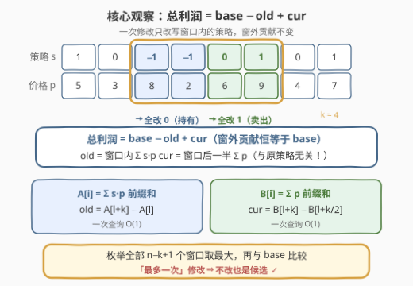
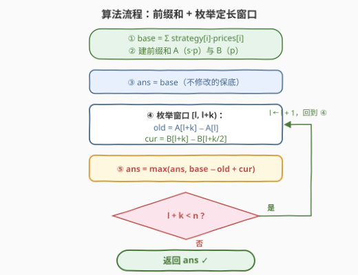

# 按策略买卖股票的最佳时机

- **题目名称**：按策略买卖股票的最佳时机
- **链接**：[3652. 按策略买卖股票的最佳时机](https://leetcode.cn/problems/best-time-to-buy-and-sell-stock-using-strategy/)
- **难度**：中等
- **标签**：数组、前缀和、滑动窗口

## 1. 题目概述

给你两个整数数组 `prices` 和 `strategy`，长度相同：

- `prices[i]` 表示第 $i$ 天某股票的价格；
- `strategy[i]` 表示第 $i$ 天的交易策略：`-1` 买入一单位、`0` 持有、`1` 卖出一单位。

**利润**定义为所有天中 $\text{strategy}[i] \times \text{prices}[i]$ 的总和。

再给你一个**偶数**整数 `k`，你可以对 `strategy` 进行**最多一次**修改。一次修改包括：

1. 选择 `strategy` 中**恰好 $k$ 个连续**元素；
2. 将前 $k/2$ 个元素设为 `0`（持有）；
3. 将后 $k/2$ 个元素设为 `1`（卖出）。

返回你可以获得的**最大**可能利润。题目保证没有预算或持仓数量的限制，所有买卖操作均可行。

**示例 1**：

```text
输入：prices = [4,2,8], strategy = [-1,0,1], k = 2
输出：10
解释：修改下标 [0,1] 这一段（k=2：前 1 个改 0，后 1 个改 1），
     strategy 变为 [0,1,1]，利润 = 0×4 + 1×2 + 1×8 = 10。
```

**示例 2**：

```text
输入：prices = [5,4,3], strategy = [1,1,0], k = 2
输出：9
解释：任何修改都不优——不改时利润 = 5 + 4 + 0 = 9 已经是最大值。
```

**约束条件**：

- $2 \le n = \text{prices.length} = \text{strategy.length} \le 10^5$
- $1 \le \text{prices}[i] \le 10^5$
- $-1 \le \text{strategy}[i] \le 1$
- $2 \le k \le n$，且 $k$ 为偶数

> 💡 **审题关键**：① 修改是「**最多**一次」——不改也是合法方案，答案至少是原始利润 `base`（示例 2 正是如此）；② 替换模式**写死**：前 $k/2$ 个恒改 `0`、后 $k/2$ 个恒改 `1`，因此新窗口的贡献**与原策略无关**，只取决于后 $k/2$ 天的价格和；③ 利润是 $s_i \cdot p_i$ 的**线性求和**，修改的影响完全局限在窗口内部。

---

## 2. 解题思路

### 2.1 暴力思路

枚举每个窗口起点 $l$（共 $n-k+1$ 个），把窗口替换成「前半 0、后半 1」后**重算整个数组**的利润，取最大值。每个窗口重算 $O(n)$，总计 $O(n^2)$——$n = 10^5$ 时约 $10^{10}$ 次运算，必然超时。

瓶颈在于：**窗口外的贡献每次都被重复计算**。事实上窗口外的 $s_i p_i$ 逐项不变，其总和恒等于原始利润 `base`，真正变化的只有窗口内部这一小段。

### 2.2 核心观察：利润 = base − old + cur



**观察一：影响局部化。** 把总利润按「窗口外 / 窗口内」拆开，一次修改只改写下标在 $[l, l+k)$ 内的策略值，窗外贡献分毫未动：

$$\text{利润}(l) = \underbrace{\sum_{i \notin [l,\,l+k)} s_i p_i}_{=\ \text{base}} \;-\; \underbrace{\sum_{i=l}^{l+k-1} s_i p_i}_{\text{old：原窗口贡献}} \;+\; \underbrace{\sum_{i=l+k/2}^{l+k-1} p_i}_{\text{cur：新窗口贡献}}$$

**观察二：新窗口贡献是只依赖 $l$ 的定值。** 替换规则把前 $k/2$ 个位置硬编码为 $0$（贡献 $0 \cdot p = 0$）、后 $k/2$ 个硬编码为 $1$（贡献 $p$），所以：

$$\text{cur}(l) = \text{窗口后 } k/2 \text{ 天的价格和}$$

它与窗口里**原来的策略是什么完全无关**——这是本题最容易被忽略的简化点。

**观察三：两个区间和各用一组前缀和 $O(1)$ 查询。**

- $A[i] = \sum_{j<i} s_j p_j$（加权和前缀），则 $\text{old} = A[l+k] - A[l]$；
- $B[i] = \sum_{j<i} p_j$（价格前缀），则 $\text{cur} = B[l+k] - B[l+k/2]$。

于是最终答案为：

$$\text{ans} = \max\Big(\text{base},\ \max_{0 \le l \le n-k}\ \big(\text{base} - \text{old}(l) + \text{cur}(l)\big)\Big)$$

> ⚠️ **溢出**：$n \cdot \max p \le 10^5 \times 10^5 = 10^{10}$，总利润可达 $10^{10}$ 量级，超出 32 位 int 范围，C++ 必须用 `long long`。

### 2.3 算法流程图



**逻辑执行步骤**：

| 步骤 | 操作 | 说明 |
|------|------|------|
| ① 算 base | $\text{base} = \sum s_i p_i$ | 不修改时的原始利润 |
| ② 建前缀 | $A$（$s \cdot p$ 前缀）、$B$（$p$ 前缀） | 一趟 $O(n)$ |
| ③ 保底 | `ans = base` | 「最多一次」修改 ⇒ 不改也是候选 |
| ④ 枚举窗口 | $l$ 从 $0$ 到 $n-k$ | 共 $n-k+1$ 个定长窗口 |
| ⑤ O(1) 查询 | $\text{old} = A[l{+}k]-A[l]$，$\text{cur} = B[l{+}k]-B[l{+}k/2]$ | 两组前缀和各查一次 |
| ⑥ 收答案 | $\text{ans} = \max(\text{ans},\ \text{base} - \text{old} + \text{cur})$ | 遍历完返回 `ans` |

### 2.4 示例演算

**示例 1：prices = [4,2,8]，strategy = [-1,0,1]，k = 2（答案 10）**。base = $(-1){\times}4 + 0{\times}2 + 1{\times}8 = 4$：

| 窗口 $[l, l+k)$ | old（原窗口贡献） | cur（新窗口贡献） | base − old + cur |
|---|---|---|---|
| $[0, 2)$ | $(-1){\times}4 + 0{\times}2 = -4$ | $p_1 = 2$ | $4 + 4 + 2 = \mathbf{10}$ |
| $[1, 3)$ | $0{\times}2 + 1{\times}8 = 8$ | $p_2 = 8$ | $4 - 8 + 8 = 4$ |

$\text{ans} = \max(4, 10, 4) = 10$ ✓——窗口 $[0,2)$ 把亏钱的「第 0 天买入」抹掉（改持有），同时把第 1 天改成卖出，白赚 $p_1 = 2$。

**示例 2：prices = [5,4,3]，strategy = [1,1,0]，k = 2（答案 9）**。base = $5 + 4 + 0 = 9$；窗口 $[0,2)$ 给出 $9 - 9 + 4 = 4$，窗口 $[1,3)$ 给出 $9 - 4 + 3 = 8$。所有候选都不超过 base，**不改就是最优**——这正是「最多一次」而非「恰好一次」的意义。

---

## 3. 参考代码

### C++

```cpp
class Solution {
public:
    long long maxProfit(vector<int>& prices, vector<int>& strategy, int k) {
        int n = prices.size();
        vector<long long> A(n + 1), B(n + 1);   // A: s*p 前缀和, B: p 前缀和
        for (int i = 0; i < n; ++i) {
            A[i + 1] = A[i] + 1LL * strategy[i] * prices[i];
            B[i + 1] = B[i] + prices[i];
        }
        long long ans = A[n];                   // 不修改的保底
        int h = k / 2;
        for (int l = 0; l + k <= n; ++l) {
            long long old = A[l + k] - A[l];    // 原窗口贡献
            long long cur = B[l + k] - B[l + h];// 新窗口贡献 = 后 k/2 天价格和
            ans = max(ans, A[n] - old + cur);
        }
        return ans;
    }
};
```

> 💡 **写法要点**：
> - 乘积处写 `1LL * strategy[i] * prices[i]`，先提 `long long` 再乘，防中间结果按 `int` 溢出；
> - `ans` 初值取 `A[n]`（即 base），天然覆盖「不改」的分支，无需特判；
> - 循环条件 `l + k <= n` 与前缀下标 `A[l+k]` 严格对齐（前缀数组开 $n+1$ 长）。

### Python

```python
class Solution:
    def maxProfit(self, prices: List[int], strategy: List[int], k: int) -> int:
        n = len(prices)
        A = [0] * (n + 1)   # A[i] = 前 i 天 strategy[j]*prices[j] 之和
        B = [0] * (n + 1)   # B[i] = 前 i 天 prices[j] 之和
        for i, (p, s) in enumerate(zip(prices, strategy)):
            A[i + 1] = A[i] + s * p
            B[i + 1] = B[i] + p

        ans = A[n]          # 不修改的保底
        h = k // 2
        for l in range(n - k + 1):
            old = A[l + k] - A[l]            # 原窗口贡献
            cur = B[l + k] - B[l + h]        # 新窗口贡献 = 后 k/2 天价格和
            ans = max(ans, A[n] - old + cur)
        return ans
```

> 💡 本解已用「枚举全部替换方案的暴力」对拍验证（官方两例 + 3000 组随机数据均一致）。

---

## 4. 复杂度分析

| 维度 | 复杂度 | 说明 |
|------|--------|------|
| **时间复杂度** | $O(n)$ | 一趟建两组前缀和 $O(n)$ + 枚举 $n-k+1$ 个窗口、每个 $O(1)$ 查询 |
| **空间复杂度** | $O(n)$ | 两组前缀和数组；可用增量维护降到 $O(1)$（见第 5 节） |

> - 对比暴力 $O(n^2)$：把「重算全数组」拆成「常量 base + 两个 $O(1)$ 区间和」，是前缀和最典型的应用方式。
> - 窗口长度 $k$ 固定，本质是**定长滑动窗口**；只是本题窗口内的值不是简单求和，而是「替换成固定模式」的增量，故需要两组前缀分别服务 old 与 cur。

---

## 5. 扩展：O(1) 空间的滑动窗口写法

窗口从 $l$ 滑到 $l+1$ 时，`old` 与 `cur` 都能**增量维护**，省掉两个前缀数组：

$$\text{old}(l{+}1) = \text{old}(l) - s_l p_l + s_{l+k} p_{l+k}$$

$$\text{cur}(l{+}1) = \text{cur}(l) - p_{l+k/2} + p_{l+k}$$

```cpp
long long maxProfit(vector<int>& prices, vector<int>& strategy, int k) {
    int n = prices.size(), h = k / 2;
    long long base = 0, old = 0, cur = 0;
    for (int i = 0; i < n; ++i) base += 1LL * strategy[i] * prices[i];
    for (int i = 0; i < k; ++i)  old += 1LL * strategy[i] * prices[i];
    for (int i = h; i < k; ++i)  cur += prices[i];          // 初始窗口 [0, k)
    long long ans = max(base, base - old + cur);
    for (int l = 1; l + k <= n; ++l) {
        old += 1LL * strategy[l + k - 1] * prices[l + k - 1] - 1LL * strategy[l - 1] * prices[l - 1];
        cur += prices[l + k - 1] - prices[l + h - 1];
        ans = max(ans, base - old + cur);
    }
    return ans;
}
```

> ⚠️ 注意 `cur` 滑动时进的是 $p_{l+k-1}$、出的是 $p_{l+h-1}$（后 $k/2$ 天的左端点），两个下标错一位是这类增量写法的高频笔误点。面试建议先写前缀和版本保证正确性，再口头给出上述递推展示优化意识。

---

## 6. 面试要点

**Q1：为什么窗口外的贡献不用重算？**

> 利润是 $\sum s_i p_i$ 的**线性函数**，修改只改写下标在 $[l, l+k)$ 内的 $s$ 值，窗口外每一项 $s_i p_i$ 都不变。所以总利润 = base − old + cur，暴力里反复重算的窗外部分其实是常量。

**Q2：新窗口贡献为什么与原 strategy 无关？**

> 替换规则把前 $k/2$ 个位置硬编码为 $0$、后 $k/2$ 个硬编码为 $1$：$0 \times p = 0$ 全部消掉，$1 \times p = p$ 全部保留，所以新贡献就是**后 $k/2$ 天的价格和**，只依赖 prices 与窗口位置 $l$。

**Q3：为什么答案要和 base 取 max，而不是直接取最大增量？**

> 题目允许「**最多**一次」修改，不改也是合法方案（示例 2 的最优就是不改）。若所有窗口的增量 $\text{cur} - \text{old}$ 都为负，强行修改反而亏，答案应回落到 base。

**Q4：C++ 实现有哪些细节坑？**

> ① 溢出：$|\text{利润}| \le n \cdot \max p \le 10^{10}$，前缀和与返回值都要 `long long`，乘法要 `1LL * s * p`；② 边界：$k$ 可以等于 $n$（只剩一个窗口），前缀数组开 $n+1$ 长、循环条件 `l + k <= n` 即自然覆盖；③ 别忘了 `cur` 查的是 $B[l+k] - B[l+k/2]$，中点下标是「后一半的起点」。

**Q5：这题和普通定长滑窗（如 643 子数组最大平均数）有何异同？**

> 相同：窗口长度固定、都是线性扫描 $O(n)$。不同：普通滑窗求「窗口内元素和」，增量为「进一个出一个」；本题窗口内的值是「替换成固定模式」后的贡献，需要**两组前缀和**分别服务 old（原加权和）与 cur（后一半价格和），增量递推也要各自维护。

> 💡 **一句话总结**：3652 = base + 定长窗口增益。带走的三个细节：线性拆分窗外/窗内、新贡献是后 $k/2$ 天价格和（与原策略无关）、双前缀和 $O(1)$ 查询 + `long long` 防溢出。

---

## 7. 同类练习题

- [1052. 爱生气的书店老板](https://leetcode.cn/problems/grumpy-bookstore-owner/)：同为「base + 定长窗口增益」套路——不生气分钟的顾客是 base，技能覆盖窗口内被气走的顾客是增益，结构几乎一样
- [1423. 可获得的最大点数](https://leetcode.cn/problems/maximum-points-you-can-obtain-from-cards/)：从两端取恰好 k 张 = 留下长度 n−k 的中间窗口，「总和 − 窗口」与本题「base + Δ(窗口)」互为镜像
- [643. 子数组最大平均数 I](https://leetcode.cn/problems/maximum-average-subarray-i/)：最裸的定长滑窗入门，练习「进一个出一个」的增量递推基本功
- [303. 区域和检索 - 数组不可变](https://leetcode.cn/problems/range-sum-query-immutable/)：前缀和区间和 $O(1)$ 查询的模板题，本题 A/B 两组前缀的直接源头
- [724. 寻找数组的中心下标](https://leetcode.cn/problems/find-pivot-index/)：前缀和 + 一处划分点两侧快速求和，体会「把全局和拆成两段」的通用思路
