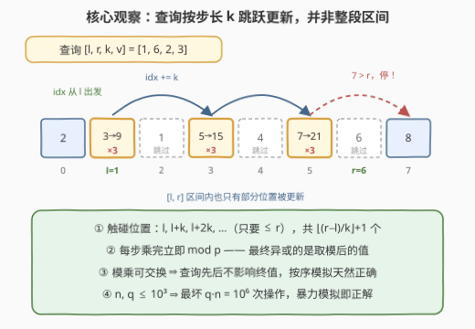
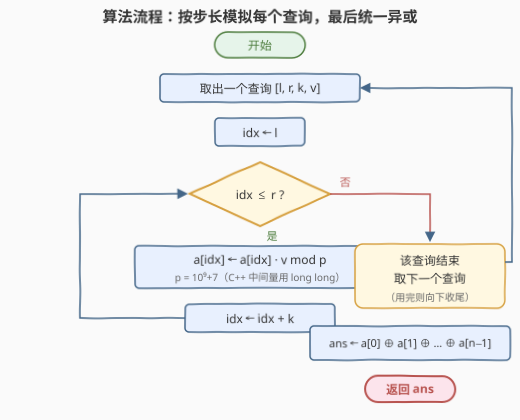

# LeetCode 区间乘法查询后的异或 I 题解

## 1. 题目概述

- **标题 / 题号**：区间乘法查询后的异或 I（#3653，medium）
- **链接**：https://leetcode.cn/problems/xor-after-range-multiplication-queries-i/
- **难度**：中等
- **标签**：数组、模拟

**题意**：给定长度为 $n$ 的整数数组 $nums$ 和查询数组 $queries$，其中 $queries[i] = [l_i, r_i, k_i, v_i]$。每个查询的执行方式是：设 $idx = l_i$，当 $idx \le r_i$ 时反复执行

$$nums[idx] \leftarrow \big(nums[idx] \cdot v_i\big) \bmod (10^9 + 7), \qquad idx \leftarrow idx + k_i$$

也就是**按步长 $k_i$ 跳着**把 $[l_i, r_i]$ 内的一部分位置乘上 $v_i$。所有查询处理完后，返回数组全部元素的**按位异或**结果。

**示例 1**：

```text
输入：nums = [1,1,1], queries = [[0,2,1,4]]
输出：4
解释：查询 [0,2,1,4] 把下标 0、1、2 都乘以 4，数组变为 [4,4,4]；
      异或为 4 ^ 4 ^ 4 = 4。
```

**示例 2**：

```text
输入：nums = [2,3,1,5,4], queries = [[1,4,2,3],[0,2,1,2]]
输出：31
解释：查询 [1,4,2,3] 只碰下标 1、3（步长 2），数组变为 [2,9,1,15,4]；
      查询 [0,2,1,2] 碰下标 0、1、2，数组变为 [4,18,2,15,4]；
      异或为 4 ^ 18 ^ 2 ^ 15 ^ 4 = 31。
```

**约束**：

- $1 \le n = nums.length \le 10^3$
- $1 \le nums[i] \le 10^9$
- $1 \le q = queries.length \le 10^3$
- $queries[i] = [l_i, r_i, k_i, v_i]$，$0 \le l_i \le r_i < n$，$1 \le k_i \le n$，$1 \le v_i \le 10^5$

> 💡 **审题关键**：① 更新位置是 $l, l+k, l+2k, \ldots$（只要 $\le r$）——是**跳步**而非整段区间，$[l, r]$ 内没落在跳步序列上的位置**原封不动**（示例 2 第一个查询就没碰下标 2、4）；② 乘法**每一步都取模** $10^9+7$，最终异或的是取模后的值，不是"真实大乘积"；③ $n, q \le 10^3$ ⇒ 最坏 $n \cdot q = 10^6$ 次模乘，**暴力模拟就是正解**（官方 hint 直言 *Use bruteforce*）；④ C++ 中单次乘积上界 $(10^9+6) \times 10^5 \approx 10^{14}$，超 `int`，中间量必须 64 位。

## 2. 解题思路

### 2.1 暴力思路：逐查询按步长模拟（本题正解）

见到"区间更新"别条件反射地想线段树——先算数据规模的帐：查询 $[l, r, k, v]$ 只触碰 $\left\lfloor \frac{r-l}{k} \right\rfloor + 1$ 个位置（$k \ge 1$，故至多 $r - l + 1 \le n$ 个），$q$ 个查询合计至多

$$\sum_i \left(\left\lfloor \tfrac{r_i - l_i}{k_i} \right\rfloor + 1\right) \le n \cdot q = 10^6$$

次"一次乘法 + 一次取模"——现代 CPU 毫秒级完成。把题目伪代码逐行翻译成双重循环即可，不需要任何数据结构。

### 2.2 核心观察：跳步更新 + 每步取模 + 模乘可交换



**观察一（跳步，不是整段）**：查询 $[l, r, k, v]$ 触碰 $l, l+k, l+2k, \ldots$（不超过 $r$），共 $\left\lfloor \frac{r-l}{k} \right\rfloor + 1$ 个位置。$k = 1$ 退化为整段更新；$k$ 越大越稀疏，操作数越少。

**观察二（每步取模）**：更新式是 $nums[idx] \leftarrow nums[idx] \cdot v \bmod p$（$p = 10^9 + 7$），最终异或的正是这些**取模后的值**。不能攒着大乘积最后再统一取模再异或——那样异或的对象就错了。

**观察三（顺序无关）**：所有更新都是模 $p$ 意义下的**乘法**，乘法在模意义下满足交换律与结合律，因此**任意重排查询顺序，终态数组完全相同**。按题给顺序暴力模拟天然正确；这个性质也是 II 版敢按 $k$ 值分组重排查询的前提。

> 💡 三个观察合起来：暴力模拟 = 逐查询、逐跳步地做「乘 + 模」，总操作数上界 $10^6$，实现时防好溢出即可。

### 2.3 算法流程图



**文字版步骤**：

| 步骤 | 操作 | 说明 |
|------|------|------|
| ① 遍历查询 | 取出 $[l, r, k, v]$ | 按给定顺序即可（顺序其实无关，见观察三） |
| ② 初始化 | $idx \leftarrow l$ | 从左端点出发 |
| ③ 更新 | $a[idx] \leftarrow a[idx] \cdot v \bmod p$ | C++ 中间量用 64 位防溢出 |
| ④ 步进 | $idx \leftarrow idx + k$ | 跳到下一个落点 |
| ⑤ 循环 | $idx \le r$ 则回到 ③ | 否则该查询结束，处理下一个查询 |
| ⑥ 收尾 | $ans \leftarrow a[0] \oplus a[1] \oplus \cdots \oplus a[n-1]$ | 对**取模后的**终值做异或 |

### 2.4 示例演算：nums = [2,3,1,5,4]

**查询 1** $[l=1, r=4, k=2, v=3]$：$idx$ 依次取 $1 \to 3$（下一个 $5 > 4$，停）。

| $idx$ | 旧值 | 计算 | 新值 |
|-------|------|------|------|
| 1 | 3 | $3 \times 3 = 9$ | 9 |
| 3 | 5 | $5 \times 3 = 15$ | 15 |

数组变为 $[2, 9, 1, 15, 4]$——注意下标 2、4 虽在 $[1,4]$ 内但**没被碰到**。

**查询 2** $[l=0, r=2, k=1, v=2]$：$idx$ 依次取 $0 \to 1 \to 2$。

| $idx$ | 旧值 | 计算 | 新值 |
|-------|------|------|------|
| 0 | 2 | $2 \times 2 = 4$ | 4 |
| 1 | 9 | $9 \times 2 = 18$ | 18 |
| 2 | 1 | $1 \times 2 = 2$ | 2 |

数组变为 $[4, 18, 2, 15, 4]$。

**收尾异或**：$4 \oplus 18 \oplus 2 \oplus 15 \oplus 4$。两个 $4$ 抵消（$4 \oplus 4 = 0$），剩下 $18 \oplus 2 \oplus 15 = 31$，与示例一致。

## 3. 参考代码

### C++

```cpp
class Solution {
public:
    int xorAfterQueries(vector<int>& nums, vector<vector<int>>& queries) {
        const long long MOD = 1'000'000'007;
        int n = nums.size();
        vector<long long> a(nums.begin(), nums.end());
        for (const auto& qry : queries) {
            int l = qry[0], r = qry[1], k = qry[2];
            long long v = qry[3];
            for (int idx = l; idx <= r; idx += k) {
                a[idx] = a[idx] * v % MOD;
            }
        }
        int ans = 0;
        for (int i = 0; i < n; i++) ans ^= (int)a[i];
        return ans;
    }
};
```

> 💡 **写法要点**：
> - **整体拷贝成 `long long` 数组**：单次乘积上界 $(10^9+6) \times 10^5 \approx 10^{14}$，`int` 必炸；拷贝一次比每步强转更稳、更可读；
> - **返回值用 `int` 没问题**：取模后每个元素 $< 2^{30}$，异或结果也在 `int` 范围内；
> - **循环条件 `idx <= r` 配步进 `idx += k`**：与题面伪代码逐字对应，$k \ge 1$ 保证循环必终止。

### Python

```python
class Solution:
    def xorAfterQueries(self, nums: List[int], queries: List[List[int]]) -> int:
        MOD = 10 ** 9 + 7
        for l, r, k, v in queries:
            for idx in range(l, r + 1, k):
                nums[idx] = nums[idx] * v % MOD
        ans = 0
        for x in nums:
            ans ^= x
        return ans
```

> Python 整数无溢出之忧，`range(l, r + 1, k)` 恰好生成 $l, l+k, l+2k, \ldots$（自动不超过 $r$），与题意无缝对齐；每步顺手 `% MOD` 也让数值保持在小整数范围，加速后续运算。收尾亦可一行 `return functools.reduce(xor, nums, 0)`。

## 4. 复杂度分析

| 维度 | 复杂度 | 说明 |
|------|--------|------|
| **时间复杂度** | $O\!\big(n + \sum_i (\lfloor \frac{r_i - l_i}{k_i} \rfloor + 1)\big)$，最坏 $O(nq)$ | 每个查询只遍历其跳步落点；$n = q = 10^3$ 时上界 $10^6$ 次模乘 |
| **空间复杂度** | $O(n)$（C++ 拷 `long long` 数组）/ $O(1)$（Python 原地） | 除输入外无任何数据结构 |

> - 上界 $nq$ 只在所有查询都 $k = 1$ 且覆盖全长时取到；$k$ 越大跳得越稀，实际操作数通常远小于上界。
> - 对比：若真去写线段树，光建树就 $O(n)$，单次跳步区间更新反而难以用 lazy 标记表达（落点不连续），纯属得不偿失。

## 5. 扩展：数据放大后的 II 版怎么破

本题的 Hard 续作 [3655. 区间乘法查询后的异或 II](https://leetcode.cn/problems/xor-after-range-multiplication-queries-ii/) 把 $n, q$ 放大到 $10^5$，$O(nq) = 10^{10}$ 的暴力直接超时，需要**按 $k$ 根号分治 + 乘法差分**：

1. **终态分解**：位置 $p$ 的终值 $= nums[p] \times \prod_{\text{覆盖 } p \text{ 的查询}} v \bmod p$（观察三保证查询可任意重排、因子可任意合并）。
2. **大 $k$（$> B$）直接暴力**：每个查询至多 $\frac{n}{B}$ 个落点，总计 $O(\frac{qn}{B})$。
3. **小 $k$（$\le B$）按 $k$ 分组做乘法差分**：小 $k$ 至多 $B$ 种取值。对每种 $k$ 开一个差分数组 $diff$（按位置索引）：查询 $[l, r, k, v]$ 令 $last = l + \lfloor \frac{r-l}{k} \rfloor \cdot k$，执行 $diff[l] \mathrel{*}= v$、$diff[last+k] \mathrel{*}= v^{-1}$（逆元用费马小定理 $v^{p-2} \bmod p$ 求，$p$ 为质数）；随后对每个余数类 $c \in [0, k)$ 沿 $c, c+k, c+2k, \ldots$ 做前缀积 $P$，并把 $P$ 乘到对应位置上——差分因子沿同余类**望远镜式抵消**，恰好只让 $[l, last]$ 内的落点乘上 $v$。每种 $k$ 代价 $O(n)$，总计 $O(Bn + q)$。
4. **平衡**：取 $B = \sqrt{q}$，总复杂度约 $O\big((n + q)\sqrt{q}\big)$（$n = q = 10^5$ 时约 $6 \times 10^7$），稳定通过。

> ⚠️ 为什么普通线段树 + lazy 乘标记不行？lazy 标记只能覆盖**连续区间**，而本题更新落在**等差跳步**的一串稀疏位置上；按 $k$ 分组差分的本质，正是把「跳步区间」转换成「同余类上的连续区间」，才能套用经典的差分/前缀积套路。本题官方标签里的 *Divide and Conquer*、*Prefix Sum* 指的就是这套进阶解法。

## 6. 面试要点

**Q1：这题第一反应该是什么？为什么暴力是正解？**

> 先算规模的帐：每个查询只触碰 $\lfloor \frac{r-l}{k} \rfloor + 1 \le n$ 个位置，$n, q \le 10^3$ ⇒ 总操作至多 $10^6$ 次模乘，毫秒级。竞赛与面试通用原则：**数据规模决定算法档次**，$10^6$ 以内直接模拟，别被"区间更新"四个字吓去写数据结构。

**Q2：最终异或的到底是什么值？取模时机有讲究吗？**

> 异或对象是每一步乘法**取模后**的当前值（恒 $< 10^9 + 7 < 2^{30}$）。必须逐步取模：若把每个位置的真实乘积累成大数再异或，异或的就不是题意要求的值。所幸取模后的值均 $< 2^{30}$，异或结果天然落在 `int` 范围内。

**Q3：C++ 实现有哪些数值坑？**

> ① 单次乘积 $(10^9+6) \times 10^5 \approx 10^{14}$ 超 `int` 约 $4.6 \times 10^4$ 倍，中间量必须 `long long`——推荐整个数组拷成 `long long`；② 返回值签名是 `int`，但异或数都 $< 2^{30}$，不会溢出；③ 步进循环 `for (idx = l; idx <= r; idx += k)` 与题面一一对应，$k \ge 1$ 保证终止。

**Q4：查询的处理顺序重要吗？**

> 不重要。所有更新都是模 $p$ 乘法，交换律、结合律在模意义下成立，任意重排查询得到相同终态。按序模拟天然正确；更重要的是它授权了 II 版的关键变换——**按 $k$ 值分组重排查询**做差分，而不影响答案。

**Q5：如果 $n, q$ 放大到 $10^5$（II 版），思路怎么升级？**

> 根号分治：大 $k$ 直接暴力（每查询至多 $n/B$ 个落点）；小 $k$ 按 $k$ 分组，在同余类上做**乘法差分**（起点乘 $v$、终点后乘逆元 $v^{-1}$），最后沿同余类前缀积摊回。取 $B = \sqrt{q}$ 平衡两侧，总复杂度 $O((n+q)\sqrt{q})$。核心是把"跳步区间"转化为"同余类上的连续区间"。

## 同类练习题

| # | 题目 | 与本题的关联 |
|---|------|-------------|
| 3655 | [区间乘法查询后的异或 II](https://leetcode.cn/problems/xor-after-range-multiplication-queries-ii/) | 本题 Hard 升级版（$n, q \le 10^5$），必须用按 $k$ 分组乘法差分 + 根号分治 |
| 1109 | [航班预订统计](https://leetcode.cn/problems/corporate-flight-bookings/) | 连续区间加的差分入门，体会"先攒差分、末端统一摊回"的套路 |
| 1893 | [检查是否区域内所有整数都被覆盖](https://leetcode.cn/problems/check-if-all-the-integers-in-a-range-are-covered/) | 区间覆盖的差分判定，同为"多次区间操作 + 最后统一处理" |
| 1526 | [形成目标数组的子数组最少操作次数](https://leetcode.cn/problems/minimum-number-of-increments-on-subarrays-to-form-a-target-array/) | 从差分数组反推区间加操作次数，差分思想反向运用 |
| 303 | [区域和检索 - 数组不可变](https://leetcode.cn/problems/range-sum-query-immutable/) | 前缀和的对偶方向——一次预处理、多次区间查询 |
