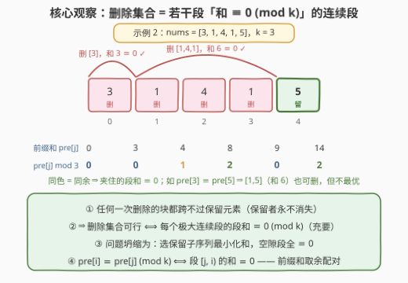
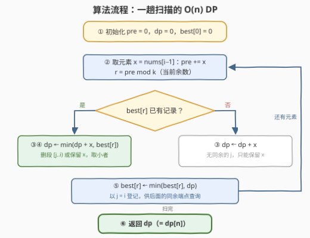

# LeetCode 删除可整除和后的最小数组和 题解

## 1. 题目概述

- **标题 / 题号**：删除可整除和后的最小数组和（#3654，medium）
- **链接**：https://leetcode.cn/problems/minimum-sum-after-divisible-sum-deletions/
- **难度**：中等
- **标签**：数组、哈希表、动态规划、前缀和

**题意**：给你一个整数数组 `nums` 和一个整数 `k`。

你可以**多次**选择 `nums` 的一个**连续子数组**，只要其元素和能被 `k` 整除，就将其删除；每次删除后，剩余元素会拼接填补空缺（两侧元素变为相邻，可能拼出新的可删段）。

返回执行任意次数此类删除操作后，`nums` 的**最小可能和**。

**示例 1**：

```text
输入：nums = [1,1,1], k = 2
输出：1
解释：删除子数组 nums[0..1] = [1,1]，其和为 2（可被 2 整除），剩余 [1]，和为 1。
```

**示例 2**：

```text
输入：nums = [3,1,4,1,5], k = 3
输出：5
解释：先删除子数组 [1,4,1]（和 6），数组变为 [3,5]；再删除子数组 [3]（和 3），剩余 [5]，和为 5。
```

**约束**：

- $1 \le nums.length \le 10^5$
- $1 \le nums[i] \le 10^6$
- $1 \le k \le 10^5$

> 💡 **审题关键**：① 删除发生在**当前数组**上——先删中间一段，两侧拼接后可能拼出新的可删段（示例 2 正是先删 `[1,4,1]` 再删 `[3]`），「链式删除」是本题最大的迷惑点；② 元素全为正数，「最小化剩余和」等价于「最大化删除总量」；③ 每次删掉的段和 $\equiv 0 \pmod k$，所以**剩余和 ≡ 总和 (mod k)** 是必要条件，可当对拍自检。

## 2. 解题思路

### 2.1 暴力思路

最直接的暴力是在**数组状态**上做 BFS：每个状态枚举所有「和 $\equiv 0 \pmod k$」的连续段删一遍。可达状态对应原数组的各种剩余子序列，规模指数级，$n = 10^5$ 下毫无希望。

退一步先看**最终形态**：保留下来的元素构成原数组的一个子序列，其余元素被删。若在此认知上直接 DP（枚举「最后一段删除区间 $[j, i)$」），$(j, i)$ 对本身就有 $O(n^2) \approx 10^{10}$ 组，依然超时——必须让「哪些 $j$ 能和 $i$ 配对删段」变成 $O(1)$ 可查。这一步的钥匙是 2.2 的结构定理 + 同余配对。

### 2.2 核心观察：删除集合 = 若干「和 ≡ 0 (mod k)」的连续段



链式删除看似变化无穷，但结构其实被一个不变量锁死：

> **引理（删除结构定理）**　设最终保留的下标集合为 $S$，删除集合 $D = \{0,\dots,n-1\} \setminus S$。则：
> $D$ 能被若干次合法操作删空 $\iff$ $D$ 的每个**极大连续段**的元素和都 $\equiv 0 \pmod k$。

**证明**：

- **（⇐）逐段删即可**：删某个极大段时，该段元素全都还在（各段互不相交），且段内没有其它现存元素（极大段内的下标全部属于 $D$），所以它在当前数组中就是一块连续区间；段和 $\equiv 0$，是一次合法操作。一段一段删完即达目标。
- **（⇒）操作块跨不过保留元素**：保留元素从头到尾都存在。若某次操作的块 $B$ 的原始下标跨度内夹着一个保留下标，这个现存元素会把 $B$ 的元素在数组中隔开，与「$B$ 在当前数组中连续」矛盾。于是 $B$ 的整个跨度都落在 $D$ 的**同一个**极大段里；而每个极大段恰好被落在其中的各操作块划分覆盖（每个下标只被删一次），故段和 = 这些块和之总和 $\equiv 0 + 0 + \cdots \equiv 0 \pmod k$。∎

> 💡 **链式删除去哪了？** 「先删中间 $M$、再把拼接后的 $A+B$ 删掉」这类花招被定理自动收编：若 $M \equiv 0$ 且 $A + B \equiv 0$，则整段 $A+M+B \equiv 0$，本来就是「一个极大段」。链式操作能删掉的一切，逐段删同样能删掉，反之亦然——**充要**二字正是本题从指数级暴力走向线性 DP 的全部底气。

于是问题坍缩为纯组合优化：**选保留子序列 $S$，最小化 $\mathrm{sum}(S)$，使 $S$ 切出的每个空隙段（含首尾）之和 $\equiv 0 \pmod k$**。

再补最后一块基石——**同余配对**：记前缀和 $pre[i] = nums[0] + \cdots + nums[i-1]$，则

$$\text{段 } [j, i) \text{ 的和} = pre[i] - pre[j] \equiv 0 \pmod k \iff pre[i] \equiv pre[j] \pmod k$$

「一段能不能删」只看**两个端点的前缀和是否同余**，与段内细节无关。

### 2.3 算法流程：同余配对的一趟 DP



**状态定义**：$dp[i]$ = 只考虑前 $i$ 个元素、所有删除段都完整落在其中时的最小保留和（$dp[0] = 0$）。

**转移**（看末尾元素 $nums[i-1]$ 怎么处理）：

$$dp[i] = \min\begin{cases} dp[i-1] + nums[i-1] & \text{（保留 } nums[i-1]\text{）}\\[4pt] \min\limits_{0 \le j < i,\; pre[j] \equiv pre[i] \pmod k} dp[j] & \text{（把段 } [j, i) \text{ 整段删除）} \end{cases}$$

答案是 $dp[n]$：保留转移说明末元素成为「锚点」；删段转移中，被删的段**不贡献**保留和，保留和直接继承 $dp[j]$。内层 $\min$ 按**余数分桶**维护 $best[r] = \min\{dp[j] : pre[j] \bmod k = r\}$，每步先查后登记，内层 $O(1)$。

| 步骤 | 操作 | 说明 |
|------|------|------|
| ① 初始化 | `pre = dp = 0`，`best[0] = 0` | 预先登记 $j = 0$（空前缀，$pre[0] = 0$） |
| ② 前缀推进 | `x = nums[i−1]`，`pre += x`，`r = pre mod k` | 一遍扫描，前缀和现算现用 |
| ③ 保留转移 | `cur = dp + x` | 保留 $x$，保留和加上 $x$ |
| ④ 删段转移 | `best[r]` 存在则 `cur = min(cur, best[r])` | 删掉某个和 $\equiv 0$ 的段 $[j, i)$ |
| ⑤ 登记 | `best[r] = min(best[r], cur)` | 以 $j = i$ 登记，供后续同余端点查询 |
| ⑥ 循环收尾 | `dp = cur`，回到 ② | 扫完返回 `dp` |

> ⚠️ **两个细节**：① **相邻删段自动合并**——若先经删段转移到 $dp[i_1]$、再删 $[i_1, i_2)$，两段在原数组中首尾相接，并成大段 $[j_1, i_2)$，其和 $\equiv 0 + 0 \equiv 0$，仍是合法极大段——与「一次删大段」殊途同归，DP 不重不漏；② 先查后登记，别把 $j = i$ 的空段搅进当前步（即便混进来数值上也无害，但先查后登记语义干净）。

### 2.4 示例演算：nums = [3,1,4,1,5]，k = 3

前缀和 $pre = [0, 3, 4, 8, 9, 14]$，余数（mod 3）$= [0, 0, 1, 2, 0, 2]$：

| $i$ | $x$ | $pre[i]$ | $r$ | 保留：$dp[i-1]+x$ | 删段：$best[r]$ | $dp[i]$ | 登记后 best |
|---|---|---|---|---|---|---|---|
| 0 | — | 0 | 0 | — | — | 0 | {0: 0} |
| 1 | 3 | 3 | 0 | 0+3 = 3 | **0** | 0 | {0: 0} |
| 2 | 1 | 4 | 1 | 0+1 = 1 | ∅ | 1 | {0:0, 1:1} |
| 3 | 4 | 8 | 2 | 1+4 = 5 | ∅ | 5 | {0:0, 1:1, 2:5} |
| 4 | 1 | 9 | 0 | 5+1 = 6 | **0** | 0 | {0:0, 1:1, 2:5} |
| 5 | 5 | 14 | 2 | 0+5 = 5 | 5 | **5** | {0:0, 1:1, 2:5} |

- $i=1$：$pre[1] = 3 \equiv 0$，删 $[3]$（和 3），保留和归零；
- $i=4$：$pre[4] = 9 \equiv pre[0]$，把 $[3,1,4,1]$ 整段（和 9）全删——与「删 $[1,4,1]$（和 6）＋已删的 $[3]$（和 3）」等价，正是相邻段合并；
- $i=5$：$pre[5] = 14 \equiv 2 \equiv pre[3]$，本可删 $[1,5]$（和 6），但那要继承 $dp[3] = 5$；最优是**保留 5**：$dp[5] = dp[4] + 5 = 5$ ✓，与官方解释一致。

（示例 1：$[1,1,1], k=2$，$dp$ 依次为 $0, 1, 0, 1$——第 2 步删 $[1,1]$ 归零，末尾的 1 删不掉只能保留，答案 1 ✓。）

## 3. 参考代码

### C++

```cpp
class Solution {
public:
    long long minArraySum(vector<int>& nums, int k) {
        const long long INF = LLONG_MAX;
        vector<long long> best(k, INF);   // best[r] = 目前 pre[j] % k == r 的最小 dp[j]
        best[0] = 0;                      // 登记j = 0：空前缀，pre[0] = 0
        long long dp = 0, pre = 0;
        for (int x : nums) {
            pre += x;
            int r = int(pre % k);
            long long cur = dp + x;               // ① 保留 x
            if (best[r] < cur) cur = best[r];     // ② 删除某个和 ≡ 0 的段 [j..i)
            if (cur < best[r]) best[r] = cur;     // ③ 以 j = i 登记
            dp = cur;
        }
        return dp;
    }
};
```

### Python

```python
class Solution:
    def minArraySum(self, nums: List[int], k: int) -> int:
        best = {0: 0}                        # 余数 r -> 目前最小的 dp[j]
        dp = pre = 0
        for x in nums:
            pre += x
            r = pre % k
            cur = dp + x                     # ① 保留 x
            if r in best and best[r] < cur:  # ② 删除某个和 ≡ 0 的段 [j..i)
                cur = best[r]
            if r not in best or cur < best[r]:
                best[r] = cur                # ③ 以 j = i 登记
            dp = cur
        return dp
```

> ⚠️ `pre` 最大 $10^5 \times 10^6 = 10^{11}$，C++ 必须 `long long`；C++ 直接开 `best(k)` 数组（$k \le 10^5$），Python 用字典自然只占 $O(\min(n, k))$。

## 4. 复杂度分析

| 维度 | 复杂度 | 说明 |
|------|--------|------|
| **时间复杂度** | $O(n)$ | 每个元素处理一次：前缀和累加 + $O(1)$ 查询/更新 `best` |
| **空间复杂度** | $O(k)$（哈希表实现为 $O(\min(n, k))$） | `best` 按余数 $0 \dots k-1$ 分桶 |

> 对照：状态 BFS 指数级；朴素枚举 $(j, i)$ 配对的 DP 是 $O(n^2) \approx 10^{10}$，$n = 10^5$ 下同样超时——余数分桶是把内层枚举压到 $O(1)$ 的关键。

## 5. 扩展：特例、变体与关联

- **$k = 1$ 特例**：任何段和都能被 1 整除 → 整个数组一刀删空，答案恒为 0（DP 中所有余数都是 0，`best[0]` 第一步即归零），可用作实现的快速自检。
- **对拍自检**：答案必须满足 $\text{ans} \equiv \text{sum}(nums) \pmod k$ 且 $0 \le \text{ans} \le \text{sum}(nums)$；小规模可用「状态 BFS 暴力」对拍验证结构定理。
- **变体**：若限定**最多删 $m$ 段**，给 dp 加一维「已删段数」变 $O(nm)$；若要**输出删除方案**，转移时记录来源 $j$ 回溯即可。
- **与 [974. 和可被 K 整除的子数组](https://leetcode.cn/problems/subarray-sums-divisible-by-k/) 的对照**：974 在同一余数桶里**计数**（有多少同余端点对），本题在同一余数桶里**取最值**（最小的 $dp[j]$）——同一块「前缀和取余配对」基石，一个数个数、一个取最小。

## 6. 面试要点

**Q1：为什么任何一次删除操作都跨不过保留下来的元素？**

> 保留元素从头到尾不被删除、始终在数组中；若某次操作的块在原始下标跨度内夹着保留下标，这个现存元素会把块内元素隔开，与「块在当前数组中连续」矛盾。因此每个操作块整体落在最终删除集合的同一个极大连续段内。

**Q2：删除结构定理的两个方向分别怎么证？**

> （⇐）各极大段和 $\equiv 0$ 时逐段删：删某段时段内元素全在、段内无其它现存元素，仍是连续块且和可整除。（⇒）每个操作块落在同一极大段内，极大段被这些块恰好划分覆盖，段和 = 各块和之和 $\equiv 0$。这是充要条件——「先删中间、再删拼接结果」等链式花招能达成的一切都被它覆盖。

**Q3：从 $O(n^2)$ 到 $O(n)$ 的关键一步是什么？**

> 「删段 $[j, i)$」的合法性条件 $pre[j] \equiv pre[i] \pmod k$ 只依赖前缀和余数。按余数分桶维护 $best[r] = \min dp[j]$，内层查询变 $O(1)$——与 974/560 的前缀和取余配对同源，只是把「计数」换成「维护最值」。

**Q4：相邻两次删段转移首尾相接，DP 会不会出错？**

> 不会。$[j_1, i_1)$ 与 $[i_1, i_2)$ 在原数组中拼成大段 $[j_1, i_2)$，和 $\equiv 0 + 0 \equiv 0$，仍是合法极大段，与「一次删大段」的转移殊途同归；DP 枚举的是最终「划分」而非「操作序列」，天然不重不漏。

**Q5：实现上有哪些坑？**

> ① `pre` 上界 $10^{11}$，C++ 必须 `long long`；② `best` 初始化为 INF，且**先查后登记**（防止 $j = i$ 空段搅进当前步）；③ 用「答案 ≡ 总和 (mod k)」和「$k = 1$ 时答案为 0」做快速 sanity check；④ C++ 开 `best(k)` 时注意 $k$ 本身可达 $10^5$，所幸仅一个 long long 数组，内存无忧。

> 💡 **一句话总结**：3654 = 删除结构定理（删除集可行 ⟺ 各极大连续段和 ≡ 0 mod k，链式删除全被收编）+ 同余前缀和配对（$pre[i] \equiv pre[j]$ ⟺ 段可删）+ 余数分桶 DP（`best[r]` 一趟取最小），$O(n)$ 收工。

## 同类练习题

| # | 题目 | 与本题的关联 |
|---|------|-------------|
| 974 | [和可被 K 整除的子数组](https://leetcode.cn/problems/subarray-sums-divisible-by-k/) | 同余前缀和配对计数——本题「段和 ≡ 0 ⟺ 端点同余」判定的基本功 |
| 523 | [连续的子数组和](https://leetcode.cn/problems/continuous-subarray-sum/) | 同余配对判存在性（长度 ≥ 2 版本），同一块基石的存在性版 |
| 560 | [和为 K 的子数组](https://leetcode.cn/problems/subarray-sum-equals-k/) | 前缀和 + 哈希配对的祖师爷，「端点配对」思维的最佳入门 |
| 1186 | [删除一次得到子数组最大和](https://leetcode.cn/problems/maximum-subarray-sum-with-one-deletion/) | 同为「删除连续段」的结构化 DP，对比一次性删除与本题的可重复删除 |
