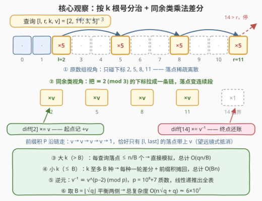
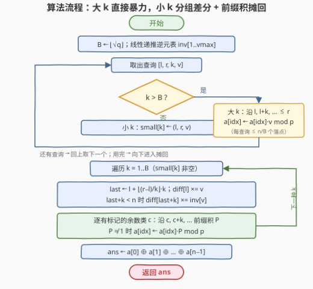

# 区间乘法查询后的异或 II

- **题目名称**：区间乘法查询后的异或 II
- **链接**：[3655. 区间乘法查询后的异或 II](https://leetcode.cn/problems/xor-after-range-multiplication-queries-ii/)
- **难度**：困难
- **标签**：数组、根号分治、差分、数学

## 1. 题目概述

**题意**：给定长度为 $n$ 的整数数组 $nums$ 和查询数组 $queries$，其中 $queries[i] = [l_i, r_i, k_i, v_i]$。每个查询的执行方式是：设 $idx = l_i$，当 $idx \le r_i$ 时反复执行

$$nums[idx] \leftarrow \big(nums[idx] \cdot v_i\big) \bmod (10^9 + 7), \qquad idx \leftarrow idx + k_i$$

也就是**按步长 $k_i$ 跳着**把 $[l_i, r_i]$ 内的一部分位置乘上 $v_i$。所有查询处理完后，返回数组全部元素的**按位异或**结果。

**示例 1**：

```text
输入：nums = [1,1,1], queries = [[0,2,1,4]]
输出：4
解释：查询 [0,2,1,4] 把下标 0、1、2 都乘以 4，数组变为 [4,4,4]；
      异或为 4 ^ 4 ^ 4 = 4。
```

**示例 2**：

```text
输入：nums = [2,3,1,5,4], queries = [[1,4,2,3],[0,2,1,2]]
输出：31
解释：查询 [1,4,2,3] 只碰下标 1、3（步长 2），数组变为 [2,9,1,15,4]；
      查询 [0,2,1,2] 碰下标 0、1、2，数组变为 [4,18,2,15,4]；
      异或为 4 ^ 18 ^ 2 ^ 15 ^ 4 = 31。
```

**约束条件**：

- $1 \le n = nums.length \le 10^5$
- $1 \le nums[i] \le 10^9$
- $1 \le q = queries.length \le 10^5$
- $queries[i] = [l_i, r_i, k_i, v_i]$，$0 \le l_i \le r_i < n$，$1 \le k_i \le n$，$1 \le v_i \le 10^5$

> 💡 **审题关键**：① 题面与 [3653. 区间乘法查询后的异或 I](https://leetcode.cn/problems/xor-after-range-multiplication-queries-i/) 完全一致，唯一区别是 $n, q$ 从 $10^3$ 放大到 $10^5$ ⇒ 暴力最坏 $O(nq) = 10^{10}$ 次模乘，**必超时**；② 每个查询的落点数是 $\left\lfloor \frac{r-l}{k} \right\rfloor + 1$，随 $k$ 增大而锐减——**$k$ 大时"逐点模拟很便宜"，$k$ 小时"一轮差分很便宜"**，这是教科书级的根号分治信号；③ 所有更新都是模质数 $p = 10^9+7$ 意义下的乘法，可交换 ⇒ **查询可以任意重排、分组**，为按 $k$ 分组处理扫清障碍。

---

## 2. 解题思路

### 2.1 暴力思路：逐查询按步长模拟（I 版正解，本题超时）

I 版（$n, q \le 10^3$）里"双重循环逐落点模拟"就是正解；原封不动搬到本题，最坏 $nq = 10^{10}$ 次模乘——单机每秒约 $10^8 \sim 10^9$ 次，差着一到两个数量级，必须换档次。

新的突破口在**代价结构不均匀**上：查询 $[l, r, k, v]$ 的落点数 $\left\lfloor \frac{r-l}{k} \right\rfloor + 1 \le \frac{n}{k} + 1$。

- $k$ 很大（如 $k > \sqrt{q}$）：落点 $\le \frac{n}{\sqrt{q}} \approx 316$ 个，**直接模拟完全付得起**，$q$ 个查询总计 $O\!\left(\frac{qn}{B}\right)$；
- $k$ 很小（如 $k \le \sqrt{q}$）：$k$ 的取值**至多 $B$ 种**，一种一轮批量处理，每轮 $O(n)$，总计 $O(Bn)$。

两侧拼起来正是根号分治的形状，剩下的难点只有一个：**小 $k$ 的"一轮批量处理"怎么做**——单个 $k = 1$ 的查询就可能覆盖整个数组，逐点乘显然不行。

### 2.2 核心观察：按 $k$ 根号分治 + 同余类乘法差分



**观察一（终态可分解，查询可重排）**：所有更新都是模 $p$ 乘法，交换律、结合律成立，因此任意重排查询顺序终态不变。进一步地，位置 $i$ 的终值可以**闭式分解**：

$$a[i] = nums[i] \cdot \prod_{\text{覆盖 } i \text{ 的查询}} v \bmod p$$

这个分解授权我们**把查询按 $k$ 值分组、乱序处理**——这是整个算法的合法性基础。

**观察二（跳步区间 = 同余类上的连续区间）**：查询 $[l, r, k, v]$ 的落点 $l, l+k, l+2k, \ldots$ 全部属于同一个**同余类** $c = l \bmod k$。把该类的下标 $c, c+k, c+2k, \ldots$ 拉直成一条链，落点就变成链上从 $l$ 到 $last = l + \left\lfloor \frac{r-l}{k} \right\rfloor \cdot k$ 的**连续一段**——于是"区间乘"可以套用经典差分，只不过是**乘法差分**：

$$diff[l] \mathrel{\times}= v, \qquad diff[last + k] \mathrel{\times}= v^{-1}$$

其中 $v^{-1}$ 是 $v$ 模 $p$ 的**逆元**。随后沿每个同余类做**前缀积** $P$（$P \leftarrow P \cdot diff[idx] \bmod p$），把 $P$ 乘到 $a[idx]$ 上：$P$ 在 $l$ 处带上因子 $v$，到 $last+k$ 处被 $v^{-1}$ 还清——**望远镜式抵消**，恰好只有 $[l, last]$ 内的落点乘上了 $v$，类内更早的位置与 $last+k$ 之后的位置都不受影响。差分数组直接**按原下标开大小 $n$** 即可：前缀积沿同余类跳跃扫描，只会读到本类的标记，不同余类天然互不干扰。

**观察三（逆元随时可得）**：$p = 10^9+7$ 是质数，且 $1 \le v \le 10^5 < p$，故 $\gcd(v, p) = 1$，逆元存在且唯一。单个可用**费马小定理** $v^{-1} \equiv v^{p-2} \pmod p$；批量可用线性递推 $inv[i] = -\frac{p}{i} \cdot inv[p \bmod i] \bmod p$，$O(v_{\max})$ 预处理。

> ⚠️ **每种小 $k$ 必须独立开一轮差分**：$k=2$ 的同余类 $\{0,2,4,\ldots\}$ 与 $k=3$ 的同余类 $\{0,3,6,\ldots\}$ 在原数组上彼此交织。若把不同 $k$ 的标记混进同一个 $diff$ 数组，沿 $k=2$ 的类扫描时会误读 $k=3$ 的标记。正确做法：**逐个 $k$ 处理**——重开一个全 $1$ 的 $diff$，做完该 $k$ 所有查询的差分与前缀积摊回，再换下一个 $k$。

> 💡 **复杂度平衡**：小 $k$ 侧至多 $B$ 种取值、每种一轮 $O(n)$，共 $O(Bn + q)$；大 $k$ 侧 $O\!\left(\frac{qn}{B} + q\right)$。总代价 $O\!\left(Bn + \frac{qn}{B} + q\right)$，取 $B = \left\lfloor\sqrt{q}\right\rfloor$ 得 $O(n\sqrt{q} + q)$，$n = q = 10^5$ 时约 $6 \times 10^7$ 次模乘，稳过。

### 2.3 算法流程图



**文字版步骤**：

| 步骤 | 操作 | 说明 |
|------|------|------|
| ① 预处理 | $B \leftarrow \lfloor\sqrt{q}\rfloor$；线性递推逆元表 $inv[1..v_{\max}]$ | $v \le 10^5$，$O(10^5)$ |
| ② 分流 | 遍历查询：$k > B$ 直接模拟；否则记入 $small[k]$ | 大 $k$ 每查询 $\le \frac{n}{B}$ 个落点 |
| ③ 大 $k$ 分支 | $idx$ 从 $l$ 起步长 $k$ 走到 $r$：$a[idx] \leftarrow a[idx] \cdot v \bmod p$ | I 版的暴力循环原样保留 |
| ④ 小 $k$ 差分 | 逐个 $k$：重开 $diff$ 全 $1$；每个查询 $last \leftarrow l + \lfloor\frac{r-l}{k}\rfloor \cdot k$，$diff[l] \times= v$，$last + k < n$ 时 $diff[last+k] \times= inv[v]$ | 终点越界则无需还账标记 |
| ⑤ 前缀积摊回 | 对每个**有标记的**同余类 $c$：沿 $c, c+k, c+2k, \ldots$ 求 $P \leftarrow P \cdot diff[idx] \bmod p$，$P \neq 1$ 时 $a[idx] \leftarrow a[idx] \cdot P \bmod p$ | 只扫有标记的类是实用优化 |
| ⑥ 收尾 | $ans \leftarrow a[0] \oplus a[1] \oplus \cdots \oplus a[n-1]$ | 异或的是取模后的终值 |

### 2.4 示例演算：nums = [2,3,1,5,4]，queries = [[1,4,2,3],[0,2,1,2]]

（示例规模下 $B = \lfloor\sqrt{2}\rfloor = 1$，查询 1 会走大 $k$ 直接模拟；这里为演示差分机制，不妨按 $B \ge 2$ 走小 $k$ 分支——由观察一，两种走法终态相同。）

**第 1 轮：$k = 2$，查询 $[l=1, r=4, v=3]$**

- $c = 1 \bmod 2 = 1$，$last = 1 + \lfloor\frac{3}{2}\rfloor \cdot 2 = 3$；
- 差分：$diff[1] \times= 3$；$last + k = 5 = n$ **越界，跳过还账标记**；
- 同余类 $1$（下标 $1, 3$）前缀积摊回：

| $idx$ | $P$ 的演化 | 动作 |
|-------|-----------|------|
| 1 | $1 \times 3 = 3$ | $a[1] = 3 \times 3 = 9$ |
| 3 | $3 \times 1 = 3$ | $a[3] = 5 \times 3 = 15$ |

数组变为 $[2, 9, 1, 15, 4]$——类内起点之前没有位置，越界哨兵也无需写入，一轮干净收场。

**第 2 轮：$k = 1$，查询 $[l=0, r=2, v=2]$**

- $c = 0$，$last = 0 + \lfloor\frac{2}{1}\rfloor \cdot 1 = 2$；
- 差分：$diff[0] \times= 2$，$diff[3] \times= 2^{-1}$；
- 同余类 $0$（下标 $0..4$，即整个数组）前缀积摊回：

| $idx$ | $P$ 的演化 | 动作 |
|-------|-----------|------|
| 0 | $1 \times 2 = 2$ | $a[0] = 2 \times 2 = 4$ |
| 1 | $2$ | $a[1] = 9 \times 2 = 18$ |
| 2 | $2$ | $a[2] = 1 \times 2 = 2$ |
| 3 | $2 \times 2^{-1} = 1$ | $a[3] = 15$（**望远镜抵消**，$r=2$ 之外不还多乘） |
| 4 | $1$ | $a[4] = 4$ |

数组变为 $[4, 18, 2, 15, 4]$。**收尾异或**：$4 \oplus 18 \oplus 2 \oplus 15 \oplus 4 = 31$，与示例一致。这一轮同时演示了三个关键细节：越界哨兵跳过（第 1 轮）、望远镜抵消（$idx=3$ 处 $P$ 回落为 $1$）、多轮差分按 $k$ 独立进行。

---

## 3. 参考代码

### C++

```cpp
class Solution {
public:
    int xorAfterQueries(vector<int>& nums, vector<vector<int>>& queries) {
        const long long MOD = 1'000'000'007;
        int n = nums.size();
        int q = queries.size();
        int B = max(1, (int)sqrt((double)q));

        vector<long long> a(nums.begin(), nums.end());

        int vmax = 1;
        for (auto& qr : queries) vmax = max(vmax, qr[3]);
        vector<long long> inv(vmax + 1);
        inv[1] = 1;
        for (int i = 2; i <= vmax; i++)
            inv[i] = (MOD - MOD / i) * inv[MOD % i] % MOD;

        vector<vector<array<int, 3>>> small(B + 1);
        for (auto& qr : queries) {
            int l = qr[0], r = qr[1], k = qr[2], v = qr[3];
            if (k > B) {
                for (int idx = l; idx <= r; idx += k)
                    a[idx] = a[idx] * v % MOD;
            } else {
                small[k].push_back({l, r, v});
            }
        }

        vector<long long> D;
        for (int k = 1; k <= B; k++) {
            if (small[k].empty()) continue;
            D.assign(n, 1);
            vector<char> touched(k, 0);
            for (auto& [l, r, v] : small[k]) {
                int last = l + (r - l) / k * k;
                D[l] = D[l] * v % MOD;
                if (last + k < n)
                    D[last + k] = D[last + k] * inv[v] % MOD;
                touched[l % k] = 1;
            }
            for (int c = 0; c < k; c++) {
                if (!touched[c]) continue;
                long long P = 1;
                for (int idx = c; idx < n; idx += k) {
                    if (D[idx] != 1) P = P * D[idx] % MOD;
                    if (P != 1) a[idx] = a[idx] * P % MOD;
                }
            }
        }

        int ans = 0;
        for (int i = 0; i < n; i++) ans ^= (int)a[i];
        return ans;
    }
};
```

> 💡 **写法要点**：
> - **逆元线性递推**：$inv[i] = -\lfloor p/i \rfloor \cdot inv[p \bmod i] \bmod p$，比每个查询做一次快速幂（$O(q \log p)$）更省；$v \le 10^5$ 表只需开这么大；
> - **`D` 按 `assign` 重开**：每种小 $k$ 一轮、复用同一块 $O(n)$ 内存，避免 $B$ 个数组同时常驻（见第 5 节的内存对比）；
> - **`touched` 只扫有标记的同余类**：查询稀疏时省下大片无效扫描，最坏界不变；
> - **溢出**：`long long` 数组上单次乘积上界 $(10^9+6)^2 \approx 10^{18} < 2^{63}$，安全；
> - **`last + k < n` 才写还账标记**：越界的哨兵位置永远不会被前缀积读到，不写即省。

### Python

```python
import numpy as np
from collections import defaultdict
from math import isqrt

class Solution:
    def xorAfterQueries(self, nums: List[int], queries: List[List[int]]) -> int:
        MOD = 1_000_000_007
        n = len(nums)
        a = np.array(nums, dtype=np.int64)
        B = max(1, isqrt(len(queries)))

        vmax = max((v for *_, v in queries), default=1)
        inv = [0, 1] + [0] * (vmax - 1)
        for i in range(2, vmax + 1):
            inv[i] = (MOD - MOD // i) * inv[MOD % i] % MOD

        small = defaultdict(list)
        for l, r, k, v in queries:
            if k > B:
                seg = a[l:r + 1:k]
                seg *= v
                seg %= MOD
            else:
                small[k].append((l, r, v))

        for k, qs in small.items():
            marks = defaultdict(list)
            for l, r, v in qs:
                last = l + (r - l) // k * k
                c = l % k
                marks[c].append((l, v))
                if last + k < n:
                    marks[c].append((last + k, inv[v]))
            for c, bucket in marks.items():
                bucket.sort()
                P = 1
                for i, (pos, val) in enumerate(bucket):
                    P = P * val % MOD
                    end = bucket[i + 1][0] if i + 1 < len(bucket) else n
                    if P != 1 and pos < end:
                        seg = a[pos:end:k]
                        seg *= P
                        seg %= MOD

        return int(np.bitwise_xor.reduce(a))
```

> 💡 **写法要点**：
> - **步长切片 = 同余类连续段**：`a[l:r+1:k]` 与 `a[pos:end:k]` 就是"从某位置起、步长 $k$、不越过终点"的落点集合，与题意无缝对齐，且是原地视图操作、零拷贝；
> - **前缀积不能 `cumprod`**：中途不取模会瞬间溢出 `int64`，取模又破坏向量化——改为**只在标记点串行累乘**（每类至多 $2q_k$ 个），再把每段乘数 $P$ 用一次步长切片整体摊回，串行部分总量 $O(q)$；
> - **数值安全**：`int64` 中 $a < 2^{30}$、$v < 2^{17}$、$P < 2^{30}$，任意单次乘积 $< 2^{60}$，不溢出；
> - **同位置多个标记**：`bucket.sort()` 后逐点累乘，同位置标记自动按"先到先乘"合并（乘法交换律兜底），段长为零（`pos == end`）时自然跳过；
> - 最坏规模（$n = q = 10^5$，含全 $k=1$、$316$ 种 $k$ 混合、全 $k = 317$ 三类压力形态）实测约 0.2 ~ 0.5 秒。

---

## 4. 复杂度分析

| 维度 | 复杂度 | 说明 |
|------|--------|------|
| **时间复杂度** | $O\big(n\sqrt{q} + q\big)$，$n = q = 10^5$ 时约 $6 \times 10^7$ | 小 $k$ 侧 $\le B$ 种各一轮 $O(n)$ 摊回 + $q$ 次差分；大 $k$ 侧 $\sum_i \left(\frac{n}{k_i}+1\right) \le \frac{qn}{B} + q$；$B = \lfloor\sqrt{q}\rfloor$ 平衡 |
| **空间复杂度** | $O(n + q)$ | 差分数组单块 $O(n)$ 逐 $k$ 复用；查询分组 $O(q)$；逆元表 $O(v_{\max}) = O(10^5)$ |

> - 小 $k$ 一轮的 $O(n)$ 是"扫全数组"的粗界——只扫有标记的同余类后，随机数据下远小于此；最坏（每种 $k$ 的查询铺满所有余数类）仍取到上界。
> - 若 $n \ne q$，更精细的界是 $O\big(n \cdot \min(B, q, n) + \frac{qn}{B} + q\big)$：小 $k$ 的取值种数同时受 $B$、查询数 $q$ 与 $k \le n$ 三重限制。

---

## 5. 扩展：差分数组的两种开法与"为什么不是线段树"

**两种开法的取舍**。本文按"每种 $k$ 轮流重开一个 $O(n)$ 差分数组"实现：内存恒 $O(n)$，代价是每轮都要全量摊回。官方 hint 给出另一种开法——**按 $(k, l \bmod k)$ 常驻差分桶**，每组长度 $\lceil n/k \rceil$，查询期间直接往桶里记差分，最后只扫**出现过查询的桶**。它省了"无查询的 $k$ 也要扫"的开销，但内存上限是 $\sum_{k \le B} \min(k, q_k) \cdot \lceil n/k \rceil$：构造"每种 $k$ 恰好用满全部 $k$ 个余数类"的数据（$q = 10^5$ 个查询摊给 $316$ 种 $k$，每种约 $316$ 个），内存可达 $B \cdot n \approx 3 \times 10^7$ 个表项——C++ `int64` 要约 250 MB，相当危险。轮流重开法以时间换空间，工程上更稳。

**为什么不是线段树**。线段树的 lazy 标记只能下推**连续区间**，而跳步更新的落点在原数组上稀疏离散，单次更新要拆成 $O(n/k)$ 个节点反而更慢。同余类分组才是正确的"坐标系变换"：把跳步区间变换成同余类链上的连续区间后，区间乘更新是 $O(1)$ 差分、末端一遍前缀积摊回——**变换之后问题已经退化到不需要数据结构**。这也是官方标签 *Divide and Conquer*（按 $k$ 分档）、*Prefix Sum*（前缀积摊回）的真正含义。

**Python 的向量化边界**。核心思想不变，实现上要顺着 numpy 的能力走：步长切片天然表达同余类连续段；前缀积因"边乘边取模"无法 `cumprod` 向量化，就退一步——串行部分压缩到标记点（总量 $O(q)$），段内摊回交给切片乘法。这种"**串行只做 $O(q)$ 的骨架，$O(n)$ 的肌肉全部交给向量化**"的拆法，是根号分治类题目在 Python 下的通用生存术。

---

## 6. 面试要点

**Q1：I 版的暴力为什么到这里不行？瓶颈怎么定位、怎么分治？**

> 落点数 $\lfloor\frac{r-l}{k}\rfloor + 1$ 决定单查询代价：$n, q = 10^5$ 时暴力 $10^{10}$。关键洞察是代价随 $k$ 两极分化——$k > B$ 每查询仅 $\le \frac{n}{B}$ 个落点，直接模拟很便宜；$k \le B$ 的取值至多 $B$ 种，一种一轮 $O(n)$ 批量处理。两侧相加 $Bn + \frac{qn}{B}$，$B = \sqrt{q}$ 时最小，得 $O(n\sqrt{q} + q)$。

**Q2：凭什么能把查询按 $k$ 重排分组？终态怎么分解？**

> 所有更新都是模质数 $p$ 的乘法，交换律结合律成立，任意重排查询终态不变；更强地，$a[i] = nums[i] \cdot \prod_{\text{覆盖 } i} v \bmod p$，每个位置的终值只与"覆盖它的查询集合"有关，与顺序完全无关。这是分组、乱序、按 $k$ 分轮处理的合法性来源。

**Q3：乘法差分怎么做？为什么需要逆元、怎么批量求？**

> 加法差分是"起点 +v、终点后 −v、前缀和摊回"；乘法版本把加减换成乘除：$diff[l] \times= v$、$diff[last+k] \times= v^{-1}$、沿同余类**前缀积**摊回。模意义下"除"要用逆元：$p = 10^9+7$ 质数且 $v < p$，费马小定理给 $v^{-1} = v^{p-2} \bmod p$；批量场景用线性递推 $inv[i] = -\lfloor p/i\rfloor \cdot inv[p \bmod i] \bmod p$，$O(v_{\max})$ 一遍出全表。

**Q4：为什么落点在同余类上是"连续"的？$last$ 怎么算、越界怎么处理？**

> 落点 $l, l+k, l+2k, \ldots$ 全部 $\equiv l \pmod k$，把该同余类拉直成链后落点恰是 $[l, last]$ 的连续段，$last = l + \lfloor\frac{r-l}{k}\rfloor \cdot k$。还账标记写在 $last + k$（链上 $last$ 的下一个位置）；若 $last + k \ge n$ 则链上其后已无位置，直接跳过不写。差分数组按原下标开 $n$ 大小即可，前缀积只沿本类跳跃读取，类间天然隔离——但**不同 $k$ 的标记绝不能混装一个数组**，必须每种 $k$ 独立一轮。

**Q5：实现层面有哪些坑？**

> ① 溢出：模乘两因子均 $< p < 2^{30}$，`int64` 乘积 $< 2^{60}$ 安全，`int` 必炸；② 大 $k$ 分支别忘 `idx += k` 的循环上界是 $r$ 不是 $n$；③ 小 $k$ 轮内先攒完所有差分再做前缀积，边读查询边摊回会把还账标记算漏；④ 逆元表下标从 $1$ 起（$v \ge 1$），`inv[0]` 留空不访问；⑤ Python 别对全数组做纯 Python 循环——串行逻辑压缩到 $O(q)$ 个标记点、$O(n)$ 摊回交给 numpy 步长切片。

---

## 7. 同类练习题

- [3653. 区间乘法查询后的异或 I](https://leetcode.cn/problems/xor-after-range-multiplication-queries-i/)：本题的 $n, q \le 10^3$ 版，暴力模拟即正解，先做它再来看根号分治如何升级
- [1109. 航班预订统计](https://leetcode.cn/problems/corporate-flight-bookings/)：加法版"区间更新 + 末端统一摊回"的差分入门，体会乘法差分的前身
- [1526. 形成目标数组的子数组最少操作次数](https://leetcode.cn/problems/minimum-number-of-increments-on-subarrays-to-form-a-target-array/)：从差分数组反推最少区间操作数，差分思想的反向运用
- [1735. 生成乘积数组的方案数](https://leetcode.cn/problems/count-ways-to-make-array-with-product/)：模质数意义下批量求逆元（费马小定理/线性递推）的纯练习场
- [307. 区域和检索 - 数组可修改](https://leetcode.cn/problems/range-sum-query-mutable/)：根号分块替代线段树的经典入门，体会"按块批处理 + 散点单独算"的同款分治味
