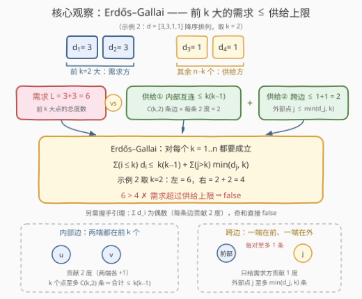
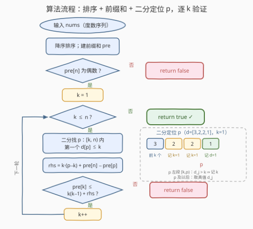

# 判断是否存在简单图

- **题目名称**：判断是否存在简单图
- **链接**：[3656. 判断是否存在简单图](https://leetcode.cn/problems/determine-if-a-simple-graph-exists/)
- **难度**：中等
- **标签**：图、数组、排序、二分查找、前缀和

## 1. 题目概述

> ⚠️ 本题为 LeetCode 付费题（Plus 会员专享），题意描述根据官方示例用例与 hints 重建，可能与官方题面有出入。

**题意**：给定一个非负整数数组 `nums`，令 `n = nums.length`。判断是否存在一个由 `n` 个节点组成的**简单图**——即**无自环、无重边**的无向图——使得第 `i` 个节点的**度数**（与它相连的边数）恰好等于 `nums[i]`。存在返回 `true`，否则返回 `false`。

**示例 1**：

```text
输入：nums = [3,1,2,2]
输出：true
解释：取 4 个节点 0~3，连边 0-1、0-2、0-3、2-3，
     各节点度数依次为 3、1、2、2，与 nums 完全一致。
```

**示例 2**：

```text
输入：nums = [1,3,3,1]
输出：false
解释：度数总和 8 为偶数、最大度 3 也不超过 n-1 = 3，两个显性必要条件都满足，
     但任何简单图都实现不了这个度数序列（见 2.4 的 Erdős–Gallai 演算）。
```

**约束条件**（官方约束未公开，按同类题推测）：

- `1 <= nums.length <= 10^5`
- `0 <= nums[i] <= 10^5`（若出现 `nums[i] > n-1` 的值，算法会自然判出 `false`）

> 💡 **审题关键**：① **简单图** = 无自环 + 无重边 ⇒ 任意一点的度数至多 `n-1`，任意一对点之间至多贡献一条边（每条边给两端各 `+1` 度）；② 图**不要求连通**，度数为 0 的孤立点完全合法；③ 官方 hint 只有一句 "Use the Erdős–Gallai theorem"，直接点名本题的数学内核——**度序列可图化判定**。

---

## 2. 解题思路

### 2.1 直觉思路：Havel–Hakimi 贪心构造（O(n²)）

把度序列**降序**排列，每一轮：

1. 取出度数最大的点（设度数为 $d$）——它必须恰好连 $d$ 条边；
2. 贪心地让它连向**剩余度数最大的 $d$ 个点**（交换论证：若某最优实现中它连了度更小的点 $u$ 而漏了度更大的点 $v$，把 $v$ 的一条邻边改接到 $u$ 上不改变任何度数），这 $d$ 个点度数各减 1；
3. 重复，直到全为 0（返回 `true`），或中途出现负度数 / 最大度 ≥ 剩余点数（返回 `false`）。

- **正确性**：这是经典的 Havel–Hakimi 定理，贪心选择不会丢失解；
- **瓶颈**：每轮选最大、消度后重新排序，朴素实现 $O(n^2 \log n)$（计数排序可压到 $O(n^2)$），$n = 10^5$ 时约 $10^{10}$ 次操作，超时；
- **价值**：它给出了「度数大的点最难伺候」的直觉，也顺带是 Erdős–Gallai 不等式**必要性**的构造性来源。

> ⚠️ 突破口是把「逐点构造」换成「整体判定」：不真的建图，而是问「前 $k$ 大度数的总需求，会不会超过全图能提供的供给上限」——这正是 Erdős–Gallai 定理刻画的内容。

### 2.2 核心观察：Erdős–Gallai 定理（供需不等式）



将度序列降序排列为 $d_1 \ge d_2 \ge \dots \ge d_n$。它可图化（存在简单图实现）的**充要条件**是：

1. **握手引理**：$\sum_i d_i$ 为偶数（每条边贡献 2 度，总度数 = 2 × 边数）；
2. **Erdős–Gallai 不等式**：对每个 $k = 1, \dots, n$，

$$\sum_{i=1}^{k} d_i \;\le\; k(k-1) \;+\; \sum_{j=k+1}^{n} \min(d_j,\, k)$$

把不等式读成「**需求 ≤ 供给**」，两侧含义非常直观：

- **左侧（需求）**：度数最大的 $k$ 个点的总度数 $\sum_{i \le k} d_i$，全部要靠边的端点来满足；
- **右侧（供给上限）**：这 $k$ 个点能拿到的度数至多来自两部分——
  - **内部互连**：$k$ 个点两两至多一条边，共 $\binom{k}{2}$ 条、每条贡献 2 度，合计至多 $2\binom{k}{2} = k(k-1)$；
  - **跨边**：连向后面 $n-k$ 个点。外部点 $j$ 的度数只有 $d_j$，且简单图下它与前部 $k$ 个点至多各连一条 ⇒ 至多 $\min(d_j, k)$ 条跨边，每条恰贡献 1 度（只算前部那一端）。

任何满足度序列的图都自动满足这组不等式（必要性即上述计数）；Erdős 与 Gallai（1960）证明了反过来也成立——**不等式全部通过 + 总和为偶，图就一定能建出来**（充分性可由 Havel–Hakimi 构造佐证）。

> 💡 **两个免费副产品**：$k=1$ 时不等式为 $d_1 \le \sum_{j>1}\min(d_j,1) \le n-1$——即「最大度不超过 $n-1$」这条常识特判被天然覆盖，不用单独写；$k=n$ 时为 $\sum d_i \le n(n-1)$，同样自动覆盖。

### 2.3 算法流程：排序 + 前缀和 + 二分查找



剩下的问题只有一个：对每个 $k$，如何**快速**算出 $R(k) = \sum_{j>k} \min(d_j, k)$。

由于数组已降序，存在分界位置 $p$：下标 $\ge p$ 的元素 $d_j \le k$（取真值），下标在 $[k, p)$ 的元素 $d_j > k$（被 $\min$ 截断成 $k$）。于是

$$R(k) = \underbrace{k \cdot (p - k)}_{\text{截断段各贡献 } k} \;+\; \underbrace{\text{pre}[n] - \text{pre}[p]}_{\text{真值段之和}}$$

其中 $\text{pre}$ 是前缀和数组。$p$ 用**二分查找**「$[k, n)$ 内第一个 $d_p \le k$ 的位置」得到。

**逻辑执行步骤**：

| 步骤 | 操作 | 说明 |
|------|------|------|
| ① 排序 | 度序列降序排列，建前缀和 `pre` | 后续所有查询依赖降序单调性 |
| ② 奇偶检查 | `pre[n] % 2 == 1` → `false` | 握手引理，先挡掉一半输入 |
| ③ 二分定位 | 在 `[k, n)` 内二分找第一个 `d[p] <= k` 的 `p` | `p = n` 表示后面全被截断 |
| ④ 求右端 | `rhs = k*(p-k) + pre[n] - pre[p]` | 截断段 + 真值段，两段 O(1) |
| ⑤ 验证 | `pre[k] > k*(k-1) + rhs` → `false` | Erdős–Gallai 不等式 |
| ⑥ 收尾 | 所有 `k` 通过 → `true` | 充要条件，无需再构造图 |

> ⚠️ 别忘了 `pre[k]` 用的是**排序后**的前缀和——左侧需求是「前 $k$ 大」之和，若忘了先降序排序，一切全错。另一个坑：二分下界是 $k$ 不是 $0$，因为下标 $< k$ 的点属于「需求方」，不参与 $\min(d_j, k)$ 的供给求和。

### 2.4 示例演算

**示例 1**：`nums = [3,1,2,2]` → 降序 `[3,2,2,1]`，总和 8 为偶数 ✓

| $k$ | 左侧 $\sum_{i \le k} d_i$ | 右侧 $k(k{-}1) + \sum_{j>k}\min(d_j,k)$ | 结论 |
|-----|--------------------------|------------------------------------------|------|
| 1 | 3 | $0 + \min(2,1)+\min(2,1)+\min(1,1) = 3$ | ✓（恰好取等） |
| 2 | 5 | $2 + \min(2,2)+\min(1,2) = 5$ | ✓（取等） |
| 3 | 7 | $6 + \min(1,3) = 7$ | ✓（取等） |
| 4 | 8 | $12 + 0 = 12$ | ✓ |

全部通过 → `true`（三次取等说明这张图相当"紧凑"，对应 2.1 中给出的构造）。

**示例 2**：`nums = [1,3,3,1]` → 降序 `[3,3,1,1]`，总和 8 为偶数 ✓

| $k$ | 左侧 | 右侧 | 结论 |
|-----|------|------|------|
| 1 | 3 | $0 + 1+1+1 = 3$ | ✓ |
| 2 | 6 | $2 + \min(1,2)+\min(1,2) = 4$ | **✗ 违反** |

$k=2$ 即爆：两个度 3 的点要吃 6 度，但它们互相至多供给 2 度、剩下两个度 1 的点至多各供给 1 条跨边，供给上限只有 4 → `false`。

---

## 3. 参考代码

> 💡 付费题无官方代码模板，函数名按 LeetCode 语义惯例推断为 `isPossible`，提交时以实际题目签名为准。

### C++

```cpp
class Solution {
  public:
    bool isPossible(vector<int>& nums) {
        int n = nums.size();
        for (int x : nums)
            if (x < 0) return false;            // 度数必须非负（防御式）
        sort(nums.rbegin(), nums.rend());       // 降序：需求方 = 前 k 大
        vector<long long> pre(n + 1, 0);        // n*max(d) 可达 1e10，必须 long long
        for (int i = 0; i < n; ++i) pre[i + 1] = pre[i] + nums[i];
        if (pre[n] % 2) return false;           // 握手引理

        for (int k = 1; k <= n; ++k) {
            int lo = k, hi = n;                 // 在 [k, n) 二分第一个 nums[p] <= k
            while (lo < hi) {
                int mid = lo + (hi - lo) / 2;
                if (nums[mid] > k) lo = mid + 1;
                else hi = mid;
            }
            int p = lo;
            long long rhs = 1LL * k * (p - k) + pre[n] - pre[p];
            if (pre[k] > 1LL * k * (k - 1) + rhs) return false;  // Erdős–Gallai
        }
        return true;
    }
};
```

> 💡 **写法要点**：
> - 前缀和与 `rhs` 用 `long long`：$n \cdot \max d$ 可达 $10^{10}$，`int` 必溢出；
> - 二分区间是 `[k, n)` 而非 `[0, n)`：下标 `< k` 的点在需求方，混入会虚增供给；
> - 不需要单独特判 `max(nums) > n-1`——$k=1$ 的不等式已覆盖（见 2.2）。

### Python

```python
class Solution:
    def isPossible(self, nums: List[int]) -> bool:
        if any(x < 0 for x in nums):
            return False
        nums.sort(reverse=True)                  # 降序：需求方 = 前 k 大
        n = len(nums)
        pre = [0] * (n + 1)
        for i, x in enumerate(nums):
            pre[i + 1] = pre[i] + x
        if pre[n] % 2:
            return False                         # 握手引理

        for k in range(1, n + 1):
            lo, hi = k, n                        # 在 [k, n) 二分第一个 nums[p] <= k
            while lo < hi:
                mid = (lo + hi) // 2
                if nums[mid] > k:
                    lo = mid + 1
                else:
                    hi = mid
            p = lo
            rhs = k * (p - k) + pre[n] - pre[p]
            if pre[k] > k * (k - 1) + rhs:       # Erdős–Gallai
                return False
        return True
```

> 💡 **写法要点**：
> - `nums.sort(reverse=True)` 原地降序即可，题目只要求判定、不要求保留原序；
> - Python 的 `bisect` 不直接支持降序数组，手写这段三行二分反而最清晰；
> - 若想偷懒也可升序排序 + 后缀和处理，逻辑等价但容易绕晕，不推荐。

---

## 4. 复杂度分析

| 维度 | 复杂度 | 说明 |
|------|--------|------|
| 时间复杂度 | $O(n \log n)$ | 排序 $O(n \log n)$ + $n$ 个 $k$ 各一次 $O(\log n)$ 二分 + $O(1)$ 前缀和查询 |
| 空间复杂度 | $O(n)$ | 前缀和数组 `pre` |

> - 与 Havel–Hakimi 的 $O(n^2)$ 相比，加速来源是把「逐点构造」整体坍缩成「每个前缀一次 $O(\log n)$ 的计数判定」——这正是标签里 Sorting / Prefix Sum / Binary Search 三件套的用武之地；
> - 若再放宽值域，排序可换计数排序 $O(n + D)$，配合 5 节的双指针，整体可到线性——但 $n \le 10^5$ 下 $O(n \log n)$ 已绰绰有余。

---

## 5. 扩展：双指针替代二分，省掉 $\log n$

观察分界点 $p(k)$（「第一个 $d_j \le k$ 的下标」）随 $k$ 增大**只会左移**：$k$ 变大后，满足 $d_j \le k$ 的元素只多不少，最靠前的那个下标单调不增。于是可用双指针把每个 $k$ 的定位摊还成 $O(1)$：

```python
q = n                                   # 全局指针：第一个 d[q] <= k 的下标
for k in range(1, n + 1):
    while q > 0 and nums[q - 1] <= k:   # 阈值升高，分界只左移
        q -= 1
    p = max(q, k)                       # 搜索域 [k, n)：钳到下界 k
    rhs = k * (p - k) + pre[n] - pre[p]
    if pre[k] > k * (k - 1) + rhs:
        return False
```

- `q` 全程只向左走，均摊 $O(n)$；`max(q, k)` 处理「分界已越过下界」的情形（此时 $d_k \le k$，真值从 $k$ 自己开始）；
- 若需求 $p$ 的**右移**（升序数组习惯）容易写出反向 bug——记住阈值 $k$ 增大 ⇒ 条件变松 ⇒ 分界**左移**。

另一条分支值得记住：若题目还要求**输出一张满足条件的图**（构造而不仅是判定），Erdős–Gallai 就不够了，回到 **Havel–Hakimi**（$O(n^2)$，堆/桶优化后更低）——判定用定理，构造用贪心。

---

## 6. 面试要点

**Q1：为什么度数总和必须是偶数？**

> 握手引理：每条边给两个端点各贡献 1 度，总度数 $= 2 \times$ 边数，恒为偶数。这是 $O(n)$ 的第一道闸门，先挡掉奇和输入再谈别的。

**Q2：Erdős–Gallai 不等式两边各是什么含义？**

> 左边 $\sum_{i \le k} d_i$ 是度数最大的 $k$ 个点的**总需求**；右边是它们的**供给上限**：内部互连至多 $2\binom{k}{2} = k(k-1)$ 度，跨边按外部点逐个计——外部点 $j$ 受自身度数 $d_j$ 与「前部每点至多一条边」双重限制，至多 $\min(d_j, k)$ 条、每条恰供 1 度。需求一旦超过供给上限，图必然建不出来。

**Q3：为什么只检查「前 k 大」的前缀就够了？**

> 直觉：度数大的点最难满足，任何供需矛盾总会暴露在某个「前 $k$ 大」的前缀上——Havel–Hakimi 贪心优先服务最大度点，正是这一直觉的算法化。严格地，必要性对任意 $k$ 点子集都成立，而 Erdős–Gallai（1960）证明了检查降序前缀这 $n$ 个不等式即**充分**。完整证明超出面试范围，能讲清供需直觉 + 命题方向即可。

**Q4：还需要单独特判「最大度超过 n-1」吗？**

> 不需要。取 $k=1$：$d_1 \le \sum_{j>1}\min(d_j,1) \le n-1$，简单图无自环无重边的这条常识约束已被第一个不等式天然覆盖。同理 $k=n$ 覆盖了 $\sum d_i \le n(n-1)$。

**Q5：Havel–Hakimi 和 Erdős–Gallai 怎么选？**

> HH 是**构造性**算法，能真的把图画出来，但朴素 $O(n^2)$；EG 是**判定性**定理，排序 + 前缀和 + 二分 $O(n \log n)$，只回答 true/false。只要判定选 EG，要输出图选 HH；面试先讲 HH 建立「最大度优先」的直觉，再引出 EG 的整体判定，是标准叙事线。

> 💡 **一句话总结**：握手引理挡奇和，Erdős–Gallai 逐前缀验「需求 ≤ 供给」——降序排序后前缀和 + 二分定位截断点，$O(n \log n)$ 判定度序列可图化。

---

## 7. 同类练习题

- [2508. 添加边使所有节点度数都为偶数](https://leetcode.cn/problems/add-edges-to-make-degrees-of-all-nodes-even/)：握手引理的构造版——数出度数为奇的点两两配对加边
- [997. 找到小镇的法官](https://leetcode.cn/problems/find-the-town-judge/)：度数计数判定（信任 = 入度 n−1、出度 0），用度数刻画图结构
- [1791. 找出星型图的中心节点](https://leetcode.cn/problems/find-center-of-star-graph/)：从度数结构一步推理（中心点度数恰为 n−1）
- [1761. 一个图中连通三元组的最小度数](https://leetcode.cn/problems/minimum-degree-of-a-connected-trio-in-a-graph/)：度数的组合计算与邻接集合交，练「按度数思考图」
