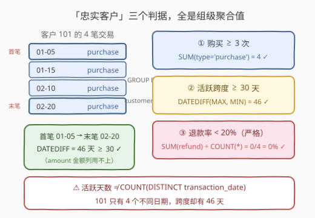
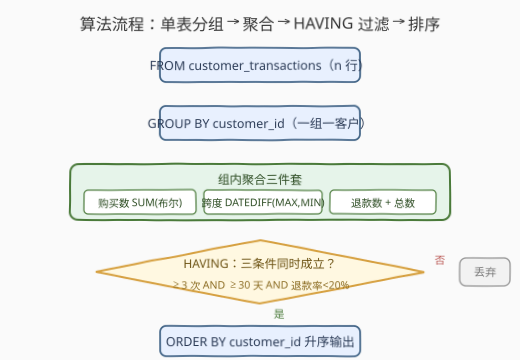

# LeetCode 寻找忠实客户 题解

## 1. 题目概述

- **标题 / 题号**：寻找忠实客户（#3657，medium）
- **链接**：https://leetcode.cn/problems/find-loyal-customers/
- **难度**：中等
- **标签**：数据库、SQL、`GROUP BY`、聚合函数、`HAVING`、条件聚合、`DATEDIFF`、pandas

**表结构**：

```text
表：customer_transactions
+------------------+---------+
| Column Name      | Type    |
+------------------+---------+
| transaction_id   | int     |  ← 主键
| customer_id      | int     |
| transaction_date | date    |
| amount           | decimal |
| transaction_type | varchar |  ← 'purchase' 或 'refund'
+------------------+---------+
```

一个客户是**忠实客户**，当且仅当同时满足以下三个条件：

1. **购买次数**：进行了**至少 3 次**购买（`purchase`）交易；
2. **活跃天数**：活跃了**至少 30 天**；
3. **退款率**：退款交易数 ÷ 总交易数（purchase + refund）**严格小于 20%**。

返回 `customer_id`，按**升序**排序。

**示例**（4 个客户逐个判定）：

```text
客户 101：4 购买、0 退款 → 退款率 0/4 = 0%；活跃 01-05 ~ 02-20 = 46 天 → ✓ 忠实
客户 102：3 购买、2 退款 → 退款率 2/5 = 40% ≥ 20% → ✗
客户 103：3 购买、0 退款 → 退款率 0%；但活跃 01-01 ~ 01-03 仅 2 天 → ✗
客户 104：5 购买、1 退款 → 退款率 1/6 ≈ 16.7% < 20%；活跃 01-01 ~ 03-15 = 73 天 → ✓ 忠实

输出：
+-------------+
| customer_id |
+-------------+
| 101         |
| 104         |
+-------------+
```

> 💡 **审题关键**：①「活跃天数」按示例口径是**首末交易日期的差值**（`DATEDIFF(MAX(date), MIN(date))`），不是去重交易天数——客户 101 只有 4 个不同日期却活跃 46 天；② 退款率的分母是**全部交易**（purchase + refund），只取 purchase 行会把分母算小；③「少于 20%」是**严格小于**，恰好等于 20%（如 1/5）不算达标；④ `amount` 列是烟雾弹——三个条件全是**计数与日期**，与金额无关。

## 2. 解题思路

### 2.1 暴力思路：应用层逐客户扫描

把整张表读进内存，按 `customer_id` 开桶，逐行累加购买数、退款数，并维护日期的最小/最大值，最后逐桶判定三条件：

```text
for row in transactions:
    b = bucket[row.customer_id]
    if row.type == 'purchase': b.purchases += 1
    else: b.refunds += 1
    b.min_date = min(b.min_date, row.date)
    b.max_date = max(b.max_date, row.date)
loyal = [c for c, b in bucket.items()
         if b.purchases >= 3 and (b.max_date - b.min_date).days >= 30
         and b.refunds / (b.purchases + b.refunds) < 0.2]
```

逻辑正确，但聚合、过滤、排序全搬到了应用层。SQL 的 `GROUP BY + HAVING` 正是为「按组统计、按统计值筛组」而生——一条查询把扫描、聚合、过滤、排序全部下推给引擎完成。

### 2.2 核心观察：三个判据全是组级聚合，一次 `GROUP BY` 全拿下



三个条件逐个翻译成聚合表达式：

| 题意要求 | SQL 聚合表达 | 示例（客户 104） |
|----------|--------------|------------------|
| 购买 ≥ 3 次 | `SUM(transaction_type = 'purchase') >= 3` | 5 ✓ |
| 活跃 ≥ 30 天 | `DATEDIFF(MAX(transaction_date), MIN(transaction_date)) >= 30` | 73 天 ✓ |
| 退款率 < 20% | `SUM(transaction_type = 'refund') / COUNT(*) < 0.2` | 1/6 ≈ 16.7% ✓ |

两个关键技巧：

- **布尔条件求和当计数**：MySQL 中 `transaction_type = 'purchase'` 返回 `1`/`0`，`SUM(...)` 即条件计数，免写 `CASE WHEN`；跨库稳妥写法是 `SUM(CASE WHEN ... THEN 1 ELSE 0 END)`。
- **活跃跨度用极值差**：`MAX`/`MIN` 各取一次再做 `DATEDIFF`，就是「首末交易日期差」。⚠️ 不要写成 `COUNT(DISTINCT transaction_date) >= 30`——客户 101 只有 4 个不同日期、跨度却 46 天，两种口径会得出相反结论。

> ⚠️ **除法的两种边界**：① MySQL 的 `/` 恒为小数除（整除是 `DIV`），`SUM(...) / COUNT(*)` 得精确小数，可安全地与 `0.2` 比较；② 若担心其他库的整数除陷阱，可把「$R/T < 0.2$」等价改写成**纯整数不等式** $R \times 5 < T$（两边同乘正数 $5T$），彻底绕开除法。

### 2.3 算法流程



| 步骤 | 子句 | 作用 |
|------|------|------|
| ① | `FROM customer_transactions` | 逐行流入，**不做任何预过滤** |
| ② | `GROUP BY customer_id` | 一位客户一组 |
| ③ | 聚合 | 每组算出购买数、日期跨度、退款数与总数 |
| ④ | `HAVING` | 三条件 `AND`：≥ 3 次、≥ 30 天、退款率 < 20% |
| ⑤ | `ORDER BY` | `customer_id` 升序输出 |

> ⚠️ 三条件都涉及聚合结果，必须写 `HAVING`；`WHERE` 在分组前逐行生效，写不了 `SUM/MAX/MIN`。尤其**不能**先 `WHERE transaction_type = 'purchase'` 预过滤——那会把 refund 行整行删掉：退款率分子永远为 0、分母也变小，判定全盘失真（与 3642「极端评分预过滤弄丢分母」是同一陷阱）。

### 2.4 示例演算

对 4 个客户逐组聚合（跨度 = 首末日期差）：

| customer | purchases | refunds | total | 退款率 | 跨度（天） | 判定 |
|----------|-----------|---------|-------|--------|-----------|------|
| 101 | 4 | 0 | 4 | 0/4 = 0% | 01-05→02-20 = 46 | ✓ 三关全过 → 忠实 |
| 102 | 3 | 2 | 5 | 2/5 = 40% | 01-10→02-15 = 36 | ✗ 退款率 ≥ 20% |
| 103 | 3 | 0 | 3 | 0/3 = 0% | 01-01→01-03 = 2 | ✗ 跨度 < 30 |
| 104 | 5 | 1 | 6 | 1/6 ≈ 16.7% | 01-01→03-15 = 73 | ✓ 三关全过 → 忠实 |

- 客户 102 说明「购买数、跨度双双达标，仍可能被退款率一票否决」；
- 客户 103 是**口径陷阱**的典型：若误用去重天数口径，它同样被淘汰（碰巧结论一致），但客户 101（4 个不同日期、跨度 46 天）就会被**错误淘汰**——而示例输出里 101 是忠实客户，反证了本题口径是首末跨度。

## 3. 参考代码

### SQL（MySQL）

```sql
SELECT customer_id
FROM customer_transactions
GROUP BY customer_id
HAVING SUM(transaction_type = 'purchase') >= 3
   AND DATEDIFF(MAX(transaction_date), MIN(transaction_date)) >= 30
   AND SUM(transaction_type = 'refund') * 5 < COUNT(*)
ORDER BY customer_id;
```

> 💡 **写法要点**：
> - **整数不等式代替除法**：`退款数 × 5 < 总数` 与 `退款数 ÷ 总数 < 0.2` 等价，规避整数除与浮点精度两类隐患；直接写 `SUM(...) / COUNT(*) < 0.2` 在 MySQL 下同样正确（`/` 为小数除）。
> - **布尔求和**：`SUM(type = 'purchase')` 是 MySQL 的便利写法，标准 SQL 写 `SUM(CASE WHEN transaction_type = 'purchase' THEN 1 ELSE 0 END)`。
> - **跨度判定**：`DATEDIFF(d1, d2)` 是 MySQL 函数，返回 `d1 − d2` 的天数（前大后小为正）；PostgreSQL / SQLite / SQL Server 的对照写法见第 5 节。
> - 单表查询，无需任何 `JOIN`；`amount` 列用不上。

### Python（pandas）

```python
import pandas as pd

def find_loyal_customers(customer_transactions: pd.DataFrame) -> pd.DataFrame:
    t = customer_transactions.copy()
    t['transaction_date'] = pd.to_datetime(t['transaction_date'])
    stats = t.groupby('customer_id').agg(
        purchases=('transaction_type', lambda s: (s == 'purchase').sum()),
        refunds=('transaction_type', lambda s: (s == 'refund').sum()),
        total=('transaction_id', 'size'),
        first=('transaction_date', 'min'),
        last=('transaction_date', 'max'),
    ).reset_index()
    stats['span_days'] = (stats['last'] - stats['first']).dt.days
    loyal = stats[
        (stats['purchases'] >= 3)
        & (stats['span_days'] >= 30)
        & (stats['refunds'] * 5 < stats['total'])
    ]
    return loyal[['customer_id']].sort_values('customer_id')
```

> 💡 **pandas 对照**：
> - 先 `pd.to_datetime` 转时间戳，`(last - first).dt.days` 即 `DATEDIFF`；不转换直接对字符串日期做差会报错。
> - `agg` 里的 `lambda` 做条件计数，对应 SQL 的 `SUM(布尔)`；`('transaction_id', 'size')` 对应 `COUNT(*)`。
> - `refunds * 5 < total` 与 SQL 侧保持同一整数判定，避免浮点比较的边界歧义。

## 4. 复杂度分析

| 维度 | 复杂度 | 说明 |
|------|--------|------|
| **时间** | $O(n + k\log k)$ | 单趟扫描聚合 $O(n)$（$n$ = 交易行数，每行恰属一组）；按 `customer_id` 排序 $O(k\log k)$（$k$ = 客户数） |
| **空间** | $O(k)$ | 每客户一组的聚合状态（购买数、退款数、日期极值），与 $n$ 无关 |
| **对比暴力法** | 应用层扫描同为 $O(n)$ | 单条 SQL 免去整表传输到应用层的 IO 与往返，过滤后仅返回少量结果行 |

## 5. 扩展：日期差计算的跨库对照

「活跃跨度」需要两个 `DATE` 的天数差，各库写法不同，面试白板题常考：

| 数据库 | 写法 | 说明 |
|--------|------|------|
| MySQL | `DATEDIFF(d1, d2)` | 返回 `d1 − d2` 的天数，参数顺序「前减后」 |
| PostgreSQL | `MAX(d) - MIN(d)` | `date` 相减直接得 `integer` 天数 |
| SQLite | `CAST(JULIANDAY(MAX(d)) - JULIANDAY(MIN(d)) AS INTEGER)` | 儒略日差值再取整 |
| SQL Server | `DATEDIFF(day, MIN(d), MAX(d))` | 注意**第一个参数**是日期部件，与 MySQL 参数语义不同 |

> 💡 若被追问「活跃天数」的定义，可主动提出两种口径并请面试官确认：**首末跨度**（本题口径，`DATEDIFF`）与**去重活跃日数**（`COUNT(DISTINCT date)`）。动手前澄清口径歧义，比写对代码更加分。

## 6. 面试要点

**Q1：为什么「活跃至少 30 天」不能写成 `COUNT(DISTINCT transaction_date) >= 30`？**

> 示例中客户 101 只有 4 个不同交易日期，但首末跨度 46 天，被判定为忠实。本题口径是首末日期差 `DATEDIFF(MAX, MIN) >= 30`，衡量「客户关系的时间跨度」而非「交易频次」。写错口径会在 101 这类客户上得出相反结论。

**Q2：三个条件为什么必须写 `HAVING` 而不是 `WHERE`？**

> 三条件全部依赖 `SUM/MAX/MIN/COUNT` 等组级聚合；`WHERE` 在 `GROUP BY` 之前逐行生效，此时组还没形成。口诀：条件含聚合 → `HAVING`；条件只涉及当前行原始列 → `WHERE`。

**Q3：能不能先 `WHERE transaction_type = 'purchase'` 只留购买行再统计？**

> 不能。退款率 = 退款数 ÷ 总交易数，分母包含 refund 行；预过滤会同时弄丢分子（refund 行全没了，退款率恒为 0）与分母（总数变小），第三个条件直接失真。正确姿势是**行全保留、按条件聚合**（`SUM(布尔)` 条件计数）。

**Q4：`SUM(refund) / COUNT(*) < 0.2` 有什么边界隐患？如何规避？**

> 一是「少于 20%」为严格小于，退款率恰为 1/5 = 20% 应淘汰，别顺手写成 `<=`；二是部分数据库对整数 `/` 做整除——例如 2 笔退款 ÷ 10 笔总交易，真实比率恰为 20% 应淘汰，整除得 0 < 0.2 反而误判为忠实。规避：等价改写成整数不等式 `SUM(refund) * 5 < COUNT(*)`，或乘 `1.0` 强制小数除。

**Q5：若还要输出保留两位小数的退款率，`ROUND` 放哪里？**

> 过滤与展示分离：`HAVING` 用原始比值判定，`ROUND(ratio, 2)` 只放进 `SELECT`。若先 `ROUND` 再比较，$0.196$ 会被舍成 $0.20$ 而被 `< 0.2` 的判定误杀（$0.204$ 类边界同理引发误收）。

> 💡 **一句话总结**：3657 是「单表 `GROUP BY` + 多条件 `HAVING`」的模板题——`SUM(布尔)` 条件计数、`DATEDIFF(MAX, MIN)` 算活跃跨度、整数不等式规避除法陷阱；最大陷阱是把「活跃天数」误解成去重天数，以及预过滤 purchase 行弄丢退款率的分母。

## 同类练习题

| # | 题目 | 与本题的关联 |
|---|------|-------------|
| 1050 | [合作过至少三次的演员和导演](https://leetcode.cn/problems/actors-and-directors-who-cooperated-at-least-three-times/)（[题解](../1001-1100/1050_合作过至少三次的演员和导演.md)） | `GROUP BY + HAVING COUNT(*) >= 3`，与本题「购买 ≥ 3 次」同款组级计数过滤 |
| 550 | [游戏玩法分析IV](https://leetcode.cn/problems/game-play-analysis-iv/)（[题解](../0501-0600/550_游戏玩法分析IV.md)） | 日期口径判定（次日回流）+ 比值过滤，与本题活跃跨度、退款率两个环节分别对应 |
| 586 | [订单最多的客户](https://leetcode.cn/problems/customer-placing-the-largest-number-of-orders/)（[题解](../0501-0600/586_订单最多的客户.md)） | 单表分组计数再按聚合值取最值，本题的单条件极简版 |
| 197 | [上升的温度](https://leetcode.cn/problems/rising-temperature/)（[题解](../0101-0200/197_上升的温度.md)） | `DATEDIFF` 的自连接用法，与本题首末跨度计算对照巩固日期差函数 |
| 1084 | [销售分析III](https://leetcode.cn/problems/sales-analysis-iii/)（[题解](../1001-1100/1084_销售分析III.md)） | `HAVING` 中组合日期与条件聚合，进一步体会「对组过滤」的多条件写法 |
