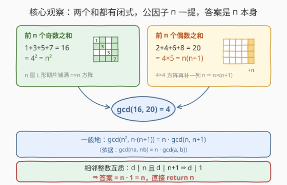
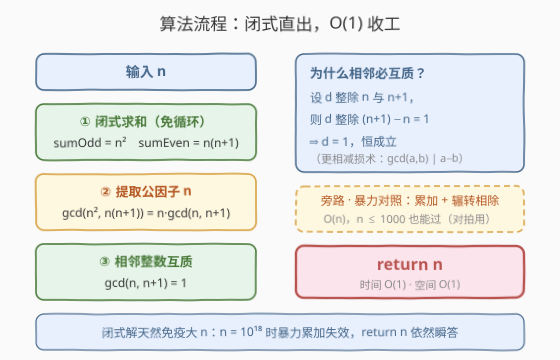

# 奇数和与偶数和的最大公约数

- **题目名称**：奇数和与偶数和的最大公约数
- **链接**：[3658. 奇数和与偶数和的最大公约数](https://leetcode.cn/problems/gcd-of-odd-and-even-sums/)
- **难度**：简单
- **标签**：数学、数论

## 1. 题目概述

给你一个整数 `n`，请计算以下两个值的**最大公约数（GCD）**：

- `sumOdd`：最小的 `n` 个正奇数之和（$1 + 3 + 5 + \cdots$）；
- `sumEven`：最小的 `n` 个正偶数之和（$2 + 4 + 6 + \cdots$）。

返回 $\gcd(\text{sumOdd}, \text{sumEven})$。

**示例 1**：

```text
输入：n = 4
输出：4
解释：sumOdd = 1 + 3 + 5 + 7 = 16，sumEven = 2 + 4 + 6 + 8 = 20，GCD(16, 20) = 4。
```

**示例 2**：

```text
输入：n = 5
输出：5
解释：sumOdd = 1 + 3 + 5 + 7 + 9 = 25，sumEven = 2 + 4 + 6 + 8 + 10 = 30，GCD(25, 30) = 5。
```

**约束条件**：

- $1 \le n \le 1000$

> 💡 **审题关键**：① 两个序列**项数相同**（各 `n` 项），一个全奇、一个全偶；② 求的是**两个和**的 gcd，不是逐项配对的 gcd；③ `n` 很小（≤ 1000），暴力必然可过——但这题真正考察的是**能否看出闭式与互质结构，把 $O(n)$ 压成 $O(1)$**。

---

## 2. 解题思路

### 2.1 暴力思路：老实累加 + 辗转相除

按定义循环累加出两个和，再跑一遍欧几里得算法：

```python
s1 = sum(2 * i - 1 for i in range(1, n + 1))   # 前 n 个奇数
s2 = sum(2 * i for i in range(1, n + 1))       # 前 n 个偶数
return math.gcd(s1, s2)
```

时间 $O(n + \log n)$，$n \le 1000$ 秒过。但若把约束放大到 $n \le 10^{18}$，累加彻底失效——看看数据本身的结构：两个和其实都有**闭式**。

### 2.2 核心观察：两个闭式 + 相邻互质 ⇒ 答案就是 n



**观察一：前 n 个奇数之和恰为 n²。**

$$1 + 3 + 5 + \cdots + (2n-1) = n^2$$

三种视角：**等差数列求和**——首项 1、末项 $2n-1$、项数 $n$，和为 $n \cdot \frac{1 + 2n - 1}{2} = n^2$；**平方差 telescoping**——$(k+1)^2 - k^2 = 2k+1$，从 $0^2$ 一路差分到 $n^2$，中间项相消，右边恰好把每个奇数各用一次；**几何直观**——第 $k$ 层「L 形砌片」恰有 $2k-1$ 个格子，$n$ 层恰好铺满 $n \times n$ 方阵。

**观察二：前 n 个偶数之和为 n(n+1)。**

$$2 + 4 + \cdots + 2n = 2(1 + 2 + \cdots + n) = n(n+1)$$

**观察三：提取公因子后只剩相邻两数。** 利用 $\gcd(na,\ nb) = n \cdot \gcd(a,\ b)$（$n \ge 1$）：

$$\gcd(n^2,\ n(n+1)) = n \cdot \gcd(n,\ n+1)$$

而**相邻整数必互质**：若 $d \mid n$ 且 $d \mid n+1$，则 $d \mid (n+1) - n = 1$，故 $d = 1$。于是

$$\gcd(\text{sumOdd}, \text{sumEven}) = n \cdot 1 = n$$

答案就是输入本身——`return n`。示例也印证：$n=4$ 时 $\gcd(16, 20) = 4$，$n=5$ 时 $\gcd(25, 30) = 5$。

### 2.3 算法流程图



**逻辑执行步骤**：

| 步骤 | 操作 | 说明 |
|------|------|------|
| ① 闭式求和 | $\text{sumOdd} = n^2$，$\text{sumEven} = n(n+1)$ | 两个等差数列求和公式，免循环 |
| ② 提取公因子 | $\gcd(n^2,\ n(n+1)) = n \cdot \gcd(n,\ n+1)$ | 公因子 $n$ 直接提出 |
| ③ 相邻互质 | $\gcd(n,\ n+1) = 1$ | 公共因子必然整除差 $1$ |
| ④ 返回 | `return n` | $O(1)$ 直出，无任何特例 |

> ⚠️ **一个高频坑**：「相邻互质」依赖 $\gcd(a, b) \mid a - b$（更相减损术），对**任意**相邻整数成立，与 $n$ 的奇偶、大小无关——不需要按 $n$ 的奇偶分类讨论。

### 2.4 示例演算

| n | sumOdd（前 n 个奇数） | sumEven（前 n 个偶数） | gcd | 答案 = n？ |
|---|---|---|---|---|
| 1 | 1 | 2 | 1 | ✓ |
| 4 | 16（= 4²） | 20（= 4×5） | 4 | ✓ |
| 5 | 25（= 5²） | 30（= 5×6） | 5 | ✓ |

三行全部落在「$n^2$ 与 $n(n+1)$ 的 gcd」这条通式上。顺手拿 $n = 1$（和为 1 与 2，gcd = 1）做边界自检：公式无特例，最小输入直接命中。

---

## 3. 参考代码

### C++

```cpp
class Solution {
public:
    int gcdOfOddEvenSums(int n) {
        // sumOdd = n^2, sumEven = n(n+1)
        // gcd(n^2, n(n+1)) = n * gcd(n, n+1) = n * 1 = n
        return n;
    }
};
```

> 💡 面试时建议同时口述暴力版用于对拍自检：循环累加两个和后调 `__gcd(s1, s2)`，$O(n)$——「先给暴力、再给闭式」的叙事比直接甩一行 `return n` 更有说服力。

### Python

```python
class Solution:
    def gcdOfOddEvenSums(self, n: int) -> int:
        return n
```

---

## 4. 复杂度分析

| 维度 | 复杂度 | 说明 |
|------|--------|------|
| **时间复杂度** | $O(1)$ | 求和公式 + 互质结论直出，无循环 |
| **空间复杂度** | $O(1)$ | 无额外数据结构 |

> 对比暴力 $O(n)$：本题 $n \le 1000$ 感知不到差距，但约束一旦放大到 $10^{18}$，只有闭式解存活。

---

## 5. 扩展：变形与延伸

**变体一：奇偶各取不同项数。** 若求 $\gcd(\text{前 } n \text{ 个奇数和},\ \text{前 } m \text{ 个偶数和}) = \gcd(n^2,\ m(m+1))$，「相邻互质」结构消失，一般没有整洁结论，只能按定义计算——本题的优雅依赖「两个和共享因子 $n$ 且剩余部分恰好相邻」这一巧合。

**变体二：改成最小公倍数。** 由 $\gcd \cdot \operatorname{lcm} = a \cdot b$：

$$\operatorname{lcm}(n^2,\ n(n+1)) = \frac{n^2 \cdot n(n+1)}{n} = n^2(n+1)$$

同样一步闭式，互质结论换了个方向复用。

**性质 $\gcd(na, nb) = n \cdot \gcd(a, b)$ 的证明。** 设 $g = \gcd(a, b)$，$a = g a'$、$b = g b'$ 且 $\gcd(a', b') = 1$，则 $na = ng \cdot a'$、$nb = ng \cdot b'$，两数的公因子恰为 $ng$ 的因子中能同时配上互质的 $a'$、$b'$ 的部分，最大即 $ng$。这是「提公因子」一步的合法性来源。

**更相减损术的一般化。** 同理 $\gcd(n,\ n+k) \mid k$：公共因子必整除两数之差。这一行观察是「相邻互质」「$\gcd(n, 2n) = n$」等结论的共同引擎，值得肌肉记忆。

---

## 6. 面试要点

**Q1：为什么前 n 个奇数之和恰好是 n²？**

> 最快的是平方差 telescoping：$(k+1)^2 - k^2 = 2k+1$，把 $k = 0 \sim n-1$ 的差分式全部相加，左边相消只剩 $n^2 - 0^2$，右边恰是前 $n$ 个奇数之和。等差数列求和公式与「L 形砌片铺方阵」的几何直观也都是一步到位。

**Q2：为什么相邻整数一定互质？**

> 若 $d \mid n$ 且 $d \mid n+1$，则 $d$ 整除两者的差 $(n+1) - n = 1$，故 $d = 1$。本质是 $\gcd(a, b) \mid a - b$（更相减损术）的直接推论，与 $n$ 的奇偶无关。

**Q3：从 gcd(n², n(n+1)) 里提出公因子 n 的依据是什么？**

> 性质 $\gcd(na,\ nb) = n \cdot \gcd(a,\ b)$（$n \ge 1$）。提出后问题坍缩为 $\gcd(n,\ n+1)$，再由相邻互质一步收尾，答案即 $n$。

**Q4：如何确保推导没出错？**

> 小数据对拍：用「循环累加 + `math.gcd`」的暴力版与 `return n` 对 $n = 1 \sim 1000$ 全量比对；再核对官方示例 $n = 4 \Rightarrow 4$、$n = 5 \Rightarrow 5$。$n = 1$（和为 1 与 2）是天然边界用例。

**Q5：如果约束放大到 n ≤ 10^18，要注意什么？**

> 公式解不受影响（返回值就是 $n$），但暴力路线会双重翻车：累加循环直接不可行；且 $n(n+1)$ 在 $n \ge 46341$ 时就超过 32 位 `int` 上限，必须换 64 位整数。面试中主动指出「闭式解天然免疫溢出」是加分点。

> 💡 **一句话总结**：3658 = 两个等差数列闭式（$n^2$ 与 $n(n+1)$）+ 提公因子 + 相邻互质，答案是 $n$ 本身。带走的三个细节：前 $n$ 个奇数和为 $n^2$ 的 telescoping 证明、$\gcd(na, nb) = n \cdot \gcd(a, b)$、相邻整数必互质。

---

## 7. 同类练习题

- [1979. 找出数组的最大公约数](https://leetcode.cn/problems/find-greatest-common-divisor-of-array/)：`__gcd` 基本功 + 一趟扫描找最小/最大值
- [1071. 字符串的最大公因子](https://leetcode.cn/problems/greatest-common-divisor-of-strings/)：把 gcd 的「短除/整除」结构推广到字符串重复单元
- [914. 卡牌分组](https://leetcode.cn/problems/x-of-a-kind-in-a-deck-of-cards/)：统计频次后求全体频数的 gcd 是否 ≥ 2
- [1201. 丑数 III](https://leetcode.cn/problems/ugly-number-iii/)：gcd/lcm + 容斥原理 + 二分，互质结论的工程化应用
- [1952. 三除数](https://leetcode.cn/problems/three-divisors/)：数论小判断（平方数恰有三个因子），同类 O(√n) 数论直觉训练
