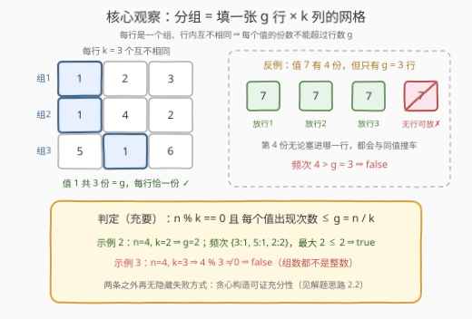
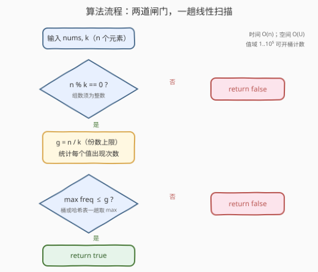

# 数组元素分组

- **题目名称**：数组元素分组
- **链接**：[3659. 数组元素分组](https://leetcode.cn/problems/partition-array-into-k-distinct-groups/)
- **难度**：中等
- **标签**：数组、哈希表、计数

## 1. 题目概述

**题意**：给定整数数组 `nums` 与整数 `k`，判断能否将 `nums` 中的**所有**元素分成一个或多个组，满足：

1. 每组**恰好**包含 $k$ 个元素；
2. 每组内的元素**互不相同**；
3. `nums` 中的每个元素被分配到**恰好一个**组中（不剩、不重）。

可以完成返回 `true`，否则返回 `false`。

**示例 1**：

```text
输入：nums = [1,2,3,4], k = 2
输出：true
解释：分成 2 组 [1,2]、[3,4]，每组 2 个互不相同的元素，全部元素恰好用一次。
```

**示例 2**：

```text
输入：nums = [3,5,2,2], k = 2
输出：true
解释：分成 2 组 [2,3]、[2,5]，两个 2 分属不同组，组内依然互不相同。
```

**示例 3**：

```text
输入：nums = [1,5,2,3], k = 3
输出：false
解释：4 个元素凑不出整数个大小为 3 的组。
```

**约束条件**：

- $1 \le n = \text{nums.length} \le 10^5$
- $1 \le \text{nums}[i] \le 10^5$
- $1 \le k \le n$

> 💡 **审题关键**：① 组的大小**固定**为 $k$，组数不由我们选——$n$ 必须是 $k$ 的倍数；②「组内互不相同」⇒ **同一个值在每组至多出现一次**，于是它在整个数组里的总份数有了硬上限；③ 元素必须**全部用完**，不能剩下也不能重复用。

---

## 2. 解题思路

### 2.1 直觉思路：最大堆贪心模拟（O(n log n)）

最自然的想法是**逐组构造**：用最大堆维护「每个值剩余的份数」，每一轮：

1. 取出剩余份数最多的 $k$ 个不同值，各拿一份拼成一个新组；
2. 份数减一后放回堆（减到 0 则丢弃）；
3. 重复 $n/k$ 轮，堆恰好清空则 `true`，中途凑不满 $k$ 个不同值则 `false`。

「优先消耗大户」的直觉来自任务调度类问题：份数多的值最挑剔（能去的组最少），先安排它们才不会把后面的轮次逼死。这个贪心是正确的（2.2 给出不变量证明），$O(n \log n)$ 通过本题毫无压力——但它做了**远多于必要的工作**：逐组模拟了 $g$ 轮，而真正决定成败的信息，一趟计数就能全部拿到。

> ⚠️ 突破口在于把「逐组构造」压缩成「整体判定」：组数 $g = n/k$ 定下来之后，「组内互不相同」对每个值只施加**一条**约束——总份数 $\le$ 组数。这条约束加上整除条件，恰好就是充要条件。

### 2.2 核心观察：两个计数条件即为充要



把分组看成填一张 $g$ 行 $\times$ $k$ 列的网格（$g = n/k$）：**每行是一个组**，行内 $k$ 个格子必须互不相同。于是只有两件事可能出错：

**条件一（整除）**：$n \% k = 0$。每组恰好 $k$ 个、元素全部用完 ⇒ 总数必须是 $k$ 的倍数，否则连组数 $g$ 都不是整数。示例 3（$n=4, k=3$）死在这一条。

**条件二（频次上限）**：任何值的出现次数 $\le g$。同一个值在一行里至多占一个格子 ⇒ 它的每一份副本都要落在**不同的行** ⇒ 份数超过行数 $g$ 必然装不下。例如 $[1,1,1,2,3,4]$、$k=3$ 时 $g=2$，而值 1 有 3 份——无论怎么摆，总有一行要出现两个 1。

**充分性（凑齐这两条就一定能分）**：证明「逐组贪心永不卡死」即可。维护不变量：*剩余 $r$ 组时，剩余元素恰 $r \cdot k$ 个，且每个值的剩余份数 $\le r$*。每轮取份数最多的 $k$ 个值各一份，则：

- 若某个**没被取**的值份数仍 $\ge r$，则最大的 $k$ 个份数均 $\ge r$，总份数 $\ge kr + r > kr$，与「总数恰为 $kr$」矛盾 ⇒ 一轮之后所有值份数 $\le r-1$，不变量保持；
- 正值（份数 $\ge 1$）的值个数 $\ge (r-1)k / (r-1) = k$，下一轮永远凑得满 $k$ 个不同值。

归纳到 $r=0$，构造全程无一处失败——**除最初两个计数条件外，不存在任何隐藏的失败方式**。

> 💡 **免费副产品**：「不同值的个数 $\ge k$」不用单独判——若不同值只有 $d < k$ 个，则总数 $\le d \cdot g < k \cdot g = n$，与总数恰为 $n$ 矛盾，此时必有某个值的份数 $> g$，已被条件二捕获。鸽笼自动覆盖，无需特判。

### 2.3 算法流程：一趟线性扫描



| 步骤 | 操作 | 说明 |
|------|------|------|
| ① 整除检查 | `n % k != 0` → `false` | 组数必须是整数 |
| ② 算组数 | `g = n / k` | 即每个值允许的最大份数 |
| ③ 频次统计 | 值域数组（或哈希表）计数 | $1 \le \text{nums}[i] \le 10^5$，可直接开桶 |
| ④ 频次判定 | 任一值 `freq > g` → `false` | 唯一的实质约束 |
| ⑤ 收尾 | `true` | 充要条件，无需构造方案 |

### 2.4 示例演算

**示例 2**：`nums = [3,5,2,2], k = 2`

| 检查 | 计算 | 结果 |
|------|------|------|
| 整除 | $n = 4$，$4 \% 2 = 0$，$g = 2$ | ✓ |
| 频次 | $3{:}1$、$5{:}1$、$2{:}2$，最大频次 $2 \le g = 2$ | ✓ |

→ `true`：两个 2 各占一行，得 `[2,3]` 与 `[2,5]`。

**额外反例**：`nums = [1,1,1,2,3,4], k = 3`：$n = 6$ 整除 ✓，$g = 2$，但值 1 的频次 $3 > 2$ → `false`。6 个元素、2 个组、每组 3 个互不相同——可值 1 只有 2 个组可去，第 3 份无处安放。

---

## 3. 参考代码

### C++

```cpp
class Solution {
  public:
    bool partitionArray(vector<int>& nums, int k) {
        int n = nums.size();
        if (n % k) return false;                 // 组数必须是整数
        int groups = n / k;                      // 每个值允许的最大份数
        vector<int> freq(100001, 0);             // 1 <= nums[i] <= 1e5
        int mx = 0;
        for (int x : nums) mx = max(mx, ++freq[x]);
        return mx <= groups;
    }
};
```

> 💡 **写法要点**：
> - 值域只有 $10^5$，直接开桶比 `unordered_map` 更快更稳；值域开放则换哈希表，逻辑不变；
> - 统计频次时顺手维护最大值，一趟扫描出结果，无需再遍历计数表。

### Python

```python
class Solution:
    def partitionArray(self, nums: List[int], k: int) -> bool:
        n = len(nums)
        if n % k:
            return False
        groups = n // k
        return max(Counter(nums).values()) <= groups
```

> 💡 **写法要点**：`n % k` 对正数即真值判断；`Counter` 一次成型，`max(...)` 取最大频次，两行完成判定。注意 `k >= 1` 由约束保证，无除零风险。

---

## 4. 复杂度分析

| 维度 | 复杂度 | 说明 |
|------|--------|------|
| 时间复杂度 | $O(n)$ | 一次遍历统计频次并取最大值（整除检查 $O(1)$） |
| 空间复杂度 | $O(U)$ | 桶数组大小为值域 $U = 10^5$；哈希表实现则为 $O(\min(n, U))$ |

> 与 2.1 的堆模拟 $O(n \log n)$ 相比，加速来源是把「逐组构造」整体坍缩成「两个全局计数条件」——分组方案本身根本不需要求出来，判定自然也无需模拟。

---

## 5. 扩展：输出一种具体分组方案

判定题变构造题：若还要求给出一组合法分组，回到 2.1 / 2.2 的贪心——

```python
def construct(nums: List[int], k: int) -> Optional[List[List[int]]]:
    n = len(nums)
    if n % k:
        return None
    g = n // k
    heap = [(-c, v) for v, c in Counter(nums).items()]
    heapq.heapify(heap)
    groups = []
    for _ in range(g):
        row, taken = [], []                  # 本组取的值 / 减一后待放回的值
        for _ in range(k):                   # 取份数最多的 k 个不同值
            c, v = heapq.heappop(heap)
            row.append(v)
            if -c - 1 > 0:
                taken.append((c + 1, v))
        for item in taken:                   # 轮内暂存，避免同值重复入堆
            heapq.heappush(heap, item)
        groups.append(row)
    return groups
```

正确性即 2.2 的不变量归纳：每轮结束后「剩余 $r$ 组、每值份数 $\le r$、总数 $rk$」恒成立，贪心永不卡死。复杂度 $O(n \log n)$。

---

## 6. 面试要点

**Q1：为什么 $n \% k \ne 0$ 直接返回 `false`？**

> 每组恰好 $k$ 个元素、所有元素恰好用一次，则组数 $g = n/k$ 必须是整数。这是最便宜的第一道闸门，$O(1)$ 先挡掉一批输入，再谈频次。

**Q2：为什么「某值出现超过 $g$ 次」就无解？**

> 「组内互不相同」意味着同一个值在每组至多出现一次，它的每一份副本必须落在**不同的组**里——总共 $g$ 个组，第 $g+1$ 份就无处可去。直观如「3 个抽屉塞 4 个同样的球，还要求一抽屉一个」。

**Q3：这两个条件为什么是充分的？**

> 归纳不变量：剩余 $r$ 组时元素恰有 $r \cdot k$ 个且每值份数 $\le r$。每轮取份数最多的 $k$ 个值各一份——若某个未入选的值份数 $\ge r$，则前 $k$ 大份数之和超过 $kr$，与总数 $kr$ 矛盾；故一轮之后所有份数 $\le r-1$，不变量保持到 $r=0$。构造永不失败，条件即充分。

**Q4：需要额外检查「不同值的个数不少于 $k$」吗？**

> 不需要。若不同值只有 $d < k$ 个，总元素数至多 $d \cdot g < k \cdot g = n$，与总数恰为 $n$ 矛盾——此时必存在某值份数 $> g$，已被频次条件捕获。「需要单独判」的直觉往往是没算过账的错觉。

**Q5：本题与 846「一手顺子」的判定差异在哪？**

> 846 要求每组是**连续的** $w$ 张牌，结构约束落在值的大小上，必须贪心从最小值逐串消解；本题组内只要求**互不相同**，结构约束松到只剩「每值每组至多一份」，于是坍缩成纯计数判定，连构造都可省。规律：组内约束越松，判定越「计数化」；越紧（有序/连续），越要真刀真枪地构造。

> 💡 **一句话总结**：$n$ 整除 $k$ 定组数 $g$，最大频次不超过 $g$ 即可分——两个计数条件充要，一趟线性扫描出答案。

---

## 7. 同类练习题

- [846. 一手顺子](https://leetcode.cn/problems/hand-of-straights/)：分组容量 + 值连续约束版，贪心逐组消解频次
- [1296. 划分数组为连续数字的集合](https://leetcode.cn/problems/divide-array-in-sets-of-k-consecutive-numbers/)：846 换皮，体会「组内约束越强越要真构造」
- [767. 重构字符串](https://leetcode.cn/problems/reorganize-string/)：同款计数充要判定——最大频次 $\le \lceil n/2 \rceil$
- [621. 任务调度器](https://leetcode.cn/problems/task-scheduler/)：由最大频次直接推出答案的计数公式，无需逐轮模拟
