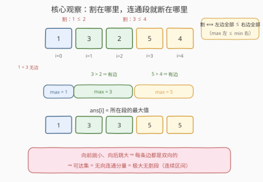
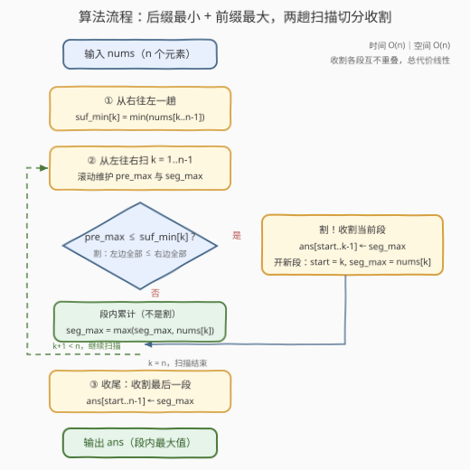

# 跳跃游戏IX

- **题目名称**：跳跃游戏IX
- **链接**：[3660. 跳跃游戏IX](https://leetcode.cn/problems/jump-game-ix/)
- **难度**：中等
- **标签**：数组、动态规划、连通性

## 1. 题目概述

**题意**：给定整数数组 `nums`，从任意下标 $i$ 出发，可以按以下规则跳跃到下标 $j$：

1. 向前跳（$j > i$）：仅当 $nums[j] < nums[i]$ 时允许；
2. 向后跳（$j < i$）：仅当 $nums[j] > nums[i]$ 时允许。

两条都是**严格**不等式。对于每个下标 $i$，求从 $i$ 出发（可跳任意次，包括 0 次）能够到达的 `nums` 中的**最大值**，返回数组 `ans`。

**示例 1**：

```text
输入：nums = [2,1,3]
输出：[2,2,3]
解释：i=0 没有跳跃方案获得更大的值；i=1 可向后跳到 0（2>1）；i=2 已是全局最大。
```

**示例 2**：

```text
输入：nums = [2,3,1]
输出：[3,3,3]
解释：i=0 先向前跳到 2（1<2），再从 2 向后跳到 1（3>1），到达全局最大 3。
```

**约束条件**：

- $1 \le n \le 10^5$
- $1 \le nums[i] \le 10^9$

> 💡 **审题关键**：① 问的是能到达的最大**值**，不是最远下标；② 「任意次」包含 0 次，所以 $ans[i] \ge nums[i]$；③ 向前只能跳向**更小**、向后只能跳向**更大**——方向与大小是绑定的，这决定了跳跃图的特殊结构。

---

## 2. 解题思路

### 2.1 直觉思路：显式建图 BFS（O(n²)）

把每个下标当顶点、合法跳跃当边，从每个起点做 BFS 求所在连通分量的最大值——思路最直白。但注意**任意逆序对 $(i,j)$（$i<j$ 且 $nums[i]>nums[j]$）之间都有边**，边数高达 $O(n^2)$，$n = 10^5$ 时连图都建不出来，必然超时。

这个暴力唯一的价值，是逼我们看清图的结构——而结构里藏着三步坍缩。

### 2.2 核心观察：三步坍缩成「前缀最大 × 后缀最小」



**第一步：每条边都是双向的（有向图退化为无向图）。**

设 $i < j$ 且 $nums[i] > nums[j]$：从 $i$ 看，$j$ 在前方且值更小，向前跳合法；从 $j$ 看，$i$ 在后方且值更大，向后跳合法。**同一对条件、两个方向同时放行**——所以「从 $i$ 出发可达」就是「$i$ 所在的无向连通分量」，与出发方向无关。

**第二步：连通分量一定是连续区间（区间引理）。**

若 $u < v$ 有边（$nums[u] > nums[v]$），则任何 $u \le w \le v$ 都与 $u$、$v$ 连通：

- 若 $nums[w] < nums[u]$：边 $(u, w)$ 存在（$w$ 在 $u$ 前方且值更小）；
- 否则 $nums[w] \ge nums[u] > nums[v]$：边 $(w, v)$ 存在（$w < v$ 且值更大）。

于是分量内任意两点之间的所有下标都被「顺路收编」——**分量无空洞，是连续区间**，$ans[i]$ 就是 $i$ 所在区间的最大值。

**第三步：区间的边界 = 割，割 $\iff$ 左边全部 $\le$ 右边全部。**

在位置 $k$（下标 $k-1$ 与 $k$ 之间）判定一条割线，判据是：

$$\max(nums[0..k-1]) \;\le\; \min(nums[k..n-1])$$

- **是割 $\Rightarrow$ 无边跨越**：任何跨线对 $i < k \le j$ 都有 $nums[i] \le nums[j]$，与边要求的 $nums[i] > nums[j]$ 矛盾——分量在此被切断；
- **不是割 $\Rightarrow$ 有边跨越**：取左侧最大值位置 $i_0$、右侧最小值位置 $j_0$，则 $nums[i_0] > nums[j_0]$，边 $(i_0, j_0)$ 恰好跨过位置 $k$。

**把三步拼起来**：设极大无割段为 $[l, r]$（边界 $l$、$r+1$ 处若有位置必是割）。段内每个位置 $k$ 都不是割 $\Rightarrow$ 有边跨过 $k$，且这条边的两端被边界割「夹」回段内（若 $i_0 < l$，由左边界割 $nums[i_0] \le$ 段内及右侧一切值 $\le nums[j_0]$，矛盾；$j_0 > r$ 同理）。再设 $l$ 所在分量的最大下标为 $R$：若 $R < r$，看位置 $R+1$ 的段内跨边 $(i_0, j_0)$——$i_0 \le R$ 在分量内（区间引理），于是 $j_0 \ge R+1$ 也在分量内，与 $R$ 的最大性矛盾。故 $R = r$，**整段连通；而分量又不跨割——极大无割段 = 连通分量**。

> 💡 **一句话**：跳跃规则天然把数组切成若干「左边的值全体不大于右边的值全体」的层，层内全连通、层间无往来——$ans[i]$ = $i$ 所在层的最大值。

### 2.3 算法流程：两趟线性扫描



| 步骤 | 操作 | 说明 |
|------|------|------|
| ① 预处理 | 从右往左一趟求 `suf_min[k] = min(nums[k..n-1])` | 供割判定使用 |
| ② 扫描 | 从左往右维护 `pre_max` 与当前段最大 `seg_max` | 两个滚动变量即可 |
| ③ 割判定 | `pre_max ≤ suf_min[k]` ⇒ 收割 `[start, k-1]`，答案填 `seg_max` | 开新段 `start = k` |
| ④ 段内累计 | 否则 `seg_max = max(seg_max, nums[k])` | 段最大值 |
| ⑤ 收尾 | 循环结束后收割最后一段 | 位置 $n$ 处没有割判定，别漏 |

### 2.4 示例演算

**示例 1**：`nums = [2,1,3]`

| 位置 k | pre_max（左侧最大） | suf_min（右侧最小） | 是否割 |
|--------|--------------------|--------------------|--------|
| 1 | 2 | 1 | $2 > 1$，否 |
| 2 | 2 | 3 | $2 \le 3$，**割** |

段划分为 `[0,1]`（最大 2）与 `[2,2]`（最大 3）→ `ans = [2,2,3]` ✓

**再看一个非平凡的**：`nums = [2,1,3,1,2]`。四个位置全不是割（如位置 3：`pre_max = 3 > suf_min = 1`），整段连通，`ans = [3,3,3,3,3]`。有趣的是下标 0 与 4 值相等（$2 = 2$）**没有直接边**，但 0 可以先跳到 3（向前，$1<2$）、再从 3 跳到 2（向后，$3>1$）——非相邻的连通靠「先降后升」的绕行完成。这正是暴力建图看不出、区间结构一句话说清的地方。

---

## 3. 参考代码

### C++

```cpp
class Solution {
  public:
    vector<int> maxValue(vector<int>& nums) {
        int n = nums.size();
        vector<int> sufMin(n + 1, INT_MAX);
        for (int i = n - 1; i >= 0; --i)
            sufMin[i] = min(sufMin[i + 1], nums[i]);

        vector<int> ans(n);
        int preMax = nums[0], segMax = nums[0], start = 0;
        for (int k = 1; k < n; ++k) {
            if (preMax <= sufMin[k]) {            // 割：左边全部 <= 右边全部
                for (int i = start; i < k; ++i)   // 收割 [start, k-1]
                    ans[i] = segMax;
                start = k;
                segMax = nums[k];
            } else {
                segMax = max(segMax, nums[k]);    // 段内累计最大
            }
            preMax = max(preMax, nums[k]);
        }
        for (int i = start; i < n; ++i)           // 收尾最后一段
            ans[i] = segMax;
        return ans;
    }
};
```

> 💡 **写法要点**：
> - 收割的内层循环总代价是 $O(n)$——各段互不重叠，整体仍为线性；
> - `sufMin[n]` 放 `INT_MAX` 哨兵，`preMax` / `segMax` 随扫描滚动维护，无需显式前缀数组；
> - $n = 1$ 时主循环与收割循环自然退化，直接返回 `[nums[0]]`，无需特判。

### Python

```python
class Solution:
    def maxValue(self, nums: List[int]) -> List[int]:
        n = len(nums)
        suf_min = [inf] * (n + 1)
        for i in range(n - 1, -1, -1):
            suf_min[i] = min(suf_min[i + 1], nums[i])

        ans = [0] * n
        pre_max = seg_max = nums[0]
        start = 0
        for k in range(1, n):
            if pre_max <= suf_min[k]:          # 割：左边全部 <= 右边全部
                ans[start:k] = [seg_max] * (k - start)   # 收割 [start, k-1]
                start = k
                seg_max = nums[k]
            else:
                seg_max = max(seg_max, nums[k])
            pre_max = max(pre_max, nums[k])
        ans[start:] = [seg_max] * (n - start)  # 收尾最后一段
        return ans
```

> 💡 **写法要点**：收割用切片赋值 `ans[start:k] = [seg_max] * (k - start)` 一步完成，比显式下标循环更 Pythonic；`inf` 哨兵来自 `math`（`from math import inf` 或直接用 `float('inf')`）。

---

## 4. 复杂度分析

| 维度 | 复杂度 | 说明 |
|------|--------|------|
| 时间复杂度 | $O(n)$ | 右往左一趟后缀最小值 + 左往右一趟扫描，收割各段互不重叠、总代价线性 |
| 空间复杂度 | $O(n)$ | `suf_min` 数组与输出 `ans`；若复用输出数组暂存前缀最大值，可压至除输出外 $O(1)$ |

> 与 2.1 的建图 BFS 相比，加速来源是把「逐点扩散」坍缩成「整体切分」——连通结构被前缀最大 / 后缀最小两趟扫描完全刻画，$O(n^2)$ 条边根本不用建。

---

## 5. 扩展：并查集写法与非严格变体

**并查集等价写法**：把「位置 $k$ 不是割」翻译成 `union(k-1, k)`，扫完后再对每个根统计段内最大值。正确性同源于割判定，复杂度 $O(n\,\alpha(n))$，比两趟扫描略慢，但思路更「图论」。可见本题本质是**用 $O(n)$ 个相邻关系编码了 $O(n^2)$ 条边的连通性**——每个割位置唯一决定分量边界，无需触碰任何一条真实边。

**非严格变体**：若把规则放宽为向前 $nums[j] \le nums[i]$、向后 $nums[j] \ge nums[i]$，相等值之间也出现双向边，割的判据相应变为严格不等 $\max(\text{左}) < \min(\text{右})$。例如 $[2,2]$ 原题中被切成两段（`ans = [2,2]`），放宽后合成一段。**等号的归属永远跟着「严格性」走**——这是此类题最容易写错的一个符号。

---

## 6. 面试要点

**Q1：为什么可以把有向跳跃图当无向图处理？**

> 一对下标 $i < j$ 之间，$i \to j$（向前跳）与 $j \to i$（向后跳）的合法性是**同一个条件** $nums[i] > nums[j]$：向前要求落到更小值，向后要求落到更大值，从两侧看互为镜像。于是每条边天然双向，可达集 = 无向连通分量。

**Q2：为什么连通分量一定是连续区间？**

> 区间引理：有边 $(u, v)$ 时，夹在中间的任何 $w$ 都与 $u$ 或 $v$ 直接有边——$nums[w] < nums[u]$ 走 $(u, w)$；否则 $nums[w] \ge nums[u] > nums[v]$ 走 $(w, v)$。分量中任意两点之间的下标全部被顺路收编，故分量无空洞。

**Q3：割的判据为什么是「左边最大 ≤ 右边最小」？等号放在哪边？**

> 跨线边 $(i, j)$ 要求严格 $nums[i] > nums[j]$。若左全 $\le$ 右全，则任何 $nums[i] \le nums[j]$，无边可跨；反之若左最大 $>$ 右最小，恰取这两个位置即得一条跨线边。因为规则是严格不等式、相等值之间无边，判据取 $\le$；规则非严格时则改为 $<$。

**Q4：$O(n^2)$ 条边的连通性，怎么用 $O(n)$ 信息刻画？**

> 边的存在性只依赖「值的相对大小 + 方向」。割位置把数组分层：层内任取跨位置的点对，连通性由区间引理与「非割必有跨边」共同保证；层间任何点对都构不成边。于是 $n - 1$ 个割判定（每个只需前缀最大 + 后缀最小）就完整编码了全部连通信息——降维来自结构规律，不是魔法。

**Q5：与跳跃游戏 III / IV 的区别在哪？**

> III / IV 的跳跃规则依赖**下标结构**（$i \pm 1$、等值跳跃），图不规则，只能显式建图 BFS；本题规则依赖**值的大小与方向**且天然对称，图坍缩成区间。同样是可达性问题，规则的对称性决定了能否避开建图。

> 💡 **一句话总结**：向前跳小、向后跳大 $\Rightarrow$ 边双向 $\Rightarrow$ 连通分量是区间；区间边界 = 左全 $\le$ 右全的割；两趟扫描找出所有割，段内最大值即答案。

---

## 7. 同类练习题

- [55. 跳跃游戏](https://leetcode.cn/problems/jump-game/)：可达性贪心入门，维护最远可达下标
- [1306. 跳跃游戏 III](https://leetcode.cn/problems/jump-game-iii/)：显式建图 BFS 求可达性的标准模板
- [1345. 跳跃游戏 IV](https://leetcode.cn/problems/jump-game-iv/)：BFS + 等值捷径，体会「图不规则只能搜索」
- [1696. 跳跃游戏 VI](https://leetcode.cn/problems/jump-game-vi/)：限步长跳跃的 DP + 单调队列优化
- [2297. 跳跃游戏VIII](https://leetcode.cn/problems/jump-game-viii/)：单调栈建转移边 + 线性 DP，跳跃规则结构化的又一例
