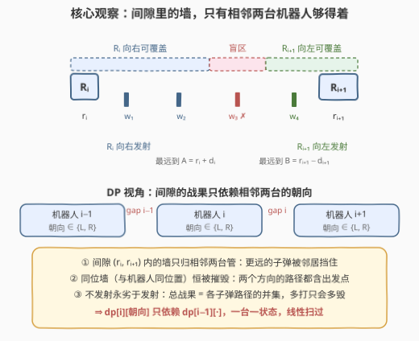
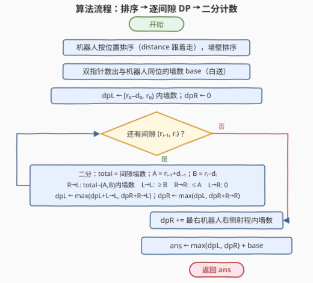

# LeetCode 可以被机器人摧毁的最大墙壁数目 题解

## 1. 题目概述

- **标题 / 题号**：可以被机器人摧毁的最大墙壁数目（#3661，hard）
- **链接**：https://leetcode.cn/problems/maximum-walls-destroyed-by-robots/
- **难度**：困难
- **标签**：数组、排序、二分查找、动态规划

**题意**：一条无限长的数轴上分布着一些机器人和墙。给定三个整数数组：$robots[i]$ 是第 $i$ 台机器人的位置，$distance[i]$ 是它的子弹能飞行的**最大**距离，$walls[j]$ 是第 $j$ 堵墙的位置。每台机器人有**一颗**子弹，可以向左或向右发射。子弹会**摧毁其射程内路径上的每一堵墙**（墙不挡子弹）；但机器人是固定障碍物——子弹碰到另一个机器人会**立即在该处停止**。求所有机器人合计最多能摧毁多少堵墙。

**示例 1**：

```text
输入：robots = [4], distance = [3], walls = [1,10]
输出：1
解释：机器人 4 向左发射，覆盖 [1, 4]，摧毁墙壁 1。
```

**示例 2**：

```text
输入：robots = [10,2], distance = [5,1], walls = [5,2,7]
输出：3
解释：机器人 10 向左发射覆盖 [5,10]，摧毁墙 5 和 7；
      机器人 2 向左发射覆盖 [1,2]，摧毁墙 2。
```

**示例 3**：

```text
输入：robots = [1,2], distance = [100,1], walls = [10]
输出：0
解释：只有机器人 1 够得到墙 10，但它向右的射击被机器人 2 挡住，答案是 0。
```

**约束**：

- $1 \le robots.length = distance.length \le 10^5$
- $1 \le walls.length \le 10^5$
- $1 \le robots[i], walls[j] \le 10^9$
- $1 \le distance[i] \le 10^5$
- $robots$ 中所有值互不相同；$walls$ 中所有值互不相同

> 💡 **审题关键**：① **墙不挡子弹、机器人挡子弹**——"阻挡"只发生在机器人处，把机器人排序后，挡住第 $i$ 台的必然是与它**相邻**的那台；② **与机器人同位的墙恒被摧毁**：向左、向右的子弹路径都包含出发点（距离 $0 \le distance[i]$），题面备注也点明了这一点；③ 每台机器人只有一颗子弹，方向二选一，且**"不发射"永远不优于发射**——总战果是各子弹路径的并集，多一条路径只会多不会少；④ $n, m \le 10^5$，$2^n$ 枚举方向组合不可行，必须挖掘"相邻"结构做线性扫描。

## 2. 解题思路

### 2.1 暴力思路：枚举每台机器人的方向

最直接的想法是枚举每台机器人向左 / 向右的 $2^n$ 种组合，对每种组合把所有子弹路径取并集数墙数。$n$ 上到 $10^5$，指数枚举直接爆炸。

退一步想**贪心**：每台机器人朝"自己射程内墙更多"的方向打？这也行不通——相邻两台机器人**对射**时覆盖区间会在中间重叠，逐台独立计数分不清"独家覆盖"与"重叠覆盖"，局部最优会浪费子弹（反例见第 5 节）。本质上，每台机器人的选择会影响**相邻间隙**的战果，这种局部耦合正是**线性 DP** 的信号。

### 2.2 核心观察：间隙分解 + 相邻决策 DP



把机器人按位置排序为 $r_0 < r_1 < \cdots < r_{n-1}$（$distance$ 跟着一起排），墙壁也排序。下面四个观察把问题拆成"一台一状态"的 DP。

**观察一（同位墙白送）**：位置恰好等于某个 $r_i$ 的墙恒被摧毁——机器人的子弹无论朝哪边飞，路径都含出发点。这部分直接用双指针 / 哈希集合数出来，记作 $base$，与 DP 完全解耦。

**观察二（间隙的马尔可夫性）**：考察开区间 $(r_i, r_{i+1})$ 内的墙（称**间隙 $i$**）。间隙内部没有机器人，因此：

- 机器人 $i$ **向右**发射，能摧毁间隙内所有满足 $w \le A_i = r_i + d_i$ 的墙（间隙内无阻挡，射程只受 $d_i$ 限制；子弹最终停在 $r_{i+1}$ 处，但那已出了开区间）；
- 机器人 $i+1$ **向左**发射，能摧毁间隙内所有满足 $w \ge B_{i+1} = r_{i+1} - d_{i+1}$ 的墙；
- **更远的机器人根本够不着**：$i-1$ 的右向子弹被 $r_i$ 挡住，$i+2$ 的左向子弹被 $r_{i+1}$ 挡住。

于是**间隙 $i$ 的战果只依赖机器人 $i$ 与 $i+1$ 两台的朝向**——与更早的决策无关。这正是 DP 只需记住"上一台朝向"的合法性来源。

**观察三（边界墙）**：$r_0$ 左侧的墙只归机器人 $0$（向左发射，覆盖 $[r_0 - d_0, r_0)$）；$r_{n-1}$ 右侧的墙只归机器人 $n-1$（向右发射，覆盖 $(r_{n-1}, r_{n-1} + d_{n-1}]$）。

**观察四（口径无关性）**：子弹停在挡路机器人处时，那台机器人**同位**的墙算不算被这颗子弹摧毁？两种口径答案相同——该位置的墙反正会被它的同位机器人自己摧毁（观察一）。实现取"不算"的严格口径：向右覆盖到 $r_{i+1}$ 之前为止，向左覆盖到 $r_i$ 之后为止，边界墙全部交给同位机器人。

> ⚠️ **转移四象限**：设处理完前 $i$ 台、且第 $i$ 台朝向已知时最大战果为 $dp[i][\text{朝向}]$。从第 $i-1$ 台（朝向 prev）过渡到第 $i$ 台（朝向 cur）时，间隙 $i-1$ 的战果为：
>
> | prev | cur | 间隙 $(r_{i-1}, r_i)$ 内被摧毁的墙 | 计数 |
> |------|------|------------------------------------|------|
> | R | L | $\{w \le A_{i-1}\} \cup \{w \ge B_i\}$（两边对射，取**并集**） | $total - \#\{A_{i-1} < w < B_i\}$ |
> | L | L | $\{w \ge B_i\}$（只有本台向左打） | $\#\{w \ge B_i\}$ |
> | R | R | $\{w \le A_{i-1}\}$（只有前台向右打） | $\#\{w \le A_{i-1}\}$ |
> | L | R | $\varnothing$（背对背，谁都够不着） | $0$ |
>
> 其中 $total$ 是间隙内墙总数。**R→L 的并集公式是关键**：被漏掉的只有严格夹在 $(A_{i-1}, B_i)$ 之间的"盲区"墙，用两次二分 $\#\{A_{i-1} < w < B_i\} = \text{cntLT}(B_i) - \text{cntLE}(A_{i-1})$ 即得，$A \ge B$ 时盲区自动为空（整体覆盖）。由于 $A_{i-1} > r_{i-1}$ 且 $B_i < r_i$，盲区天然落在间隙内部，无需再与间隙边界裁剪。

DP 递推：

$$dp[i][L] = \max\big(dp[i-1][L] + \text{coverLL},\; dp[i-1][R] + \text{coverRL}\big)$$

$$dp[i][R] = \max\big(dp[i-1][L] + 0,\; dp[i-1][R] + \text{coverRR}\big)$$

初始：$dp[0][L] = \#\{r_0 - d_0 \le w < r_0\}$（机器人 $0$ 向左打掉的左边界墙），$dp[0][R] = 0$。收尾：$ans = \max\big(dp[n-1][L],\; dp[n-1][R] + \text{右边界墙数}\big) + base$。

### 2.3 算法流程图



**文字版步骤**：

| 步骤 | 操作 | 说明 |
|------|------|------|
| ① 排序 | 机器人按位置升序（$distance$ 配对搬运），墙壁升序 | 阻挡关系坍缩为"相邻"关系 |
| ② 白送 | 双指针数出与机器人同位的墙数 $base$ | 观察一，恒被摧毁 |
| ③ 初始化 | $dpL \leftarrow \#\{w \in [r_0-d_0, r_0)\}$，$dpR \leftarrow 0$ | 机器人 $0$ 向左的边界战果 |
| ④ 逐间隙转移 | 对每个 $i$：二分求 $total$、$A$、$B$，按四象限算 $coverRL/coverLL/coverRR$，更新 $dpL, dpR$ | 每步 4~6 次二分 |
| ⑤ 收尾 | $dpR \mathrel{+}= \#\{w \in (r_{n-1}, r_{n-1}+d_{n-1}]\}$ | 最右机器人向右的边界战果 |
| ⑥ 汇总 | $ans \leftarrow \max(dpL, dpR) + base$ | 返回 |

### 2.4 示例演算：robots = [10,2], distance = [5,1], walls = [5,2,7]

排序后机器人 $[(2,1), (10,5)]$，墙壁 $[2,5,7]$。

- **base**：墙 $2$ 与位置 $2$ 的机器人同位 → $base = 1$；
- **初始化**（机器人 $2$，$d=1$）：$dpL = \#\{w \in [1,2)\} = 0$，$dpR = 0$；
- **间隙 $(2,10)$**：墙 $\{5,7\}$，$total = 2$；$A = 2+1 = 3$，$B = 10-5 = 5$：

| 前台 | 本台 | 战果 | 计算 |
|------|------|------|------|
| R | L | 2 | $total - \#\{3 < w < 5\} = 2 - 0$ |
| L | L | 2 | $\#\{w \ge 5\} = 2$ |
| R | R | 0 | $\#\{w \le 3\} = 0$ |
| L | R | 0 | — |

- **转移**：$dpL \leftarrow \max(0+2,\, 0+2) = 2$，$dpR \leftarrow \max(0,\, 0+0) = 0$；
- **收尾**：最右机器人 $10$ 向右 $(10,15]$ 内墙数 $= 0$；
- **答案**：$\max(2, 0+0) + 1 = 3$ ✓（位置 $2$ 的向左打掉同位墙 $2$，位置 $10$ 的向左打掉 $5,7$）。

## 3. 参考代码

### C++

```cpp
class Solution {
public:
    int maxWalls(vector<int>& robots, vector<int>& distance, vector<int>& walls) {
        int n = robots.size(), m = walls.size();
        vector<pair<int, int>> rs(n);
        for (int i = 0; i < n; i++) rs[i] = {robots[i], distance[i]};
        sort(rs.begin(), rs.end());
        sort(walls.begin(), walls.end());

        auto cntLE = [&](long long x) {
            return (int)(upper_bound(walls.begin(), walls.end(), x) - walls.begin());
        };
        auto cntLT = [&](long long x) {
            return (int)(lower_bound(walls.begin(), walls.end(), x) - walls.begin());
        };

        long long base = 0;
        for (int i = 0, j = 0; i < n; i++) {
            while (j < m && walls[j] < rs[i].first) j++;
            if (j < m && walls[j] == rs[i].first) base++;
        }

        long long dpL = cntLT(rs[0].first) - cntLT((long long)rs[0].first - rs[0].second);
        long long dpR = 0;

        for (int i = 1; i < n; i++) {
            int rp = rs[i - 1].first, rd = rs[i - 1].second;
            int p = rs[i].first, d = rs[i].second;
            int lo = cntLE(rp), hi = cntLT(p), total = hi - lo;
            long long A = (long long)rp + rd, B = (long long)p - d;
            long long coverRL = total - max(0, cntLT(B) - cntLE(A));
            long long coverLL = max(0, hi - max(lo, cntLT(B)));
            long long coverRR = max(0, min(hi, cntLE(A)) - lo);
            long long newL = max(dpL + coverLL, dpR + coverRL);
            long long newR = max(dpL, dpR + coverRR);
            dpL = newL;
            dpR = newR;
        }

        long long rightExtra = cntLE((long long)rs[n - 1].first + rs[n - 1].second) - cntLE(rs[n - 1].first);
        return (int)(max(dpL, dpR + rightExtra) + base);
    }
};
```

> 💡 **写法要点**：
> - **`cntLE` / `cntLT` 是仅有的两个计数原语**：$\#\{w \le x\}$ 与 $\#\{w < x\}$，四象限全部由它们拼出，杜绝手写下标出错；
> - **`rs` 存 `(位置, 射程)` 二元组一起排序**，别只排位置再拿旧下标去取 `distance`——那是本题最常见的实现事故；
> - **`base` 用双指针**：`rs` 与 `walls` 都有序，一遍对扫 $O(n+m)$，不必再建哈希集合；
> - **`A`、`B`、`r_0 - d_0` 用 `long long`**：虽然 $10^9 + 10^5$ 仍在 `int` 范围内，但混合运算容易踩隐式截断，统一提升最稳；
> - **答案理论上界**是 $m \le 10^5$，`int` 足够，返回前再统一切换。

### Python

```python
from bisect import bisect_left, bisect_right
from typing import List

class Solution:
    def maxWalls(self, robots: List[int], distance: List[int], walls: List[int]) -> int:
        rs = sorted(zip(robots, distance))
        walls.sort()

        def cnt_le(x): return bisect_right(walls, x)
        def cnt_lt(x): return bisect_left(walls, x)

        rpos = set(robots)
        base = sum(1 for w in walls if w in rpos)

        r0, d0 = rs[0]
        dpL = cnt_lt(r0) - cnt_lt(r0 - d0)
        dpR = 0

        for (rp, rd), (p, d) in zip(rs, rs[1:]):
            lo, hi = cnt_le(rp), cnt_lt(p)
            total = hi - lo
            A, B = rp + rd, p - d
            coverRL = total - max(0, cnt_lt(B) - cnt_le(A))
            coverLL = max(0, hi - max(lo, cnt_lt(B)))
            coverRR = max(0, min(hi, cnt_le(A)) - lo)
            dpL, dpR = max(dpL + coverLL, dpR + coverRL), max(dpL, dpR + coverRR)

        lastR, lastD = rs[-1]
        rightExtra = cnt_le(lastR + lastD) - cnt_le(lastR)
        return max(dpL, dpR + rightExtra) + base
```

> 💡 **写法要点**：
> - **`zip(rs, rs[1:])` 相邻配对**直接得到 $(r_{i-1}, r_i)$，比下标循环少一层心智负担；
> - **`base` 用哈希集合**：Python 的 `set` 判存在是 $O(1)$，比双指针写起来短；
> - **闭包捕获 `walls`**：`cnt_le` / `cnt_lt` 内联访问闭包变量，比传参快；`bisect` 是 C 实现，$n = m = 10^5$ 时全程序约 0.1 秒，无需 numpy；
> - **`max(0, ...)` 三处钳制**分别对应：盲区为空（$B \le A$）、左射程够不到间隙、右射程够不到间隙——三者都是"区间不存在"的退化情形。

## 4. 复杂度分析

| 维度 | 复杂度 | 说明 |
|------|--------|------|
| **时间复杂度** | $O(n \log n + m \log m)$ | 排序主导；DP 主循环每步 4~6 次 `bisect`，共 $O(n \log m)$ |
| **空间复杂度** | $O(n + m)$ | C++ 中 `rs` 拷贝 $O(n)$、`walls` 原地排序；Python 的 `sorted` 拷贝 $O(n+m)$；DP 只要两个滚动变量 |

> DP 状态被滚成 $dpL, dpR$ 两个标量——状态数与 $n$ 无关，这是"马尔可夫性"在空间上的直接兑现。

## 5. 扩展：贪心为什么翻车 + 口径等价性

**贪心反例**：$robots = [0,10,20]$，$distance = [2,6,6]$，$walls = [6,15]$。间隙 $(0,10)$ 的墙 $6$：机器人 $0$ 够不着（$6 > 0+2$），机器人 $10$ 向左够得着（$6 \ge 10-6 = 4$）；间隙 $(10,20)$ 的墙 $15$：机器人 $10$ 向右够得着（$15 \le 16$），机器人 $20$ 向左也够得着（$15 \ge 14$）。逐台贪心"哪边墙多朝哪边打"：机器人 $10$ 两边各一堵，平局若选向右，则与机器人 $20$ 的向左重叠，总战果只剩 $1$；最优解是机器人 $10$ 向左、机器人 $20$ 向左，战果 $2$。**根因**：局部计数无法区分"独家覆盖"与"重叠覆盖"，只有把相邻朝向装进状态（DP）才能全局协调。

**口径等价性**：题面"子弹击中机器人立即停止"没有明说挡路机器人**同位**的墙是否被这颗子弹波及。两种口径——"波及"（覆盖区间含端点 $r_{i+1}$）与"不波及"（覆盖到 $r_{i+1}$ 之前）——答案恒相同：那堵墙无论如何都会被它的同位机器人自己打掉（观察一），邻居的子弹只是"锦上添花"地多覆盖一个已必然被毁的位置，不改变并集大小。本文实现取严格口径，公式更干净。

**一个变体**：若改成"墙也挡子弹"（子弹停在第一堵墙处），每颗子弹至多摧毁一堵墙，问题就从"区间并集计数"退化为"多对一匹配"，套路完全不同——这也反衬出本题"墙可穿透"设定才是让区间计数有意义的关键。

## 6. 面试要点

**Q1：为什么想到排序？排序带来了什么结构红利？**

> 阻挡只发生在机器人处，且"谁挡谁"只由位置先后决定。排序后，挡住第 $i$ 台右向子弹的必然是紧邻的 $i+1$ 台，"无限长数轴上的任意阻挡"坍缩成"相邻关系"——间隙 $(r_i, r_{i+1})$ 成为独立战场，这是后面一切分解的起点。

**Q2：DP 状态为什么只需要"上一台机器人的朝向"？**

> 间隙 $i$ 内的墙只可能被机器人 $i$（向右）或 $i+1$（向左）摧毁：$i-1$ 的子弹被 $r_i$ 挡住，$i+2$ 的子弹被 $r_{i+1}$ 挡住，更远的更不可能。所以间隙战果是相邻两台朝向的函数，具有马尔可夫性——记 $dp[i][\text{朝向}]$ 足矣，无需更长的历史。

**Q3：R→L 对射的覆盖怎么算得不重不漏？**

> 间隙内被毁的墙是 $\{w \le A\} \cup \{w \ge B\}$，直接加起来会重复数重叠区。换个角度：没被毁的是严格夹在 $(A, B)$ 之间的盲区墙，所以并集 $= total - \#\{A < w < B\}$，后者用 $\text{cntLT}(B) - \text{cntLE}(A)$ 两次二分即得。$A \ge B$ 时盲区为空、自动全覆盖，无需特判；且 $A > r_i$、$B < r_{i+1}$ 保证盲区天然在间隙内，不用与间隙边界再裁剪。

**Q4：同位墙和边界墙为什么要单独处理？**

> 同位墙（$w = r_i$）被其机器人朝任意方向发射都覆盖（路径含出发点），恒被摧毁，直接数成 $base$，从 DP 里剥离；若混进间隙公式，端点开闭会纠缠不清。边界墙同理：$r_0$ 左侧只归机器人 $0$ 向左、$r_{n-1}$ 右侧只归它向右，分别放进 $dp[0][L]$ 的初始化与最终 $dp[n-1][R]$ 的收尾，DP 主循环就只管"内部间隙"。

**Q5：实现层面有哪些坑？**

> ① 排序时 $distance$ 必须与机器人位置配对搬运（存 pair / zip），拿旧下标取射程是高频事故；② $A = r + d$、$B = r - d$ 与首尾边界涉及 $10^9$ 量级加减，统一 `long long` 防隐式截断；③ 三处 `max(0, ...)` 钳制分别对应盲区为空、左右射程够不到间隙的退化情形，漏掉会出现负计数；④ 别忘了"不发射永劣于发射"的论证——它保证只考虑 L/R 两种决策是完备的；⑤ 收尾时右侧边界墙只加给 $dpR$（最后一张牌是"最后一台向右"），加错位置会凭空多算。

## 同类练习题

| # | 题目 | 与本题的关联 |
|---|------|-------------|
| 198 | [打家劫舍](https://leetcode.cn/problems/house-robber/) | 同款"相邻决策、状态只记上一个选择"的线性 DP 入门，先做它再回看本题的状态设计 |
| 740 | [删除并获得点数](https://leetcode.cn/problems/delete-and-earn/) | 排序去重后"选或不选相邻值"的线性 DP，体会"相邻耦合 ⇒ 线性扫"的迁移 |
| 452 | [用最少数量的箭引爆气球](https://leetcode.cn/problems/minimum-number-of-arrows-to-burst-balloons/) | 排序 + 射程/区间问题的贪心对照面——想想它为什么贪心可行、本题为什么必须 DP |
| 2563 | [统计公平数对的数目](https://leetcode.cn/problems/count-the-number-of-fair-pairs/) | 排序后二分统计"值落在某区间内的元素个数"的纯练习，正是本题 `cntLE`/`cntLT` 的独立训练场 |
| 968 | [监控二叉树](https://leetcode.cn/problems/binary-tree-cameras/) | 状态依赖"邻居决策"的树上版 DP，把本题的马尔可夫思想从链表结构搬到树上 |
