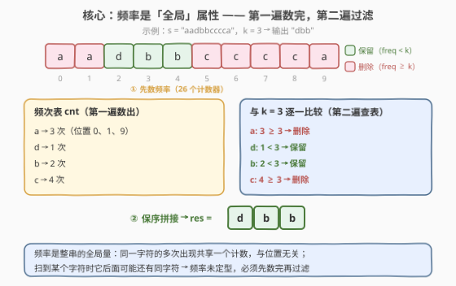
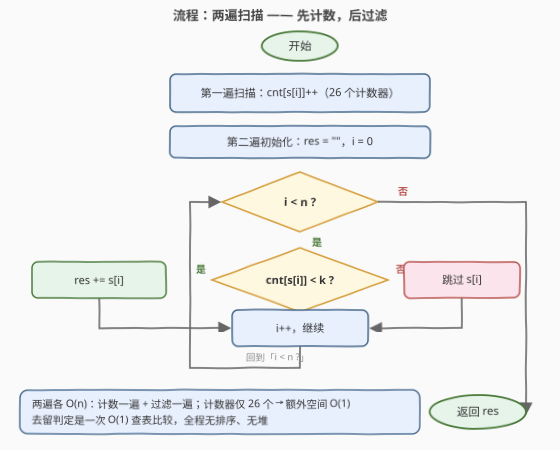

# 按频率筛选字符

- **题目名称**：按频率筛选字符
- **链接**：[3662. 按频率筛选字符](https://leetcode.cn/problems/filter-characters-by-frequency/)
- **难度**：简单
- **标签**：哈希表、字符串、计数

## 1. 题目概述

> ⚠️ 本题为 LeetCode 付费题（Plus 会员专享），题意描述根据官方示例用例与 hints 重建，可能与官方题面有出入。

**题意**：给定字符串 $s$ 和整数 $k$。统计每个字符在 $s$ 中的出现频率，把**频率小于 $k$** 的字符按**原始相对顺序**拼接成新串返回；频率 $\ge k$ 的字符全部丢弃。

**示例 1**：

```text
输入：s = "aadbbcccca", k = 3
输出："dbb"
解释：a 出现 3 次、d 出现 1 次、b 出现 2 次、c 出现 4 次；
      频率 < 3 的只有 d 和 b，按原顺序拼接得 "dbb"。
```

**示例 2**：

```text
输入：s = "xyz", k = 2
输出："xyz"
解释：x、y、z 各出现 1 次，都小于 2，全部保留。
```

**约束条件**（官方约束未公开，按官方 hints 与同类题推测）：

- $1 \le s.length \le 10^5$
- $s$ 仅由小写英文字母组成（官方 hint 原话「26-entry array」）
- $1 \le k \le 10^5$

> 💡 **审题关键**：① 频率是**全局**统计量——一个字符保不保留取决于它在**整串**中的总出现次数，与它出现在哪个位置无关；② 保留**原始相对顺序**（是过滤，不是重排）；③ 口径是「频率 **< $k$** 保留」，等价于「频率 $\ge k$ 删除」，动笔前别与「$\le k$」「$> k$」混淆。

---

## 2. 解题思路

### 2.1 暴力思路：对每个位置重新数一遍

对每个下标 $i$，重新扫描整个字符串统计 $s[i]$ 的出现次数，再决定去留——单次 $O(n)$，总计 $O(n^2)$；$n = 10^5$ 时约 $10^{10}$ 次字符比较，必然超时。

> 💡 暴力的问题在于**重复劳动**：同一个字符在它的每个出现位置都被从头重数一遍，而它的频率是全局定值——**数一次就够了**。

### 2.2 核心观察：频率是全局属性 → 两遍扫描



**观察一（频率与位置无关）**：字符 $c$ 的频率在整个 $s$ 上是**唯一确定**的——位置 0 的 a 与位置 9 的 a 共享同一个计数。所以只需**第一遍**扫描就把 26 个字母的频率全部数完，存入长度 26 的数组（官方 hint 原话「26-entry array」），空间 $O(26) = O(1)$。

**观察二（去留判定是 $O(1)$ 查表）**：**第二遍**扫描时，每个位置的判定 $\text{cnt}[s[i]] < k$ 只是一次数组下标访问加整数比较。两遍线性扫描，时间 $O(n)$、额外空间 $O(1)$，已达理论下界——至少要把输入完整读一遍。

**为什么必须两遍（不能一遍出结果）**：扫到 $s[i]$ 时，它**后面**还可能出现同字符，频率尚未定型——例如示例 1 的第一个 a，扫到它时无法知道后面还有两个 a。任何单遍算法都绕不开「先看完全串、频率才能定型」这件事；两遍扫描就是把这个事实写成了最朴素的形态。

### 2.3 算法流程图



**文字版步骤**：

| 步骤 | 操作 | 说明 |
|------|------|------|
| ① 计数 | 第一遍扫描，`cnt[s[i]]++` | 26 长度数组（或哈希表） |
| ② 初始化 | `res = ""`，`i = 0` | 结果串从空开始 |
| ③ 判定 | `cnt[s[i]] < k` ? | $O(1)$ 查表比较 |
| ④ 分派 | 是 → `res += s[i]`；否 → 跳过 | 保序追加，不重排 |
| ⑤ 循环 | `i++`，回到 ③ 直到扫完 | 每个字符恰好判定一次 |
| ⑥ 返回 | `res` | 可能是空串 |

### 2.4 示例演算：s = "aadbbcccca", k = 3

第一遍数出频次表：$a \to 3$，$d \to 1$，$b \to 2$，$c \to 4$。第二遍逐位查表：

| $i$ | $s[i]$ | $\text{cnt}$ | $< 3$? | 动作 | $res$ |
|-----|--------|--------------|--------|------|-------|
| 0 | a | 3 | ✗ | 丢弃 | "" |
| 1 | a | 3 | ✗ | 丢弃 | "" |
| 2 | d | 1 | ✓ | 追加 | "d" |
| 3 | b | 2 | ✓ | 追加 | "db" |
| 4 | b | 2 | ✓ | 追加 | "dbb" |
| 5–8 | c ×4 | 4 | ✗ | 丢弃 | "dbb" |
| 9 | a | 3 | ✗ | 丢弃 | "dbb" |

最终输出 `"dbb"`。注意位置 2 的 d：它只出现 1 次，若把「按频率筛选」误解成「删掉出现过多次的字符之外也顺带删稀有字符」就会错——**判定对象是频率与 $k$ 的大小关系，不是「出现与否」**。

> 💡 示例 2（`"xyz"`，$k=2$）：三个字符频率都是 $1 < 2$，全部保留，输出原串。两个顺手的自测边界：$k = 1$ 时任何字符频率都 $\ge 1$，输出空串；$k$ 超过最大频率时输出原串本身。

---

## 3. 参考代码

### C++

```cpp
class Solution {
public:
    string filterCharactersByFrequency(string s, int k) {
        int cnt[26] = {0};
        for (char c : s) cnt[c - 'a']++;        // 第一遍：数频率
        string res;
        res.reserve(s.size());
        for (char c : s)                        // 第二遍：保序过滤
            if (cnt[c - 'a'] < k) res += c;
        return res;
    }
};
```

> 💡 **写法要点**：
> - **`int cnt[26] = {0}`** 优于哈希表：小写字母域固定 26，数组下标直接寻址，无哈希常数、缓存友好。
> - **`res.reserve`** 预留容量避免中途扩容搬移；结果长度 $\le n$，多预留不亏。
> - 若字母域扩大（含大写、数字），改用 `int cnt[128]` 按 ASCII 下标计数，骨架不变。

### Python

```python
class Solution:
    def filterCharactersByFrequency(self, s: str, k: int) -> str:
        cnt = Counter(s)                            # 第一遍：数频率
        return ''.join(c for c in s if cnt[c] < k)  # 第二遍：保序过滤
```

> 💡 **写法要点**：
> - **`Counter(s)`** 一行完成第一遍计数，建表、增计数全不用手写。
> - **`''.join(...)`** 而非循环 `res += c`：CPython 中循环 `+=` 拼串在部分场景下退化到 $O(n^2)$，`join` 一次成型是干净的 $O(n)$。

---

## 4. 复杂度分析

| 维度 | 复杂度 | 说明 |
|------|--------|------|
| **时间复杂度** | $O(n)$ | 第一遍计数 $O(n)$ + 第二遍过滤 $O(n)$；每个字符的判定是一次 $O(1)$ 数组访问与比较 |
| **空间复杂度** | $O(1)$ | 计数器固定 26 个（输出缓冲不计入额外空间；若计入则为 $O(n)$） |

> - 「必须完整读入」决定了 $O(n)$ 是时间下界，本题没有更快的做法，也不该有更慢的写法。
> - 用哈希表替代 26 数组时渐近复杂度不变，仅常数增大约数倍；$n \le 10^5$ 量级下两者都能轻松通过。

---

## 5. 扩展：口径一换，代码只动一个字符

本题家族的骨架都是「频次表 + 逐字符判定」，差别只在**判定口径**与**消费方式**：

- **[451. 根据字符出现频率排序](https://leetcode.cn/problems/sort-characters-by-frequency/)**：同一张频次表，消费方式从「过滤」换成「按频率重排」——频率互异时桶排序，一般情况用堆。
- **[387. 字符串中的第一个唯一字符](https://leetcode.cn/problems/first-unique-character-in-a-string/)**：判定口径换成「频率 $= 1$」，再取**第一个**满足者——频次表的另一种查询。
- **若题意改成「删除频率恰好等于 $k$ 的字符」**：把 `< k` 改成 `!= k`；改成「频率大于 $k$ 才删」：改成 `<= k`。先认清口径再动笔，是一切字符统计题的第一步。
- **进阶追问：能否一遍扫描、原地完成？** 可以用**双指针原地覆写**合并两遍：读指针 $i$ 走原串、写指针 $j$ 指向已保留前缀，`cnt[s[i]] < k` 时执行 `s[j++] = s[i]`。但注意频率仍须**先数完**才能判定——所谓「一遍」本质是「计数一遍 + 覆写一遍」的两趟合体，逻辑结构并未改变。

---

## 6. 面试要点

**Q1：为什么不能只扫一遍就输出？**

> 字符的频率是**整串的全局量**：扫到某个字符时，它后面可能还有同字符，频率尚未定型（示例 1 的 a 要扫到位置 9 才凑满 3 次）。判定必须基于完整信息，所以「先数完、再过滤」的两遍结构是**逻辑必然**，不是实现上的偷懒。

**Q2：26 数组和哈希表怎么选？**

> 字符集是固定小常数（26 个小写字母）时用数组：下标直接寻址、零哈希常数、缓存友好。字符集不定或很大（如 Unicode）时才用哈希表 / `Counter`，复杂度仍是 $O(n)$ 次 $O(1)$ 操作，只是常数变大。面试中先问一句「字符集范围是什么」，是低成本的加分动作。

**Q3：有哪些值得自测的边界？**

> ① $k = 1$：所有字符频率 $\ge 1$，输出空串；② $k$ 大于最大频率（示例 2 的 $k$ 推到 5）：输出原串本身；③ 全串同一字符（`"aaaa"`，$k = 2$ → 空串）；④ 结果为空时返回 `""`，不是任何哨兵值；⑤ 单字符串：要么原样返回（频率 1 < k 且 k ≥ 2），要么为空（k = 1）。

**Q4：结果为什么天然保序？需要额外的稳定化处理吗？**

> 不需要。第二遍按 $i$ 从左到右扫描、判定通过即**追加**，「按序追加」本身就保序——稳定性免费获得。只有当解法先把字符按频率分桶再重组（如 451 题的桶排序）时，桶内的拼接顺序才会影响输出形态；本题的追加式写法完全不涉及。

**Q5：这道「简单题」真正考察什么？**

> **「统计—查询」分离**的两遍模式：把「需要全局信息才能回答的判定」拆成「一趟聚合（建频次表）+ 一趟逐项查询」。这个模式是桶计数、计数排序、字符统计类问题（387、1941、2287 等）的共同底座；认出它之后，一行 `Counter` 加一行推导式就是全部代码——简单题考的不是写难，而是识别出模式后**写得又对又干净**。

---

## 7. 同类练习题

- [451. 根据字符出现频率排序](https://leetcode.cn/problems/sort-characters-by-frequency/)：同一张频次表，从「过滤」换成「按频率重排」，体会统计与查询的分离
- [387. 字符串中的第一个唯一字符](https://leetcode.cn/problems/first-unique-character-in-a-string/)：频次表 + 第二遍查「频率 = 1」的最早位置，本题判定口径的近亲
- [1941. 检查是否所有字符出现次数相同](https://leetcode.cn/problems/check-if-all-characters-have-equal-number-of-occurrences/)：26 桶计数后比较桶值是否全等，纯计数口径练习
- [2287. 重排字符以形成目标字符串](https://leetcode.cn/problems/rearrange-characters-to-make-target-string/)：两张频次表逐桶取 $\min$，计数的另一种消费方式
- [1002. 查找共用字符](https://leetcode.cn/problems/find-common-characters/)：多串频次表逐桶取 $\min$ 再展开，把「26 桶」用得更深一层
