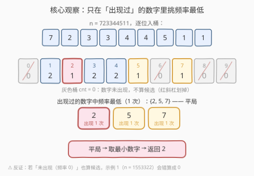
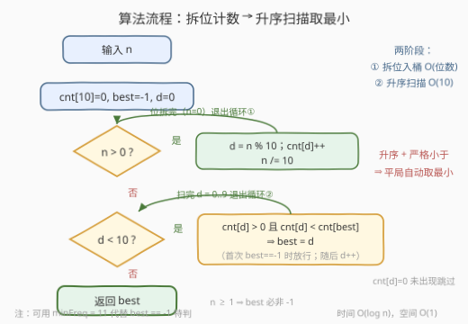

# LeetCode 出现频率最低的数字 题解

## 1. 题目概述

- **标题 / 题号**：出现频率最低的数字（#3663，easy）
- **链接**：https://leetcode.cn/problems/find-the-least-frequent-digit/
- **难度**：简单
- **标签**：数组、哈希表、数学、计数

**题意**：给你一个整数 `n`，找出在其十进制表示中**出现频率最低**的数字。如果多个数字的出现频率相同，则选择**最小**的那个数字。以整数形式返回所选的数字。

数字 `x` 的**出现频率**是指它在 `n` 的十进制表示中的**出现次数**。

**示例 1**：

```text
输入：n = 1553322
输出：1
解释：在 n 中，出现频率最低的数字是 1，它只出现了一次。所有其他数字都出现了两次。
```

**示例 2**：

```text
输入：n = 723344511
输出：2
解释：在 n 中，出现频率最低的数字是 7、2 和 5，它们都只出现了一次。
```

**约束**：

- $1 \le n \le 2^{31} - 1$

> 💡 **审题关键**：① 频率比较**只在「出现过」的数字之间进行**——未出现的数字（次数 0）不是候选：示例 1 中 0、4、6、7、8、9 都没出现，若它们也算数，答案会错成 0，而正确答案是 1；② 平局取**最小数字**（示例 2：7、2、5 各一次 → 取 2）；③ 答案**可以是 0**——如 $n = 10$，数字 0 与 1 各出现一次，平局取小，答案 0；④ $n \ge 1$ 保证至少一位数字出现，答案必然存在。

## 2. 解题思路

### 2.1 朴素思路：转字符串 + 通用哈希计数

`str(n)` 拍成字符串，用 `Counter` / `dict` 统计每个字符出现次数，再遍历字典取「次数最小（平局字符最小）」的键。正确性没有问题，但有两处「杀鸡用牛刀」：

- 数字值域**固定 0~9**，通用哈希表的散列开销毫无必要，定长数组 `cnt[10]` 就是最好的哈希表；
- 平局取最小若单独写比较逻辑，容易绕进 `if` 嵌套——其实一次**升序扫描**就能免费拿到（见 2.2 观察二）。

### 2.2 核心观察：定长 10 桶 + 升序扫描严格小于



**观察一：值域只有 10，定长数组即哈希表。** 拆位（`n % 10` 取末位、`n / 10` 去末位）一趟入桶 `cnt[10]`：桶下标就是数字、桶内容就是出现次数——无需字符串、无需字典。

**观察二：升序扫描 + 严格小于 = 平局自动取最小。** 按 $d = 0, 1, \dots, 9$ **从小到大**扫描，仅当 `cnt[d] < cnt[best]`（**严格**小于）才更新 `best`：同频的后来者**不覆盖**先到者，而先到者下标更小——「平局取最小数字」不用写任何额外判断，被扫描顺序天然实现。

**观察三：`cnt[d] > 0` 是候选门槛。** 未出现的数字桶值恒为 0，用这个门槛挡在门外，正对应审题关键 ①。门槛 + $n \ge 1$（至少一位非零）共同保证 `best` 必被赋值。

> 💡 一句话：本题 = 「拆位入桶」+「升序扫描 + 严格小于」。桶是定长的、扫描顺序自带平局规则，两段循环、$O(1)$ 空间。

### 2.3 算法流程图



**逻辑执行步骤**：

| 步骤 | 操作 | 说明 |
|------|------|------|
| ① 初始化 | `cnt[10] = 0`，`best = -1`，`d = 0` | 定长桶清零；`best = -1` 表示尚未找到候选 |
| ② 循环①条件 | `n > 0` ? | 还有位没拆 → ③；位拆完 → ④ |
| ③ 拆位入桶 | `d = n % 10`；`cnt[d]++`；`n /= 10` | 取末位、计数、去末位，回 ② |
| ④ 循环②条件 | `d < 10` ? | 升序扫描每个数字 |
| ⑤ 候选更新 | `cnt[d] > 0` 且 `cnt[d] < cnt[best]` ⇒ `best = d` | **严格**小于才覆盖：同频先到先得；之后 `d++` 回 ④ |
| ⑥ 返回 | `return best` | $n \ge 1$ ⇒ 至少一桶非零 ⇒ `best` 必非 `-1` |

> ⚠️ ⑤ 中首次命中（`best == -1`）需单独放行；若嫌特判碍眼，可改用 `minFreq = 11` 当「无穷大」——$n \le 2^{31}-1$ 至多 10 位，任何真实频率都严格小于 11，两种写法完全等价。

### 2.4 示例演算

**示例 2：n = 723344511（答案 2）**——重点看「严格小于 ⇒ 先到先得」：

| 扫描 d | cnt[d] | 判定 | best |
|--------|--------|------|------|
| 0 | 0 | 未出现，跳过 | -1 |
| 1 | 2 | 首个候选（`best == -1` 放行） | 1（频 2） |
| 2 | 1 | $1 < 2$ ✓ 覆盖 | **2（频 1）** |
| 3 | 2 | $2 < 1$ ✗ | 2 |
| 4 | 2 | $2 < 1$ ✗ | 2 |
| 5 | 1 | $1 < 1$ ✗ **严格小于，同频不覆盖** | 2 |
| 7 | 1 | $1 < 1$ ✗ 同上 | 2 |

扫描结束返回 **2**——5 与 7 频率同为 1，但「先到」的 2 已经占位，平局规则自动生效。

**示例 1：n = 1553322（答案 1）**：`cnt[1] = 1`，`cnt[2] = cnt[3] = cnt[5] = 2`，唯一频率为 1 的数字是 1 → **1**。

**补充边界**：$n = 10$ → 0 与 1 各出现一次，升序扫描 $d = 0$ 先入主 → **0**（答案可为 0）；$n = 5$ → 单数字自成最低频 → **5**。

## 3. 参考代码

### C++

```cpp
class Solution {
public:
    int getLeastFrequentDigit(int n) {
        int cnt[10] = {0};
        for (int m = n; m > 0; m /= 10) cnt[m % 10]++;
        int best = -1;
        for (int d = 0; d < 10; ++d)
            if (cnt[d] > 0 && (best == -1 || cnt[d] < cnt[best]))
                best = d;
        return best;
    }
};
```

> 💡 **写法要点**：
> - `int cnt[10] = {0}` 是值域定长桶的标准开法，聚合初始化一句清零；
> - `for (int m = n; m > 0; m /= 10)` 拆位模板：本题拆完就不再需要 `n`，直接拆 `n` 也对——保留副本 `m` 只是模板习惯（对比 [3622](../3601-3700/3622_判断整除性.md) 那里原值 `n` 还要留给整除判定，**必须**用副本）；
> - 条件 `best == -1 || cnt[d] < cnt[best]` 让首个出现的数字先占位，后续严格小于才覆盖。

### Python

```python
class Solution:
    def getLeastFrequentDigit(self, n: int) -> int:
        cnt = [0] * 10
        while n:
            n, d = divmod(n, 10)
            cnt[d] += 1
        best = -1
        for d in range(10):
            if cnt[d] and (best == -1 or cnt[d] < cnt[best]):
                best = d
        return best
```

> 💡 **写法要点**：
> - `divmod(n, 10)` 一句同时拿到「去位后的 n」与「取出的末位 d」；
> - 循环条件 `while n`：$n \ge 1$ 保证至少执行一轮，无需 do-while；
> - Python 里可直接销毁 `n`——后续判定不依赖原值（同样对照 3622）。

## 4. 复杂度分析

| 维度 | 复杂度 | 说明 |
|------|--------|------|
| **时间** | $O(\log n)$ | 拆位循环 $d = \lfloor \log_{10} n \rfloor + 1$ 轮（$n \le 2^{31}-1$ 至多 10 轮）+ 常数 10 桶扫描 |
| **空间** | $O(1)$ | 固定 10 个计数桶与常数变量，与 $n$ 无关 |
| **对比朴素法** | 同为 $O(\log n)$ | 字符串 + `Counter` 多一份 $O(\log n)$ 的字符串与哈希表开销；定长桶零分配 |

## 5. 扩展：「频率 + 数字」双关键字比较的三种写法

「频率最低、平局取最小」本质是对二元组 $(\text{freq}(d),\ d)$ 求**字典序最小**，实现至少有三条路：

| 写法 | 思路 | 适用场景 |
|------|------|----------|
| **升序扫描 + 严格小于**（本题主代码） | 扫描顺序编码第二关键字，比较只看第一关键字 | 值域小且有序（0~9、26 字母） |
| **元组序取 min** | 对 `(freq, d)` 取 `min`，语言级字典序比较 | Python 等支持元组比较的语言 |
| **显式比较器** | `min_element` / `sort` 配自定义双关键字 lambda | C++/Java 任意复杂规则 |

Python 元组序可把整题压成两行（`s.count(c)` 只对**出现过的**字符求值，天然带 `cnt > 0` 门槛）：

```python
s = str(n)
return int(min((s.count(c), c) for c in set(s))[1])
```

**变体练习**：若平局取**最大**数字——降序扫描（$d = 9 \to 0$）或把严格小于换成 `<=`；若求**频率最高**——对称处理，注意 `cnt[d] > 0` 门槛同样不能丢，否则满地空桶会打架。

## 6. 面试要点

**Q1：未出现的数字频率是 0，岂不是天然最低？为什么不能当答案？**

> 「频率」只对**出现过的**数字定义。反证看示例 1（1553322）：0、4、6、7、8、9 都未出现，若频率 0 参与比较，答案会错成 0，与官方答案 1 矛盾。实现上用 `cnt[d] > 0` 门槛把空桶挡在门外——这是本题最大的审题陷阱。

**Q2：「平局取最小数字」如何不加判断地实现？**

> 按 $d$ 从 0 到 9 **升序**扫描，更新条件用**严格小于**：同频的后来者不覆盖先到者，而先到者必是同频中下标最小（即数字最小）的。扫描顺序本身就是隐式的第二关键字。

**Q3：计数为什么用数组而不是哈希表？**

> 值域固定且稠密（0~9 共 10 个键），定长数组下标直达、零哈希开销、零扩容。哈希表适合**值域大或稀疏**的键（如任意字符串）；值域小而稠密时数组是它的完美特例。[1941](../1901-2000/1941_检查是否所有字符出现次数相同.md)（26 个小写字母）同款思路。

**Q4：n = 10 的输出是什么？说明什么问题？**

> 输出 **0**：数字 0 与 1 各出现一次，平局取小。这说明**返回值 0 是合法答案**——若把 0 当「失败哨兵」、或转字符串时不慎丢掉数字 0 的语义，就会出错；也提醒拆位循环 `while n` 对含 0 数位的数（10、100、105）行为正确——0 位照样入桶。

**Q5：本题拆位可以直接破坏 n，3622 为什么不行？**

> 本题拆完位后**不再需要原值**，`n /= 10` 随便拆；3622 的整除判定 `n % (s + p)` 依赖原值，必须拆副本 `m`。「拆位是否需要保留原值」是每个数位题动笔前先问的第一句。

> 💡 **一句话总结**：3663 = 拆位入桶（`cnt[10]`）+ 升序扫描严格小于。三个要点带走：空桶不算候选、扫描顺序自带平局规则、答案可以是 0。

## 同类练习题

| # | 题目 | 与本题的关联 |
|---|------|-------------|
| 1281 | [整数各位积和之差](https://leetcode.cn/problems/subtract-the-product-and-sum-of-digits-of-an-integer/)（[题解](../1201-1300/1281_整数各位积和之差.md)） | 同一套 `%10` / `/10` 拆位模板，双累加器组合 |
| 9 | [回文数](https://leetcode.cn/problems/palindrome-number/)（[题解](../0001-0100/9_回文数.md)） | 拆位的对称用法，同样对数字 0 与边界敏感 |
| 1941 | [检查是否所有字符出现次数相同](https://leetcode.cn/problems/check-if-all-characters-have-equal-number-of-occurrences/)（[题解](../1901-2000/1941_检查是否所有字符出现次数相同.md)） | 定长 26 桶频率统计，与 `cnt[10]` 桶思想同源 |
| 2269 | [找到一个数字的K美丽值](https://leetcode.cn/problems/find-the-k-beauty-of-a-number/)（[题解](../2201-2300/2269_找到一个数字的K美丽值.md)） | 数位子串 + 整除判定，拆位进阶为滑窗 |
| 136 | [只出现一次的数字](https://leetcode.cn/problems/single-number/) | 在频率统计里找「频数 1」的特殊元素，可从计数桶一路优化到异或 |
