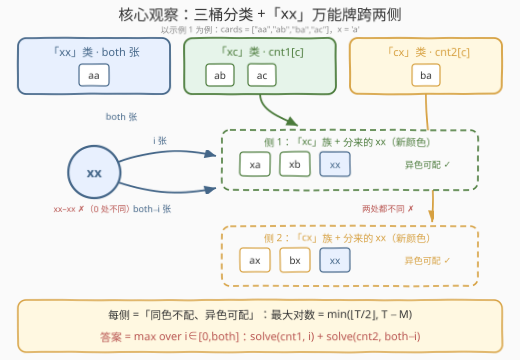
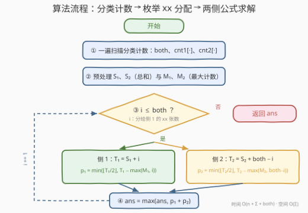

# LeetCode 两个字母卡牌游戏 题解

## 1. 题目概述

- **标题 / 题号**：两个字母卡牌游戏（#3664，medium）
- **链接**：https://leetcode.cn/problems/two-letter-card-game/
- **难度**：中等
- **标签**：数组、哈希表、字符串、计数、枚举

**题意**：给你一副牌，用字符串数组 `cards` 表示，每张牌上显示两个小写字母（仅限 `'a'` 到 `'j'`）。同时给你一个字母 `x`。按以下规则进行游戏：

- 从 0 分开始；
- 每一轮必须从牌堆中找出两张**兼容的**牌，且这两张牌的字符串都**包含字母 `x`**；
- 移除这对牌，获得 **1 分**；
- 再也找不到兼容的牌对时，游戏结束。

两张牌**兼容**当且仅当它们的字符串在**恰好 1 个位置**上不同。返回最优策略下能获得的最大分数。

**示例 1**：

```text
输入：cards = ["aa","ab","ba","ac"], x = "a"
输出：2
解释：第一轮移除 "ab" 和 "ac"（仅下标 1 处不同）；第二轮移除 "aa" 和 "ba"（仅下标 0 处不同）。
```

**示例 2**：

```text
输入：cards = ["aa","ab","ba"], x = "a"
输出：1
解释：移除 "aa" 和 "ba" 后，剩下一张 "ab" 无法配对。
```

**示例 3**：

```text
输入：cards = ["aa","ab","ba","ac"], x = "b"
输出：0
解释：含 'b' 的牌只有 "ab" 和 "ba"，但它们两个下标都不同，不兼容。
```

**约束**：

- $2 \le \text{cards.length} \le 10^5$；
- $\text{cards}[i].\text{length} = 2$；
- 每张牌仅由 `'a'` 到 `'j'` 之间的小写字母组成；
- `x` 是 `'a'` 到 `'j'` 之间的一个小写字母。

> 💡 **审题关键**：① 两张牌必须**都含 `x`**才有资格参配，不含 `x` 的牌一开工就出局；②「兼容」= **恰好 1 个位置**不同——完全相同（0 处）与两处都不同都不行；③ 最优策略本质上是在「兼容关系」构成的图上求**最大匹配**；④ 牌长恒为 2、字母只有 10 种，全部牌只有 $10 \times 10 = 100$ 种形态——按形态**合并计数**后图的结构高度规整，根本不需要真正的匹配算法。

## 2. 解题思路

### 2.1 暴力思路：建图跑最大匹配

把所有含 `x` 的牌看成节点、兼容的牌之间连边，答案就是这张图的**最大匹配**。一般图最大匹配需要带花树算法，$O(n^3)$，在 $n = 10^5$ 下完全不可行；即便按「同形态牌等价」把节点压到 100 个，跨类别的边权（每种形态的张数）也需要仔细处理，得不偿失。

瓶颈在于把牌当**个体**处理。配对规则只关心每张牌的两个字母，同形态的牌完全可互换——应当**按类计数**。

### 2.2 核心观察：三桶分类 +「xx」万能牌



**观察一：含 `x` 的牌只有三类。** 牌长恒为 2，含 `x` 的牌要么两个位置都是 `x`（`"xx"`，共 `both` 张），要么只有位置 0 是 `x`（`"xc"`，$c \ne x$，按 $c$ 计入 $\text{cnt1}[c]$），要么只有位置 1 是 `x`（`"cx"`，按 $c$ 计入 $\text{cnt2}[c]$）。

**观察二：兼容关系按类坍缩。** 逐一检查各类牌两两之间差几个位置：

| 牌对 | 差异位置数 | 兼容？ |
|---|---|---|
| `"xc"` 与 `"xd"`（$c \ne d$） | 仅位置 1 | ✅ |
| `"xc"` 与 `"xc"`（同 $c$） | 0 | ❌ |
| `"cx"` 与 `"dx"`（$c \ne d$） | 仅位置 0 | ✅ |
| `"xx"` 与 `"xc"` / `"cx"` | 恰 1 | ✅ |
| `"xx"` 与 `"xx"` | 0 | ❌ |
| `"xc"` 与 `"cx"` | 位置 0、1 都不同 | ❌ |

两个关键结论：

- `"xc"` 与 `"cx"` **永远不兼容**（两处都不同）——**侧 1**（`"xc"` 族）与**侧 2**（`"cx"` 族）之间没有边；
- `"xx"` 与两侧都兼容，是唯一能**跨两侧**的万能牌，但 `"xx"` 彼此之间不兼容。

**观察三：每侧内部就是「同色不配、异色可配」。** 把分配到某侧的 `"xx"` 看作一种新「颜色」，则该侧的牌共有若干颜色（各种 $c$ + 颜色 `"xx"`），**同色不能配、异色随便配**。设该侧牌总数 $T$、最大颜色计数 $M$，经典结论给出最大配对数：

$$P_{\max} = \min\!\Big(\Big\lfloor \frac{T}{2} \Big\rfloor,\ T - M\Big)$$

**上界**：每对至多消耗 1 张最大颜色的牌（同色不配），若配了 $P$ 对则最大颜色至少剩 $M - P$ 张未用，于是总剩牌 $T - 2P \ge M - P$，得 $P \le T - M$；另有显然的 $P \le \lfloor T/2 \rfloor$。**可达性**：每次取当前**计数最大的两个颜色**各出一张配对（贪心），只要还剩两种颜色就能推进，归纳可证恰好达到上界——与 767 重构字符串、1953 最大工作周数的论证同源。

**观察四：枚举万能牌的分配。** 每张 `"xx"` 在最优匹配中至多用一次，去向无非侧 1、侧 2 或闲置。设分给侧 1 共 $i$ 张（$0 \le i \le \text{both}$），两侧**完全独立**：

$$\text{ans} = \max_{0 \le i \le \text{both}} \big[\, \text{solve}(\text{cnt}_1,\, i) + \text{solve}(\text{cnt}_2,\, \text{both} - i) \,\big]$$

其中 `solve` 就是观察三的公式。注意 `solve` 只依赖该侧计数的**总和 $S$、最大值 $M$** 和分到的 `have` 张 `"xx"`，因此可以 $O(1)$ 计算：$T = S + \text{have}$，$P = \min(\lfloor T/2 \rfloor,\ T - \max(M, \text{have}))$——`"xx"` 自己也是一种颜色，同样参与最大值竞争。

### 2.3 算法流程图



**逻辑执行步骤**：

| 步骤 | 操作 | 说明 |
|------|------|------|
| ① 分类计数 | 一遍扫描 `cards`，维护 `both`、`cnt1[26]`、`cnt2[26]` | 不含 `x` 的牌直接忽略 |
| ② 预处理 | $S_1 = \sum \text{cnt1}$、$M_1 = \max \text{cnt1}$；$S_2, M_2$ 同理 | 让每次 `solve` 降到 $O(1)$ |
| ③ 枚举分配 | $i$ 从 $0$ 到 $\text{both}$ | $i$ = 分给侧 1 的 `"xx"` 张数 |
| ④ 两侧求解 | $p_1 = \min(\lfloor T_1/2 \rfloor,\ T_1 - \max(M_1, i))$，$p_2$ 同理（$\text{have} = \text{both} - i$） | `"xx"` 当作新颜色参与 $\max$ |
| ⑤ 收答案 | $\text{ans} = \max(\text{ans},\ p_1 + p_2)$ | 枚举结束返回 `ans` |

> ⚠️ **两个高频坑**：
> **坑 1——固定 `"xx"` 的归属**：两侧对万能牌的需求通常不对称（哪侧杂色更多、哪侧更缺桥），把 `"xx"` 一股脑并进某一侧会丢解。示例 1 中 $i = 0$ 才是最优分配，必须枚举。
> **坑 2——把两侧计数合并成一个大数组套公式**：合并后 `"xc"` 与 `"cx"` 会被当成异色可配，但它们两处都不同、根本不兼容——公式会算出偏大的错误答案。两侧必须各自独立求解。

### 2.4 示例演算

**示例 1：`cards = ["aa","ab","ba","ac"], x = "a"`**。分类：`both = 1`（`"aa"`），`cnt1 = {b:1, c:1}`（`"ab"`、`"ac"`），`cnt2 = {b:1}`（`"ba"`），故 $S_1 = 2, M_1 = 1, S_2 = 1, M_2 = 1$：

| $i$（`xx` 给侧 1） | 侧 1：solve(cnt1, i) | 侧 2：solve(cnt2, 1−i) | 合计 |
|---|---|---|---|
| 0 | $\min(\lfloor 2/2 \rfloor, 2-1) = 1$（ab 配 ac） | $\min(\lfloor 2/2 \rfloor, 2-1) = 1$（ba 配 aa） | **2** |
| 1 | $\min(\lfloor 3/2 \rfloor, 3-1) = 1$ | $\min(\lfloor 1/2 \rfloor, 1-1) = 0$ | 1 |

答案 2，与官方一致。

**示例 3：`x = "b"`**。含 `b` 的牌只有 `"ab"`（`b` 在位置 1，归入 `cnt2[a] = 1`）与 `"ba"`（`b` 在位置 0，归入 `cnt1[a] = 1`），`both = 0`，$i$ 只能取 0：两侧各剩 1 张单色牌，$\text{solve} = \min(0, 0) = 0$——正对应 `"ab"` 与 `"ba"` 两处都不同、无法配对，答案 0。

## 3. 参考代码

### C++

```cpp
class Solution {
public:
    int score(vector<string>& cards, char x) {
        int xi = x - 'a';
        int both = 0;
        int cnt1[26] = {0}, cnt2[26] = {0};
        for (const string& s : cards) {
            int a = s[0] - 'a', b = s[1] - 'a';
            if (a == xi && b == xi)       ++both;    // "xx"：万能牌
            else if (a == xi)             ++cnt1[b]; // "xc"：x 在位置 0
            else if (b == xi)             ++cnt2[a]; // "cx"：x 在位置 1
        }
        // 两侧计数的总和 S 与最大值 M，让每次 solve 降到 O(1)
        int S1 = 0, M1 = 0, S2 = 0, M2 = 0;
        for (int c = 0; c < 26; ++c) {
            S1 += cnt1[c]; M1 = max(M1, cnt1[c]);
            S2 += cnt2[c]; M2 = max(M2, cnt2[c]);
        }
        // 一侧：have 张 "xx" 当作一种新颜色，同色不配、异色可配
        auto solve = [](int S, int M, int have) {
            int T = S + have;
            return min(T / 2, T - max(M, have));
        };
        int ans = 0;
        for (int i = 0; i <= both; ++i)              // i 张 "xx" 分给侧 1
            ans = max(ans, solve(S1, M1, i) + solve(S2, M2, both - i));
        return ans;
    }
};
```

> 💡 **写法要点**：
> - 分类计数只比对 `s[0]`、`s[1]` 与 `x`，一遍 $O(n)$；
> - 预处理 $S$、$M$ 后每次 `solve` $O(1)$，枚举 $\text{both}+1$ 次即收工；
> - 值域只有 `'a'`–`'j'`，开 26 的数组纯属偷懒，改成 10 也行。

### Python

```python
class Solution:
    def score(self, cards: List[str], x: str) -> int:
        xi = ord(x) - 97
        both = 0
        cnt1 = [0] * 26   # "xc"：x 在位置 0，按另一个字母计数
        cnt2 = [0] * 26   # "cx"：x 在位置 1
        for s in cards:
            a, b = ord(s[0]) - 97, ord(s[1]) - 97
            if a == xi and b == xi:
                both += 1
            elif a == xi:
                cnt1[b] += 1
            elif b == xi:
                cnt2[a] += 1

        S1, M1 = sum(cnt1), max(cnt1)
        S2, M2 = sum(cnt2), max(cnt2)

        def solve(S: int, M: int, have: int) -> int:
            # have 张 "xx" 当作一种新颜色：同色不配、异色可配
            T = S + have
            return min(T // 2, T - max(M, have))

        return max(solve(S1, M1, i) + solve(S2, M2, both - i)
                   for i in range(both + 1))
```

> 💡 **写法要点**：
> - `max(cnt1)` 在全 0 时返回 0，天然处理「该侧无牌」的边界；
> - `both` 可达 $10^5$，但每次 `solve` $O(1)$，总量不过一次 $10^5$ 级循环。

## 4. 复杂度分析

| 维度 | 复杂度 | 说明 |
|------|--------|------|
| **时间复杂度** | $O(n + \Sigma + \text{both})$ | 计数一遍 $O(n)$，预处理 $O(\Sigma)$，枚举分配 $O(\text{both})$；$\Sigma = 26$（实际值域 10），$\text{both} \le n$ |
| **空间复杂度** | $O(\Sigma)$ | 两个计数数组 |

> - 对比暴力：一般图最大匹配（带花树）$O(n^3)$ 在 $n = 10^5$ 下不可行；本解法把「个体匹配」坍缩成「类别计数」，正是吃透了牌长为 2、值域为 10 的结构。
> - 答案上界 $\lfloor n/2 \rfloor$，全程 `int` 即可，无溢出风险。

## 5. 扩展：凹性优化与变体

**凹性与三分。** `solve(S, M, have)` 关于 `have` 单调不减、分段线性（斜率只能是 0、½、1），因此是**凹函数**；$f(i) = \text{solve}_1(i) + \text{solve}_2(\text{both} - i)$ 作为两个凹函数（其中一个反序）之和仍是凹函数——理论上可用三分搜索把枚举降到 $O(\log \text{both})$。不过 $\text{both} \le 10^5$，线性枚举已经绰绰有余，不必为常数级优化增加代码复杂度。

**构造具体方案。** 若要输出每对牌怎么配：在每侧用「每次取当前计数最大的两个颜色各出一张」的贪心落地公式（经典可证不会卡死），万能牌按最优的 $i$ 数量分发到两侧即可，总体 $O(n + \Sigma \log \Sigma)$。

**兼容条件变体。** 若改成「**至多** 1 处不同」，`"xx"` 之间也变兼容（0 处不同也算），万能牌自己也能互相配对，公式需要重推；若牌长推广到 $k$，「恰一处不同」的牌按「`x` 的位置 + 其余字母组合」分类后仍可计数，但类别数升至 $\Sigma^{k-1}$，需要另行设计。

**对拍自检。** 小规模可用回溯暴力求最大匹配与公式解互验（本文解法经 5 万组随机数据对拍全部一致），是验证这类「计数 + 公式」题的正确性利器。

## 6. 面试要点

**Q1：为什么 `"xc"` 和 `"cx"` 一定不兼容？**

> 它们位置 0（`x` vs `c`）和位置 1（`c` vs `x`）都不同，差 2 处，而兼容要求**恰好** 1 处不同。因此含 `x` 的牌天然分裂成互不相容的两侧，只有 `"xx"` 能跨两侧搭桥——这是整道题结构的支点。

**Q2：$\min(\lfloor T/2 \rfloor,\ T - M)$ 怎么证明？**

> 上界：任一方案中每对至多含 1 张最大颜色的牌，所以若配了 $P$ 对，最大颜色至少剩 $M - P$ 张没配上，总剩牌 $T - 2P \ge M - P$，得 $P \le T - M$；另有 $P \le \lfloor T/2 \rfloor$。可达：反复取计数最大的两个颜色各出一张配对，除非只剩一种颜色否则总能推进，归纳可证达到上界。

**Q3：为什么必须枚举 `"xx"` 的分配，而不能整体套一次公式？**

> 两种偷懒都错：把 `"xx"` 固定并入某一侧，会忽视另一侧对万能牌的需求（示例 1 中 $i=0$ 才最优）；把两侧计数合并成一个大数组套公式，会凭空造出 `"xc"`–`"cx"` 这条不存在的边，答案偏大。枚举 $i$ 恰好按最优匹配中每张 `"xx"` 的真实去向划分解空间，完备且不重不漏。

**Q4：枚举 $i$ 的正确性依据是什么？**

> 任何一个匹配方案中，每张 `"xx"` 至多配对一次，其搭档要么来自 `"xc"` 族、要么来自 `"cx"` 族（要么闲置）。按「实际配给侧 1 的张数」把所有方案划分成 $\text{both}+1$ 类，每类内部两侧独立、可各自求最优；不同 $i$ 对应的方案集合互不相交，取 $\max$ 即全局最优。多分了但没用上的 `"xx"` 不影响 `solve` 的值——牌多不会更差。

**Q5：本题的「计数代替个体」思想还能用在哪？**

> 只要个体行为只由其「类别」决定、同类个体完全可互换，就能合并计数：任务调度系列按任务种类计数、重排系列按字符频次计数（767、1953 都是 $\min$ 上界公式的变体）、拆分系列按数值计数（2244、2870）。识别标志：约束作用在类别上，而非个体身份上。

> 💡 **一句话总结**：3664 = 分类计数 +「异色配对」公式 + 枚举万能牌分配。带走的三个细节：`"xc"` 与 `"cx"` 永不相容、`"xx"` 是唯一跨侧桥、$\min(\lfloor T/2 \rfloor,\ T - M)$。

## 同类练习题

| # | 题目 | 与本题的关联 |
|---|------|-------------|
| 1953 | [你可以工作的最大周数](https://leetcode.cn/problems/maximum-number-of-weeks-for-which-you-can-work/) | 同一个「最大计数限制」公式，$\min(T,\ 2(T-M)+1)$ |
| 767 | [重构字符串](https://leetcode.cn/problems/reorganize-string/) | 相邻不同 ⇒ 最大频次 ≤ ⌈n/2⌉，同源的上界论证 |
| 621 | [任务调度器](https://leetcode.cn/problems/task-scheduler/) | 同色冷却的下界由最大频次决定，公式的另一种形态 |
| 2244 | [完成所有任务需要的最少轮数](https://leetcode.cn/problems/minimum-rounds-to-complete-all-tasks/) | 按计数分组的 2/3 拆分，计数思维的直系亲属 |
| 2870 | [使数组为空的最少操作次数](https://leetcode.cn/problems/minimum-number-of-operations-to-make-array-empty/) | 同上 2/3 拆分家族，注意计数为 1 时无解的判定 |
