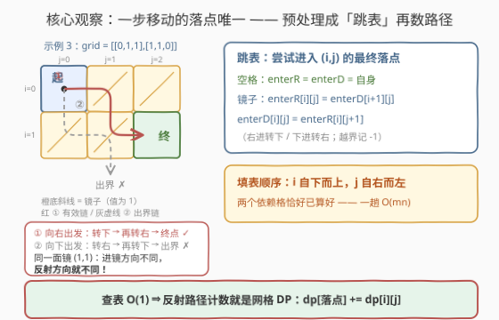
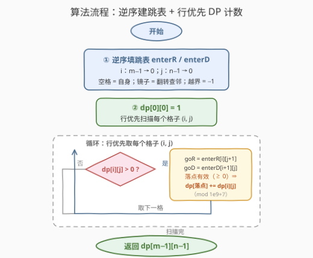

# 统计镜子反射路径数目

- **题目名称**：统计镜子反射路径数目
- **链接**：[3665. 统计镜子反射路径数目](https://leetcode.cn/problems/twisted-mirror-path-count/)
- **难度**：中等
- **标签**：数组、动态规划、矩阵

## 1. 题目概述

**题意**：给定 $m \times n$ 的二进制网格 `grid`，`0` 为空格、`1` 为镜子。机器人从 $(0, 0)$ 出发想走到 $(m-1, n-1)$，每步只能**向右**或**向下**移动。若试图移入镜子格，会在**进入之前**被反射：

- 向**右**撞镜 → 转**下**，落到镜子**正下方**的格子；
- 向**下**撞镜 → 转**右**，落到镜子**正右方**的格子；
- 若反射的落点又是镜子，则**按进入该镜子的方向**继续反射（右进转下、下进转右），直到落进空格为止；
- 任一环节落点在网格边界之外 → 该路径**无效**，不计入答案。

返回有效路径数量，对 $10^9 + 7$ 取模。

**示例 1**：

```text
输入：grid = [[0,1,0],[0,0,1],[1,0,0]]
输出：5
解释：5 条路径分别是
(0,0)→(0,1)[M]→(1,1)→(1,2)[M]→(2,2)      (0,0)→(0,1)[M]→(1,1)→(2,1)→(2,2)
(0,0)→(1,0)→(1,1)→(1,2)[M]→(2,2)          (0,0)→(1,0)→(1,1)→(2,1)→(2,2)
(0,0)→(1,0)→(2,0)[M]→(2,1)→(2,2)
其中 [M] 表示试图进入镜子格被反射。
```

**示例 2**：

```text
输入：grid = [[0,0],[0,0]]
输出：2
```

**示例 3**：

```text
输入：grid = [[0,1,1],[1,1,0]]
输出：1
解释：向右出发：(0,0)→镜(0,1)转下→镜(1,1)转右→(1,2) ✓
     向下出发：(0,0)→镜(1,0)转右→镜(1,1)转下→(2,1) 出界 ✗
```

**约束条件**：

- $2 \le m, n \le 500$
- $\text{grid}[i][j] \in \{0, 1\}$
- $\text{grid}[0][0] = \text{grid}[m-1][n-1] = 0$（起点、终点保证是空格）

> 💡 **审题关键**：① 反射发生在**进入之前**——机器人永远只会站在空格上，镜子的作用只是「改写这一步的落点」；② 连锁反射的方向看的是**进入那面镜子时的方向**，而不是最初出发的方向（示例 3 中两条链先后以「下」「右」两种姿态撞上同一面镜 $(1,1)$，结果一生一死，正是本题最大考点）；③ 一条路径 = 一串「向右/向下」的选择，**两串不同的选择即使中途落到同一格也算两条路径**（示例 1 的 5 条里有多条在 $(1,1)$、$(2,1)$ 汇合）。

---

## 2. 解题思路

### 2.1 暴力思路：枚举移动序列

一条路径就是一串 R/D 选择。从 $(0,0)$ 出发 DFS：每步模拟反射链求落点，出界则该分支剪枝，到达 $(m-1, n-1)$ 计数。路径每步前进至少一格、总长不超过 $m + n - 1$ 步，最坏 $2^{m+n-1}$ 条序列——$m, n \le 500$ 时是天文数字。

但这步模拟揭示了关键结构：**从「当前格 + 移动方向」出发，落点是唯一确定的**——反射规则没有任何随机性与选择余地。把「一步移动」看成一条超边，整张图仍是严格分层的 DAG。这就是计数 DP 的入场券。

### 2.2 核心观察：反射链落点唯一 → 跳表 + 网格 DP



**观察一（落点唯一且单调，链必终止）**：反射链上每「尝试进入」一个新格子，坐标和 $i + j$ 严格 $+1$——向右尝试列 $+1$，向下尝试行 $+1$，撞镜只是翻转下一步的方向、位置照样前进。因此链条至多 $m + n$ 步必终止（落进空格或出界），**绝不可能绕圈**。于是从任一空格 $(i,j)$ 出发，向右走与向下走各自对应**唯一**落点（或出界无效）。

**观察二（跳表可以逆序递推）**：与其对每格现场模拟反射链（单次 $O(m+n)$，总体 $O(mn(m+n))$），不如定义**以进入姿态为状态**的跳表：

$$E_R(i,j) = \text{「尝试进入 }(i,j)\text{（向右）」的最终落点},\qquad E_D(i,j) = \text{「尝试进入 }(i,j)\text{（向下）」的最终落点}$$

- $(i,j)$ 是**空格**：直接停住，$E_R(i,j) = E_D(i,j) = (i,j)$；
- $(i,j)$ 是**镜子**：向右进 → 转下，等价于接下来「尝试进入正下方格 $(i+1, j)$（向下）」；向下进 → 转右，等价于「尝试进入正右方格 $(i, j+1)$（向右）」：

$$E_R(i,j) = E_D(i+1,\,j),\qquad E_D(i,j) = E_R(i,\,j+1)$$

（等号右边越界则整条记 $-1$，表示该步无效。）注意两个依赖的方向——**下一行**与**同行右一列**——恰好被「$i$ 自下而上、$j$ 自右而左」的双循环覆盖，一趟 $O(mn)$ 填完整张表。

**观察三（行优先一趟完成 DP）**：从空格 $(i,j)$ 出发的落点行号 $\ge i$；且若落点行号 $= i$，它只能是右移的第一尝试 $(i, j+1)$——右移一旦撞镜，链条下一步就到第 $i+1$ 行再不回头。因此**落点在行优先序中严格靠后**，行优先扫描天然是转移 DAG 的拓扑序：

$$dp[0][0] = 1,\qquad dp\big[E_R(i,\,j{+}1)\big] \mathrel{+}= dp[i][j],\qquad dp\big[E_D(i{+}1,\,j)\big] \mathrel{+}= dp[i][j]$$

（查表结果为 $-1$ 时跳过；全程取模。）答案即 $dp[m-1][n-1]$——终点是空格，任何试图经过它的链条都会在此停住，不会「跳过」终点。

> 💡 **一句话总结**：镜子没有让问题离开网格 DP 的世界——它只是把「一步 = 相邻格」改写成「一步 = 查表落点」；用逆序递推 $O(mn)$ 建好落点表，剩下的就是最普通的路径计数。

### 2.3 算法流程图



**文字版步骤**：

| 步骤 | 操作 | 说明 |
|------|------|------|
| ① 建跳表 | $i$ 自下而上、$j$ 自右而左填 $E_R / E_D$ | 空格 = 自身；镜子 = 翻转方向查邻格；越界 = $-1$ |
| ② 初始化 | $dp[0][0] = 1$ | 起点保证是空格 |
| ③ 扫描转移 | 行优先遍历 $(i,j)$，$dp[i][j] > 0$ 时查两张表 | 向右查 $E_R(i, j{+}1)$、向下查 $E_D(i{+}1, j)$，有效落点累加并取模 |
| ④ 返回 | $dp[m-1][n-1]$ | 终点保证是空格 |

### 2.4 示例演算

以示例 1（`grid = [[0,1,0],[0,0,1],[1,0,0]]`，镜子在 $(0,1)$、$(1,2)$、$(2,0)$）为例。先逆序填跳表（只列非平凡项，$\bot$ 表示出界）：

```text
E_R(0,1) = E_D(1,1) = (1,1)      # 右进镜(0,1) → 转下 → 空格(1,1)
E_D(1,2) = E_R(1,3) = ⊥          # 下进镜(1,2) → 转右 → 出界
E_R(1,2) = E_D(2,2) = (2,2)      # 右进镜(1,2) → 转下 → 空格(2,2)
E_D(2,0) = E_R(2,1) = (2,1)      # 下进镜(2,0) → 转右 → 空格(2,1)
E_R(2,0) = E_D(3,0) = ⊥          # 右进镜(2,0) → 转下 → 出界
```

再行优先扫 dp（只写非零项；空格的 $E$ 就是自身，如 $E_D(1,0) = (1,0)$）：

```text
dp[0][0] = 1
  → 右：E_R(0,1) = (1,1)    ⇒ dp[1][1] += 1
  → 下：E_D(1,0) = (1,0)    ⇒ dp[1][0] += 1
dp[1][0] = 1
  → 右：E_R(1,1) = (1,1)    ⇒ dp[1][1] = 2
  → 下：E_D(2,0) = (2,1)    ⇒ dp[2][1] += 1
dp[1][1] = 2
  → 右：E_R(1,2) = (2,2)    ⇒ dp[2][2] += 2
  → 下：E_D(2,1) = (2,1)    ⇒ dp[2][1] = 3
dp[2][1] = 3
  → 右：E_R(2,2) = (2,2)    ⇒ dp[2][2] = 5
  → 下：i+1 = 3 出界，跳过
答案 dp[2][2] = 5 ✓
```

对应的 5 串移动选择：`右右`、`右下右`、`下右右`、`下右下右`、`下下右`——与官方解释的 5 条路径一一对应。

---

## 3. 参考代码

### C++

```cpp
class Solution {
public:
    int uniquePaths(vector<vector<int>>& grid) {
        constexpr int MOD = 1'000'000'007;
        int m = grid.size(), n = grid[0].size();

        // enterR / enterD：尝试进入 (i,j) 的最终落点（编码 x*n+y），-1 表示出界
        vector<vector<int>> enterR(m, vector<int>(n, -1)), enterD(m, vector<int>(n, -1));
        for (int i = m - 1; i >= 0; --i)
            for (int j = n - 1; j >= 0; --j) {
                if (grid[i][j] == 0) {
                    enterR[i][j] = enterD[i][j] = i * n + j;   // 空格：停住
                } else {                                        // 镜子：翻转方向查邻格
                    enterR[i][j] = (i + 1 < m) ? enterD[i + 1][j] : -1;
                    enterD[i][j] = (j + 1 < n) ? enterR[i][j + 1] : -1;
                }
            }

        vector<vector<int>> dp(m, vector<int>(n, 0));
        dp[0][0] = 1;
        for (int i = 0; i < m; ++i)
            for (int j = 0; j < n; ++j) {
                if (!dp[i][j]) continue;
                long long v = dp[i][j];
                if (j + 1 < n) {                               // 向右走：尝试进入 (i, j+1)
                    int t = enterR[i][j + 1];
                    if (t >= 0) dp[t / n][t % n] = (dp[t / n][t % n] + v) % MOD;
                }
                if (i + 1 < m) {                               // 向下走：尝试进入 (i+1, j)
                    int t = enterD[i + 1][j];
                    if (t >= 0) dp[t / n][t % n] = (dp[t / n][t % n] + v) % MOD;
                }
            }
        return dp[m - 1][n - 1];
    }
};
```

> 💡 **写法要点**：跳表落点编码成 $x \cdot n + y$（或 `pair`），$-1$ 统一表示出界，DP 侧无须任何特判；两张表覆盖了所有「以某方向进入某格」的请求，行优先扫描时每格 $O(1)$ 查表。

### Python

```python
class Solution:
    def uniquePaths(self, grid: List[List[int]]) -> int:
        MOD = 10 ** 9 + 7
        m, n = len(grid), len(grid[0])

        # enterR / enterD：尝试进入 (i,j) 的最终落点（编码 x*n+y），-1 表示出界
        enterR = [[-1] * n for _ in range(m)]
        enterD = [[-1] * n for _ in range(m)]
        for i in range(m - 1, -1, -1):
            for j in range(n - 1, -1, -1):
                if grid[i][j] == 0:
                    enterR[i][j] = enterD[i][j] = i * n + j      # 空格：停住
                else:                                            # 镜子：翻转方向查邻格
                    enterR[i][j] = enterD[i + 1][j] if i + 1 < m else -1
                    enterD[i][j] = enterR[i][j + 1] if j + 1 < n else -1

        dp = [[0] * n for _ in range(m)]
        dp[0][0] = 1
        for i in range(m):
            for j in range(n):
                if not dp[i][j]:
                    continue
                if j + 1 < n:                                   # 向右走：尝试进入 (i, j+1)
                    t = enterR[i][j + 1]
                    if t >= 0:
                        dp[t // n][t % n] = (dp[t // n][t % n] + dp[i][j]) % MOD
                if i + 1 < m:                                   # 向下走：尝试进入 (i+1, j)
                    t = enterD[i + 1][j]
                    if t >= 0:
                        dp[t // n][t % n] = (dp[t // n][t % n] + dp[i][j]) % MOD
        return dp[m - 1][n - 1]
```

> 两份代码已对三个官方示例与数千组随机小网格（对拍「DFS 枚举移动序列」的暴力）验证一致；$500 \times 500$ 全随机场毫秒级出解。

---

## 4. 复杂度分析

| 维度 | 复杂度 | 说明 |
|------|--------|------|
| **时间复杂度** | $O(mn)$ | 建跳表一趟 + 行优先 DP 一趟，每格 $O(1)$；$m, n \le 500$ 时约 $2.5 \times 10^5$ 格 |
| **空间复杂度** | $O(mn)$ | 两张跳表 + dp 数组（跳表是主体，dp 可按行滚动但无济于事） |

> 对比不建表的现场模拟：单次反射链 $O(m+n)$，总体 $O\big(mn(m+n)\big) \approx 2.5 \times 10^8$，勉强能过但既慢又丑；逆序递推的本质是把「链条上每格的答案」**摊还**成 $O(1)$——链条共享的前缀全部复用。

---

## 5. 扩展：网格 DP 的「改转移边」一族

- **记忆化写法**：跳表也可以写成记忆化递归 $E(i, j, d)$，语义更直白；但 $10^6$ 级状态的函数调用在 Python 下既慢又可能爆递归栈，逆序双循环是更稳的工程选择。
- **障碍物 vs 镜子**：[63. 不同路径 II](https://leetcode.cn/problems/unique-paths-ii/) 里障碍物直接「**封边**」（该方向转移数为 0），本题镜子则是「**改边**」（转移指向查表落点）——网格 DP 的框架完全不变，变的只是转移函数。凡「格子改写移动规则」的题（传送、加速、反弹）都可套这个两层结构：**先把一步移动固化成查表，再做计数 / 最值 DP**。
- **如果放开四方向**：允许向左 / 向上走（或镜子把方向反射成任意朝向）后，$i + j$ 不再单调，转移图可能出现环，「数路径」要重新审视（可能无穷多条，需按步数分层或先判环）。本题「只能右 / 下 + 右⇄下互换」正是保持无环的最小改动。

---

## 6. 面试要点

**Q1：反射链会不会无限循环（机器人在几面镜子间来回弹）？**

> 不会。链上每「尝试进入」一个新格子，$i + j$ 严格 $+1$（向右列 $+1$、向下行 $+1$，撞镜只翻转下一步方向、不后退）。$0 \le i + j \le m + n - 2$ 有界，链条至多 $m + n$ 步必然终止于空格或出界——这也是整个问题仍是 DAG、能用 DP 的根本原因。

**Q2：为什么行优先一趟扫完就够？落点会不会「绕回」已经处理过的格子？**

> 从 $(i,j)$ 出发的落点行号 $\ge i$；若落点行号 $= i$，它只能是右移的第一尝试 $(i, j+1)$——右移一旦撞镜，链条下一步就进入第 $i+1$ 行再不回头；向下走的第一尝试就在第 $i+1$ 行。故落点在行优先序中严格靠后，行优先扫描天然是转移 DAG 的拓扑序，一遍即可。

**Q3：连锁反射的方向，为什么看「进入该镜子的方向」而不是「最初出发的方向」？**

> 这是题面明说、且被示例 3 检验的规则：从 $(0,0)$ 向下出发，镜 $(1,0)$ 转右后，机器人以「向右」的姿态撞上镜 $(1,1)$，于是再转下、落到 $(2,1)$ 出界；若错误地按「最初向下」处理，则会转右落到 $(1,2)$，示例 3 的答案将错成 2。实现上，跳表递推 $E_R(i,j) = E_D(i+1,j)$、$E_D(i,j) = E_R(i,j+1)$ 天然编码了「以什么方向进入就怎么转」。

**Q4：跳表为什么必须逆序（自下而上、自右而左）填？行优先正序填行不行？**

> 递推只有两个依赖：$E_R(i,j) \to E_D(i+1, j)$（下一行）、$E_D(i,j) \to E_R(i, j+1)$（同行右一列）。行优先正序填表时这两个依赖都尚未计算，镜子格会拿到未初始化的值。逆序双循环恰好让依赖先行——与「从终点倒推」的经典反向 DP 同源。

**Q5：和 62 / 63 不同路径系列是什么关系？**

> 三题共享「网格 DAG 上数路径」的骨架：$dp[i][j]$ 的含义、行优先遍历、取模全都一样；差别只在转移边——62 是固定两条相邻边，63 砍掉障碍边，本题把边改写成「查表落点」。面试先报这个框架、再谈跳表预处理，是最稳的叙事顺序。

---

## 7. 同类练习题

- [62. 不同路径](https://leetcode.cn/problems/unique-paths/)：网格路径计数的纯净版，本题的骨架
- [63. 不同路径 II](https://leetcode.cn/problems/unique-paths-ii/)：障碍物「封边」vs 本题镜子「改边」，体会转移函数的变化
- [1301. 最大得分的路径数目](https://leetcode.cn/problems/number-of-paths-with-max-score/)：非标准移动（上 / 左 / 左上）+ 最值与计数并行，查表式转移的近亲
- [2435. 矩阵中和能被 K 整除的路径](https://leetcode.cn/problems/paths-in-matrix-whose-sum-is-divisible-by-k/)：在路径计数 DP 上叠加额外状态维
- [576. 出界的路径数目](https://leetcode.cn/problems/out-of-boundary-paths/)：把「出界」从无效条件变成计数目标，反向理解本题的出界剪枝
