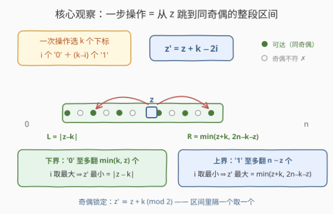
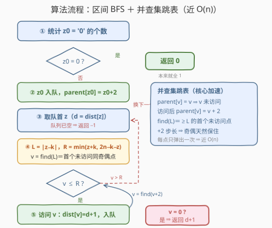

# 使二进制字符串全为1的最少操作次数

- **题目名称**：使二进制字符串全为1的最少操作次数
- **链接**：[3666. 使二进制字符串全为 1 的最少操作次数](https://leetcode.cn/problems/minimum-operations-to-equalize-binary-string/)
- **难度**：困难
- **标签**：广度优先搜索、并查集、数学、字符串、有序集合

## 1. 题目概述

给你一个二进制字符串 `s` 和一个整数 `k`。

在一次操作中，你必须选择**恰好 k 个不同下标**，并将每个下标处的字符翻转：`'0'` 变 `'1'`，`'1'` 变 `'0'`。

返回使字符串中所有字符都等于 `'1'` 的**最少操作次数**；如果不可能，返回 `-1`。

**示例 1**：

```text
输入：s = "110", k = 1
输出：1
解释：s 中有一个 '0'，k = 1，直接一次操作翻转它即可。
```

**示例 2**：

```text
输入：s = "0101", k = 3
输出：2
解释：操作 1 翻转 [0,1,3]，s 变为 "1000"；操作 2 翻转 [1,2,3]，s 变为 "1111"。
```

**示例 3**：

```text
输入：s = "101", k = 2
输出：-1
解释：k = 2 但 s 中只有一个 '0'，无法通过每次恰好翻转 k 位让全串变 '1'。
```

**约束条件**：

- $1 \le |s| \le 10^5$
- `s[i]` 为 `'0'` 或 `'1'`
- $1 \le k \le |s|$

> 💡 **审题关键**：① **恰好 k 个**、不能多也不能少——这是本题一切困难的总根源（示例 3 的 `-1` 正源于此：零太少凑不齐 k 个，翻了 1 又会制造新的 0）；② 中间过程长什么样无所谓，只关心"最终全 1"；③ $n$ 高达 $10^5$，指数级枚举和 $O(n^2)$ 的建图都不可行。

---

## 2. 解题思路

### 2.1 暴力思路

最直觉的暴力是在**字符串本身**上做 BFS：每个状态是一个 0/1 串，一次操作枚举 $\binom{n}{k}$ 种下标组合。状态数 $2^n$、每个状态转移 $\binom{n}{k}$ 种——双重爆炸，`n > 20` 就不可用。

退一步的关键发现：操作**不区分具体下标，只区分被翻的是 `'0'` 还是 `'1'`**。字符串里哪一位是 0 无关紧要，**只有 0 的个数有意义**。把状态压缩成 $z \in [0, n]$（`z = s 中 '0' 的个数`），从 $z_0$ 出发做普通 BFS：

- 状态数只剩 $n+1$ 个；
- 但每个状态的邻居仍需枚举"翻多少个 `'0'`"，最多 $O(n)$ 个 → 总计 $O(n^2)$，$n = 10^5$ 时约 $10^{10}$，仍然超时。

还差最后一步观察：这些邻居其实**挤在同奇偶的连续区间里**——区间可以整体访问，不必逐个枚举。

### 2.2 核心观察：一次操作 = z 到一段同奇偶区间的边



设当前有 $z$ 个 `'0'`、$n - z$ 个 `'1'`。一次操作选 $k$ 个下标，其中 $i$ 个落在 `'0'` 上、$k - i$ 个落在 `'1'` 上（约束：$0 \le i \le z$ 且 $0 \le k - i \le n - z$）。翻转后：

- $i$ 个 `'0'` 变 `'1'`：零减少 $i$；
- $k - i$ 个 `'1'` 变 `'0'`：零增加 $k - i$。

$$z' = z - i + (k - i) = z + k - 2i$$

合法的 $i$ 构成**连续区间** $\max(0,\ k - (n-z)) \le i \le \min(k,\ z)$，而 $z'$ 随 $i$ 每增大 1 就**减小 2**——所以一步可达的 $z'$ 是一串公差为 2 的等差数列，即某区间内**所有与 $z + k$ 同奇偶**的整数。把两个端点代入化简（令 $i = \min(k, z)$ 得下界，$i = \max(0, k - (n-z))$ 得上界）：

$$\boxed{\;z \;\longrightarrow\; \bigl[\,|z-k|,\ \min(z+k,\ 2n-k-z)\,\bigr] \;\cap\; \{v \equiv z+k \pmod 2\}\;}$$

三个免费的好性质（都不需要额外夹取）：

1. **端点奇偶自动对齐**：$|z-k| \equiv z-k \equiv z+k \pmod 2$，且 $2n-k-z \equiv z+k \pmod 2$；
2. **区间非空**：由 $z \le n$、$k \le n$ 可证 $|z-k| \le \min(z+k,\ 2n-k-z)$；
3. **天然落在 $[0, n]$ 内**：上界 $\min(z+k,\ 2n-k-z) \le n$，下界 $|z-k| \ge 0$。

> 💡 **直觉读法**：一步对零个数的"净变化"是 $k - 2i$，$i$ 能在合法范围内滑动 → 净变化取遍 $[-k, k]$ 中与 $k$ 同奇偶的值，再被 $[0, n]$ 的总量边界裁剪——正是上式的形状。

于是问题坍缩为：在 $\{0, 1, \cdots, n\}$ 这 $n+1$ 个点、边为"同奇偶区间"的图上，求 $z_0$ 到 $0$ 的**最短路**——标准 BFS。

### 2.3 算法流程：BFS + 并查集"跳过已访问"



剩下唯一的性能障碍：一个状态的邻居是 $O(n)$ 个点的区间，逐个判断 `visited` 总代价 $O(n^2)$。经典解法是把**所有还没访问的状态**放进一个支持"取出 $\ge L$ 的最小未访问元素"的结构，取出即删除：

- **有序集合**（hints 建议的写法）：按奇偶分两个 `set`，`lower_bound(L)` 循环取出并删除——总 $O(n \log n)$；
- **并查集跳表**（本篇实现，更快）：`parent[v] = v` 表示 $v$ 未访问；访问 $v$ 后令 `parent[v] = v + 2`（指向同奇偶的下一个候选），`find` 带路径压缩。"第一个 $\ge L$ 的未访问同奇偶状态"就是一次 `find(L)`——奇偶由"+2 步长"天然保住，连奇偶分桶都省了。总复杂度近 $O(n)$。

**逻辑执行步骤**：

| 步骤 | 操作 | 说明 |
|------|------|------|
| ① 初始化 | `z0 = count('0')`；`z0 = 0` 直接返回 0 | 全 1 串零操作 |
| ② 入队 | `dist[z0] = 0`，标记 `parent[z0] = z0+2` | 起点也要标记已访问 |
| ③ 取队首 | 弹出 `z`，设 `d = dist[z]` | BFS 层级 = 操作次数 |
| ④ 算区间 | `L = abs(z-k)`，`R = min(z+k, 2n-k-z)` | 2.2 的闭式 |
| ⑤ 批量访问 | `v = find(L)`；只要 `v ≤ R`：`dist[v] = d+1`；`v = 0` 立即返回 `d+1`；否则标记并入队，`v = find(v+2)` | 每个状态一生只被弹出一次 |
| ⑥ 终止 | 队列空仍未到 0 → 返回 `-1` | 不可达 |

> ⚠️ **两个易错点**：① `parent` 数组要开到 `n + 3`——访问状态 $n$ 时会写到 `parent[n+2]` 作越界哨兵；② 判 0 要在**发现时**做（`v == 0` 立即返回 `d + 1`），否则白白多扫一层。

### 2.4 示例演算：s = "0101", k = 3

$z_0 = 2$，$n = 4$。$k$ 为奇数 ⇒ 奇偶每步翻转（$z' \equiv z+k \pmod 2$）。

| 步数 | z | 区间 $[\vert z-k\vert,\ \min(z+k,\ 2n-k-z)]$ | 同奇偶可达 | 备注 |
|------|---|------|------|------|
| 0 | 2 | — | — | 初始：s 里有 2 个 '0' |
| 1 | 1 或 3 | $[1,\ \min(5, 3)] = [1, 3]$ | {1, 3} | 选 3：翻 1 个 '0' + 2 个 '1'（对应翻转 [0,1,3]） |
| 2 | 从 3 出发 | $[0,\ \min(6, 2)] = [0, 2]$ | {0, 2} | 含 0 → **返回 2** |

与官方解释吻合：`0101` →翻 [0,1,3]→ `1000`（z: 2→3）→翻 [1,2,3]→ `1111`（z: 3→0）。

反面对照（示例 3）：$n=3,\ k=2,\ z_0=1$。$k$ 偶 ⇒ $z' \equiv z \pmod 2$，零个数**永远是奇数**，到不了 0 → BFS 扫完返回 `-1`。

---

## 3. 参考代码

### C++

```cpp
class Solution {
public:
    int minOperations(string s, int k) {
        int n = s.size();
        int z0 = count(s.begin(), s.end(), '0');
        if (z0 == 0) return 0;

        // 并查集跳表：parent[v] == v 表示未访问；访问后指向 v+2（同奇偶的下一个候选）
        vector<int> parent(n + 3);
        iota(parent.begin(), parent.end(), 0);
        auto find = [&](int x) {
            while (parent[x] != x) {
                parent[x] = parent[parent[x]];   // 路径减半
                x = parent[x];
            }
            return x;
        };

        vector<int> dist(n + 1, -1);
        queue<int> q;
        dist[z0] = 0;
        parent[z0] = z0 + 2;                     // 起点标记已访问
        q.push(z0);

        while (!q.empty()) {
            auto z = q.front(); q.pop();
            int d = dist[z];
            int L = abs(z - k);
            int R = min(z + k, 2 * n - k - z);
            for (int v = find(L); v <= R; v = find(v + 2)) {
                dist[v] = d + 1;
                if (v == 0) return d + 1;
                parent[v] = v + 2;               // 弹出 v
                q.push(v);
            }
        }
        return -1;
    }
};
```

### Python

```python
from collections import deque

class Solution:
    def minOperations(self, s: str, k: int) -> int:
        n = len(s)
        z0 = s.count('0')
        if z0 == 0:
            return 0

        parent = list(range(n + 3))

        def find(x):
            while parent[x] != x:
                parent[x] = parent[parent[x]]
                x = parent[x]
            return x

        dist = [-1] * (n + 1)
        dist[z0] = 0
        parent[z0] = z0 + 2
        q = deque([z0])
        while q:
            z = q.popleft()
            d = dist[z]
            L, R = abs(z - k), min(z + k, 2 * n - k - z)
            v = find(L)
            while v <= R:
                dist[v] = d + 1
                if v == 0:
                    return d + 1
                parent[v] = v + 2
                q.append(v)
                v = find(v + 2)
        return -1
```

---

## 4. 复杂度分析

| 维度 | 复杂度 | 说明 |
|------|--------|------|
| **时间复杂度** | $O(n\,\alpha(n)) \approx O(n)$ | 每个状态至多被 `find` 弹出一次；路径压缩使单次 `find` 均摊近似常数；统计 $z_0$ 为 $O(n)$ |
| **空间复杂度** | $O(n)$ | `parent`、`dist` 与队列 |

> 用有序集合替代并查集则为 $O(n \log n)$，同样可通过；$O(n^2)$ 的朴素区间 BFS 在 $n = 10^5$ 下约 $10^{10}$ 次操作，必然超时。

---

## 5. 扩展：结构观察与变体

**什么时候一步成功？** $z' = 0$ 要求 $i = (z+k)/2$ 同时满足 $i \le \min(k, z)$ 与 $k - i \le n - z$，两条不等式联立恰好逼出 $z = k$。于是得到一个闭式判据：

> 答案为 1 ⟺ $z_0 = k$（一步把这 $k$ 个零全部翻成 1）；答案为 0 ⟺ $z_0 = 0$。

**什么时候无解（-1）？** 至少两类，缺一不可：

- **奇偶死锁**：$k$ 为偶数时 $z' \equiv z \pmod 2$，零个数的奇偶永不改变——若 $z_0$ 为奇数则必为 `-1`（示例 3 即此情况）；
- **区间够不着**：奇偶匹配也可能无解。极端例子 $k = n$：每次操作只能翻转**整串**，$z \to n - z$ 来回震荡，只要 $0 < z_0 < n$ 就永远到不了 0（如 `s = "100", k = 3`）。所以**不能用奇偶判据偷懒代替 BFS**。

**为什么贪心不成立**：直觉上"每步尽量多翻 '0'（$i$ 取最大，让 $z$ 降最快）"是错的——有时必须故意翻 '1' 制造新的 '0'（示例 2 第一步就把 $z$ 从 2 抬到 3），因为"恰好 k 个"的约束会让局部最优锁死奇偶或边界。区间 BFS 把所有可选项一视同仁，天然规避贪心陷阱。

**有序集合写法**：把 $0..n$ 按奇偶分进两个 `std::set`，出队 $z$ 时在对应奇偶的集合里从 `lower_bound(L)` 起循环删除 $\le R$ 的元素——与 DSU 等价，$O(n \log n)$。两种都会写时，先讲清"未访问集合 + 取出即删除"的不变式，再选实现。

---

## 6. 面试要点

**Q1：为什么状态只需要"零的个数 z"？**

> 操作对下标的唯一约束是"恰好 k 个不同"，与具体位置无关；转移结果只依赖被翻的 $i$ 个 `'0'` 与 $k-i$ 个 `'1'` 的计数。$2^n$ 个字符串状态因此坍缩为 $n+1$ 个计数状态——这是全部优化的第一步。

**Q2：区间公式两端 $\vert z-k\vert$ 和 $\min(z+k,\ 2n-k-z)$ 分别怎么来的？**

> $z' = z+k-2i$ 关于 $i$ 单调递减。$i$ 最大取 $\min(k, z)$（翻的 '0' 不能超过 $z$，也不能超过 $k$）时 $z'$ 最小，代入化简得 $|z-k|$；$i$ 最小取 $\max(0, k-(n-z))$（翻的 '1' 不能超过 $n-z$）时 $z'$ 最大，代入化简得 $\min(z+k,\ 2n-k-z)$。

**Q3：BFS 的邻居是区间，怎么避免 O(n²)？**

> 维护"未访问状态"集合，取出即删除：可用按奇偶分桶的有序集合 `lower_bound`（$O(n\log n)$），或并查集跳表 `parent[v] = v+2` + 路径压缩（近 $O(n)$）。核心不变式：每个状态一生只被弹出一次，弹出代价摊还。

**Q4：如何快速构造 -1 的反例来验证实现？**

> 两个性价比最高的用例：`k` 偶 + `z0` 奇（奇偶死锁，如 `"101", k=2`）；`k = n` 且 $0 < z_0 < n$（整串翻转震荡，如 `"100", k=3`）。两者都必须返回 `-1`。

**Q5：实现上最容易翻车的细节是什么？**

> `parent` 开到 `n+3`（哨兵 $n+1$、$n+2$ 会被 `v+2` 链触达）；起点 $z_0$ 入队前要先标记已访问；判 `v == 0` 在发现时立即返回 `d+1`；`find` 的路径压缩不能省，否则最坏退化。

> 💡 **一句话总结**：3666 = 状态压缩（只看零个数）+ 区间转移（$z \to [|z-k|, \min(z+k,\ 2n-k-z)]$ 同奇偶点）+ 区间 BFS（未访问跳表整体弹出）。三个组件分别对应标签里的 String、Math、BFS 与 Union Find。

---

## 7. 同类练习题

- [752. 打开转盘锁](https://leetcode.cn/problems/open-the-lock/)：同样在压缩状态空间（4 位转盘）上做 BFS，隐式图 + visited 去重的基本功
- [773. 滑动谜题](https://leetcode.cn/problems/sliding-puzzle/)：把棋盘布局编码成状态做 BFS，状态压缩思想的经典训练
- [1553. 吃掉 N 个橘子的最少天数](https://leetcode.cn/problems/minimum-number-of-days-to-eat-n-oranges/)：转移不是逐 +1 而是"跳跃式"的非邻接转移求最短路，与本题"区间边"神似
- [994. 腐烂的橘子](https://leetcode.cn/problems/rotting-oranges/)：多源 BFS，复习"每轮整体扩张一层"与距离数组的配合
