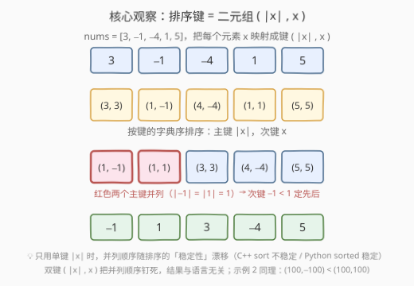
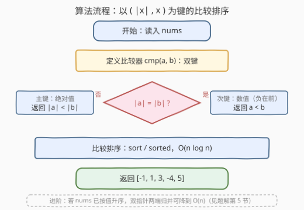

# 按绝对值排序数组

- **题目名称**：按绝对值排序数组
- **链接**：[3667. 按绝对值排序数组](https://leetcode.cn/problems/sort-array-by-absolute-value/)
- **难度**：简单
- **标签**：数组、数学、双指针、排序

## 1. 题目概述

> ⚠️ 本题为 LeetCode 付费题，题意描述根据官方示例用例与 hints 重建，可能与官方题面有出入。

给你一个整数数组 `nums`，请将数组元素按**绝对值升序**排序后返回。若两个元素的绝对值相同，则**数值较小的元素排在前面**（即负数在前）。

官方提示（hints）：「按绝对值对 `nums` 中的值排序。」

**示例 1**：

```text
输入：nums = [3,-1,-4,1,5]
输出：[-1,1,3,-4,5]
解释：各元素的绝对值为 [3,1,4,1,5]，按绝对值升序应为 1,1,3,4,5；
     -1 与 1 的绝对值并列，数值小者（-1）在前。
```

**示例 2**：

```text
输入：nums = [-100,100]
输出：[-100,100]
解释：两者绝对值均为 100，按数值升序保持 -100 在前。
```

**约束条件**（按题意重建，代码按通用范围编写）：

- $1 \le \text{nums.length} \le 10^5$
- $-10^9 \le \text{nums[i]} \le 10^9$

> 💡 **审题关键**：① 排序的**主键是 $|x|$ 而非 $x$**——直接 `sort(nums)` 只在无负数时凑巧正确；② 绝对值**并列**时需要一个确定的次级规则（本篇按数值升序，与两个官方示例一致），否则不同语言的排序稳定性会让并列顺序漂移。

---

## 2. 解题思路

### 2.1 暴力思路

最朴素的做法是**选择排序**：双重循环，每一轮从未排序区间里挑出绝对值最小的元素交换到区间头部。正确性显然，但 $O(n^2)$ 的比较次数在 $n = 10^5$ 时约 $10^{10}$ 次，必然超时。

它离正解只差一步：挑"绝对值最小"的过程不必手工双循环——交给任意 $O(n\log n)$ 的比较排序，把"谁小"的定义（比较器）换成绝对值即可。

### 2.2 核心观察：排序键 = 二元组 $(\,|x|,\ x\,)$



把每个元素 $x$ 映射到二元组 $(\,|x|,\ x\,)$，按**字典序**排序：

- **主键 $|x|$**：绝对值升序，题目的主体要求；
- **次键 $x$**：绝对值并列时数值小者（负数）在前，把并列顺序**钉死**。

这样比较器构成**全序**：任意两个元素都可比、比较结果无矛盾，`std::sort` 不会因非法比较器进入未定义行为。

> 💡 **为什么强调次键**：Python 的 `sorted` 是稳定排序，`key=abs` 时并列元素保持原相对顺序；C++ 的 `std::sort` **不保证稳定**，同样的单键写法在不同实现下并列顺序可能不同。只用单键 $|x|$，结果就依赖语言与实现；双键 $(|x|, x)$ 让输出**与语言无关地唯一确定**。若实际题面要求"并列保持原相对顺序"，去掉次键、改用稳定排序即可（C++ 用 `stable_sort`，Python 的 `sorted(key=abs)` 本身即稳定）。

### 2.3 算法流程



| 步骤 | 操作 | 说明 |
|------|------|------|
| ① 读入 | 获取数组 `nums` | $n$ 上至 $10^5$ |
| ② 定义比较器 | `cmp(a, b)`：$\lvert a\rvert \ne \lvert b\rvert$ 时按绝对值，相等时按 $a < b$ | 双键全序，见 2.2 |
| ③ 排序 | 以 `cmp` 为比较调用排序 | $O(n\log n)$ |
| ④ 返回 | 输出排序后的数组 | 原地或新数组均可 |

### 2.4 示例演算

以 `nums = [3,-1,-4,1,5]` 为例，先做键映射，再按键字典序排列：

| 元素 $x$ | 3 | -1 | -4 | 1 | 5 |
|---|---|---|---|---|---|
| 键 $(\,\lvert x\rvert,\ x\,)$ | $(3,3)$ | $(1,-1)$ | $(4,-4)$ | $(1,1)$ | $(5,5)$ |

按键排序：$(1,-1) < (1,1) < (3,3) < (4,-4) < (5,5)$——首字段并列的 $(1,-1)$ 与 $(1,1)$ 由次字段分出先后，于是输出：

```text
[-1, 1, 3, -4, 5]
```

示例 2 同理：$-100$ 与 $100$ 的键分别为 $(100,-100)$、$(100,100)$，主键并列、次键 $-100 < 100$，输出 `[-100,100]`。

---

## 3. 参考代码

### C++

```cpp
class Solution {
public:
    vector<int> sortArrayByAbsoluteValue(vector<int>& nums) {
        sort(nums.begin(), nums.end(), [](int a, int b) {
            if (abs(a) != abs(b)) return abs(a) < abs(b);  // 主键：绝对值升序
            return a < b;                                   // 次键：数值升序（负数在前）
        });
        return nums;
    }
};
```

> ⚠️ 若值域可能包含 `INT_MIN`（$-2^{31}$），`abs` 会溢出（结果仍为负，且是未定义行为），应先把元素转成 `long long` 再取绝对值；按本题重建约束 $|x| \le 10^9$ 无此风险。

### Python

```python
class Solution:
    def sortArrayByAbsoluteValue(self, nums: List[int]) -> List[int]:
        return sorted(nums, key=lambda x: (abs(x), x))
```

Python 元组比较天然就是字典序，一行完成双键排序。

---

## 4. 复杂度分析

| 维度 | 复杂度 | 说明 |
|------|--------|------|
| **时间复杂度** | $O(n \log n)$ | 比较排序的比较次数；单次比较 $O(1)$（两次 `abs` + 至多两次比较） |
| **空间复杂度** | $O(\log n)$ | C++ 内省排序的递归栈；Python 版返回新列表为 $O(n)$，改用 `nums.sort(key=...)` 原地时 Timsort 至多 $O(n)$ 辅助 |

---

## 5. 扩展：输入已有序时，双指针归并降到 $O(n)$

标签里的 **Two Pointers** 指向一个经典加强版：若 `nums` **已按数值升序**（常见变式），则无需比较排序——

- 负数段在左侧，其绝对值**从左到右递减**；
- 非负段在右侧，其绝对值**从左到右递增**。

两段各自"绝对值单调"，恰好可以**从两端向中间取较大者、从后往前填**（与 977. 有序数组的平方 同构）：

```python
def sort_by_abs_sorted(nums: list[int]) -> list[int]:
    # 前置条件：nums 已按数值升序
    n = len(nums)
    res = [0] * n
    i, j, k = 0, n - 1, n - 1
    while i <= j:
        if abs(nums[i]) > abs(nums[j]):
            res[k] = nums[i]; i += 1
        else:
            res[k] = nums[j]; j -= 1
        k -= 1
    return res
```

另一个方向：若值域较小（$|x| \le K$），可对绝对值做**计数排序**，$O(n + K)$ 完成重排，并按"每个绝对值上先输出负数再输出正数"还原并列次序。

> 💡 一般输入下 $O(n\log n)$ 已是比较排序的下界；$O(n)$ 的两条路都依赖额外结构（"已有序"或"值域受限"）。

---

## 6. 面试要点

**Q1：为什么比较器必须构成严格弱序？违反会怎样？**

> 排序的正确性建立在比较的传递性与非自反性上。若 `cmp(a,b)` 与 `cmp(b,a)` 同时为真（或结果随调用顺序变化），`std::sort` 是未定义行为，可能越界崩溃。本题双键比较先比绝对值再比数值，天然满足严格弱序。

**Q2：绝对值并列时，"双键"与"稳定排序"两种处理有何区别？**

> 双键 $(|x|,x)$ 的并列顺序由**元素值**决定，与输入顺序、语言、实现无关；稳定排序的并列顺序由**输入中的相对位置**决定。两者在 `[1,-1]` 这类用例上结果不同（双键得 `[-1,1]`，稳定得 `[1,-1]`）。写题前先确认判题规则，面试中主动指出这一点是加分项。

**Q3：`abs(INT_MIN)` 有什么坑？**

> `INT_MIN`（$-2^{31}$）没有对应的正数，取绝对值后仍为负（有符号溢出，C++ 中是 UB）。稳妥写法是转 `long long` 后再取绝对值，或单独特判。

**Q4：本题能否做到 $O(n)$？**

> 一般输入不能——比较排序有 $\Omega(n\log n)$ 下界。附加结构可破界：输入已按值有序时用双指针归并（见第 5 节）；值域 $|x| \le K$ 受限时用计数排序 $O(n+K)$。

**Q5：`sort` 与 `stable_sort` 怎么选？**

> 在意并列元素的相对顺序就用 `stable_sort`；若已用双键把次序"编码"进键里，普通 `sort` 即可且更省开销。本题参考代码走的是后者。

> 💡 **一句话总结**：3667 = 自定义比较器（键 $(|x|,x)$）+ $O(n\log n)$ 排序；并列次序是唯一容易翻车的细节，进阶版靠"输入已有序"解锁双指针 $O(n)$。

---

## 7. 同类练习题

- [977. 有序数组的平方](https://leetcode.cn/problems/squares-of-a-sorted-array/)：有序数组按"绝对值的平方"重排，第 5 节双指针归并的原型
- [973. 最接近原点的 K 个点](https://leetcode.cn/problems/k-closest-points-to-origin/)：按距离（绝对值思想的二维推广）自定义键做排序/堆选择
- [179. 最大数](https://leetcode.cn/problems/largest-number/)：自定义比较器构造拼接序，"比较器必须合法"的经典训练场
- [628. 三个数的最大乘积](https://leetcode.cn/problems/maximum-product-of-three-numbers/)：排序后结合负数与绝对值的位置分析极值
- [75. 颜色分类](https://leetcode.cn/problems/sort-colors/)：双指针原地重排数组的基本功
