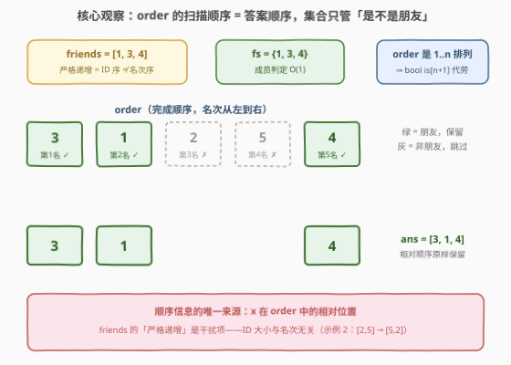
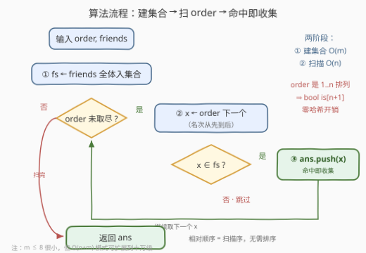

# 重排完成顺序

- **题目名称**：重排完成顺序
- **链接**：[3668. 重排完成顺序](https://leetcode.cn/problems/restore-finishing-order/)
- **难度**：简单
- **标签**：数组、哈希表

## 1. 题目概述

给你一个长度为 `n` 的整数数组 `order` 和一个整数数组 `friends`。

- `order` 包含从 `1` 到 `n` 的每个整数，且**恰好出现一次**，表示比赛中参赛者按照**完成顺序**的 ID。
- `friends` 包含你朋友们的 ID，按照**严格递增**的顺序排列。`friends` 中的每个 ID 都保证出现在 `order` 数组中。

请返回一个数组，包含你朋友们的 ID，按照他们的**完成顺序**排列。

**示例 1**：

```text
输入：order = [3,1,2,5,4], friends = [1,3,4]
输出：[3,1,4]
解释：完成顺序是 [3, 1, 2, 5, 4]。因此，你朋友的完成顺序是 [3, 1, 4]。
```

**示例 2**：

```text
输入：order = [1,4,5,3,2], friends = [2,5]
输出：[5,2]
解释：完成顺序是 [1, 4, 5, 3, 2]。因此，你朋友的完成顺序是 [5, 2]。
```

**约束条件**：

- $1 \le n = \text{len(order)} \le 100$
- `order` 包含从 $1$ 到 $n$ 的每个整数，且恰好出现一次
- $1 \le \text{len(friends)} \le \min(8,\ n)$
- $1 \le \text{friends}[i] \le n$
- `friends` 是严格递增的

> 💡 **审题关键**：① `friends` 的「严格递增」是 **ID 的大小序**，与名次**毫无关系**——示例 2 中 `friends = [2, 5]`，答案却是 `[5, 2]`，直接返回 `friends` 是本题最大的陷阱；② 顺序信息的**唯一来源**是 `order` 中元素的相对位置；③ `order` 是 $1..n$ 的**排列**，值域稠密无重复——这个性质后面能换掉通用哈希表。

---

## 2. 解题思路

### 2.1 暴力思路

最直觉的暴力有两种：

- **按 `order` 扫、线性查 `friends`**：对 `order` 的每个元素 `x`，扫一遍 `friends` 判断 `x` 是否为朋友，命中就收集。单次判定 $O(m)$，总计 $O(n \cdot m)$；
- **按 `friends` 查、再排序**：对每个朋友 `f`，扫 `order` 找到其下标 `pos[f]`（$O(n)$），再把 `friends` 按 `pos` 排序（$O(m \log m)$），总计 $O(m \cdot n + m \log m)$。

本题 $n \le 100$、$m \le 8$，两种暴力都能过。但第一种暴力的瓶颈——**"判定一个元素是否属于一个集合"**——恰好是哈希集合的看家本领：把 $O(m)$ 的线性查找压成 $O(1)$，整体降到 $O(n + m)$，$n$、$m$ 放大到十万级也不慌。

### 2.2 核心观察：扫描序即答案序，集合只管「是不是朋友」



**观察一：答案的顺序信息只存在于 `order` 中。** 要"按完成顺序"输出朋友，天然的做法就是**按 `order` 从左到右扫描**——先被扫到的朋友名次在前。"按相对顺序筛选"一趟完成，**全程无需任何排序**。`friends` 的递增序是纯干扰项。

**观察二：成员判定交给哈希集合。** 把 `friends` 装进集合 `fs`，扫描 `order` 时每个 `x` 只需一次 $O(1)$ 的 `x ∈ fs` 判断：命中（是朋友）→ 追加进答案；未命中 → 跳过。

**观察三：`order` 是排列 ⇒ `bool` 数组就是完美哈希表。** 元素值域恰为 $1..n$、稠密无冲突，开一个 `is[n+1]` 布尔数组，`friends` 的每个 `f` 置 `is[f] = true`，判定就是一次数组下标直达——零哈希、零冲突，是 [值域小而稠密时数组优于哈希表](../0301-0400/349_两个数组的交集.md) 的标准结论。

> 💡 一句话：本题 = 「按 `order` 扫描（顺序来源）」+「集合判定（筛选器）」。两段各司其职，一遍扫完。

### 2.3 算法流程图



**逻辑执行步骤**：

| 步骤 | 操作 | 说明 |
|------|------|------|
| ① 建集合 | `friends` 全体入 `fs`（或 `is[f] = true`） | $O(m)$，后续判定 $O(1)$ |
| ② 取元素 | 按从左到右扫 `order`，取当前元素 `x` | 名次从先到后 |
| ③ 判定收集 | `x ∈ fs` ? 是 → `ans.push_back(x)`；否 → 跳过 | 命中即追加，相对顺序天然保留 |
| ④ 终止 | `order` 扫完 → 返回 `ans` | 无需排序，无需后处理 |

> ⚠️ **唯一易错点**：把 `friends` 的"严格递增"当成有用信息去排序或直接输出。记住它是 **ID 序**，示例 2 就是反例。真正有用的隐藏性质是"`order` 是 $1..n$ 的排列"（支撑观察三）。

### 2.4 示例演算

**示例 1：`order = [3,1,2,5,4]`，`fs = {1,3,4}`**：

| 扫描到 x | 是朋友 ? | 动作 | ans |
|------|------|------|------|
| 3 | ✓ | 收集 | [3] |
| 1 | ✓ | 收集 | [3, 1] |
| 2 | ✗ | 跳过 | [3, 1] |
| 5 | ✗ | 跳过 | [3, 1] |
| 4 | ✓ | 收集 | [3, 1, 4] |

**示例 2：`order = [1,4,5,3,2]`，`fs = {2,5}`**：扫到 `5`（第 3 名）先收集，扫到 `2`（第 5 名）后收集 → **[5, 2]**。注意 `friends` 本身是 `[2, 5]`——若被"严格递增"带偏直接返回它，此例立刻翻车。

**边界**：`friends` 覆盖全体（如 `order = [2,1]`, `friends = [1,2]` → `[2,1]`，答案等于 `order` 本身）；`m = 1` 时答案是该朋友在 `order` 中的位置对应的单元素数组。

---

## 3. 参考代码

### C++

```cpp
class Solution {
public:
    vector<int> recoverOrder(vector<int>& order, vector<int>& friends) {
        int n = order.size();
        vector<bool> isFriend(n + 1, false);       // order 是 1..n 的排列 → bool 数组即哈希表
        for (int f : friends) isFriend[f] = true;

        vector<int> ans;
        ans.reserve(friends.size());               // 答案长度恰为 m，预分配
        for (int x : order)
            if (isFriend[x]) ans.push_back(x);     // 命中即收集，顺序天然正确
        return ans;
    }
};
```

> 💡 **写法要点**：
> - `isFriend` 开 `n + 1` 个，下标 `1..n` 直接对齐参赛者 ID，`[0]` 弃用——排列值域稠密时的标准开法；
> - `reserve(m)` 一次分配到位，避免 `push_back` 扩容（答案长度恰为 `friends.size()`）；
> - 若不想依赖排列性质（比如值域是任意整数），换成 `unordered_set<int> fs(friends.begin(), friends.end())`，判定写 `fs.count(x)`，其余不动。

### Python

```python
class Solution:
    def recoverOrder(self, order: List[int], friends: List[int]) -> List[int]:
        fs = set(friends)
        return [x for x in order if x in fs]
```

> 💡 **写法要点**：
> - 先落一个局部变量 `fs` 再写列表推导——若写成 `set(friends)` 内联在推导式里，**每轮迭代都会重建集合**，复杂度退化成 $O(n \cdot m)$；
> - `m ≤ 8` 且 `n ≤ 100`，本题用 `set` 足够优雅；追求极致可同样换 `is = [False] * (n + 1)`。

---

## 4. 复杂度分析

| 维度 | 复杂度 | 说明 |
|------|--------|------|
| **时间复杂度** | $O(n + m)$ | 建集合 $O(m)$ + 单趟扫描 $O(n)$，每个元素一次 $O(1)$ 判定 |
| **空间复杂度** | $O(n)$（bool 数组）| 哈希集合写法为 $O(m)$；输出数组不计入 |
| **对比暴力** | $O(n \cdot m)$ → $O(n + m)$ | $n, m$ 到十万级时暴力约 $10^{10}$ 必超时，本题写法毫发无损 |

---

## 5. 扩展：pos 排序法与多次查询变体

**方法 B：记录名次，对 `friends` 排序。** 扫 `order` 建 `pos[x]`（`x` 的名次），再把 `friends` 按 `pos[f]` 升序排序：

```python
pos = {x: i for i, x in enumerate(order)}
return sorted(friends, key=lambda f: pos[f])
```

复杂度 $O(n + m \log m)$，单次查询比扫描法多一个 $\log$。但它有自己的舞台——**`order` 固定、`friends` 查询多次**：`pos` 表建一次 $O(n)$，之后每次查询只需 $O(m \log m)$，连 `order` 都不用再碰。两法对比是"预处理换查询"的经典取舍。

**条件取反的变体**：若要输出**非朋友**的完成顺序，把判定条件取反（`if not isFriend[x]`）即可，框架分毫不动——这正是"扫描 + 谓词筛选"模式的通用性。

**数据规模的假想压力测试**：若 $n, m$ 均到 $10^5$ 且值域任意，扫描法 $O(n + m)$ 依旧从容，唯一变化是 `bool` 数组换回 `unordered_set`/`set`；暴力 $O(n \cdot m)$ 则彻底报废。**小数据练的是模式，不是过题。**

---

## 6. 面试要点

**Q1：为什么不能直接返回 `friends`？**

> `friends` 的"严格递增"是 **ID 的大小序**，与完成顺序无关。示例 2：`friends = [2, 5]`，但 5 是第 3 名、2 是第 5 名，答案为 `[5, 2]`。顺序信息的唯一来源是 `order` 中元素的相对位置。

**Q2：哈希集合和 bool 数组在这里怎么选？**

> 关键看**值域是否小而稠密**。`order` 是 $1..n$ 的排列，值域恰为 $1..n$ 无冲突——`bool is[n+1]` 下标直达、零哈希开销，是完美哈希；值域大而稀疏（任意整数、字符串）时才用通用哈希表。本题两者皆可，`bool` 数组更快。

**Q3：时间与空间复杂度各是多少？**

> 时间 $O(n + m)$：建集合 $O(m)$、扫 `order` 每元素 $O(1)$ 判定；空间 bool 数组 $O(n)$、哈希集合 $O(m)$。输出数组按惯例不计入空间。

**Q4：本题 `m ≤ 8`，暴力 $O(n \cdot m)$ 也能过，为什么还练哈希写法？**

> 数据规模是"玩具级"，练的是**模式**：筛选保序 + 集合判定是海量题目的骨架（交集、差集、去重、过滤流数据）。$n, m$ 拉到十万级时暴力是 $10^{10}$ 必超时，哈希写法毫发无损。面试官把数据改大，哈希版一行不用动。

**Q5：Python 里最常踩的坑是什么？**

> 把 `set(friends)` 内联写在列表推导式里：`[x for x in order if x in set(friends)]`——**每轮迭代重建集合**，整体退化成 $O(n \cdot m)$。集合要先落地成局部变量，一次构建、多次复用。

> 💡 **一句话总结**：3668 = 「按 `order` 扫描（顺序来源）」+「集合 $O(1)$ 判定（筛选器）」+「排列值域 → bool 数组当哈希表」。三个要点带走：递增序是干扰项、扫描序即答案序、值域稠密用数组。

---

## 7. 同类练习题

- [349. 两个数组的交集](https://leetcode.cn/problems/intersection-of-two-arrays/)（[题解](../0301-0400/349_两个数组的交集.md)）：哈希集合判存在的开山模板，与本题观察二同源
- [2215. 找出两数组的不同](https://leetcode.cn/problems/find-the-difference-of-two-arrays/)（[题解](../2201-2300/2215_找出两数组的不同.md)）：集合判定的双向版本，正向差集 + 反向差集
- [2248. 多个数组求交集](https://leetcode.cn/problems/intersection-of-multiple-arrays/)（[题解](../2201-2300/2248_多个数组求交集.md)）：集合/计数桶求交集，最后按升序输出——注意那里"升序"是题目要求，别与本题的干扰项混淆
- [1920. 基于排列构建数组](https://leetcode.cn/problems/build-array-from-permutation/)（[题解](../1901-2000/1920_基于排列构建数组.md)）：同为排列值域稠密场景，索引直取代替哈希
- [26. 删除有序数组中的重复项](https://leetcode.cn/problems/remove-duplicates-from-sorted-array/)（[题解](../0001-0100/26_删除有序数组中的重复项.md)）：原地"筛选并保持相对顺序"的双指针版本，与本题"保序过滤"同一骨架
